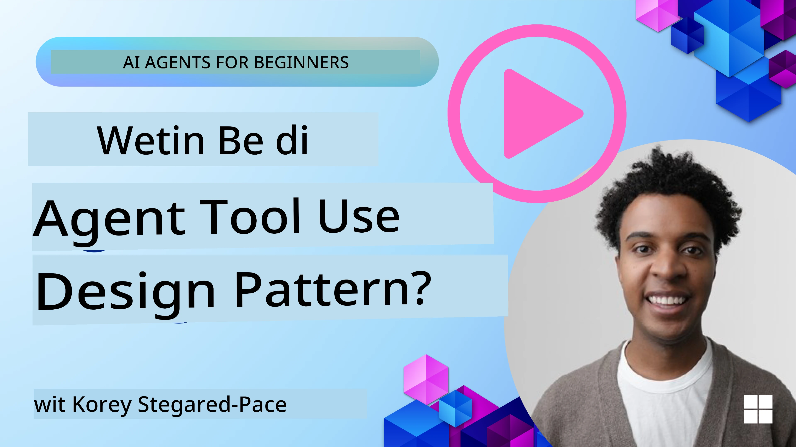
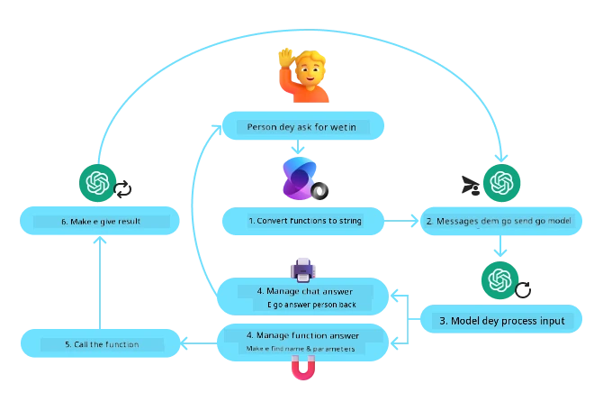
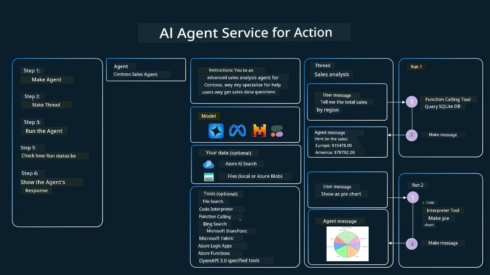

[](https://youtu.be/vieRiPRx-gI?si=cEZ8ApnT6Sus9rhn)

> _(Tap di piksha wey dey arriba to watch video for dis lesson)_

# Tool Use Design Pattern

Tools dey interesting because dem dey allow AI agents to get better scope for wetin dem fit do. Instead make di agent get limited set of actions wey e fit do, by adding tool, di agent fit now perform plenty kain kain actions. For dis chapter, we go yan about Tool Use Design Pattern, wey go show how AI agents fit use specific tools to meet their goals.

## Introduction

For dis lesson, we wan answer dis kind questions:

- Wetin be di tool use design pattern?
- Wetin be di cases wey e fit take apply?
- Wetin be di parts/building blocks we need to use to implement di design pattern?
- Wetin special things we for reason when we dey use Tool Use Design Pattern to build AI agents wey people fit trust?

## Learning Goals

After you finish dis lesson, you go fit:

- Define Tool Use Design Pattern and wetin e mean.
- Know di cases where you fit use Tool Use Design Pattern.
- Understand di key parts wey you need to implement di design pattern.
- Recognize wetin you suppose reason about to make sure AI agents wey use dis design pattern go dey trustworthy.

## Wetin be Tool Use Design Pattern?

Di **Tool Use Design Pattern** dey focus on how LLMs fit interact wit outside tools to fit reach certain goals. Tools na code wey agent fit run to perform actions. Tool fit be simple function like calculator, or e fit be API call to another service like stock price check or weather forecast. For AI agents matter, tools dem design to dey run when agents see **model-generated function calls**.

## Wetin be di cases wey e fit use for?

AI Agents fit use tools take finish serious work, find information, or make decisions. Di tool use design pattern dey mostly used for situations weh require interaction with outside systems like database, web service, or code interpreters. Dis kain ability fit help for many different cases including:

- **Dynamic Information Retrieval:** Agents fit ask outside APIs or databases for fresh fresh data (example, ask SQLite database for data analysis, check stock prices or weather information).
- **Code Execution and Interpretation:** Agents fit run code or scripts take solve math problems, make report, or run simulations.
- **Workflow Automation:** Make repetitive or multi-step work automatic by joining tools like task schedulers, email services, or data pipelines.
- **Customer Support:** Agents fit kin interact wit CRM systems, ticket platforms, or knowledge bases to solve customer questions.
- **Content Generation and Editing:** Agents fit use tools like grammar checkers, text summarizers, or content safety checkers to help content creation work.

## Wetin be di parts/building blocks wey you need to fit use tool use design pattern?

Dis building blocks dey allow AI agent to fit do plenty kain tasks. Make we check di key parts wey you need to implement Tool Use Design Pattern:

- **Function/Tool Schemas**: Detailed definitions of available tools, including function name, purpose, required parameters, and expected outputs. These schemas enable the LLM to understand what tools are available and how to construct valid requests.

- **Function Execution Logic**: Governs how and when tools are invoked based on the user’s intent and conversation context. This may include planner modules, routing mechanisms, or conditional flows that determine tool usage dynamically.

- **Message Handling System**: Components that manage the conversational flow between user inputs, LLM responses, tool calls, and tool outputs.

- **Tool Integration Framework**: Infrastructure that connects the agent to various tools, whether they are simple functions or complex external services.

- **Error Handling & Validation**: Mechanisms to handle failures in tool execution, validate parameters, and manage unexpected responses.

- **State Management**: Tracks conversation context, previous tool interactions, and persistent data to ensure consistency across multi-turn interactions.

Next, make we yan more about Function/Tool Calling.
 
### Function/Tool Calling

Function calling na di main way wey we take allow Large Language Models (LLMs) interact with tools. You go often see 'Function' and 'Tool' dey mean di same thing because 'functions' (blocks of reusable code) na di 'tools' wey agents dey use run their tasks. To make function code run, LLM go compare wetin user ask with function description. To do this, schema wey get descriptions of all available functions go send go LLM. LLM go choose the best function for di task and return its name and arguments. Di chosen function go run, e response go come back to LLM, wey go use am to respond to user.

For developers wey wan implement function calling for agents, you go need:

1. LLM model wey support function calling
2. Schema wey get function descriptions
3. Code for every function you describe

Make we use example of checking current time for one city:

1. **Start one LLM wey support function calling:**

    No all models dey support function calling, so e good make sure di LLM wey you dey use dey do am.     <a href="https://learn.microsoft.com/azure/ai-services/openai/how-to/function-calling" target="_blank">Azure OpenAI</a> dey support function calling. We fit start by creating OpenAI client for Azure OpenAI **Responses API** (di stable `/openai/v1/` endpoint — no `api_version` needed). 

    ```python
    # Start di OpenAI client for Azure OpenAI (Responses API, v1 endpoint)
    client = OpenAI(
        base_url=f"{os.environ['AZURE_OPENAI_ENDPOINT'].rstrip('/')}/openai/v1/",
        api_key=os.environ["AZURE_OPENAI_API_KEY"],
    )
    deployment_name = os.environ["AZURE_OPENAI_DEPLOYMENT"]
    ```

1. **Make Function Schema**:

    Next, we go define JSON schema wey get function name, description of wetin the function dey do, plus names and description of function parameters.
    Den, we go pass dis schema and user request to di client we create earlier, e request to find time for San Francisco. Wetin important to know be say **tool call** na wetin go return, **no** be final answer to question. As don tok before, LLM go return di name of di function wey e select for di task, plus di arguments wey go enter am.

    ```python
    # Function tok for di model to read (Responses API flat tool format)
    tools = [
        {
            "type": "function",
            "name": "get_current_time",
            "description": "Get the current time in a given location",
            "parameters": {
                "type": "object",
                "properties": {
                    "location": {
                        "type": "string",
                        "description": "The city name, e.g. San Francisco",
                    },
                },
                "required": ["location"],
            },
        }
    ]
    ```
   
    ```python
  
    # First message wey user send
    messages = [{"role": "user", "content": "What's the current time in San Francisco"}]

    # First API call: Ask di model make e use di function
    response = client.responses.create(
        model=deployment_name,
        input=messages,
        tools=tools,
        tool_choice="auto",
        store=False,
    )

    # Responses API dey return tool calls as function_call items for response.output.
    # Add dem join the conversation so di model go get full context for di next turn.
    messages += response.output

    print("Model's response:")
    print(response.output)
  
    ```

    ```bash
    Model's response:
    [ResponseFunctionToolCall(arguments='{"location":"San Francisco"}', call_id='call_pOsKdUlqvdyttYB67MOj434b', name='get_current_time', type='function_call')]
    ```
  
1. **Function code wey you go need to carry out di task:**

    Now wey LLM don choose which function to run, we suppose implement di code wey go carry out di task and run am.
    We fit write di code for Python to get current time. We go also need code to pull di name and arguments from response_message to get di final answer.

    ```python
      def get_current_time(location):
        """Get the current time for a given location"""
        print(f"get_current_time called with location: {location}")  
        location_lower = location.lower()
        
        for key, timezone in TIMEZONE_DATA.items():
            if key in location_lower:
                print(f"Timezone found for {key}")  
                current_time = datetime.now(ZoneInfo(timezone)).strftime("%I:%M %p")
                return json.dumps({
                    "location": location,
                    "current_time": current_time
                })
      
        print(f"No timezone data found for {location_lower}")  
        return json.dumps({"location": location, "current_time": "unknown"})
    ```

     ```python
    # Handle function calls
    tool_calls = [item for item in response.output if item.type == "function_call"]
    if tool_calls:
        for tool_call in tool_calls:
            if tool_call.name == "get_current_time":

                function_args = json.loads(tool_call.arguments)

                time_response = get_current_time(
                    location=function_args.get("location")
                )

                # Return di tool result as one function_call_output tin
                messages.append({
                    "type": "function_call_output",
                    "call_id": tool_call.call_id,
                    "output": time_response,
                })
    else:
        print("No tool calls were made by the model.")

    # Second API call: Comot di final response from di model
    final_response = client.responses.create(
        model=deployment_name,
        input=messages,
        tools=tools,
        store=False,
    )

    return final_response.output_text
     ```

     ```bash
      get_current_time called with location: San Francisco
      Timezone found for san francisco
      The current time in San Francisco is 09:24 AM.
     ```

Function Calling na di heart of most, if no be all agent tool use design, but to start am from scratch fit sometimes hard.
As we learn for [Lesson 2](../../../02-explore-agentic-frameworks), agentic frameworks dey give us pre-made building blocks to implement tool use.
 
## Tool Use Examples wit Agentic Frameworks

Here na some examples how you fit implement Tool Use Design Pattern using different agentic frameworks:

### Microsoft Agent Framework

<a href="https://learn.microsoft.com/azure/ai-services/agents/overview" target="_blank">Microsoft Agent Framework</a> na open-source AI framework for building AI agents. E make function calling easier by allowing you define tools as Python functions with `@tool` decorator. Di framework dey manage di back and forth talk between di model and your code. E still give access to pre-built tools like File Search and Code Interpreter through `FoundryChatClient`.

Di following diagram show di process of function calling wit Microsoft Agent Framework:



For Microsoft Agent Framework, tools na decorated functions. We fit turn di `get_current_time` function we see before into tool by using `@tool` decorator. Di framework go automatically serialize di function and parameters, create di schema to send to LLM.

```python
import os
from agent_framework import tool
from agent_framework.foundry import FoundryChatClient
from azure.identity import AzureCliCredential

@tool(approval_mode="never_require")
def get_current_time(location: str) -> str:
    """Get the current time for a given location"""
    ...

# Make di client
provider = FoundryChatClient(
    project_endpoint=os.environ["AZURE_AI_PROJECT_ENDPOINT"],
    model=os.environ["AZURE_AI_MODEL_DEPLOYMENT_NAME"],
    credential=AzureCliCredential(),
)

# Make one agent and run am wit di tool
agent = provider.as_agent(name="TimeAgent", instructions="Use available tools to answer questions.", tools=get_current_time)
response = await agent.run("What time is it?")
```
  
### Microsoft Foundry Agent Service

<a href="https://learn.microsoft.com/azure/ai-services/agents/overview" target="_blank">Microsoft Foundry Agent Service</a> na new agentic framework wey designers create to help developers build, deploy, and scale AI agents wey get high quality and fit expand without worry about the compute and storage resources. E good for enterprise apps because e be fully managed service wit enterprise grade security.

Compared to developing directly wit LLM API, Microsoft Foundry Agent Service get better things like:

- Automatic tool calling – you no need to parse tool call, run di tool, and handle di response; all dis happen server-side now
- Data wey dey secure – no need manage your own conversation state, you fit rely on threads to store all info wey you need
- Tools ready-to-use – Tools you fit use to interact wit your data source, like Bing, Azure AI Search, and Azure Functions.

Tools wey dey available for Microsoft Foundry Agent Service fit divide into two groups:

1. Knowledge Tools:
    - <a href="https://learn.microsoft.com/azure/ai-services/agents/how-to/tools/bing-grounding?tabs=python&pivots=overview" target="_blank">Grounding wit Bing Search</a>
    - <a href="https://learn.microsoft.com/azure/ai-services/agents/how-to/tools/file-search?tabs=python&pivots=overview" target="_blank">File Search</a>
    - <a href="https://learn.microsoft.com/azure/ai-services/agents/how-to/tools/azure-ai-search?tabs=azurecli%2Cpython&pivots=overview-azure-ai-search" target="_blank">Azure AI Search</a>

2. Action Tools:
    - <a href="https://learn.microsoft.com/azure/ai-services/agents/how-to/tools/function-calling?tabs=python&pivots=overview" target="_blank">Function Calling</a>
    - <a href="https://learn.microsoft.com/azure/ai-services/agents/how-to/tools/code-interpreter?tabs=python&pivots=overview" target="_blank">Code Interpreter</a>
    - <a href="https://learn.microsoft.com/azure/ai-services/agents/how-to/tools/openapi-spec?tabs=python&pivots=overview" target="_blank">OpenAPI defined tools</a>
    - <a href="https://learn.microsoft.com/azure/ai-services/agents/how-to/tools/azure-functions?pivots=overview" target="_blank">Azure Functions</a>

Di Agent Service allow us to use all dis tools together as one `toolset`. E also dey use `threads` wey dey track di history of messages from one particular conversation.

Imagine say you be sales agent for company wey dem call Contoso. You want build conversational agent wey fit answer questions about your sales data.

Di image wey follow show how you fit use Microsoft Foundry Agent Service take analyze your sales data:



To use any of these tools wit di service, we fit create client and define tool or toolset. To do dis practically, we fit use di following Python code. LLM go fit check di toolset and decide whether to use di user created function, `fetch_sales_data_using_sqlite_query`, or di pre-built Code Interpreter based on di user request.

```python 
import os
from azure.ai.projects import AIProjectClient
from azure.identity import DefaultAzureCredential
from fetch_sales_data_functions import fetch_sales_data_using_sqlite_query # fetch_sales_data_using_sqlite_query function wey you fit find for fetch_sales_data_functions.py file.
from azure.ai.projects.models import ToolSet, FunctionTool, CodeInterpreterTool

project_client = AIProjectClient.from_connection_string(
    credential=DefaultAzureCredential(),
    conn_str=os.environ["PROJECT_CONNECTION_STRING"],
)

# Start toolset
toolset = ToolSet()

# Start function calling agent wit di fetch_sales_data_using_sqlite_query function and add am for di toolset
fetch_data_function = FunctionTool(fetch_sales_data_using_sqlite_query)
toolset.add(fetch_data_function)

# Start Code Interpreter tool and add am for di toolset.
code_interpreter = CodeInterpreterTool()toolset.add(code_interpreter)

agent = project_client.agents.create_agent(
    model="gpt-4o-mini", name="my-agent", instructions="You are helpful agent", 
    toolset=toolset
)
```

## Wetin be di special things to reason when you dey use Tool Use Design Pattern to build trustworthy AI agents?

One common worry with SQL dynamically generated by LLMs na security, especially di risk of SQL injection or bad bad things like to drop or tamper with di database. Even though dis concerns dey real, dem fit block well if you configure database permissions correctly. For most databases, dis go mean to set database to read-only. For database services like PostgreSQL or Azure SQL, app for get read-only (SELECT) role.

Running di app for secure environment go add more protection. For enterprise wahala, data normally dey take comot and transform from operational systems into read-only database or data warehouse wey get user-friendly schema. Dis method make sure data dey secure, e dey do well for performance and access, plus app get limited, read-only access.

## Sample Codes

- Python: [Agent Framework](./code_samples/04-python-agent-framework.ipynb)
- .NET: [Agent Framework](./code_samples/04-dotnet-agent-framework.md)

## You get more questions about Tool Use Design Patterns?

Join [Microsoft Foundry Discord](https://discord.com/invite/ATgtXmAS5D) to meet other learners, attend office hours and get your AI Agents questions answer.

## Additional Resources

- <a href="https://microsoft.github.io/build-your-first-agent-with-azure-ai-agent-service-workshop/" target="_blank">Azure AI Agents Service Workshop</a>
- <a href="https://github.com/Azure-Samples/contoso-creative-writer/tree/main/docs/workshop" target="_blank">Contoso Creative Writer Multi-Agent Workshop</a>
- <a href="https://learn.microsoft.com/azure/ai-services/agents/overview" target="_blank">Microsoft Agent Framework Overview</a>


## Lesson Wey Come Before

[Understanding Agentic Design Patterns](../03-agentic-design-patterns/README.md)

## Next Lesson

[Agentic RAG](../05-agentic-rag/README.md)

---

<!-- CO-OP TRANSLATOR DISCLAIMER START -->
**Disclaimer**:
Dis document don translate wit AI translation service [Co-op Translator](https://github.com/Azure/co-op-translator). Even tho we dey try make am correct, abeg make you know say automated translation fit get errors or mistakes. Di original document for dia own language na im be di correct source. For important info, make person wey sabi human translation do am. We no go responsible for any misunderstanding or wrong understanding wey fit happen because of dis translation.
<!-- CO-OP TRANSLATOR DISCLAIMER END -->