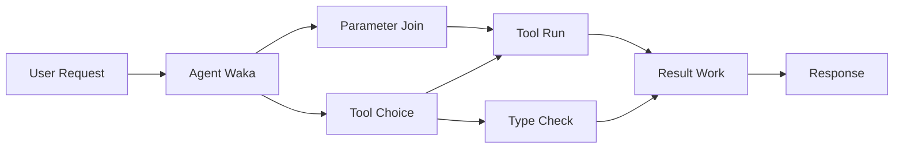

# 🛠️ Advanced Tool Use with Azure OpenAI (Responses API) (.NET)

## 📋 Learning Objectives

Dis notebook dey show how enterprise-level tool integration go be wit Microsoft Agent Framework for .NET plus Azure OpenAI (Responses API). You go learn how to build correct agents wey get plenty specialized tools, using C# strong typing and .NET enterprise features.

### Advanced Tool Capabilities We Go Master

- 🔧 **Multi-Tool Architecture**: How to build agents wey get many specialized capabilities
- 🎯 **Type-Safe Tool Execution**: How to take advantage of C# compile-time validation
- 📊 **Enterprise Tool Patterns**: Design correct tools for production and handle errors well
- 🔗 **Tool Composition**: How to combine tools for complex business work dem

## 🎯 .NET Tool Architecture Benefits

### Enterprise Tool Features

- **Compile-Time Validation**: Strong typing wey dey make sure tool parameters correct
- **Dependency Injection**: IoC container wey integrate well for tool management
- **Async/Await Patterns**: Non-blocking tool running wey dey use resources well
- **Structured Logging**: Built-in logging wey dey monitor tool execution

### Production-Ready Patterns

- **Exception Handling**: Complete error management wey use typed exceptions
- **Resource Management**: Proper disposal strategies and memory handling
- **Performance Monitoring**: Built-in metrics and performance counters
- **Configuration Management**: Type-safe configuration wey dey validated

## 🔧 Technical Architecture

### Core .NET Tool Components

- **Microsoft.Extensions.AI**: Unified tool abstraction layer
- **Microsoft.Agents.AI**: Enterprise-grade tool orchestration
- **Azure OpenAI (Responses API)**: High-performance API client wey get connection pooling

### Tool Execution Pipeline



## 🛠️ Tool Categories & Patterns

### 1. **Data Processing Tools**

- **Input Validation**: Strong typing plus data annotations
- **Transform Operations**: Type-safe data conversion and formatting
- **Business Logic**: Domain-specific calculation and analysis tools
- **Output Formatting**: Structured response generation

### 2. **Integration Tools** 

- **API Connectors**: RESTful service integration with HttpClient
- **Database Tools**: Entity Framework integration for data access
- **File Operations**: Secure file system operations with validation
- **External Services**: Third-party service integration patterns

### 3. **Utility Tools**

- **Text Processing**: String manipulation and formatting utilities
- **Date/Time Operations**: Culture-aware date/time calculations
- **Mathematical Tools**: Precision calculations and statistical operations
- **Validation Tools**: Business rule validation and data verification

You ready to build enterprise-grade agents with strong, type-safe tool powers for .NET? Make we start to architect professional-grade solutions! 🏢⚡

## 🚀 Getting Started

### Prerequisites

- [.NET 10 SDK](https://dotnet.microsoft.com/download/dotnet/10.0) or higher
- One [Azure subscription](https://azure.microsoft.com/free/) wey get Azure OpenAI resource plus model deployment
- The [Azure CLI](https://learn.microsoft.com/cli/azure/install-azure-cli) — signin wit `az login`

### Required Environment Variables

```bash
# zsh/bash
export AZURE_OPENAI_ENDPOINT=https://<your-resource>.openai.azure.com
export AZURE_OPENAI_DEPLOYMENT=gpt-4o-mini
# Den login so AzureCliCredential fit get token
az login
```

```powershell
# PowerShell
$env:AZURE_OPENAI_ENDPOINT = "https://<your-resource>.openai.azure.com"
$env:AZURE_OPENAI_DEPLOYMENT = "gpt-4o-mini"
# Den sign in make AzureCliCredential fit comot token
az login
```

### Sample Code

To run the code example,

```bash
# zsh/bash
chmod +x ./04-dotnet-agent-framework.cs
./04-dotnet-agent-framework.cs
```

Or use dotnet CLI:

```bash
dotnet run ./04-dotnet-agent-framework.cs
```

Check [`04-dotnet-agent-framework.cs`](../../../../04-tool-use/code_samples/04-dotnet-agent-framework.cs) for complete code.

```csharp
#!/usr/bin/dotnet run

#:package Microsoft.Extensions.AI@10.*
#:package Microsoft.Agents.AI.OpenAI@1.*-*
#:package Azure.AI.OpenAI@2.1.0
#:package Azure.Identity@1.13.1

using System.ComponentModel;

using Microsoft.Agents.AI;
using Microsoft.Extensions.AI;

using Azure.AI.OpenAI;
using Azure.Identity;

// Tool Function: Random Destination Generator
// This static method will be available to the agent as a callable tool
// The [Description] attribute helps the AI understand when to use this function
// This demonstrates how to create custom tools for AI agents
[Description("Provides a random vacation destination.")]
static string GetRandomDestination()
{
    // List of popular vacation destinations around the world
    // The agent will randomly select from these options
    var destinations = new List<string>
    {
        "Paris, France",
        "Tokyo, Japan",
        "New York City, USA",
        "Sydney, Australia",
        "Rome, Italy",
        "Barcelona, Spain",
        "Cape Town, South Africa",
        "Rio de Janeiro, Brazil",
        "Bangkok, Thailand",
        "Vancouver, Canada"
    };

    // Generate random index and return selected destination
    // Uses System.Random for simple random selection
    var random = new Random();
    int index = random.Next(destinations.Count);
    return destinations[index];
}

// Azure OpenAI with the Responses API (stable v1 endpoint). Sign in with `az login`.
var azureEndpoint = Environment.GetEnvironmentVariable("AZURE_OPENAI_ENDPOINT")
    ?? throw new InvalidOperationException("AZURE_OPENAI_ENDPOINT is not set.");
var deployment = Environment.GetEnvironmentVariable("AZURE_OPENAI_DEPLOYMENT") ?? "gpt-4o-mini";

var azureClient = new AzureOpenAIClient(new Uri(azureEndpoint), new AzureCliCredential());

// Define Agent Identity and Comprehensive Instructions
// Agent name for identification and logging purposes
var AGENT_NAME = "TravelAgent";

// Detailed instructions that define the agent's personality, capabilities, and behavior
// This system prompt shapes how the agent responds and interacts with users
var AGENT_INSTRUCTIONS = """
You are a helpful AI Agent that can help plan vacations for customers.

Important: When users specify a destination, always plan for that location. Only suggest random destinations when the user hasn't specified a preference.

When the conversation begins, introduce yourself with this message:
"Hello! I'm your TravelAgent assistant. I can help plan vacations and suggest interesting destinations for you. Here are some things you can ask me:
1. Plan a day trip to a specific location
2. Suggest a random vacation destination
3. Find destinations with specific features (beaches, mountains, historical sites, etc.)
4. Plan an alternative trip if you don't like my first suggestion

What kind of trip would you like me to help you plan today?"

Always prioritize user preferences. If they mention a specific destination like "Bali" or "Paris," focus your planning on that location rather than suggesting alternatives.
""";

// Create AI Agent with Advanced Travel Planning Capabilities
// Get the Responses client for the deployment and create the AI agent
// Configure agent with name, detailed instructions, and available tools
// This demonstrates the .NET agent creation pattern with full configuration
AIAgent agent = azureClient
    .GetOpenAIResponseClient(deployment)
    .CreateAIAgent(
        name: AGENT_NAME,
        instructions: AGENT_INSTRUCTIONS,
        tools: [AIFunctionFactory.Create(GetRandomDestination)]
    );

// Create New Conversation Thread for Context Management
// Initialize a new conversation thread to maintain context across multiple interactions
// Threads enable the agent to remember previous exchanges and maintain conversational state
// This is essential for multi-turn conversations and contextual understanding
AgentThread thread = agent.GetNewThread();

// Execute Agent: First Travel Planning Request
// Run the agent with an initial request that will likely trigger the random destination tool
// The agent will analyze the request, use the GetRandomDestination tool, and create an itinerary
// Using the thread parameter maintains conversation context for subsequent interactions
await foreach (var update in agent.RunStreamingAsync("Plan me a day trip", thread))
{
    await Task.Delay(10);
    Console.Write(update);
}

Console.WriteLine();

// Execute Agent: Follow-up Request with Context Awareness
// Demonstrate contextual conversation by referencing the previous response
// The agent remembers the previous destination suggestion and will provide an alternative
// This showcases the power of conversation threads and contextual understanding in .NET agents
await foreach (var update in agent.RunStreamingAsync("I don't like that destination. Plan me another vacation.", thread))
{
    await Task.Delay(10);
    Console.Write(update);
}
```

---

<!-- CO-OP TRANSLATOR DISCLAIMER START -->
**Disclaimer**:
Dis document don translate wit AI translation service [Co-op Translator](https://github.com/Azure/co-op-translator). Even tho we dey try make am correct, abeg make you know say automated translation fit get errors or mistakes. Di original document for dia own language na im be di correct source. For important info, make person wey sabi human translation do am. We no go responsible for any misunderstanding or wrong understanding wey fit happen because of dis translation.
<!-- CO-OP TRANSLATOR DISCLAIMER END -->