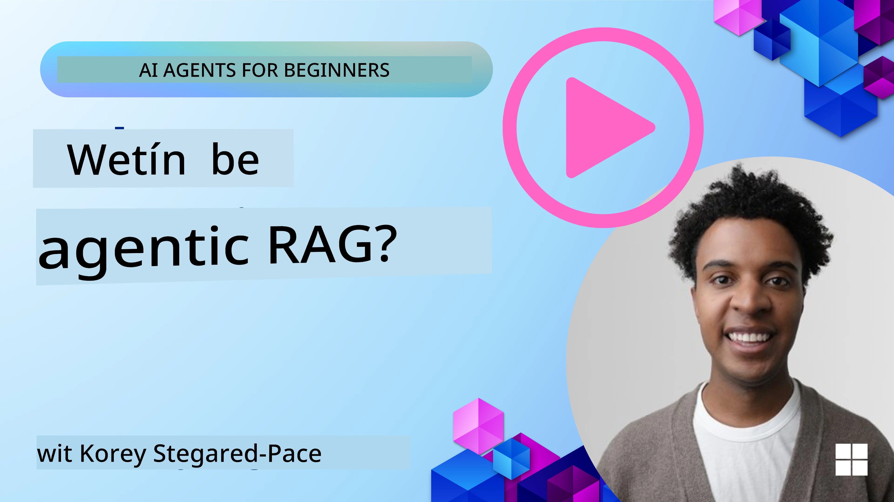
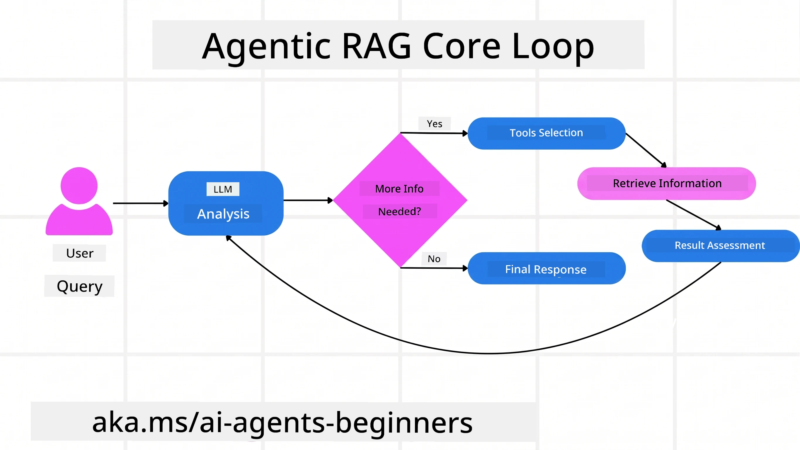
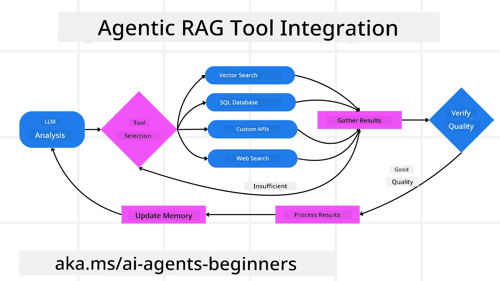
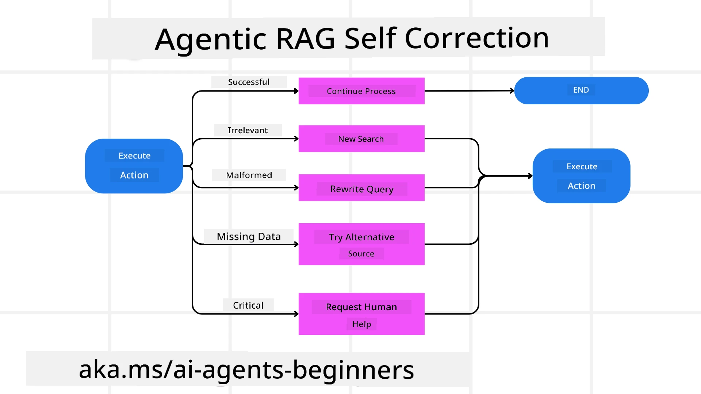
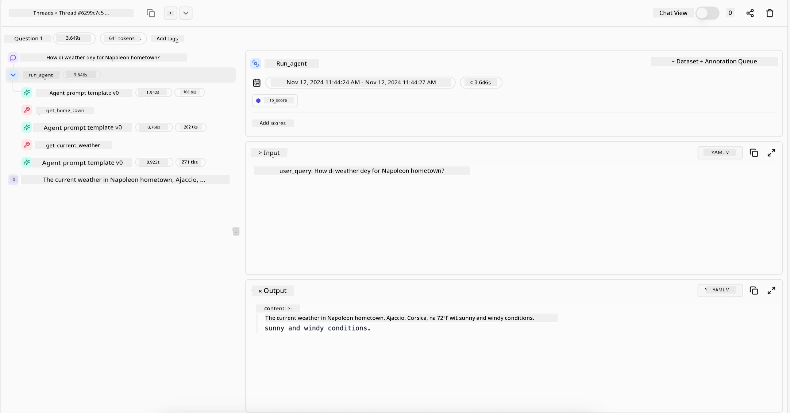

> _(Click di pikshua wey dey up top to watch video for dis lesson)_

# Agentic RAG

Dis lesson go show you full full tins about Agentic Retrieval-Augmented Generation (Agentic RAG), one new AI style wey big language models (LLMs) dey plan their next step by themself, while dem dey collect info from outside source dem. E no be like normal retrieval-then-read way, Agentic RAG dey make repeated calls to the LLM, join tool or function calls and dem get structured output. The system dey check results, correct queries, call more tools if e need to, and e go continue dat loop until e find good solution.

## Introduction

Dis lesson go cover

- **Understand Agentic RAG:**  Learn about dis new style for AI wey big language models (LLMs) dey plan their next steps by themself while dem dey pull info from outside data sources.
- **Grasp Iterative Maker-Checker Style:** Understand how the LLM dey get repeated calls, join tool or function calls and structured outputs to improve correctness and handle wrong queries.
- **Explore Practical Applications:** Find out where Agentic RAG dey shine sharp, like for correctness-first environment, complex database waka, and long workflows.

## Learning Goals

After you finish dis lesson, you go sabi how to/understand:

- **Understanding Agentic RAG:** Know about dis new style wey LLMs dey plan their next moves while dem dey pull info from outside data sources.
- **Iterative Maker-Checker Style:** Understand how the loop of calls to LLM dey work with tool calls and structured outputs to improve correctness.
- **Owning the Reasoning Process:** Know how the system fit own how e reason, dey make decision how e go handle problems without following pre-set path.
- **Workflow:** Understand how agentic model dey decide on him own to find market trend reports, competitor data, match internal sales data, put everything together and check the plan.
- **Iterative Loops, Tool Integration, and Memory:** Learn how the system use loop pattern, dey keep state and memory across steps to avoid repeating and fit make better decisions.
- **Handling Failure Modes and Self-Correction:** Check how system fit fix itself well, dey do iteration and re-query, use diagnostic tools, and fall back on human supervision.
- **Boundaries of Agency:** Know the limit wey Agentic RAG get, focusing on domain-specific freedom, infrastructure reliance, and respect for rules.
- **Practical Use Cases and Value:** Find where Agentic RAG dey strong, like for correctness-first environment, complex data interactions, and extended workflows.
- **Governance, Transparency, and Trust:** Learn why governance and transparency important, including explainable reasoning, bias control, and human oversight.

## Wetin be Agentic RAG?

Agentic Retrieval-Augmented Generation (Agentic RAG) be new AI style wey big language models (LLMs) dey plan their next movement by theirself while dem dey collect info from outside source dem. E no be like static retrieval-then-read way, Agentic RAG get iterative calls to LLM, join tool or function calls and structured outputs. Di system dey check results, correct queries, call more tools if need, and keep dis cycle until e reach beta answer. Dis maker-checker style go improve correctness, handle bad queries, and deliver top quality results.

The system dey own how e reason, dey rewrite queries wey fail, dey choose different retrieval ways, dey use many tools—like vector search inside Azure AI Search, SQL databases, or custom APIs—before e finalize answer. Wetin make agentic system special be say e fit own how e take reason. Normal RAG system dey follow pre-set path but agentic system dey decide e own steps based on info quality wey e get.

## Define Agentic Retrieval-Augmented Generation (Agentic RAG)

Agentic Retrieval-Augmented Generation (Agentic RAG) na new AI style wey no just dey pull info from outside data sources but LLMs go plan their next movements by their own. E no be like static retrieval-then-read or pre-scripted sequences, Agentic RAG get loop of iterative calls to LLM and join tool or function calls plus structured outputs. Each time, the system go check result, decide to fix queries, call more tools if e need, and continue until e find correct solution.

Dis maker-checker style dey designed to improve correctness, handle bad queries for structured databases (like NL2SQL), and produce balanced, high-quality results. Instead of only using carefully made prompt chains, di system go own how e reason. E fit rewrite queries wey fail, choose different retrieval ways, use many tools—like vector search for Azure AI Search, SQL databases, or custom APIs—before e finalize answer. Dis one mean say e no need complex orchestration frameworks. Simple loop of “LLM call → tool use → LLM call → …” fit produce sophisticated and well-grounded outputs.

## Owning the Reasoning Process

Wetin make system “agentic” na say e fit own how e reason. Normal RAG dem go dey depend on humans to set path for model: chain-of-thought wey show wetin to retrieve and when.
But when system truly agentic, e go decide on im own how e wan solve problem. E no be only to run script; e go dey decide e own steps based on quality of info wey e find.
For example, if dem ask am to create product launch strategy, e no go depend only on prompt wey talk everything about research and decision making. Instead, agentic model go decide by itself to:

1. Retrieve current market trend reports using Bing Web Grounding
2. Identify relevant competitor data using Azure AI Search.
3.	Match historical internal sales metrics using Azure SQL Database.
4. Put findings together into one strategy arranged by Azure OpenAI Service.
5.	Check the strategy for any mistake or gaps, do another round of retrieval if e need.
All dis steps—correcting queries, choosing sources, repeating until dem “happy” with answer—model dey decide, no human script dem.

## Iterative Loops, Tool Integration, and Memory

Agentic system dey base on loop interaction pattern:

- **Initial Call:** User goal (user prompt) go give LLM.
- **Tool Invocation:** If model see say info dey miss or instructions no clear, e go pick tool or way—like vector database query (Azure AI Search Hybrid search over private data) or structured SQL call—to get more context.
- **Assessment & Refinement:** After e see data wey come back, model go decide if info enough. If no, e go correct query, try other tool, or change how e dey go about am.
- **Repeat Until Satisfied:** This cycle go continue until model sure say e get enough clear evidence to give final well-reasoned response.
- **Memory & State:** Because system dey keep state and memory from step to step, e fit remember previous tries and results, avoid repeating loop and fit make better decisions as e dey progress.

As time dey go, dis build better understanding, fit make model handle complex multi-step task well without human constant waka interfere or change prompt.

## Handling Failure Modes and Self-Correction

Agentic RAG autonomy get strong self-correction ways. When system jam wahala—like to retrieve irrelevant docs or deal with wrong queries—e fit:

- **Iterate and Re-Query:** Instead of to return useless answer, model go try new search way, rewrite database queries, or check other data sets.
- **Use Diagnostic Tools:** System fit call extra functions to help debug reason steps or check if retrieved data correct. Tools like Azure AI Tracing go important to help with good observability and monitoring.
- **Fallback on Human Oversight:** For big big or repeated failing cases, model fit show say e dey unsure and ask human to help. After human give corrective feedback, model fit use am for next time.

Dis iterative and dynamic style allow model to dey improve always, e no be one-time system but e dey learn from im mistakes for that session.

## Boundaries of Agency

Even though e get autonomy for task, Agentic RAG no be Artificial General Intelligence. E “agentic” power dey limited to tools, data sources, and rules wey human developers put. E no fit create im own tools or waka outside domain wey dem set. E sabi better for arranging resources wey e get dynamically.
Key differences from higher level AI be:

1. **Domain-Specific Autonomy:** Agentic RAG systems dey focus on user goals inside known domain, e go use strategies like query rewrite or tool choice to improve results.
2. **Infrastructure-Dependent:** System power dey depend on tools and data dem put together by developers. E no fit pass dis limit without human help.
3. **Respect for Guardrails:** Ethics rules, compliance, and business policies still very important. Agent freedom dey always limited by safety and oversight (make we hope so).

## Practical Use Cases and Value

Agentic RAG dey shine well for place wey need iterative correction and exactness:

1. **Correctness-First Environments:** For compliance checking, regulatory analysis, or legal research, agentic model fit dey verify facts many times, check many sources, and rewrite queries until e bring full vetted answer.
2. **Complex Database Interactions:** For structured data way queries fit fail or need fix, system fit correct queries on im own using Azure SQL or Microsoft Fabric OneLake, make final retrieval match user intention.
3. **Extended Workflows:** Longer sessions fit change as new info come. Agentic RAG fit add new data always, adjust strategies as e dey learn more about the problem.

## Governance, Transparency, and Trust

As dem systems dey more autonomous for how e reason, governance and transparency dey very important:

- **Explainable Reasoning:** Model fit show audit trail of queries e make, sources e check, and reasoning steps to show how e reach conclusion. Tools like Azure AI Content Safety and Azure AI Tracing / GenAIOps fit help keep transparency and reduce risk.
- **Bias Control and Balanced Retrieval:** Developers fit adjust retrieval ways to balance data sources, dey audit output to find bias or wrong pattern using custom models for advanced data science groups using Azure Machine Learning.
- **Human Oversight and Compliance:** For sensitive work, human review still important. Agentic RAG no go replace human judgment for big decision—e just fit help am by giving more fully vetted options.

To get tools wey fit give clear record of actions na important. Without am, e fit hard to debug multi-step process. See example from Literal AI (company behind Chainlit) for one Agent run:

## Conclusion

Agentic RAG na natural next step for how AI systems dey handle complex, data-heavy tasks. By using loop interaction, choosing tools on im own, and correcting queries until e get top-quality answer, system dey move beyond static prompt-following to become better, context-aware decision maker. Even though e still get limit set by human infrastructure and ethics, these agentic powers make AI interactions richer, more dynamic and more useful for both business and end users.

### You get More Questions about Agentic RAG?

Join [Microsoft Foundry Discord](https://discord.com/invite/ATgtXmAS5D) to meet other learners, attend office hours and get your AI Agents questions answer.

## Additional Resources

- <a href="https://learn.microsoft.com/training/modules/use-own-data-azure-openai" target="_blank">How to Implement Retrieval Augmented Generation (RAG) with Azure OpenAI Service: Learn how to use your own data within Azure OpenAI Service. Dis Microsoft Learn module get full guide for implementing RAG</a>
- <a href="https://learn.microsoft.com/azure/ai-studio/concepts/evaluation-approach-gen-ai" target="_blank">Evaluation of generative AI apps with Microsoft Foundry: Dis article cover evaluation and comparison of models on public datasets, including Agentic AI apps and RAG architectures</a>
- <a href="https://weaviate.io/blog/what-is-agentic-rag" target="_blank">Wetn be Agentic RAG | Weaviate</a>
- <a href="https://ragaboutit.com/agentic-rag-a-complete-guide-to-agent-based-retrieval-augmented-generation/" target="_blank">Agentic RAG: Complete Guide to Agent-Based Retrieval Augmented Generation – News from generation RAG</a>

- <a href="https://huggingface.co/learn/cookbook/agent_rag" target="_blank">Agentic RAG: turbocharge your RAG wit query reformulation and self-query! Hugging Face Open-Source AI Cookbook</a>
- <a href="https://youtu.be/aQ4yQXeB1Ss?si=2HUqBzHoeB5tR04U" target="_blank">Adding Agentic Layers to RAG</a>
- <a href="https://www.youtube.com/watch?v=zeAyuLc_f3Q&t=244s" target="_blank">The Future of Knowledge Assistants: Jerry Liu</a>
- <a href="https://www.youtube.com/watch?v=AOSjiXP1jmQ" target="_blank">How to Build Agentic RAG Systems</a>
- <a href="https://ignite.microsoft.com/sessions/BRK102?source=sessions" target="_blank">Using Microsoft Foundry Agent Service to scale your AI agents</a>

### Academic Papers

- <a href="https://arxiv.org/abs/2303.17651" target="_blank">2303.17651 Self-Refine: Iterative Refinement wit Self-Feedback</a>
- <a href="https://arxiv.org/abs/2303.11366" target="_blank">2303.11366 Reflexion: Language Agents wit Verbal Reinforcement Learning</a>
- <a href="https://arxiv.org/abs/2305.11738" target="_blank">2305.11738 CRITIC: Large Language Models Fit Self-Correct wit Tool-Interactive Critiquing</a>
- <a href="https://arxiv.org/abs/2501.09136" target="_blank">2501.09136 Agentic Retrieval-Augmented Generation: A Survey on Agentic RAG</a>

## Previous Lesson

[Tool Use Design Pattern](../04-tool-use/README.md)

## Next Lesson

[Building Trustworthy AI Agents](../06-building-trustworthy-agents/README.md)

---

<!-- CO-OP TRANSLATOR DISCLAIMER START -->
**Disclaimer**:
Dis document don translate wit AI translation service [Co-op Translator](https://github.com/Azure/co-op-translator). Even tho we dey try make am correct, abeg make you know say automated translation fit get errors or mistakes. Di original document for dia own language na im be di correct source. For important info, make person wey sabi human translation do am. We no go responsible for any misunderstanding or wrong understanding wey fit happen because of dis translation.
<!-- CO-OP TRANSLATOR DISCLAIMER END -->