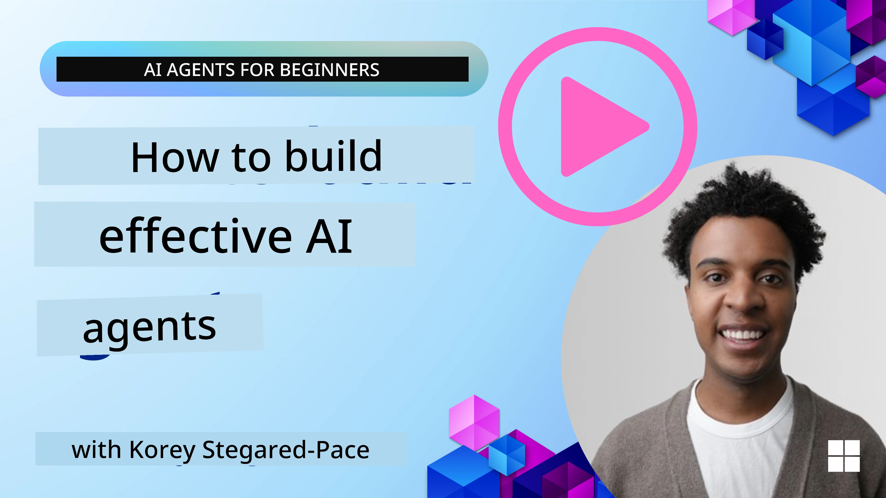
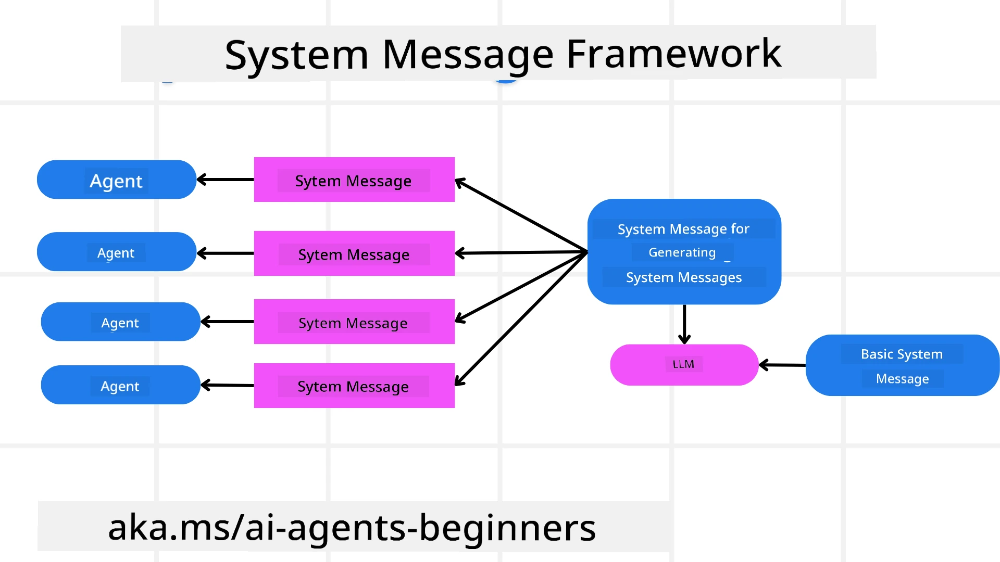
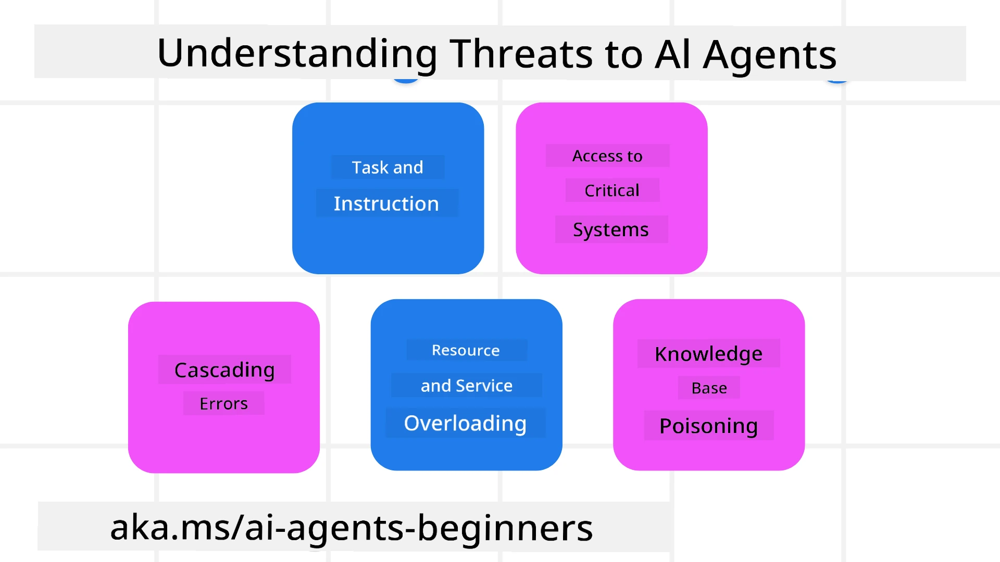
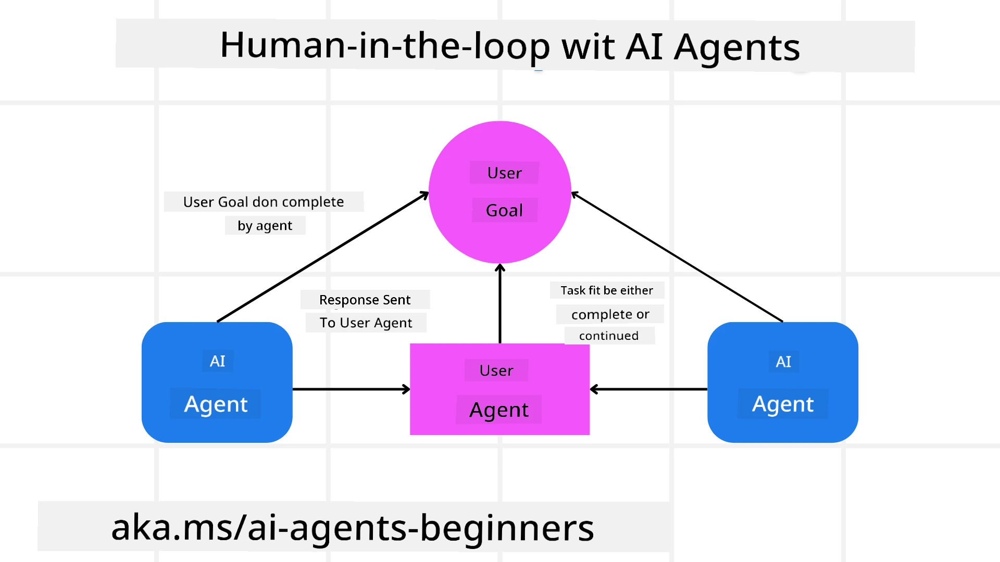

[](https://youtu.be/iZKkMEGBCUQ?si=Q-kEbcyHUMPoHp8L)

> _(Click di image wey dey up top to watch video of dis lesson)_

# Building Trustworthy AI Agents

## Introduction

Dis lesson go cover:

- How to build and deploy AI Agents wey safe and dey work well
- Important security tins to sabi when you dey develop AI Agents.
- How to keep data and user privacy safe when you dey develop AI Agents.

## Learning Goals

After you don finish dis lesson, you go sabi how to:

- Know and reduce risk wen you dey create AI Agents.
- Put security measures to make sure say data and access dey managed well.
- Create AI Agents wey go keep data privacy and provide beta user experience.

## Safety

Make we first check how to build safe agentic applications. Safety mean say AI agent go perform like how e suppose be. As we dey build agentic applications, we get ways and tools to make safety plenty:

### Building a System Message Framework

If you don ever build AI app using Large Language Models (LLMs), you sabi how important e be to design strong system prompt or system message. These prompts dey set the meta rules, instructions, and guidelines on how the LLM go take interact with user and data.

For AI Agents, system prompt get even more importance because AI Agents go need clear instructions to finish the tasks wey we design for dem.

To create system prompts wey fit grow well, we fit use system message framework to build one or more agents for our app:



#### Step 1: Create a Meta System Message 

The meta prompt go dey used by LLM to generate system prompts for the agents wey we create. We dey design am as template so dat we fit quickly create many agents if e need.

Dis na example of meta system message we go give LLM:

```plaintext
You are an expert at creating AI agent assistants. 
You will be provided a company name, role, responsibilities and other
information that you will use to provide a system prompt for.
To create the system prompt, be descriptive as possible and provide a structure that a system using an LLM can better understand the role and responsibilities of the AI assistant. 
```

#### Step 2: Create a basic prompt

Di next step na to create basic prompt wey go describe AI Agent. You suppose include the agent role, wetin the agent go do, plus any oda responsibilities wey the agent get.

Dis na example:

```plaintext
You are a travel agent for Contoso Travel that is great at booking flights for customers. To help customers you can perform the following tasks: lookup available flights, book flights, ask for preferences in seating and times for flights, cancel any previously booked flights and alert customers on any delays or cancellations of flights.  
```

#### Step 3: Provide Basic System Message to LLM

Now we fit optimize dis system message by giving di meta system message as system message plus our basic system message.

Dis one go create system message wey beta for guiding our AI agents:

```markdown
**Company Name:** Contoso Travel  
**Role:** Travel Agent Assistant

**Objective:**  
You are an AI-powered travel agent assistant for Contoso Travel, specializing in booking flights and providing exceptional customer service. Your main goal is to assist customers in finding, booking, and managing their flights, all while ensuring that their preferences and needs are met efficiently.

**Key Responsibilities:**

1. **Flight Lookup:**
    
    - Assist customers in searching for available flights based on their specified destination, dates, and any other relevant preferences.
    - Provide a list of options, including flight times, airlines, layovers, and pricing.
2. **Flight Booking:**
    
    - Facilitate the booking of flights for customers, ensuring that all details are correctly entered into the system.
    - Confirm bookings and provide customers with their itinerary, including confirmation numbers and any other pertinent information.
3. **Customer Preference Inquiry:**
    
    - Actively ask customers for their preferences regarding seating (e.g., aisle, window, extra legroom) and preferred times for flights (e.g., morning, afternoon, evening).
    - Record these preferences for future reference and tailor suggestions accordingly.
4. **Flight Cancellation:**
    
    - Assist customers in canceling previously booked flights if needed, following company policies and procedures.
    - Notify customers of any necessary refunds or additional steps that may be required for cancellations.
5. **Flight Monitoring:**
    
    - Monitor the status of booked flights and alert customers in real-time about any delays, cancellations, or changes to their flight schedule.
    - Provide updates through preferred communication channels (e.g., email, SMS) as needed.

**Tone and Style:**

- Maintain a friendly, professional, and approachable demeanor in all interactions with customers.
- Ensure that all communication is clear, informative, and tailored to the customer's specific needs and inquiries.

**User Interaction Instructions:**

- Respond to customer queries promptly and accurately.
- Use a conversational style while ensuring professionalism.
- Prioritize customer satisfaction by being attentive, empathetic, and proactive in all assistance provided.

**Additional Notes:**

- Stay updated on any changes to airline policies, travel restrictions, and other relevant information that could impact flight bookings and customer experience.
- Use clear and concise language to explain options and processes, avoiding jargon where possible for better customer understanding.

This AI assistant is designed to streamline the flight booking process for customers of Contoso Travel, ensuring that all their travel needs are met efficiently and effectively.

```

#### Step 4: Iterate and Improve

Di value of dis system message framework na say e go make e easy to scale system messages from plenty agents and to improve your system messages over time. E dey rare you go get system message wey work perfect di first time for your full use case. You fit make small changes and improve am by changing basic system message and run am through di system so you go fit compare and check results.

## Understanding Threats

To build trustworthy AI agents, e important to understand and reduce di risks and threats wey fit affect your AI agent. Make we look some of the different threats to AI agents and how you fit plan well and prepare for dem.



### Task and Instruction

**Description:** Bad people dey try change di instructions or goals of AI agent through prompting or manipulating inputs.

**Mitigation**: Run validation checks and input filters to identify tins wey fit be dangerous prompts before AI Agent process dem. Because these attacks dey usually need plenty interaction with Agent, to limit number of turns for conversation fit help stop these kind attacks.

### Access to Critical Systems

**Description**: If AI agent get access to systems and services wey get sensitive data, bad people fit do bad thing for communication between the agent and the services. These fit be direct attack or indirect tries to sabi more about the systems through the agent.

**Mitigation**: AI agents suppose get access to systems just when dem really need am to stop these kind attacks. Communication between agent and system suppose dey secure too. To put authentication and access control go help protect di info.

### Resource and Service Overloading

**Description:** AI agents fit use different tools and services to finish tasks. Bad people fit use dis to attack these services by sending plenty requests through AI Agent, wey fit cause system failure or high cost.

**Mitigation:** Set policies to limit number of requests wey one AI agent fit send service. To limit conversation turns and requests to AI agent na another way to stop these kind attacks.

### Knowledge Base Poisoning

**Description:** This kind attack no dey target AI agent directly but e target knowledge base and oda services wey AI agent go use. Dis fit mean say dem go spoil di data or info wey AI agent go use to do task, make e lead to biased or wrong answers to user.

**Mitigation:** Make sure you dey always check data wey AI agent go use for e work. Make sure access to dis data dey secure and only trusted people fit change am to prevent dis kind attack.

### Cascading Errors

**Description:** AI agents dey use tools and services to complete tasks. Errors from bad people fit cause systems wey AI agent connect to to fail, and dis kind attack fit spread well and e go hard to solve.

**Mitigation**: One way na to make AI Agent work for limited environment, like to perform tasks inside Docker container, to stop direct system attacks. To create fallback system and retry logic when some systems show error na another way to prevent large system failure.

## Human-in-the-Loop

Another beta way to build trustworthy AI Agent system na to use Human-in-the-loop. Dis one make user dey fit give feedback to Agents while dem dey run. Users basically act as agents for multi-agent system and dem fit approve or stop di running process.



Dis na code snippet using Microsoft Agent Framework to show how dem take implement this idea:

```python
import os
from agent_framework.azure import AzureAIProjectAgentProvider
from azure.identity import AzureCliCredential

# Make di provider wit human-in-the-loop approval
provider = AzureAIProjectAgentProvider(
    credential=AzureCliCredential(),
)

# Make di agent wit human approval step
response = provider.create_response(
    input="Write a 4-line poem about the ocean.",
    instructions="You are a helpful assistant. Ask for user approval before finalizing.",
)

# Di user fit check and approve di response
print(response.output_text)
user_input = input("Do you approve? (APPROVE/REJECT): ")
if user_input == "APPROVE":
    print("Response approved.")
else:
    print("Response rejected. Revising...")
```

## Conclusion

To build trustworthy AI agents, you need to design well, put strong security measures, and dey do continuous improvements. If you implement system prompting with meta systems, understand potential threats, and apply mitigation plans, developers fit create AI agents wey safe and dey work well. Also, to involve human-in-the-loop go make sure say AI agents dey aligned with wetin users want and reduce risk. As AI dey grow, to maintain proactive approach on security, privacy, and ethics go help build trust and reliability for AI systems.

### You Get More Questions about Building Trustworthy AI Agents?

Come join [Microsoft Foundry Discord](https://aka.ms/ai-agents/discord) to meet other learners, attend office hours and get answers to your AI Agents questions.

## Additional Resources

- <a href="https://learn.microsoft.com/azure/ai-studio/responsible-use-of-ai-overview" target="_blank">Responsible AI overview</a>
- <a href="https://learn.microsoft.com/azure/ai-studio/concepts/evaluation-approach-gen-ai" target="_blank">Evaluation of generative AI models and AI applications</a>
- <a href="https://learn.microsoft.com/azure/ai-services/openai/concepts/system-message?context=%2Fazure%2Fai-studio%2Fcontext%2Fcontext&tabs=top-techniques" target="_blank">Safety system messages</a>
- <a href="https://blogs.microsoft.com/wp-content/uploads/prod/sites/5/2022/06/Microsoft-RAI-Impact-Assessment-Template.pdf?culture=en-us&country=us" target="_blank">Risk Assessment Template</a>

## Previous Lesson

[Agentic RAG](../05-agentic-rag/README.md)

## Next Lesson

[Planning Design Pattern](../07-planning-design/README.md)

---

<!-- CO-OP TRANSLATOR DISCLAIMER START -->
**Disclaimer**:
Dis document don translate by AI translation service wey dem dey call [Co-op Translator](https://github.com/Azure/co-op-translator). Even though we dey try make am correct, abeg sabi say machine translation fit get mistake or no too clear. The original document wey e come from e original language na the correct one wey you suppose trust. If na serious information, e better make person wey sabi person translate am. We no get any palava if you misunderstand or use this translation anyhow.
<!-- CO-OP TRANSLATOR DISCLAIMER END -->