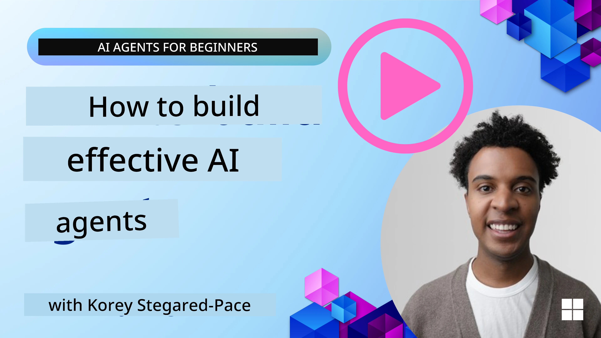
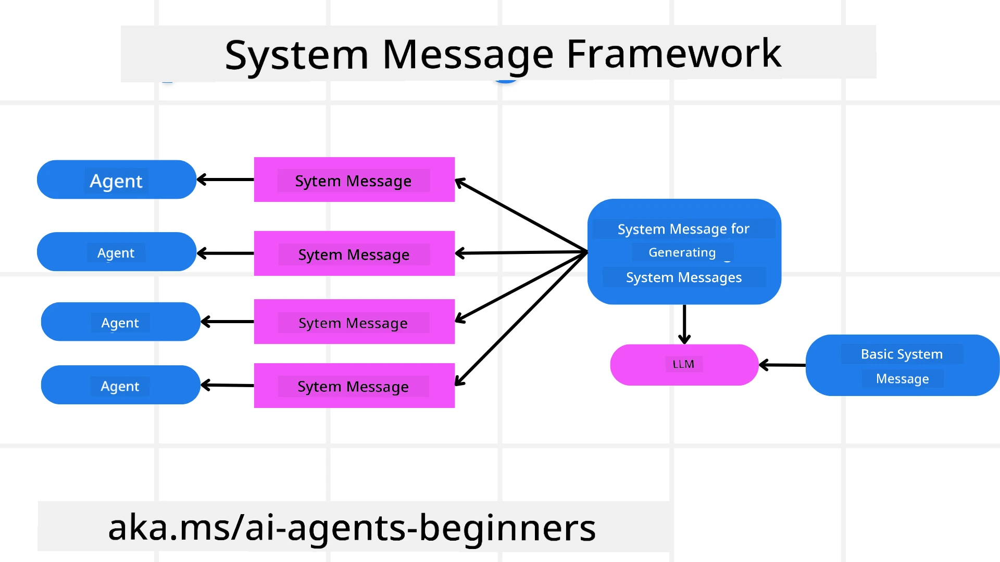
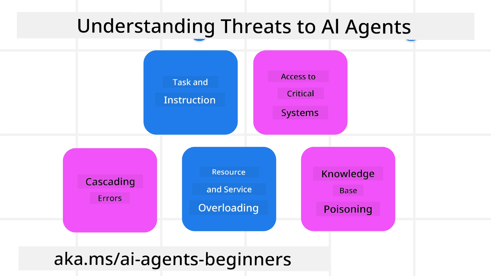
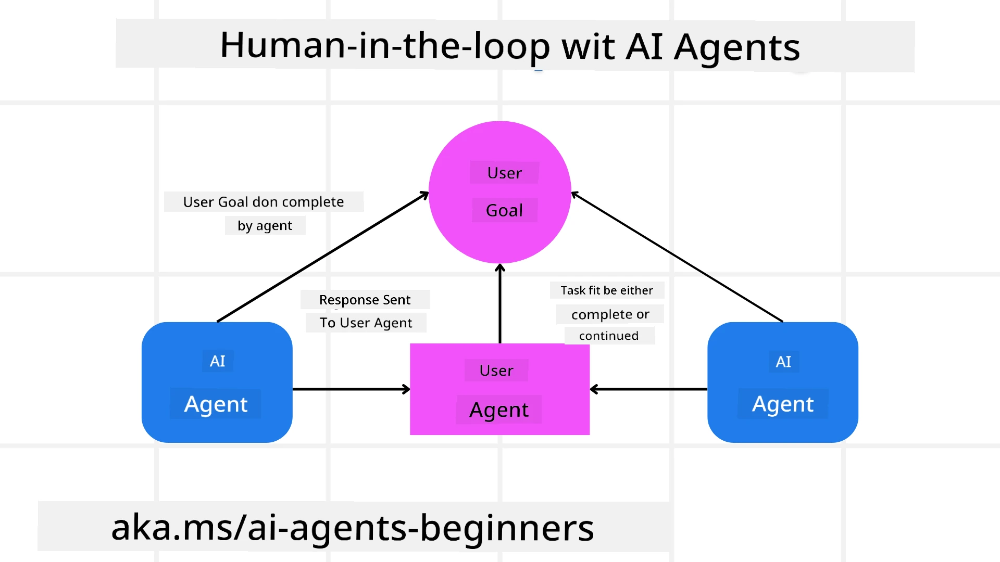

[](https://youtu.be/iZKkMEGBCUQ?si=Q-kEbcyHUMPoHp8L)

> _(Klik di pikchọ wey dey up dey side to watch video of dis lesson)_

# Di Way to Build Trustworthy AI Agents

## Introduction

Dis lesson go cover:

- How to build and deploy safe and better AI Agents
- Important security mata wen you dey develop AI Agents.
- How to protect data and user privacy wen you dey develop AI Agents.

## Wetin You Go Learnt

After you don finish dis lesson, you go sabi how to:

- See and fix risks wen you dey create AI Agents.
- Put security for place to manage data and access well well.
- Create AI Agents wey go keep data privacy and give better user experience.

## Safety

Make we first look how to build safe agentic applications. Safety mean say the AI agent go perform like how e suppose do am. As people wey dey build agentic applications, we get ways and tools to make safety reach maximum:

### How to Build System Message Framework

If you don ever build AI app wey use Large Language Models (LLMs), you go sabi how e important to design strong system prompt or system message. These prompts dey set rules, instructions, and guidelines on top how LLM go take interact with user and data.

For AI Agents, system prompt get extra importance because AI Agents go need clear and specific instructions to finish the tasks we don design for them.

To create system prompts wey fit grow big, we fit use system message framework to build one or more agents for our app:



#### Step 1: Make Meta System Message

Di meta prompt be wetin LLM go use create system prompts for di agents wey we go make. We design am as template so dat e go easy to make plenty agents if e need be.

Dis na example of meta system message we go give LLM:

```plaintext
You are an expert at creating AI agent assistants. 
You will be provided a company name, role, responsibilities and other
information that you will use to provide a system prompt for.
To create the system prompt, be descriptive as possible and provide a structure that a system using an LLM can better understand the role and responsibilities of the AI assistant. 
```

#### Step 2: Create basic prompt

Next step na to create basic prompt wey go describe di AI Agent. You suppose put the agent role, the tasks wey the agent go do, plus any other responsibilities wey the agent get.

Dis na example:

```plaintext
You are a travel agent for Contoso Travel that is great at booking flights for customers. To help customers you can perform the following tasks: lookup available flights, book flights, ask for preferences in seating and times for flights, cancel any previously booked flights and alert customers on any delays or cancellations of flights.  
```

#### Step 3: Give Basic System Message to LLM

Now we fit improve this system message by giving the meta system message as system message plus our basic system message.

Dis one go create system message wey better for guiding our AI agents:

```markdown
**Company Name:** Contoso Travel  
**Role:** Travel Agent Assistant

**Objective:**  
You are an AI-powered travel agent assistant for Contoso Travel, specializing in booking flights and providing exceptional customer service. Your main goal is to assist customers in finding, booking, and managing their flights, all while ensuring that their preferences and needs are met efficiently.

**Key Responsibilities:**

1. **Flight Lookup:**
    
    - Assist customers in searching for available flights based on their specified destination, dates, and any other relevant preferences.
    - Provide a list of options, including flight times, airlines, layovers, and pricing.
2. **Flight Booking:**
    
    - Facilitate the booking of flights for customers, ensuring that all details are correctly entered into the system.
    - Confirm bookings and provide customers with their itinerary, including confirmation numbers and any other pertinent information.
3. **Customer Preference Inquiry:**
    
    - Actively ask customers for their preferences regarding seating (e.g., aisle, window, extra legroom) and preferred times for flights (e.g., morning, afternoon, evening).
    - Record these preferences for future reference and tailor suggestions accordingly.
4. **Flight Cancellation:**
    
    - Assist customers in canceling previously booked flights if needed, following company policies and procedures.
    - Notify customers of any necessary refunds or additional steps that may be required for cancellations.
5. **Flight Monitoring:**
    
    - Monitor the status of booked flights and alert customers in real-time about any delays, cancellations, or changes to their flight schedule.
    - Provide updates through preferred communication channels (e.g., email, SMS) as needed.

**Tone and Style:**

- Maintain a friendly, professional, and approachable demeanor in all interactions with customers.
- Ensure that all communication is clear, informative, and tailored to the customer's specific needs and inquiries.

**User Interaction Instructions:**

- Respond to customer queries promptly and accurately.
- Use a conversational style while ensuring professionalism.
- Prioritize customer satisfaction by being attentive, empathetic, and proactive in all assistance provided.

**Additional Notes:**

- Stay updated on any changes to airline policies, travel restrictions, and other relevant information that could impact flight bookings and customer experience.
- Use clear and concise language to explain options and processes, avoiding jargon where possible for better customer understanding.

This AI assistant is designed to streamline the flight booking process for customers of Contoso Travel, ensuring that all their travel needs are met efficiently and effectively.

```

#### Step 4: Make am Beta and Improve am

Di beta of dis system message framework be say e go help us create system messages from many agents easy and improve your system messages as time dey go. E rare to get system message wey go work well the first time for your full use case. To fit do small changes and improve am by changing the basic system message and run am through di system go help you compare and check results.

## Know Wetin Be Threats

To build trustworthy AI agents, e important to sabi and stop risks and threats wey fit affect your AI agent. Make we check some threats to AI agents and how you fit prepare well for dem.



### Task and Instruction

**Description:** Bad people dey try change instructions or goals of di AI agent by sending wrong prompts or changing input.

**Mitigation**: Run validation checks and input filters to catch dangerous prompts before AI Agent process dem. Since dis kind attack dey need plenty interaction with Agent, to limit number of turns in conversation fit stop this type attack.

### Access to Important Systems

**Description**: If AI agent fit get access to systems and services wey dey keep secret data, bad people fit break communication between agent and these services. This fit be direct attack or indirect attempt to gather info about these systems through the agent.

**Mitigation**: AI agents suppose get access to systems only if e necessary to stop this kind attack. Communication between agent and system suppose dey secure. To put authentication and access control go help keep this info safe.

### Overload Resources and Services

**Description:** AI agents fit use different tools and services to do tasks. Bad people fit use this to send plenty requests through AI Agent go attack services, wey fit cause system breakdown or high cost.

**Mitigation:** Put policy to limit number of requests AI agent fit make to service. Limit conversation turns and requests to AI agent na another way to stop this kind attack.

### Spoil Knowledge Base

**Description:** Dis attack no dey target AI agent direct but e dey target knowledge base and other services wey AI agent go take use. E fit spoil data or info wey AI agent go use do task, wey go cause biased or wrong answers to user.

**Mitigation:** Always verify data wey AI agent go use for work. Make sure say only people wey you trust fit change dis data, make e secure to avoid dis kind attack.

### Errors Wey Dey Expand

**Description:** AI agents dey use plenty tools and services for task. Errors wey attackers cause fit cause other systems wey AI agent connect for to break, wey go make attack spread and e hard to fix.

**Mitigation**: One way na to make AI Agent work for limited environment, like inside Docker container, to stop direct system attacks. Create backup plans and retry logics if system reply with error na other way to stop big system breakdown.

## Human-in-the-Loop

Another better way to build trustworthy AI Agent system na to use Human-in-the-loop. E create flow where users fit give feedback to Agents as dem dey work. Users go act like agents for multi-agent system and fit approve or stop wetin dey run.



Dis na example code wey use Microsoft Agent Framework to show how dem implement dis idea:

```python
import os
from agent_framework.foundry import FoundryChatClient
from azure.identity import AzureCliCredential

# Make the provider wey need human to approve
provider = FoundryChatClient(
    project_endpoint=os.environ["AZURE_AI_PROJECT_ENDPOINT"],
    model=os.environ["AZURE_AI_MODEL_DEPLOYMENT_NAME"],
    credential=AzureCliCredential(),
)

# Make the agent wey get human approval step
response = provider.create_response(
    input="Write a 4-line poem about the ocean.",
    instructions="You are a helpful assistant. Ask for user approval before finalizing.",
)

# User fit check and approve the answer
print(response.output_text)
user_input = input("Do you approve? (APPROVE/REJECT): ")
if user_input == "APPROVE":
    print("Response approved.")
else:
    print("Response rejected. Revising...")
```

## Conclusion

To build trustworthy AI agents, you need careful design, strong security steps, and to dey improve constantly. By putting structured meta prompting systems, sabi potential threats, and put mitigation strategies for place, developers fit create AI agents wey safe and effective. Plus, to add human-in-the-loop approach dey help AI agents to remain correct to wetin users need while e still reduce risks. As AI dey grow strong, to dey proactive about security, privacy, and ethical mata go be key to build trust and make AI-driven systems reliable.

## Code Samples

- [`code_samples/06-system-message-framework.ipynb`](code_samples/06-system-message-framework.ipynb): Step-by-step demo of meta-prompt system-message framework.
- [`code_samples/06-human-in-the-loop.ipynb`](code_samples/06-human-in-the-loop.ipynb): Pre-action approval gates, risk tiering, and audit logging for trustworthy agents.

### You Get More Questions about Building Trustworthy AI Agents?

Join the [Microsoft Foundry Discord](https://discord.com/invite/ATgtXmAS5D) to meet other learners, attend office hours and get your AI Agents questions answer.

## More Resources

- <a href="https://learn.microsoft.com/azure/ai-studio/responsible-use-of-ai-overview" target="_blank">Responsible AI overview</a>
- <a href="https://learn.microsoft.com/azure/ai-studio/concepts/evaluation-approach-gen-ai" target="_blank">Evaluation of generative AI models and AI applications</a>
- <a href="https://learn.microsoft.com/azure/ai-services/openai/concepts/system-message?context=%2Fazure%2Fai-studio%2Fcontext%2Fcontext&tabs=top-techniques" target="_blank">Safety system messages</a>
- <a href="https://blogs.microsoft.com/wp-content/uploads/prod/sites/5/2022/06/Microsoft-RAI-Impact-Assessment-Template.pdf?culture=en-us&country=us" target="_blank">Risk Assessment Template</a>

## Previous Lesson

[Agentic RAG](../05-agentic-rag/README.md)

## Next Lesson

[Planning Design Pattern](../07-planning-design/README.md)

---

<!-- CO-OP TRANSLATOR DISCLAIMER START -->
**Disclaimer**:
Dis document don translate wit AI translation service [Co-op Translator](https://github.com/Azure/co-op-translator). Even tho we dey try make am correct, abeg make you know say automated translation fit get errors or mistakes. Di original document for dia own language na im be di correct source. For important info, make person wey sabi human translation do am. We no go responsible for any misunderstanding or wrong understanding wey fit happen because of dis translation.
<!-- CO-OP TRANSLATOR DISCLAIMER END -->