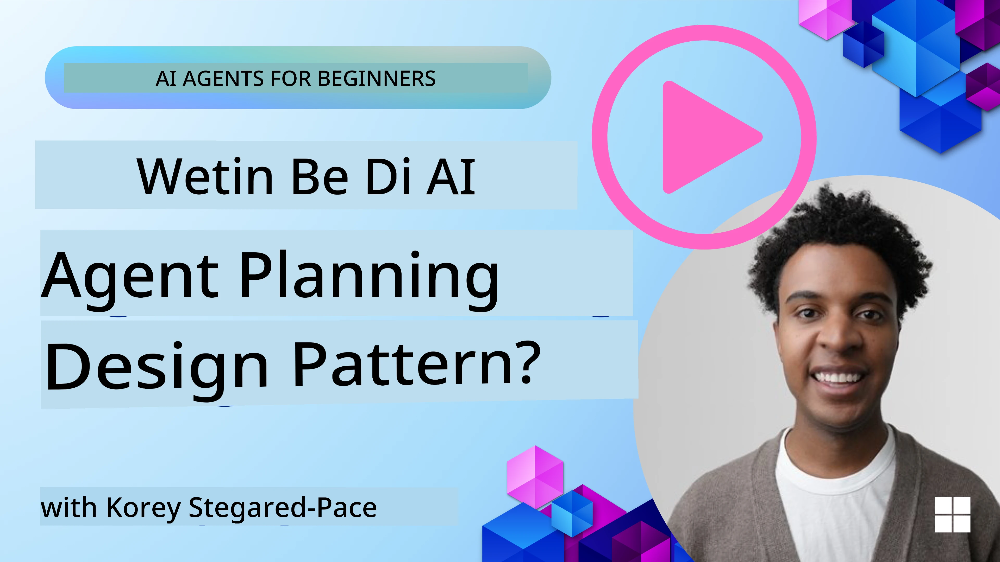
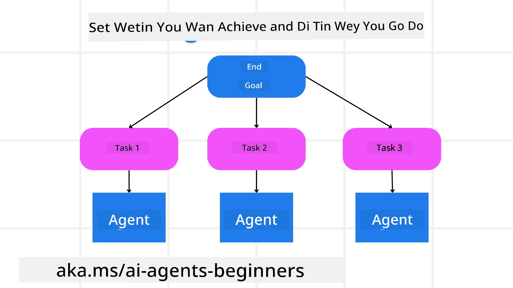

[](https://youtu.be/kPfJ2BrBCMY?si=9pYpPXp0sSbK91Dr)

> _(Click di image wey dey above make you see video of dis lesson)_

# Planning Design

## Introduction

Dis lesson go cover

* How to define one clear main goal and divide one kain task wey complex into small small tasks wey dem fit handle.
* How to use structured output make e dey reliable and machine fit read am wella.
* How to take event-driven style handle tasks wey dey move and unexpected things wey fit happen.

## Learning Goals

After you don finish dis lesson, you go sabi about:

* How to find and set one main goal for AI agent, make e sabi well wetin e suppose do.
* How to break down one complex task into smaller, easy subtasks and arrange dem correct.
* How to give agents correct tools (like search tools or data analytics tools), know when and how to use dem, and how to handle wahala wey no expected.
* How to check subtask results, measure how e dey perform, and adjust actions to make final output better.

## Defining the Overall Goal and Breaking Down a Task



Plenty real-life work na big wahala to do for one step. AI agent need one short concise objective to guide how e go plan and act. For example, think about dis goal:

    "Make 3-day travel itinerary."

E simple to talk, but e still need small work. The clearer the goal, the better the agent (plus human wey dey help) fit focus for to reach the correct result, like to make one full itinerary with flight choices, hotel suggestions, and activities.

### Task Decomposition

Big or tricky tasks go easy to manage if you break am into smaller subtasks wey get clear goals.
For the travel itinerary example, you fit break the goal down like dis:

* Flight Booking
* Hotel Booking
* Car Rental
* Personalization

Each subtask fit follow special agents or processes. One agent fit focus on checking best flight deals, another on hotel booking, and so on. One coordinator or “downstream” agent fit join all these results make one solid itinerary for the user.

This way of doing things fit also allow small small improvements. For example, you fit add special agents for Food Recommendations or Local Activity Suggestions and improve the itinerary with time.

### Structured output

Large Language Models (LLMs) fit make structured output (like JSON) wey easier for downstream agents or services to understand and handle. Dis one good wella for multi-agent system, where we fit do these tasks after planning output don come.

Dis Python snippet show one simple planning agent wey break goal into subtasks and create structured plan:

```python
from pydantic import BaseModel
from enum import Enum
from typing import List, Optional, Union
import json
import os
from typing import Optional
from pprint import pprint
from agent_framework.azure import AzureAIProjectAgentProvider
from azure.identity import AzureCliCredential

class AgentEnum(str, Enum):
    FlightBooking = "flight_booking"
    HotelBooking = "hotel_booking"
    CarRental = "car_rental"
    ActivitiesBooking = "activities_booking"
    DestinationInfo = "destination_info"
    DefaultAgent = "default_agent"
    GroupChatManager = "group_chat_manager"

# Travel SubTask Model
class TravelSubTask(BaseModel):
    task_details: str
    assigned_agent: AgentEnum  # we wan assign di task to di agent

class TravelPlan(BaseModel):
    main_task: str
    subtasks: List[TravelSubTask]
    is_greeting: bool

provider = AzureAIProjectAgentProvider(credential=AzureCliCredential())

# Define di user message
system_prompt = """You are a planner agent.
    Your job is to decide which agents to run based on the user's request.
    Provide your response in JSON format with the following structure:
{'main_task': 'Plan a family trip from Singapore to Melbourne.',
 'subtasks': [{'assigned_agent': 'flight_booking',
               'task_details': 'Book round-trip flights from Singapore to '
                               'Melbourne.'}
    Below are the available agents specialised in different tasks:
    - FlightBooking: For booking flights and providing flight information
    - HotelBooking: For booking hotels and providing hotel information
    - CarRental: For booking cars and providing car rental information
    - ActivitiesBooking: For booking activities and providing activity information
    - DestinationInfo: For providing information about destinations
    - DefaultAgent: For handling general requests"""

user_message = "Create a travel plan for a family of 2 kids from Singapore to Melbourne"

response = client.create_response(input=user_message, instructions=system_prompt)

response_content = response.output_text
pprint(json.loads(response_content))
```

### Planning Agent with Multi-Agent Orchestration

For this example, Semantic Router Agent dey receive user request (like "I need hotel plan for my trip.").

The planner then:

* Receives the Hotel Plan: The planner carry the user talk and, based on system prompt (wey get available agent details), create structured travel plan.
* Lists Agents and Their Tools: The agent registry get list of agents (like for flight, hotel, car rental, and activities) plus their functions or tools.
* Routes the Plan to the Respective Agents: Based on how many subtasks dey, the planner fit send the message straight to one single agent (if na single task) or use group chat manager to coordinate multi-agent work.
* Summarizes the Outcome: Finally, the planner talk the plan summary make e clear.
The Python code for these steps be like dis:

```python

from pydantic import BaseModel

from enum import Enum
from typing import List, Optional, Union

class AgentEnum(str, Enum):
    FlightBooking = "flight_booking"
    HotelBooking = "hotel_booking"
    CarRental = "car_rental"
    ActivitiesBooking = "activities_booking"
    DestinationInfo = "destination_info"
    DefaultAgent = "default_agent"
    GroupChatManager = "group_chat_manager"

# Travel SubTask Model

class TravelSubTask(BaseModel):
    task_details: str
    assigned_agent: AgentEnum # we wan assign the task to di agent

class TravelPlan(BaseModel):
    main_task: str
    subtasks: List[TravelSubTask]
    is_greeting: bool
import json
import os
from typing import Optional

from agent_framework.azure import AzureAIProjectAgentProvider
from azure.identity import AzureCliCredential

# Make di client

provider = AzureAIProjectAgentProvider(credential=AzureCliCredential())

from pprint import pprint

# Talk di user message

system_prompt = """You are a planner agent.
    Your job is to decide which agents to run based on the user's request.
    Below are the available agents specialized in different tasks:
    - FlightBooking: For booking flights and providing flight information
    - HotelBooking: For booking hotels and providing hotel information
    - CarRental: For booking cars and providing car rental information
    - ActivitiesBooking: For booking activities and providing activity information
    - DestinationInfo: For providing information about destinations
    - DefaultAgent: For handling general requests"""

user_message = "Create a travel plan for a family of 2 kids from Singapore to Melbourne"

response = client.create_response(input=user_message, instructions=system_prompt)

response_content = response.output_text

# Print di response content after you don load am as JSON

pprint(json.loads(response_content))
```

Wetin dey follow na output from the code before and you fit use this structured output to send to `assigned_agent` and summarize travel plan for the user.

```json
{
    "is_greeting": "False",
    "main_task": "Plan a family trip from Singapore to Melbourne.",
    "subtasks": [
        {
            "assigned_agent": "flight_booking",
            "task_details": "Book round-trip flights from Singapore to Melbourne."
        },
        {
            "assigned_agent": "hotel_booking",
            "task_details": "Find family-friendly hotels in Melbourne."
        },
        {
            "assigned_agent": "car_rental",
            "task_details": "Arrange a car rental suitable for a family of four in Melbourne."
        },
        {
            "assigned_agent": "activities_booking",
            "task_details": "List family-friendly activities in Melbourne."
        },
        {
            "assigned_agent": "destination_info",
            "task_details": "Provide information about Melbourne as a travel destination."
        }
    ]
}
```

Example notebook with the code before dey available [here](07-python-agent-framework.ipynb).

### Iterative Planning

Some tasks need to go back and forth or make new plan, where result of one subtask affect the next one. For example, if agent find one unexpected data format when e dey book flight, e fit need change how e plan before e start hotel booking.

Plus, user feedback (like person wey want earlier flight) fit make partial re-plan happen. Dis flexible, iterative way make final solution fit the real-life wahala and changing user mind.

e.g sample code

```python
from agent_framework.azure import AzureAIProjectAgentProvider
from azure.identity import AzureCliCredential
#.. sama like di code before and pass on di user history, current plan

system_prompt = """You are a planner agent to optimize the
    Your job is to decide which agents to run based on the user's request.
    Below are the available agents specialized in different tasks:
    - FlightBooking: For booking flights and providing flight information
    - HotelBooking: For booking hotels and providing hotel information
    - CarRental: For booking cars and providing car rental information
    - ActivitiesBooking: For booking activities and providing activity information
    - DestinationInfo: For providing information about destinations
    - DefaultAgent: For handling general requests"""

user_message = "Create a travel plan for a family of 2 kids from Singapore to Melbourne"

response = client.create_response(
    input=user_message,
    instructions=system_prompt,
    context=f"Previous travel plan - {TravelPlan}",
)
# .. plan again and send di tasks go di right agents
```

If you want better planning, check Magnetic One <a href="https://www.microsoft.com/research/articles/magentic-one-a-generalist-multi-agent-system-for-solving-complex-tasks" target="_blank">Blogpost</a> wey dey talk how to solve complex tasks.

## Summary

For dis article we don look example how we fit create planner wey fit dynamically select agents wey dey available. The output from Planner break task and assign agents so dem go fit do am. E assume say agents get access to correct functions/tools wey task need. Besides agents, you fit add patterns like reflection, summarizer, and round robin chat to customize am more.

## Additional Resources

Magnetic One - Na general multi-agent system to solve complex tasks wey don show impressive results for different agentic benchmarks. Reference: <a href="https://www.microsoft.com/research/articles/magentic-one-a-generalist-multi-agent-system-for-solving-complex-tasks" target="_blank">Magnetic One</a>. For this method, orchestrator dey create task-specific plans and give task to agents wey available. Apart from planning, the orchestrator also get tracking to check task progress and make new plans if needed.

### Got More Questions about the Planning Design Pattern?

Join [Microsoft Foundry Discord](https://aka.ms/ai-agents/discord) make you meet other learners, attend office hours and get your AI Agents questions answered.

## Previous Lesson

[Building Trustworthy AI Agents](../06-building-trustworthy-agents/README.md)

## Next Lesson

[Multi-Agent Design Pattern](../08-multi-agent/README.md)

---

<!-- CO-OP TRANSLATOR DISCLAIMER START -->
**Warning Talk**:  
Dis document na im don use AI translation service [Co-op Translator](https://github.com/Azure/co-op-translator) translate am. Even though we dey try make am correct, abeg sabi say automated translation fit get some mistake or no be 100% correct. The original document wey e be for im own language, na im be the real correct one. If na serious yawa, e good make human professional translate am. We no go take blame if pipo no understand well well or if dem use dis translation wrong.
<!-- CO-OP TRANSLATOR DISCLAIMER END -->