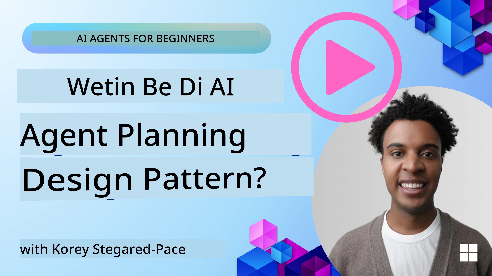
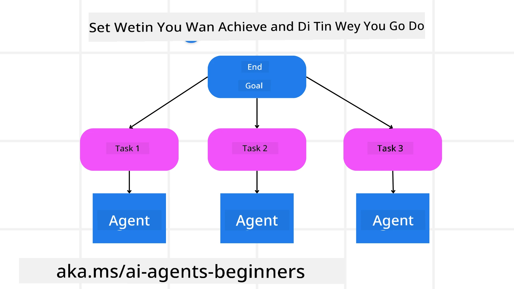

[](https://youtu.be/kPfJ2BrBCMY?si=9pYpPXp0sSbK91Dr)

> _(Click di image we dey above to watch video of dis lesson)_

# Planning Design

## Introduction

Dis lesson go cover

* How to define clear overall goal and break big work into small easy-to-handle tasks.
* How to use structured output for more reliable and machine-readable response.
* How to use event-driven method to handle dynamic tasks and unexpected input dem.

## Learning Goals

After you finish dis lesson, you go sabi about:

* How to identify and set overall goal for AI agent, make sure e clear wetin e suppose achieve.
* How to break down complex task into small manageable subtasks and arrange am well.
* How to give agents correct tools (like search tools or data analytics tools), know when and how to use am, and handle anywhere wey surprise wahala show.
* How to check subtask results, measure how e perform, and change action to make final output better.

## Defining the Overall Goal and Breaking Down a Task



Most real-life task dem too complex to do in one step. AI agent need sharp objective to guide im planning and actions. For example, consider dis goal:

    "Generate a 3-day travel itinerary."

Even though e simple to talk am, e still need fine-tuning. The clearer the goal, the better the agent (and any human collaborators) fit focus on how to achieve correct result, like create full itinerary with flight options, hotel recommendations, and activity ideas.

### Task Decomposition

Big or complicated tasks go become easier if you break am down into smaller, goal-centered subtasks.
For travel itinerary example, you fit break the goal into:

* Flight Booking
* Hotel Booking
* Car Rental
* Personalization

Each subtask fit be handled by special agents or processes. One agent fit sabi well to find best flight deal, another one focus on hotel bookings, and so on. One coordinating or “downstream” agent fit put all these results together make one solid itinerary for the person wey go use am.

Dis modular way still allow for small small improvements. For example, you fit add special agents for Food Recommendations or Local Activity Suggestions and improve di itinerary as time dey go.

### Structured output

Large Language Models (LLMs) fit create structured output (like JSON) wey easier for downstream agents or services to understand and process. Dis one dey important well well for multi-agent system, where we fit run tasks after we don get planning output.

Di Python snippet wey dey below show simple planning agent wey dey break goal into subtasks and dey generate structured plan:

```python
from pydantic import BaseModel
from enum import Enum
from typing import List, Optional, Union
import json
import os
from typing import Optional
from pprint import pprint
from agent_framework.foundry import FoundryChatClient
from azure.identity import AzureCliCredential

class AgentEnum(str, Enum):
    FlightBooking = "flight_booking"
    HotelBooking = "hotel_booking"
    CarRental = "car_rental"
    ActivitiesBooking = "activities_booking"
    DestinationInfo = "destination_info"
    DefaultAgent = "default_agent"
    GroupChatManager = "group_chat_manager"

# Travel SubTask Model
class TravelSubTask(BaseModel):
    task_details: str
    assigned_agent: AgentEnum  # we wan assign di task to di agent

class TravelPlan(BaseModel):
    main_task: str
    subtasks: List[TravelSubTask]
    is_greeting: bool

provider = FoundryChatClient(
    project_endpoint=os.environ["AZURE_AI_PROJECT_ENDPOINT"],
    model=os.environ["AZURE_AI_MODEL_DEPLOYMENT_NAME"],
    credential=AzureCliCredential(),
)

# Define di user message
system_prompt = """You are a planner agent.
    Your job is to decide which agents to run based on the user's request.
    Provide your response in JSON format with the following structure:
{'main_task': 'Plan a family trip from Singapore to Melbourne.',
 'subtasks': [{'assigned_agent': 'flight_booking',
               'task_details': 'Book round-trip flights from Singapore to '
                               'Melbourne.'}
    Below are the available agents specialised in different tasks:
    - FlightBooking: For booking flights and providing flight information
    - HotelBooking: For booking hotels and providing hotel information
    - CarRental: For booking cars and providing car rental information
    - ActivitiesBooking: For booking activities and providing activity information
    - DestinationInfo: For providing information about destinations
    - DefaultAgent: For handling general requests"""

user_message = "Create a travel plan for a family of 2 kids from Singapore to Melbourne"

response = client.create_response(input=user_message, instructions=system_prompt)

response_content = response.output_text
pprint(json.loads(response_content))
```

### Planning Agent with Multi-Agent Orchestration

For dis example, Semantic Router Agent go receive user request (like "I need a hotel plan for my trip.").

Di planner go:

* Receive di Hotel Plan: Planner go take user message and, based on system prompt (with agent details wey dey), go generate structured travel plan.
* List Agents and Their Tools: Agent registry dey hold list of agents (for flight, hotel, car rental, activities) with functions or tools wey dem fit use.
* Route di Plan to di Right Agents: Depending on number of subtasks, planner fit either send message directly to one agent (if na one-task case) or coordinate through group chat manager for multi-agent work.
* Summarize di Outcome: In the end, planner go summarize di plan so e clear.
Di Python code below go show these steps:

```python

from pydantic import BaseModel

from enum import Enum
from typing import List, Optional, Union

class AgentEnum(str, Enum):
    FlightBooking = "flight_booking"
    HotelBooking = "hotel_booking"
    CarRental = "car_rental"
    ActivitiesBooking = "activities_booking"
    DestinationInfo = "destination_info"
    DefaultAgent = "default_agent"
    GroupChatManager = "group_chat_manager"

# Travel SubTask Model

class TravelSubTask(BaseModel):
    task_details: str
    assigned_agent: AgentEnum # we wan assign di task to di agent

class TravelPlan(BaseModel):
    main_task: str
    subtasks: List[TravelSubTask]
    is_greeting: bool
import json
import os
from typing import Optional

from agent_framework.foundry import FoundryChatClient
from azure.identity import AzureCliCredential

# Make di client

provider = FoundryChatClient(
    project_endpoint=os.environ["AZURE_AI_PROJECT_ENDPOINT"],
    model=os.environ["AZURE_AI_MODEL_DEPLOYMENT_NAME"],
    credential=AzureCliCredential(),
)

from pprint import pprint

# Set di user message

system_prompt = """You are a planner agent.
    Your job is to decide which agents to run based on the user's request.
    Below are the available agents specialized in different tasks:
    - FlightBooking: For booking flights and providing flight information
    - HotelBooking: For booking hotels and providing hotel information
    - CarRental: For booking cars and providing car rental information
    - ActivitiesBooking: For booking activities and providing activity information
    - DestinationInfo: For providing information about destinations
    - DefaultAgent: For handling general requests"""

user_message = "Create a travel plan for a family of 2 kids from Singapore to Melbourne"

response = client.create_response(input=user_message, instructions=system_prompt)

response_content = response.output_text

# Show di response content afta load am as JSON

pprint(json.loads(response_content))
```

Wetin dey after na output from di code and you fit use structured output to send am go `assigned_agent` and summarize di travel plan for di user.

```json
{
    "is_greeting": "False",
    "main_task": "Plan a family trip from Singapore to Melbourne.",
    "subtasks": [
        {
            "assigned_agent": "flight_booking",
            "task_details": "Book round-trip flights from Singapore to Melbourne."
        },
        {
            "assigned_agent": "hotel_booking",
            "task_details": "Find family-friendly hotels in Melbourne."
        },
        {
            "assigned_agent": "car_rental",
            "task_details": "Arrange a car rental suitable for a family of four in Melbourne."
        },
        {
            "assigned_agent": "activities_booking",
            "task_details": "List family-friendly activities in Melbourne."
        },
        {
            "assigned_agent": "destination_info",
            "task_details": "Provide information about Melbourne as a travel destination."
        }
    ]
}
```

Example notebook with di code fit be found [here](./code_samples/07-python-agent-framework.ipynb).

### Iterative Planning

Some tasks need back-and-forth or re-planning, especially if outcome from one subtask affect di next. For example, if agent find new kind data format when e dey book flights, e need change im strategy before e move to hotel bookings.

Also, user feedback (like human wey decide say dem want earlier flight) fit cause partial re-plan. Dis dynamic, iterative approach make sure say final solution go fit real-world wahala and changing user preferences.

e.g sample code

```python
import os
from agent_framework.foundry import FoundryChatClient
from azure.identity import AzureCliCredential
#.. same as previous code and pass on the user history, current plan

system_prompt = """You are a planner agent to optimize the
    Your job is to decide which agents to run based on the user's request.
    Below are the available agents specialized in different tasks:
    - FlightBooking: For booking flights and providing flight information
    - HotelBooking: For booking hotels and providing hotel information
    - CarRental: For booking cars and providing car rental information
    - ActivitiesBooking: For booking activities and providing activity information
    - DestinationInfo: For providing information about destinations
    - DefaultAgent: For handling general requests"""

user_message = "Create a travel plan for a family of 2 kids from Singapore to Melbourne"

response = client.create_response(
    input=user_message,
    instructions=system_prompt,
    context=f"Previous travel plan - {TravelPlan}",
)
# .. change plan again and send di tasks go di correct agents
```

For better planning, check out Magnetic One <a href="https://www.microsoft.com/research/articles/magentic-one-a-generalist-multi-agent-system-for-solving-complex-tasks" target="_blank">Blogpost</a> wey dey talk about how to solve complex tasks.

## Summary

For dis article, we don see example of how we fit create planner wey fit dynamically choose agents wey dey available. Planner output dey break tasks and assign agents so dem fit do am. Na assumption say agents get access to functions/tools wey dem need to perform task. Besides agents, you fit add other patterns like reflection, summarizer, and round robin chat to customize further.

## Additional Resources

Magnetic One - Na Generalist multi-agent system for solving complex tasks and e don get good results on plenty hard agentic challenges. Reference: <a href="https://www.microsoft.com/research/articles/magentic-one-a-generalist-multi-agent-system-for-solving-complex-tasks" target="_blank">Magnetic One</a>. For dis implementation, orchestrator dey create task-specific plans and dey give dem to agents wey dey available. Besides planning, orchestrator still get tracking system to monitor task progress and re-plan when e necessary.

### You Get More Questions About Planning Design Pattern?

Join [Microsoft Foundry Discord](https://discord.com/invite/ATgtXmAS5D) to meet other learners, attend office hours and get your AI Agents questions answered.

## Previous Lesson

[Building Trustworthy AI Agents](../06-building-trustworthy-agents/README.md)

## Next Lesson

[Multi-Agent Design Pattern](../08-multi-agent/README.md)

---

<!-- CO-OP TRANSLATOR DISCLAIMER START -->
**Disclaimer**:
Dis document don translate wit AI translation service [Co-op Translator](https://github.com/Azure/co-op-translator). Even tho we dey try make am correct, abeg make you know say automated translation fit get errors or mistakes. Di original document for dia own language na im be di correct source. For important info, make person wey sabi human translation do am. We no go responsible for any misunderstanding or wrong understanding wey fit happen because of dis translation.
<!-- CO-OP TRANSLATOR DISCLAIMER END -->