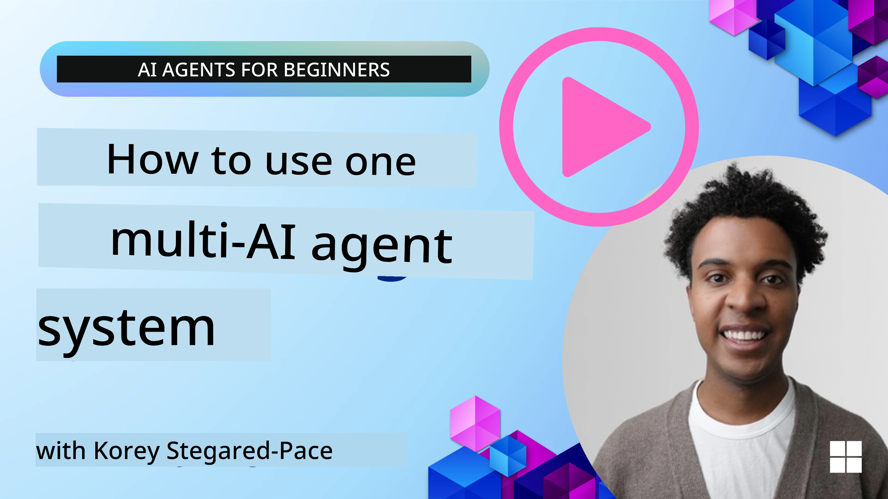
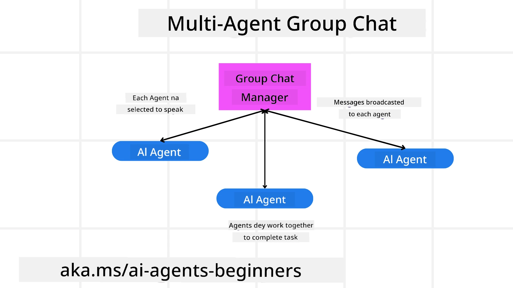
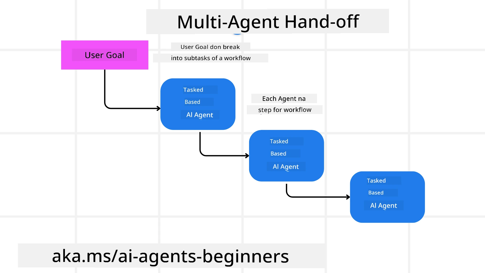
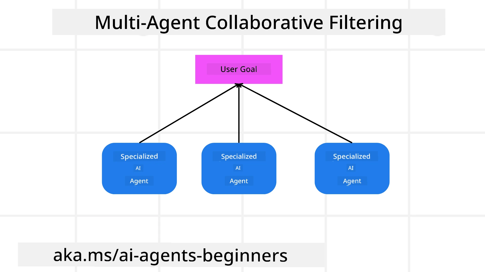

> _(Click di image wey dey top to watch video of dis lesson)_

# Multi-agent design patterns

As you begin to work on project wey get multiple agents, you go gats consider the multi-agent design pattern. But e no too clear immediately when to switch to multi-agents and wetin the benefits be.

## Introduction

For dis lesson, we wan answer dis questions dem:

- Wetin be di scenarios wey multi-agents fit work for?
- Wetin be di benefits of using multi-agents over just one single agent wey dey do plenty tasks?
- Wetin be di building blocks for how to put di multi-agent design pattern for use?
- How we fit dey see how the multiple agents dey interact with each oda?

## Learning Goals

After dis lesson, you supos fit:

- Identify scenarios wey multi-agents fit work for
- Recognize di benefits of using multi-agents over one single agent.
- Understand di building blocks wey go help implement di multi-agent design pattern.

Wet the koko be?

*Multi agents na design pattern wey make multiple agents fit work together to achieve one common goal*.

Dis pattern dey widely used for different areas, including robotics, autonomous systems, and distributed computing.

## Scenarios Where Multi-Agents Are Applicable

So which scenarios good to use multi-agents? Di answer be say plenty scenarios dey wey dey beneficial to use many agents especially for dis kind cases:

- **Large workloads**: Big workloads fit break down into smaller tasks and assign to different agents, so dem fit run parallel and finish faster. Example na wen you get one big data processing wahala.
- **Complex tasks**: Complex work fit also split into smaller subtasks and give different agents, wey sabi specifically for each side of di work. Example na autonomous vehicles where different agents handle navigation, obstacle detection, and communication with oda vehicles.
- **Diverse expertise**: Different agents fit get different special skills, so dem fit handle different side of di task better pass one single agent. For example, for healthcare where agents fit manage diagnostics, treatment plans, and patient monitoring.

## Advantages of Using Multi-Agents Over a Singular Agent

One single agent fit work well for simple tasks, but for more complex tasks, multiple agents get plenti benefits:

- **Specialization**: Each agent fit specialize for one particular work. If you no get specialization for one agent, e mean say e be agent wey fit do everything but fit confuse for complex work. E fit end up doing something wey e no really sabi do well.
- **Scalability**: E easy to scale system by adding more agents than overload one agent.
- **Fault Tolerance**: If one agent fail, oda agents fit still dey work make system remain reliable.

Make we try example. We wan book trip for person. If na single agent system, e go gats handle all sides of booking trip, from finding flights to booking hotels and rental cars. To do all dis with one agent, the agent need tools to handle all. E go get complicated and hard to maintain and grow. But if na multi-agent system, e fit get different agents wey specialize to find flights, one to book hotel, one to handle rental cars. E make system modular, easier to maintain, and fit scale well.

Compare am to travel bureau wey be mom-and-pop store versus franchise. Mom-and-pop store get one agent wey dey handle all, but franchise get plenty agents wey dey handle different parts of trip booking.

## Building Blocks of Implementing the Multi-Agent Design Pattern

Before you fit implement multi-agent design pattern, you need understand di building blocks wey be part of di pattern.

Make we use di example of booking trip again. For this case, di building blocks go include:

- **Agent Communication**: Agents to find flights, book hotels, and rental cars need talk and share info about user preferences and limits. You gats decide di protocols and ways for this communication. For example, flight agent need talk to hotel agent make sure the hotel booking match the same travel dates as the flight. So agents gats share info about user travel dates; you gats decide *which agents dey share info and how dem dey share am*.
- **Coordination Mechanisms**: Agents need coordinate their actions to make sure user preferences and limits dey follow. User fit want hotel near airport but rental cars fit only dey airport. So hotel booking agent and rental car agent need coordinate to follow user preferences and limits. You gats decide *how agents dey coordinate their actions*.
- **Agent Architecture**: Agents need get inside structure to take decisions and learn from interaction with user. So flight finding agent need inside design to decide which flights to recommend. You gats decide *how agents dey make decisions and learn from interaction with user*. For example, flight agent fit use machine learning model to recommend flights based on user past preferences.
- **Visibility into Multi-Agent Interactions**: You need fit see how multiple agents dey interact. This means you need tools and ways to track agent activities and interaction. Like logging, monitoring tools, visualization tools, and performance measures.
- **Multi-Agent Patterns**: Different patterns dey to implement multi-agent systems like centralized, decentralized, and hybrid architectures. You need decide which pattern fit your use case best.
- **Human in the loop**: Mostly, human dey involved, you need tell agents when to ask human for help. This fit be when user want specific hotel or flight wey agents never recommend, or when agents need confirmation before book something.

## Visibility into Multi-Agent Interactions

E important to see how multiple agents dey interact. Dis visibility help debugging, optimization, and overall system effectiveness. To do this, you need tools and ways to track agent activities and interaction. This fit be logging, monitoring tools, visualization, and performance metrics.

For example, for booking trip, you fit get dashboard wey show each agent status, user preferences and limits, and interaction between agents. Dashboard fit show user travel dates, flights recommended by flight agent, hotels recommended by hotel agent, and rental cars by rental car agent. This go give you clear view on how agents dey interact and if user preferences dey met.

Make we check each part detail.

- **Logging and Monitoring Tools**: You want log every action agent take. Log entry fit store who agent do am, the action, time, and result. Dis info fit help debugging, optimizing, and more.
- **Visualization Tools**: Visual tools fit help you see agents interaction in clear way. For example, graph wey show info flow between agents. E fit help find bottlenecks, inefficiencies, and wahala for system.
- **Performance Metrics**: Metrics fit help track how system dey perform. For example, time wey e take to finish task, number of tasks done for time frame, and accuracy of recommendations from agents. This info help find where to improve and optimize system.

## Multi-Agent Patterns

Make we yarn about some patterns we fit use to create multi-agent apps. Here be some patterns to consider:

### Group chat

Dis pattern useful when you wan create group chat app wey multiple agents fit talk to each oda. Common use cases be team collaboration, customer support, and social networking.

For dis pattern, each agent represent user for group chat, and messages dey exchanged between agents using messaging protocol. Agents fit send messages to group, receive messages, and reply other agents.

Dis pattern fit implement with centralized system wey all messages pass central server, or decentralized system wey messages pass directly.

### Hand-off

Dis pattern useful when you want app where multiple agents fit hand over tasks to each oda.

Common use cases be customer support, task management, and workflow automation.

For dis pattern, each agent represent task or step for workflow, and agents fit hand off task to oda agents based on rules wey dem set.

### Collaborative filtering

Dis pattern useful when you want app where multiple agents fit work together to recommend things to users.

Why multiple agents collaborate? Because each agent get different expertise and fit contribute differently to recommendation.

Example: User want recommendation on best stock for market.

- **Industry expert**: One agent get knowledge for particular industry.
- **Technical analysis**: Another agent sabi technical analysis.
- **Fundamental analysis**: Another agent get fundamental analysis skills. If dem collaborate, dem fit give better full recommendation to user.

## Scenario: Refund process

Think about scenario where customer dey try get refund for product, many agents fit dey involved but make we separate_agents wey dey specific for refund process plus general agents wey fit work for other jobs too.

**Agents wey specific for refund process**:

Here be some agents for refund process:

- **Customer agent**: Represent customer and e dey responsible to start refund.
- **Seller agent**: Represents seller, dey handle refund processing.
- **Payment agent**: Handles payment side, dey refund customer money.
- **Resolution agent**: Dey resolve any wahala during refund processing.
- **Compliance agent**: Dey make sure refund follow laws and policies.

**General agents**:

These agents dey useful for other parts of business too.

- **Shipping agent**: Handles product shipping back to seller. Fit use for refund or general shipping after purchase.
- **Feedback agent**: Collect feedback from customers anytime, no only refund.
- **Escalation agent**: Handles escalating issues to higher support level. Fit use for any process wey need escalation.
- **Notification agent**: Sends notifications to customer during refund process stages.
- **Analytics agent**: Analyzes data about refund process.
- **Audit agent**: Audits refund process to make sure e dey done correctly.
- **Reporting agent**: Generates reports about refund process.
- **Knowledge agent**: Maintains knowledge base for refund and other business info.
- **Security agent**: Ensures refund process secure.
- **Quality agent**: Makes sure refund process quality dey good.

Plenty agents dey here for refund-specific and general business purposes. Hope dis help you understand how you fit decide which agents to use for multi-agent system.

## Assignment

Design multi-agent system for customer support process. Identify agents wey dey involved, their roles and responsibilities, and how dem dey interact. Think about agents specific for customer support and general agents wey fit also work for other business parts.
> Make you think before you read dis solution, e fit be say you go need more agents pass wetin you dey think.

> TIP: Think about the different stages of the customer support process and also consider agents wey system go need.

## Solution

[Solution](./solution/solution.md)

## Knowledge checks

Question: When you suppose consider to use multi-agents?

- [ ] A1: When workload small and task na simple one.
- [ ] A2: When workload big
- [ ] A3: When task be simple.

[Solution quiz](./solution/solution-quiz.md)

## Summary

For dis lesson, we don look multi-agent design pattern, including places wey multi-agents dey fit work, the beta wey dey use multi-agents pass just one agent, the building blocks to fit implement multi-agent design pattern, and how to fit see how the multiple agents dey interact with each other.

### You get More Questions about the Multi-Agent Design Pattern?

Make you join the [Microsoft Foundry Discord](https://aka.ms/ai-agents/discord) to meet other learners, siddon for office hours and get your AI Agents questions answered.

## Additional resources

- <a href="https://learn.microsoft.com/azure/ai-services/agents/overview" target="_blank">Microsoft Agent Framework documentation</a>
- <a href="https://www.analyticsvidhya.com/blog/2024/10/agentic-design-patterns/" target="_blank">Agentic design patterns</a>

## Previous Lesson

[Planning Design](../07-planning-design/README.md)

## Next Lesson

[Metacognition in AI Agents](../09-metacognition/README.md)

---

<!-- CO-OP TRANSLATOR DISCLAIMER START -->
**Disclaimer**:
Dis document dem don translate am with AI translation service wey dem call [Co-op Translator](https://github.com/Azure/co-op-translator). Even though we dey try make am correct, abeg no forget say automated translation fit get some mistake or no too correct for am. Di original document wey dem write for dia own language na di correct source. If na important tori, na professional human translate go best. We no dey responsible for any misunderstanding or wrong meaning wey fit show because of dis translation.
<!-- CO-OP TRANSLATOR DISCLAIMER END -->