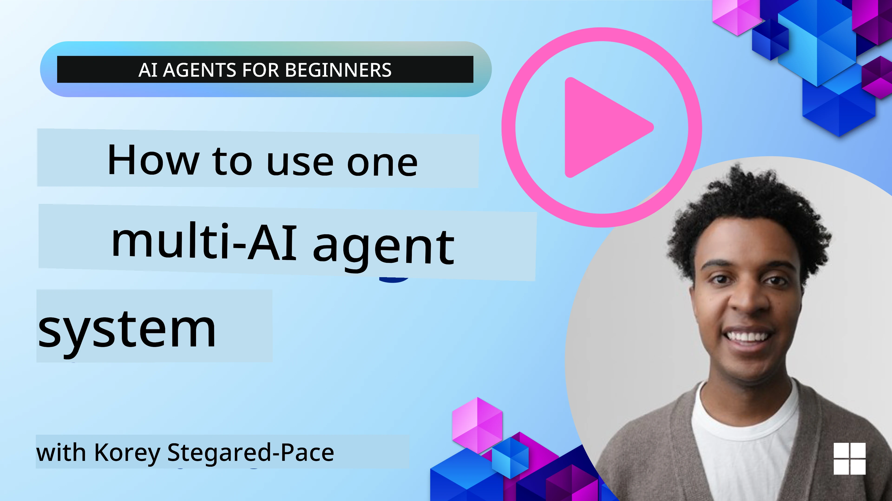
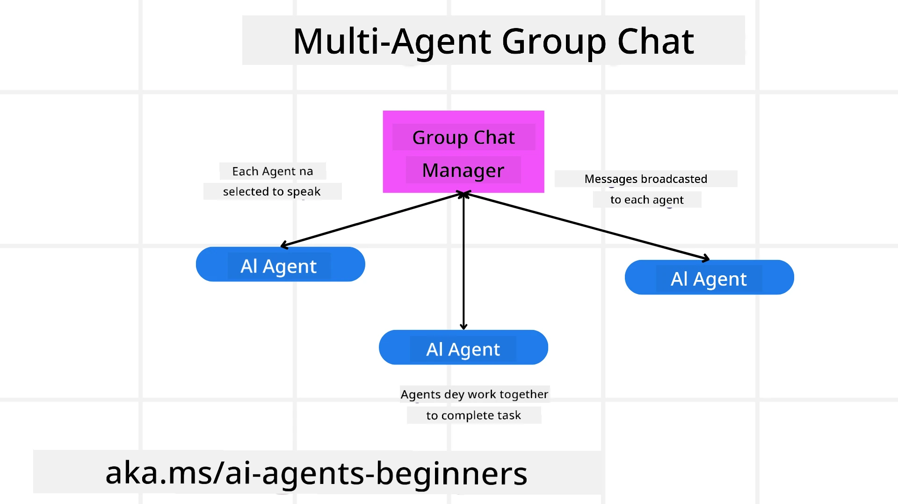
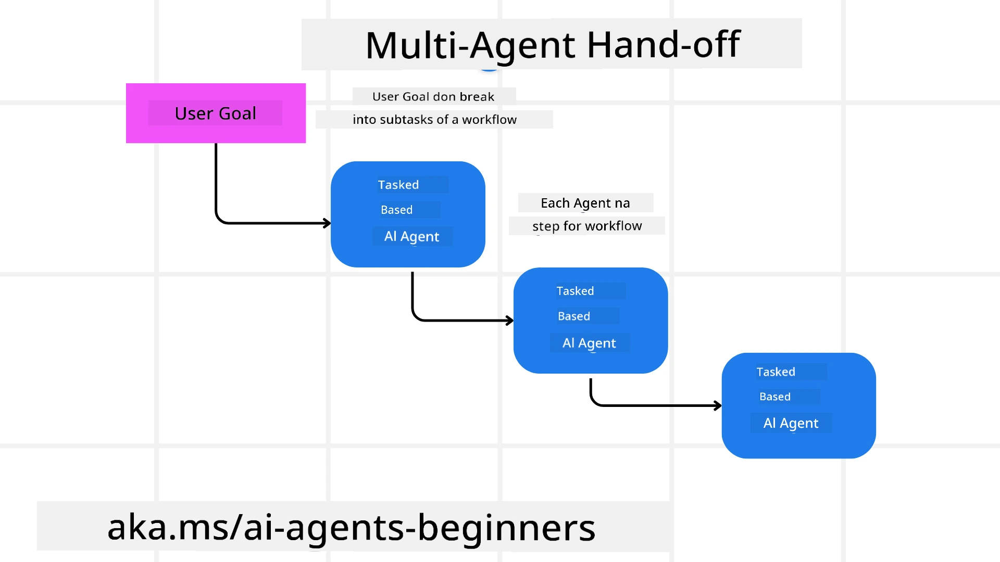
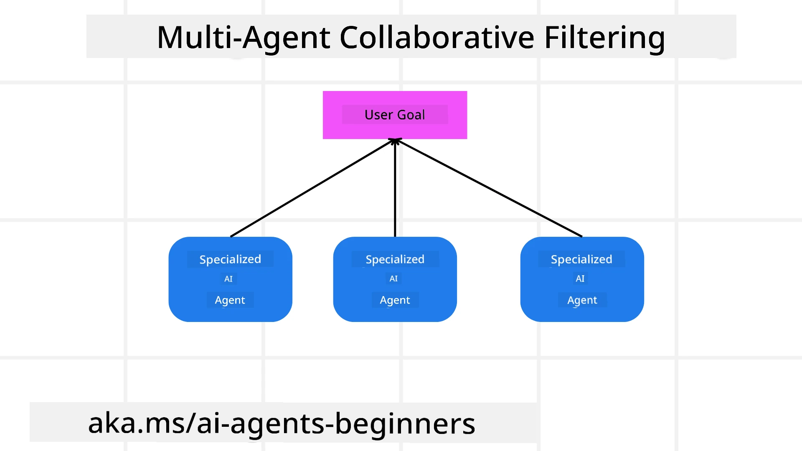

> _(Click di pikicha wey dey above to watch video for dis lesson)_

# Multi-agent design patterns

As you begin to work on project wey get many agents, you go need to think about di multi-agent design pattern. But e fit no clear straight away when you go change to multi-agents and wetin di benefits be.

## Introduction

For dis lesson, we wan answer dis questions dem:

- Wetin be di scenarios wey multi-agents fit work for?
- Wetin be di benefits wey multi-agents get pass one single agent wey dey do many tasks?
- Wetin be di building blocks to implement di multi-agent design pattern?
- How we go take sabi how di many agents dey interact wit each oda?

## Learning Goals

After dis lesson, you suppose fit:

- Identify di scenarios wey multi-agents fit work
- Recognize di benefits of using multi-agents pass one single agent.
- Understand di building blocks to implement di multi-agent design pattern.

Wetin be di koko?

*Multi agents na design pattern wey allow many agents to work together to achieve one common goal*.

Dis pattern dey used wella for many area dem, like robotics, autonomous systems, and distributed computing.

## Scenarios Weh Multi-Agents Fit Work

So which kind scenarios good for using multi-agents? Di answer be say many scenarios dey wey e good make you deploy many agents especially for di following tins:

- **Big work**: Big work fit divide into small small tasks, assign to different agents, so dem fit run parallel and finish quick quick. Example be big data processing work.
- **Complex tasks**: Like big work, complex tasks fit break down into small small parts, assign to different agents, each wey sabi one area well. Example be autonomous vehicles wey different agents dey handle navigation, obstacle detection, and communication wit oda vehicles.
- **Different expertise**: Different agents get different skills wey make dem fit handle different parts of task better pass one agent alone. Example na healthcare wey agents fit handle diagnostics, treatment plans, and patient monitoring.

## Benefits of Using Multi-Agents Pass Single Agent

One single agent system fit dey okay for simple tasks, but for complex tasks, using many agents go bring better benefits:

- **Specialization**: Each agent fit get one task wey e specialize for. If one agent try do everything, e fit confuse for complex task, e fit do wrong thing.
- **Scalability**: E easy to add more agents pass make one agent overwork.
- **Fault Tolerance**: If one agent fail, oda agents fit continue, so system go still dey reliable.

Make we take example, book trip for user. Single agent system go handle all aspects of trip booking: find flights, book hotels and rental cars. For one agent do dis, e need tools for all tasks wey fit make system complicated and hard to maintain or scale. But multi-agent system fit get agents wey specialize for flights, hotels, rental cars. E go make system modular, easy maintenance, and scalable.

Compare am to travel bureau wey be small shop (mom-and-pop store) versus travel bureau wey be franchise. Small shop get one agent wey do all trip booking, franchise get different agents for different trip tasks.

## Building Blocks to Implement Multi-Agent Design Pattern

Before you fit implement multi-agent design pattern, you go need understand di building blocks wey make di pattern.

Make we make am clear again using di example of booking trip for user. Di building blocks go include:

- **Agent Communication**: Agents for finding flights, booking hotels, rental cars must talk and share info about user preferences and limits. You need decide protocols and methods for communication. For example, flight agent must talk to hotel agent to book hotel for same flight dates. So agents must share user travel date info, meaning you need decide *which agents dey share info and how dem dey share am*.
- **Coordination Mechanisms**: Agents must coordinate actions to meet user preferences and limits. Example: user want hotel near airport, rental cars only dey airport. So hotel booking agent must coordinate with rental car agent to meet user needs. You need decide *how agents dey coordinate their actions*.
- **Agent Architecture**: Agents need internal structure to make decisions and learn from user interactions. Flight agent, for example, must have internal structure to choose flight recommendations. You need decide *how agents dey make decisions and learn from user interactions*. Example, flight agent fit use machine learning model to recommend flights based on past user preferences.
- **Visibility into Multi-Agent Interactions**: You need know how agents dey interact. This require tools and ways to track agent activities and interactions. Could be logging and monitoring tools, visualization tools, and performance metrics.
- **Multi-Agent Patterns**: Different patterns for multi-agent systems dey, like centralized, decentralized, hybrid architectures. You need choose pattern wey fit your use case.
- **Human in the loop**: Most times human dey involved, and you need tell agents when to ask human for help. For example, user fit ask for special hotel or flight wey agents no recommend or ask for confirmation before booking.

## Visibility into Multi-Agent Interactions

E important to get visibility on how many agents dey interact. Dis visibility dey help for debugging, optimizing, and making sure system dey work well. To do dis, you need tools and ways to track agent actions and interactions. Could be logging and monitoring tools, visualization tools, and performance metrics.

For example, for booking trip for user, you fit get dashboard wey show status of each agent, user preferences and limits, and how agents dey interact. Dashboard fit show user travel dates, flights wey flight agent recommend, hotels wey hotel agent recommend, rental cars wey rental car agent recommend. Dis go show clear how agents dey interact and if user needs dey meet.

Make we look each part well well.

- **Logging and Monitoring Tools**: You want make logging happen for each action wey agent take. Log entry fit store info about which agent take action, wetin agent do, time action happen, and result. Dis info fit help debugging, optimizing and more.

- **Visualization Tools**: Visualization tools fit help you see how agents dey interact in better way. Example, graph wey show info flow between agents. Fit help you find bottlenecks, inefficiencies, and other system wahala.

- **Performance Metrics**: Performance metrics fit help track how effective multi-agent system be. For example, time to finish task, how many tasks finish for certain time, and accuracy of agent recommendations. Dis info fit help find improvement areas and optimize system.

## Multi-Agent Patterns

Make we dive into some patterns we fit use to create multi-agent apps. Here be some patterns wey good to consider:

### Group chat

Dis pattern good if you wan create group chat app where many agents fit communicate. Typical use case na team collaboration, customer support, and social networking.

For dis pattern, each agent be user for group chat, and dem dey exchange messages using messaging protocol. Agents fit send messages to group chat, receive messages from group chat, and respond messages from oda agents.

Dis pattern fit use centralized architecture where all messages dey pass central server, or decentralized architecture where messages dey exchanged direct.

### Hand-off

Dis pattern good if you wan create app where many agents fit hand off tasks to each oda.

Typical use cases na customer support, task management, and workflow automation.

For dis pattern, each agent represent task or workflow step, and agents fit hand off tasks based on rules wey dem set before.

### Collaborative filtering

Dis pattern good if you want create app where many agents fit collaborate to give users recommendation.

Why make multiple agents collaborate? Because each agent get different skill and fit add differently to recommendation process.

Make we take example where user want recommendation on best stock wey dem fit buy for stock market.

- **Industry expert**: One agent fit be expert for one industry.
- **Technical analysis**: Another agent fit be expert for technical analysis.
- **Fundamental analysis**: And another agent fit be expert for fundamental analysis. By collaborating, these agents fit give better recommendation to user.

## Scenario: Refund process

Consider scenario where customer dey try get refund for product, many agents fit join for dis process but make we divide agents wey dey specific for refund process and agents wey general fit use for oda business part.

**Agents wey specific for refund process**:

These na some agents wey fit involve for refund process:

- **Customer agent**: Dis agent represent customer and e dey responsible to start refund process.
- **Seller agent**: Dis agent represent seller and e responsible for processing refund.
- **Payment agent**: Dis agent represent payment process and e responsible to refund customer payment.
- **Resolution agent**: Dis agent dey handle resolution and e responsible to settle any problem wey show during refund.
- **Compliance agent**: Dis agent dey responsible to make sure say refund follow regulations and policies.

**General agents**:

These agents fit dey used for other parts of your business.

- **Shipping agent**: Dis agent represent shipping and e responsible to ship product back to seller. Dem fit use am both for refund and general product shipping like purchase.
- **Feedback agent**: Dis agent represent feedback process and e dey collect feedback from customer. Feedback fit happen anytime, no only during refund.
- **Escalation agent**: Dis agent represent escalation and e escalate issues to higher support. You fit use am for any process wey need escalation.
- **Notification agent**: Dis agent represent notification and e send updates to customer for different refund stages.
- **Analytics agent**: Dis agent represent analytics and e analyze data wey concern refund process.
- **Audit agent**: Dis agent represent audit and e check refund process to make sure everything dey correct.
- **Reporting agent**: Dis agent represent reporting and e generate reports about refund process.
- **Knowledge agent**: Dis agent handle knowledge base wey get info about refund process and other business areas.
- **Security agent**: Dis agent represent security and e make sure refund process secure.
- **Quality agent**: Dis agent represent quality and e make sure refund process quality good.

Many agents dey listed for specific refund process and for general business parts. Hopefully e give you idea on how to choose agents for your multi-agent system.

## Assignment

Design multi-agent system for customer support process. Identify agents for the process, their roles and responsibilities, and how dem dey interact. Think about both agents specific to customer support and general agents for other parts of your business.

> Mek you reason well before you read di solution wey dey below, you fit need more agents pass how you take dey think.

> TIP: Think about di different stages for customer support process and also teck into consideration di agents wey system go need.

## Solution

[Solution](./solution/solution.md)

## Knowledge checks

### Question 1

Which scenario be di best fit for multi-agent system?

- [ ] A1: One support bot dey answer common questions using one knowledge base and small set of tools.
- [ ] A2: Refund workflow need separate fraud, payment, and compliance roles, each get their own tools, and their results must dey coordinate.
- [ ] A3: Same simple classification request dey come thousands times per hour.

### Question 2

When na better choice to get only one agent normally?

- [ ] A1: Task fit handle with one set of instructions and tools, without any specialist handoffs.
- [ ] A2: Agent get access to more than one tool.
- [ ] A3: Workflow need separate roles with different permissions and independent audit trails.

[Solution quiz](./solution/solution-quiz.md)

## Summary

For dis lesson, we don look di multi-agent design pattern, including di kind situations wey multi-agent fit work, di advantages of using multi-agents over just one agent, di key parts to build di multi-agent design pattern, and how you fit see as different agents dey interact with each other.

### Get More Questions about di Multi-Agent Design Pattern?

Join di [Microsoft Foundry Discord](https://discord.com/invite/ATgtXmAS5D) make you fit meet other learners, join office hours and get your AI Agents questions answered.

## Additional resources

- <a href="https://learn.microsoft.com/azure/ai-services/agents/overview" target="_blank">Microsoft Agent Framework documentation</a>
- <a href="https://www.analyticsvidhya.com/blog/2024/10/agentic-design-patterns/" target="_blank">Agentic design patterns</a>

## Previous Lesson

[Planning Design](../07-planning-design/README.md)

## Next Lesson

[Metacognition in AI Agents](../09-metacognition/README.md)

---

<!-- CO-OP TRANSLATOR DISCLAIMER START -->
**Disclaimer**:
Dis document don translate wit AI translation service [Co-op Translator](https://github.com/Azure/co-op-translator). Even tho we dey try make am correct, abeg make you know say automated translation fit get errors or mistakes. Di original document for dia own language na im be di correct source. For important info, make person wey sabi human translation do am. We no go responsible for any misunderstanding or wrong understanding wey fit happen because of dis translation.
<!-- CO-OP TRANSLATOR DISCLAIMER END -->