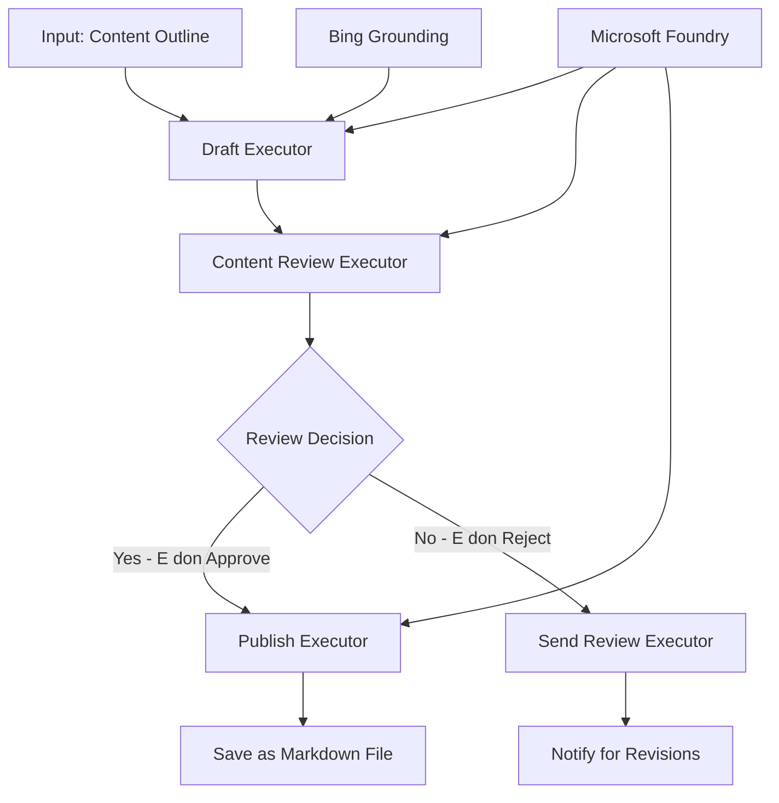

# 🔀 Conditional Agent Workflows wit Microsoft Foundry (.NET)

## 📋 Intelligent Decision-Based Workflow Tutorial

Dis notebook dey show **conditional workflow patterns** wit Microsoft Foundry and Microsoft Agent Framework for .NET. You go learn how to build correct, decision-driven workflows wey sabi route processing based on AI analysis, business rules, and dynamic conditions for enterprise-grade automation.

## 🎯 Wetin You Go Learn

### 🧠 **Intelligent Decision Architecture**
- **Conditional Logic Implementation**: Build complex decision trees get plenti branching points
- **AI-Powered Routing**: Use Microsoft Foundry models to make smart routing decisions
- **Dynamic Workflow Adaptation**: Change workflow behavior based on runtime analysis and conditions
- **Enterprise Rule Integration**: Put business logic and compliance requirements inside workflows

### 🔀 **Advanced Conditional Patterns**
- **Multi-Criteria Decision Making**: Check plenti factors before routing decisions
- **Context-Aware Processing**: Make decisions based on collected workflow context and history
- **Adaptive Workflow Modification**: Change processing paths based on real-time conditions
- **Rule Engine Integration**: Run correct business rule engines inside workflows

### 🏢 **Enterprise Conditional Applications**
- **Document Classification & Routing**: Automatically classify and send documents to correct workflows
- **Customer Service Triage**: Smart routing of customer inquiries to special handling teams
- **Compliance & Risk Processing**: Use different validation and review processes based on risk assessment
- **Quality Assurance Workflows**: Send content through correct review processes based on quality metrics

## ⚙️ Prerequisites & Setup

### 📦 **Required NuGet Packages**

Advanced packages wey you need for conditional workflow processing:

```xml
<!-- Core AI Framework -->
<PackageReference Include="Microsoft.Extensions.AI" Version="9.9.0" />

<!-- Azure AI Agents with Persistent State -->
<PackageReference Include="Azure.AI.Agents.Persistent" Version="1.2.0-beta.5" />

<!-- Azure Identity and Utilities -->
<PackageReference Include="Azure.Identity" Version="1.15.0" />
<PackageReference Include="System.Linq.Async" Version="6.0.3" />
<PackageReference Include="DotNetEnv" Version="3.1.1" />

<!-- Local Workflow Framework References -->
<!-- Microsoft.Agents.Workflows.dll - Advanced workflow orchestration -->
<!-- Microsoft.Agents.AI.AzureAI.dll - Microsoft Foundry integration -->
<!-- Microsoft.Agents.AI.dll - Core agent abstractions -->
```

### 🔑 **Microsoft Foundry Configuration**

**Required Azure Resources:**
- Microsoft Foundry workspace get conditional processing models
- Azure subscription get correct compute quotas and permissions
- Deployed AI models for decision making and content analysis
- (Optional) Bing Search API connection for grounding abilities

**Environment Configuration (.env file):**
```env
# Microsoft Foundry Configuration
AZURE_AI_PROJECT_ENDPOINT=https://your-project.cognitiveservices.azure.com/
BING_CONNECTION_ID=your-bing-connection-id
```

**Authentication Setup:**
```csharp
// Azure CLI or Managed Identity authentication
using Azure.Identity;
var credential = new AzureCliCredential();

// Load environment configuration
DotNetEnv.Env.Load("../../../.env");
```

### 🏗️ **Conditional Workflow Architecture**



**Key Components:**
- **Draft Executor**: AI agent wey dey create initial content drafts from outlines
- **Content Review Executor**: AI agent wey dey check draft quality and compliance
- **Conditional Routing**: Decision logic wey dey route based on review results
- **Publish/Review Paths**: Separate processing paths for approved vs rejected content
- **State Management**: Dey manage content and review context all through workflow

## 🎨 **Conditional Workflow Design Patterns**

### 📋 **Content Production with Quality Gates**
```
Outline → Draft Creation → Quality Review → {Approve: Publish | Reject: Revise}
```

### 🎯 **Risk-Based Document Processing**
```
Document → Risk Assessment → {Low: Standard | High: Enhanced Review}
```

### 🔍 **Intelligent Customer Service Routing**
```
Customer Query → Analysis → {Simple: FAQ Bot | Complex: Human Agent}
```

### 💼 **Compliance-Driven Workflows**
```
Content → Compliance Check → {Pass: Publish | Fail: Legal Review}
```

## 🏢 **Enterprise Conditional Benefits**

### 🎯 **Intelligent Automation**
- **Smart Decision Making**: AI-powered routing decisions based on content analysis and context
- **Adaptive Processing**: Workflows wey automatically change based on changing conditions
- **Business Rule Enforcement**: Automatic application of complex business logic and policies
- **Context-Aware Routing**: Decisions based on full workflow history and collected context

### 📈 **Operational Excellence**
- **Optimized Resource Allocation**: Route work to correct specialists and processes
- **Reduced Manual Intervention**: Automated decision making reduce need for human routing
- **Faster Resolution Times**: Direct routing to correct expertise and processing skills
- **Consistent Application**: Uniform application of business rules and decision criteria

### 🛡️ **Risk Management & Compliance**
- **Automated Risk Assessment**: AI-powered check of content and situation risk levels
- **Compliance Enforcement**: Automatic routing through necessary regulatory processes
- **Security Protocol Application**: Better security steps wey dey apply based on risk assessment
- **Audit Trail Maintenance**: Complete record of routing decisions and reasons

### 📊 **Analytics & Continuous Improvement**
- **Decision Analytics**: Track how good and correct the routing decisions be
- **Pattern Recognition**: Identify trends and patterns for routing decisions over time
- **Performance Optimization**: Continuous improvement of decision criteria and routing efficiency
- **Business Intelligence**: Insights into content characteristics and processing requirements

### 🔧 **Technical Excellence**
- **Persistent State Management**: Dey maintain complex state across workflow execution
- **Scalable Architecture**: Fit handle high-volume conditional processing needs
- **Integration Capabilities**: Easy join with existing business systems and processes
- **Monitoring & Observability**: Full tracking of workflow performance and decisions

Make we build intelligent, decision-driven enterprise workflows wit .NET! 🚀

## 💻 Running the Code

The full implementation dey inside `04.dotnet-agent-framework-workflow-aifoundry-condition.cs`. Dis one dey show how to do **content production workflow with quality gates**:

### 🏗️ **Workflow Architecture**

```
Content Outline → Draft Creation → Quality Review → Conditional Routing:
                                                      ├─ Approved (>200 words) → Publish
                                                      └─ Rejected (<200 words) → Review Notification
```

**Agents for the Workflow:**
1. **Evangelist Agent**: Dey create tutorial drafts from outlines with Bing grounding
2. **Content Reviewer Agent**: Dey check draft quality (word count, completeness)
3. **Publisher Agent**: Dey save approved content as timestamped Markdown files

**Custom Executors:**
1. **DraftExecutor**: Dey organize draft creation
2. **ContentReviewExecutor**: Dey do quality check
3. **PublishExecutor**: Dey handle approved content publication
4. **SendReviewExecutor**: Dey manage rejected content notifications

### 🚀 Running the Example

**Wetin you go need:**
- Microsoft Foundry workspace wey correct
- Azure CLI authentication (`az login`)
- (Optional) Bing Search connection for grounding

```bash
# Make di script fit run (Unix/Linux/macOS)
chmod +x 04.dotnet-agent-framework-workflow-aifoundry-condition.cs

# Run di conditional workflow
./04.dotnet-agent-framework-workflow-aifoundry-condition.cs
```

Or for Windows:
```powershell
dotnet run 04.dotnet-agent-framework-workflow-aifoundry-condition.cs
```

### 📝 Wetin Go Show For Output

The workflow go:
1. **Create Agents**: Start three special Microsoft Foundry agents
2. **Generate Draft**: Evangelist agent go create tutorial draft from outline
3. **Review Content**: Content Reviewer go check draft quality
4. **Conditional Routing**:
   - **If approved (>200 words)**: Publish executor go save am as Markdown file
   - **If rejected (<200 words)**: Send review notification
5. **Show Results**: Show final workflow outcome

### 🔧 Customization Options

**Change Review Criteria:**
```csharp
const string ContentReviewerInstructions = @"
You are a content reviewer...
1. Check if content is more than 500 words (instead of 200)
2. Verify technical accuracy
3. Ensure proper formatting
...";
```

**Add More Conditional Paths:**
```csharp
var workflow = new WorkflowBuilder(draftExecutor)
    .AddEdge(draftExecutor, contentReviewerExecutor)
    .AddEdge(contentReviewerExecutor, publishExecutor, condition: GetCondition("Excellent"))
    .AddEdge(contentReviewerExecutor, editExecutor, condition: GetCondition("Good"))
    .AddEdge(contentReviewerExecutor, sendReviewerExecutor, condition: GetCondition("Poor"))
    .Build();
```

**Change Content Requirements:**
```csharp
string OUTLINE_Content = @"
# Your Custom Topic
## Section 1
https://your-reference-url
## Section 2
...
";
```

### 🎯 Real-World Uses

Dis conditional workflow pattern good for:
- **Content Management Systems**: Automated editorial workflows wit quality gates
- **Document Processing**: Route documents based on classification and compliance
- **Customer Support**: Smart ticket routing based on complexity and urgency
- **Legal Review**: Route contracts based on risk assessment and value
- **HR Processes**: Route applications through correct screening workflows

### 🔍 Understand Conditional Logic

**Condition Function:**
```csharp
public Func<object?, bool> GetCondition(string expectedResult) =>
    reviewResult => reviewResult is ReviewResult review && review.Result == expectedResult;
```

Dis function dey create one predicate wey:
1. Check if di result na type `ReviewResult`
2. Compare di `Result` property to wetin e suppose be
3. Return true/false to decide routing

**Workflow Edges wit Conditions:**
```csharp
.AddEdge(contentReviewerExecutor, publishExecutor, condition: GetCondition("Yes"))
.AddEdge(contentReviewerExecutor, sendReviewerExecutor, condition: GetCondition("No"))
```

### 📊 Advanced Features

**JSON Schema Validation:**
Di workflow dey use JSON schemas to make sure say responses dey structured:

```csharp
// Define response structure
public class ReviewResult
{
    [JsonPropertyName("review_result")]
    public string Result { get; set; } = string.Empty;
    
    [JsonPropertyName("reason")]
    public string Reason { get; set; } = string.Empty;
    
    [JsonPropertyName("draft_content")]
    public string DraftContent { get; set; } = string.Empty;
}

// Apply to agent
ResponseFormat = ChatResponseFormat.ForJsonSchema(
    AIJsonUtilities.CreateJsonSchema(typeof(ReviewResult)), 
    "ReviewResult", 
    "Review Result From DraftContent"
)
```

**Bing Grounding Integration:**
Di Evangelist agent dey use Bing grounding to get real-time info:

```csharp
var bingGroundingConfig = new BingGroundingSearchConfiguration(bing_conn_id);
BingGroundingToolDefinition bingGroundingTool = new(
    new BingGroundingSearchToolParameters([bingGroundingConfig])
);
```

Dis make the agent fit follow URLs for di outline and extract current info.

### 🛡️ Error Handling

Di workflow get solid error handling for rejected content:
- Review failures go trigger alternative path
- Notifications go provide clear rejection reasons
- Content go remain for revision

### 🔄 Extending the Workflow

**Add Revision Loop:**
Create feedback loop wey go re-draft content automatically:

```csharp
.AddEdge(contentReviewerExecutor, publishExecutor, condition: GetCondition("Yes"))
.AddEdge(contentReviewerExecutor, draftExecutor, condition: GetCondition("No")) // Loop back
```

**Add Multi-Level Review:**
Add many review stages with different criteria:

```csharp
.AddEdge(draftExecutor, technicalReviewer)
.AddEdge(technicalReviewer, editorialReviewer, condition: GetCondition("TechPass"))
.AddEdge(editorialReviewer, publishExecutor, condition: GetCondition("EditPass"))
```

Dis conditional workflow pattern na solid base to build correct, intelligent enterprise automation systems! 🚀

---

<!-- CO-OP TRANSLATOR DISCLAIMER START -->
**Disclaimer**:
Dis document don translate wit AI translation service [Co-op Translator](https://github.com/Azure/co-op-translator). Even tho we dey try make am correct, abeg make you know say automated translation fit get errors or mistakes. Di original document for dia own language na im be di correct source. For important info, make person wey sabi human translation do am. We no go responsible for any misunderstanding or wrong understanding wey fit happen because of dis translation.
<!-- CO-OP TRANSLATOR DISCLAIMER END -->