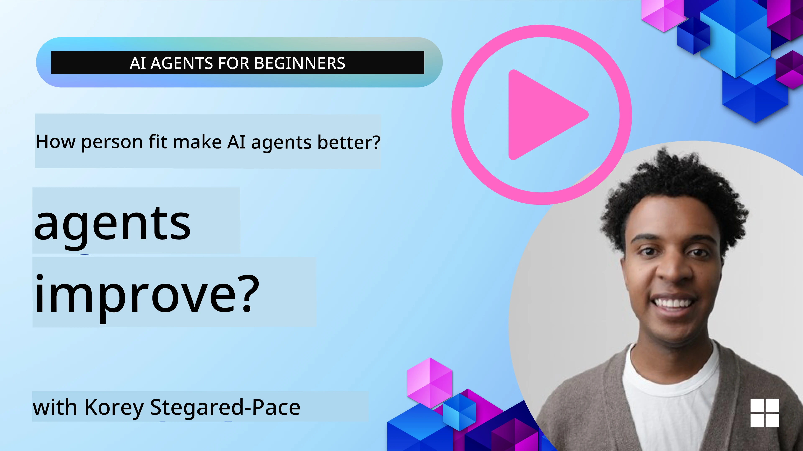
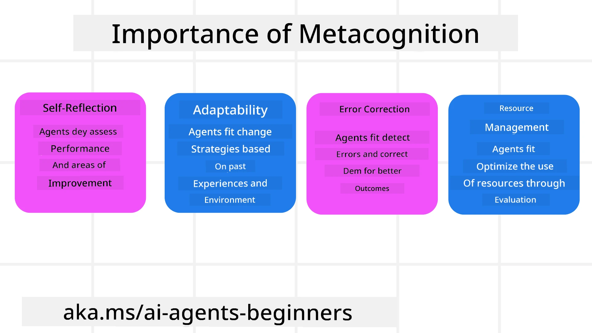
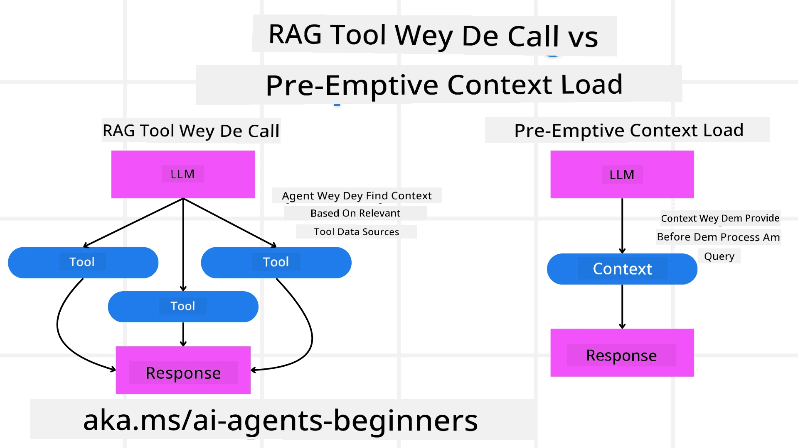

[](https://youtu.be/His9R6gw6Ec?si=3_RMb8VprNvdLRhX)

> _(Click di image wey dey top so make you fit watch video for dis lesson)_
# Metacognition for AI Agents

## Introduction

Welcome to di lesson wey talk about metacognition for AI agents! Dis chapter make for beginners wey dey curious about how AI agents fit think about dia own thinking process dem. By di end of dis lesson, you go understand di koko concepts and you go get practical examples to use metacognition for AI agent design.

## Wetin You Go Learn

After you finish dis lesson, you go fit:

1. Understand wetin reasoning loops mean for agent definitions.
2. Use planning and evaluation ways to help agents wey dey self-correct.
3. Create your own agents wey fit manipulate code to do tasks.

## Introduction to Metacognition

Metacognition na di higher-level brain work wey mean say you dey think about your own thinking. For AI agents, e mean say dem fit check and adjust dia actions based on self-awareness and past experience dem. Metacognition, or "thinking about thinking," na important idea for making agentic AI systems. E mean say AI systems sabi dia own inside process dem and fit monitor, regulate, and adjust dia behavior well-well. E be like how we dey read di room or check problem. Dis kind self-awareness fit help AI systems make better decisions, spot error, and improve how dem dey work over time—still connect back to di Turing test and di wahala about whether AI go take over.

When you talk about agentic AI systems, metacognition fit help solve some gbege dem, like:
- Transparency: Make sure AI systems fit explain dia reasoning and decisions.
- Reasoning: Make AI systems better at join information together and make good decisions.
- Adaptation: Make AI systems fit adjust to new places and changing conditions.
- Perception: Make AI systems more sharp for recognizing and understanding data from dia environment.

### Wetin Metacognition Be?

Metacognition, or "thinking about thinking," na higher-level mental process wey get self-awareness and self-control over one own thinking process dem. For AI, metacognition dey empower agents to check and change dia strategies and actions, wey go bring better problem-solving and decision skills. If you understand metacognition, you fit design AI agents wey no be only smarter but also more adaptable and efficient. For real metacognition, you go see AI dey reason about im own reasoning.

Example: “I prioritize cheaper flights because… I fit dey miss direct flights, so make I check again.”
Dem dey keep track of how or why dem choose one route.
- Dem go notice say dem make mistake because dem rely too much on user preferences from last time, so dem go change dia decision style, no be just di final suggestion.
- Dem dey diagnose patterns like, “Anytime I see user talk ‘too crowded,’ I no go just remove some attractions but also think say my way to pick ‘top attractions’ no correct if I always just rank by popularity.”

### Why Metacognition Important for AI Agents

Metacognition get big role for AI agent design for some reasons dem:



- Self-Reflection: Agents fit check dia own performance and find wetin dem fit improve.
- Adaptability: Agents fit change dia strategies based on past experience and new environments.
- Error Correction: Agents fit detect and fix mistakes on dia own, wey go make result correct.
- Resource Management: Agents fit use resources well, like time and computer power, by planning and checking dia actions.

## Components of AI Agent

Before you enter metacognitive process dem, e good make you sabi di basic parts wey make AI agent. AI agent dey usually get:

- Persona: Di personality and wahala wey agent get, wey define how e dey interact with users.
- Tools: Di powers and functions wey agent fit do.
- Skills: Di knowledge and expertise wey agent get.

These components dey work together to create one "expertise unit" wey fit do certain tasks.

**Example**:
Think about travel agent, wey no be only dey plan your holiday but dey adjust im plans based on real-time data and past customer journey experience.

### Example: Metacognition for Travel Agent Service

Imagine say you dey design travel agent service powered by AI. Dis agent, wey be "Travel Agent," dey help users plan dia holiday. To add metacognition, Travel Agent need check and adjust dia actions based on self-awareness and past experience. Dis na how metacognition fit play role:

#### Current Task

Di task now na to help user plan trip go Paris.

#### Steps to Finish Di Task

1. **Gather User Preferences**: Ask user about travel dates, budget, interests (like museums, food, shopping), and any special requirements.
2. **Retrieve Information**: Search for flight options, places to stay, attractions, and restaurants wey fit di user preference.
3. **Generate Recommendations**: Give personalized itinerary with flight details, hotel booking, and suggested activities.
4. **Adjust Based on Feedback**: Ask user for feedback about di recommendation and make changes if needed.

#### Needed Resources

- Access to flight and hotel booking databases.
- Information about Paris attractions and restaurants.
- User feedback data from previous times.

#### Experience and Self-Reflection

Travel Agent dey use metacognition to check im performance and learn from past experience. Example:

1. **Analyzing User Feedback**: Travel Agent go check user feedback to know which recommendations make sense and which no make sense. E go change im future suggestions.
2. **Adaptability**: If user don talk say e no like crowded places before, Travel Agent no go recommend popular tourist place for peak time in future.
3. **Error Correction**: If Travel Agent make mistake for booking before, like gimme hotel wey full booked, e go learn to check availability better before advice.

#### Practical Developer Example

Here be simple example of how Travel Agent code fit look if e dey use metacognition:

```python
class Travel_Agent:
    def __init__(self):
        self.user_preferences = {}
        self.experience_data = []

    def gather_preferences(self, preferences):
        self.user_preferences = preferences

    def retrieve_information(self):
        # Find flight dem, hotel dem, and places wey people dey like based on wetin you like
        flights = search_flights(self.user_preferences)
        hotels = search_hotels(self.user_preferences)
        attractions = search_attractions(self.user_preferences)
        return flights, hotels, attractions

    def generate_recommendations(self):
        flights, hotels, attractions = self.retrieve_information()
        itinerary = create_itinerary(flights, hotels, attractions)
        return itinerary

    def adjust_based_on_feedback(self, feedback):
        self.experience_data.append(feedback)
        # Check wetin people talk and change wetin e go recommend next time
        self.user_preferences = adjust_preferences(self.user_preferences, feedback)

# How to use am as example
travel_agent = Travel_Agent()
preferences = {
    "destination": "Paris",
    "dates": "2025-04-01 to 2025-04-10",
    "budget": "moderate",
    "interests": ["museums", "cuisine"]
}
travel_agent.gather_preferences(preferences)
itinerary = travel_agent.generate_recommendations()
print("Suggested Itinerary:", itinerary)
feedback = {"liked": ["Louvre Museum"], "disliked": ["Eiffel Tower (too crowded)"]}
travel_agent.adjust_based_on_feedback(feedback)
```

#### Why Metacognition Important

- **Self-Reflection**: Agents fit check dia own performance and find wetin dem fit improve.
- **Adaptability**: Agents fit change strategy based on feedback and new things wey happen.
- **Error Correction**: Agents fit find and fix mistake on dia own.
- **Resource Management**: Agents fit use resources well, like time and computer power.

By adding metacognition, Travel Agent fit give better and correct travel recommendations, wey go make better user experience.

---

## 2. Planning for Agents

Planning na big part of AI agent behavior. E mean say you go arrange the steps wey you need to reach goal, while you dey think about di current status, resources, and any wahala wey fit show.

### Elements of Planning

- **Current Task**: Talk di task clear.
- **Steps to Finish Di Task**: Break the task into small small steps.
- **Needed Resources**: Find resources wey you need.
- **Experience**: Use past experience to guide your planning.

**Example**:
Dis na di steps wey Travel Agent go take help user plan dia trip well:

### Steps for Travel Agent

1. **Gather User Preferences**
   - Ask user about dia travel date, budget, interests, and special things wey dem want.
   - Example: "When you plan to travel?" "How much you wan spend?" "Wetins you like do for holiday?"

2. **Retrieve Information**
   - Search travel options wey fit user preference.
   - **Flights**: Find flights wey fit with user budget and travel dates.
   - **Accommodations**: Find hotels or rental places wey fit user location and price preferences.
   - **Attractions and Restaurants**: Find popular attractions and food place wey fit user interests.

3. **Generate Recommendations**
   - Gather the info arrange am into personal travel plan.
   - Give details like flight options, hotel bookings, and suggested activities wey fit user preference.

4. **Share Plan with User**
   - Show the plan to user make dem see am.
   - Example: "This na suggested plan for your trip to Paris. E get flight details, hotel bookings, and list of activities and restaurants I recommend. Make you yan me your mind!"

5. **Collect Feedback**
   - Ask user to talk if dem like the plan or not.
   - Example: "You like di flight options?" "Is di hotel good for you?" "Any activities you wan add or remove?"

6. **Change Plan Based on Feedback**
   - Change the plan based on wetin user talk.
   - Adjust flights, hotel, and activities to fit better with user taste.

7. **Final Confirmation**
   - Show updated plan to user to confirm.
   - Example: "I don change the plan as you talk. This na updated plan. Everything dey oke for you?"

8. **Book and Confirm**
   - After user agree, book flights, hotels, and activities.
   - Send confirmation details to user.

9. **Continue Support**
   - Dey available to help user if dem need changes or extra requests before and during dem trip.
   - Example: "If you need any help during your trip, you fit hala me anytime!"

### Example Interaction

```python
class Travel_Agent:
    def __init__(self):
        self.user_preferences = {}
        self.experience_data = []

    def gather_preferences(self, preferences):
        self.user_preferences = preferences

    def retrieve_information(self):
        flights = search_flights(self.user_preferences)
        hotels = search_hotels(self.user_preferences)
        attractions = search_attractions(self.user_preferences)
        return flights, hotels, attractions

    def generate_recommendations(self):
        flights, hotels, attractions = self.retrieve_information()
        itinerary = create_itinerary(flights, hotels, attractions)
        return itinerary

    def adjust_based_on_feedback(self, feedback):
        self.experience_data.append(feedback)
        self.user_preferences = adjust_preferences(self.user_preferences, feedback)

# Example wey you fit use inside booing request
travel_agent = Travel_Agent()
preferences = {
    "destination": "Paris",
    "dates": "2025-04-01 to 2025-04-10",
    "budget": "moderate",
    "interests": ["museums", "cuisine"]
}
travel_agent.gather_preferences(preferences)
itinerary = travel_agent.generate_recommendations()
print("Suggested Itinerary:", itinerary)
feedback = {"liked": ["Louvre Museum"], "disliked": ["Eiffel Tower (too crowded)"]}
travel_agent.adjust_based_on_feedback(feedback)
```

## 3. Corrective RAG System

First make we understand the difference between RAG Tool and Pre-emptive Context Load



### Retrieval-Augmented Generation (RAG)

RAG na combination of retrieval system and generative model. When you ask question, di retrieval system go find correct documents or data from outside source, then di retrieved info go help improve di input to di generative model. Dis go help di model generate correct and context-related answers.

For RAG system, di agent go find info from knowledge base and use am to give correct response or action.

### Corrective RAG Method

Di Corrective RAG method dey focus on how to use RAG to correct mistake and make AI agents accurate. This one involve:

1. **Prompting Technique**: Use specific prompts to guide agent to find correct information.
2. **Tool**: Use algorithms and methods wey fit help agent check if info wey e find dey correct and then generate right responses.
3. **Evaluation**: Dey constantly check how agent dey perform and make changes to improve accuracy and efficiency.

#### Example: Corrective RAG for Search Agent

Think about search agent wey dey find info from web to answer user questions. Corrective RAG method fit involve:

1. **Prompting Technique**: Formulate search queries based on wetin user talk.
2. **Tool**: Use natural language processing and machine learning algorithms to rank and filter search results.
3. **Evaluation**: Analyze user feedback to find and fix wrong info for retrieved data.

### Corrective RAG for Travel Agent

Corrective RAG (Retrieval-Augmented Generation) dey help AI to find and generate info correct and also fix any mistake. Make we see how Travel Agent fit use Corrective RAG to give accurate and appropriate travel advice.

This one involve:

- **Prompting Technique:** Use specific prompts to guide agent find correct info.
- **Tool:** Use algorithms and methods to help agent check if info dey relevant and generate accurate answers.
- **Evaluation:** Always check agent performance and change am to improve accuracy and efficiency.

#### Steps for Using Corrective RAG for Travel Agent

1. **Initial User Interaction**
   - Travel Agent go gather first user preferences like destination, travel dates, budget, and interests.
   - Example:

     ```python
     preferences = {
         "destination": "Paris",
         "dates": "2025-04-01 to 2025-04-10",
         "budget": "moderate",
         "interests": ["museums", "cuisine"]
     }
     ```

2. **Retrieval of Information**
   - Travel Agent go find info about flights, hotels, attractions, and restaurants base on user preference.
   - Example:

     ```python
     flights = search_flights(preferences)
     hotels = search_hotels(preferences)
     attractions = search_attractions(preferences)
     ```

3. **Generate initial recommendations**
   - Travel Agent go use collected data make personalized plan.
   - Example:

     ```python
     itinerary = create_itinerary(flights, hotels, attractions)
     print("Suggested Itinerary:", itinerary)
     ```

4. **Collect user feedback**
   - Travel Agent go ask user for feedback for first recommendations.
   - Example:

     ```python
     feedback = {
         "liked": ["Louvre Museum"],
         "disliked": ["Eiffel Tower (too crowded)"]
     }
     ```

5. **Corrective RAG Process**
   - **Prompting Technique**: Travel Agent go make new search queries based on user feedback.
     - Example:

       ```python
       if "disliked" in feedback:
           preferences["avoid"] = feedback["disliked"]
       ```

   - **Tool**: Travel Agent go use algorithms take rank and filter new search results, focus on relevance based on user feedback.
     - Example:

       ```python
       new_attractions = search_attractions(preferences)
       new_itinerary = create_itinerary(flights, hotels, new_attractions)
       print("Updated Itinerary:", new_itinerary)
       ```

   - **Evaluation**: Travel Agent go always check if recommendations relevant and accurate by analyzing user feedback and make adjustments.
     - Example:

       ```python
       def adjust_preferences(preferences, feedback):
           if "liked" in feedback:
               preferences["favorites"] = feedback["liked"]
           if "disliked" in feedback:
               preferences["avoid"] = feedback["disliked"]
           return preferences

       preferences = adjust_preferences(preferences, feedback)
       ```

#### Practical Example

Here be simple Python code example wey join Corrective RAG method for Travel Agent:

```python
class Travel_Agent:
    def __init__(self):
        self.user_preferences = {}
        self.experience_data = []

    def gather_preferences(self, preferences):
        self.user_preferences = preferences

    def retrieve_information(self):
        flights = search_flights(self.user_preferences)
        hotels = search_hotels(self.user_preferences)
        attractions = search_attractions(self.user_preferences)
        return flights, hotels, attractions

    def generate_recommendations(self):
        flights, hotels, attractions = self.retrieve_information()
        itinerary = create_itinerary(flights, hotels, attractions)
        return itinerary

    def adjust_based_on_feedback(self, feedback):
        self.experience_data.append(feedback)
        self.user_preferences = adjust_preferences(self.user_preferences, feedback)
        new_itinerary = self.generate_recommendations()
        return new_itinerary

# Na so e dey waka for example
travel_agent = Travel_Agent()
preferences = {
    "destination": "Paris",
    "dates": "2025-04-01 to 2025-04-10",
    "budget": "moderate",
    "interests": ["museums", "cuisine"]
}
travel_agent.gather_preferences(preferences)
itinerary = travel_agent.generate_recommendations()
print("Suggested Itinerary:", itinerary)
feedback = {"liked": ["Louvre Museum"], "disliked": ["Eiffel Tower (too crowded)"]}
new_itinerary = travel_agent.adjust_based_on_feedback(feedback)
print("Updated Itinerary:", new_itinerary)
```

### Pre-emptive Context Load


Pre-emptive Context Load na di tin wey mean say yu go load correct context or background information into di model before dem process any query. Dis one mean say di model get access to dis kain information from di beginning, wey fit help am generate correct response without di need to retrieve extra data during di process.

Dis na example wey simplify how pre-emptive context load fit look for travel agent application wey dey use Python:

```python
class TravelAgent:
    def __init__(self):
        # Pre-load popular destinations and their information
        self.context = {
            "Paris": {"country": "France", "currency": "Euro", "language": "French", "attractions": ["Eiffel Tower", "Louvre Museum"]},
            "Tokyo": {"country": "Japan", "currency": "Yen", "language": "Japanese", "attractions": ["Tokyo Tower", "Shibuya Crossing"]},
            "New York": {"country": "USA", "currency": "Dollar", "language": "English", "attractions": ["Statue of Liberty", "Times Square"]},
            "Sydney": {"country": "Australia", "currency": "Dollar", "language": "English", "attractions": ["Sydney Opera House", "Bondi Beach"]}
        }

    def get_destination_info(self, destination):
        # Fetch destination information from pre-loaded context
        info = self.context.get(destination)
        if info:
            return f"{destination}:\nCountry: {info['country']}\nCurrency: {info['currency']}\nLanguage: {info['language']}\nAttractions: {', '.join(info['attractions'])}"
        else:
            return f"Sorry, we don't have information on {destination}."

# Example usage
travel_agent = TravelAgent()
print(travel_agent.get_destination_info("Paris"))
print(travel_agent.get_destination_info("Tokyo"))
```

#### Explanation

1. **Initialization (`__init__` method)**: Di `TravelAgent` class dey pre-load dictionary wey get info about popular destinations like Paris, Tokyo, New York, and Sydney. Dis dictionary get details like country, currency, language, and major attractions for each destination.

2. **Retrieving Information (`get_destination_info` method)**: When user ask about one specific destination, di `get_destination_info` method go fetch di correct info from di pre-loaded context dictionary.

By pre-loading di context, di travel agent application fit quick respond to user question without to dey find dis info from outside source for real-time. E make di app more efficient and fast.

### Bootstrapping di Plan wit One Goal Before Dem Start Iterate

Bootstrapping plan wit one goal mean say yu start wit one clear objective or target wey yu want reach. By to define dis goal before begin, di model fit use am as di guide for di whole iterative process. E help make sure say each iteration dey closer to di desired result, and e make di process more efficient and focused.

Dis na example of how yu fit bootstrap travel plan wit one goal before dem start to iterate for travel agent wey dey use Python:

### Scenario

One travel agent want plan customized vacation for client. Di goal na to create travel itinerary wey go maximize di client's satisfaction based on wetin dem like and di budget.

### Steps

1. Define client preferences and budget.
2. Bootstrap initial plan based on these preferences.
3. Iterate to refine di plan, optimize for client satisfaction.

#### Python Code

```python
class TravelAgent:
    def __init__(self, destinations):
        self.destinations = destinations

    def bootstrap_plan(self, preferences, budget):
        plan = []
        total_cost = 0

        for destination in self.destinations:
            if total_cost + destination['cost'] <= budget and self.match_preferences(destination, preferences):
                plan.append(destination)
                total_cost += destination['cost']

        return plan

    def match_preferences(self, destination, preferences):
        for key, value in preferences.items():
            if destination.get(key) != value:
                return False
        return True

    def iterate_plan(self, plan, preferences, budget):
        for i in range(len(plan)):
            for destination in self.destinations:
                if destination not in plan and self.match_preferences(destination, preferences) and self.calculate_cost(plan, destination) <= budget:
                    plan[i] = destination
                    break
        return plan

    def calculate_cost(self, plan, new_destination):
        return sum(destination['cost'] for destination in plan) + new_destination['cost']

# Exampul how you fit take use am
destinations = [
    {"name": "Paris", "cost": 1000, "activity": "sightseeing"},
    {"name": "Tokyo", "cost": 1200, "activity": "shopping"},
    {"name": "New York", "cost": 900, "activity": "sightseeing"},
    {"name": "Sydney", "cost": 1100, "activity": "beach"},
]

preferences = {"activity": "sightseeing"}
budget = 2000

travel_agent = TravelAgent(destinations)
initial_plan = travel_agent.bootstrap_plan(preferences, budget)
print("Initial Plan:", initial_plan)

refined_plan = travel_agent.iterate_plan(initial_plan, preferences, budget)
print("Refined Plan:", refined_plan)
```

#### Code Explanation

1. **Initialization (`__init__` method)**: Di `TravelAgent` class dey initialized wit list of potential destinations, each get attributes like name, cost, and activity type.

2. **Bootstrapping di Plan (`bootstrap_plan` method)**: Dis method dey create initial travel plan based on client preferences and budget. E dey go through di destinations list and add dem to di plan if dem match client preferences and e fit di budget.

3. **Matching Preferences (`match_preferences` method)**: Dis method dey check if destination match client preferences.

4. **Iterating di Plan (`iterate_plan` method)**: Dis method dey refine initial plan by trying to replace each destination inside di plan wit better match, considering client preferences and budget constraints.

5. **Calculating Cost (`calculate_cost` method)**: Dis method dey calculate total cost of di current plan plus any new destination.

#### Example Usage

- **Initial Plan**: Di travel agent create initial plan based on client preferences for sightseeing and budget of $2000.
- **Refined Plan**: Di travel agent iterate di plan, optimize for client preferences and budget.

By bootstrapping di plan wit one clear goal (e.g., maxing client satisfaction) and iterating to refine di plan, di travel agent fit create customized and optimized travel itinerary for client. Dis approach make sure say di travel plan align wit client preferences and budget from start and improve as iteration dey go.

### How to Use LLM for Re-ranking and Scoring

Large Language Models (LLMs) fit dey used for re-ranking and scoring by to evaluate relevance and quality of di documents wey dem retrieve or responses wey dem generate. Na how e dey work be dis:

**Retrieval:** Di first step na to fetch set of candidate documents or responses based on di query.

**Re-ranking:** Di LLM go evaluate these candidates and rearrange dem based on their relevance and quality. Dis step dey make sure say di best correct info dey show first.

**Scoring:** Di LLM go assign scores to each candidate, wey reflect their relevance and quality. Dis help you pick di best response or document for user.

By to use LLM for re-ranking and scoring, system fit give more correct and contextually relevant info, wey go better di user experience.

Dis na example of how travel agent fit use Large Language Model (LLM) for re-ranking and scoring travel destinations based on user preferences for Python:

#### Scenario - Travel based on Preferences

One travel agent want recommend best travel destinations to client based on their preferences. Di LLM go help re-rank and score di destinations to make sure say di most relevant options dey.

#### Steps:

1. Collect user preferences.
2. Retrieve list of potential travel destinations.
3. Use di LLM to re-rank and score di destinations based on user preferences.

Dis na how you fit update di previous example use Azure OpenAI Services:

#### Requirements

1. You need Azure subscription.
2. Create Azure OpenAI resource and get your API key.

#### Example Python Code

```python
import requests
import json

class TravelAgent:
    def __init__(self, destinations):
        self.destinations = destinations

    def get_recommendations(self, preferences, api_key, endpoint):
        # Make one prompt for the Azure OpenAI
        prompt = self.generate_prompt(preferences)
        
        # Set headers and payload for the request
        headers = {
            'Content-Type': 'application/json',
            'Authorization': f'Bearer {api_key}'
        }
        payload = {
            "prompt": prompt,
            "max_tokens": 150,
            "temperature": 0.7
        }
        
        # Call the Azure OpenAI API make we get the destinations wey dem re-rank and give scores
        response = requests.post(endpoint, headers=headers, json=payload)
        response_data = response.json()
        
        # Comot and return the recommendations
        recommendations = response_data['choices'][0]['text'].strip().split('\n')
        return recommendations

    def generate_prompt(self, preferences):
        prompt = "Here are the travel destinations ranked and scored based on the following user preferences:\n"
        for key, value in preferences.items():
            prompt += f"{key}: {value}\n"
        prompt += "\nDestinations:\n"
        for destination in self.destinations:
            prompt += f"- {destination['name']}: {destination['description']}\n"
        return prompt

# Example how to use am
destinations = [
    {"name": "Paris", "description": "City of lights, known for its art, fashion, and culture."},
    {"name": "Tokyo", "description": "Vibrant city, famous for its modernity and traditional temples."},
    {"name": "New York", "description": "The city that never sleeps, with iconic landmarks and diverse culture."},
    {"name": "Sydney", "description": "Beautiful harbour city, known for its opera house and stunning beaches."},
]

preferences = {"activity": "sightseeing", "culture": "diverse"}
api_key = 'your_azure_openai_api_key'
endpoint = 'https://your-endpoint.com/openai/deployments/your-deployment-name/completions?api-version=2022-12-01'

travel_agent = TravelAgent(destinations)
recommendations = travel_agent.get_recommendations(preferences, api_key, endpoint)
print("Recommended Destinations:")
for rec in recommendations:
    print(rec)
```

#### Code Explanation - Preference Booker

1. **Initialization**: Di `TravelAgent` class dey initialize wit list of potential travel destinations, each get name and description.

2. **Getting Recommendations (`get_recommendations` method)**: Dis method dey generate prompt for Azure OpenAI service based on user preferences and make HTTP POST request to Azure OpenAI API to get re-ranked and scored destinations.

3. **Generating Prompt (`generate_prompt` method)**: Dis method dey build prompt for Azure OpenAI, wey include user preferences and list of destinations. Di prompt go guide di model to re-rank and score destinations based on wetin user like.

4. **API Call**: `requests` library dey used to do HTTP POST request to Azure OpenAI API endpoint. Di response get di re-ranked and scored destinations.

5. **Example Usage**: Di travel agent dey collect user preferences (e.g., interest for sightseeing and diverse culture) and dey use Azure OpenAI service to get re-ranked and scored travel destination recommendations.

Make sure say you replace `your_azure_openai_api_key` wit your real Azure OpenAI API key and `https://your-endpoint.com/...` wit di real endpoint URL of your Azure OpenAI deployment.

By to use LLM for re-ranking and scoring, travel agent fit provide more personalized and relevant travel recommendations to clients, wey go make their overall experience better.

### RAG: Prompting Technique vs Tool

Retrieval-Augmented Generation (RAG) fit be both prompting technique and tool for AI agent development. To sabi di difference between dem fit help you use RAG well for your projects.

#### RAG as Prompting Technique

**Wetin e mean?**

- As prompting technique, RAG dey formulate specific queries or prompts to guide retrieval of relevant info from big corpus or database. Den dis info dey used to generate responses or actions.

**How e dey work:**

1. **Formulate Prompts**: Create well-structured prompts based on task or user's input.
2. **Retrieve Information**: Use di prompts to find relevant data from knowledge base or dataset.
3. **Generate Response**: Combine di retrieved info with generative AI models to create full and coherent response.

**Example for Travel Agent**:

- User Input: "I want to visit museums in Paris."
- Prompt: "Find top museums in Paris."
- Retrieved Information: Details about Louvre Museum, Musée d'Orsay, etc.
- Generated Response: "Here are some top museums in Paris: Louvre Museum, Musée d'Orsay, and Centre Pompidou."

#### RAG as Tool

**Wetin e mean?**

- As tool, RAG na integrated system wey dey automate di retrieval and generation process, make am easier for developers to implement complex AI features without to manually create prompts for each query.

**How e dey work:**

1. **Integration**: Embed RAG inside AI agent architecture, allow am automatically handle retrieval and generation tasks.
2. **Automation**: Di tool dey manage all di process, from when user input enter until to generate final response, without need for explicit prompts for every step.
3. **Efficiency**: E enhance agent performance by to streamline retrieval and generation process, give quick and accurate responses.

**Example for Travel Agent**:

- User Input: "I want to visit museums in Paris."
- RAG Tool: Automatically retrieve info about museums and generate response.
- Generated Response: "Here are some top museums in Paris: Louvre Museum, Musée d'Orsay, and Centre Pompidou."

### Comparison

| Aspect                 | Prompting Technique                                        | Tool                                                  |
|------------------------|-------------------------------------------------------------|-------------------------------------------------------|
| **Manual vs Automatic**| Manual way to make prompts for each query.                  | Automated process for retrieval and generation.       |
| **Control**            | Give more control over retrieval process.                   | Streamlines and automate retrieval and generation.    |
| **Flexibility**        | Allow customized prompts based on specific needs.           | More efficient for big scale implementations.         |
| **Complexity**         | Need to create and tweak prompts.                            | Easy to integrate inside AI agent architecture.       |

### Practical Examples

**Prompting Technique Example:**

```python
def search_museums_in_paris():
    prompt = "Find top museums in Paris"
    search_results = search_web(prompt)
    return search_results

museums = search_museums_in_paris()
print("Top Museums in Paris:", museums)
```

**Tool Example:**

```python
class Travel_Agent:
    def __init__(self):
        self.rag_tool = RAGTool()

    def get_museums_in_paris(self):
        user_input = "I want to visit museums in Paris."
        response = self.rag_tool.retrieve_and_generate(user_input)
        return response

travel_agent = Travel_Agent()
museums = travel_agent.get_museums_in_paris()
print("Top Museums in Paris:", museums)
```

### Evaluating Relevancy

Evaluating relevancy na important part of AI agent performance. E make sure say di info wey agent retrieve and generate dey correct, accurate, and useful to user. Make we see how to evaluate relevancy in AI agents, with practical examples and techniques.

#### Key Concepts in Evaluating Relevancy

1. **Context Awareness**:
   - Agent suppose understand di context of user query to find and generate relevant info.
   - Example: If user ask for "best restaurants in Paris," agent go consider user preferences like cuisine type and budget.

2. **Accuracy**:
   - Info wey agent give suppose correct and up-to-date.
   - Example: Recommend restaurants wey dey open now with good reviews, no be old or closed ones.

3. **User Intent**:
   - Agent suppose sabi wetin user really want behind di query to provide best info.
   - Example: If user ask for "budget-friendly hotels," agent go put affordable options first.

4. **Feedback Loop**:
   - To dey always collect and analyze user feedback help agent improve how e evaluate relevancy.
   - Example: Use user ratings and feedback on previous recommendations to make future responses better.

#### Practical Techniques for Evaluating Relevancy

1. **Relevance Scoring**:
   - Assign relevance score to every retrieved item based on how well e match user query and preferences.
   - Example:

     ```python
     def relevance_score(item, query):
         score = 0
         if item['category'] in query['interests']:
             score += 1
         if item['price'] <= query['budget']:
             score += 1
         if item['location'] == query['destination']:
             score += 1
         return score
     ```

2. **Filtering and Ranking**:
   - Remove unrelated items and rank di remaining ones based on their relevance scores.
   - Example:

     ```python
     def filter_and_rank(items, query):
         ranked_items = sorted(items, key=lambda item: relevance_score(item, query), reverse=True)
         return ranked_items[:10]  # Return di top 10 correct items
     ```

3. **Natural Language Processing (NLP)**:
   - Use NLP techniques to understand user query and find relevant info.
   - Example:

     ```python
     def process_query(query):
         # Use NLP to comot key information from di user query
         processed_query = nlp(query)
         return processed_query
     ```

4. **User Feedback Integration**:
   - Collect user feedback on recommendations and use am to adjust future relevance evaluations.
   - Example:

     ```python
     def adjust_based_on_feedback(feedback, items):
         for item in items:
             if item['name'] in feedback['liked']:
                 item['relevance'] += 1
             if item['name'] in feedback['disliked']:
                 item['relevance'] -= 1
         return items
     ```

#### Example: Evaluating Relevancy in Travel Agent

Dis na practical example of how Travel Agent fit evaluate relevancy of travel recommendations:

```python
class Travel_Agent:
    def __init__(self):
        self.user_preferences = {}
        self.experience_data = []

    def gather_preferences(self, preferences):
        self.user_preferences = preferences

    def retrieve_information(self):
        flights = search_flights(self.user_preferences)
        hotels = search_hotels(self.user_preferences)
        attractions = search_attractions(self.user_preferences)
        return flights, hotels, attractions

    def generate_recommendations(self):
        flights, hotels, attractions = self.retrieve_information()
        ranked_hotels = self.filter_and_rank(hotels, self.user_preferences)
        itinerary = create_itinerary(flights, ranked_hotels, attractions)
        return itinerary

    def filter_and_rank(self, items, query):
        ranked_items = sorted(items, key=lambda item: self.relevance_score(item, query), reverse=True)
        return ranked_items[:10]  # Return top 10 beta items

    def relevance_score(self, item, query):
        score = 0
        if item['category'] in query['interests']:
            score += 1
        if item['price'] <= query['budget']:
            score += 1
        if item['location'] == query['destination']:
            score += 1
        return score

    def adjust_based_on_feedback(self, feedback, items):
        for item in items:
            if item['name'] in feedback['liked']:
                item['relevance'] += 1
            if item['name'] in feedback['disliked']:
                item['relevance'] -= 1
        return items

# How you fit use am
travel_agent = Travel_Agent()
preferences = {
    "destination": "Paris",
    "dates": "2025-04-01 to 2025-04-10",
    "budget": "moderate",
    "interests": ["museums", "cuisine"]
}
travel_agent.gather_preferences(preferences)
itinerary = travel_agent.generate_recommendations()
print("Suggested Itinerary:", itinerary)
feedback = {"liked": ["Louvre Museum"], "disliked": ["Eiffel Tower (too crowded)"]}
updated_items = travel_agent.adjust_based_on_feedback(feedback, itinerary['hotels'])
print("Updated Itinerary with Feedback:", updated_items)
```

### Search wit Intent

Searching wit intent mean to understand and interpret di main reason or goal behind user query to find and generate di most relevant and useful info. Dis method no just dey match keywords but dey try sabi wetin user really need and di context.

#### Key Concepts in Searching wit Intent

1. **Understand User Intent**:
   - User intent fit dey three main types: informational, navigational, and transactional.
     - **Informational Intent**: User dey find info about topic (e.g., "What are di best museums in Paris?").
     - **Navigational Intent**: User want go specific website or page (e.g., "Louvre Museum official website").
     - **Transactional Intent**: User want do transaction like book flight or buy tings (e.g., "Book flight to Paris").

2. **Context Awareness**:
   - To analyze context of user query go help sabi their intent well. Dis include to look at past interactions, user preferences, and specific details of current query.

3. **Natural Language Processing (NLP)**:
   - NLP techniques dey used to understand and interpret natural language queries from users. This include entity recognition, sentiment analysis, and query parsing.

4. **Personalization**:
   - Personalize search results based on user history, preferences, and feedback dey enhance relevancy of the info found.

#### Practical Example: Searching wit Intent in Travel Agent

Make we use Travel Agent as example to show how to implement searching wit intent.

1. **Gather User Preferences**

   ```python
   class Travel_Agent:
       def __init__(self):
           self.user_preferences = {}

       def gather_preferences(self, preferences):
           self.user_preferences = preferences
   ```

2. **Understand User Intent**

   ```python
   def identify_intent(query):
       if "book" in query or "purchase" in query:
           return "transactional"
       elif "website" in query or "official" in query:
           return "navigational"
       else:
           return "informational"
   ```

3. **Context Awareness**


   ```python
   def analyze_context(query, user_history):
       # Join di current query wit di user history make you sabi di context well well
       context = {
           "current_query": query,
           "user_history": user_history
       }
       return context
   ```

4. **Search and Personalize Results**

   ```python
   def search_with_intent(query, preferences, user_history):
       intent = identify_intent(query)
       context = analyze_context(query, user_history)
       if intent == "informational":
           search_results = search_information(query, preferences)
       elif intent == "navigational":
           search_results = search_navigation(query)
       elif intent == "transactional":
           search_results = search_transaction(query, preferences)
       personalized_results = personalize_results(search_results, user_history)
       return personalized_results

   def search_information(query, preferences):
       # Example way wey person fit search for tori wey inform
       results = search_web(f"best {preferences['interests']} in {preferences['destination']}")
       return results

   def search_navigation(query):
       # Example way wey person fit search if e wan find road go some place
       results = search_web(query)
       return results

   def search_transaction(query, preferences):
       # Example way wey person fit search if e wan buy or do transaction
       results = search_web(f"book {query} to {preferences['destination']}")
       return results

   def personalize_results(results, user_history):
       # Example way wey person fit make e own style
       personalized = [result for result in results if result not in user_history]
       return personalized[:10]  # Bring top 10 personalized results back
   ```

5. **Example Usage**

   ```python
   travel_agent = Travel_Agent()
   preferences = {
       "destination": "Paris",
       "interests": ["museums", "cuisine"]
   }
   travel_agent.gather_preferences(preferences)
   user_history = ["Louvre Museum website", "Book flight to Paris"]
   query = "best museums in Paris"
   results = search_with_intent(query, preferences, user_history)
   print("Search Results:", results)
   ```

---

## 4. Generating Code as a Tool

Code generating agents dey use AI models to write and run code, dem dey solve complex problems and auto do task.

### Code Generating Agents

Code generating agents dey use generative AI models to write and run code. Dis agents fit solve complex problems, auto do task, and give beta insight by generating and running code for different programming languages.

#### Practical Applications

1. **Automated Code Generation**: Generate code snippets for specific tasks, like data analysis, web scraping, or machine learning.
2. **SQL as a RAG**: Use SQL queries to find and manage data from databases.
3. **Problem Solving**: Create and run code to solve specific problems, like optimizing algorithms or checking data.

#### Example: Code Generating Agent for Data Analysis

Imagine you dey design code generating agent. Na how e fit work:

1. **Task**: Analyze dataset to find trends and patterns.
2. **Steps**:
   - Load dataset into data analysis tool.
   - Generate SQL queries to filter and gather the data.
   - Run the queries and collect results.
   - Use results to generate visuals and insights.
3. **Required Resources**: Access to dataset, data analysis tools, and SQL sabi.
4. **Experience**: Use past analysis results to improve accuracy and relevance for future.

### Example: Code Generating Agent for Travel Agent

For dis example, we go design code generating agent, Travel Agent, to help users plan their travel by generating and running code. Dis agent fit handle tasks like find travel options, filter results, and put itinerary together with generative AI.

#### Overview of the Code Generating Agent

1. **Gathering User Preferences**: Collect user input like destination, travel dates, budget, and interests.
2. **Generating Code to Fetch Data**: Generate code snippets to find data about flights, hotels, and attractions.
3. **Executing Generated Code**: Run generated code to get real-time info.
4. **Generating Itinerary**: Compile collected data into personalized travel plan.
5. **Adjusting Based on Feedback**: Get user feedback and regenerate code if needed to improve results.

#### Step-by-Step Implementation

1. **Gathering User Preferences**

   ```python
   class Travel_Agent:
       def __init__(self):
           self.user_preferences = {}

       def gather_preferences(self, preferences):
           self.user_preferences = preferences
   ```

2. **Generating Code to Fetch Data**

   ```python
   def generate_code_to_fetch_data(preferences):
       # Example: Make code wey go search flights based on how person like am
       code = f"""
       def search_flights():
           import requests
           response = requests.get('https://api.example.com/flights', params={preferences})
           return response.json()
       """
       return code

   def generate_code_to_fetch_hotels(preferences):
       # Example: Make code wey go search hotels
       code = f"""
       def search_hotels():
           import requests
           response = requests.get('https://api.example.com/hotels', params={preferences})
           return response.json()
       """
       return code
   ```

3. **Executing Generated Code**

   ```python
   def execute_code(code):
       # Run di generated code wit exec
       exec(code)
       result = locals()
       return result

   travel_agent = Travel_Agent()
   preferences = {
       "destination": "Paris",
       "dates": "2025-04-01 to 2025-04-10",
       "budget": "moderate",
       "interests": ["museums", "cuisine"]
   }
   travel_agent.gather_preferences(preferences)
   
   flight_code = generate_code_to_fetch_data(preferences)
   hotel_code = generate_code_to_fetch_hotels(preferences)
   
   flights = execute_code(flight_code)
   hotels = execute_code(hotel_code)

   print("Flight Options:", flights)
   print("Hotel Options:", hotels)
   ```

4. **Generating Itinerary**

   ```python
   def generate_itinerary(flights, hotels, attractions):
       itinerary = {
           "flights": flights,
           "hotels": hotels,
           "attractions": attractions
       }
       return itinerary

   attractions = search_attractions(preferences)
   itinerary = generate_itinerary(flights, hotels, attractions)
   print("Suggested Itinerary:", itinerary)
   ```

5. **Adjusting Based on Feedback**

   ```python
   def adjust_based_on_feedback(feedback, preferences):
       # Change di settings dem based on wetin di user talk
       if "liked" in feedback:
           preferences["favorites"] = feedback["liked"]
       if "disliked" in feedback:
           preferences["avoid"] = feedback["disliked"]
       return preferences

   feedback = {"liked": ["Louvre Museum"], "disliked": ["Eiffel Tower (too crowded)"]}
   updated_preferences = adjust_based_on_feedback(feedback, preferences)
   
   # Make new code and run am wit di updated settings
   updated_flight_code = generate_code_to_fetch_data(updated_preferences)
   updated_hotel_code = generate_code_to_fetch_hotels(updated_preferences)
   
   updated_flights = execute_code(updated_flight_code)
   updated_hotels = execute_code(updated_hotel_code)
   
   updated_itinerary = generate_itinerary(updated_flights, updated_hotels, attractions)
   print("Updated Itinerary:", updated_itinerary)
   ```

### Leveraging environmental awareness and reasoning

Based on the table schema fit make query generation better by using environmental awareness and reasoning.

Here na example how e fit happen:

1. **Understanding the Schema**: System go sabi the table schema and use am to base query generation.
2. **Adjusting Based on Feedback**: System go adjust user preferences based on feedback and reason on which fields for schema need update.
3. **Generating and Executing Queries**: System go generate and run queries to fetch updated flight and hotel data based on new preferences.

Here na updated Python code example wey include these ideas:

```python
def adjust_based_on_feedback(feedback, preferences, schema):
    # Change di preferences based on wetin di user talk
    if "liked" in feedback:
        preferences["favorites"] = feedback["liked"]
    if "disliked" in feedback:
        preferences["avoid"] = feedback["disliked"]
    # Reasoning based on schema to change oda related preferences
    for field in schema:
        if field in preferences:
            preferences[field] = adjust_based_on_environment(feedback, field, schema)
    return preferences

def adjust_based_on_environment(feedback, field, schema):
    # Custom logic to change preferences based on schema and feedback
    if field in feedback["liked"]:
        return schema[field]["positive_adjustment"]
    elif field in feedback["disliked"]:
        return schema[field]["negative_adjustment"]
    return schema[field]["default"]

def generate_code_to_fetch_data(preferences):
    # Make code to collect flight data based on updated preferences
    return f"fetch_flights(preferences={preferences})"

def generate_code_to_fetch_hotels(preferences):
    # Make code to collect hotel data based on updated preferences
    return f"fetch_hotels(preferences={preferences})"

def execute_code(code):
    # Fake run di code and return sample data
    return {"data": f"Executed: {code}"}

def generate_itinerary(flights, hotels, attractions):
    # Make itinerary based on flights, hotels, and attractions
    return {"flights": flights, "hotels": hotels, "attractions": attractions}

# Example schema
schema = {
    "favorites": {"positive_adjustment": "increase", "negative_adjustment": "decrease", "default": "neutral"},
    "avoid": {"positive_adjustment": "decrease", "negative_adjustment": "increase", "default": "neutral"}
}

# Example usage
preferences = {"favorites": "sightseeing", "avoid": "crowded places"}
feedback = {"liked": ["Louvre Museum"], "disliked": ["Eiffel Tower (too crowded)"]}
updated_preferences = adjust_based_on_feedback(feedback, preferences, schema)

# Create code again and run am with updated preferences
updated_flight_code = generate_code_to_fetch_data(updated_preferences)
updated_hotel_code = generate_code_to_fetch_hotels(updated_preferences)

updated_flights = execute_code(updated_flight_code)
updated_hotels = execute_code(updated_hotel_code)

updated_itinerary = generate_itinerary(updated_flights, updated_hotels, feedback["liked"])
print("Updated Itinerary:", updated_itinerary)
```

#### Explanation - Booking Based on Feedback

1. **Schema Awareness**: `schema` dictionary define how preferences go adjust based on feedback. E get fields like `favorites` and `avoid`, plus adjustments.
2. **Adjusting Preferences (`adjust_based_on_feedback` method)**: This method dey adjust preferences based on user feedback and schema.
3. **Environment-Based Adjustments (`adjust_based_on_environment` method)**: This method dey customize adjustments based on schema and feedback.
4. **Generating and Executing Queries**: System dey generate code to fetch updated flight and hotel data based on adjusted preferences and simulate execution of queries.
5. **Generating Itinerary**: System dey create updated itinerary based on new flight, hotel, and attraction data.

By making system environment-aware and reasoning based on schema, e fit generate correct and relevant queries, wey go bring better travel recommendations and personal user experience.

### Using SQL as a Retrieval-Augmented Generation (RAG) Technique

SQL (Structured Query Language) na powerful tool to work with databases. When e dey used as part of Retrieval-Augmented Generation (RAG) approach, SQL fit find relevant data from databases to inform and generate responses or actions for AI agents. Make we see how SQL fit be RAG technique for Travel Agent.

#### Key Concepts

1. **Database Interaction**:
   - SQL dey used to query databases, find relevant info, and manage data.
   - Example: Fetch flight details, hotel info, and attractions from travel database.

2. **Integration with RAG**:
   - SQL queries generate based on user input and preferences.
   - The found data dey used to generate personalized recommendations or actions.

3. **Dynamic Query Generation**:
   - AI agent dey generate dynamic SQL queries based on context and user needs.
   - Example: Customize SQL queries to filter results based on budget, dates, and interests.

#### Applications

- **Automated Code Generation**: Generate code snippets for specific tasks.
- **SQL as a RAG**: Use SQL queries to manage data.
- **Problem Solving**: Create and run code to solve problems.

**Example**:
Data analysis agent:

1. **Task**: Analyze dataset to find trends.
2. **Steps**:
   - Load dataset.
   - Generate SQL queries to filter data.
   - Run queries and get results.
   - Generate visuals and insights.
3. **Resources**: Dataset access, SQL skill.
4. **Experience**: Use past results to improve future analysis.

#### Practical Example: Using SQL in Travel Agent

1. **Gathering User Preferences**

   ```python
   class Travel_Agent:
       def __init__(self):
           self.user_preferences = {}

       def gather_preferences(self, preferences):
           self.user_preferences = preferences
   ```

2. **Generating SQL Queries**

   ```python
   def generate_sql_query(table, preferences):
       query = f"SELECT * FROM {table} WHERE "
       conditions = []
       for key, value in preferences.items():
           conditions.append(f"{key}='{value}'")
       query += " AND ".join(conditions)
       return query
   ```

3. **Executing SQL Queries**

   ```python
   import sqlite3

   def execute_sql_query(query, database="travel.db"):
       connection = sqlite3.connect(database)
       cursor = connection.cursor()
       cursor.execute(query)
       results = cursor.fetchall()
       connection.close()
       return results
   ```

4. **Generating Recommendations**

   ```python
   def generate_recommendations(preferences):
       flight_query = generate_sql_query("flights", preferences)
       hotel_query = generate_sql_query("hotels", preferences)
       attraction_query = generate_sql_query("attractions", preferences)
       
       flights = execute_sql_query(flight_query)
       hotels = execute_sql_query(hotel_query)
       attractions = execute_sql_query(attraction_query)
       
       itinerary = {
           "flights": flights,
           "hotels": hotels,
           "attractions": attractions
       }
       return itinerary

   travel_agent = Travel_Agent()
   preferences = {
       "destination": "Paris",
       "dates": "2025-04-01 to 2025-04-10",
       "budget": "moderate",
       "interests": ["museums", "cuisine"]
   }
   travel_agent.gather_preferences(preferences)
   itinerary = generate_recommendations(preferences)
   print("Suggested Itinerary:", itinerary)
   ```

#### Example SQL Queries

1. **Flight Query**

   ```sql
   SELECT * FROM flights WHERE destination='Paris' AND dates='2025-04-01 to 2025-04-10' AND budget='moderate';
   ```

2. **Hotel Query**

   ```sql
   SELECT * FROM hotels WHERE destination='Paris' AND budget='moderate';
   ```

3. **Attraction Query**

   ```sql
   SELECT * FROM attractions WHERE destination='Paris' AND interests='museums, cuisine';
   ```

By using SQL as part of Retrieval-Augmented Generation (RAG) technique, AI agents like Travel Agent fit dynamically find and use relevant data to provide correct and personalized recommendations.

### Example of Metacognition

To show metacognition implementation, make we create simple agent wey *reflect e own decision-making process* while e dey solve problem. For this example, we go build system where agent dey try optimize hotel choice, but e go check e own reasoning and change strategy if e make mistake or bad choice.

We go simulate dis with basic example where agent select hotels based on price and quality together, but e go "reflect" on decisions and adjust as e go.

#### How this show metacognition:

1. **Initial Decision**: Agent go pick cheapest hotel, e no understand quality effect.
2. **Reflection and Evaluation**: After first choice, agent go check if hotel na "bad" choice using user feedback. If e find say hotel quality too low, e go reflect on reasoning.
3. **Adjusting Strategy**: Agent go change strategy based on reflection from "cheapest" to "highest_quality", so e improve decision making for future.

Here na example:

```python
class HotelRecommendationAgent:
    def __init__(self):
        self.previous_choices = []  # Dey store di hotels wey dem choose before
        self.corrected_choices = []  # Dey store di choices wey dem correct
        self.recommendation_strategies = ['cheapest', 'highest_quality']  # Strategies wey dey available

    def recommend_hotel(self, hotels, strategy):
        """
        Recommend a hotel based on the chosen strategy.
        The strategy can either be 'cheapest' or 'highest_quality'.
        """
        if strategy == 'cheapest':
            recommended = min(hotels, key=lambda x: x['price'])
        elif strategy == 'highest_quality':
            recommended = max(hotels, key=lambda x: x['quality'])
        else:
            recommended = None
        self.previous_choices.append((strategy, recommended))
        return recommended

    def reflect_on_choice(self):
        """
        Reflect on the last choice made and decide if the agent should adjust its strategy.
        The agent considers if the previous choice led to a poor outcome.
        """
        if not self.previous_choices:
            return "No choices made yet."

        last_choice_strategy, last_choice = self.previous_choices[-1]
        # Make we talk say we get some user feedback wey go tell us if di last choice good or no good
        user_feedback = self.get_user_feedback(last_choice)

        if user_feedback == "bad":
            # Change strategy if di previous choice no satisfy
            new_strategy = 'highest_quality' if last_choice_strategy == 'cheapest' else 'cheapest'
            self.corrected_choices.append((new_strategy, last_choice))
            return f"Reflecting on choice. Adjusting strategy to {new_strategy}."
        else:
            return "The choice was good. No need to adjust."

    def get_user_feedback(self, hotel):
        """
        Simulate user feedback based on hotel attributes.
        For simplicity, assume if the hotel is too cheap, the feedback is "bad".
        If the hotel has quality less than 7, feedback is "bad".
        """
        if hotel['price'] < 100 or hotel['quality'] < 7:
            return "bad"
        return "good"

# Simulate list of hotels (price and quality)
hotels = [
    {'name': 'Budget Inn', 'price': 80, 'quality': 6},
    {'name': 'Comfort Suites', 'price': 120, 'quality': 8},
    {'name': 'Luxury Stay', 'price': 200, 'quality': 9}
]

# Make one agent
agent = HotelRecommendationAgent()

# Step 1: Di agent recommend hotel with "cheapest" strategy
recommended_hotel = agent.recommend_hotel(hotels, 'cheapest')
print(f"Recommended hotel (cheapest): {recommended_hotel['name']}")

# Step 2: Di agent think about di choice and fit change strategy if e need
reflection_result = agent.reflect_on_choice()
print(reflection_result)

# Step 3: Di agent recommend again, dis time with di adjusted strategy
adjusted_recommendation = agent.recommend_hotel(hotels, 'highest_quality')
print(f"Adjusted hotel recommendation (highest_quality): {adjusted_recommendation['name']}")
```

#### Agents Metacognition Abilities

The main thing na agent fit:
- Check e past choices and decision-making process.
- Change e strategy based on reflection i.e., metacognition for action.

This na simple type metacognition where system fit adjust reasoning based on inside feedback.

### Conclusion

Metacognition na strong tool wey fit greatly improve AI agents ability. By adding metacognitive process, you fit design agents wey get more smart, adaptable, and efficient. Use the extra resources to learn more about metacognition for AI agents.

### Get more questions about Metacognition Design Pattern?

Join [Microsoft Foundry Discord](https://discord.com/invite/ATgtXmAS5D) to meet others wey dey learn, attend office hours and get your AI Agents questions answer.

## Previous Lesson

[Multi-Agent Design Pattern](../08-multi-agent/README.md)

## Next Lesson

[AI Agents in Production](../10-ai-agents-production/README.md)

---

<!-- CO-OP TRANSLATOR DISCLAIMER START -->
**Disclaimer**:
Dis document don translate wit AI translation service [Co-op Translator](https://github.com/Azure/co-op-translator). Even tho we dey try make am correct, abeg make you know say automated translation fit get errors or mistakes. Di original document for dia own language na im be di correct source. For important info, make person wey sabi human translation do am. We no go responsible for any misunderstanding or wrong understanding wey fit happen because of dis translation.
<!-- CO-OP TRANSLATOR DISCLAIMER END -->