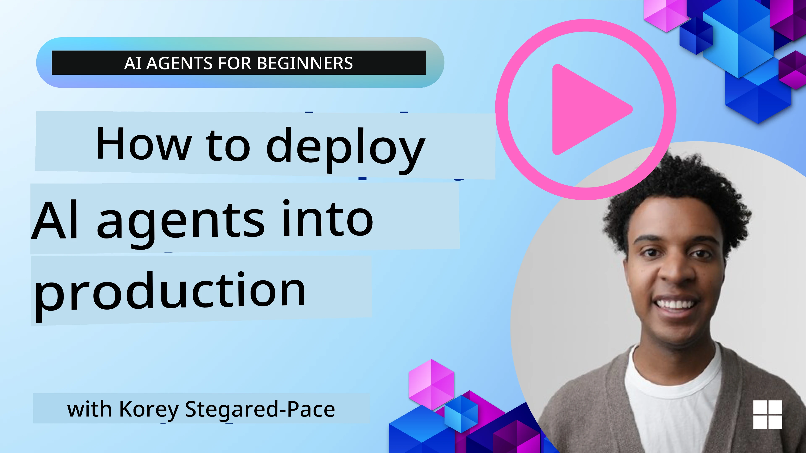

# AI Agents wey Dey for Production: Observability & Evaluation

[](https://youtu.be/l4TP6IyJxmQ?si=reGOyeqjxFevyDq9)

As AI agents dey move from experimental prototypes go real-world applications, e dey important to sabi how dem dey behave, moni dem performance, and evaluate wetin dem dey produce systematically.

## Wetin you go learn

After you don finish dis lesson, you go sabi/understand:
- Di main koncepts for agent observability and evaluation
- Techniques wey fit improve di performance, costs, and effectiveness of agents
- Wetin and how to evaluate your AI agents in a sistematic way
- How to control costs wen you deploy AI agents for production
- How to instrument agents wey dem build with Microsoft Agent Framework

Di goal na to give you di knowledge to turn your "black box" agents into transparent, manageable, and dependable systems.

_**Note:** E important make you deploy AI Agents wey safe and trustworthy. Check out di [Building Trustworthy AI Agents](./06-building-trustworthy-agents/README.md) lesson too._

## Traces and Spans

Observability tools like [Langfuse](https://langfuse.com/) or [Microsoft Foundry](https://learn.microsoft.com/en-us/azure/ai-foundry/what-is-azure-ai-foundry) dem usually represent agent runs as traces and spans.

- **Trace** mean one complete agent task from start to finish (example: handling one user query).
- **Spans** na individual steps wey dey inside di trace (example: calling one language model or fetching data).


<!-- Image URL retained for illustration purposes -->

Without observability, AI agent fit dey feel like "black box" - hin inside state and reasoning no dey clear, e dey hard to diagnose problems or optimize performance. With observability, agents go turn to "glass boxes," wey dey give transparency wey important to build trust and make sure dem dey work the way wey you want.

## Why Observability Matters in Production Environments

When you dey move AI agents to production, new challenges and requirements go show. Observability no be "nice-to-have" again, e don turn critical:

*   **Debugging and Root-Cause Analysis**: When agent fail or e produce unexpected output, observability tools go give you traces wey fit help pinpoint where di error start. Dis one dey especially important for complex agents wey fit get plenty LLM calls, tool interactions, and conditional logic.
*   **Latency and Cost Management**: AI agents dey rely on LLMs and other external APIs wey dem dey bill per token or per call. Observability fit track these calls well, make you see which operations dey too slow or too expensive. With that, teams fit optimize prompts, choose more efficient models, or redesign workflows to manage operational costs and keep good user experience.
*   **Trust, Safety, and Compliance**: For many applications, e dey important to make sure agents dey behave safe and ethical. Observability dey give audit trail of agent actions and decisions. You fit use am detect and mitigate things like prompt injection, harmful content, or wrong handling of personally identifiable information (PII). For example, you fit check traces to know why agent give certain response or why e use particular tool.
*   **Continuous Improvement Loops**: Observability data na foundation for iterative development. By moni how agents dey perform for real world, teams fit find areas to improve, gather data for fine-tuning models, and validate wetin changes dey do. Dis one create feedback loop where production insights from online evaluation dey feed offline experimentation and refinement, dey lead to better agent performance over time.

## Key Metrics to Track

To moni and understand agent behaviour, you need track different metrics and signals. Di exact metrics fit change depend on wetin di agent dey do, but some metrics dey always useful.

Here na some common metrics wey observability tools dey moni:

**Latency:** How quick agent dey respond? Long wait time dey spoil user experience. You suppose measure latency for whole tasks and for individual steps by tracing agent runs. For example, if agent dey take 20 seconds for all model calls, you fit speed am up by using faster model or running model calls in parallel.

**Costs:** How much e dey cost per agent run? AI agents dey call LLMs wey dem dey bill per token or dem dey call external APIs. Plenty tool use or many prompts fit make cost shoot up fast. For example, if agent dey call LLM five times for only small quality improvement, you must check if di cost worth am or if you fit reduce number of calls or use cheaper model. Real-time monitoring fit also show unexpected spikes (e.g., bugs wey dey cause too many API loops).

**Request Errors:** How many requests agent fail? Dis fit include API errors or tool calls wey fail. To make your agent strong for production, you fit setup fallbacks or retries. E.g., if LLM provider A down, you fit switch to LLM provider B as backup.

**User Feedback:** Make users fit evaluate directly dey give good insight. Dis fit include explicit ratings (👍thumbs-up/👎down, ⭐1-5 stars) or text comments. If negative feedback steady, e suppose alert you say agent no dey work as expected.

**Implicit User Feedback:** User behaviour fit give indirect feedback even without explicit ratings. Dis fit include quick rephrasing of question, repeated queries or clicking retry button. E.g., if users dey ask di same question again and again, na sign say agent no dey work as expected.

**Accuracy:** How often agent dey produce correct or desired outputs? Accuracy definition fit change (example: problem-solving correctness, information retrieval accuracy, user satisfaction). First thing na to define wetin success mean for your agent. You fit track accuracy with automated checks, evaluation scores, or task completion labels. For example, mark traces as "succeeded" or "failed".

**Automated Evaluation Metrics:** You fit setup automated evals. For instance, you fit use an LLM to score agent output e.g., if e help, accurate, or no. Plenty open source libraries fit help score different aspects of agent. E.g. [RAGAS](https://docs.ragas.io/) for RAG agents or [LLM Guard](https://llm-guard.com/) to detect harmful language or prompt injection.

For real use, combination of these metrics go give better coverage for AI agent health. For dis chapter [example notebook](./code_samples/10-expense_claim-demo.ipynb), we go show how these metrics dey look for real examples but first, we go learn how typical evaluation workflow dey look.

## Instrument your Agent

To gather tracing data, you need instrument your code. Di aim na to instrument agent code to emit traces and metrics wey observability platform fit capture, process, and visualize.

**OpenTelemetry (OTel):** [OpenTelemetry](https://opentelemetry.io/) don become industry standard for LLM observability. E provide APIs, SDKs, and tools for generating, collecting, and exporting telemetry data.

Plenty instrumentation libraries dey wey wrap existing agent frameworks make am easy to export OpenTelemetry spans to observability tool. Microsoft Agent Framework dey integrate with OpenTelemetry natively. Below na example on how to instrument MAF agent:

```python
from agent_framework.observability import get_tracer, get_meter

tracer = get_tracer()
meter = get_meter()

with tracer.start_as_current_span("agent_run"):
    # Agent execution dey get traced automatically
    pass
```

Di [example notebook](./code_samples/10-expense_claim-demo.ipynb) for this chapter go show how to instrument your MAF agent.

**Manual Span Creation:** Even though instrumentation libraries dey give good baseline, sometimes you go need more detailed or custom info. You fit manually create spans to add custom application logic. More importantly, you fit add custom attributes (tags or metadata) to automatically or manually created spans. These attributes fit include business-specific data, intermediate computations, or any context wey go help for debugging or analysis, like `user_id`, `session_id`, or `model_version`.

Example on creating traces and spans manually with the [Langfuse Python SDK](https://langfuse.com/docs/sdk/python/sdk-v3): 

```python
from langfuse import get_client
 
langfuse = get_client()
 
span = langfuse.start_span(name="my-span")
 
span.end()
```

## Agent Evaluation

Observability go give us metrics, but evaluation na di process wey analyze dat data (and run tests) to decide how well AI agent dey perform and how you fit improve am. In other words, once you get traces and metrics, how you go use dem to judge di agent and make decisions?

Regular evaluation important because AI agents no dey always deterministic and dem fit change (through updates or model drift) – without evaluation, you no go sabi if your “smart agent” dey do im job well or if e don regress.

Two categories of evaluations dey for AI agents: **online evaluation** and **offline evaluation**. Both dey valuable and dem dey complement each other. Usually we start with offline evaluation, because na minimum necessary step before you deploy any agent.

### Offline Evaluation


Dis one mean you dey evaluate agent for controlled setting, normally using test datasets, no be live user queries. You go use curated datasets wey get known expected outputs or correct behaviour, then run your agent on top dem.

For example, if you build math word-problem agent, you fit get a [test dataset](https://huggingface.co/datasets/gsm8k) of 100 problems with known answers. Offline evaluation dey often run during development (and fit be part of CI/CD pipelines) to check improvements or stop regressions. Di benefit be say e **repeatable and you fit get clear accuracy metrics since you get ground truth**. You fit also simulate user queries and measure agent responses against ideal answers or use automated metrics like we mention before.

Di main challenge for offline eval na to make sure your test dataset dey comprehensive and still dey relevant – agent fit perform well for fixed test set but e fit see very different queries for production. So you suppose update test sets with new edge cases and examples wey reflect real-world scenarios. Small “smoke test” sets plus larger evaluation sets dey useful: small sets for quick checks and larger ones for broader performance metrics.

### Online Evaluation 


Dis one mean you dey evaluate agent for live, real-world environment, i.e. during real usage for production. Online evaluation involve moni agent performance on real user interactions and dey analyze outcomes continuously.

Example: you fit track success rates, user satisfaction scores, or other metrics on live traffic. Advantage of online evaluation na say e **capture things you no fit predict for lab** – you fit see model drift over time (if agent effectiveness dey drop as input patterns change) and catch unexpected queries or situations wey no dey your test data. E give true picture of how agent dey behave for real world.

Online evaluation fit include collecting implicit and explicit user feedback, and maybe run shadow tests or A/B tests (where new version of agent dey run in parallel to compare with old). Challenge be say e fit hard to get reliable labels or scores for live interactions – you fit rely on user feedback or downstream metrics (like if user click result).

### Combining the two

Online and offline evaluations no dey oppose each other; dem dey support each other. Insights from online monitoring (e.g., new kinds of user queries where agent no perform well) fit help improve offline test datasets. On the other hand, agents wey perform well offline fit deploy more confident for production and moni online.

Plenty teams dey use loop:

_evaluate offline -> deploy -> monitor online -> collect new failure cases -> add to offline dataset -> refine agent -> repeat_.

## Common Issues

When you deploy AI agents to production, you fit face different challenges. Here be some common issues and possible solutions:

| **Issue**    | **Potential Solution**   |
| ------------- | ------------------ |
| AI Agent no dey perform tasks consistently | - Refine di prompt wey you dey give di AI Agent; make objectives clear.<br>- Find where dividing di tasks into subtasks and make multiple agents handle dem fit help. |
| AI Agent dey run into continuous loops  | - Make sure you get clear termination terms and conditions so Agent sabi when to stop the process.<br>- For complex tasks wey need reasoning and planning, use bigger model wey specialize for reasoning tasks. |
| AI Agent tool calls no dey perform well   | - Test and validate tool output outside di agent system.<br>- Refine parameters, prompts, and tool naming.  |
| Multi-Agent system no dey perform consistently | - Refine prompts wey you give each agent to make dem specific and different from each other.<br>- Build hierarchical system wey use "routing" or controller agent to decide which agent correct. |

Plenty of these issues fit show clearer if you get observability. Di traces and metrics wey we talk about before go help you pinpoint exactly where for agent workflow di problems dey, make debugging and optimization faster.

## Managing Costs
Na some strategies dem we fit use to manage cost wen we dey deploy AI agents for production:

**Using Smaller Models:** Small Language Models (SLMs) fit perform well for some agentic use-cases and dem go reduce cost plenty. Like we mention before, to build evaluation system wey go determine and compare performance versus bigger models na the best way to sabi how SLM go perform for your use case. Make you consider to use SLMs for simpler tasks like intent classification or parameter extraction, while you reserve bigger models for complex reasoning.

**Using a Router Model:** Another strategy na to use different kain models and sizes. You fit use an LLM/SLM or serverless function to route requests based on how complex dem be to the models wey best fit. Dis one go also help reduce cost and at the same time make sure say performance dey correct for the right tasks. For example, route simple queries to smaller, faster models, and only use expensive large models for complex reasoning tasks.

**Caching Responses:** Find common requests and tasks and give the responses before dem pass through your agentic system na better way to reduce the volume of similar requests. You fit even implement flow wey go identify how similar one request be to your cached requests using more basic AI models. Dis strategy fit reduce cost well for frequently asked questions or common workflows.

## Make we see how dis dey work for practice

Inside the [example notebook for this section](./code_samples/10-expense_claim-demo.ipynb), we go see examples of how we fit use observability tools to monitor and evaluate our agent.

### You get more questions about AI Agents in Production?

Join the [Microsoft Foundry Discord](https://aka.ms/ai-agents/discord) make you meet other learners, attend office hours and get answers to your AI Agents questions.

## Previous Lesson

[Metacognition Design Pattern](../09-metacognition/README.md)

## Next Lesson

[Agentic Protocols](../11-agentic-protocols/README.md)

---

<!-- CO-OP TRANSLATOR DISCLAIMER START -->
Disclaimer:
Dis document don translate by AI translation service Co-op Translator (https://github.com/Azure/co-op-translator). Even though we dey try make am correct, abeg note say automated translations fit get errors or inaccuracies. Di original document for im native language suppose be di authoritative source. For important information, make you use professional human translation. We no dey responsible for any misunderstanding or misinterpretation wey fit come from using dis translation.
<!-- CO-OP TRANSLATOR DISCLAIMER END -->