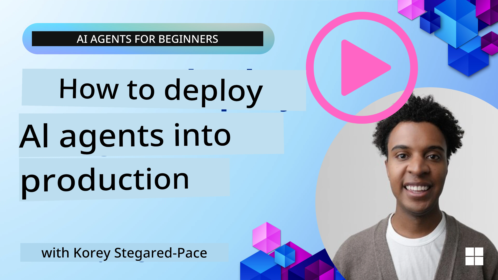

# AI Agents for Production: How to Take Notice & Check Dem Well

[](https://youtu.be/l4TP6IyJxmQ?si=reGOyeqjxFevyDq9)

As AI agents dey move from trial stages go real-life use, e dey important to sabi how dem dey behave, dey watch how dem perform, and dey always check their output carefully.

## Wetin You Go Learn

After you don finish this lesson, you go sabi how to/understand:
- Basic ideas about how to observe and check agents well
- Ways to make agents work better, reduce cost, and increase wetin dem fit do
- Wetin and how to check your AI agents properly every time
- How to keep cost low when you dey put AI agents for work
- How to add tools for agents wey you build with Microsoft Agent Framework

The main aim be to give you the skills to turn your "black box" agents to clear, easy-to-manage, and trustworthy systems.

_**Note:** E important to put AI Agents wey dey safe and people fit trust. Check the [Building Trustworthy AI Agents](../06-building-trustworthy-agents/README.md) lesson too._

## Traces and Spans

Tools for observation like [Langfuse](https://langfuse.com/) or [Microsoft Foundry](https://learn.microsoft.com/en-us/azure/ai-foundry/what-is-azure-ai-foundry) dey usually show agent runs as traces and spans.

- **Trace** na the full agent task from start to end (like when e dey handle user question).
- **Spans** na the small steps inside the trace (like when e dey call language model or find data).


<!-- Image URL retained for illustration purposes -->

Without observation, AI agent fit be like one "black box" - you no fit see wetin dey inside or how e dey reason, e go hard to find problems or improve how e dey work. But with observation, agents go become "glass boxes," wey transparent and clear, this one dey important to build trust and make sure dem dey work as dem suppose.

## Why Observation Sabi Important for Production Environment

When AI agents enter production environment, new wahala and requirements dey come. Observation no be just "nice to get" again but na very important ability:

*   **Debugging and Root-Cause Analysis**: When agent fail or give wahala output, observation tools go show you traces wey fit pinpoint where the problem dey. This important wella for agents wey get many LLM calls, tools, and complex logic.
*   **Latency and Cost Management**: AI agents dey use LLMs and other APIs wey dem dey charge for token or call. Observation help track these calls well, to find which ones dey slow or cost plenty. This fit help teams make prompts better, choose faster models, or fix workflows to reduce cost and make user happy.
*   **Trust, Safety, and Compliance**: For many things, e important to make sure say agents dey safe and follow rules. Observation dey keep audit trail of agent actions and decisions. You fit use am check for prompt injection, bad content, or wrong handling of personal info (PII). For example, you fit check traces to sabi why agent talk one thing or use one particular tool.
*   **Continuous Improvement Loops**: Observation data na the base for improve again and again. By watching how agent dey perform for real life, teams fit find areas to improve, collect data for fine-tune models, and check if changes improve things. This one create feedback loop where production results from online evaluation go help offline experiments and adjustment, make agent perform better step by step.

## Important Metrics to Watch

To watch and understand how agent dey behave, you need to follow many metrics and signals. Even though the metrics fit change depending on agent purpose, some metrics important everywhere.

Here be some common metrics wey observation tools dey track:

**Latency:** How fast agent dey answer? Long time wey e take before answer fit make user unhappy. You go measure latency for whole tasks and single steps by tracing agent runs. For example, if agent take 20 seconds for all model calls, you fit speed am up by using faster model or run calls at same time.

**Costs:** How much e cost for each agent run? AI agents dey use LLM calls wey dem dey charge per token or APIs. If agent dey use many tools or do many prompts, cost fit increase quick. Like if agent call LLM five times just to improve small, you must check if cost worth or if e fit reduce calls or use cheaper model. Real-time watching fit help find unexpected cost spikes (like bugs wey dey cause too much API calls).

**Request Errors:** How many requests agent fail? This fit be API error or failed tool calls. To make agent strong for production, you fit add fallbacks or retries. E.g. if LLM provider A die, you fit change to provider B as backup.

**User Feedback:** When you dey use direct user evaluations, e fit give good insights. This fit be ratings (👍thumbs-up/👎down, ⭐1-5 stars) or text comments. If negative feedback dey steady, e mean say agent no dey work well.

**Implicit User Feedback:** User behavior fit give feedback even without direct ratings. This fit be quick question rephrasing, repeated questions or clicking retry button. E.g. if you see say users dey ask same question many times, e mean agent no dey work well.

**Accuracy:** How often agent dey bring correct or desired output? Definition of accuracy fit change (like solving problem well, correct info, or user satisfaction). First thing na to decide how success go look for your agent. You fit track accuracy with automated checks, evaluation scores, or completion labels. For example, mark traces as "succeeded" or "failed".

**Automated Evaluation Metrics:** You fit also set automated evals. For example, use LLM to score agent output if e helpful, accurate, or no. There dey plenty open source libraries to score different agent parts. Like [RAGAS](https://docs.ragas.io/) for RAG agents or [LLM Guard](https://llm-guard.com/) to find bad language or prompt injection.

Normally, to get full picture of AI agent health, you go need combination of these metrics. For this chapter [example notebook](./code_samples/10-expense_claim-demo.ipynb), we go show how these metrics dey appear for real examples but first, we go learn how typical evaluation work be like.

## Add Tools to Your Agent

To collect tracing data, you go need add tools for your code. The aim na to make agent code to send traces and metrics wey observability platform fit catch, process, and show.

**OpenTelemetry (OTel):** [OpenTelemetry](https://opentelemetry.io/) don become industry standard for LLM observation. E get API, SDKs, and tools to generate, collect, and send telemetry data.

Plenty instrumentation libraries dey wrap existing agent frameworks and make am easy to export OpenTelemetry spans to observation tool. Microsoft Agent Framework get OpenTelemetry support by default. Below na example for instrumenting MAF agent:

```python
from agent_framework.observability import get_tracer, get_meter

tracer = get_tracer()
meter = get_meter()

with tracer.start_as_current_span("agent_run"):
    # Agent waka dey follow am by itself automatically
    pass
```

The [example notebook](./code_samples/10-expense_claim-demo.ipynb) for this chapter go show how to instrument your MAF agent.

**Manual Span Creation:** Even though instrumentation libraries good, sometimes you need add more detailed or custom info. You fit create spans yourself add custom app logic. Better still, you fit add custom attributes (tags or metadata) to automatically or manually created spans. These fit be business data, intermediate calculations, or any context wey fit help debugging or analysis, like `user_id`, `session_id`, or `model_version`.

Example of manually creating traces and spans with [Langfuse Python SDK](https://langfuse.com/docs/sdk/python/sdk-v3):

```python
from langfuse import get_client
 
langfuse = get_client()
 
span = langfuse.start_span(name="my-span")
 
span.end()
```

## How to Check Agent Properly

Observation go give us metrics, but evaluation na the process to analyze that data (and run tests) to see how well AI agent dey perform and how e fit improve. In short, once you get traces and metrics, how you go use am to judge agent and make decisions?

Regular evaluation dey important because AI agents fit dey unpredictable and fit change (due to updates or model change) – without evaluation, you no go sabi if your “smart agent” dey work well or if e don spoil.

There be two types of evaluation for AI agents: **online evaluation** and **offline evaluation**. Both get value and complete each other. Normally, we start with offline evaluation, because na the bare minimum before deploying agent.

### Offline Evaluation


This one mean checking the agent for controlled place, usually with test datasets, no be live user questions. You dey use set datasets where you sabi the correct answer or behavior, then run agent on top them.

For example, if you build agent wey solve math word problems, you fit get [test dataset](https://huggingface.co/datasets/gsm8k) with 100 problems wey answers dey known. Offline evaluation dey happen during development (fit include CI/CD pipelines) to check improvement or avoid regressions. The good thing na say e fit repeat and you get clear accuracy metrics since ground truth dey. You fit also simulate user questions and measure agent answers against best responses or use automated metrics as talk top.

The main problem with offline evaluation na to make sure your test dataset dey complete and still relevant – agent fit do well for fixed test set but meet different questions for production. So you need to keep test sets fresh with new edge cases and examples wey dey reflect real life. Small “smoke test” cases plus bigger evaluation sets go help: small sets for quick check and bigger sets for wider performance metrics.

### Online Evaluation


This one mean checking agent live for real world environment, while e dey used for production. Online evaluation dey monitor agent perform on real user interactions and dey analyze results constantly.

Example, you fit track success rates, user satisfaction scores, or other metrics from live traffic. The advantage of online evaluation na say e fit capture things wey you no think for lab – you fit see model drift as input patterns change and catch unexpected questions or situations wey no dey your test data. E show how agent behave for real life.

Online evaluation dey often gather implicit and explicit user feedback, as talk before, and fit run shadow tests or A/B tests (where new agent version dey run side by side to compare with old one). The problem be say e hard to get reliable labels or scores for live interactions – you fit depend on user feedback or downstream metrics (like if user click result).

### How to Mix Both

Online and offline evaluations no dey fight; dem dey complement each other well. Info from online monitoring (like new kinds of user questions wey agent no fit answer well) fit help improve offline test sets. Also, agents wey do well offline fit deploy for production and monitor online with more confidence.

Many teams follow this loop:

_evaluate offline -> deploy -> monitor online -> collect new failure cases -> add to offline dataset -> fix agent -> repeat_.

## Common Wahala

When you dey put AI agents for production, you fit see plenty challenges. Here some common wahala and how to solve dem:

| **Wahala**    | **Possible Solution**   |
| ------------- | ------------------ |
| AI Agent no dey do tasks steady | - Make your prompt clearer for AI Agent; clearly talk objectives.<br>- Find place to break task small small and use many agents handle am. |
| AI Agent dey run continuous loops  | - Make sure you get clear stop terms so agent know when to end process.<br>- For complex task wey need planning and reasoning, use bigger model meant for reason. |
| AI Agent tool calls no dey work well   | - Test and check tool output outside agent system.<br>- Make parameters, prompts, and tool names better.  |
| Multi-Agent system no dey consistent | - Make prompts for each agent clear and different.<br>- Build hierarchy with "routing" or controller agent to decide correct agent. |

Many of these wahala fit easy detect if observation dey on. The traces and metrics wey we talk before fit point exactly where problem dey for agent workflow, make debugging and improvement faster and easier.

## How to Manage Cost


Dis na some stratijiz to manage di costs of deploying AI agents go production:

**Using Smaller Models:** Small Language Models (SLMs) fit work well for certain agentic use-cases and dem go reduce cost well well. Like we mention before, to build evaluation system to check and compare performance against bigger models na di best way to sabi how well SLM go perform for your use case. Try use SLMs for simpler tasks like intent classification or parameter extraction, and keep bigger models for wahala reason tasks.

**Using a Router Model:** Another way na to use different models and sizes. You fit use LLM/SLM or serverless function to direct request based on how e complex go di correct models. Dis one go reduce costs well well and still make sure say performance dey for di correct tasks. For example, make you send simple questions go smaller, faster models, and only use costly big models for complex reason tasks.

**Caching Responses:** To sabi common requests and tasks and give di answers before dem reach your agentic system na beta way to reduce di number of same kain requests. You fit even create flow to sabi how similar request be to your cached requests using basic AI models. This stratijiz fit reduce cost well well for questions wey people dey ask often or common workflows.

## Make we see how dis one dey work for practice

For di [example notebook of this section](./code_samples/10-expense_claim-demo.ipynb), we go see examples of how we go fit use observability tools to dey monitor and check our agent.


### You get More Questions about AI Agents for Production?

Join di [Microsoft Foundry Discord](https://discord.com/invite/ATgtXmAS5D) to meet other learners, siddon for office hours and get answer to your AI Agents questions.

## Previous Lesson

[Metacognition Design Pattern](../09-metacognition/README.md)

## Next Lesson

[Agentic Protocols](../11-agentic-protocols/README.md)

---

<!-- CO-OP TRANSLATOR DISCLAIMER START -->
**Disclaimer**:
Dis document don translate wit AI translation service [Co-op Translator](https://github.com/Azure/co-op-translator). Even tho we dey try make am correct, abeg make you know say automated translation fit get errors or mistakes. Di original document for dia own language na im be di correct source. For important info, make person wey sabi human translation do am. We no go responsible for any misunderstanding or wrong understanding wey fit happen because of dis translation.
<!-- CO-OP TRANSLATOR DISCLAIMER END -->