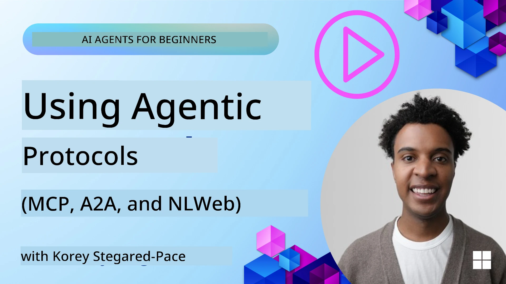
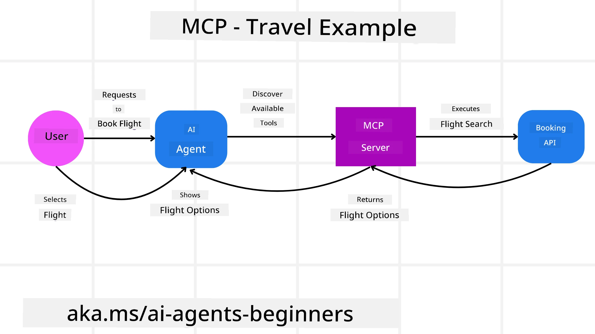
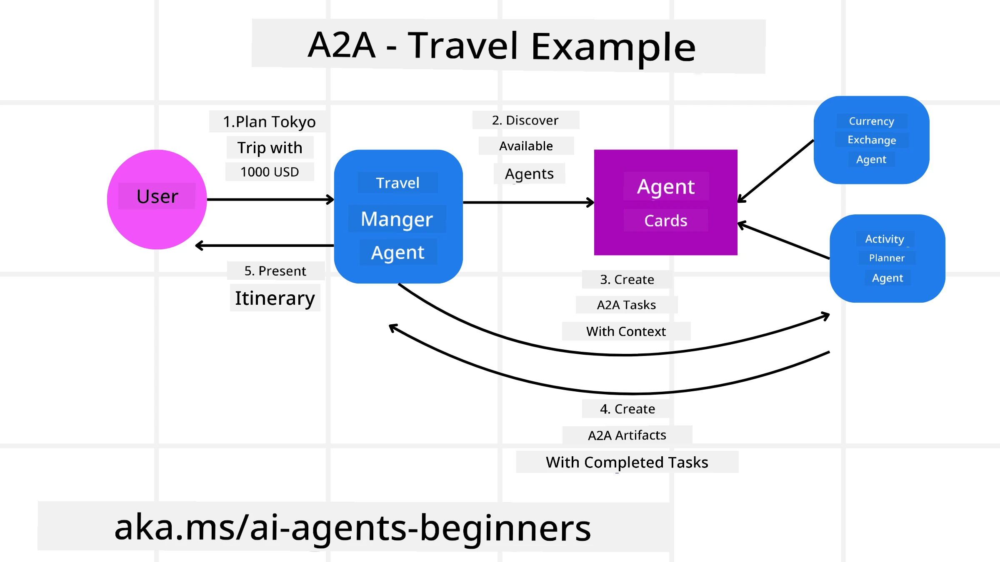
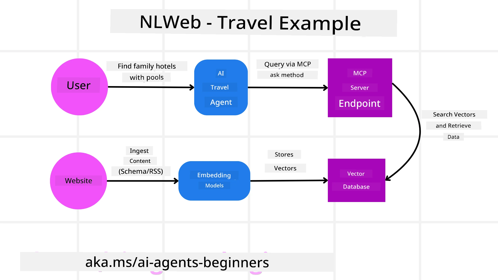

# Using Agentic Protocols (MCP, A2A and NLWeb)

> _(Click the image above to view video of this lesson)_

As di use of AI agents dey grow, na so di need for protocols wey go make things standard, secure, and support open innovation dey grow too. For dis lesson, we go cover 3 protocols wey dey try meet dis need - Model Context Protocol (MCP), Agent to Agent (A2A) and Natural Language Web (NLWeb).

## Introduction

For dis lesson, we go cover:

• How **MCP** dey allow AI Agents make dem access external tools and data to finish wetin user want.

• How **A2A** dey make communication and collaboration possible between different AI agents.

• How **NLWeb** dey bring natural language interfaces go any website make AI Agents fit find and interact with di content.

## Learning Goals

• **Identify** di main purpose and benefits of MCP, A2A, and NLWeb inside di context of AI agents.

• **Explain** how each protocol dey help communication and interaction between LLMs, tools, and other agents.

• **Recognize** di different roles wey each protocol dey play for building complex agentic systems.

## Model Context Protocol

Di **Model Context Protocol (MCP)** na open standard wey dey provide one standardized way for applications to give context and tools to LLMs. Dis one enable "universal adaptor" to different data sources and tools wey AI Agents fit connect to for one consistent way.

Make we look di components of MCP, di benefits compared to direct API usage, and one example how AI agents fit use one MCP server.

### MCP Core Components

MCP dey work on top of **client-server architecture** and di core components na:

• **Hosts** na LLM applications (for example code editor like VSCode) wey dey start di connections go MCP Server.

• **Clients** na components wey dey inside di host application wey dey maintain one-to-one connections with servers.

• **Servers** na lightweight programs wey dey expose specific capabilities.

Inside di protocol, three core primitives dey wey be di capabilities of one MCP Server:

• **Tools**: Na di separate actions or functions wey AI agent fit call to perform action. For example, weather service fit expose "get weather" tool, or e-commerce server fit expose "purchase product" tool. MCP servers dey advertise each tool name, description, and input/output schema for their capabilities listing.

• **Resources**: Na read-only data items or documents wey MCP server fit provide, and clients fit fetch dem when dem need am. Examples na file contents, database records, or log files. Resources fit be text (like code or JSON) or binary (like images or PDFs).

• **Prompts**: Na predefined templates wey dey give suggested prompts, make e easy to build more complex workflows.

### Benefits of MCP

MCP get beta advantages for AI Agents:

• **Dynamic Tool Discovery**: Agents fit dynamically receive list of available tools from one server plus descriptions of wetin dem dey do. Dis one different from old-school APIs wey need static coding for integrations, meaning any API change go require code updates. MCP na "integrate once" approach, e make system more adaptable.

• **Interoperability Across LLMs**: MCP dey work across different LLMs, e give flexibility to change core models to test for better performance.

• **Standardized Security**: MCP get one standard authentication method, e make am easier to scale when you dey add access to extra MCP servers. E simpler pass to manage different keys and authentication types for various traditional APIs.

### MCP Example

Make we imagine say user want book flight using AI assistant wey MCP dey power.

1. **Connection**: Di AI assistant (di MCP client) go connect to one MCP server wey airline provide.

2. **Tool Discovery**: Di client go ask di airline MCP server, "Wetin tools una get?" Di server go answer with tools like "search flights" and "book flights".

3. **Tool Invocation**: You go tell di AI assistant, "Abeg search flight from Portland to Honolulu." Di AI assistant, with im LLM, go sabi say e suppose call "search flights" tool and e go pass di correct parameters (origin, destination) to di MCP server.

4. **Execution and Response**: Di MCP server, wey dey act as wrapper, go make di real call to di airline internal booking API. E go collect di flight information (e.g., JSON data) and send am back to di AI assistant.

5. **Further Interaction**: Di AI assistant go show di flight options. Once you select flight, di assistant fit invoke di "book flight" tool on same MCP server make e complete di booking.

## Agent-to-Agent Protocol (A2A)

While MCP dey focus on connecting LLMs to tools, di **Agent-to-Agent (A2A) protocol** go one step further by making communication and collaboration possible between different AI agents. A2A dey connect AI agents across different organizations, environments and tech stacks to finish one shared task.

We go look di components and benefits of A2A, plus one example how e fit work for our travel application.

### A2A Core Components

A2A dey focus on making agents fit talk to each other and work together to finish subtask for user. Every component for di protocol dey contribute to dis:

#### Agent Card

Like how MCP server dey share list of tools, Agent Card get:
- Di Name of di Agent.
- A **description of di general tasks** wey e dey do.
- A **list of specific skills** with descriptions to help other agents (or even human users) know when and why dem go call that agent.
- Di **current Endpoint URL** of di agent
- Di **version** and **capabilities** of di agent like streaming responses and push notifications.

#### Agent Executor

Agent Executor dey responsible for **passing di user chat context to di remote agent**, cos di remote agent need dis to understand wetin dem suppose do. For one A2A server, agent go use im own Large Language Model (LLM) to parse incoming requests and run tasks using im own internal tools.

#### Artifact

After remote agent don finish di requested task, di work product go become artifact. Artifact **get di result of di agent work**, one **description of wetin dem complete**, and di **text context** wey dem send through di protocol. After dem send di artifact, connection with di remote agent go close until dem need am again.

#### Event Queue

Dis component dey used for **handling updates and passing messages**. E important for production agentic systems to make sure connection between agents no close before task finish, especially when some tasks fit take long time.

### Benefits of A2A

• **Enhanced Collaboration**: E make agents from different vendors and platforms fit interact, share context, and work together, so automation fit run across systems wey normally no connect.

• **Model Selection Flexibility**: Each A2A agent fit choose which LLM e go use to handle im requests, make dem fit use optimized or fine-tuned models per agent, no be like when only one LLM dey connect for some MCP setups.

• **Built-in Authentication**: Authentication dey inside A2A protocol, e provide better security framework for agent interactions.

### A2A Example

Make we expand our travel booking example, but now use A2A.

1. **User Request to Multi-Agent**: User go interact with "Travel Agent" A2A client/agent, e fit talk say, "Abeg book whole trip go Honolulu for next week, include flights, hotel, and rental car".

2. **Orchestration by Travel Agent**: Travel Agent go receive di complex request. E go use im LLM to reason about di task and find out say e need to interact with other specialized agents.

3. **Inter-Agent Communication**: Travel Agent go use A2A protocol to connect to downstream agents, like "Airline Agent", "Hotel Agent", and "Car Rental Agent" wey different companies create.

4. **Delegated Task Execution**: Travel Agent go send specific tasks to these specialized agents (e.g., "Find flights to Honolulu," "Book a hotel," "Rent a car"). Each of these agents, wey dey run their own LLMs and use their own tools (which fit be MCP servers too), go do their part of booking.

5. **Consolidated Response**: Once all downstream agents don finish their tasks, Travel Agent go join di results (flight details, hotel confirmation, car rental booking) and send one complete chat-style response back to user.

## Natural Language Web (NLWeb)

Websites don long be di main way for users to get information and data for internet.

Make we check di different components of NLWeb, di benefits of NLWeb and example of how our NLWeb dey work by looking di travel application.

### Components of NLWeb

- **NLWeb Application (Core Service Code)**: Di system wey dey process natural language questions. E dey connect di different parts of di platform to create responses. You fit reason am as di **engine wey dey power di natural language features** of one website.

- **NLWeb Protocol**: Na **basic set of rules for natural language interaction** with website. E dey send back responses in JSON format (often using Schema.org). Di purpose na to create simple foundation for the “AI Web,” like how HTML make e possible to share documents online.

- **MCP Server (Model Context Protocol Endpoint)**: Each NLWeb setup still dey work as **MCP server**. Mean say e fit **share tools (like "ask" method) and data** with other AI systems. For practice, dis one make website content and capabilities fit dey usable by AI agents, so di site fit become part of di bigger “agent ecosystem.”

- **Embedding Models**: Dem models dey use to **turn website content into numerical representations wey dem dey call vectors** (embeddings). These vectors capture meaning so computer fit compare and search dem. Dem dey store am for special database, and users fit choose which embedding model dem wan use.

- **Vector Database (Retrieval Mechanism)**: Dis database **stores di embeddings of di website content**. When person ask question, NLWeb go check di vector database to quickly find di most relevant info. E go return quick list of possible answers, ranked by similarity. NLWeb fit work with different vector storage systems like Qdrant, Snowflake, Milvus, Azure AI Search, and Elasticsearch.

### NLWeb by Example

Think about our travel booking website again, but dis time e dey powered by NLWeb.

1. **Data Ingestion**: Di travel website existing product catalogs (e.g., flight listings, hotel descriptions, tour packages) go format with Schema.org or dem go load am via RSS feeds. NLWeb tools go ingest dis structured data, create embeddings, and store dem for local or remote vector database.

2. **Natural Language Query (Human)**: User go visit di website and instead of to dey waka through menus, dem go type for chat interface: "Find me a family-friendly hotel in Honolulu with a pool for next week".

3. **NLWeb Processing**: NLWeb application go receive di query. E go send di query to one LLM to understand am and at di same time e go search im vector database for relevant hotel listings.

4. **Accurate Results**: Di LLM go help interpret di search results from di database, find di best matches based on "family-friendly," "pool," and "Honolulu" criteria, then e go format natural language response. Important thing be say di response go refer to real hotels from di website catalog, no be make-believe info.

5. **AI Agent Interaction**: Because NLWeb dey serve as MCP server, external AI travel agent fit also connect to dis website NLWeb instance. Di AI agent fit then use di `ask` MCP method to query di website directly: `ask("Are there any vegan-friendly restaurants in the Honolulu area recommended by the hotel?")`. Di NLWeb instance go process dis, use im database of restaurant info (if dem load am), and return structured JSON response.

### Got More Questions about MCP/A2A/NLWeb?

Join the [Microsoft Foundry Discord](https://aka.ms/ai-agents/discord) to meet other learners, attend office hours and get answers to your AI Agents questions.

## Resources

- [MCP for Beginners](https://aka.ms/mcp-for-beginners)  
- [MCP Documentation](https://learn.microsoft.com/python/api/overview/azure/ai-projects-readme)
- [NLWeb Repo](https://github.com/nlweb-ai/NLWeb)
- [Microsoft Agent Framework](https://aka.ms/ai-agents-beginners/agent-framewrok)

---

<!-- CO-OP TRANSLATOR DISCLAIMER START -->
Disclaimer:
Dis document dem translate with AI translation service [Co-op Translator]. Even though we dey try make am accurate, abeg note say automated translations fit get errors or small wrong tins. The original document inside im native language be the correct/official source. If na important information, better make person wey sabi human translator do am. We no dey responsible for any misunderstanding or wrong interpretation wey fit come from using dis translation.
<!-- CO-OP TRANSLATOR DISCLAIMER END -->