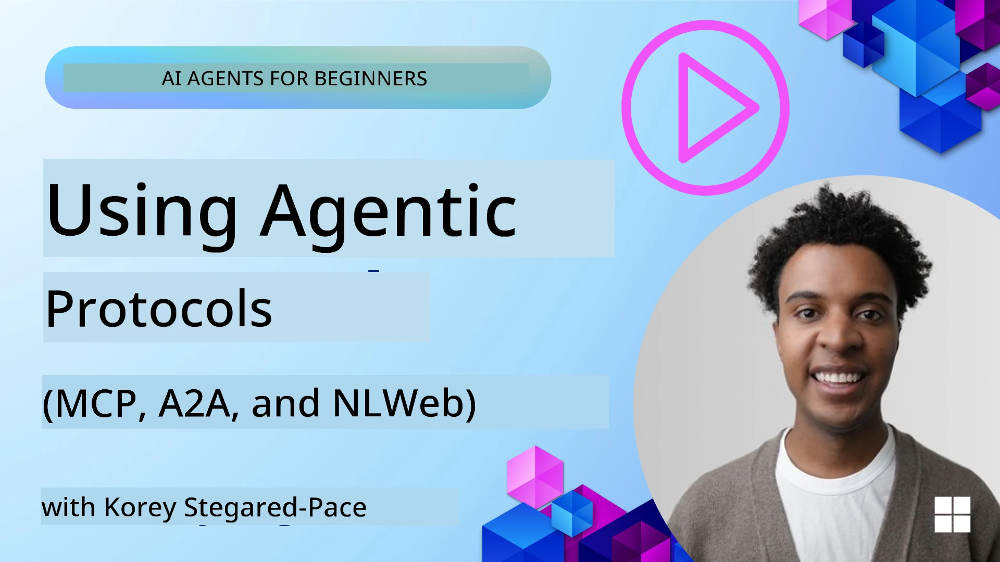
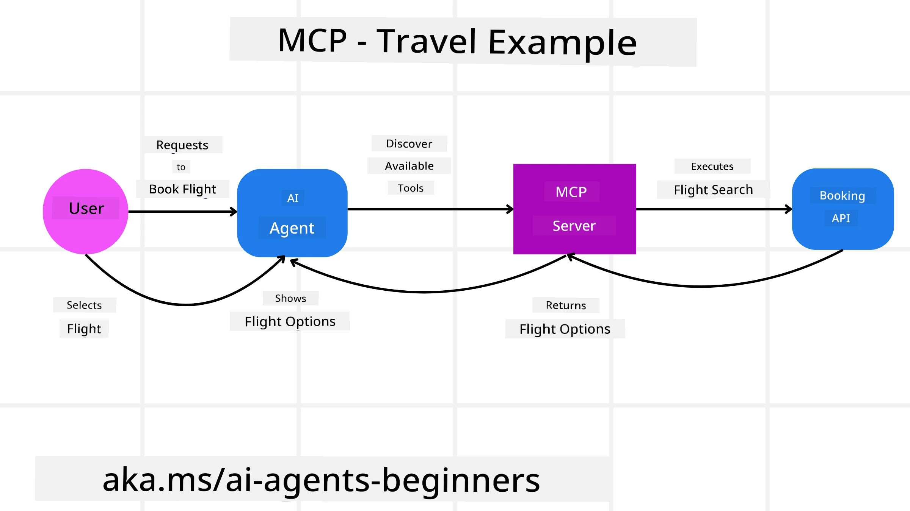
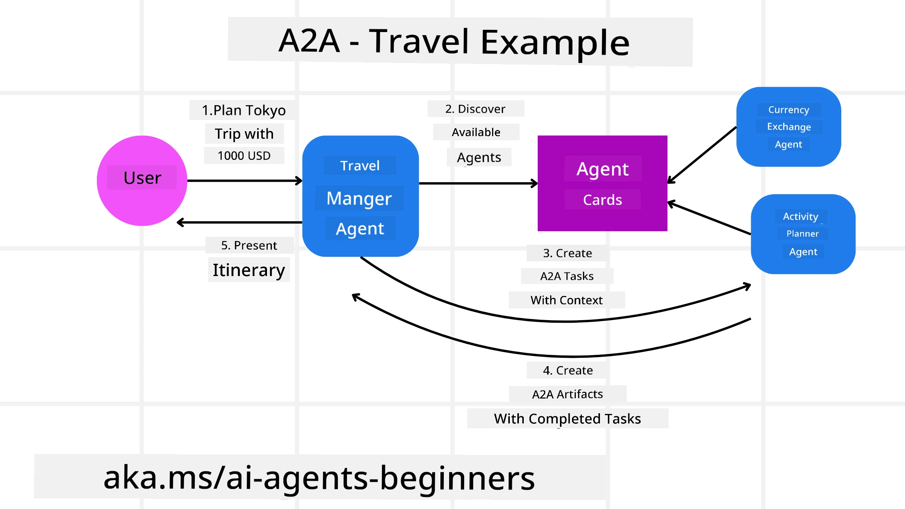
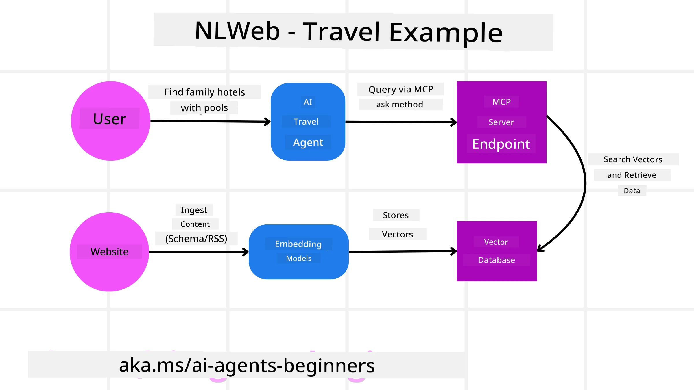

# How to Use Agentic Protocols (MCP, A2A and NLWeb)

> _(Click di pikicha we dey up so to watch video for dis lesson)_

As AI agents dey grow more, e still dey important to get protocols wey go ensure say dem standard, secure, plus support open innovation. For dis lesson, we go check 3 protocols wey wan solve dis need - Model Context Protocol (MCP), Agent to Agent (A2A) and Natural Language Web (NLWeb).

## Introduction

For dis lesson, we go talk about:

• How **MCP** dey allow AI Agents take external tools and data do the work we human dem ask.

• How **A2A** dey make communication and teamwork between different AI agents possible.

• How **NLWeb** dey bring natural language systems to any website so AI Agents fit find content and interact wit am.

## Learning Goals

• **Identify** wetin MCP, A2A, and NLWeb mean and di benefit dem get for AI agents.

• **Explain** how each protocol dey help LLMs, tools and other agents talk and work together.

• **Recognize** di different roles each protocol get for to build complex agentic systems.

## Model Context Protocol

Di **Model Context Protocol (MCP)** na open standard wey provide one way to make applications fit give context and tools to LLMs. E make one kind "universal adaptor" to different data and tools we AI Agents fit grammatically connect.

Make we look di parts of MCP, di better things e get versus normal API use, and example of how AI agents fit use MCP server.

### MCP Core Components

MCP dey work on **client-server architecture** and di main parts na:

• **Hosts** be LLM applications (for example code editor like VSCode) wey start di connection to MCP Server.

• **Clients** be parts inside host application wey keep one-to-one connection wit servers.

• **Servers** be small programs wey show their special capacity dem.

Inside di protocol three main things dey wey be di powers of MCP Server:

• **Tools**: Dem na separate actions or functions we AI agent fit call to do something. For example, weather service fit get one tool wey be "get weather", or ecommerce server fit get tool wey be "purchase product". MCP servers dey tell every tool name, description and input/output schema for their capabilities list.

• **Resources**: Dem na read-only data or documents we MCP server fit provide and clients fit collect dem anytime dem want. Examples na file content, database records or log files. Resources fit be text (like code or JSON) or binary (like pictures or PDFs).

• **Prompts**: Dem na predefined templates wey provide suggested prompts, so make workflow pass pass.

### Benefits of MCP

MCP get many beta things for AI Agents:

• **Dynamic Tool Discovery**: Agents fit dynamically get list of available tools from server plus wetin dem fit do. Dis differ from old APIs wey need static code for join, so any small API change need update code. MCP na "integrate once" way wey dey flexible well well.

• **Interoperability Across LLMs**: MCP dey work with many LLMs, make e easy to change core models to test beta performance.

• **Standardized Security**: MCP get standard way for authentication, e make e easy to add more MCP servers. E simple pass to dey manage different keys and authentication methods for many normal APIs.

### MCP Example

Imagine say person want book flight using AI assistant wey MCP dey power.

1. **Connection**: Di AI assistant (MCP client) connect to MCP server wey airline provide.

2. **Tool Discovery**: Di client ask di airline MCP server, "Which tools una get?" Server reply with tools like "search flights" and "book flights".

3. **Tool Invocation**: Den you tell AI assistant, "Abeg find flight from Portland go Honolulu." AI assistant use LLM take know say e need call "search flights" tool, den pass origin and destination to MCP server.

4. **Execution and Response**: MCP server act like wrapper, e go call airline own booking API. E then receive flight info (like JSON data) and send am back to AI assistant.

5. **Further Interaction**: AI assistant show flight options. When you choose one flight, assistant fit use "book flight" tool for same MCP server finish booking.

## Agent-to-Agent Protocol (A2A)

While MCP dey connect LLMs to tools, **Agent-to-Agent (A2A) protocol** take am further by making AI agents fit talk and work together. A2A connect AI agents from different companies, environments and systems to complete shared work.

We go check A2A parts and beta things plus example for how to use am for travel app.

### A2A Core Components

A2A make AI agents talk and work together to finish part of user work. Each protocol part dey help do dat:

#### Agent Card

Just like MCP server dey share list of tools, Agent Card get:
- Agent Name.
- **Description of wetin the agent dey do generally**.
- **List of specific skills** wey agents or humans fit understand why dem go call dat agent.
- **Current Endpoint URL** for the agent
- **Version** and **capabilities** like streaming responses and push notifications.

#### Agent Executor

Agent Executor dey responsible to **pass user chat context to remote agent**, so remote agent go fit understand di work to do. For A2A server, agent go use im own LLM parse request and do work wit im own tools.

#### Artifact

When remote agent don finish work, e come create artifact. Artifact **get result of work**, **explanation of wetin e do**, and **text context** wey dem send for protocol. After artifact don send, connection with remote agent go close till next time.

#### Event Queue

Dis part dey handle updates and message passing. E very important for agentic systems wey dey production to keep connection no close till work done, especially when e take time to finish task.

### Benefits of A2A

• **Better Collaboration**: E allow agents from different vendors and platforms make contact, share context, and work together, for easy automation across systems we no usually connect.

• **Model Selection Flexibility**: Each A2A agent fit choose which LLM e wan use for service request, so dem fit optimize each agent, unlike single LLM connection like some MCP.

• **Builtin Authentication**: Authentication dey inside A2A protocol, e provide strong security for agent interaction.

### A2A Example

Make we expand our travel booking story but dis time na with A2A.

1. **User Request to Multi-Agent**: User talk to "Travel Agent" A2A client/agent, maybe say, "Abeg book whole trip go Honolulu for next week, make e get flights, hotel, and rental car."

2. **Orchestration by Travel Agent**: Travel Agent hear dis complex request. E use im LLM think about the work and know say e need talk with other special agents.

3. **Inter-Agent Communication**: Travel Agent use A2A protocol connect to agents like "Airline Agent," "Hotel Agent," and "Car Rental Agent" wey different companies create.

4. **Delegated Task Execution**: Travel Agent send specific work to those special agents (like "Find flights to Honolulu," "Book hotel," "Rent car"). Each agent use im own LLM and tools (fit be MCP servers) to do their work.

5. **Consolidated Response**: After all agents finish their work, Travel Agent gather results (flight info, hotel confirmation, car rental) and send full chat response to user.

## Natural Language Web (NLWeb)

Websites don long time be main way wey users dey get info and data online.

Make we check di parts of NLWeb, beta things e get and example of how travel app dey use NLWeb.

### Components of NLWeb

- **NLWeb Application (Core Service Code)**: Na di system wey dey handle natural language questions. E join different parts of platform to create responses. You fit see am as di **engine wey power natural language feature** for website.

- **NLWeb Protocol**: Dis na **basic rules for natural language talk** with website. E dey send response for JSON format (usually Schema.org). E purpose na to build simple base for “AI Web,” same way HTML let us share documents online.

- **MCP Server (Model Context Protocol Endpoint)**: Every NLWeb setup also dey work as **MCP server**. E fit **share tools (like “ask” method) and data** with other AI systems. Dis one mean say website content and ability fit dey used by AI agents, make website join di bigger “agent ecosystem.”

- **Embedding Models**: Dem models dey convert website content to numerical form wey dem call vectors (embeddings). Dem vectors get meaning we computer fit compare and search. Dem dey store inside special database, and users fit choose which embedding model dem want use.

- **Vector Database (Retrieval Mechanism)**: Dis database dey keep embedding of website content. When person ask question, NLWeb go check vector database quick to find best info. E go show list of possible answers ordered by similarity. NLWeb dey work wit many vector storage systems like Qdrant, Snowflake, Milvus, Azure AI Search, and Elasticsearch.

### NLWeb by Example

Consider our travel booking website again, but this time, e dey powered by NLWeb.

1. **Data Ingestion**: Di travel website get product list (like flight listings, hotel descriptions, tour packages) wey dem format with Schema.org or load via RSS feeds. NLWeb tools collect this organized data, create embeddings, and store for local or remote vector database.

2. **Natural Language Query (Human)**: User enter the website and instead of to dey find through menus, e type for chat interface: "Find family-friendly hotel for me in Honolulu with pool for next week."

3. **NLWeb Processing**: NLWeb app collect dis question. E send am to LLM to understand, and at same time e check vector database for relevant hotels.

4. **Correct Results**: LLM help understand search results and find best matches for "family-friendly," "pool," and "Honolulu." E build natural language answer. Important thing be say answer dey talk about actual hotels from website, no fake info.

5. **AI Agent Interaction**: Because NLWeb na MCP server, external AI travel agent fit connect to this NLWeb website. AI agent fit use `ask` MCP method ask website direct: `ask("Any vegan-friendly restaurants in Honolulu area wey hotel recommend?")`. NLWeb go process am, use restaurant info (if loaded), and return structured JSON answer.

### You get More Questions about MCP/A2A/NLWeb?

Join [Microsoft Foundry Discord](https://discord.com/invite/ATgtXmAS5D) to meet other learners, attend office hours and get your AI Agents questions answered.

## Resources

- [MCP for Beginners](https://aka.ms/mcp-for-beginners)  
- [MCP Documentation](https://learn.microsoft.com/python/api/overview/azure/ai-projects-readme)
- [NLWeb Repo](https://github.com/nlweb-ai/NLWeb)
- [Microsoft Agent Framework](https://aka.ms/ai-agents-beginners/agent-framework)

---

<!-- CO-OP TRANSLATOR DISCLAIMER START -->
**Disclaimer**:
Dis document don translate wit AI translation service [Co-op Translator](https://github.com/Azure/co-op-translator). Even tho we dey try make am correct, abeg make you know say automated translation fit get errors or mistakes. Di original document for dia own language na im be di correct source. For important info, make person wey sabi human translation do am. We no go responsible for any misunderstanding or wrong understanding wey fit happen because of dis translation.
<!-- CO-OP TRANSLATOR DISCLAIMER END -->