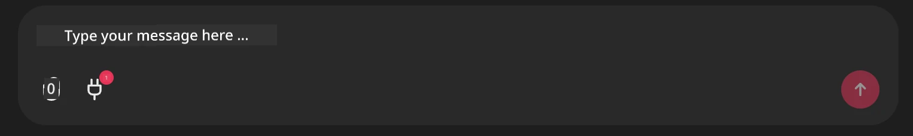

# Github MCP Server Example

## Wetin e mean

Na demo dem create for the AI Agents Hackathon wey Microsoft Reactor host.

Dis tools dem dey used to recommend hackathon projects based on person Github repos.
E dey work like dis:

1. **Github Agent** - Dey use the Github MCP Server to retrieve repos and information about those repos.
2. **Hackathon Agent** - E take the data wey come from the Github Agent, den e go find creative hackathon project ideas based on the projects, languages wey the user use and the project tracks for the AI Agents hackathon.
3. **Events Agent** - Based on the hackathon agent suggestion, the events agent go recommend relevant events from the AI Agent Hackathon series.
## Running the code 

### Environment Variables

Dis demo dey use Microsoft Agent Framework, Azure OpenAI Service, the Github MCP Server and Azure AI Search.

Make sure say you don set the correct environment variables to fit use these tools:

```python
AZURE_AI_PROJECT_ENDPOINT=""
AZURE_AI_MODEL_DEPLOYMENT_NAME=""
AZURE_SEARCH_SERVICE_ENDPOINT=""
AZURE_SEARCH_API_KEY=""
``` 

## Running the Chainlit Server

To connect to the MCP server, dis demo dey use Chainlit as chat interface. 

To run the server, run this command for your terminal:

```bash
chainlit run app.py -w
```

Dis one go start your Chainlit server for `localhost:8000` and e go also populate your Azure AI Search Index with the `event-descriptions.md` content. 

## Connecting to the MCP Server

To connect to the Github MCP Server, select the "plug" icon wey dey under the "Type your message here.." chat box:



From there you fit click on the "Connect an MCP" to add the command wey go connect to the Github MCP Server:

```bash
npx -y @modelcontextprotocol/server-github --env GITHUB_PERSONAL_ACCESS_TOKEN=[YOUR PERSONAL ACCESS TOKEN]
```

Replace "[YOUR PERSONAL ACCESS TOKEN]" with your actual Personal Access Token. 

After you don connect, you go see a (1) next to the plug icon to confirm say e don connect. If no, try restart the chainlit server with `chainlit run app.py -w`.

## Using the Demo 

To start the agent workflow wey dey recommend hackathon projects, you fit type message like: 

"Recommend hackathon projects for the Github user koreyspace"

The Router Agent go analyze your request and decide which combination of agents (GitHub, Hackathon, and Events) best fit handle your query. The agents go work together to give full recommendations based on GitHub repository analysis, project ideation, and relevant tech events.

---

<!-- CO-OP TRANSLATOR DISCLAIMER START -->
Abeg note:
Dis document don translate with AI translation service [Co-op Translator](https://github.com/Azure/co-op-translator). Even though we dey try make am correct, make you sabi say automatic translations fit get mistakes or wrong parts. The original document for im original language suppose be the official source. If na important information, better make professional human translator handle am. We no go responsible for any misunderstanding or misinterpretation wey fit come from using this translation.
<!-- CO-OP TRANSLATOR DISCLAIMER END -->