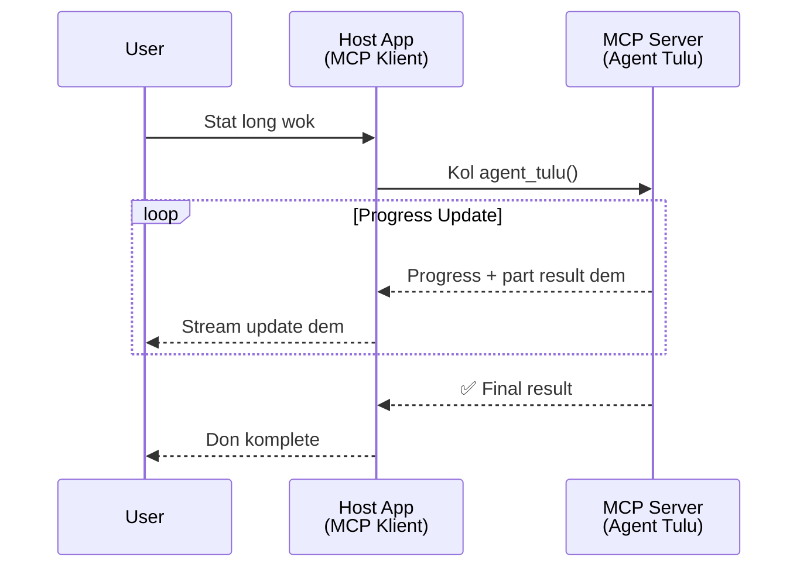
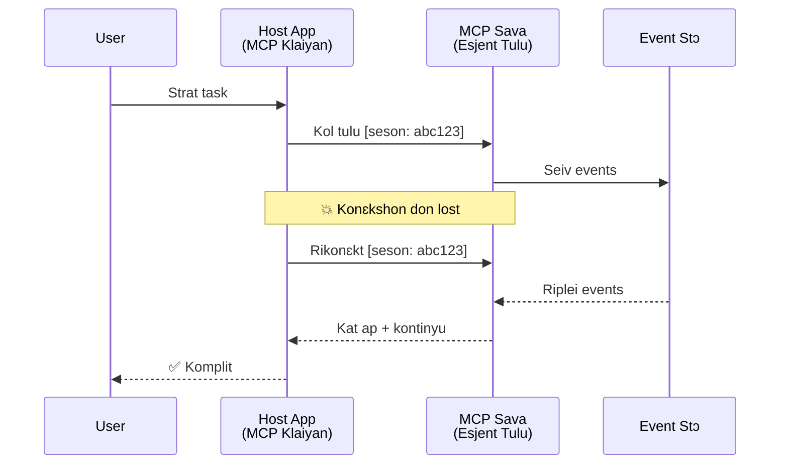
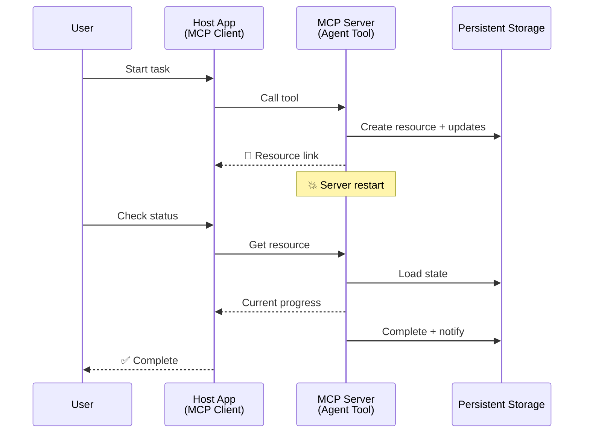
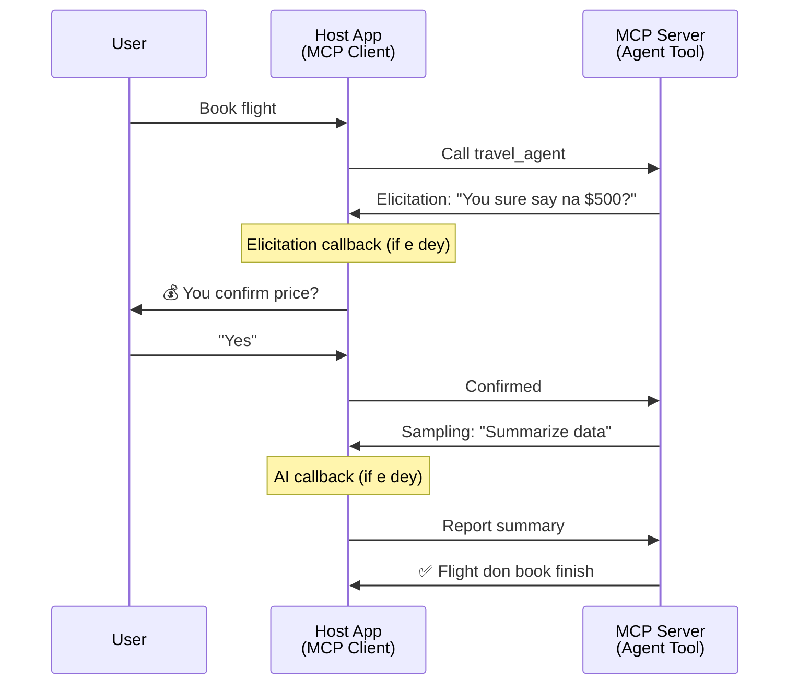
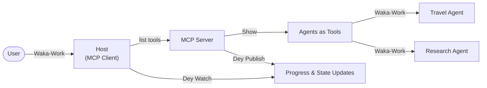

# Di Building of Agent-to-Agent Communication Systems wit MCP

> TL;DR - You fit build Agent2Agent Communication pan MCP? Yes!

MCP don improve well well pass im og goal of "providing context to LLMs". Wit di recent beta wey include [resumable streams](https://modelcontextprotocol.io/docs/concepts/transports#resumability-and-redelivery), [elicitation](https://modelcontextprotocol.io/specification/2025-06-18/client/elicitation), [sampling](https://modelcontextprotocol.io/specification/2025-06-18/client/sampling), and notifications ([progress](https://modelcontextprotocol.io/specification/2025-06-18/basic/utilities/progress) and [resources](https://modelcontextprotocol.io/specification/2025-06-18/schema#resourceupdatednotification)), MCP don now get strong foundation to build complex agent-to-agent communication systems.

## Di Agent/Tool Wrong Idea Dem

As more developers dey test tools wey dem get agentic behaviours (wey fit run long time, fit need extra input for middle sotay e dey run, etc.), one wrong idea be say MCP no tay for dis kain things mainly because im early tools examples focus on simple request-response ways dem.

Dis kain way of thinking don old. Di MCP specification don improve well well for di last few months wit capabilities wey dey close di gap for long-running agentic behaviour:

- **Streaming & Partial Results**: Real-time progress updates while e dey run
- **Resumability**: Clients fit reconnect and continue afta dem disconnect
- **Durability**: Result dey survive server restart (e.g., using resource links)
- **Multi-turn**: Interactive input for middle of execution wit elicitation and sampling

All dis things fit join together to enable complex agentic and multi-agent application dem, all of dem dey run pan MCP protocol.

For example, we go call agent as "tool" wey dey for MCP server. Dis mean say one host app dey wey dey use MCP client to start session wit MCP server and fit call di agent.

## Wetin Mek MCP Tool "Agentic"?

Before we start, make we set di kind infrastructure capabilities to support long-running agents.

> We go define agent as one entity wey fit work on im own for long time, fit handle complex tasks wey fit need many interactions or adjustments based on real-time feedback.

### 1. Streaming & Partial Results

Traditional request-response pattern no fit work for long-running job. Agents need to provide:

- Real-time progress updates
- Intermediate results

**MCP Support**: Resource update notifications dey allow streaming partial results, but you need design am well to avoid wahala with JSON-RPC's 1:1 request/response model.

| Feature                    | Use Case                                                                                                                                                                       | MCP Support                                                                                |
| -------------------------- | ------------------------------------------------------------------------------------------------------------------------------------------------------------------------------ | ------------------------------------------------------------------------------------------ |
| Real-time Progress Updates | User request codebase migration task. Agent dey stream progress: "10% - Dey analyze dependencies... 25% - Dey convert TypeScript files... 50% - Dey update imports..."          | ✅ Progress notifications                                                                  |
| Partial Results            | "Make book" task dey stream partial results, e.g., 1) Story arc outline, 2) Chapter list, 3) Each chapter as e finish. Host fit check, cancel, or redirect anytime.              | ✅ Notifications fit "extend" to hold partial results like for proposals PR 383, 776        |

<div align="center" style="font-style: italic; font-size: 0.95em; margin-bottom: 0.5em;">
<strong>Figure 1:</strong> Dis diagram show how MCP agent dey stream real-time progress updates and partial results go host app while e dey do long-running job, allow user to check di execution for real time.
</div>



### 2. Resumability

Agents must sabi handle network wahala well:

- Reconnect after (client) disconnect
- Continue from where dem stop (message redelivery)

**MCP Support**: MCP StreamableHTTP transport today support session resumption and message redelivery wit session IDs and last event IDs. Di important one be say server must get EventStore wey fit do event replay wen client connect again.  
Note say community get proposal (PR #975) wey dey explore transport-agnostic resumable streams.

| Feature      | Use Case                                                                                                                                                   | MCP Support                                                                |
| ------------ | ---------------------------------------------------------------------------------------------------------------------------------------------------------- | -------------------------------------------------------------------------- |
| Resumability | Client disconnect for long-running task. When e reconnect, session resume with missed events replayed, e continue smoothly from where e stop.              | ✅ StreamableHTTP transport wit session IDs, event replay, and EventStore |

<div align="center" style="font-style: italic; font-size: 0.95em; margin-bottom: 0.5em;">
<strong>Figure 2:</strong> Dis diagram show how MCP StreamableHTTP transport and event store dey enable smooth session resumption: if client disconnect, e fit reconnect and replay missed events, e continue di work without loss of progress.
</div>



### 3. Durability

Long-running agents need to keep persistent state:

- Results survive when server restart
- Status fit get outside normal call
- Progress tracking across sessions

**MCP Support**: MCP now fit support Resource link return type for tool calls. Today, one pattern be say design tool wey go create resource and immediately return resource link. Tool fit continue to do work for background and update resource. Client fit poll dis resource state for partial or full results (based on resource update wey server give) or subscribe to resource for update notifications.

One limitation be say polling resources or subscribing for updates fit use plenty resource and fit cause wahala when scale. One community proposal (including #992) dey investigate to add webhooks or triggers wey server fit call to notify client/host app about updates.

| Feature    | Use Case                                                                                                                                        | MCP Support                                                        |
| ---------- | ----------------------------------------------------------------------------------------------------------------------------------------------- | ------------------------------------------------------------------ |
| Durability | Server crash during data migration task. Results and progress survive restart, client fit check status and continue from persistent resource.  | ✅ Resource links wit persistent storage and status notifications   |

Today, common pattern be say design tool wey go create resource and immediately return resource link. Tool fit continue for background to do work, send resource notifications for progress updates or partial results, and update content for resource as e need.

<div align="center" style="font-style: italic; font-size: 0.95em; margin-bottom: 0.5em;">
<strong>Figure 3:</strong> Dis diagram show how MCP agents dey use persistent resources and status notifications to make sure say long-running tasks survive server restarts, make clients fit check progress and collect results even after failure.
</div>



### 4. Multi-Turn Interactions

Agents sometimes need more input during execution:

- Human clarification or approval
- AI assistance for complex decisions
- Dynamic parameter adjustment

**MCP Support**: Fully support through sampling (for AI input) and elicitation (for human input).

| Feature                 | Use Case                                                                                                                                     | MCP Support                                           |
| ----------------------- | -------------------------------------------------------------------------------------------------------------------------------------------- | ----------------------------------------------------- |
| Multi-Turn Interactions | Travel booking agent dey request price confirmation from user, then e ask AI to summarize travel data before e finish di booking.             | ✅ Elicitation for human input, sampling for AI input |

<div align="center" style="font-style: italic; font-size: 0.95em; margin-bottom: 0.5em;">
<strong>Figure 4:</strong> Dis diagram show how MCP agents fit interactively ask human input or request AI help during execution, support complex, multi-turn work like confirmations and dynamic decision making.
</div>



## How to Implement Long-Running Agents on MCP - Code Overview

As part of dis article, we give one [code repository](https://github.com/victordibia/ai-tutorials/tree/main/MCP%20Agents) wey get full implementation of long-running agents using MCP Python SDK with StreamableHTTP transport for session resumption and message redelivery. Dis implementation show how MCP capabilities fit join to make strong agent-like behaviours.

Specifically, we implement server wit two main agent tools:

- **Travel Agent** - Simulate travel booking service wit price confirmation through elicitation
- **Research Agent** - Dey do research with AI-assisted summaries through sampling

Both agents show real-time progress updates, interactive confirmations, and full session resumption features.

### Key Implementation Concepts

Di next sections go show server-side agent implementation and client-side host handling for each capability:

#### Streaming & Progress Updates - Real-time Task Status

Streaming make agents fit provide real-time progress updates while dem dey run long-running tasks, keep users informed about task status and intermediate results.

**Server Implementation (agent dey send progress notifications):**

```python
# From server/server.py - Travel agent wey dey send progress updates
for i, step in enumerate(steps):
    await ctx.session.send_progress_notification(
        progress_token=ctx.request_id,
        progress=i * 25,
        total=100,
        message=step,
        related_request_id=str(ctx.request_id)
    )
    await anyio.sleep(2)  # Make e be like work

# Alternative: Log messages for detailed step-by-step updates
await ctx.session.send_log_message(
    level="info",
    data=f"Processing step {current_step}/{steps} ({progress_percent}%)",
    logger="long_running_agent",
    related_request_id=ctx.request_id,
)
```

**Client Implementation (host dey receive progress updates):**

```python
# From client/client.py - Client wey dey handle real-time notifications
async def message_handler(message) -> None:
    if isinstance(message, types.ServerNotification):
        if isinstance(message.root, types.LoggingMessageNotification):
            console.print(f"📡 [dim]{message.root.params.data}[/dim]")
        elif isinstance(message.root, types.ProgressNotification):
            progress = message.root.params
            console.print(f"🔄 [yellow]{progress.message} ({progress.progress}/{progress.total})[/yellow]")

# Register message handler wen you dey create session
async with ClientSession(
    read_stream, write_stream,
    message_handler=message_handler
) as session:
```

#### Elicitation - Requesting User Input

Elicitation make agents fit ask user input during execution. Dis dey essential for confirmations, clarifications, or approvals during long-running tasks.

**Server Implementation (agent dey request confirmation):**

```python
# From server/server.py - Travel agent dey ask for price confirmation
elicit_result = await ctx.session.elicit(
    message=f"Please confirm the estimated price of $1200 for your trip to {destination}",
    requestedSchema=PriceConfirmationSchema.model_json_schema(),
    related_request_id=ctx.request_id,
)

if elicit_result and elicit_result.action == "accept":
    # Continue wit booking
    logger.info(f"User confirmed price: {elicit_result.content}")
elif elicit_result and elicit_result.action == "decline":
    # Cancel di booking
    booking_cancelled = True
```

**Client Implementation (host dey provide elicitation callback):**

```python
# From client/client.py - How client dem dey handle elicitation requests
async def elicitation_callback(context, params):
    console.print(f"💬 Server is asking for confirmation:")
    console.print(f"   {params.message}")

    response = console.input("Do you accept? (y/n): ").strip().lower()

    if response in ['y', 'yes']:
        return types.ElicitResult(
            action="accept",
            content={"confirm": True, "notes": "Confirmed by user"}
        )
    else:
        return types.ElicitResult(
            action="decline",
            content={"confirm": False, "notes": "Declined by user"}
        )

# Register di callback wen you dey create di session
async with ClientSession(
    read_stream, write_stream,
    elicitation_callback=elicitation_callback
) as session:
```

#### Sampling - Requesting AI Assistance

Sampling allow agents to request LLM help for complex decisions or content generation during execution. Dis dey enable hybrid human-AI workflow.

**Server Implementation (agent dey request AI assistance):**

```python
# From server/server.py - Research agent wey dey ask AI for summary
sampling_result = await ctx.session.create_message(
    messages=[
        SamplingMessage(
            role="user",
            content=TextContent(type="text", text=f"Please summarize the key findings for research on: {topic}")
        )
    ],
    max_tokens=100,
    related_request_id=ctx.request_id,
)

if sampling_result and sampling_result.content:
    if sampling_result.content.type == "text":
        sampling_summary = sampling_result.content.text
        logger.info(f"Received sampling summary: {sampling_summary}")
```

**Client Implementation (host dey provide sampling callback):**

```python
# From client/client.py - Client wey dey handle sampling requests
async def sampling_callback(context, params):
    message_text = params.messages[0].content.text if params.messages else 'No message'
    console.print(f"🧠 Server requested sampling: {message_text}")

    # For real app, dis fit call one LLM API
    # For demo na, we dey give mock response
    mock_response = "Based on current research, MCP has evolved significantly..."

    return types.CreateMessageResult(
        role="assistant",
        content=types.TextContent(type="text", text=mock_response),
        model="interactive-client",
        stopReason="endTurn"
    )

# Register the callback wen you dey create the session
async with ClientSession(
    read_stream, write_stream,
    sampling_callback=sampling_callback,
    elicitation_callback=elicitation_callback
) as session:
```

#### Resumability - Session Continuity Across Disconnections

Resumability mean say long-running agent tasks fit survive client disconnections and continue smoothly when client reconnect. Dis dey implemented through event stores and resumption tokens.

**Event Store Implementation (server hold session state):**

```python
# From server/event_store.py - Simple in-memory event store
class SimpleEventStore(EventStore):
    def __init__(self):
        self._events: list[tuple[StreamId, EventId, JSONRPCMessage]] = []
        self._event_id_counter = 0

    async def store_event(self, stream_id: StreamId, message: JSONRPCMessage) -> EventId:
        """Store an event and return its ID."""
        self._event_id_counter += 1
        event_id = str(self._event_id_counter)
        self._events.append((stream_id, event_id, message))
        return event_id

    async def replay_events_after(self, last_event_id: EventId, send_callback: EventCallback) -> StreamId | None:
        """Replay events after the specified ID for resumption."""
        start_index = None
        stream_id = None
        for index, (event_stream_id, event_id, _) in enumerate(self._events):
            if event_id == last_event_id:
                start_index = index + 1
                stream_id = event_stream_id
                break

        if start_index is None:
            return None

        # Replay only later events from the session's original stream.
        for event_stream_id, event_id, message in self._events[start_index:]:
            if event_stream_id != stream_id:
                continue
            await send_callback(EventMessage(message, event_id))

        return stream_id

# From server/server.py - Passing event store to session manager
def create_server_app(event_store: Optional[EventStore] = None) -> Starlette:
    server = ResumableServer()

    # Create session manager with event store for resumption
    session_manager = StreamableHTTPSessionManager(
        app=server,
        event_store=event_store,  # Event store enables session resumption
        json_response=False,
        security_settings=security_settings,
    )

    return Starlette(routes=[Mount("/mcp", app=session_manager.handle_request)])

# Usage: Initialize with event store
event_store = SimpleEventStore()
app = create_server_app(event_store)
```

**Client Metadata with Resumption Token (client reconnect using stored state):**

```python
# From client/client.py - Client resum with metadata
if existing_tokens and existing_tokens.get("resumption_token"):
    # Use di resumption token wey dey to continue from where we stop
    metadata = ClientMessageMetadata(
        resumption_token=existing_tokens["resumption_token"],
    )
else:
    # Create callback to save di resumption token wen e land
    def enhanced_callback(token: str):
        protocol_version = getattr(session, 'protocol_version', None)
        token_manager.save_tokens(session_id, token, protocol_version, command, args)

    metadata = ClientMessageMetadata(
        on_resumption_token_update=enhanced_callback,
    )

# Send request wit resumption metadata
result = await session.send_request(
    types.ClientRequest(
        types.CallToolRequest(
            method="tools/call",
            params=types.CallToolRequestParams(name=command, arguments=args)
        )
    ),
    types.CallToolResult,
    metadata=metadata,
)
```

Di host app go maintain session IDs and resumption tokens locally, to fit reconnect to existing sessions without loss of progress or state.

### Code Organization

<div align="center" style="font-style: italic; font-size: 0.95em; margin-bottom: 0.5em;">
<strong>Figure 5:</strong> MCP-based agent system architecture
</div>



**Key Files:**

- **`server/server.py`** - Resumable MCP server wit travel and research agents wey dem show elicitation, sampling, and progress updates
- **`client/client.py`** - Interactive host app wit resumption support, callback handlers, and token management
- **`server/event_store.py`** - Event store implementation wey enable session resumption and message redelivery

## Extending to Multi-Agent Communication on MCP

Di implementation wey we mention before fit extend go multi-agent systems by making host app more intelligent and bigger in scope:

- **Intelligent Task Decomposition**: Host go analyze complex user requests, break am into subtasks for different specialized agents
- **Multi-Server Coordination**: Host go maintain connections to multiple MCP servers, each one get different agent capabilities
- **Task State Management**: Host go track progress across many agent tasks wey run at di same time, handle dependencies and sequence dem
- **Resilience & Retries**: Host go handle failures, do retry logic, and reroute tasks if agents no dey available
- **Result Synthesis**: Host go combine output from many agents go one final sensible results

Di host go change from simple client go intelligent orchestrator, wey dey coordinate distributed agent capabilities while still dey on same MCP protocol base.

## Conclusion

MCP enhanced capabilities - resource notifications, elicitation/sampling, resumable streams, and persistent resources - dey enable complex agent-to-agent interactions but protocol still dey simple.

## How to Start

You ready to build your own agent2agent system? Follow these steps:

### 1. Run di Demo

```bash
# Start di server wit event store so dat e fit continue from where e stop
python -m server.server --port 8006

# For oda terminal, run di interactive client
python -m client.client --url http://127.0.0.1:8006/mcp
```

**Commands wey dey available for interactive mode:**

- `travel_agent` - Book travel wit price confirmation through elicitation
- `research_agent` - Research topics wit AI-assisted summaries using sampling
- `list` - Show all tools wey dey available
- `clean-tokens` - Clear resumption tokens
- `help` - Show detailed command help
- `quit` - Exit di client

### 2. Test Resumption Capabilities

- Start long-running agent (e.g., `travel_agent`)
- Interrupt client during execution (Ctrl+C)
- Restart di client, e go automatically resume from where e stop

### 3. Explore and Extend

- **Explore di examples**: Check dis [mcp-agents](https://github.com/victordibia/ai-tutorials/tree/main/MCP%20Agents)
- **Join di community**: Participate for MCP discussions for GitHub
- **Experiment**: Start wit simple long-running task and slowly add streaming, resumability, and multi-agent coordination

Dis one dey show how MCP fit enable intelligent agent behaviours while still keep tool-based simplicity.

Overall, di MCP protocol spec dey evolve fast; make you go check official docs site for di latest updates - https://modelcontextprotocol.io/introduction

---

<!-- CO-OP TRANSLATOR DISCLAIMER START -->
**Disclaimer**:
Dis document don translate wit AI translation service [Co-op Translator](https://github.com/Azure/co-op-translator). Even tho we dey try make am correct, abeg make you know say automated translation fit get errors or mistakes. Di original document for dia own language na im be di correct source. For important info, make person wey sabi human translation do am. We no go responsible for any misunderstanding or wrong understanding wey fit happen because of dis translation.
<!-- CO-OP TRANSLATOR DISCLAIMER END -->