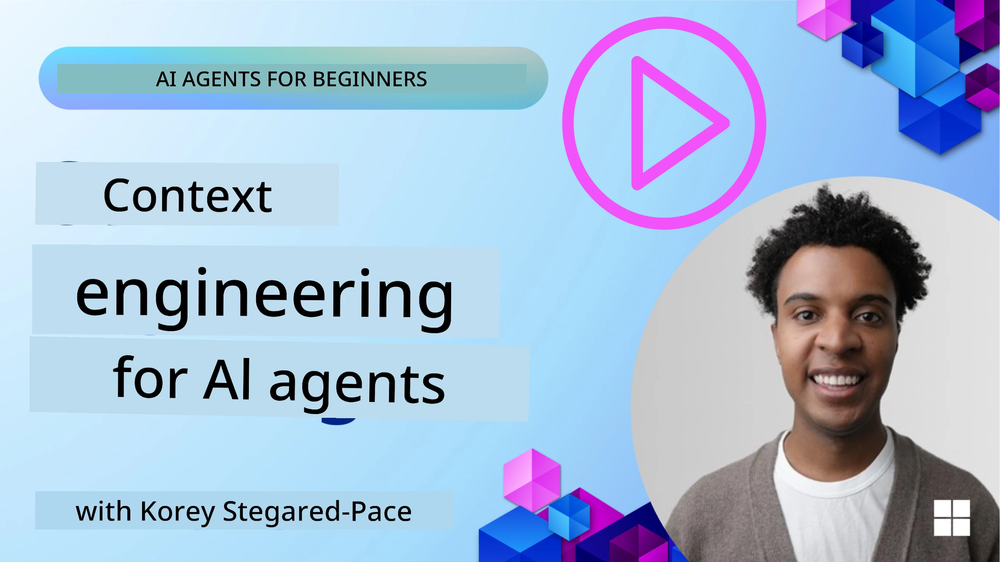
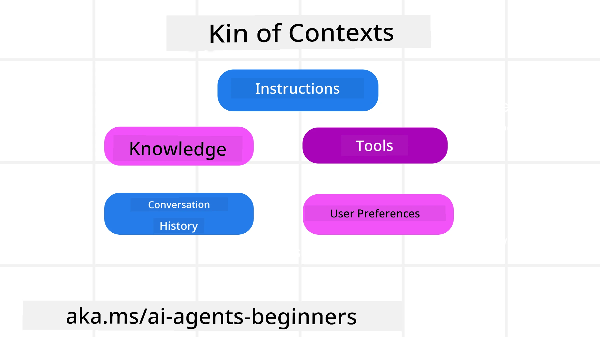
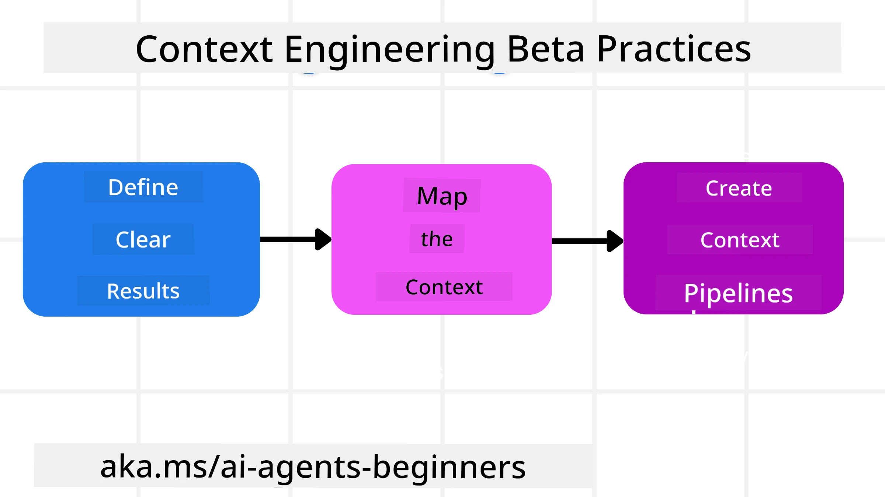

# Context Engineering for AI Agents

> _(Click di imagem wey dey up so make you fit see video for dis lesson)_

To sabi di yawa wey dey inside di app wey you dey build AI agent for, e important to make beta AI agent. We need build AI Agents wey go sabi manage info well well to solve yawa wey pass prompt engineering.

For dis lesson, we go look wetin context engineering mean and wetin e dey do for building AI agents.

## Introduction

Dis lesson go cover:

• **Wetin Context Engineering be** and why e different from prompt engineering.

• **Ways to sabi do Context Engineering well**, like how to write, select, compress, and separate information.

• **Wahala wey dey happen for Context** wey fit spoil your AI agent and how to fix am.

## Learning Goals

After you finish dis lesson, you go sabi how to:

• **Define context engineering** and sabi di difference between am and prompt engineering.

• **Know di main parts of context** for Large Language Model (LLM) apps.

• **Use strategies to write, select, compress, and separate context** to make agent work better.

• **Identify common context wahala** like poisoning, distraction, confusion, and clash, and sabi how to manage dem.

## Wetin be Context Engineering?

For AI Agents, context na wetin dey push di AI Agent make e plan how e go do certain things. Context Engineering na di work to make sure say AI Agent get correct info to fit finish di next step for di work. Di context window no dey very big, so as person wey dey build agent, we need build system and process to sabi add, remove, and make di info inside di context window small.

### Prompt Engineering vs Context Engineering

Prompt engineering na to focus on one set of static instructions to guide AI Agents finish task well with correct rules. Context engineering na how to manage info wey dey change, including di first prompt, to make sure AI Agent get wetin e need over time. Di main tin for context engineering na to make dis process easy to repeat and reliable.

### Types of Context

E good make you remember say context no be only one thing. Di info wey AI Agent need fit come from different places and na our work to make sure say di agent fit get dem:

Di kind context wey AI agent fit need manage na:

• **Instructions:** Na like di "rules" of di agent – prompts, system messages, few-shot examples (wey show AI how to do sometin), and descriptions of tools wey e fit use. Na here prompt engineering and context engineering join.

• **Knowledge:** Dis dey cover facts, info wey dem pull from database, or long-time memories wey agent don gather. E fit mean say you fit join Retrieval Augmented Generation (RAG) system if agent need access to many knowledge sources and database dem.

• **Tools:** Na definition of external functions, APIs and MCP Servers wey agent fit call, plus di feedback (results) wey e get when e use dem.

• **Conversation History:** Na di on-going talk with user. As time dey go, dis conversation fit multiple and complex well well and e go take space for di context window.

• **User Preferences:** Info wey person don learn about wetin user like or no like over time. Dem fit save am and call am when dem wan make big decision to help user.

## Strategies for Effective Context Engineering

### Planning Strategies

Beta context engineering dey start with correct planning. Dis na way wey fit help you start think how to put context engineering into work:

1. **Define Clear Results** - Di results of tasks wey AI Agents go do suppose clear. Answer di question - "How di world go be after AI Agent don finish im work?" Meaning say, wetin change, info, or response wey user suppose get after e use AI Agent.

2. **Map the Context** - After you don define AI Agent results, answer di question "Wetin AI Agent need to know to fit finish dis work?". Dat way you fit start map where you fit find dat info.

3. **Create Context Pipelines** - Now wey you sabi where di info dey, answer di question "How Agent go take get dis info?". You fit do dis in plenty ways like RAG, use MCP servers and other tools.

### Practical Strategies

Planning important but when di info start dey enter di agent's context window, you need practical ways to manage am:

#### Managing Context

Even though some info go dey add inside di context window automatically, context engineering na to take control of dis info with some strategies:

 1. **Agent Scratchpad**
 Dis one allow AI Agent to take notes of important info about current tasks and user talks during one session. E suppose dey outside di context window for file or runtime object wey agent fit use later for dat session if e need am.

 2. **Memories**
 Scratchpads good for managing info outside di context window for single session. Memories make agents fit save and find relevant info across many sessions. E fit get summaries, user preferences and feedback to make am better later.

 3. **Compressing Context**
  When di context window begin get full, you fit use methods like summarization and shortening. Dis means keep only di most important info or remove old messages.
  
 4. **Multi-Agent Systems**
  To develop multi-agent system na kind context engineering because each agent get im own context window. How dem go share and pass context to different agents na plan you suppose do.
  
 5. **Sandbox Environments**
  If agent need run some code or process plenty info inside one document, e go use too much tokens to process results. Instead of storing am all inside context window, agent fit use sandbox environment to run di code and only read di results and important info.
  
 6. **Runtime State Objects**
   Dis one na to create containers to manage when Agent need access to certain info. For complex task, e go let Agent save results of each small step one by one, so di context go only join that specific subtask.

#### Inspecting Context

After you use one of dis strategies, e good to check wetin di next model call actually get. Good debugging question na:

> Did di agent put too much context, di wrong context, or miss di context e need?

You no need log raw prompts, tool outputs, or memory contents to answer dis one. For production, better make small context inspection records wey get counts, ids, hashes, and policy labels:

- **Selection:** Track how many candidate chunks, tools, or memories you check, how many you pick, and which rule or score make others drop.

- **Compression:** Write down source range or trace id, summary id, estimate token count before and after compression, and if raw content no dey di next call.

- **Isolation:** Note which subtask run inside separate agent, session, or sandbox, what bounded summary come back, and if big tool output stay outside parent agent context.

- **Memory and RAG:** Save retrieval document ids, memory ids, scores, selected ids, and redaction status no be full text.

- **Safety and privacy:** Prefer hashes, ids, token buckets, and policy labels to using sensitive prompt text, tool arguments, tool results, or user memory bodies.

Goal no be to keep more context. Na to leave enough clues so developer fit talk which context strategy run and if e change next model call as you plan am.

### Example of Context Engineering

Make we talk say you want AI agent to **"Book me a trip to Paris."**

• Simple agent wey only use prompt engineering fit just talk: **"Okay, when you want go Paris?"** E only process your direct question at dat time you ask.

• Agent wey use context engineering strategies go do more. Before e answer, e system fit:

  ◦ **Check your calendar** for free dates (get real-time data).

 ◦ **Remember past travel preferences** (from long-term memory) like your preferred airline, budget, or if you like direct flights.

 ◦ **Know tools** wey fit book flight and hotel.

- Then, example response fit be: "Hey [Your Name]! I see say you free for first week of October. Make I look for direct flights to Paris on [Preferred Airline] within your usual budget [Budget]?" Dis smart response show how context engineering strong.

## Common Context Failures

### Context Poisoning

**Wetin e be:** When hallucination (fake info wey LLM talk) or mistake go inside context and dem dey quote am again and again, make agent chase impossible goals or do nonsense waya waya.

**Wetin to do:** Use **context validation** and **quarantine**. Check info well before you put am for long-term memory. If e look like poisoning, start fresh context to stop bad info spread.

**Travel Booking Example:** Your agent dey hallucinate **direct flight from small local airport go far far international city** wey no really dey international flights. Dis non-existent flight detail save for context. Later when you tell am book, e go dey try find ticket for dis impossible trip, cause yawa.

**Solution:** Put step to **check flight exist and routes with live API** _before_ you add flight detail to agent working context. If check no pass, bad info go "quarantine" and no go dey use again.

### Context Distraction

**Wetin e be:** When context long reach level wey model focus too much on old history instead of wetin e learn during training, fit make e dey do repetitive or useless work. Models fit start mistake before context window full.

**Wetin to do:** Use **context summarization**. Small small compress info into short summary, keep important parts and remove repeat history. Dis go "reset" focus.

**Travel Booking Example:** You don dey talk about dream travel place long well well including backpacking trip of two years ago. When you ask to **"find me cheap flight for next month,"** agent mix old irrelevant thing come dey ask about your backpack things and old itinerary instead of your current request.

**Solution:** After certain turns or when context too big, agent suppose **summarize recent and relevant parts of talk** – focus on current travel dates and place – then use summary for next LLM call, leave aside less relevant old chats.

### Context Confusion

**Wetin e be:** When too much context dey, like too many tools, model fit dey give bad answers or call wrong tools. Small models dey suffer pass.

**Wetin to do:** Use **tool loadout management** with RAG methods. Save tool descriptions for vector database and pick _only_ best tools for each task. Research show say better make tool less than 30.

**Travel Booking Example:** Your agent get plenty tools: `book_flight`, `book_hotel`, `rent_car`, `find_tours`, `currency_converter`, `weather_forecast`, `restaurant_reservations`, etc. You ask, **"How I fit move around Paris?"** Because tools too many, agent confuse, try call `book_flight` _inside_ Paris, or call `rent_car` even if you like public transport, because tool descriptions fit overlap or e no fit know correct one.

**Solution:** Use **RAG for tool descriptions**. When you ask about moving for Paris, system go only find best relevant tools like `rent_car` or `public_transport_info` based on your question, give LLM focused "loadout" of tools.

### Context Clash

**Wetin e be:** When conflicting info dey context, e fit make reasoning spoil or final answer no correct. E dey happen when info come in small parts and early wrong assumption still dey context.

**Wetin to do:** Use **context pruning** and **offloading**. Pruning mean remove old or conflicting info when new info come. Offloading na to give model separate "scratchpad" to work info without scatter main context.
**Travel Booking Example:** You first tell your agent, **"I want to fly economy class."** Later for the talk, you change your mind and talk say, **"Actually, for this trip, let's go business class."** If both instruction still dey for the context, the agent fit get conflicting search results or e fit confuse about which preference e suppose put first.

**Solution:** Make you do **context pruning**. When new instruction talk opposite old one, the old instruction go get remove or e go clear say e override for the context. Another way, the agent fit use **scratchpad** to settle conflicting preferences before e decide, so that only the final, correct instruction go direct the action.

## Got More Questions About Context Engineering?

Join the [Microsoft Foundry Discord](https://aka.ms/ai-agents/discord) to meet with other learners, attend office hours and get your AI Agents questions answered.

---

<!-- CO-OP TRANSLATOR DISCLAIMER START -->
**Disclaimer**:
Dis document don translate wit AI translation service [Co-op Translator](https://github.com/Azure/co-op-translator). Even tho we dey try make am correct, abeg make you know say automated translation fit get errors or mistakes. Di original document for dia own language na im be di correct source. For important info, make person wey sabi human translation do am. We no go responsible for any misunderstanding or wrong understanding wey fit happen because of dis translation.
<!-- CO-OP TRANSLATOR DISCLAIMER END -->