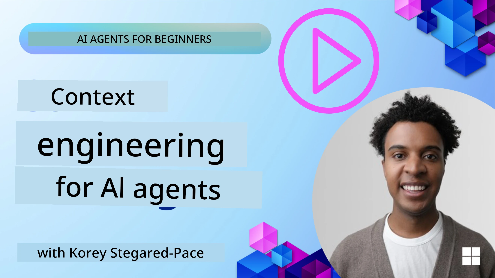
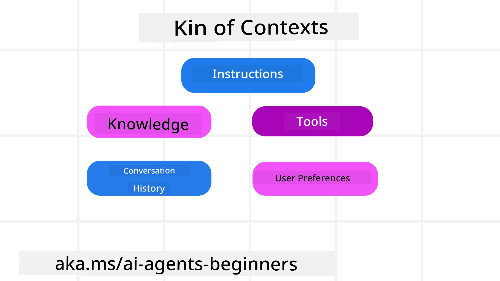
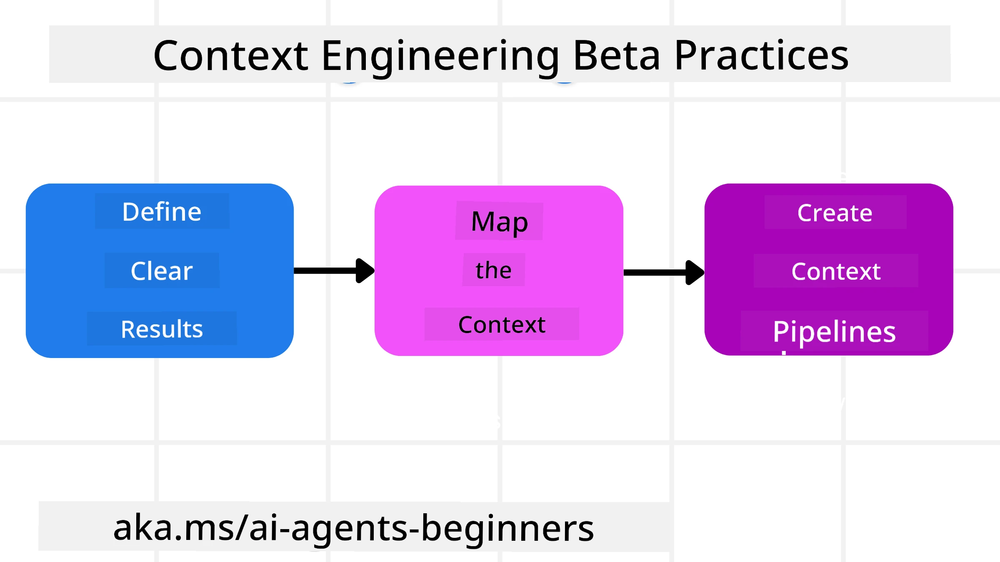

# Context Engineering for AI Agents

> _(Click di image wey dey above make you fit see video for dis lesson)_

To sabi how di applikeshan wey you dey build AI agent for e get correct matta na beta way to make sure say you build beta one. We need make AI Agents wey sabi handle information beta to use tackle complex matter pass only prompt engineering.

For dis lesson, we go look wetin context engineering mean and wetin e dey play for building AI agents.

## Introduction

Dis lesson go cover:

• **Wetin Context Engineering be** and why e different from prompt engineering.

• **Ways to do Context Engineering well well**, how to write, choose, compress, and hold information apart.

• **Common Context Wahala** wey fit spoil your AI agent and how you fit fix am.

## Learning Goals

After you finish dis lesson, you go sabi:

• **Define context engineering** and how e take different from prompt engineering.

• **Know di main parts of context** for Large Language Model (LLM) application dem.

• **Use ways to write, select, compress, and hold context apart** to make agent work better.

• **Recognize common context wahala** like poisoning, distraction, confusion, and clash, plus how to stop am.

## Wetin be Context Engineering?

For AI Agents, context na wetin dey guide di planning for AI Agent to make e do certain things. Context Engineering na di way wey person dey make sure say di AI Agent get di beta information to finish di next step for di work. Di context window get limit size, so as we be agent builders, we gats build systems and ways to handle how to add, remove, and shorten di information inside di context window.

### Prompt Engineering vs Context Engineering

Prompt engineering dey focus on one set of fixed instructions to guide AI Agents well with set of rules. Context engineering na how person go manage changing information, including di first prompt, to make sure say AI Agent get wetin e need all di time. Di main tin for context engineering na to make dis process dey repeat and reliable.

### Types of Context

E dey important to remember say context no be just one kind tin. Di information wey AI Agent need fit come from many different places and na our own work to make sure say di agent fit get access to all these places:

Kinds of context wey AI agent fit need manage include:

• **Instructions:** Dis ones be like di agent "rules" – prompts, system messages, small example wey show AI how to do tin, and explanation of tools wey e fit use. Na here prompt engineering and context engineering dem join.

• **Knowledge:** Dis one be facts, information wey person fit find for databases, or long time memory wey agent don gather. E fit include like to join Retrieval Augmented Generation (RAG) system if agent need access different knowledge stores and databases.

• **Tools:** Dem be definitions of outside functions, APIs and MCP Servers wey agent fit call, plus feedback (results) wey e dey get from using them.

• **Conversation History:** Di ongoing talk wey you dey get with user. As time dey go, conversation grow longer and more complex so dem dey use space for di context window.

• **User Preferences:** Information wey dem learn about user likes or no likes over time. Dem fit store am and call am anytime when dem wan do important decisions to help the user.

## Ways to Do Context Engineering Well Well

### Planning Ways

Beta context engineering dey start with beta planning. Dis na approach wey go help you start to think how to apply di idea of context engineering:

1. **Define Clear Results** - Results of di work wey AI Agents go do gats be clearly defined. Answer dis question - "How di world go be when AI Agent don finish im work?" In other words, wetin change, information, or reply wey user go get after im talk with AI Agent.
2. **Map di Context** - After you don define wetin the results go be for di AI Agent, you gats answer dis question "Wetin di AI Agent need to get to finish dis work?". Na so you fit begin map where dat information fit dey.
3. **Create Context Pipelines** - Now say you sabi where di information dey, you gats answer dis question "How di Agent go take get dis information?". Dis fit be in different ways like RAG, use MCP servers and other tools.

### Practical Ways

Planning na important, but once information begin flow inside our agent's context window, we gats get practical ways to handle am:

#### How to Manage Context

Some information go automatically add inside context window, but context engineering na to take more active control of dis information, and you fit do am by some ways:

 1. **Agent Scratchpad**
 Dis one na make AI Agent fit take notes of important information about di current work and user interaction during one session. E suppose dey outside di context window for one file or runtime object wey di agent fit later find during dis session if e need am.

 2. **Memories**
 Scratchpads na beta for managing information outside context window for one session. Memories dey make agents fit store and find important information across many sessions. E fit include summaries, user preferences and feedback for better work later.

 3. **Compressing Context**
  Once context window don big reach near im limit, techniques like summarization and trimming fit work. Dis fit mean to keep only beta important information or remove old messages.
  
 4. **Multi-Agent Systems**
  To develop multi-agent system na kind context engineering because each agent get im own context window. How dem go share and pass context between agents na still another tin to plan when you dey build these systems.
  
 5. **Sandbox Environments**
  If agent need run code or process plenty information for one document, e fit use plenty tokens to do di work. Instead make all of dis dey inside context window, di agent fit use sandbox environment wey fit run di code and just read di results and other important information.
  
 6. **Runtime State Objects**
   Dis one na to create container of information to manage times when Agent gots access to some certain information. For complex work, dis one go make am possible for Agent to store di result of each small work step by step, so context go still dey connected only to dat specific small work.

#### How to Check Context

After you try one of these ways, e good to check wetin di next model call actually carry. One beta debugging question be:

> Agent load too plenty context, wrong context or e miss context wey e need?

You no need log raw prompts, tool output or memory content to solve dat question. For production, better small context inspection records wey fit capture counts, ids, hashes, and policy labels:

- **Selection:** Track how many candidate chunks, tools, or memories dem consider, how many dem select, and which rule or score cause the others to be filtered out.
- **Compression:** Record source range or trace id, summary id, estimated token count before and after compression, plus whether raw content no enter next call.
- **Isolation:** Note which subtask run inside separate agent, session, or sandbox, what bounded summary return, and whether large tool output hide outside parent agent context.
- **Memory and RAG:** Store retrieval document ids, memory ids, scores, selected ids, and redaction status instead of full retrieved text.
- **Safety and privacy:** Prefer hashes, ids, token buckets, and policy labels better pass sensitive prompt text, tool arguments, tool results, or user memory bodies.

Di main goal no be to keep more context. Na to leave enough proof so developer fit tell which context strategy run and whether e change next model call like e suppose be.

### Example of Context Engineering

Make we talk say we want AI agent to **"Book me a trip to Paris."**

• Simple agent wey only use prompt engineering fit answer: **"Okay, when you want go Paris?**". E just process im direct question as user ask am.

• But agent wey use context engineering ways wey we cover go do more. Before e answer, e system fit:

  ◦ **Check your calendar** for open dates (na real-time data).

 ◦ **Remember past travel preferences** (from long-term memory) like your best airline, budget, or if you like direct flights.

 ◦ **Identify tools** wey fit help book flights and hotels.

- Then example response fit be: "Hey [Your Name]! I see say you free for di first week of October. Make I find direct flights to Paris on [Preferred Airline] inside your usual budget of [Budget]?". Dis kind answer wey get context show how context engineering strong.

## Common Context Wahala

### Context Poisoning

**Wetyn e be:** When hallucination (false information wey LLM make) or mistake enter context and dem dey keep talk am, e fit make agent follow impossible goals or make nonsense plans.

**Wetin to do:** Make **context validation** and **quarantine**. Make sure information correct before e enter long-term memory. If poisoning chance show, start fresh context thread to stop bad information from spread.

**Travel Booking Example:** Your agent believe say **direct flight dey from small local airport to big international city** but na lie because dat airport no get international flight. This wrong flight info dey save inside context. Later when you ask agent book, e go dey chase this impossible route, cause plenty mistakes.

**Wey be solution:** Add step wey **check if flight dey and routes with real-time API** _before_ you add flight info to agent's context. If check fail, wrong info go "quarantine" and no go use again.

### Context Distraction

**Wetyn e be:** When context too big so model dey focus too much on old conversation instead of wetin e learn from training, e fit cause repeat or useless action. Models fit make mistakes before context window full.

**Wetin to do:** Use **context summarization**. Sometimes compress old information into smaller summary, keep important tings and remove old things. E help "reset" focus.

**Travel Booking Example:** You don dey talk about different travel dreams long time, including your backpack trip from two years ago. When you finally say **"find me cheap flight for next month,"** agent get stuck for old, irrelevant tings and keep ask about your backpack gear or past trip, no want focus your current request.

**Solution:** After certain turns or when context too big, agent suppose **summarize recent and important part of talk** – focus on your travel dates and place – and use the short summary for next LLM call, drop old unnecessary chat.

### Context Confusion

**Wetyn e be:** When too much context, sometimes because too many tools, dey make model give bad answers or call tools wey no relate. Small model dey suffer dis kind wahala.

**Wetin to do:** Use **tool loadout management** with RAG. Store tool description for vector database and select _only_ beta tools for each work. Research say better make tool count no pass 30.

**Travel Booking Example:** Your agent get many tools: `book_flight`, `book_hotel`, `rent_car`, `find_tours`, `currency_converter`, `weather_forecast`, `restaurant_reservations`. You ask, **"How best I go take waka for Paris?"** Because tool plenty, agent get confused, e go try `book_flight` _inside_ Paris or `rent_car` even if you prefer public transport, because tool description fit overlap or e no fit pick beta one.

**Solution:** Use **RAG for tool descriptions**. When you ask about Paris transport, system go dynamically find _only_ important tools like `rent_car` or `public_transport_info` base on your question, then show small "loadout" of tools to LLM.

### Context Clash

**Wetyn e be:** When two or more conflicting information dey inside context, e fit make model reason bad or give bad final answer. Dis fit happen if information show in parts and early wrong belief still dey context.

**Wetin to do:** Use **context pruning** and **offloading**. Pruning mean remove old or conflicting info as new details show. Offloading mean give model separate "scratchpad" workspace to process info without full context clutter.

**Travel Booking Example:** You first tell your agent, **"I want to fly economy class."** Later for the talk, you change your mind and talk say, **"Actually, for this trip, make we go business class."** If both instructions still dey for the context, e fit cause wahala because the agent fit get confused which one e suppose follow first.

**Solution:** Make you do **context pruning**. If new instruction dey contradict old one, the old instruction go comot or the new one go take over clearly inside the context. Another way be say the agent fit use **scratchpad** to check through the conflicting preferences before e decide, so e go make sure say only the last correct instruction go guide how e go act.

## You Get More Questions About Context Engineering?

Join the [Microsoft Foundry Discord](https://discord.com/invite/ATgtXmAS5D) to meet with other learners, attend office hours and get your AI Agents questions answered.

---

<!-- CO-OP TRANSLATOR DISCLAIMER START -->
**Disclaimer**:
Dis document don translate wit AI translation service [Co-op Translator](https://github.com/Azure/co-op-translator). Even tho we dey try make am correct, abeg make you know say automated translation fit get errors or mistakes. Di original document for dia own language na im be di correct source. For important info, make person wey sabi human translation do am. We no go responsible for any misunderstanding or wrong understanding wey fit happen because of dis translation.
<!-- CO-OP TRANSLATOR DISCLAIMER END -->