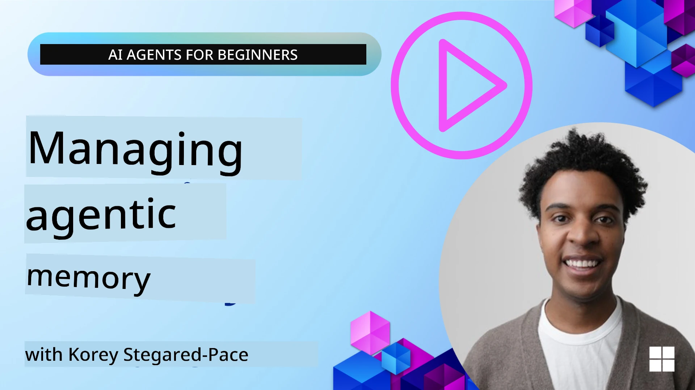

# Memori for AI Agents 

When we dey speak about di special benefits wey dey come from creating AI Agents, two tins dem dey mainly talk about: di ability to call tools to finish tasks and di ability to improve as time dey pass. Memori na di foundation wey dey help make self-improving agents wey fit give better experiences to our users.

For dis lesson, we go check wetin memori mean for AI Agents and how we fit manage am and use am for di benefit of our applications.

## Introduction

This lesson go cover:

• **Understanding AI Agent Memory**: Wetin memori be and why e important for agents.

• **Implementing and Storing Memory**: Practical ways to add memori capabilities to your AI agents, wey go focus on short-term and long-term memori.

• **Making AI Agents Self-Improving**: How memori dey enable agents to learn from past interactions and improve with time.

## Available Implementations

This lesson get two complete notebook tutorials:

• **[13-agent-memory.ipynb](./13-agent-memory.ipynb)**: Dey implement memori wit Mem0 and Azure AI Search using Microsoft Agent Framework

• **[13-agent-memory-cognee.ipynb](./13-agent-memory-cognee.ipynb)**: Dey implement structured memori wit Cognee, wey automatically dey build knowledge graph backed by embeddings, dey visualize di graph, and dey do intelligent retrieval

## Learning Goals

After you finish dis lesson, you go sabi how to:

• **Differentiate between various types of AI agent memory**, including working, short-term, and long-term memori, plus special kinds like persona and episodic memori.

• **Implement and manage short-term and long-term memory for AI agents** using Microsoft Agent Framework, and use tools like Mem0, Cognee, Whiteboard memory, and integrate wit Azure AI Search.

• **Understand the principles behind self-improving AI agents** and how good memori management systems dey help continuous learning and adaptation.

## Understanding AI Agent Memory

For im core, **memori for AI agents na di mechanisms wey make dem fit retain and recall information**. Dis information fit be specific details about wan conversation, user preferences, past actions, or even patterns wey dem don learn.

If no memori dey, AI applications dey mostly stateless, meaning every interaction dey start from scratch. Dis one fit make user experience repetitive and frustrating as the agent go "forget" previous context or preferences.

### Why is Memory Important?

Di intelligence of agent dey yansh to im ability to recall and use past information. Memori make agents fit:

• **Reflective**: Learn from past actions and outcomes.

• **Interactive**: Keep context for ongoing conversation.

• **Proactive and Reactive**: Expect needs or respond well based on historical data.

• **Autonomous**: Work more independent by using stored knowledge.

Di goal of implementing memori na to make agents more **reliable and capable**.

### Types of Memory

#### Working Memory

Think am like scratch paper wey agent dey use during single, ongoing task or thought process. E dey hold immediate information wey dem need to compute di next step.

For AI agents, working memori dey usually capture di most relevant info from a conversation, even if di whole chat history long or truncated. E dey focus on extracting important elements like requirements, proposals, decisions, and actions.

**Working Memory Example**

For travel booking agent, working memori fit capture di user's current request, like "I want to book a trip to Paris". Dis specific requirement go dey inside di agent immediate context to guide di current interaction.

#### Short Term Memory

Dis kain memori dey hold information for duration of one conversation or session. Na di context of di current chat, wey allow di agent to refer back to previous turns for di dialogue.

**Short Term Memory Example**

If user ask, "How much would a flight to Paris cost?" and then follow up with "What about accommodation there?", short-term memori go make sure di agent sabi say "there" mean "Paris" inside di same conversation.

#### Long Term Memory

Dis one na information wey dey persist across many conversations or sessions. E allow agents remember user preferences, past interactions, or general knowledge for long time. Dis one important for personalization.

**Long Term Memory Example**

Long-term memori fit store say "Ben enjoys skiing and outdoor activities, likes coffee with a mountain view, and wants to avoid advanced ski slopes due to a past injury". Dis info wey dem learn from previous interactions go affect recommendations for future travel planning, make dem dey highly personalized.

#### Persona Memory

Dis special memori type dey help agent develop consistent "personality" or "persona". E allow agent remember details about itself or im intended role, make interactions flow and stay focused.

**Persona Memory Example**
If travel agent design make e be "expert ski planner," persona memori fit reinforce dat role, make responses follow expert tone and knowledge.

#### Workflow/Episodic Memory

Dis memori dey store di sequence of steps agent take during complex task, including successes and failures. E be like remembering specific "episodes" or past experiences to learn from.

**Episodic Memory Example**

If agent try book one flight but e fail because seat no dey, episodic memori fit record dis failure, so agent fit try alternative flights or tell user about di issue for next attempt in more informed way.

#### Entity Memory

Dis one involve extracting and remembering specific entities (people, places, or things) and events from conversations. E allow agent build structured understanding of key elements wey dem discuss.

**Entity Memory Example**

From conversation about past trip, agent fit extract "Paris," "Eiffel Tower," and "dinner at Le Chat Noir restaurant" as entities. For future interaction, agent fit recall "Le Chat Noir" and offer to make new reservation there.

#### Structured RAG (Retrieval Augmented Generation)

Even though RAG na broader technique, "Structured RAG" dey highlighted as powerful memori technology. E dey extract dense, structured information from different sources (conversations, emails, images) and use am to improve precision, recall, and speed for responses. No be like classic RAG wey only use semantic similarity; Structured RAG dey work with di inherent structure of information.

**Structured RAG Example**

Instead of just matching keywords, Structured RAG fit parse flight details (destination, date, time, airline) from one email and store dem for structured way. Dis one allow precise queries like "What flight did I book to Paris on Tuesday?"

## Implementing and Storing Memory

To implement memori for AI agents, you go follow systematic process of **memory management**, wey include generating, storing, retrieving, integrating, updating, and even "forgetting" (or deleting) information. Retrieval na one critical part.

### Specialized Memory Tools

#### Mem0

One way to store and manage agent memori na to use specialized tools like Mem0. Mem0 dey act as persistent memori layer, make agents fit recall relevant interactions, store user preferences and factual context, and learn from successes and failures over time. Di idea na to turn stateless agents into stateful ones.

E dey work through **two-phase memori pipeline: extraction and update**. First, messages wey add to agent thread dem send go Mem0 service, wey go use Large Language Model (LLM) to summarize conversation history and extract new memories. Afterwards, LLM-driven update phase go decide whether to add, change, or delete these memories, then store dem inside hybrid data store wey fit include vector, graph, and key-value databases. Dis system still support different memori types and fit incorporate graph memori to manage relationships between entities.

#### Cognee

Another strong approach na to use **Cognee**, open-source semantic memori for AI agents wey dey transform structured and unstructured data into queryable knowledge graphs backed by embeddings. Cognee get **dual-store architecture** wey join vector similarity search with graph relationships, make agents fit understand not only wetin similar, but how concepts relate to each other.

E strong for **hybrid retrieval** wey blend vector similarity, graph structure, and LLM reasoning - from raw chunk lookup to graph-aware question answering. Di system dey maintain **living memory** wey dey evolve and grow but still dey queryable as one connected graph, supporting both short-term session context and long-term persistent memori.

Di Cognee notebook tutorial ([13-agent-memory-cognee.ipynb](./13-agent-memory-cognee.ipynb)) dey show how to build dis unified memori layer, wit practical examples of ingesting different data sources, visualizing di knowledge graph, and querying wit different search strategies wey fit di agent needs.

### Storing Memory with RAG

Besides specialized memory tools like mem0 , you fit use strong search services like **Azure AI Search as a backend for storing and retrieving memories**, especially for structured RAG.

Dis one allow you ground your agent responses with your own data, make answers more relevant and accurate. Azure AI Search fit store user-specific travel memories, product catalogs, or any other domain-specific knowledge.

Azure AI Search get capabilities like **Structured RAG**, wey dey excel for extracting and retrieving dense, structured information from big datasets like conversation histories, emails, or even images. Dis one dey give "superhuman precision and recall" compared to normal text chunking and embedding approaches.

## Making AI Agents Self-Improve

One common pattern for self-improving agents na to introduce **"knowledge agent"**. Dis separate agent dey observe di main conversation between di user and di primary agent. Im role na to:

1. **Identify valuable information**: Check if any part of di conversation worth to save as general knowledge or specific user preference.

2. **Extract and summarize**: Distill di important learning or preference from di conversation.

3. **Store in a knowledge base**: Put dis extracted information for storage, often for vector database, so e fit dey retrieved later.

4. **Augment future queries**: When user start new query, knowledge agent go retrieve relevant stored info and add am to user prompt, give important context to di primary agent (similar to RAG).

### Optimizations for Memory

• **Latency Management**: To avoid slowing down user interactions, you fit use cheaper, faster model first to quickly check if information worth to store or retrieve, then call di more complex extraction/retrieval process only when necessary.

• **Knowledge Base Maintenance**: For growing knowledge base, info wey dem no dey use often fit move to "cold storage" to manage costs.

## Got More Questions About Agent Memory?

Join di [Microsoft Foundry Discord](https://aka.ms/ai-agents/discord) to meet other learners, attend office hours, and make your AI Agents questions get answer.

---

<!-- CO-OP TRANSLATOR DISCLAIMER START -->
Abeg note:
Dis document dem translate with AI translation service Co-op Translator (https://github.com/Azure/co-op-translator). Even though we dey try make am correct, make you sabi say automatic translations fit get mistakes or inaccuracies. Di original document for im original language suppose be di authoritative source. If na important information, we recommend say professional human translator do di translation. We no dey liable for any misunderstanding or misinterpretation wey fit arise from using dis translation.
<!-- CO-OP TRANSLATOR DISCLAIMER END -->