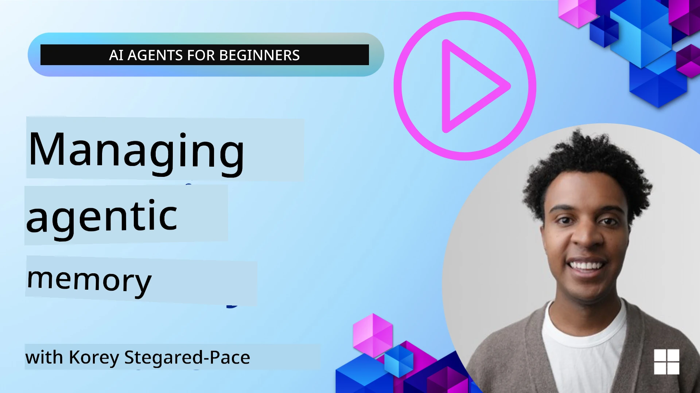

# Memori for AI Agents 

Wen we dey tok about wetin AI Agents fit do special, two tins na di main tin dem dey talk: di ability to use tools to finish work and di ability to improve as time dey go. Memori na di base wey we dey use take build self-improving agent wey fit give beta experience to our users.

For dis lesson, we go see wetin memori mean for AI Agents and how we fit take manage am plus use am benefit our applications.

## Introduction

Dis lesson go cover:

• **Understanding AI Agent Memory**: Wetin memori be and why e important for agents.

• **Implementing and Storing Memory**: Practical ways to add memori power to your AI agents, focus for short-term and long-term memori.

• **Making AI Agents Self-Improving**: How memori help agents learn from past interactions and improve as time dey pass.

## Available Implementations

Dis lesson get two full notebook tutorials:

• **[13-agent-memory.ipynb](./13-agent-memory.ipynb)**: Implements memori using Mem0 and Azure AI Search with Microsoft Agent Framework

• **[13-agent-memory-cognee.ipynb](./13-agent-memory-cognee.ipynb)**: Implements structured memori using Cognee, wey automatically dey build knowledge graph wey dem back with embeddings, dey show graph well well, and sabi how to find tins smartly

## Learning Goals

After you finish dis lesson, you go sabi how to:

• **Differentiate between different kain AI agent memory**, like working, short-term, and long-term memori, plus special ones like persona and episodic memori.

• **Implement and manage short-term and long-term memori for AI agents** using Microsoft Agent Framework, use tools like Mem0, Cognee, Whiteboard memori, and join am with Azure AI Search.

• **Understand the principles behind self-improving AI agents** and how strong memori management systems dey help with continuous learning and adaptation.

## Understanding AI Agent Memory

For di center, **memori for AI agents na di ways dem take dey keep and recall information**. Dis information fit be specific details about conversation, user likes, past actions, or even learned patterns.

Without memori, AI apps dey stateless, mean say every time interaction start fresh. Dis one fit make user get wahala cos di agent go "forget" wetin dem talk before or user likes.

### Why memory Important?

Agent intelligence get strong connection to how e fit recall and use past information. Memori make agents fit be:

• **Reflective**: Dem dey learn from past actions and results.

• **Interactive**: Dem dey maintain context for ongoing talk.

• **Proactive and Reactive**: Dem dey expect wetin person fit want or answer well based on past data.

• **Autonomous**: Dem dey work more by demself using knowledge wey dem don keep.

Goal to put memori na to make agents more **reliable and capable**.

### Types of Memory

#### Working Memory

Think am like scratch paper wey agent dey use for one ongoing task or thought. E hold immediate info wey e need to do di next step.

For AI agents, working memori fit capture main info from conversation, even if full chat history long or cut. E dey focus on main tins like requirements, proposals, decisions, and actions.

**Working Memory Example**

For travel booking agent, working memori fit catch wetin user dey ask now, like "I wan book trip go Paris". Dis kain request dey inside agent immediate context to guide current talk.

#### Short Term Memory

Dis memori dey keep info for just one conversation or session. Na di context of current chat, e allow agent to refer back to previous turns for dia talk.

For [Microsoft Agent Framework](https://github.com/microsoft/agent-framework) Python SDK samples, dis one be `AgentSession`, created with `agent.create_session()`. Di session na short-term memori inside framework: e keep conversation context as di session dey used, but e no keep am when session finish or app restart. Use long-term memori for facts and likes wey must last across sessions, usually via database, vector index, or another steady storage.

**Short Term Memory Example**

If user ask, "How much flight go Paris dey cost?" then add "How accommodation go be for there?", short-term memori go make sure say agent sabi "there" mean "Paris" for the same conversation.

#### Long Term Memory

Dis one na info wey last pass plenti conversations or sessions. E allow agents to remember user likes, past interactions, or general knowledge for long time. Dis one important for personalization.

**Long Term Memory Example**

Long-term memori fit hold say "Ben like to ski and outdoor activities, enjoy coffee with mountain view, and no want advanced ski slopes because past injury". Dis tory, wey dem learn from past talks, dey affect recommendations for future travel planning, make dem dey very personal.

#### Persona Memory

Dis special memori type dey help agent build consistent "personality" or "persona". E allow agent remember tins about itself or im assigned role, make interaction smooth and focused.

**Persona Memory Example**
If di travel agent na expert for ski planning, persona memori go help keep dat role strong, influence how e respond like expert wit knowledge.

#### Workflow/Episodic Memory

Dis memori dey keep steps agent dey take for complicated tasks, including wins and losses. E be like remembering specific "episodes" or past experiences to learn from dem.

**Episodic Memory Example**

If agent try book one particular flight but e no work because no available seat, episodic memori fit hold dis failure, make agent try other flights or inform user better next time.

#### Entity Memory

Dis one dey involve to take out and remember specific entities (like person, place, or tins) and events from conversation. E allow agent build structured understanding of main tins dem discuss.

**Entity Memory Example**

For conversation about past trip, agent fit take out "Paris," "Eiffel Tower," and "dinner for Le Chat Noir restaurant" as entities. For next talk, agent fit recall "Le Chat Noir" and offer to make new booking there.

#### Structured RAG (Retrieval Augmented Generation)

Even though RAG na broad technique, "Structured RAG" na strong memori technology. E take dense, structured info from different sources (conversations, emails, images) and dey use am to make answers more exact, fast and correct. No like normal RAG wey na only semantics, Structured RAG dey work with info own structure.

**Structured RAG Example**

Instead to just match keywords, Structured RAG fit comot flight details (where e dey go, date, time, airline) from email and store am well structured. Dis one make exact questions like "Wetin flight I book for Paris for Tuesday?" possible.

## Implementing and Storing Memory

To implement memory for AI agents na organized process of **memory management**, wey include how to generate, store, find, join, update, and even "forget" (or delete) info. Finding info na especially important part.

### Specialized Memory Tools

#### Mem0

One way to save and manage agent memori na to use tools like Mem0. Mem0 dey work as steady memori layer, allow agents remember important talks, save user likes and correct context, plus learn from wins and losses over time. Idea na say stateless agents go become stateful.

E dey work with **two-phase memori pipeline: extraction and update**. First, messages wey add enter agent thread dey send to Mem0 service, wey use Large Language Model (LLM) to summarize conversation history and comot new memories. Next, one LLM-driven update phase go decide if e go add, change, or delete memories, and store them for hybrid data store wey fit get vector, graph, and key-value databases. Dis system fit support different memori types and fit join graph memory to manage relations between entities.

#### Cognee

Another strong way na to use **Cognee**, wey be open-source semantic memori for AI agents wey dey turn structured and unstructured data into knowledge graphs backed by embeddings. Cognee get **dual-store architecture** wey join vector similarity search with graph relationships, allow agents sabi not only wetin similar but how concepts relate.

E good for **hybrid retrieval** wey mix vector similarity, graph structure, and LLM reasoning - from raw chunk lookup to graph-aware question answering. System get **living memory** wey dey evolve, grow, and still dey query as one connected graph, fit support both short-term session context and long-term stable memori.

Cognee notebook tutorial ([13-agent-memory-cognee.ipynb](./13-agent-memory-cognee.ipynb)) dey show how to build dis combined memori layer, wit practical examples to take different data, show knowledge graph, and query with different search methods wey suit specific agent needs.

### Storing Memory with RAG

Outside specialized memori tools like Mem0, you fit use strong search service like **Azure AI Search as backend for storing and finding memories**, especially for structured RAG.

Dis one go make your agent responses get base for your own data, make answers dey relevant and correct. Azure AI Search fit store user-specific travel memories, product catalogs, or any other domain-specific knowledge.

Azure AI Search fit support tins like **Structured RAG**, wey sabi take extract and find dense, structured info from big data like conversation histories, emails, or even pictures. E dey provide "superhuman precision and recall" compared to normal text chunking and embedding approach.

## Making AI Agents Self-Improve

Common way to make self-improving agents na to add **"knowledge agent"**. Dis other agent dey watch main conversation between user and primary agent. E get role to:

1. **Identify valuable information**: Find if any part of talk worth to save as general knowledge or specific user like.

2. **Extract and summarize**: Comot important learning or preference from conversation.

3. **Store for knowledge base**: Save dis comot information, usually for vector database, so e fit find am later.

4. **Add to future queries**: Wen user start new query, knowledge agent go find important saved info and add am to user prompt, give important context to primary agent (like RAG).

### Optimizations for Memory

• **Latency Management**: To no make user interaction slow, cheaper and faster model fit dey used first to check if memori worth to save or find, only use more complex extraction/retrieval wen necessary.

• **Knowledge Base Maintenance**: For big knowledge base wey dey grow, less used info fit move to "cold storage" to control cost.

## Got More Questions About Agent Memory?

Join di [Microsoft Foundry Discord](https://discord.com/invite/ATgtXmAS5D) to meet other learners, waka go office hours and get your AI Agents questions answer well well.

---

<!-- CO-OP TRANSLATOR DISCLAIMER START -->
**Disclaimer**:
Dis document don translate wit AI translation service [Co-op Translator](https://github.com/Azure/co-op-translator). Even tho we dey try make am correct, abeg make you know say automated translation fit get errors or mistakes. Di original document for dia own language na im be di correct source. For important info, make person wey sabi human translation do am. We no go responsible for any misunderstanding or wrong understanding wey fit happen because of dis translation.
<!-- CO-OP TRANSLATOR DISCLAIMER END -->