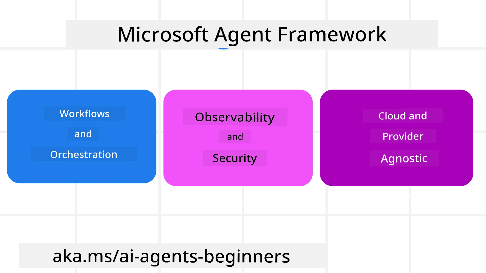

# Exploring Microsoft Agent Framework


### Introduction

Dis lesson go cover:

- Understanding Microsoft Agent Framework: Key Features and Value  
- Exploring the Key Concepts of Microsoft Agent Framework
- Advanced MAF Patterns: Workflows, Middleware, and Memory

## Learning Goals

After you don finish dis lesson, you go sabi how to:

- Build Production Ready AI Agents using Microsoft Agent Framework
- Apply the core features of Microsoft Agent Framework for your Agentic Use Cases
- Use advanced patterns like workflows, middleware, and observability

## Code Samples 

Code samples for [Microsoft Agent Framework (MAF)](https://aka.ms/ai-agents-beginners/agent-framewrok) dey for this repository under `xx-python-agent-framework` and `xx-dotnet-agent-framework` files.

## Understanding Microsoft Agent Framework



[Microsoft Agent Framework (MAF)](https://aka.ms/ai-agents-beginners/agent-framewrok) na Microsoft unified framework for building AI agents. E give di flexibility to handle plenty agentic use cases wey you fit see both for production and research environments including:

- **Sequential Agent orchestration** for settings wey step-by-step workflows dey required.
- **Concurrent orchestration** for settings wey agents need to finish tasks at the same time.
- **Group chat orchestration** for settings wey agents fit work together on one task.
- **Handoff Orchestration** for settings wey agents go pass task to another as dem dey complete subtasks.
- **Magnetic Orchestration** for settings wey manager agent dey create and change task list and dey manage coordination of subagents to finish the task.

To deliver AI Agents for Production, MAF also get features for:

- **Observability** through OpenTelemetry where every action of the AI Agent including tool use, orchestration steps, reasoning flows and performance monitoring dey show through Microsoft Foundry dashboards.
- **Security** by hosting agents natively on Microsoft Foundry wey get security controls like role-based access, private data handling and built-in content safety.
- **Durability** as Agent threads and workflows fit pause, resume and recover from errors wey make longer running process possible.
- **Control** as human in the loop workflows dey supported where tasks need human approval.

Microsoft Agent Framework sef dey focus for interoperability by:

- **Being Cloud-agnostic** - Agents fit run for containers, on-prem and different clouds.
- **Being Provider-agnostic** - Agents fit be created with your preferred SDK like Azure OpenAI and OpenAI
- **Integrating Open Standards** - Agents fit use protocols like Agent-to-Agent(A2A) and Model Context Protocol (MCP) to find and use other agents and tools.
- **Plugins and Connectors** - Connections fit link data and memory services like Microsoft Fabric, SharePoint, Pinecone and Qdrant.

Make we check how these features dey apply to some core concepts of Microsoft Agent Framework.

## Key Concepts of Microsoft Agent Framework

### Agents


**Creating Agents**

You go create agents by defining the inference service (LLM Provider), a
set of instructions wey the AI Agent go follow, and give am `name`:

```python
agent = AzureOpenAIChatClient(credential=AzureCliCredential()).create_agent( instructions="You are good at recommending trips to customers based on their preferences.", name="TripRecommender" )
```

The example above dey use `Azure OpenAI` but agents fit be created using plenty different services including `Microsoft Foundry Agent Service`:

```python
AzureAIAgentClient(async_credential=credential).create_agent( name="HelperAgent", instructions="You are a helpful assistant." ) as agent
```

OpenAI `Responses`, `ChatCompletion` APIs

```python
agent = OpenAIResponsesClient().create_agent( name="WeatherBot", instructions="You are a helpful weather assistant.", )
```

```python
agent = OpenAIChatClient().create_agent( name="HelpfulAssistant", instructions="You are a helpful assistant.", )
```

or remote agents using the A2A protocol:

```python
agent = A2AAgent( name=agent_card.name, description=agent_card.description, agent_card=agent_card, url="https://your-a2a-agent-host" )
```

**Running Agents**

Agents dey run use `.run` or `.run_stream` methods for non-streaming or streaming responses.

```python
result = await agent.run("What are good places to visit in Amsterdam?")
print(result.text)
```

```python
async for update in agent.run_stream("What are the good places to visit in Amsterdam?"):
    if update.text:
        print(update.text, end="", flush=True)

```

Each agent run get options to customize parameters like `max_tokens` wey agent go use, `tools` wey agent fit call, and even the `model` wey agent go run with.

This dey useful for cases wey certain models or tools dey required to complete user task.

**Tools**

Tools fit be defined during agent creation:

```python
def get_attractions( location: Annotated[str, Field(description="The location to get the top tourist attractions for")], ) -> str: """Get the top tourist attractions for a given location.""" return f"The top attractions for {location} are." 


# Wen you dey create ChatAgent directly

agent = ChatAgent( chat_client=OpenAIChatClient(), instructions="You are a helpful assistant", tools=[get_attractions]

```

and also when you dey run the agent:

```python

result1 = await agent.run( "What's the best place to visit in Seattle?", tools=[get_attractions] # Tool wey dem provide for dis run only )
```

**Agent Threads**

Agent Threads dey handle multi-turn talks. Threads fit be created by:

- Using `get_new_thread()` wey go allow thread to save over time
- Or automatically creating thread when running agent that last only during current run.

To create thread, di code go be like dis:

```python
# Make new thread.
thread = agent.get_new_thread() # Run di agent wit di thread.
response = await agent.run("Hello, I am here to help you book travel. Where would you like to go?", thread=thread)

```

You fit serialize the thread to save am for later use:

```python
# Make new thread.
thread = agent.get_new_thread() 

# Run di agent wit di thread.

response = await agent.run("Hello, how are you?", thread=thread) 

# Turn di thread to tin we fit store.

serialized_thread = await thread.serialize() 

# Change back di thread state afta you load am from storage.

resumed_thread = await agent.deserialize_thread(serialized_thread)
```

**Agent Middleware**

Agents dey interact with tools and LLMs to complete user tasks. For some situations, we want to execute or track things between these interactions. Agent middleware dey help us do this through:

*Function Middleware*

Dis middleware allow us execute action between the agent and tool/function wey im go call. Example be say you fit want do some logging on the function call.

For the code below, `next` dey define if the next middleware or the real function go call.

```python
async def logging_function_middleware(
    context: FunctionInvocationContext,
    next: Callable[[FunctionInvocationContext], Awaitable[None]],
) -> None:
    """Function middleware that logs function execution."""
    # Di tin wey we dey do before function start run
    print(f"[Function] Calling {context.function.name}")

    # Continue go next middleware or run function
    await next(context)

    # Di tin wey we dey do after function don run
    print(f"[Function] {context.function.name} completed")
```

*Chat Middleware*

Dis middleware let us execute or log action between agent and requests to the LLM.

E get important info like `messages` wey dey go the AI service.

```python
async def logging_chat_middleware(
    context: ChatContext,
    next: Callable[[ChatContext], Awaitable[None]],
) -> None:
    """Chat middleware that logs AI interactions."""
    # Pre-processing: Di log wey you go make before AI call
    print(f"[Chat] Sending {len(context.messages)} messages to AI")

    # Make e continue go di next middleware or AI service
    await next(context)

    # Post-processing: Di log wey you go make after AI response
    print("[Chat] AI response received")

```

**Agent Memory**

Like we talk for `Agentic Memory` lesson, memory na important part of how agent fit operate over different contexts. MAF get several types of memories:

*In-Memory Storage*

Na memory wey dey store inside threads during application runtime.

```python
# Make new thread.
thread = agent.get_new_thread() # Make the agent run wit the thread.
response = await agent.run("Hello, I am here to help you book travel. Where would you like to go?", thread=thread)
```

*Persistent Messages*

Dis memory dey used to store conversation history across different sessions. E dey defined with `chat_message_store_factory` :

```python
from agent_framework import ChatMessageStore

# Make one custom message store
def create_message_store():
    return ChatMessageStore()

agent = ChatAgent(
    chat_client=OpenAIChatClient(),
    instructions="You are a Travel assistant.",
    chat_message_store_factory=create_message_store
)

```

*Dynamic Memory*

Dis memory dey add to context before agent dem run. Dem fit store these memories for external services like mem0:

```python
from agent_framework.mem0 import Mem0Provider

# Using Mem0 for advanced memory capabilities
memory_provider = Mem0Provider(
    api_key="your-mem0-api-key",
    user_id="user_123",
    application_id="my_app"
)

agent = ChatAgent(
    chat_client=OpenAIChatClient(),
    instructions="You are a helpful assistant with memory.",
    context_providers=memory_provider
)

```

**Agent Observability**

Observability dey important to build reliable and maintainable agentic systems. MAF dey integrate with OpenTelemetry to provide tracing and meters for better observability.

```python
from agent_framework.observability import get_tracer, get_meter

tracer = get_tracer()
meter = get_meter()
with tracer.start_as_current_span("my_custom_span"):
    # make sometin
    pass
counter = meter.create_counter("my_custom_counter")
counter.add(1, {"key": "value"})
```

### Workflows

MAF get workflows wey be pre-defined steps to finish one task and dem include AI agents inside those steps.

Workflows dey made of different pieces wey give better control flow. Workflows let you do **multi-agent orchestration** and **checkpointing** to save workflow states.

The core parts of workflow na:

**Executors**

Executors dey receive input messages, do the tasks dem get, then produce output messages. This one dey push workflow forward to complete the bigger task. Executors fit be AI agent or custom logic.

**Edges**

Edges dey define how message flow dey inside workflow. These fits be:

*Direct Edges* - Simple one-to-one links between executors:

```python
from agent_framework import WorkflowBuilder

builder = WorkflowBuilder()
builder.add_edge(source_executor, target_executor)
builder.set_start_executor(source_executor)
workflow = builder.build()
```

*Conditional Edges* - Dem go activate after certain condition meet. Example, if hotel room no dey available, executor fit suggest other options.

*Switch-case Edges* - Dem route messages to different executors based on condition. Example, if travel customer get priority access, their tasks go run through another workflow.

*Fan-out Edges* - Send one message to many targets.

*Fan-in Edges* - Gather many messages from different executors and send one target.

**Events**

To give better observability for workflows, MAF get built-in events for execution including:

- `WorkflowStartedEvent`  - When workflow execution start
- `WorkflowOutputEvent` - When workflow produce output
- `WorkflowErrorEvent` - When workflow get error
- `ExecutorInvokeEvent`  - Executor begin work
- `ExecutorCompleteEvent`  - Executor finish work
- `RequestInfoEvent` - When request dey issued

## Advanced MAF Patterns

Di sections wey dey top cover key concepts of Microsoft Agent Framework. As you dey build more complex agents, here be some advanced patterns wey you fit consider:

- **Middleware Composition**: Chain multiple middleware handlers (logging, auth, rate-limiting) using function and chat middleware to get fine control over agent behavior.
- **Workflow Checkpointing**: Use workflow events and serialization to save and resume long-running agent processes.
- **Dynamic Tool Selection**: Mix RAG over tool descriptions with MAF's tool registration to show only relevant tools per query.
- **Multi-Agent Handoff**: Use workflow edges and conditional routing to coordinate handoffs between specialized agents.

## Code Samples 

Code samples for Microsoft Agent Framework dey for this repository under `xx-python-agent-framework` and `xx-dotnet-agent-framework` files.

## Got More Questions About Microsoft Agent Framework?

Join the [Microsoft Foundry Discord](https://aka.ms/ai-agents/discord) to meet other learners, attend office hours and get your AI Agents questions answered.

---

<!-- CO-OP TRANSLATOR DISCLAIMER START -->
**Disclaimer**:  
Dis document na wetin AI translation service [Co-op Translator](https://github.com/Azure/co-op-translator) translate. Even tho we dey try make am correct, abeg sabi say automated translation fit get some mistakes or errors. The original document for im own language na di correct one wey you suppose trust. If na important information, e better make person wey sabi translate am human translate am. We no go responsible for any misunderstand or wrong understanding wey fit come from using dis translation.
<!-- CO-OP TRANSLATOR DISCLAIMER END -->