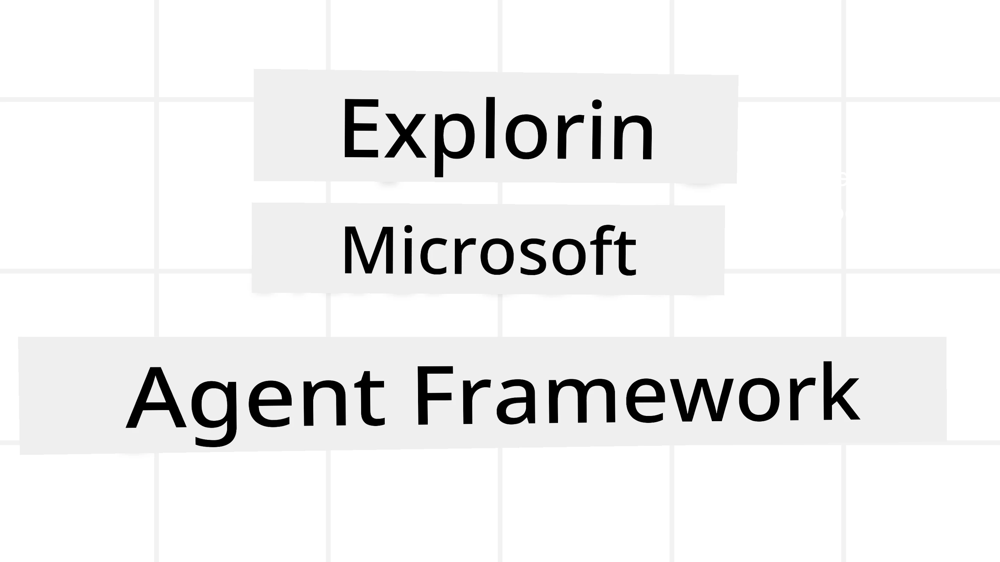
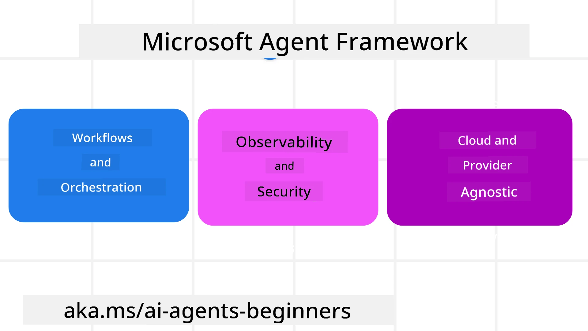
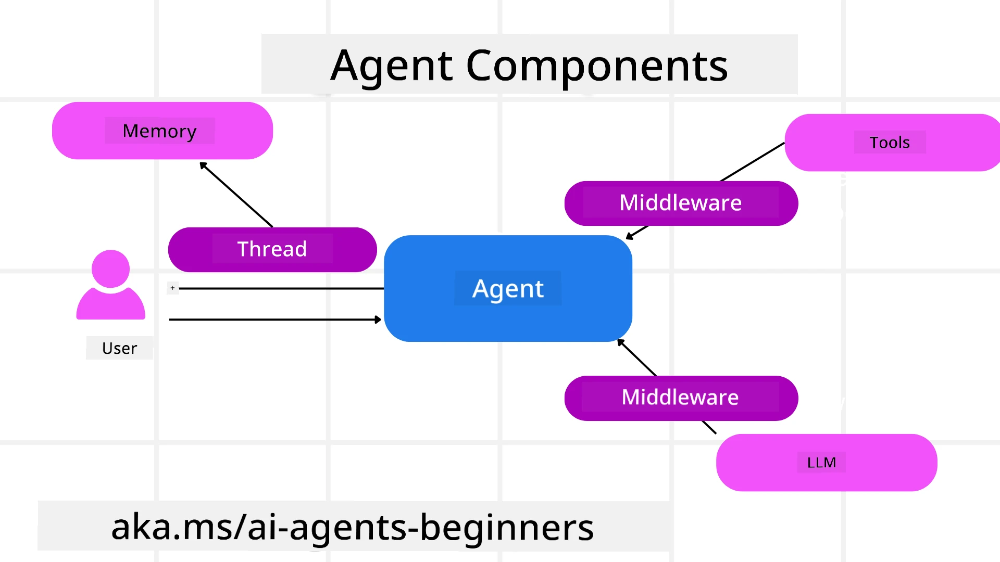

# Explorin Microsoft Agent Framework



### Introduction

Dis lesson go cover:

- Understanding Microsoft Agent Framework: Key Features and Value  
- Explorіng di Key Concepts of Microsoft Agent Framework
- Advanced MAF Patterns: Workflows, Middleware, and Memory

## Learning Goals

After you finish dis lesson, you go sabi how to:

- Build Production Ready AI Agents using Microsoft Agent Framework
- Apply di main features of Microsoft Agent Framework to your Agentic Use Cases
- Use advanced patterns like workflows, middleware, and observability

## Code Samples 

Code samples for [Microsoft Agent Framework (MAF)](https://learn.microsoft.com/en-us/agent-framework/overview/?wt.mc_id=youtube_26688_organicsocial_reactor&pivots=programming-language-python) fit find for dis repository under `xx-python-agent-framework` and `xx-dotnet-agent-framework` files.

## Understanding Microsoft Agent Framework



[Microsoft Agent Framework (MAF)](https://learn.microsoft.com/en-us/agent-framework/overview/?wt.mc_id=youtube_26688_organicsocial_reactor&pivots=programming-language-python) na Microsoft unified framework for building AI agents. E dey offer flexibility to handle plenty types of agentic use cases wey dem see for both production and research environments such as:

- **Sequential Agent orchestration** for times wey step-by-step workflows dey needed.
- **Concurrent orchestration** for times wey agents need to finish tasks at di same time.
- **Group chat orchestration** for times wey agents fit work together on one task.
- **Handoff Orchestration** for times wey agents dey pass task one to another as dem dey complete subtasks.
- **Magnetic Orchestration** for times wey manager agent dey create and change task list and dey coordinate subagents to complete di task.

To deliver AI Agents for Production, MAF also get features for:

- **Observability** through OpenTelemetry, wey dey track every action of AI Agent including tool calls, orchestration steps, reasoning flows and performance monitoring through Microsoft Foundry dashboards.
- **Security** as e host agents natively on Microsoft Foundry with security controls like role-based access, private data handling, and built-in content safety.
- **Durability** as Agent threads and workflows fit pause, resume and recover from errors wey allow longer running processes.
- **Control** as human in the loop workflows dey supported where tasks need human approval.

Microsoft Agent Framework also focus to dey interoperable by:

- **Being Cloud-agnostic** - Agents fit run inside containers, on-prem and across many different clouds.
- **Being Provider-agnostic** - Agents fit create using your preferred SDK like Azure OpenAI and OpenAI
- **Integrating Open Standards** - Agents fit use protocols like Agent-to-Agent(A2A) and Model Context Protocol (MCP) to find and use other agents and tools.
- **Plugins and Connectors** - Connections fit make to data and memory services like Microsoft Fabric, SharePoint, Pinecone and Qdrant.

Make we look how dem take apply these features to some of the main concepts of Microsoft Agent Framework.

## Key Concepts of Microsoft Agent Framework

### Agents



**Creating Agents**

To create agent na by to define the inference service (LLM Provider), a
set of instructions wey AI Agent go follow, and one `name` wey dem go give am:

```python
agent = AzureOpenAIChatClient(credential=AzureCliCredential()).create_agent( instructions="You are good at recommending trips to customers based on their preferences.", name="TripRecommender" )
```

Di code above dey use `Azure OpenAI` but agents fit create with different services like `Microsoft Foundry Agent Service`:

```python
AzureAIAgentClient(async_credential=credential).create_agent( name="HelperAgent", instructions="You are a helpful assistant." ) as agent
```

OpenAI `Responses`, `ChatCompletion` APIs

```python
agent = OpenAIResponsesClient().create_agent( name="WeatherBot", instructions="You are a helpful weather assistant.", )
```

```python
agent = OpenAIChatClient().create_agent( name="HelpfulAssistant", instructions="You are a helpful assistant.", )
```

or [MiniMax](https://platform.minimaxi.com/), wey get OpenAI-compatible API with large context windows (up to 204K tokens):

```python
agent = OpenAIChatClient(base_url="https://api.minimax.io/v1", api_key=os.environ["MINIMAX_API_KEY"], model_id="MiniMax-M3").create_agent( name="HelpfulAssistant", instructions="You are a helpful assistant.", )
```

or remote agents using di A2A protocol:

```python
agent = A2AAgent( name=agent_card.name, description=agent_card.description, agent_card=agent_card, url="https://your-a2a-agent-host" )
```

**Running Agents**

Agents dey run using `.run` or `.run_stream` methods for non-streaming or streaming responses.

```python
result = await agent.run("What are good places to visit in Amsterdam?")
print(result.text)
```

```python
async for update in agent.run_stream("What are the good places to visit in Amsterdam?"):
    if update.text:
        print(update.text, end="", flush=True)

```

Each agent run fit get options to customize parameters like `max_tokens` wey agent dey use, `tools` wey agent fit call, and even di `model` wey agent dey use.

Dis dey useful for cases wey specific models or tools dey needed to complete user task.

**Tools**

Tools fit define both when you dey define agent:

```python
def get_attractions( location: Annotated[str, Field(description="The location to get the top tourist attractions for")], ) -> str: """Get the top tourist attractions for a given location.""" return f"The top attractions for {location} are." 


# Wen yu di create ChatAgent directly

agent = ChatAgent( chat_client=OpenAIChatClient(), instructions="You are a helpful assistant", tools=[get_attractions]

```

and also when you dey run di agent:

```python

result1 = await agent.run( "What's the best place to visit in Seattle?", tools=[get_attractions] # Tool wey dem provide for dis run only )
```

**Agent Threads**

Agent Threads dey handle multi-turn conversations. Threads fit create by either:

- Using `get_new_thread()` wey enable thread to save over time
- Creating thread automatically when you run the agent and thread go last only during dat current run

To create thread, di code na:

```python
# Make new thread.
thread = agent.get_new_thread() # Run di agent wit di thread.
response = await agent.run("Hello, I am here to help you book travel. Where would you like to go?", thread=thread)

```

You fit serialize the thread make you store am to use later:

```python
# Make new thread.
thread = agent.get_new_thread() 

# Run di agent wit di thread.

response = await agent.run("Hello, how are you?", thread=thread) 

# Convert di thread to store am.

serialized_thread = await thread.serialize() 

# Convert back di thread state after dem load am from storage.

resumed_thread = await agent.deserialize_thread(serialized_thread)
```

**Agent Middleware**

Agents dey interact with tools and LLMs to complete user's tasks. For some cases we fit want execute or track between these interactions. Agent middleware allow us do dis by:

*Function Middleware*

Dis middleware allow us run action between agent and function/tool wey e go call. Example na when you wan do some logging on function call.

For di code below `next` na to show if next middleware or actual function suppose call.

```python
async def logging_function_middleware(
    context: FunctionInvocationContext,
    next: Callable[[FunctionInvocationContext], Awaitable[None]],
) -> None:
    """Function middleware that logs function execution."""
    # Pre-processing: Write log before function run
    print(f"[Function] Calling {context.function.name}")

    # Continue go next middleware or make function run
    await next(context)

    # Post-processing: Write log after function don run
    print(f"[Function] {context.function.name} completed")
```

*Chat Middleware*

Dis middleware allow us run or log action between agent and requests between LLM .

E get important info like `messages` wey dem dey send go AI service.

```python
async def logging_chat_middleware(
    context: ChatContext,
    next: Callable[[ChatContext], Awaitable[None]],
) -> None:
    """Chat middleware that logs AI interactions."""
    # Pre-processing: Log bifo AI call
    print(f"[Chat] Sending {len(context.messages)} messages to AI")

    # Continue to next middleware or AI service
    await next(context)

    # Post-processing: Log afta AI response
    print("[Chat] AI response received")

```

**Agent Memory**

As we cover for `Agentic Memory` lesson, memory na key part to help agent operate over different contexts. MAF get many types of memories:

*In-Memory Storage*

Dis na memory wey dey store for threads during app runtime.

```python
# Make new thread.
thread = agent.get_new_thread() # Run di agent wit di thread.
response = await agent.run("Hello, I am here to help you book travel. Where would you like to go?", thread=thread)
```

*Persistent Messages*

Dis memory dey store conversation history across different sessions. E dey define with `chat_message_store_factory`:

```python
from agent_framework import ChatMessageStore

# Make one kustom message stor
def create_message_store():
    return ChatMessageStore()

agent = ChatAgent(
    chat_client=OpenAIChatClient(),
    instructions="You are a Travel assistant.",
    chat_message_store_factory=create_message_store
)

```

*Dynamic Memory*

Dis memory dey add to context before agents run. These memories fit store for external services like mem0:

```python
from agent_framework.mem0 import Mem0Provider

# Di use of Mem0 na for advanced memory skill dem
memory_provider = Mem0Provider(
    api_key="your-mem0-api-key",
    user_id="user_123",
    application_id="my_app"
)

agent = ChatAgent(
    chat_client=OpenAIChatClient(),
    instructions="You are a helpful assistant with memory.",
    context_providers=memory_provider
)

```

**Agent Observability**

Observability important to build reliable and maintainable agentic systems. MAF integrate with OpenTelemetry to give tracing and meters for better observability.

```python
from agent_framework.observability import get_tracer, get_meter

tracer = get_tracer()
meter = get_meter()
with tracer.start_as_current_span("my_custom_span"):
    # do sometin
    pass
counter = meter.create_counter("my_custom_counter")
counter.add(1, {"key": "value"})
```

### Workflows

MAF get workflows wey na pre-defined steps to complete task wey get AI agents as part for these steps.

Workflows get different components wey give better control flow. Workflows fit also do **multi-agent orchestration** and **checkpointing** to save workflow states.

The main components of workflow na:

**Executors**

Executors dey receive input messages, perform their assigned tasks, then produce output message. This one dey move workflow go front to complete bigger task. Executors fit be either AI agent or custom logic.

**Edges**

Edges dey define how messages flow for workflow. Dem fit be:

*Direct Edges* - Simple one-to-one connections between executors:

```python
from agent_framework import WorkflowBuilder

builder = WorkflowBuilder()
builder.add_edge(source_executor, target_executor)
builder.set_start_executor(source_executor)
workflow = builder.build()
```

*Conditional Edges* - E dey activate after condition don meet. For example, if hotel rooms no dey available, executor fit suggest other options.

*Switch-case Edges* - Route messages to different executors based on condition. For example, if travel customer get priority access their tasks go run through another workflow.

*Fan-out Edges* - Send one message to many targets.

*Fan-in Edges* - Collect many messages from different executors and send to one target.

**Events**

To make workflow get better observability, MAF get built-in events for execution including:

- `WorkflowStartedEvent`  - Workflow execution don start
- `WorkflowOutputEvent` - Workflow don produce output
- `WorkflowErrorEvent` - Workflow get error
- `ExecutorInvokeEvent`  - Executor start to process
- `ExecutorCompleteEvent`  -  Executor finish processing
- `RequestInfoEvent` - Request don issue

## Advanced MAF Patterns

Di sections wey don pass cover key concepts of Microsoft Agent Framework. As you dey build more complex agents, here some advanced patterns to consider:

- **Middleware Composition**: Chain plenty middleware handlers (logging, auth, rate-limiting) using function and chat middleware for fine control over agent behavior.
- **Workflow Checkpointing**: Use workflow events and serialization to save and resume long agent processes.
- **Dynamic Tool Selection**: Combine RAG over tool descriptions with MAF's tool registration to show only relevant tools per query.
- **Multi-Agent Handoff**: Use workflow edges and conditional routing to arrange handoffs between specialized agents.

## Hosting LangChain / LangGraph Agents on Microsoft Foundry

Microsoft Agent Framework na **framework-interoperable** — you no need limit to agents wey dem write with MAF. If you get agent wey you build with **LangChain** or **LangGraph**, you fit run am as **Microsoft Foundry hosted agent** so Foundry dey manage runtime, sessions, scaling, identity, and protocol endpoints for you, while your agent logic dey LangGraph.

Dis one dey done with `langchain_azure_ai.agents.hosting` package, wey dey expose compiled LangGraph graph over same protocols wey Foundry hosted agents dey use.

**1. Install di hosting extra:**

```bash
pip install -U "langchain-azure-ai[hosting]>=1.2.4" azure-identity
```

Di `hosting` extra dey install Foundry protocol libraries: `azure-ai-agentserver-responses` (OpenAI-compatible `/responses` endpoint) and `azure-ai-agentserver-invocations` (generic `/invocations` endpoint).

**2. Choose hosting protocol:**

| Protocol | Host class | Endpoint | Use when |
|----------|-----------|----------|----------|
| **Responses** | `ResponsesHostServer` | `/responses` | You want OpenAI-compatible chat, streaming, response history, and conversation threading — di recommended default for conversational agents. |
| **Invocations** | `InvocationsHostServer` | `/invocations` | You need custom JSON shape, webhook-style endpoint, or non-conversational processing. |

Because **Responses API na di main API for agent-style development for Foundry**, start with `ResponsesHostServer` for most agents.

**3. Configure environment variables** (`az login` first so `DefaultAzureCredential` fit authenticate):

```bash
export FOUNDRY_PROJECT_ENDPOINT="https://<resource>.services.ai.azure.com/api/projects/<project>"
export FOUNDRY_MODEL_NAME="gpt-5-mini"
```

When agent later run as hosted agent for Foundry, platform go inject `FOUNDRY_PROJECT_ENDPOINT` automatically.

**4. Expose LangGraph agent over Responses protocol:**

```python
import os

from azure.ai.projects import AIProjectClient
from azure.identity import DefaultAzureCredential, get_bearer_token_provider
from langchain.agents import create_agent
from langchain_openai import ChatOpenAI
from langchain_azure_ai.agents.hosting import ResponsesHostServer

_AZURE_AI_SCOPE = "https://ai.azure.com/.default"


def build_chat_model() -> ChatOpenAI:
    project_endpoint = os.environ["FOUNDRY_PROJECT_ENDPOINT"].rstrip("/")
    deployment = os.environ.get("FOUNDRY_MODEL_NAME", "gpt-5-mini")
    credential = DefaultAzureCredential()
    project = AIProjectClient(endpoint=project_endpoint, credential=credential)
    openai_client = project.get_openai_client()
    token_provider = get_bearer_token_provider(credential, _AZURE_AI_SCOPE)

    # ChatOpenAI here dey target di Foundry project OpenAI-compatible (Responses) endpoint.
    return ChatOpenAI(
        model=deployment,
        base_url=str(openai_client.base_url),
        api_key=token_provider,
    )


def main() -> None:
    graph = create_agent(build_chat_model(), tools=[])
    port = int(os.environ.get("PORT", "8088"))
    ResponsesHostServer(graph).run(port=port)


if __name__ == "__main__":
    main()
```

Run am locally with `python main.py`, then send Responses request go `http://localhost:8088/responses`.

**Key behaviors:**

- **Conversations**: Clients continue conversation by passing `previous_response_id` or `conversation` ID. If your graph compiled with LangGraph checkpointer, Foundry go key conversation state to checkpoint (use durable checkpointer for production; `MemorySaver` good for local testing).
- **Human-in-the-loop**: If your graph use LangGraph `interrupt()`, `ResponsesHostServer` go show pending interrupt as Responses `function_call` / `mcp_approval_request` item, clients go resume with matching `function_call_output` / `mcp_approval_response`.
- **Deploy to Foundry**: Use Azure Developer CLI — `azd ext install azure.ai.agents`, `azd ai agent init -m <manifest>`, `azd ai agent run` (local, need Docker), then `azd provision` and `azd deploy`. Hosted-agent deployment need **Foundry Project Manager** role.

Runnable version of dis example dey for [code-samples/14-langchain-hosted-agent.py](../../../14-microsoft-agent-framework/code-samples/14-langchain-hosted-agent.py). For full walkthrough (Invocations protocol, custom request schemas, troubleshooting), see [Host LangGraph agents as Foundry hosted agents](https://learn.microsoft.com/azure/foundry/how-to/develop/langchain-hosted-agents).

## Code Samples 

Code samples for Microsoft Agent Framework fit find for dis repository under `xx-python-agent-framework` and `xx-dotnet-agent-framework` files.

## Got More Questions About Microsoft Agent Framework?

Join [Microsoft Foundry Discord](https://discord.com/invite/ATgtXmAS5D) to meet other learners, attend office hours and get your AI Agents questions answered.
## Previous Lesson

[Memory for AI Agents](../13-agent-memory/README.md)

## Next Lesson

[Building Computer Use Agents (CUA)](../15-browser-use/README.md)

---

<!-- CO-OP TRANSLATOR DISCLAIMER START -->
**Disclaimer**:
Dis document don translate wit AI translation service [Co-op Translator](https://github.com/Azure/co-op-translator). Even tho we dey try make am correct, abeg make you know say automated translation fit get errors or mistakes. Di original document for dia own language na im be di correct source. For important info, make person wey sabi human translation do am. We no go responsible for any misunderstanding or wrong understanding wey fit happen because of dis translation.
<!-- CO-OP TRANSLATOR DISCLAIMER END -->