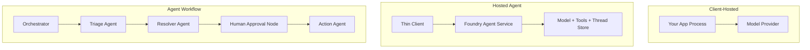
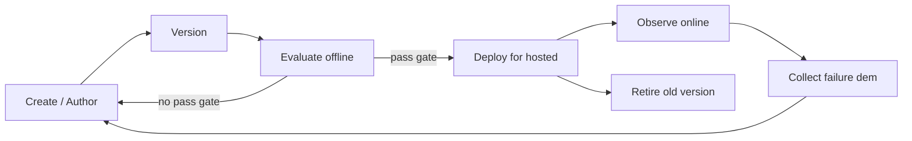
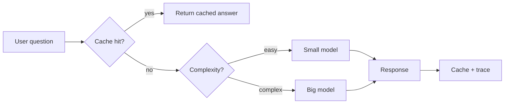
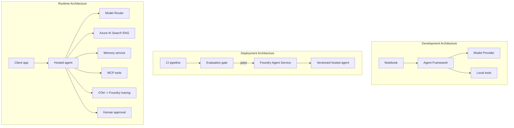

# Deploying Scalable Agents wit Microsoft Foundry


Up to dis point for di course, you don build agents wey dey run on top your laptop, inside notebook, wey `az login` and small environment variables dey drive am. Na di correct way be dat to learn. But e no correct to run agent wey thousands customers dey depend on for 3 a.m. like dat.

Dis lesson na about di gap between "e dey work for my machine" and "e dey work well well, steady and affordable for production." We go close dat gap wit **Microsoft Foundry** and di **Microsoft Foundry Agent Service**, and we go do am by building real customer support agent wey get tools, retrieval, memory, evaluation, and monitoring.

## Introduction

Dis lesson go cover:

- Di difference between **prototype agent** and **deployed agent**, and why di change concern mostly everything *around* di model.
- **Deployment patterns** for agents: client-hosted, service-hosted (Hosted Agents), and workflow-orchestrated.
- Di **agent lifecycle** on Microsoft Foundry — create, version, deploy, evaluate, observe, retire.
- **Scaling strategies**: model routing, caching, concurrency, and stateless design.
- **Observability** wit OpenTelemetry and Foundry tracing.
- **Cost optimisation** through model selection, routing, and evaluation gates.
- **Enterprise considerations**: governance, human approval, and running MCP servers safely for production.

## Learning Goals

After you don finish dis lesson, you go sabi how to:

- Choose di correct deployment pattern for given agent workload.
- Deploy agent to Microsoft Foundry Agent Service so dat e go versioned, governed, and observable.
- Instrument agent for tracing and connect evaluation pipeline wey dey run before every release.
- Apply model routing and caching to keep latency and cost under control at scale.
- Add human approval gate for high-risk actions and join MCP server for production-safe way.

## Prerequisites

Dis lesson dey assume say you don finish earlier lessons and you dey comfortable wit:

- Building agents wit di [Microsoft Agent Framework](../14-microsoft-agent-framework/README.md) (Lesson 14).
- [Tool Use](../04-tool-use/README.md) (Lesson 4) and [Agentic RAG](../05-agentic-rag/README.md) (Lesson 5).
- [Agent Memory](../13-agent-memory/README.md) (Lesson 13) and [Agentic Protocols / MCP](../11-agentic-protocols/README.md) (Lesson 11).
- [Observability and Evaluation](../10-ai-agents-production/README.md) (Lesson 10) — dis lesson build directly on top am.

You go also need:

- An **Azure subscription** and **Microsoft Foundry project** wey get at least one deployed chat model.
- Di **Azure CLI** authenticated (`az login`).
- Python 3.12+ and packages wey dey di repository [`requirements.txt`](../../../requirements.txt).

## From Prototype to Production: Wetin Actually Changes

Prototype agent and production agent dey share di same core loop — reason, call tools, respond. Wetin dey change na everything wey dey wrap dat loop. Di model na maybe 20% of production agent; di other 80% na di operational skeleton.

| Concern | Prototype | Production |
| --- | --- | --- |
| **Hosting** | Runs inside your notebook | Runs as hosted service, wey versioned and rolled out |
| **Identity** | Your `az login` token | Managed identity with scoped RBAC |
| **State** | In-memory, lost when restart | Externalised (thread store, memory service) |
| **Failure** | You go see di traceback | Retries, fallbacks, dead-letter, alerts |
| **Cost** | "Na just few cents" | Tracked per request, routed, cached, budgeted |
| **Quality** | You eyeball di output | Evaluated automatically before every release |
| **Trust** | You dey approve every action | Policy + human-in-the-loop for risky actions |

Make you keep dis table for mind. Every section below na one of dis rows be dat.

## Agent Deployment Patterns

Three patterns dey wey you go dey use, often together.

### 1. Client-Hosted Agents

Di agent object dey inside *your* application process. Your code dey call di model provider directly; di reasoning loop dey run for your service. Na wetin every previous lesson don do be dis.

- **Use am when** you need full control over di loop, custom middleware, or if you want embed di agent inside existing backend.
- **Trade-off**: you responsible for scaling, state, and resilience by yourself.

### 2. Hosted Agents (Foundry Agent Service)

Di agent na *resource* wey dem register for Microsoft Foundry. Foundry dey host di reasoning loop, stores threads, enforces content safety and RBAC, and dey show di agent for Foundry portal. Your app go become thin client wey dey create threads and read responses.

- **Use am when** you want durability, built-in observability, governance, and less operational surface.
- **Trade-off**: less low-level control, but you get managed runtime.

### 3. Agent Workflows

Many agents (and tools) dey join as graph wit explicit control flow — steps wey dey follow one after another, branching, human approval nodes, and durable checkpoints wey fit pause and resume. Dis na Microsoft Agent Framework **Workflows** ability wey dem apply for deployment scale.

- **Use am when** task cover many specialised agents or need approval step ontop.
- **Trade-off**: more moving parts, e need orchestration-level observability.



## The Agent Lifecycle on Microsoft Foundry

Deploy agent no be one-time `push`. Na loop e be, and e resemble software release cycle because na exactly wetin e be.



Di main idea, wey come from [Lesson 10](../10-ai-agents-production/README.md): **offline evaluation na gate, no be afterthought.** New agent version no go ship if e no pass your evaluation thresholds. Online observability go then collect real-world failures come your offline test set. Na di whole loop be dat.

## Scaling Strategies

Scaling agent different from scaling stateless web API, because each request fit trigger many expensive model and tool calls. Four techniques dey carry majority load.

**Stateless request handling.** No keep any per-user state for your process memory. Put conversation threads for Foundry thread store or memory service so any instance fit handle any request. Na dis one dey let you scale horizontally — add instances, no sticky sessions.

**Model routing.** No every request need your most capable (and most expensive) model. Route simple requests — intent classification, short factual answers — go small, fast model, keep big model for real reasoning. Foundry get **Model Router** wey fit do dis for you, or you fit build lightweight classifier yourself. You go build DIY version for lab.

**Response caching.** Plenty support queries na near-duplicates ("how I go reset my password?"). Cache answers for common questions make you no hit di model at all. Even small cache hit rate go reduce cost and latency well well.

**Concurrency and backpressure.** Model providers get rate limits. Limit your concurrency, use retries with exponential backoff, and fail gracefully (queued "we dey on am" response better pass 500 error).



## Observability for Production

You no fit operate wetin you no fit see. As Lesson 10 talk, Microsoft Agent Framework dey emit **OpenTelemetry** traces naturally — every model call, tool invoke, and orchestration step become span. For production, you export spans to Microsoft Foundry (or any OTel-compatible backend) so you fit:

- Trace one customer complaint end-to-end across every model and tool call.
- Watch p50/p95 latency and cost per request over time.
- Alert on error-rate spikes and cost anomalies before your users (or finance team) notice.

```python
from agent_framework.observability import get_tracer

tracer = get_tracer()

with tracer.start_as_current_span("support_request") as span:
    span.set_attribute("customer.tier", "enterprise")
    span.set_attribute("routed.model", "gpt-5-nano")
    # agent execution dey trace automatically inside dis span
```

Attributes like `customer.tier` and `routed.model` na wetin dey turn wall of traces to answerable questions ("enterprise customers dey get routed to small model too many times?").

## Cost Optimisation

Cost for production agents na tokens pass. Three levers, based on how e affect cost:

1. **Right-size di model.** Small model wey pass your evaluation gate usually cheaper pass big model wey also pass. Use evaluation to *prove* say small model good enough no be just choose biggest model for caution.
2. **Route by complexity.** Like before — pay big model price only for requests wey need big-model reasoning.
3. **Cache well well.** Cheapest model call na di one wey you no make at all.

Evaluation gates and cost control na same discipline but you dey see am from two angle: evaluation show *quality floor*, routing and caching dey keep cost near dat floor.

## Enterprise Deployment Considerations

**Governance.** Hosted Agents dey inherit Foundry's RBAC, content safety, and audit logging. Give each agent managed identity wey get minimum privilege e need — read-only access to knowledge base, scoped access to ticketing API, no more.

**Human-in-the-loop.** Some actions too important to automate straight — like refund, delete account, or escalate to legal team. Microsoft Agent Framework support **approval-required** tools: agent propose action, execution pause, human approve or reject, then workflow continue. You don see dis primitive for [Lesson 6](../06-building-trustworthy-agents/README.md); now you go deploy am.

**MCP for production.** [MCP](../11-agentic-protocols/README.md) let your agent use external tools through standard interface. For production, treat every MCP server as untrusted boundary: pin server version, run am wit scoped identity, check outputs, no expose secrets. MCP server na dependency, and dependencies get patched, audited, and rate-limited.



Those three diagrams — development, deployment, runtime — be same agent for three life stages. Lab wey go follow go guide you build am.

## Hands-On Lab: Production-Ready Customer Support Agent

Open [`code_samples/16-python-agent-framework.ipynb`](./code_samples/16-python-agent-framework.ipynb) and work am from start to finish. You go build **Contoso customer support agent** wit every production concern inside:

1. **Tool calling** — check order status and open support tickets.
2. **RAG** — answer policy questions from knowledge base (Azure AI Search, wit in-memory fallback so notebook fit run without Search resource).
3. **Memory** — remember customer across conversation turns.
4. **Model routing** — complexity classifier dey route each request to small or large model.
5. **Response caching** — repeated questions dey serve from cache.
6. **Human approval** — refunds pass threshold go pause for human sign-off.
7. **Evaluation pipeline** — small offline test set dey score agent and act as release gate.
8. **Observability** — OpenTelemetry tracing for every request.

### Walkthrough

Notebook dey arranged so every production concern na self-contained, runnable section. Di heart na routing-plus-caching request handler:

```python
async def handle_support_request(query: str, customer_id: str) -> str:
    # 1. Serve from cache wen we fit.
    cached = response_cache.get(normalize(query))
    if cached:
        return cached

    # 2. Route by complexity to control cost.
    model = "gpt-5-nano" if is_simple(query) else "gpt-5-mini"

    # 3. Run di agent inside one trace span for observability.
    with tracer.start_as_current_span("support_request") as span:
        span.set_attribute("routed.model", model)
        span.set_attribute("customer.id", customer_id)
        response = await support_agent.run(query, model=model)

    # 4. Cache and return.
    response_cache.set(normalize(query), response.text)
    return response.text
```

Di evaluation gate wey dey guard release be dis:

```python
async def evaluation_gate(agent, test_cases, threshold: float = 0.8) -> bool:
    passed = 0
    for case in test_cases:
        result = await agent.run(case["input"])
        if score_response(result.text, case["expected"]) >= 0.8:
            passed += 1
    pass_rate = passed / len(test_cases)
    print(f"Evaluation pass rate: {pass_rate:.0%} (gate: {threshold:.0%})")
    return pass_rate >= threshold  # e go deploy only if gate pass
```

Read every line — notebook keep primitives small so nothing hide behind framework call.

## Validating Deployed Agent wit Smoke Tests

Di evaluation gate above dey run *offline* against your agent object. Once agent deploy as Hosted Agent, you need one more, cheaper check: **di deployed endpoint actually dey answer?**

Deploy "successfully" only mean control plane accept definition — e no mean say agent dey respond. Missing dependency, bad model routing, or expired connection fit make deployment green but no response. **Smoke test** fit catch dat quick quick, every deploy, without full evaluation cost.

Dis repository get ready-to-use smoke-test pipeline wey build on top [AI Smoke Test](https://github.com/marketplace/actions/ai-smoke-test) GitHub Action:

- **Catalog** — [`tests/lesson-16-smoke-tests.json`](../../../tests/lesson-16-smoke-tests.json) get prompts and assertions for Contoso support agent (grounded policy answers, order lookup, on-topic, multi-turn thread continuity). Catalogs for other lessons' agents dey alongside — see [`tests/README.md`](../tests/README.md).
- **Workflow** — [`.github/workflows/smoke-test.yml`](../../../.github/workflows/smoke-test.yml) log in wit Azure OIDC and POST each prompt to agent's Responses endpoint, fail job if any assertion miss.

```yaml
- name: Smoke-test hosted agent
  uses: JFolberth/ai-smoketest@v1
  with:
    project_endpoint: ${{ inputs.project_endpoint }}
    agent_name: ContosoSupportAgent
    tests_file: tests/lesson-16-smoke-tests.json
```


Run am from di **Actions** tab wen your agent don deploy, give am your Foundry project endpoint and agent name. Di federated identity need di **Azure AI User** role for Foundry project scope. Think di layers like pyramid: smoke tests (fit reach and dey respond?) dey run anytime you deploy, offline evaluation (good enough make dem ship?) dey run before promotion, and online evaluation (how e dey perform for real life?) dey run steady steady.

## Knowledge Check

Test how you sabi before you waka go di assignment.

**1. How much of production agent be "di model," and wetin be di rest?**

<details>
<summary>Answer</summary>

Di model na small part of di system — dem dey always talk say na about 20%. Di rest na di operational skeleton: hosting and versioning, identity and RBAC, external state, failure handling, cost tracking, evaluation, and human-in-the-loop controls. To move go production na mostly to build everything *around* di reasoning loop.
</details>

**2. When you go choose Hosted Agent instead of client-hosted agent?**

<details>
<summary>Answer</summary>

When you want managed runtime wey get durability for inside (threads wey dey last and fit resume), observability, content safety, and RBAC, plus you ready to give up small control of di reasoning loop make your operational surface less. Client-hosted good if you want full control on di loop or you dey put di agent inside already existing backend.
</details>

**3. Why e good make scalable agent no keep state for dia own process memory?**

<details>
<summary>Answer</summary>

So any instance go fit handle any request, dis na wetin make horizontal scaling fit work without sticky sessions. Per-user conversation state na thread store or memory service dey keep am. If state dey process memory, you go lose am after restart and you no go fit share load freely.
</details>

**4. Which problem model routing dey solve, and how e connect to evaluation?**

<details>
<summary>Answer</summary>

Routing dey send simple requests to small, cheap, fast model and dey use big model only for serious reasoning, to control latency and cost. E connect to evaluation because evaluation na wetin *show* say small model fit run well for certain request type — routing without evaluation na just guess.
</details>

**5. Wetin be "evaluation gate" and where e dey for lifecycle?**

<details>
<summary>Answer</summary>

Evaluation gate dey run offline test set for new agent version and e no go allow deploy unless pass rate pass threshold. E dey between "version" and "deploy" for lifecycle, e make quality become condition for release instead of wetin you check after you don ship.
</details>

**6. Why MCP server for production suppose be untrusted boundary?**

<details>
<summary>Answer</summary>

Because e be external dependency wey your agent dey call. You suppose pin im version, run am with scoped identity, check im output, rate-limit am, and no ever expose secrets to am — same way wey you dey handle any third-party dependency. Im outputs dey enter your agent reasoning, so to just trust without validation na security risk.
</details>

**7. Which single change dey mostly affect production agent cost, and why?**

<details>
<summary>Answer</summary>

Right-sizing di model — to use di smallest model wey still pass your evaluation gate. Cost na tokens dey control am, and smaller model wey meet quality level almost always cheaper than bigger one. Caching and routing fit reduce cost more, but to choose correct base model get biggest first-order effect.
</details>

**8. Wetin span attributes like `customer.tier` and `routed.model` mean for observability?**

<details>
<summary>Answer</summary>

Dem dey turn raw traces to business questions wey fit get answer. Without attributes na wall of spans you go get; with them you fit ask "enterprise customers dey routed go small model too much?" or "which model dey handle our slowest requests?" Attributes na how you dey slice telemetry by dimensions wey matter for your work.
</details>

## Assignment

Take customer support agent from di lab and make am strong for one specific case: **subscription billing support agent for SaaS company.**

Your submission should:

1. **Replace di tools** with billing-related ones: `get_subscription_status`, `get_invoice`, and `issue_credit` (credits pass $50 need human approval).
2. **Add three RAG documents** about di company refund policy, billing cycle, and cancellation policy.
3. **Extend di evaluation set** to at least eight cases, including at least two wey *supposed* trigger human-approval path, and confirm say your evaluation gate pass or fail well.
4. **Add one cost report**: after you run ten mixed queries through di agent, show how many go small model, how many go large model, and how many come from cache.

Write small paragraph (for markdown cell) explain which model-routing rule you choose and how you go validate am with real traffic. No be only one correct answer — dem go check if you join the production matter well well.

## Summary

For dis lesson you move agent from prototype go production with Microsoft Foundry:

- Di jump go production na mostly about di **operational skeleton** around di model — hosting, identity, state, failure handling, cost, quality, and trust.
- You learn di three **deployment patterns** — client-hosted, Hosted Agents, and Agent Workflows — and when to use dem.
- You follow di **agent lifecycle**, where offline **evaluation act as release gate** and online observability dey feed failures back to di test set.
- You use **scaling strategies** — stateless design, model routing, caching, and bounded concurrency — and connect dem to **cost optimisation**.
- You connect **enterprise controls**: RBAC, human-in-the-loop approval, and production-safe MCP integration.
- You build **production-ready customer support agent** wey join all dis matter together inside runnable code.

Di next lesson go do opposite journey: instead of scaling agents go cloud, you go bring dem *down* to one developer machine and run dem fully local.

## Additional Resources

- <a href="https://learn.microsoft.com/azure/ai-foundry/what-is-azure-ai-foundry" target="_blank">Microsoft Foundry documentation</a>
- <a href="https://learn.microsoft.com/azure/ai-foundry/agents/overview" target="_blank">Microsoft Foundry Agent Service overview</a>
- <a href="https://learn.microsoft.com/en-us/agent-framework/overview/?wt.mc_id=youtube_26688_organicsocial_reactor&pivots=programming-language-python" target="_blank">Microsoft Agent Framework</a>
- <a href="https://learn.microsoft.com/azure/ai-foundry/concepts/model-router" target="_blank">Model Router in Microsoft Foundry</a>
- <a href="https://learn.microsoft.com/azure/search/search-what-is-azure-search" target="_blank">Azure AI Search</a>
- <a href="https://opentelemetry.io/" target="_blank">OpenTelemetry</a>
- <a href="https://github.com/marketplace/actions/ai-smoke-test" target="_blank">AI Smoke Test GitHub Action</a>
- <a href="https://modelcontextprotocol.io/" target="_blank">Model Context Protocol (MCP)</a>

## Previous Lesson

[Building Computer Use Agents (CUA)](../15-browser-use/README.md)

## Next Lesson

[Creating Local AI Agents](../17-creating-local-ai-agents/README.md)

---

<!-- CO-OP TRANSLATOR DISCLAIMER START -->
**Disclaimer**:
Dis document don translate wit AI translation service [Co-op Translator](https://github.com/Azure/co-op-translator). Even tho we dey try make am correct, abeg make you know say automated translation fit get errors or mistakes. Di original document for dia own language na im be di correct source. For important info, make person wey sabi human translation do am. We no go responsible for any misunderstanding or wrong understanding wey fit happen because of dis translation.
<!-- CO-OP TRANSLATOR DISCLAIMER END -->