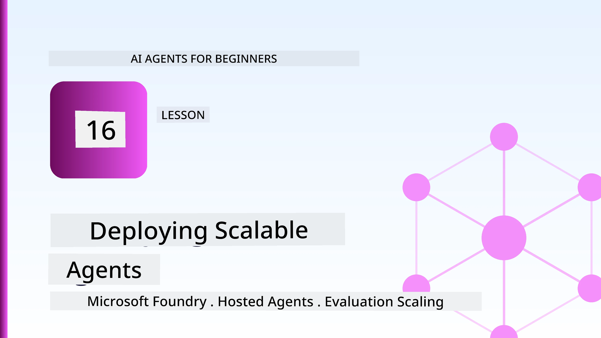
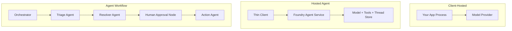
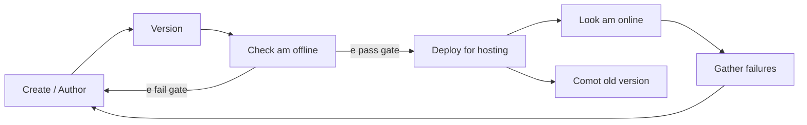
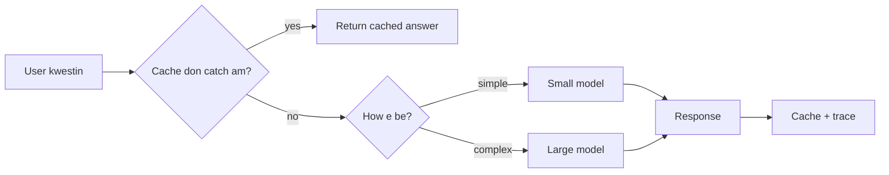
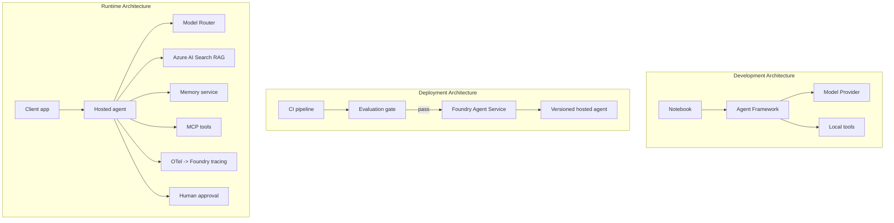

# Deploying Scalable Agents wit Microsoft Foundry



Up to dis point for di course, you don build agents wey dey run for your laptop, inside notebook, wey `az login` and small environment variables dey drive am. Na di correct way to learn dis be. But e no be di correct way to run agent wey thousands customer rely on for 3 a.m.

Dis lesson na about di gap between "e dey work for my machine" and "e dey work well, reliable and cheap for production." We go close dat gap wit **Microsoft Foundry** and di **Microsoft Foundry Agent Service**, and we go build real customer support agent get tools, retrieval, memory, evaluation, and monitoring.

## Introduction

Dis lesson go cover:

- Di difference between **prototype agent** and **deployed agent**, plus why di transition na about everything *around* di model.
- **Deployment patterns** for agents: client-hosted, service-hosted (Hosted Agents), and workflow-orchestrated.
- Di **agent lifecycle** on Microsoft Foundry — create, version, deploy, evaluate, observe, retire.
- **Scaling strategies**: model routing, caching, concurrency, and stateless design.
- **Observability** wit OpenTelemetry and Foundry tracing.
- **Cost optimisation** through model selection, routing, and evaluation gates.
- **Enterprise considerations**: governance, human approval, and running MCP servers safe for production.

## Learning Goals

After you finish dis lesson, you go sabi how to:

- Choose di correct deployment pattern for any agent workload.
- Deploy agent to Microsoft Foundry Agent Service make e get version, governed, and observable.
- Instrument agent for tracing and wire up evaluation pipeline wey dey run before every release.
- Apply model routing and caching make latency and cost dey under control for scale.
- Add human approval gate for high-risk actions and join MCP server wey safe for production.

## Prerequisites

Dis lesson assume say you don finish early lessons and you sabi:

- Build agents wit [Microsoft Agent Framework](../14-microsoft-agent-framework/README.md) (Lesson 14).
- [Tool Use](../04-tool-use/README.md) (Lesson 4) and [Agentic RAG](../05-agentic-rag/README.md) (Lesson 5).
- [Agent Memory](../13-agent-memory/README.md) (Lesson 13) and [Agentic Protocols / MCP](../11-agentic-protocols/README.md) (Lesson 11).
- [Observability and Evaluation](../10-ai-agents-production/README.md) (Lesson 10) — dis lesson dey build directly on top.

You go need:

- **Azure subscription** plus **Microsoft Foundry project** wey get at least one deployed chat model.
- Di **Azure CLI** authenticated (`az login`).
- Python 3.12+ and di packages wey dey di repository [`requirements.txt`](../../../requirements.txt).

## From Prototype to Production: Wetin Actually Dey Change

Prototype agent and production agent get di same core loop — reason, call tools, respond. Wetin change na everything wey dey around dat loop. Di model fit be like 20% of production agent; di other 80% na di operational skeleton.

| Concern | Prototype | Production |
| --- | --- | --- |
| **Hosting** | Runs for your notebook | Runs as hosted service, versioned and rolled out |
| **Identity** | Your `az login` token | Managed identity wit scoped RBAC |
| **State** | In-memory, lost if restart | Externalised (thread store, memory service) |
| **Failure** | You dey see di traceback | Retries, fallbacks, dead-letter, alerts |
| **Cost** | "Na small cents" | Tracked per request, routed, cached, budgeted |
| **Quality** | You dey eyeball di output | Evaluated automatically before every release |
| **Trust** | You dey approve every action | Policy + human-in-the-loop for risky actions |

Remember dis table well-well. Every section below na dat rows matter.

## Agent Deployment Patterns

You get three patterns wey you go dey use, often combined.

### 1. Client-Hosted Agents

Di agent object dey inside *your* application process. Your code dey call di model provider directly; di reasoning loop dey run inside your service. Na wetin every previous lesson don do.

- **Use am when** you want full control of di loop, need custom middleware, or you dey embed di agent inside backend wey don already dey.
- **Trade-off**: you dey responsible for scaling, state, and resilience.

### 2. Hosted Agents (Foundry Agent Service)

Di agent *registered as resource* for Microsoft Foundry. Foundry dey host di reasoning loop, store threads, dey enforce content safety plus RBAC, and di agent dey visible for Foundry portal. Your app become thin client wey dey create threads and dey read responses.

- **Use am when** you want durability, built-in observability, governance, and less operations work.
- **Trade-off**: less low-level control but you get managed runtime.

### 3. Agent Workflows

Multiple agents and tools dey fit join inside graph wit clear control flow — sequential steps, branching, human approval nodes, and checkpoints wey fit pause and resume. Dis na Microsoft Agent Framework **Workflows** wey dem fit deploy at scale.

- **Use am when** one task dey span many specialised agents or need approval step for middle.
- **Trade-off**: more moving parts; require orchestration-level observability.



## The Agent Lifecycle on Microsoft Foundry

Deploying agent no be one-time `push`. E be loop wey resemble software release cycle because na wetin e be.



Key idea, continue from [Lesson 10](../10-ai-agents-production/README.md): **offline evaluation na gate, no be afterthought.** New agent version no fit ship unless e clear your evaluation thresholds. Online observability then dey feed real-world failures back into your offline test set. Na di whole loop.

## Scaling Strategies

Scaling agent no be like scaling stateless web API, because every request fit trigger multiple expensive model and tool calls. Four techniques dey carry most load.

**Stateless request handling.** No keep per-user state for your process memory. Persist conversation threads for Foundry thread store or memory service so any instance fit handle any request. Na dis one dey allow you scale horizontally — add instances, no sticky sessions.

**Model routing.** No every request need your best (and expensive) model. Route simple requests — intent classification, short factual answers — to small, fast model, then reserve big model for true reasoning. Foundry's **Model Router** fit help do dis or you fit build your own lightweight classifier. You go build diy version for lab.

**Response caching.** Plenty support queries be near-duplicates ("how do I reset my password?"). Cache answers for common questions and serve dem without hitting model. Even small cache hit rate fit reduce cost and latency well.

**Concurrency and backpressure.** Model providers get rate limits. Bound your concurrency, use retries wit exponential backoff, and fail gracefully (queued "we dey work on am" better than 500 error).



## Observability in Production

You no fit operate wetin you no fit see. Like Lesson 10 talk, Microsoft Agent Framework dey emit **OpenTelemetry** traces natively — every model call, tool invocation, and orchestration step become span. For production you export these spans go Microsoft Foundry (or any OTel-compatible backend) so you fit:

- Trace single customer complaint end-to-end across every model and tool call.
- Watch p50/p95 latency and cost per request as time dey go.
- Alert on error-rate spike and cost wahala before your users or finance people notice.

```python
from agent_framework.observability import get_tracer

tracer = get_tracer()

with tracer.start_as_current_span("support_request") as span:
    span.set_attribute("customer.tier", "enterprise")
    span.set_attribute("routed.model", "gpt-5-nano")
    # di agent waka dey traced anyhow inside dis span
```

Attributes like `customer.tier` and `routed.model` na wetin turn wall of traces into answerable questions ("enterprise customers dey routed to small model too much?").

## Cost Optimisation

Cost for production agents mainly na tokens. Three levers, in order of impact:

1. **Right-size di model.** Small model wey pass evaluation gate almost always cheaper than big one wey also pass. Use evaluation to *prove* small model good enough no be just pick big model because e safe.
2. **Route by complexity.** Like e talk above — pay big-model cost only for request wey need big-model reasoning.
3. **Cache aggressively.** Cheapest model call na di one wey you no make at all.

Evaluation gates and cost control na same disciplina look from two sides: evaluation dey tell your *quality floor*, routing and caching dey keep cost close to dat floor.

## Enterprise Deployment Considerations

**Governance.** Hosted Agents inherit Foundry's RBAC, content safety, and audit logging. Give each agent managed identity wit least privilege wey e need — read-only access to knowledge base, scoped access to ticketing API, nothing pass dat.

**Human-in-the-loop.** Some actions too big to automate complete — refund, delete account, escalate legal team. Microsoft Agent Framework support **approval-required** tools: agent propose action, execution pause, human approve or reject, then workflow continue. You see primitive for [Lesson 6](../06-building-trustworthy-agents/README.md); here you deploy am.

**MCP for production.** [MCP](../11-agentic-protocols/README.md) allow your agent take external tools through standard interface. For production, treat every MCP server as untrusted boundary: pin server version, run am wit scoped identity, validate outputs, no expose secrets to am. MCP server na dependency, and dependencies get patched, audited, and rate-limited.



Those three diagrams — development, deployment, runtime — na same agent for three stages of im life. Di lab wey dey follow go guide you build am.

## Hands-On Lab: Production-Ready Customer Support Agent

Open [`code_samples/16-python-agent-framework.ipynb`](./code_samples/16-python-agent-framework.ipynb) and waka through am from beginning to end. You go assemble **Contoso customer support agent** wit every production matter inside:

1. **Tool calling** — check order status and open support tickets.
2. **RAG** — answer policy questions from knowledge base (Azure AI Search, wit in-memory fallback so notebook fit run without Search resource).
3. **Memory** — remember customer across turns for conversation.
4. **Model routing** — complexity classifier dey route every request to small or large model.
5. **Response caching** — repeated question dey serve from cache.
6. **Human approval** — refunds above threshold dey pause for human sign-off.
7. **Evaluation pipeline** — small offline test set dey score agent and act as release gate.
8. **Observability** — OpenTelemetry tracing around every request.

### Walkthrough

Notebook arranged so every production matter na self-contained, runnable section. Di heart na routing-plus-caching request handler:

```python
async def handle_support_request(query: str, customer_id: str) -> str:
    # 1. Serve from cache when we fit.
    cached = response_cache.get(normalize(query))
    if cached:
        return cached

    # 2. Route by complexity to control cost.
    model = "gpt-5-nano" if is_simple(query) else "gpt-5-mini"

    # 3. Run the agent inside a trace span make e dey observable.
    with tracer.start_as_current_span("support_request") as span:
        span.set_attribute("routed.model", model)
        span.set_attribute("customer.id", customer_id)
        response = await support_agent.run(query, model=model)

    # 4. Cache am and return.
    response_cache.set(normalize(query), response.text)
    return response.text
```

Di evaluation gate wey dey guard release look like dis:

```python
async def evaluation_gate(agent, test_cases, threshold: float = 0.8) -> bool:
    passed = 0
    for case in test_cases:
        result = await agent.run(case["input"])
        if score_response(result.text, case["expected"]) >= 0.8:
            passed += 1
    pass_rate = passed / len(test_cases)
    print(f"Evaluation pass rate: {pass_rate:.0%} (gate: {threshold:.0%})")
    return pass_rate >= threshold  # make you deploy if gate pass only
```

Read every line — notebook keep primitives small make nothing hide behind framework call.

## Validating Deployed Agent wit Smoke Tests

Di evaluation gate wey dey top dey run *offline* against your agent object. After agent deploy as Hosted Agent, you still need one more, even cheaper check: **di deployed endpoint really dey answer?**

Deploying "successfully" only mean say control plane accept di definition — no mean say agent dey respond. Missing dependency, bad model routing, or expired connection fit leave green deployment wey no return anything. **Smoke test** go catch am quick, every deploy, without di cost of full evaluation.

Dis repository get ready-to-use smoke-test pipeline wey dem build on top of di [AI Smoke Test](https://github.com/marketplace/actions/ai-smoke-test) GitHub Action:

- **Catalog** — [`tests/lesson-16-smoke-tests.json`](../../../tests/lesson-16-smoke-tests.json) get prompts and assertions for Contoso support agent (grounded policy answers, order lookup, stay on topic, multi-turn thread continuity). Catalogs for other lessons' agents dey near am — check [`tests/README.md`](../tests/README.md).
- **Workflow** — [`.github/workflows/smoke-test.yml`](../../../.github/workflows/smoke-test.yml) dey login with Azure OIDC and POST every prompt to agent Responses endpoint, fail di job on any assertion miss.

```yaml
- name: Smoke-test hosted agent
  uses: JFolberth/ai-smoketest@v1
  with:
    project_endpoint: ${{ inputs.project_endpoint }}
    agent_name: ContosoSupportAgent
    tests_file: tests/lesson-16-smoke-tests.json
```


Run am from di **Actions** tab wen your agent don deploy, supply your Foundry project endpoint and agent name. Di federated identity need di **Azure AI User** role for Foundry project scope. Make you reason di layers like pyramid: smoke tests (fit reach and respond?) dey run for every deploy, offline evaluation (e good enough to ship?) dey run before promotion, and online evaluation (how e dey perform for real world?) dey run steady steady.

## Knowledge Check

Test your understanding before you move go di assignment.

**1. Roughly how much of a production agent na "di model," and wetin be di rest?**

<details>
<summary>Answer</summary>

Di model na small part of di system — e dey usually around 20%. Di rest na di operational skeleton: hosting and versioning, identity and RBAC, externalised state, how to handle failure, cost tracking, evaluation, and human-in-the-loop controls. To move go production na mostly about to build everything *around* di reasoning loop.
</details>

**2. When you go choose Hosted Agent instead of client-hosted agent?**

<details>
<summary>Answer</summary>

When you want managed runtime wey get built-in durability (threads wey fit persist and fit resume), observability, content safety, and RBAC, and you fit accept say you no get full control over di reasoning loop so that operational surface go less. Client-hosted better when you need full control over di loop or you dey put di agent inside existing backend.
</details>

**3. Why e dey important say scalable agent no get state for im own process memory?**

<details>
<summary>Answer</summary>

So any instance fit handle any request, dis na wetin make horizontal scaling possible without sticky sessions. Per-user conversation state go external thread store or memory service. If state dey inside process memory, you go lost am on restart and you no fit distribute load freely.
</details>

**4. Which problem model routing dey solve, and how e relate to evaluation?**

<details>
<summary>Answer</summary>

Routing dey send simple requests to small, cheap, fast model and dey reserve big model for real reason work, e dey control both latency and cost. E relate to evaluation because na evaluation go *show* say small model good enough for some class of requests — routing without evaluation na just guess work.
</details>

**5. Wetin be "evaluation gate" and where e dey for lifecycle?**

<details>
<summary>Answer</summary>

Evaluation gate run offline test set against new agent version and e no allow deployment unless pass rate pass threshold. E dey between "version" and "deploy" for lifecycle, e make quality na precondition for release no be tins to check after shipping.
</details>

**6. Why MCP server for production suppose dey treated as untrusted boundary?**

<details>
<summary>Answer</summary>

Because na external dependency your agent dey call. You suppose pin im version, run am with scoped identity, validate im outputs, rate-limit am, and no ever expose secrets to am — same discipline you dey use for any third-party dependency. Di outputs go enter your agent reasoning, so if you no validate am, e dey security risk.
</details>

**7. Which one single change dey usually get di biggest impact on production agent cost, and why?**

<details>
<summary>Answer</summary>

Right-sizing di model — to use di smallest model wey still fit pass your evaluation gate. Cost dey mainly from tokens, and smaller model wey meet quality bar usually cheaper pass big model. Caching and routing fit reduce cost more, but to choose correct base model get di biggest first-order effect.
</details>

**8. Wetin span attributes like `customer.tier` and `routed.model` dey play for observability?**

<details>
<summary>Answer</summary>

Dem dey turn raw traces into business questions wey person fit answer. Without attributes, na just wall of spans you get; with dem, you fit ask "enterprise customers dey routed to small model too much?" or "which model dey handle our slowest requests?" Attributes na how you fit slice telemetry by di important dimensions for your operation.
</details>

## Assignment

Take di customer support agent from di lab and make am strong for one exact scenario: **subscription billing support agent for SaaS company.**

Your submission suppose:

1. **Replace di tools** with billing-relevant ones: `get_subscription_status`, `get_invoice`, and `issue_credit` (credits over $50 need human approval).
2. **Add three RAG documents** wey cover di company refund policy, billing cycle, and cancellation policy.
3. **Extend di evaluation set** to at least eight cases, including at least two wey *suppose* trigger human-approval path, and confirm your evaluation gate dey pass or fail correctly.
4. **Add one cost report**: after you run ten different queries through di agent, print how many go small model, how many go large model, and how many dem serve from cache.

Write short paragraph (for markdown cell) to explain which model-routing rule you choose and how you go validate am with real traffic. No be only one correct answer — dem dey assess if production concerns line up well well.

## Summary

For dis lesson, you don move agent from prototype to production with Microsoft Foundry:

- Di jump to production na mostly about di **operational skeleton** around di model — hosting, identity, state, failure handling, cost, quality, and trust.
- You learn di three **deployment patterns** — client-hosted, Hosted Agents, and Agent Workflows — and when each one dey fit.
- You waka di **agent lifecycle**, where offline **evaluation dey act as release gate** and online observability dey feed failures back into di test set.
- You apply **scaling strategies** — stateless design, model routing, caching, and bounded concurrency — and connect dem to **cost optimisation**.
- You wire in **enterprise controls**: RBAC, human-in-the-loop approval, and production-safe MCP integration.
- You build **production-ready customer support agent** wey connect all dis concerns together for runnable code.

Di next lesson go do opposite journey: instead of you go scale agents up into di cloud, you go bring dem *down* onto one developer machine and run dem fully locally.

## Additional Resources

- <a href="https://learn.microsoft.com/azure/ai-foundry/what-is-azure-ai-foundry" target="_blank">Microsoft Foundry documentation</a>
- <a href="https://learn.microsoft.com/azure/ai-foundry/agents/overview" target="_blank">Microsoft Foundry Agent Service overview</a>
- <a href="https://learn.microsoft.com/en-us/agent-framework/overview/?wt.mc_id=youtube_26688_organicsocial_reactor&pivots=programming-language-python" target="_blank">Microsoft Agent Framework</a>
- <a href="https://learn.microsoft.com/azure/ai-foundry/concepts/model-router" target="_blank">Model Router in Microsoft Foundry</a>
- <a href="https://learn.microsoft.com/azure/search/search-what-is-azure-search" target="_blank">Azure AI Search</a>
- <a href="https://opentelemetry.io/" target="_blank">OpenTelemetry</a>
- <a href="https://github.com/marketplace/actions/ai-smoke-test" target="_blank">AI Smoke Test GitHub Action</a>
- <a href="https://modelcontextprotocol.io/" target="_blank">Model Context Protocol (MCP)</a>

## Previous Lesson

[Building Computer Use Agents (CUA)](../15-browser-use/README.md)

## Next Lesson

[Creating Local AI Agents](../17-creating-local-ai-agents/README.md)

---

<!-- CO-OP TRANSLATOR DISCLAIMER START -->
**Disclaimer**:
Dis document don translate wit AI translation service [Co-op Translator](https://github.com/Azure/co-op-translator). Even tho we dey try make am correct, abeg make you know say automated translation fit get errors or mistakes. Di original document for dia own language na im be di correct source. For important info, make person wey sabi human translation do am. We no go responsible for any misunderstanding or wrong understanding wey fit happen because of dis translation.
<!-- CO-OP TRANSLATOR DISCLAIMER END -->