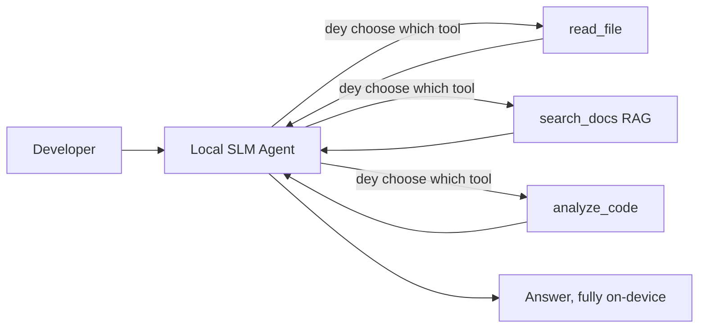
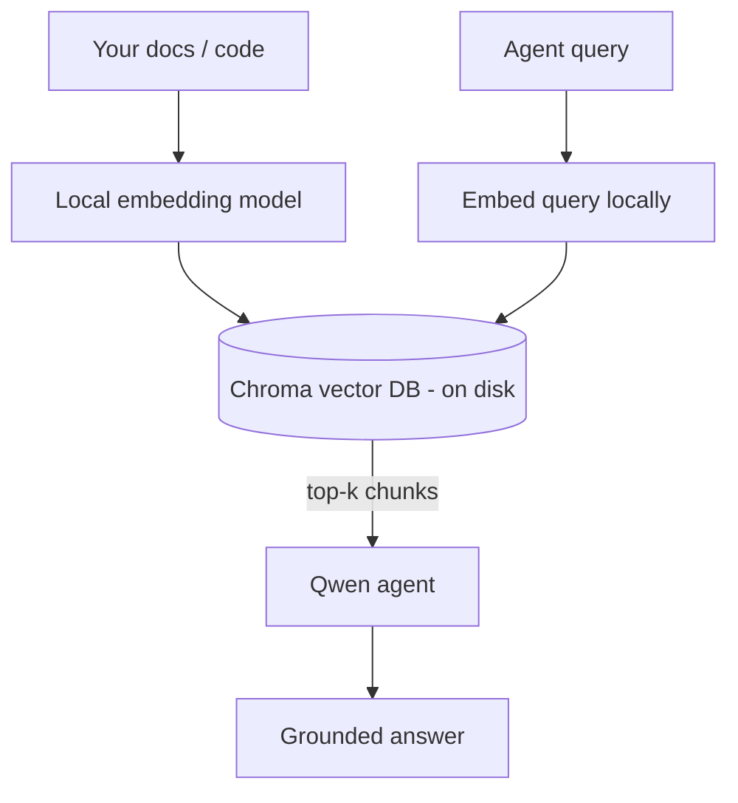
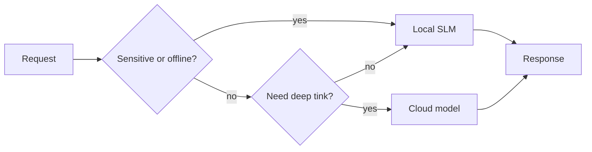

# How To Create Local AI Agents Wit Microsoft Foundry Local and Qwen


Di previous lesson scale all di agents *up* go cloud. Dis one dey bring dem *down* go single machine. By di time you finish, you go get one working engineering assistant wey go reason, call tools, read your files, and search your documentation — **without make one single cloud inference call.**

Why you go want am? Three reasons wey dey come up anyhow for real engineering work:

- **Privacy.** Di code and documents no go comot from di machine. No prompt, no snippet, no customer data no go cross di network boundary.
- **Cost.** Local inference no get per-token charge. You fit dey try all day for just di price of electricity.
- **Offline.** For plane, for secure place, or during power outage, di agent still go work.

Di problem be say you dey exchange one frontier cloud model for **Small Language Model (SLM)** wey dey run on your CPU, GPU, or NPU. Dis lesson na about to build agents wey go *good* inside dat kind limit instead of to pretend say di limit no dey.

## Introduction

Dis lesson go cover:

- **Small Language Models (SLMs)** — wetin dem be, where dem good, and where dem no good.
- **Microsoft Foundry Local** — one runtime wey dey download and serve models for inside your device through **OpenAI-compatible API**.
- **Qwen function-calling models** — SLMs wey sabi produce tool calls well well, na wetin make local *agents* (no be only local chat) possible.
- **Local tools, local RAG, and local MCP** — give agent ability without cloud.
- **Hybrid patterns** — when to keep tins local and when to use cloud.

## Learning Goals

After you finish dis lesson, you go sabi how to:

- Explain di trade-offs of SLMs and choose correct local-agent cases.
- Serve Qwen model locally wit Foundry Local and connect am via OpenAI-compatible endpoint.
- Build tool-calling agent wey dey run fully on your workstation.
- Add local RAG over your own documents using local vector database (Chroma).
- Connect agent to local MCP server and reason about hybrid local/cloud designs.

## Prerequisites

Dis lesson assume say you don finish di earlier lessons and you sabi:

- [Tool Use](../04-tool-use/README.md) (Lesson 4) and [Agentic RAG](../05-agentic-rag/README.md) (Lesson 5).
- [Agentic Protocols / MCP](../11-agentic-protocols/README.md) (Lesson 11).
- The [Microsoft Agent Framework](../14-microsoft-agent-framework/README.md) (Lesson 14).

You go also need:

- Developer workstation. **8 GB RAM na minimum wey make sense**; 16 GB+ better. GPU or NPU go help but e no be must.
- **Microsoft Foundry Local** installed (check setup section below).
- Python 3.12+ and packages for this repo [`requirements.txt`](../../../requirements.txt), plus `foundry-local-sdk`, `openai`, and `chromadb`.

## Small Language Models: Di Correct Tool for Local Work

One frontier cloud model get hundreds of billions parameters and e get one big data centre behind am. SLM get small billion parameters and e for fit your laptop RAM. Dis difference dey set correct expectation.

**SLMs good for:**

- Structured, bounded tasks — classification, extraction, summarisation of known document.
- **Tool calling** — sabi which function to call and with which arguments.
- Quick, cheap, private iteration on your own data.

**SLMs no too strong for:**

- Open-ended, multi-hop reasoning for big context.
- Broad world knowledge (dem no sabi plenty, and dem dey forget more).

Di best way for local agents na: **make SLM dey control, tools dey carry heavy work.** Di model no need to *know* your codebase — e need sabi when to call `read_file` and `search_docs`. Na wetin SLM good for.



## Microsoft Foundry Local

**Microsoft Foundry Local** na lightweight runtime wey dey download, manage, and serve models fully on your machine. Wetin important for us na say e get **OpenAI-compatible HTTP endpoint** — dat one mean OpenAI SDK and Microsoft Agent Framework's OpenAI client fit work for am by just changing `base_url`. Wetin you don learn on how to build agents, e fit work same way; na only di endpoint go move from cloud go `localhost`.

Foundry Local go select di best build of model for your hardware automatically — CPU build, CUDA/GPU build, or NPU build — no need to hand-optimize for each machine.

### Setup

Install Foundry Local (check [documentation](https://learn.microsoft.com/azure/ai-foundry/foundry-local/) for your OS), then confirm say e dey work:

```bash
# Install (for example; follow di docs for your platform)
winget install Microsoft.FoundryLocal      # Windows
# brew install microsoft/foundrylocal/foundrylocal   # macOS

# Download an run one Qwen model, den start di local service
foundry model run qwen2.5-7b-instruct
foundry service status
```

Once di service dey run you get local OpenAI-compatible endpoint (normally `http://localhost:PORT/v1`). Di notebook dey use `foundry-local-sdk` to find di endpoint automatically, so you no need hard-code di port.

## Qwen Function Calling: Why E Dey Important

Agent na agent only if e fit call tools. Plenti SLMs fit chat but dem no fit produce reliable, correct tool calls. **Qwen** models train to do function calling well and dem dey produce correct tool call structures steady — na wetin turn local chat model to local *agent*.

Di flow na di normal tool-calling loop wey you sabi, but e dey run for inside device:


## Local RAG

Documentation search na where local agents show their work. Instead of hope say di SLM don memorize your framework docs, you go embed docs for **local vector database** and make agent retrieve correct parts anytime e need am.

We dey use **Chroma**, one embedded vector store wey dey run inside process with no server. Di pipeline na local: local embedding model → local vectors → local retrieval → local SLM.



Dis na di same Agentic RAG pattern from Lesson 5 — only difference na say every part dey run on your machine.

## Local MCP Servers

[MCP](../11-agentic-protocols/README.md) no be cloud service, na transport. MCP server fit run as local process on `stdio`, expose tools to your agent with standard protocol. E make you fit reuse di plenti MCP servers — filesystem access, git operations, database queries — fully offline.

Security no be like cloud, but e no mean say e no get security: local MCP server dey run with your user permission, so limit wetin e fit touch (for example, only project directory, no be your whole home folder) and always check outputs before make use.

## Hybrid Cloud-and-Local Patterns

Local first no mean na only local. Mature systems go select path based on sensitivity and difficulty:

| Situation | Where e go run |
| --- | --- |
| Sensitive code/data or offline | **Local SLM** |
| Simple, bounded task | **Local SLM** (cheap, fast) |
| Hard multi-hop reasoning on non-sensitive data | **Cloud model** |
| Everything during outage | **Local SLM** (graceful degradation) |

Dis dey similar to **model routing** idea from Lesson 16 — only difference na one of di "models" na your own machine. Good design go fallback to local when cloud no dey, so agent no go fail but e go just reduce quality small.



## Hands-On Lab: Local Engineering Assistant

Open [`code_samples/17-local-agent-foundry-local.ipynb`](./code_samples/17-local-agent-foundry-local.ipynb) and follow am. You go build **local engineering assistant** wey go run fully on your workstation and e fit:

1. **Call tools** — via Qwen function calling through Foundry Local.
2. **Perform local file operations** — list and read project directory files.
3. **Analyse code** — report basic metrics on source file.
4. **Search documentation** — local RAG over docs folder with Chroma.
5. **Use MCP** — connect to local MCP server (skip gracefully if no server configured).

No cloud inference dey anywhere.

### Walkthrough

Agent connect to Foundry Local via OpenAI-compatible endpoint, so di agent code close to cloud lesson code — na client part change:

```python
from foundry_local import FoundryLocalManager
from openai import OpenAI

# Foundry Local sabi/find di model and e give us local endpoint.
manager = FoundryLocalManager(\"qwen2.5-7b-instruct\")
client = OpenAI(base_url=manager.endpoint, api_key=manager.api_key)  # api_key na local placeholder.
```

Tools na normal Python functions wey scoped to project directory:

```python
def read_file(path: str) -> str:
    \"\"\"Read a file, but only inside the sandboxed project directory.\"\"\"
    full = (PROJECT_ROOT / path).resolve()
    if PROJECT_ROOT not in full.parents and full != PROJECT_ROOT:
        return \"Access denied: path is outside the project directory.\"
    return full.read_text(encoding=\"utf-8\")
```

Remember sandbox check — even for local, tool wey read random path fit cause wahala. Di notebook keep every tool scoped to one project root.

## Knowledge Check

Test yourself before you go to assignment.

**1. Give me two real reasons to run agent locally instead of for cloud.**

<details>
<summary>Answer</summary>

Any two: **privacy** (code and data no comot machine), **cost** (no charge per-token), and **offline** (work with no network — for plane, for secure place, or during outage). Regulatory rules wey forbid sending data outside device dey push privacy reason.
</details>

**2. How dem recommend to divide work between SLM and tools for local agent, and why?**

<details>
<summary>Answer</summary>

Make SLM **orchestrate** (decide tool to call with which args) and tools do **heavy lifting** (read files, find docs, compute). SLM strong for bounded decision like tool selection but weak for broad knowledge and long reasoning. Leaning on tools na plus for dem.
</details>

**3. Wetin make you fit reuse cloud agent code with Foundry Local?**

<details>
<summary>Answer</summary>

Foundry Local get **OpenAI-compatible HTTP endpoint**. OpenAI SDK and Agent Framework client fit work with am by only changing `base_url` (plus local API key). Everything else remain di same.
</details>

**4. Why you choose Qwen function-calling model and no any SLM?**

<details>
<summary>Answer</summary>

Because agent must produce reliable, well-formed **tool calls**. Many SLMs fit chat but dem produce bad or inconsistent tool calls. Qwen models train for function calling and produce steady tool calls, na wetin turn local chat model to real local agent.
</details>

**5. For local RAG pipeline, which parts run for machine?**

<details>
<summary>Answer</summary>

All of dem: embedding model, vector database (Chroma on disk), retrieval step, and SLM. Documents embed locally, store locally, retrieve locally, reason locally — no cloud touch anything.
</details>

**6. Local MCP server dey run for your machine. E mean say e automatic safe? Wetin you still go do to stay safe?**

<details>
<summary>Answer</summary>

No. Local MCP server dey run with your user permission, so e fit touch anything you fit touch. Limit am to wetin e needs (like one project folder instead of whole home folder) and always test outputs before use.
</details>

**7. Talk one correct hybrid routing rule wey include local model?**

<details>
<summary>Answer</summary>

Route sensitive/offline requests go local SLM; simple bounded tasks go local SLM for speed and cost; hard multi-hop reasoning for non-sensitive data go cloud model; fallback to local SLM if cloud no dey so agent no fail but reduce quality. Na model routing (Lesson 16) wit local machine as one of di models.
</details>

**8. Na how many minimum RAM wey dey realistic to run local agent for dis lesson, and wetin more RAM fit give you?**

<details>
<summary>Answer</summary>

Around **8 GB** minimum realistic; 16 GB+ comfortable. More RAM fit run bigger, better models and keep more context inside memory. GPU or NPU fit speed inference but e no be must — Foundry Local go pick CPU build if no accelerator dey.
</details>

## Assignment

Extend local engineering assistant to be **local documentation reviewer** for small project wey you choose (fit use one of dis repo lesson folders).

Your submission suppose:

1. **Index real docs/code folder** into Chroma (at least five files).
2. **Add `find_todos` tool** wey go scan project for `TODO`/`FIXME` comments and return dem with file and line number — also keep sandbox check same as `read_file`.

3. **Ask di agent three questions** wey go make am join tools: one pure RAG question, one wey need to read one specific file, plus one wey need to find TODOs.
4. **Measure am**: time each of di three answers dem and write dem down for one markdown cell. Talk whether di latency dey okay for di workflow wey you wan use.

Den write one short paragraph about **wetin you go move go cloud and wetin you go keep local** for dis reviewer, plus why. Dem go check if di local parts tie together well and if your hybrid reasoning correct — no be about model quality.

## Summary

For dis lesson you build one agent wey dey run fully for your own machine:

- **SLMs** dey trade wide reach for privacy, cost, plus offline work — and dem dey shine when dem **orchestrate tools** instead of carry all di knowledge their self.
- **Foundry Local** dey serve models for device inside one **OpenAI-compatible endpoint**, so your cloud agent code fit transfer with only one-line change.
- **Qwen function-calling models** dey make local tool calling sure — and as a result local *agents* — possible.
- **Local RAG** (Chroma) plus **local MCP** dey give di agent power without to leave di machine.
- **Hybrid patterns** dey let you route based on sensitivity and difficulty, with local as one correct fallback.

Dis one complete di deployment journey: Lesson 16 scale agents up go Microsoft Foundry, and dis lesson scale am down for one single workstation. Di next lesson go show how to keep deployed agents safe.

## Additional Resources

- <a href="https://learn.microsoft.com/azure/ai-foundry/foundry-local/" target="_blank">Microsoft Foundry Local documentation</a>
- <a href="https://learn.microsoft.com/azure/ai-foundry/what-is-azure-ai-foundry" target="_blank">Microsoft Foundry documentation</a>
- <a href="https://learn.microsoft.com/en-us/agent-framework/overview/?wt.mc_id=youtube_26688_organicsocial_reactor&pivots=programming-language-python" target="_blank">Microsoft Agent Framework</a>
- <a href="https://qwen.readthedocs.io/en/latest/framework/function_call.html" target="_blank">Qwen function calling documentation</a>
- <a href="https://modelcontextprotocol.io/" target="_blank">Model Context Protocol (MCP)</a>
- <a href="https://docs.trychroma.com/" target="_blank">Chroma vector database</a>

## Previous Lesson

[Deploying Scalable Agents](../16-deploying-scalable-agents/README.md)

## Next Lesson

[Securing AI Agents](../18-securing-ai-agents/README.md)

---

<!-- CO-OP TRANSLATOR DISCLAIMER START -->
**Disclaimer**:
Dis document don translate wit AI translation service [Co-op Translator](https://github.com/Azure/co-op-translator). Even tho we dey try make am correct, abeg make you know say automated translation fit get errors or mistakes. Di original document for dia own language na im be di correct source. For important info, make person wey sabi human translation do am. We no go responsible for any misunderstanding or wrong understanding wey fit happen because of dis translation.
<!-- CO-OP TRANSLATOR DISCLAIMER END -->