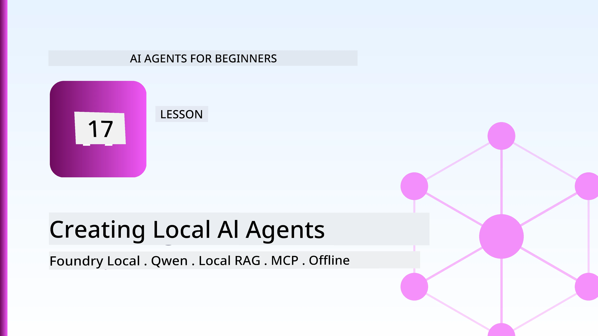
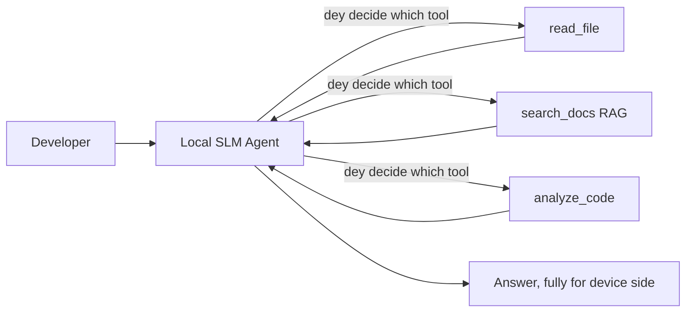
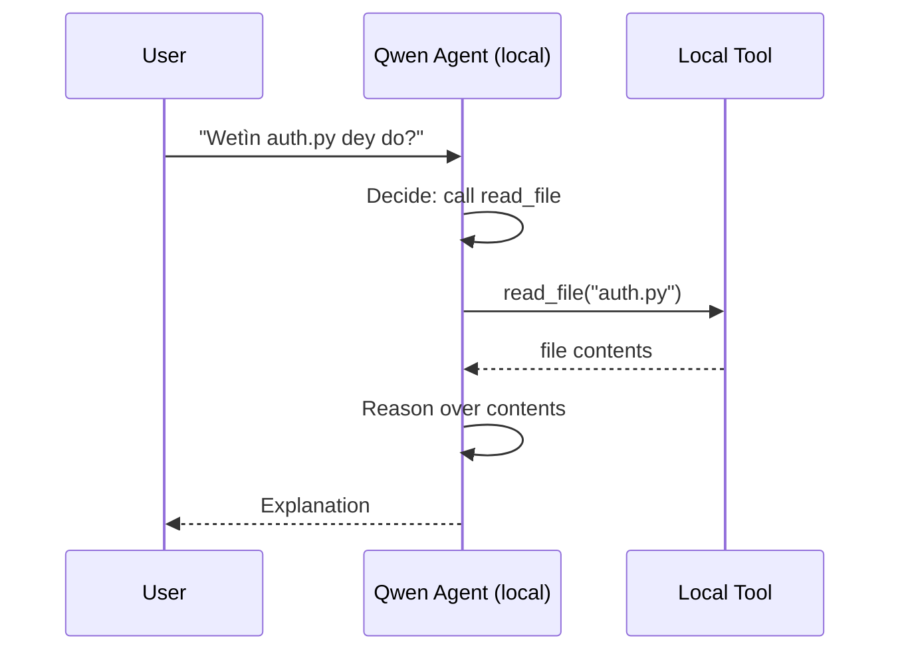
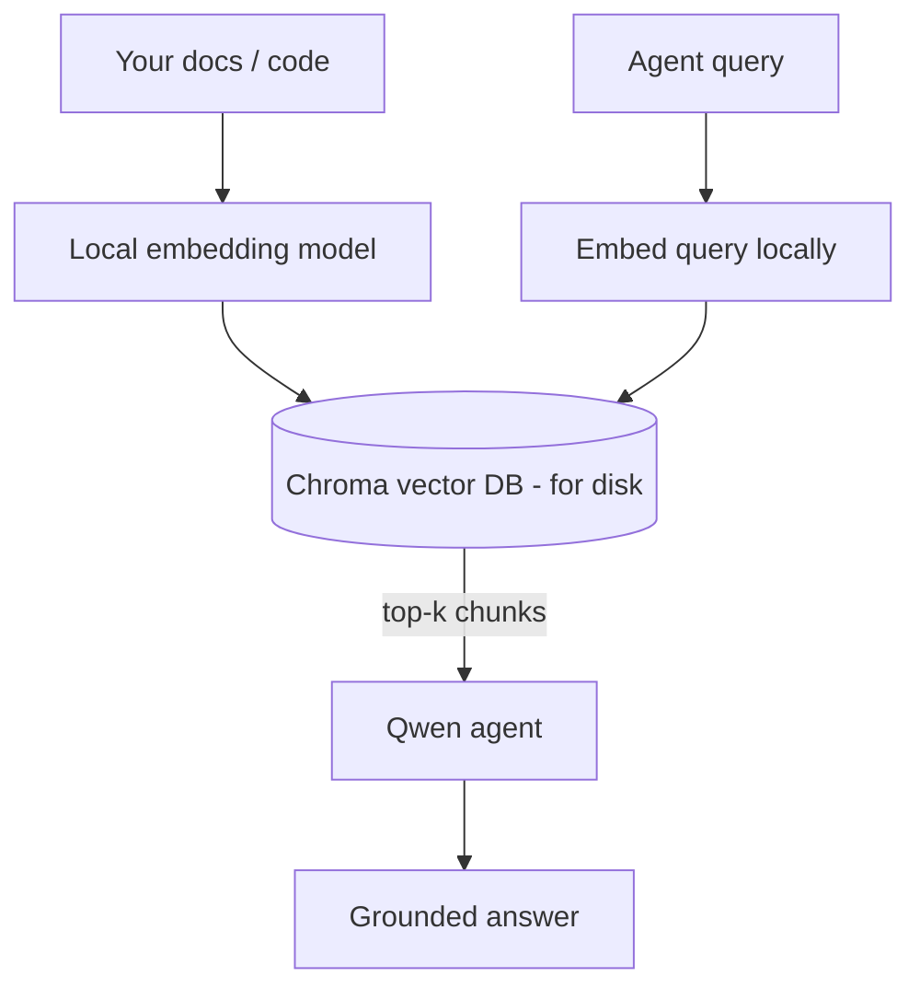
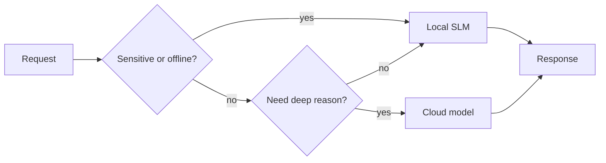

# Di Local AI Agents Wey Dem Dey Use Microsoft Foundry Local and Qwen



Di last lesson scale agents *up* go cloud. Dis one na to bring dem *down* for one machine. By di end, you go get beta engineering assistant weh sabi reason, fit call tools, read your files, and fit search your documents — **without any cloud inference call.**

Why you go want do dat? Na three reason dem dey for real engineering work:

- **Privacy.** Di code and documents no go comot for di machine. No prompt, no snippet, no customer data go cross network boundary.
- **Cost.** Local inference no get per-token bill. You fit dey try all day just for di price of electricity.
- **Offline.** For plane, secure place, or during outage, di agent still dey work.

Di thing be say you dey trade beta cloud model for **Small Language Model (SLM)** wey go run for your CPU, GPU, or NPU. Dis lesson na how to build agents wey *good* for dat kain limit, no be to pretend say di limit no dey.

## Introduction

Dis lesson go cover:

- **Small Language Models (SLMs)** — wetin dem be, where dem dey shine, and where dem no dey shine.
- **Microsoft Foundry Local** — runtime wey go download and serve models on top device through an **OpenAI-compatible API**.
- **Qwen function-calling models** — SLMs wey sabi produce tool calls well, wey na im make local *agents* (no be only local chat) possible.
- **Local tools, local RAG, and local MCP** — wey give di agent power without cloud.
- **Hybrid patterns** — how and wen to keep things local and wen to use cloud.

## Learning Goals

After you finish dis lesson, you go sabi how to:

- Explain di trade-offs of SLMs and choose beta local-agent use cases.
- Serve Qwen model locally with Foundry Local and connect am through OpenAI-compatible endpoint.
- Build tool-calling agent wey go run complete for your workstation.
- Add local RAG for your own documents using local vector database (Chroma).
- Connect di agent to local MCP server and reason about hybrid local/cloud designs.

## Prerequisites

Dis lesson assume say you don finish previous lessons and you dey comfortable with:

- [Tool Use](../04-tool-use/README.md) (Lesson 4) and [Agentic RAG](../05-agentic-rag/README.md) (Lesson 5).
- [Agentic Protocols / MCP](../11-agentic-protocols/README.md) (Lesson 11).
- The [Microsoft Agent Framework](../14-microsoft-agent-framework/README.md) (Lesson 14).

You also need:

- Developer workstation. **8 GB RAM na realistic minimum**; 16 GB+ beta. GPU or NPU go help but no be must.
- **Microsoft Foundry Local** wey you don install (see setup section below).
- Python 3.12+ and packages wey dey inside repo [`requirements.txt`](../../../requirements.txt), plus `foundry-local-sdk`, `openai`, and `chromadb` for dis lesson.

## Small Language Models: Di Beta Tool for Local Work

Frontier cloud model get hundreds of billions parameters and data centre behind am. SLM get few billions parameters and e suppose fit your laptop RAM. Dis kain difference go tell you wetin you fit expect.

**SLMs good for:**

- Structured, bounded tasks — classification, extraction, summarisation of known document.
- **Tool calling** — sabi which function to call and with which arguments.
- Fast, cheap, private iteration on your own data.

**SLMs weak for:**

- Open-ended, multi-hop reasoning across big context.
- Wide world knowledge (dem never see plenty, dem dey forget).

The best plan for local agents be: **make SLM orchestrate, make tools do heavy work.** Di model no need sabi your codebase — e need sabi wen to call `read_file` and `search_docs`. Dis one na im make SLM strong.



## Microsoft Foundry Local

**Microsoft Foundry Local** na small runtime wey go download, manage, and serve models complete on your machine. Di main beta thing for us na say e get **OpenAI-compatible HTTP endpoint** — dat one mean say OpenAI SDK and Microsoft Agent Framework's OpenAI client fit use am by just changing `base_url`. Everything wey you learn about agents go straight, only di endpoint shift from cloud to `localhost`.

Foundry Local go pick di best build for your hardware automatically — CPU build, CUDA/GPU build, or NPU build — so you no need hand-optimize per machine.

### Setup

Install Foundry Local (follow di [documentation](https://learn.microsoft.com/azure/ai-foundry/foundry-local/) for your OS), then confirm say e work:

```bash
# Install (example; follow the docs for your platform)
winget install Microsoft.FoundryLocal      # Windows
# brew install microsoft/foundrylocal/foundrylocal   # macOS

# Download and run Qwen model, den start di local service
foundry model run qwen2.5-7b-instruct
foundry service status
```

After di service start, you get local OpenAI-compatible endpoint (usually `http://localhost:PORT/v1`). Notebook dey use `foundry-local-sdk` to find endpoint automatically, so you no go hard-code port.

## Qwen Function Calling: Why E Important

Agent na agent only if e fit call tools. Plenty SLM fit chat but dem dey produce wrong, bad tool calls. **Qwen** models dem train to call functions well, produce correct tool-call structure consistently — dat na im turn local chat model to local *agent*.

Di flow na usual tool-calling loop wey you sabi, but e dey run on-device:



## Local RAG

Documentation search na where local agents dey show beta work. Instead make SLM try memorize your framework docs, you embed docs inside **local vector database** and let agent find relevant parts when e need am.

We dey use **Chroma**, embedded vector store wey run inside process with no server. Pipeline dey complete local: local embedding model → local vectors → local retrieval → local SLM.



Na di same Agentic RAG pattern from Lesson 5 — di only difference be say everything run for your machine.

## Local MCP Servers

[MCP](../11-agentic-protocols/README.md) na transport, no be cloud service. MCP server fit run as local process on `stdio`, expose tools to your agent with standard protocol. You fit reuse lots MCP servers — filesystem access, git operations, database queries — all offline.

Security posture different from cloud, but e still dey: local MCP server still run with your user permissions, so limit wetin e fit access (project directory, no be whole home folder) and always check im outputs well.

## Hybrid Cloud-and-Local Patterns

Local-first no mean na only local. Mature systems go route by sensitivity and difficulty:

| Situation | Where e dey run |
| --- | --- |
| Sensitive code/data or offline | **Local SLM** |
| Simple, bounded task | **Local SLM** (cheap, fast) |
| Hard multi-hop reasoning on non-sensitive data | **Cloud model** |
| Everything during outage | **Local SLM** (gentle degradation) |

Dis mirror **model routing** idea from Lesson 16 — only difference, one "model" na your own machine now. Robust design go fallback to local if cloud no dey, so agent go degrade soft-soft, no go fail sharp-sharp.



## Hands-On Lab: Local Engineering Assistant

Open [`code_samples/17-local-agent-foundry-local.ipynb`](./code_samples/17-local-agent-foundry-local.ipynb) and work through am. You go build **local engineering assistant** wey go run total for your workstation and fit:

1. **Call tools** — through Qwen function calling with Foundry Local.
2. **Do local file operations** — list and read files for project directory.
3. **Analyse code** — report basic metrics for source file.
4. **Search documentation** — local RAG inside docs folder using Chroma.
5. **Use MCP** — connect to local MCP server (skip gracefully if none configured).

No cloud inference dey happen anywhere.

### Walkthrough

Assistant connect Foundry Local through OpenAI-compatible endpoint, so agent code near much like cloud lessons — only client change:

```python
from foundry_local import FoundryLocalManager
from openai import OpenAI

# Foundry Local dey find/download di model and e dey give us local endpoint.
manager = FoundryLocalManager(\"qwen2.5-7b-instruct\")
client = OpenAI(base_url=manager.endpoint, api_key=manager.api_key)  # api_key na local placeholder.
```

Tools na normal Python functions scoped to project directory:

```python
def read_file(path: str) -> str:
    \"\"\"Read a file, but only inside the sandboxed project directory.\"\"\"
    full = (PROJECT_ROOT / path).resolve()
    if PROJECT_ROOT not in full.parents and full != PROJECT_ROOT:
        return \"Access denied: path is outside the project directory.\"
    return full.read_text(encoding=\"utf-8\")
```

Watch sandbox check — even locally, tool wey read any arbitrary paths fit cause wahala. Notebook dey keep every tool within one project root.

## Knowledge Check

Test your understanding before you move to assignment.

**1. Give two clear reasons to run agent locally instead of cloud.**

<details>
<summary>Answer</summary>

Any two of: **privacy** (code and data no comot machine), **cost** (no per-token inference bill), and **offline capability** (fit work without network — for plane, secure place, or outage). Regulatory rules wey no allow you send data outside device fit cause privacy reason.
</details>

**2. Wetin be recommended work division between SLM and tools for local agent and why?**

<details>
<summary>Answer</summary>

Make SLM **orchestrate** (decide which tool to call and with which arguments) and make **tools do heavy lifting** (reading files, retrieving docs, computing results). SLM good at bounded decisions like tool choice but weak for wide knowledge and long multi-hop reasoning, so e make sense let tools do heavy work.
</details>

**3. Wetin make am possible to reuse cloud agent code with Foundry Local?**

<details>
<summary>Answer</summary>

Foundry Local expose **OpenAI-compatible HTTP endpoint**. OpenAI SDK and Agent Framework OpenAI client fit use am by changing just `base_url` (and local placeholder API key). Everything else for agent code no change.
</details>

**4. Why we specifically use Qwen function-calling model instead of any SLM?**

<details>
<summary>Answer</summary>

Agent must produce reliable, well-formed **tool calls**. Plenty SLM fit chat but dem go emit bad or inconsistent tool-call structures. Qwen models train for function calling and dey always produce good tool calls, na im turn local chat model to working local agent.
</details>

**5. For local RAG pipeline, which parts dey run for your machine?**

<details>
<summary>Answer</summary>

All of them: embedding model, vector database (Chroma, on disk), retrieval step, and SLM. Documents dey embedded locally, stored locally, retrieved locally, and reasoned over by local model — no part touch cloud.
</details>

**6. Local MCP server dey run for your machine. E mean say e safe automatically? Which precaution you still need take?**

<details>
<summary>Answer</summary>

No. Local MCP server run with your user permissions, so e fit access anything you fit access. Limit am to wetin e need (like one project directory, no be whole home folder) and always check outputs like inputs before you act on them.
</details>

**7. Describe one correct hybrid routing rule wey include local model.**

<details>
<summary>Answer</summary>

Route sensitive or offline requests to local SLM; route simple bounded task to local SLM for speed and cost; route hard multi-hop reasoning on non-sensitive data to cloud model; fallback to local SLM if cloud no dey so agent go degrade gentle gentle, no fail sharp sharp. Na model routing (Lesson 16) with local machine as one model.
</details>

**8. Wetin be realistic minimum RAM for running local agent for dis lesson, and wetin more RAM go give you?**

<details>
<summary>Answer</summary>

About **8 GB** na realistic minimum; 16 GB+ beta. More RAM allow you run bigger, better models and keep more context inside memory. GPU or NPU fit speed inference but no be must — Foundry Local go pick CPU build if no accelerator dey.
</details>

## Assignment

Extend local engineering assistant to **local documentation reviewer** for small project wey you choose (you fit use any repo lesson folder if you like).

Your submission suppose:

1. **Index real docs/code folder** inside Chroma (minimum five files).
2. **Add `find_todos` tool** wey go scan project for `TODO`/`FIXME` comments and return dem with file and line number — keep same sandbox check as `read_file`.

3. **Ask di agent tri kwestin** wey go force am to combine tools: one pure RAG kwestin, one wey need make e read one spesifik file, and one wey need find TODOs.
4. **Measure am**: time each of di tri respons and note dem for one markdown cell. Talk whether di latency dey acceptable for how you want run your workflow.

Then write one short paragraph on **wetin you go move go cloud and wetin you go keep local** for dis reviewer, and why. Dem dey assess you on whether di local parts connect well together and whether your hybrid reasoning make sense — no be on model quality.

## Summary

For dis lesson you build one agent wey run complete for your own machine:

- **SLMs** dey trade wide reach for privacy, cost, and offline operation — and dem dey shine when dem **orchestrate tools** instead of carry all di knowledge by demself.
- **Foundry Local** dey serve models for device behind one **OpenAI-compatible endpoint**, so your cloud agent code fit transfer with just one line change.
- **Qwen function-calling models** dey make local tool calling correct — and so local *agents* dey possible.
- **Local RAG** (Chroma) and **local MCP** give di agent power without comot for di machine.
- **Hybrid patterns** dey let you route based on sensitivity and difficulty, with local as smooth fallback.

Dis one complete di deployment journey: Lesson 16 scale agents up into Microsoft Foundry, and dis lesson scale dem down to one workstation. Di next lesson na how to keep deployed agents secure.

## Additional Resources

- <a href="https://learn.microsoft.com/azure/ai-foundry/foundry-local/" target="_blank">Microsoft Foundry Local documentation</a>
- <a href="https://learn.microsoft.com/azure/ai-foundry/what-is-azure-ai-foundry" target="_blank">Microsoft Foundry documentation</a>
- <a href="https://learn.microsoft.com/en-us/agent-framework/overview/?wt.mc_id=youtube_26688_organicsocial_reactor&pivots=programming-language-python" target="_blank">Microsoft Agent Framework</a>
- <a href="https://qwen.readthedocs.io/en/latest/framework/function_call.html" target="_blank">Qwen function calling documentation</a>
- <a href="https://modelcontextprotocol.io/" target="_blank">Model Context Protocol (MCP)</a>
- <a href="https://docs.trychroma.com/" target="_blank">Chroma vector database</a>

## Previous Lesson

[Deploying Scalable Agents](../16-deploying-scalable-agents/README.md)

## Next Lesson

[Securing AI Agents](../18-securing-ai-agents/README.md)

---

<!-- CO-OP TRANSLATOR DISCLAIMER START -->
**Disclaimer**:
Dis document don translate wit AI translation service [Co-op Translator](https://github.com/Azure/co-op-translator). Even tho we dey try make am correct, abeg make you know say automated translation fit get errors or mistakes. Di original document for dia own language na im be di correct source. For important info, make person wey sabi human translation do am. We no go responsible for any misunderstanding or wrong understanding wey fit happen because of dis translation.
<!-- CO-OP TRANSLATOR DISCLAIMER END -->