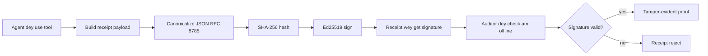
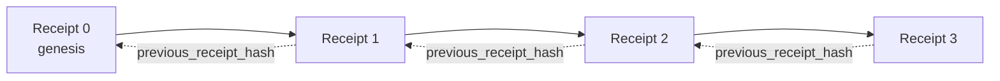

[Watch the lesson video: Securing AI Agents with Cryptographic Receipts](https://youtu.be/PLACEHOLDER_VIDEO_ID)

> _(Lesson video and thumbnail to be added by the Microsoft content team post-merge, matching the lesson 14 / 15 pattern.)_

# Securing AI Agents with Cryptographic Receipts

## Introduction

Dis lesson go cover:

- Why audit trails for AI agents na important for compliance, debugging, and trust.
- Wetin cryptographic receipt be and how e different from unsigned log line.
- How to make signed receipt for agent tool call for plain Python.
- How to verify receipt offline and detect if person tamper am.
- How to chain receipts so if you remove or reorder one, e go break the chain.
- Wetin receipts fit prove and wetin dem no fit prove.

## Learning Goals

After you finish dis lesson, you go sabi how to:

- Identify failure modes wey dey make cryptographic provenance for agent actions important.
- Produce Ed25519-signed receipt over canonical JSON payload.
- Verify receipt alone using only the public key of the signer.
- Detect tampering by re-run verification on modified receipt.
- Build hash-chained sequence of receipts and explain why the chain matter.
- Recognize the boundary between wetin receipts prove (attribution, integrity, ordering) and wetin dem no prove (correctness of action, soundness of policy).

## The Problem: Your Agent's Audit Trail

Imagine say you don deploy AI agent for Contoso Travel. The agent dey read customer requests, dey call flights API to find options, then e dey book seat for customer side. Last quarter, agent process 50,000 bookings.

Today auditor show. Dem ask simple question: "Show me wetin your agent do."

You give dem your log files. Auditor look dem then ask harder question: "How I know say dis logs no get edit?"

Na dis audit-trail problem be that. Most agent deployment today dey rely on:

- **Application logs**: wey agent write by itself, and anybody wey get file-system access fit edit am.
- **Cloud logging services**: platform-level tamper-evident but only if auditor trust the platform operator.
- **Database transaction logs**: good for database changes but no good for arbitrary tool calls.

None of dem fit answer auditor question without make auditor trust somebody (you, your cloud provider, your database vendor). For internal use, dat trust fit okay. But for regulated work (finance, healthcare, anything under EU AI Act), e no okay.

Cryptographic receipts solve dis problem by making each agent action fit verify on im own. Auditor no need trust you. Dem only need your public key and di receipt.

## What is a Cryptographic Receipt?

Receipt na JSON object wey record wetin agent do, and e get digital signature.


  
Minimal receipt look like dis:

```json
{
  "type": "agent.tool_call.v1",
  "agent_id": "contoso-travel-bot",
  "tool_name": "lookup_flights",
  "tool_args_hash": "sha256:a3f9c1...",
  "result_hash": "sha256:7b2e1d...",
  "policy_id": "contoso-travel-policy-v3",
  "timestamp": "2026-04-25T14:30:00Z",
  "sequence": 47,
  "previous_receipt_hash": "sha256:9d4e6a...",
  "signature": {
    "alg": "EdDSA",
    "sig": "c5af83...",
    "public_key": "8f3b2c..."
  }
}
```
  
Three properties dey do dis work:

1. **The signature**. The receipt sign by agent gateway with Ed25519 private key. Anybody get corresponding public key fit verify signature offline. Any tampering for field go make signature invalid.

2. **Canonical encoding**. Before signing, the receipt serialize using JSON Canonicalization Scheme (JCS, RFC 8785). Dis guarantee say two implementations wey produce same logical receipt go get byte-identical output. Without this, different JSON serializers go give different signatures for same content.

3. **Hash chaining**. The `previous_receipt_hash` field link each receipt with the one before am. If person remove or reorder receipt, e go break all receipts after am. Tampering go show for chain level even if individual signatures bypass.

Together dis properties dey give three guarantees:

- **Attribution**: dis key sign this content.
- **Integrity**: content never change since dem sign am.
- **Ordering**: dis receipt come after that one for the chain.

## Producing a Receipt in Python

You no need special library to make receipt. Cryptographic primitives dey everywhere and the logic na small few dozen lines Python code.

The hands-on exercises for `code_samples/18-signed-receipts.ipynb` go show full flow. Summary version:

```python
import json
import hashlib
import base64
from nacl import signing
from jcs import canonicalize  # RFC 8785 canonical JSON

def b64url_nopad(data: bytes) -> str:
    return base64.urlsafe_b64encode(data).decode("ascii").rstrip("=")

def sha256_canonical(obj) -> str:
    """SHA-256 of a Python object's JCS-canonical JSON form."""
    return f"sha256:{hashlib.sha256(canonicalize(obj)).hexdigest()}"

# Make or find one signing key (for real work, keep am for key vault)
signing_key = signing.SigningKey.generate()
verify_key = signing_key.verify_key

# Build di receipt payload (no signature yet)
tool_args = {"origin": "SYD", "destination": "LAX"}
tool_result = [{"flight": "QF11", "price": 1850, "stops": 0}]

payload = {
    "type": "agent.tool_call.v1",
    "agent_id": "contoso-travel-bot",
    "tool_name": "lookup_flights",
    "tool_args_hash": sha256_canonical(tool_args),
    "result_hash": sha256_canonical(tool_result),
    "policy_id": "contoso-travel-policy-v3",
    "timestamp": "2026-04-25T14:30:00Z",
    "sequence": 0,
    "previous_receipt_hash": None,
}

# Make am canonical, hash am, sign am.
canonical_bytes = canonicalize(payload)
message_hash = hashlib.sha256(canonical_bytes).digest()
signature_bytes = signing_key.sign(message_hash).signature

# Attach one structured signature object.
receipt = {
    **payload,
    "signature": {
        "alg": "EdDSA",
        "sig": b64url_nopad(signature_bytes),
        "public_key": b64url_nopad(bytes(verify_key)),
    },
}
```
  
Dat na the entire signing pipeline. Exercises for notebook go explain step by step.

## Verifying a Receipt and Detecting Tampering

Verification na reverse process:

```python
import base64
import hashlib
from nacl import signing
from nacl.exceptions import BadSignatureError
from jcs import canonicalize

def b64url_decode(s: str) -> bytes:
    padding = "=" * ((4 - len(s) % 4) % 4)
    return base64.urlsafe_b64decode(s + padding)

def verify_receipt(receipt: dict) -> bool:
    # Di signature na one structured object: {"alg", "sig", "public_key"}.
    sig_obj = receipt.get("signature")
    if not sig_obj or sig_obj.get("alg") != "EdDSA":
        return False

    # Make back di payload wey dem really sign (everything except di signature).
    payload = {k: v for k, v in receipt.items() if k != "signature"}

    canonical_bytes = canonicalize(payload)
    message_hash = hashlib.sha256(canonical_bytes).digest()

    try:
        verify_key = signing.VerifyKey(b64url_decode(sig_obj["public_key"]))
        verify_key.verify(message_hash, b64url_decode(sig_obj["sig"]))
        return True
    except BadSignatureError:
        return False
```
  
Dis function go take receipt return `True` if signature valid, if no, e go return `False`. No network call, no service dependancy, no need trust third party.

To see tampering detection in action, the notebook go show:

1. Make valid receipt and confirm say e verify.
2. Change one byte for `tool_args_hash` field.
3. Re-run verification and see say e fail.

Dis na practical demo say receipts na tamper-evident: any small change go break signature.

## Chaining Receipts for Multi-Step Agents

One signed receipt protect one action. Chain of receipts protect sequence of actions.


  
Each receipt record hash of previous receipt. To remove receipt 2 without show, attacker go need to either:

- Change receipt 3's `previous_receipt_hash` field (go break receipt 3 signature), OR  
- Forge new signature for modified receipt 3 (need agent private key).

If private key dey hardware key vault and you publish public key with every receipt, attacker no fit do these without detection.

Notebook go show:

1. Build chain of three receipts.
2. Verify say every receipt `previous_receipt_hash` match actual hash of previous receipt.
3. Tamper one receipt for middle and see chain break right there.

Dis na how you fit produce audit trail wey external auditor fit verify without trust you.

## What Receipts Prove (and What They Do Not)

Dis na most important section for dis lesson. Receipts get power but their power get limit.

**Receipts prove three things:**

1. **Attribution**: specific key sign specific payload.
2. **Integrity**: payload never change since sign.
3. **Ordering**: dis receipt come after that receipt for hash chain.

**Receipts no prove:**

1. **Correctness**: say agent action na correct one. Receipt fit sign even for wrong answer as clean as for right answer.
2. **Policy compliance**: say policy inside `policy_id` really evaluate, or dat e go allow action if check done. Receipt dey record wetin dem claim, no wetin e enforce.
3. **Identity beyond key**: receipt talk "dis key sign dis content." E no talk "dis person authorize dis." To connect key to person or org, you need separate identity infrastructure (directory, public key registry, etc.).
4. **Truthfulness of inputs**: if agent receive manipulated prompt and act on am, receipt go record action faithfully. Receipts dey downstream of input validation, no replace am.

Dis boundary matter for two main reasons:

- E tell you wetin receipts fit do: make agent behavior auditable and tamper-evident, even across organizations.
- E show wetin layers you still need: input validation (Lesson 6), policy enforcement (briefly cover below), identity infrastructure (no cover here).

Common mistake be to think say "we get receipts" mean "we dey governed." Na lie. Receipts na foundation. Governance na system wey you build on top.

## Production References

Python code for dis lesson simple so you fit read every line and understand wetin dey happen. For production, you get two options:

1. **Build directly on cryptographic primitives.** The 50 lines you see above enough for many use cases. PyNaCl (Ed25519) and `jcs` package (canonical JSON) na well-maintained and audited libraries.

2. **Use production receipt library.** Some open-source projects implement same pattern with extra features (key rotation, batch verification, JWK Set distribution, integration with policy engines):
   - The receipt format wey dis lesson use dey follow IETF Internet-Draft (`draft-farley-acta-signed-receipts`) wey dey standards process now.
   - Microsoft Agent Governance Toolkit dey compose receipts with Cedar-based policy decisions; see Tutorial 33 for that repo for end-to-end example.
   - `protect-mcp` (npm) and `@veritasacta/verify` (npm) packages dey provide Node-based implementation of receipt signing and offline verification, to wrap any MCP server with tamper-evident audit trail.
   - **[nobulex](https://github.com/arian-gogani/nobulex)** Python SDK (`pip install nobulex`) dey provide same Ed25519 + JCS signing pattern for Python with LangChain and CrewAI integrations, including published cross-validation test vectors and compliance mapping through [OWASP PR #2210](https://github.com/OWASP/CheatSheetSeries/pull/2210).

Deciding between write your own or use library like how you decide to write your own JWT library or use tested one: both good; library save time and reduce audit surface; write from scratch make you understand every primitive well well. Dis lesson teach from scratch path so you get foundation for both choice.

## Knowledge Check

Test your understanding before you start practice exercise.

**1. Receipt sign with agent private Ed25519 key. Auditor only get public key. Auditor fit verify receipt offline?**

<details>
<summary>Answer</summary>

Yes. Ed25519 verification need only public key and signed bytes. No network call, no service dependency. Na wetin make receipts useful for air-gapped, multi-org, or low-trust audit settings.
</details>

**2. Attacker modify `policy_id` field of receipt claim say e under more permissive policy. Signature still over original payload. Wetin happen for verification?**

<details>
<summary>Answer</summary>

Verification fail. Signature compute on canonical bytes of original payload; any change for field change canonical bytes, change SHA-256 hash, make signature invalid. Attacker need private key to make fresh valid signature, which dem no get.
</details>

**3. Why receipt get `tool_args_hash` and `result_hash` instead of raw arguments and result?**

<details>
<summary>Answer</summary>

Two reasons. First, receipt fit dey archived or transmitted where leaking raw content (PII, business data) no good. Hash keep receipt small, content private; auditor verify hash match separate actual content copy. Second, hashes get fixed size; receipt with hashes get bounded size no matter how big input/output be.
</details>

**4. `previous_receipt_hash` field link each receipt to predecessor. If attacker silently delete one receipt from middle chain, wetin no go valid?**

<details>
<summary>Answer</summary>

Every receipt after deleted one. Their `previous_receipt_hash` fields no go match actual chain again (because referenced receipt no dey, or chain point to different predecessor). To hide deletion, attacker go need re-sign every later receipt, which need private key.
</details>

**5. Receipt verify clean. That mean say agent action correct, sound, or policy compliant?**

<details>
<summary>Answer</summary>

No. Valid receipt prove three things: attribution (this key sign content), integrity (content no change), ordering (receipt follow order). E no prove say action correct, policy evaluated, or agent follow all rules. Receipts make agent behavior auditable, no mean say correct. Dis na most important boundary for lesson.
</details>

## Practice Exercise

Open `code_samples/18-signed-receipts.ipynb` and finish all four parts:

1. **Section 1**: Sign your first receipt and verify am.
2. **Section 2**: Tamper receipt and watch verification fail.
3. **Section 3**: Build three-receipt chain and verify chain integrity.
4. **Section 4**: Apply dis pattern to agent built with Microsoft Agent Framework: wrap tool call inside receipt-signing, then verify receipt independently.
**Stretch challenge 1:** extend di receipt schema wit one more field wey you choose (exampul fit be request ID for tracing), update di canonical signing logic to include am, and confirm say di receipt still fit round-trip through verification. Den change di field after you don sign and confirm say verification no go pass. Dis go make you sabi how every byte for di canonical encoding dey add to di signature.

**Stretch challenge 2:** SHA-256-hash two of your receipts together (join dia canonical bytes for one fixed order) and put di resulting digest as new field for one third receipt before you sign am. Check say all three receipts still fit round-trip. You don just build one-step inclusion proof: anybody wey get di third receipt fit show say di first two dey when e sign am, without to show dia content. Na di pattern wey selective-disclosure receipts dey use well-well (Merkle commitments, RFC 6962).

## Conclusion

Cryptographic receipts dey give AI agents audit trail wey be:

- **Independently verifiable**: anybody wey get di public key fit verify, no need any service.
- **Tamper-evident**: any change for di receipt go spoil di signature.
- **Portable**: receipt na small JSON file; e fit dey archived, transmitted, and verified anywhere.
- **Standards-aligned**: dem build am on top Ed25519 (RFC 8032), JCS (RFC 8785), and SHA-256, all na widely-used primitives.

Dem no be replacement for input validation, policy enforcement, or identity infrastructure. Dem be di foundation for all those layers. When you dey deploy agents for regulated workloads, multi-organization workflows, or any place where future auditor fit no trust you, na receipts go make sure say di audit trail honest.

Di most important takeaway: receipts dey prove who talk wetin, and when. Dem no dey prove say wetin dem talk na true or correct. Hold dat distinction tight. Na difference between honest provenance system and one wey fit mislead.

## Production Checklist

When you don ready to waka from dis lesson go deploy receipt-signed agents for real environment:

- [ ] **Move di signing key comot for developer laptop.** Use Azure Key Vault, AWS KMS, or hardware security module. Private key wey dey sign your receipts no suppose ever dey for source control or as plaintext for app machines.
- [ ] **Publish di verification public key.** Auditors need am to verify offline. Di normal pattern na JWK Set for one well-known URL (RFC 7517), eg, `https://your-org.example.com/.well-known/agent-keys.json`.
- [ ] **Anchor di chain outside.** Sometimes write di latest chain head hash to transparency log (Sigstore Rekor, RFC 3161 timestamp authority, or second internal system) so outside person fit confirm "dis chain dey this time."
- [ ] **Store receipts so dem no fit change.** Use append-only blob storage (Azure Storage wit immutability policies, AWS S3 Object Lock) to stop insider from rewriting history for storage layer.
- [ ] **Decide how long to keep receipts.** Many compliance regimes require multi-year retention. Plan for receipt growth (receipt na about 500 bytes; agent wey make 10K calls per day go produce about 1.8 GB per year).
- [ ] **Write down wetin receipts no cover.** Receipts dey prove attribution, integrity, and ordering. Your runbook suppose list other controls (input validation, policy enforcement, rate limiting, identity infrastructure) wey dey combined wit receipts for your governance.

### Get More Questions About Securing AI Agents?

Join [Microsoft Foundry Discord](https://aka.ms/ai-agents/discord) to meet other learners, attend office hours, and get your AI Agents questions answered.

## Beyond This Lesson

Dis lesson dey cover single-receipt signing and hash-chained sequences. Same primitives dey fit join make more advanced patterns wey you fit see as your governance style grow:

- **Selective disclosure.** When receipt fields dem get own independent commitment (RFC 6962 style Merkle tree), you fit show specific fields to specific auditors and prove say di others no change without show dem. E good when same receipt suppose satisfy full audit (wey want completeness) and data-minimization laws like GDPR (wey want auditor see just small).
- **Receipt revocation.** If anyone leak signing key, you need way to mark all receipts signed with am as no trust from certain time. Normal ways: short-lived signing keys plus published revocation list, or transparency log with revocation entries.
- **Bilateral / split-signature receipts.** Some system divide signed payload into pre-execution (`authorization_*`) and post-execution (`result_*`) halves with different signatures, good when authorization and result na different people or time. E fit work together wit receipt format taught here.
- **Payload composition.** Receipt dey seal whatever bytes you put for `result_hash`. Real payloads fit get more info than one tool call result: pre-decision thinking (model prediction, options, evidence and how complete, risk posture, accountability, gate result) all fit dey inside payload sealed by one receipt. E keep receipt format small while payload schemas fit grow by domain.
- **Cross-implementation conformance.** Multiple independent implementations for same receipt format (Python, TypeScript, Rust, Go) fit verify against same test vectors. If you build your own, validating with published vectors confirm wire compatibility.
- **Post-quantum migration.** Ed25519 dey widely used now but no fit handle quantum well. Receipt format dey algorithm-agile: `signature.alg` field fit carry `ML-DSA-65` (NIST post-quantum signature standard) when you wan migrate. Plan transition period where receipts get dual-sign.

## Additional Resources

- <a href="https://datatracker.ietf.org/doc/draft-farley-acta-signed-receipts/" target="_blank">IETF Internet-Draft: Signed Decision Receipts for Machine-to-Machine Access Control</a>
- <a href="https://learn.microsoft.com/azure/ai-studio/responsible-use-of-ai-overview" target="_blank">Responsible AI overview (Azure AI)</a>
- <a href="https://datatracker.ietf.org/doc/html/rfc8032" target="_blank">RFC 8032: Edwards-Curve Digital Signature Algorithm (EdDSA)</a>
- <a href="https://datatracker.ietf.org/doc/html/rfc8785" target="_blank">RFC 8785: JSON Canonicalization Scheme (JCS)</a>
- <a href="https://datatracker.ietf.org/doc/html/rfc6962" target="_blank">RFC 6962: Certificate Transparency</a> (Merkle-tree construction wey selective-disclosure receipts dey use)
- <a href="https://github.com/microsoft/agent-governance-toolkit/blob/main/docs/tutorials/33-offline-verifiable-receipts.md" target="_blank">Microsoft Agent Governance Toolkit, Tutorial 33: Offline-Verifiable Decision Receipts</a>
- <a href="https://github.com/ScopeBlind/agent-governance-testvectors" target="_blank">Cross-implementation conformance test vectors</a> for receipt format used here (Apache-2.0)
- <a href="https://pynacl.readthedocs.io/" target="_blank">PyNaCl documentation</a> (Ed25519 for Python)

## Previous Lesson

[Building Computer Use Agents (CUA)](../15-browser-use/README.md)

## Next Lesson

_(To be determined by curriculum maintainers)_

---

<!-- CO-OP TRANSLATOR DISCLAIMER START -->
**Disclaimer**:
Dis document don translate wit AI translation service [Co-op Translator](https://github.com/Azure/co-op-translator). Even tho we dey try make am correct, abeg make you know say automated translation fit get errors or mistakes. Di original document for dia own language na im be di correct source. For important info, make person wey sabi human translation do am. We no go responsible for any misunderstanding or wrong understanding wey fit happen because of dis translation.
<!-- CO-OP TRANSLATOR DISCLAIMER END -->