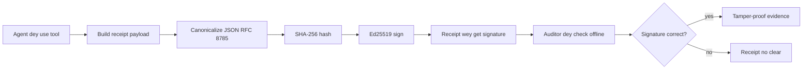
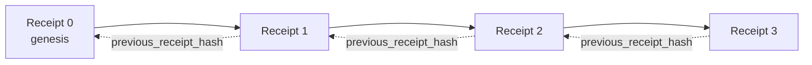

[Watch the lesson video: Securing AI Agents with Cryptographic Receipts](https://youtu.be/PLACEHOLDER_VIDEO_ID)

> _(Lesson video and thumbnail go add by Microsoft content team after dem combine am, e go follow the lesson 14 / 15 pattern.)_

# Securing AI Agents with Cryptographic Receipts

## Introduction

Dis lesson go cover:

- Why audit trails for AI agents matter for compliance, debugging, and trust.
- Wetin be cryptographic receipt and how e different from unsigned log line.
- How to produce signed receipt for agent tool call for plain Python.
- How to verify receipt offline and detect if person tamper.
- How to chain receipts so say if you comot or rearrange one, e go break the chain.
- Wetin receipts dey prove and wetin dem no prove at all.

## Learning Goals

After you finish dis lesson, you go sabi how to:

- Identify the failure modes weh dey make people use cryptographic provenance for agent actions.
- Produce Ed25519-signed receipt over canonical JSON payload.
- Verify receipt by yourself only using signer public key.
- Detect tampering by re-run verification on receipt wey dem modify.
- Build hash-chained sequence of receipts and explain why chain dey important.
- Understand the difference between wetin receipts prove (attribution, integrity, ordering) and wetin dem no prove (correctness of action, soundness of policy).

## The Problem: Your Agent's Audit Trail

Imagine say you don deploy AI agent for Contoso Travel. Agent dey read customer request, call flights API to find options, and book seat for customer. For last quarter, agent process 50,000 bookings.

Today auditor show. Dem ask simple question: "Make you show me wetin your agent do."

You give dem your log files. Auditor look am, then dem ask harder question: "How I know say dem no edit the log?"

Na so audit-trail problem be. Today, most agent deployment rely on:

- **Application logs**: wey agent itself write, fit edit by anybody wey get file-system access.
- **Cloud logging services**: tamper-evident for platform level but only if auditor trust platform owner.
- **Database transaction logs**: good for database changes but no too fit for any tool call.

None of these fit answer auditor question without auditor trusting somebody (you, your cloud provider, your database vendor). For internal use, dat trust fit make sense. For regulated workload dem (finance, healthcare, anything wey EU AI Act concern), e no fit.

Cryptographic receipts solve am because dem make each agent action fit verify on im own. Auditor no need trust you. Dem only need your public key and receipt itself.

## What is a Cryptographic Receipt?

Receipt na JSON object wey record wetin agent do, and e dey sign with digital signature.



Minimal receipt look like dis:

```json
{
  "type": "agent.tool_call.v1",
  "agent_id": "contoso-travel-bot",
  "tool_name": "lookup_flights",
  "tool_args_hash": "sha256:a3f9c1...",
  "result_hash": "sha256:7b2e1d...",
  "policy_id": "contoso-travel-policy-v3",
  "timestamp": "2026-04-25T14:30:00Z",
  "sequence": 47,
  "previous_receipt_hash": "sha256:9d4e6a...",
  "signature": {
    "alg": "EdDSA",
    "sig": "c5af83...",
    "public_key": "8f3b2c..."
  }
}
```

Three properties dey do the work:

1. **Signature**. Receipt na agent gateway dey sign am with Ed25519 private key. Anybody wey get public key fit verify signature offline. If tamper any field, signature no go valid again.

2. **Canonical encoding**. Before sign, receipt go serialize with JSON Canonicalization Scheme (JCS, RFC 8785). Dis go make sure say two different implementation wey produce same logical receipt go produce byte-identical output. Without this canonicalization, different JSON serializers fit give different signatures for same content.

3. **Hash chaining**. The `previous_receipt_hash` field link one receipt to receipt before am. If you comot or rearrange receipt, you go break every receipt wen come after am. Even if person bypass individual signature, tampering go dey obvious for chain level.

Dem three properties together dey give dis three guarantee:

- **Attribution**: na dis key sign this content.
- **Integrity**: content no change after dem sign am.
- **Ordering**: dis receipt come after dat receipt for chain.

## Producing a Receipt in Python

You no need special library to produce receipt. Cryptographic primitives dey for everywhere and the logic na just small Python lines.

The hand-on exercises for `code_samples/18-signed-receipts.ipynb` go show you full flow. Summary version be:

```python
import json
import hashlib
import base64
from nacl import signing
from jcs import canonicalize  # RFC 8785 canonical JSON

def b64url_nopad(data: bytes) -> str:
    return base64.urlsafe_b64encode(data).decode("ascii").rstrip("=")

def sha256_canonical(obj) -> str:
    """SHA-256 of a Python object's JCS-canonical JSON form."""
    return f"sha256:{hashlib.sha256(canonicalize(obj)).hexdigest()}"

# Make or load one signing key (for production, keep am for one key vault)
signing_key = signing.SigningKey.generate()
verify_key = signing_key.verify_key

# Build the receipt payload (no signature yet)
tool_args = {"origin": "SYD", "destination": "LAX"}
tool_result = [{"flight": "QF11", "price": 1850, "stops": 0}]

payload = {
    "type": "agent.tool_call.v1",
    "agent_id": "contoso-travel-bot",
    "tool_name": "lookup_flights",
    "tool_args_hash": sha256_canonical(tool_args),
    "result_hash": sha256_canonical(tool_result),
    "policy_id": "contoso-travel-policy-v3",
    "timestamp": "2026-04-25T14:30:00Z",
    "sequence": 0,
    "previous_receipt_hash": None,
}

# Canonicalize, hash, sign.
canonical_bytes = canonicalize(payload)
message_hash = hashlib.sha256(canonical_bytes).digest()
signature_bytes = signing_key.sign(message_hash).signature

# Attach one structured signature object.
receipt = {
    **payload,
    "signature": {
        "alg": "EdDSA",
        "sig": b64url_nopad(signature_bytes),
        "public_key": b64url_nopad(bytes(verify_key)),
    },
}
```

Na so d whole signing pipeline be. Exercises for notebook go show each step.

## Verifying a Receipt and Detecting Tampering

Verification na opposite process:

```python
import base64
import hashlib
from nacl import signing
from nacl.exceptions import BadSignatureError
from jcs import canonicalize

def b64url_decode(s: str) -> bytes:
    padding = "=" * ((4 - len(s) % 4) % 4)
    return base64.urlsafe_b64decode(s + padding)

def verify_receipt(receipt: dict) -> bool:
    # Di signature na structured object: {"alg", "sig", "public_key"}.
    sig_obj = receipt.get("signature")
    if not sig_obj or sig_obj.get("alg") != "EdDSA":
        return False

    # Make back di payload we dem really sign (everything but di signature).
    payload = {k: v for k, v in receipt.items() if k != "signature"}

    canonical_bytes = canonicalize(payload)
    message_hash = hashlib.sha256(canonical_bytes).digest()

    try:
        verify_key = signing.VerifyKey(b64url_decode(sig_obj["public_key"]))
        verify_key.verify(message_hash, b64url_decode(sig_obj["sig"]))
        return True
    except BadSignatureError:
        return False
```

This function go take receipt come give you `True` if signature valid, `False` if no valid. No network request, no service depend, no trust in anybody third party.

To see tampering detection, notebook go:

1. Produce valid receipt and confirm say e verify.
2. Change one byte for `tool_args_hash` field.
3. Re-run verification and see e fail.

Dis na practical demonstration say receipt dey tamper-evident: any small modification fit break signature.

## Chaining Receipts for Multi-Step Agents

One signed receipt protect one action. Chain of receipts protect sequence.



Each receipt record hash of receipt before am. To comot receipt 2 quietly, attacker go need either:

- Change receipt 3 `previous_receipt_hash` field (go break receipt 3 signature), OR
- Fake new signature on modified receipt 3 (need agent private key).

If private key dey hardware key vault and you dey publish public key with each receipt, neither attack go possible without detection.

Notebook go:

1. Build chain of three receipts.
2. Verify each receipt `previous_receipt_hash` match actual hash of previous receipt.
3. Tamper with one receipt for middle and see chain break for that point.

Na so you produce audit trail wey external auditor fit verify without trust you.

## What Receipts Prove (and What They Do Not)

Dis na most important part for dis lesson. Receipts strong but dem get limit.

**Receipts dey prove three things:**

1. **Attribution**: one specific key sign specific payload.
2. **Integrity**: payload never change since dem sign am.
3. **Ordering**: dis receipt come after dat receipt for hash chain.

**Receipts no dey prove:**

1. **Correctness**: say the agent action be the right action. Receipt fit sign wrong answer as clean as correct answer.
2. **Policy compliance**: say policy wey dem put for `policy_id` really evaluate, or say e for allow dis action if dem check am. Receipt record wetin dem claim, no be wetin dem enforce.
3. **Identity beyond key**: receipt talk "dis key sign dis content." E no talk "dis human authorize dis." To connect key to person need separate identity system (directory, public key registry, etc).
4. **Truthfulness of inputs**: If agent get manipulated prompt and act on am, receipt go record action faithfully. Receipts dey downstream of input validation, no be replacement.

Dis boundary important for two reasons:

- E tell you wetin receipts dey useful for: make agent behaviour dey auditable and tamper-evident, even across organizational boundaries.
- E show wetin you still need: input validation (Lesson 6), policy enforcement (briefly cover below), and identity infrastructure (no include for dis lesson).

Common mistake be say people think "we get receipts" mean "we dey governed." Na lie. Receipts na foundation. Governance na system you build on top.

## Production References

Python code for dis lesson minimal so you fit read every line and understand wetin dey happen. For production, you get two options:

1. **Build directly on cryptographic primitives.** The 50 lines wey you see on top enough for many use cases. PyNaCl (Ed25519) and `jcs` package (canonical JSON) na well maintained and audited library.

2. **Use production receipt library.** Some open-source projects dey do same pattern with extra features (key rotation, batch verification, JWK Set distribution, integration with policy engines):
   - Receipt format for dis lesson follow IETF Internet-Draft (`draft-farley-acta-signed-receipts`) wey dey standard process.
   - Microsoft Agent Governance Toolkit dey combine receipts with Cedar-based policy decisions; see Tutorial 33 for repository for full example.
   - `protect-mcp` (npm) and `@veritasacta/verify` (npm) packages provide Node-based receipt signing and offline verification, to wrap MCP server with tamper-evident audit trail.

The choice between making your own and using library na like choice between writing your own JWT library and use tested one: both dey okay; library save time and reduce audit surface; from-scratch make you sabi every primitive. Dis lesson teach from-scratch so you get foundation for any choice.

## Knowledge Check

Test your understanding before you move to practice exercise.

**1. Receipt sign with agent private Ed25519 key. Auditor only get public key. Auditor fit verify receipt offline?**

<details>
<summary>Answer</summary>

Yes. Ed25519 verification need only public key and signed bytes. No network request, no service dependency. Na why receipt dey useful for air-gapped, multi-org, or low-trust audit setting.
</details>

**2. Attacker modify `policy_id` field to claim policy na more permissive one. Signature na original payload. Wetin go happen during verification?**

<details>
<summary>Answer</summary>

Verification go fail. Signature compute from canonical bytes for original payload; change any field change canonical bytes, change SHA-256 hash, make signature invalid. Attacker need private key to produce fresh valid signature, wey dem no get.
</details>

**3. Why receipt dey include `tool_args_hash` and `result_hash` instead of raw arguments and result?**

<details>
<summary>Answer</summary>

Two reasons. First, receipt fit need archive or transmit for environment wey leaking raw content (PII, business data) no good. Hash keep receipt small and content private; auditor verify hash match separate stored copy of content. Second, hashes get fixed size; receipt with hashes no dey too big no matter how large input and output be.
</details>

**4. `previous_receipt_hash` field link each receipt to predecessor. If attacker silently delete one receipt from middle of chain, wetin go become invalid?**

<details>
<summary>Answer</summary>

Every receipt after the deleted one. Their `previous_receipt_hash` no go match actual chain (because the receipt dem reference no dey, or chain this time link different one). To hide deletion, attacker go need re-sign every later receipt, wey need private key.
</details>

**5. Receipt verify clean. E prove say agent action correct, sound, or follow policy?**

<details>
<summary>Answer</summary>

No. Valid receipt prove three things: attribution (dis key sign this content), integrity (content no change), ordering (receipt come after another). E no prove say action correct, policy for `policy_id` actually evaluate, or say agent follow every rule. Receipts make agent behaviour auditable, not necessarily correct. Na most important lesson boundary.
</details>

## Practice Exercise

Open `code_samples/18-signed-receipts.ipynb` and complete all four sections:

1. **Section 1**: Sign your first receipt and verify am.
2. **Section 2**: Tamper receipt and see verification fail.
3. **Section 3**: Build three-receipt chain and verify chain integrity.
4. **Section 4**: Use pattern for agent built with Microsoft Agent Framework: wrap tool call in receipt-signing, then verify receipt independently.

**Stretch challenge 1:** expand receipt schema with extra field of your choice (for example, request ID for tracing), update canonical signing logic to include am, and check say receipt still fit verify. Then change field after signing and confirm verification fail. Dis one go make you understand how every byte for canonical encoding dey affect signature.
**Stretch challenge 2:** SHA-256-hash two of your receipts together (concatenate their canonical bytes in a deterministic order) and embed the resulting digest as a new field on a third receipt before signing it. Verify say all three receipts still dey round-trip. You don just build one-step inclusion proof: anybody wey get the third receipt fit prove say the first two dey exist at the time e sign am, without needing to show their contents. Na di pattern wey selective-disclosure receipts dey use for large scale (Merkle commitments, RFC 6962).

## Conclusion

Cryptographic receipts dey give AI agents audit trail wey be:

- **Independently verifiable**: any person wey get di public key fit verify am, no need any service.
- **Tamper-evident**: any change go spoil the signature.
- **Portable**: receipt na small JSON file; e fit dey archived, transmitted, and verified anywhere.
- **Standards-aligned**: e build on Ed25519 (RFC 8032), JCS (RFC 8785), and SHA-256, all of dem na widely used primitives.

Dem no be replacement for input validation, policy enforcement, or identity infrastructure. Dem be foundation for those layers. When you dey deploy agents into regulated workloads, multi-organization workflows, or any place wey future auditor no go fit just trust you, receipts na how you fit keep audit trail honest.

The most important thing: receipts prove who talk wetin, when. Dem no dey prove say wetin dem talk na true or correct. Make you hold dat difference tight. Na the difference between honest provenance system and one wey go mislead.

## Production Checklist

When you ready to graduate from dis lesson to deploy receipt-signed agents for real environment:

- [ ] **Move di signing key from developer laptop.** Use Azure Key Vault, AWS KMS, or hardware security module. The private key wey dey sign your receipts no suppose ever dey for source control or in plaintext for application machines.
- [ ] **Publish di verification public key.** Auditors go need am for verify offline. Standard pattern na JWK Set for well-known URL (RFC 7517), example: `https://your-org.example.com/.well-known/agent-keys.json`.
- [ ] **Anchor di chain externally.** Periodically write latest chain head hash to transparency log (Sigstore Rekor, RFC 3161 timestamp authority, or second internal system) so external party fit confirm "dis chain dey for dis time."
- [ ] **Store receipts immutably.** Append-only blob storage (Azure Storage wey get immutability policies, AWS S3 Object Lock) go stop insider from rewriting history for storage layer.
- [ ] **Decide retention.** Plenty compliance regime dey require multi-year retention. Plan for receipt growth (every receipt be ~500 bytes; agent wey dey make 10K calls per day fit produce ~1.8 GB per year).
- [ ] **Document wetin receipts no cover.** Receipts dey prove attribution, integrity, and ordering. Your runbook suppose list explicit the additional controls (input validation, policy enforcement, rate limiting, identity infrastructure) wey dey alongside receipts for your governance.

### You Get More Questions About Securing AI Agents?

Join the [Microsoft Foundry Discord](https://aka.ms/ai-agents/discord) to meet with other learners, attend office hours, and get your AI Agents questions answered.

## Beyond This Lesson

This lesson cover single-receipt signing and hash-chained sequences. The same primitives fit form plenty advanced patterns wey you fit see as your governance matures:

- **Selective disclosure.** When receipt fields dey independently committed (RFC 6962-style Merkle tree), you fit show specific fields to specific auditors and prove others no change without exposing dem. Useful when same receipt suppose satisfy both comprehensive audit (wey want completeness) and data-minimization regulations like GDPR (wey want auditor to see as small as e possible).
- **Receipt revocation.** If signing key compromise, you need way to mark all receipts signed by dat key as untrusted from some time. Standard patterns: short-lived signing keys plus published revocation list, or transparency log with revocation entries.
- **Bilateral / split-signature receipts.** Some implementations split signed payload into pre-execution (`authorization_*`) and post-execution (`result_*`) halves with independent signatures, useful when authorization decision and observed result come from different actors or at different times. This dey add on top of receipt format wey this lesson teach.
- **Payload composition.** Receipt seal wetin you put inside `result_hash`. Real-world payloads dey often rich pass single tool call result: pre-decision reasoning (model prediction, options considered, evidence and completeness, risk posture, accountability chain, gate outcome) fit dey inside payload, sealed by one receipt. This keep receipt format small while allowing payload schemas grow domain-by-domain.
- **Cross-implementation conformance.** Plenty independent implementations of same receipt format (Python, TypeScript, Rust, Go) dey cross-verify against shared test vectors. If you build your own, validating against published vectors confirm say wire fit work together.
- **Post-quantum migration.** Ed25519 dey widely deployed now but no quantum-resistant. Receipt format get algorithm-agile: `signature.alg` field fit carry `ML-DSA-65` (NIST post-quantum signature standard) when you need migrate. Plan transition period wey receipts go dey dual-signed.

## Additional Resources

- <a href="https://datatracker.ietf.org/doc/draft-farley-acta-signed-receipts/" target="_blank">IETF Internet-Draft: Signed Decision Receipts for Machine-to-Machine Access Control</a>
- <a href="https://learn.microsoft.com/azure/ai-studio/responsible-use-of-ai-overview" target="_blank">Responsible AI overview (Azure AI)</a>
- <a href="https://datatracker.ietf.org/doc/html/rfc8032" target="_blank">RFC 8032: Edwards-Curve Digital Signature Algorithm (EdDSA)</a>
- <a href="https://datatracker.ietf.org/doc/html/rfc8785" target="_blank">RFC 8785: JSON Canonicalization Scheme (JCS)</a>
- <a href="https://datatracker.ietf.org/doc/html/rfc6962" target="_blank">RFC 6962: Certificate Transparency</a> (Merkle-tree construction wey selective-disclosure receipts dey use)
- <a href="https://github.com/microsoft/agent-governance-toolkit/blob/main/docs/tutorials/33-offline-verifiable-receipts.md" target="_blank">Microsoft Agent Governance Toolkit, Tutorial 33: Offline-Verifiable Decision Receipts</a>
- <a href="https://github.com/ScopeBlind/agent-governance-testvectors" target="_blank">Cross-implementation conformance test vectors</a> for receipt format wey this lesson use (Apache-2.0)
- <a href="https://pynacl.readthedocs.io/" target="_blank">PyNaCl documentation</a> (Ed25519 for Python)

## Previous Lesson

[Building Computer Use Agents (CUA)](../15-browser-use/README.md)

## Next Lesson

_(To be determined by curriculum maintainers)_

---

<!-- CO-OP TRANSLATOR DISCLAIMER START -->
**Disclaimer**:
Dis document don translate wit AI translation service [Co-op Translator](https://github.com/Azure/co-op-translator). Even tho we dey try make am correct, abeg make you know say automated translation fit get errors or mistakes. Di original document for dia own language na im be di correct source. For important info, make person wey sabi human translation do am. We no go responsible for any misunderstanding or wrong understanding wey fit happen because of dis translation.
<!-- CO-OP TRANSLATOR DISCLAIMER END -->