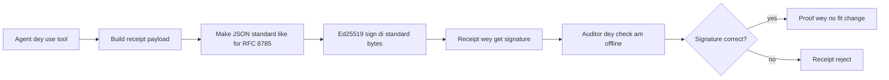
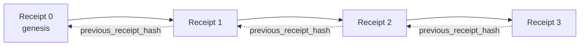

[Watch di lesson video: Securing AI Agents wit Cryptographic Receipts](https://youtu.be/PLACEHOLDER_VIDEO_ID)

> _(Lesson video and thumbnail go add by Microsoft content team afta merge, weh go match lesson 14 / 15 pattern.)_

# Securing AI Agents wit Cryptographic Receipts

## Introduction

Dis lesson go cover:

- Why audit trails for AI agents matter for compliance, debugging, and trust.
- Wetin cryptographic receipt be and how e different from unsigned log line.
- How to produce signed receipt for agent tool call for plain Python.
- How to verify receipt offline and detect tampering.
- How to chain receipts so that if person remove or reorder one, e go break chain.
- Wetin receipts fit prove and wetin dem no fit prove.

## Learning Goals

After you finish dis lesson, you go sabi how to:

- Identify failure modes wey dey make cryptographic provenance for agent actions important.
- Produce Ed25519-signed receipt over canonical JSON payload.
- Verify receipt independently using only signer public key.
- Detect tampering by re-running verification on modified receipt.
- Build hash-chained sequence of receipts and explain why chain dey important.
- Recognize boundary between wetin receipts prove (attribution, integrity, ordering) and wetin dem no prove (correctness of action, soundness of policy).

## Di Problem: Your Agent's Audit Trail

Make you imagine say you don deploy AI agent for Contoso Travel. Di agent dey read customer requests, e dey call flights API to look options, and e dey book seats for customers on their behalf. For last quarter, di agent process 50,000 bookings.

Today, auditor don show. Dem ask one simple question: "Show me wetin your agent do."

You give dem your log files. Auditor look dem then ask harder question: "How I fit know say nobody edit dia logs?"

Dis na di audit-trail problem. Most agent deployments today dey rely on:

- **Application logs**: wey agent write by itself, anybody wey get file-system access fit edit am.
- **Cloud logging services**: tamper-evident for platform level but only if auditor trust di platform operator.
- **Database transaction logs**: good for database changes but no good for any kin tool calls.

None of these fit answer auditor question without auditor to trust person (you, your cloud provider, your database vendor). For internal use, dat trust dey okay. For regulated workloads (finance, healthcare, anything wey dem dey subject to EU AI Act), e no dey okay.

Cryptographic receipts solve dis by making every agent action independently verifiable. Auditor no need trust you. Dem just need your public key and di receipt itself.

## Wetin be Cryptographic Receipt?

Receipt na JSON object wey record wetin agent do, and e get digital signature.


```mermaid
flowchart LR
    A[Agent dey use tool] --> B[Build receipt payload]
    B --> C[Make JSON standard like for RFC 8785]
    C --> E[Ed25519 sign di standard bytes]
    E --> F[Receipt wey get signature]
    F --> G[Auditor dey check am offline]
    G --> H{Signature correct?}
    H -- yes --> I[Proof wey no fit change]
    H -- no --> J[Receipt reject]
```

Minimal receipt dey look like dis:

```json
{
  "type": "agent.tool_call.v1",
  "agent_id": "contoso-travel-bot",
  "tool_name": "lookup_flights",
  "tool_args_hash": "sha256:a3f9c1...",
  "result_hash": "sha256:7b2e1d...",
  "policy_id": "contoso-travel-policy-v3",
  "timestamp": "2026-04-25T14:30:00Z",
  "sequence": 47,
  "previous_receipt_hash": "sha256:9d4e6a...",
  "signature": {
    "alg": "EdDSA",
    "sig": "c5af83...",
    "public_key": "8f3b2c..."
  }
}
```

Three things dey work:

1. **The signature**. Di receipt sign by agent's gateway using Ed25519 private key. Anybody wey get di public key fit verify di signature offline. If tamper with any field, di signature no go valid.

2. **Canonical encoding**. Before dem sign am, receipt serialize using JSON Canonicalization Scheme (JCS, RFC 8785). Dis make sure sey two implementation wey produce same logical receipt go always produce byte-identical output. If no canonicalization, different JSON serializer go produce different signatures for same content.

3. **Hash chaining**. Di `previous_receipt_hash` field bind receipt to di one before am. If person remove or reorder receipt, e break every receipt wey come after am. Tampering go show well well for di whole chain even if individual signature jam problem.

Together, dis things dey give three guarantees:

- **Attribution**: dis key sign dis content.
- **Integrity**: content no change since dem sign am.
- **Ordering**: dis receipt come after dat receipt for di chain.

## How to Produce Receipt for Python

You no need special library to make receipt. Cryptographic primitives dey available well and di logic na few dozen lines for Python.

Hands-on exercises for `code_samples/18-signed-receipts.ipynb` go show whole flow. Di summary version:

```python
import json
import hashlib
import base64
from nacl import signing
from jcs import canonicalize  # RFC 8785 canonical JSON

def b64url_nopad(data: bytes) -> str:
    return base64.urlsafe_b64encode(data).decode("ascii").rstrip("=")

def sha256_canonical(obj) -> str:
    """SHA-256 of a Python object's JCS-canonical JSON form."""
    return f"sha256:{hashlib.sha256(canonicalize(obj)).hexdigest()}"

# Make or find one signing key (for production, keep am for key vault)
signing_key = signing.SigningKey.generate()
verify_key = signing_key.verify_key

# Build the receipt payload (no signature yet)
tool_args = {"origin": "SYD", "destination": "LAX"}
tool_result = [{"flight": "QF11", "price": 1850, "stops": 0}]

payload = {
    "type": "agent.tool_call.v1",
    "agent_id": "contoso-travel-bot",
    "tool_name": "lookup_flights",
    "tool_args_hash": sha256_canonical(tool_args),
    "result_hash": sha256_canonical(tool_result),
    "policy_id": "contoso-travel-policy-v3",
    "timestamp": "2026-04-25T14:30:00Z",
    "sequence": 0,
    "previous_receipt_hash": None,
}

# Make am proper and sign the JCS bytes straight. PureEdDSA de hash am inside.
canonical_bytes = canonicalize(payload)
signature_bytes = signing_key.sign(canonical_bytes).signature

# Put one structured signature object.
receipt = {
    **payload,
    "signature": {
        "alg": "EdDSA",
        "sig": b64url_nopad(signature_bytes),
        "public_key": b64url_nopad(bytes(verify_key)),
    },
}
```

Na di whole signing pipeline be dat. Exercises for notebook go break down every step.

## Verifying Receipt and Detecting Tampering

Verification na reverse operation:

```python
import base64
import hashlib
from nacl import signing
from nacl.exceptions import BadSignatureError
from jcs import canonicalize

def b64url_decode(s: str) -> bytes:
    padding = "=" * ((4 - len(s) % 4) % 4)
    return base64.urlsafe_b64decode(s + padding)

def verify_receipt(receipt: dict) -> bool:
    # Di signature na one structured object: {"alg", "sig", "public_key"}.
    sig_obj = receipt.get("signature")
    if not sig_obj or sig_obj.get("alg") != "EdDSA":
        return False

    # Make di payload wey dem really sign again (everything wey no be signature).
    payload = {k: v for k, v in receipt.items() if k != "signature"}

    canonical_bytes = canonicalize(payload)

    try:
        verify_key = signing.VerifyKey(b64url_decode(sig_obj["public_key"]))
        verify_key.verify(canonical_bytes, b64url_decode(sig_obj["sig"]))
        return True
    except BadSignatureError:
        return False
```

Dis function go take receipt and return `True` if signature valid, `False` if no valid. No network call, no service dependency, no trust for any third party.

To see tampering detection in action, notebook go do:

1. Produce valid receipt and confirm say e verify.
2. Modify one byte for `tool_args_hash` field.
3. Re-run verification and see e fail.

Dis na practical show say receipts dey tamper-evident: any small modification go break di signature.

## Chaining Receipts for Multi-Step Agents

One signed receipt dey protect one action. Chain of receipts dey protect sequence of actions.


```mermaid
flowchart LR
    R0[Receipt 0<br/>genesis] --> R1[Receipt 1]
    R1 --> R2[Receipt 2]
    R2 --> R3[Receipt 3]
    R1 -. previous_receipt_hash .-> R0
    R2 -. previous_receipt_hash .-> R1
    R3 -. previous_receipt_hash .-> R2
```

Every receipt dey record hash of di receipt before am. To remove receipt 2 without noise, attacker must either:

- Modify receipt 3 `previous_receipt_hash` field (e go break receipt 3 signature), OR
- Forge new signature on modified receipt 3 (you need agent private key).

If private key dey hardware key vault and you publish public key with every receipt, nobody go fit do dis attack without dem knowing.

Notebook go show:

1. Build chain of three receipts.
2. Verify say each receipt `previous_receipt_hash` match actual hash of prior receipt.
3. Tamper with one receipt for middle and see chain break for dat point.

Dis na how you produce audit trail wey external auditor fit verify without trust you.

## Wetin Receipts Prove (and Wetin Dem No Prove)

Dis na di most important section for dis lesson. Receipts dey powerful but power no unlimited.

**Receipts prove three tins:**

1. **Attribution**: specific key sign specific payload.
2. **Integrity**: payload never change since signing.
3. **Ordering**: dis receipt come after dat receipt for hash chain.

**Receipts no prove:**

1. **Correctness**: say agent action na di right action. Receipt fit sign wrong answer same way as right one.
2. **Policy compliance**: say policy wey dem talk for `policy_id` really evaluate, or say e for allow this action if dem check. Receipt record wetin dem claim, no wetin dem enforce.
3. **Identity beyond key**: receipt talk "dis key sign dis content." No talk "dis human authorize this." To connect key with person or organization, you need separate identity infrastructure (directory, public key registry etc.).
4. **Truthfulness of inputs**: if agent get manipulated prompt and act on top am, receipt go record action true true. Receipts dey downstream of input validation, no be replacement for am.

Dis boundary important for two reasons:

- E tell you wetin receipts good for: to make agent behavior auditable and tamper-evident, even across different organizations.
- E still tell you wetin extra layers you need: input validation (Lesson 6), policy enforcement (briefly cover below), and identity infrastructure (no include for dis lesson).

Common mistake na to think say "we get receipts" mean "we get governance." No mean so. Receipts na foundation. Governance na di system wey you build on top.

## Proving Human Approved Di Exact Action

Item 3 for above deserve im own section: action receipt talk "dis key sign dis content," never "human authorize dis." For high-risk actions (refunds, deletions, wire transfers), governance frameworks dey require exactly dis missing statement, and you fit produce am with di same primitives wey you don build for dis lesson.

Di next notebook `code_samples/human-authorization-receipts.ipynb` add second receipt kind, `human.approval.v1`, for same envelope shape like lesson receipts (typed payload signed by Ed25519 over im canonical JCS bytes, with `signature` object outside signed bytes). Named approver sign **full canonical action and e digest** before execution; agent's action receipt get **same action digest** and `parent_approval_ref`, di `receipt_hash` of approval, di same convention like `previous_receipt_hash` for chain wey you don build above. One `verify_chain` dey check both artifacts under **separate pinned key registries** (approver keys vs agent keys), so code path na one but authorities no dey the same.

Di property dis buy, na say: *human approve dis exact action, and agent execute exactly dat approved action.* Notebook refusal features na wetin make dis property real instead of just claim:

- classic group: tampering, confused deputy, replay, forged keys both sides, malformed input;
- **stale authority**: signature still verify but dem refuse am anyway because policy version change, approver key rotate out of pinned registry, or approval expire before execution;
- **digest substitution**: validly signed action receipt wey dey point to *real* approval but e bind different canonical action.

Every failure refuse for different reason, so auditor fit tell if authority stale or action change. Rule for notebook: signed approval no be authority on im own. Authority dey only if both receipts still bind same canonical action during execution. Human-approval receipt na educational composition from dis lesson, no be receipt type from `draft-farley-acta-signed-receipts`.

## Production References

Di Python code for dis lesson na minimal on purpose so you fit read every line and understand wetin dey happen. For production, you get two options:

1. **Build directly on cryptographic primitives.** Di 50 lines wey you see above dey enough for many cases. PyNaCl (Ed25519) and `jcs` package (canonical JSON) be well-maintained and audited libraries.

2. **Use production receipt library.** Some open-source projects sabi implement di same pattern with more features (key rotation, batch verification, JWK Set distribution, integration with policy engines):
   - Di signing pipeline use JCS and signature-scope conventions for independent IETF Internet-Draft ([`draft-farley-acta-signed-receipts`](https://datatracker.ietf.org/doc/draft-farley-acta-signed-receipts/), revision 02). Dis lesson flat educational receipt different from draft `{payload, signature}` envelope and no dey present as conformant implementation. Di draft publish shared conformance suite ([agent-governance-testvectors](https://github.com/ScopeBlind/agent-governance-testvectors)) for implementations wey target e wire format.
   - Microsoft Agent Governance Toolkit dey compose receipts with Cedar-based policy decisions; you fit see Tutorial 33 inside dat repository for full example.
   - `protect-mcp` (npm) and `@veritasacta/verify` (npm) packages provide Node-based implementation of receipt signing and offline verification, meant to wrap any MCP server with tamper-evident audit trail, including held-for-co-sign flow wey paused action fit emit approval receipt bound to action digest (WebAuthn-backed for desktop flow), same approval-receipt pattern like human-authorization notebook above.
   - **[nobulex](https://github.com/arian-gogani/nobulex)** Python SDK (`pip install nobulex`) provide same Ed25519 + JCS signing pattern for Python with LangChain and CrewAI integrations, plus published cross-validation test vectors and compliance mapping from [OWASP PR #2210](https://github.com/OWASP/CheatSheetSeries/pull/2210).

Decision between build your own and use library na like decision between write your own JWT library and use tested one: both correct; library go save time and reduce audit surface; from-scratch go force you understand every primitive. Dis lesson teach from-scratch way so you get foundation for either choice.

## Knowledge Check

Test your understanding before you enter practice exercise.

**1. Receipt na sign with agent private Ed25519 key. Auditor get only public key. Auditor fit verify receipt offline?**

<details>
<summary>Answer</summary>

Yes. Ed25519 verification only need public key and signed bytes. No network call, no service dependency. Dis na wetin make receipts useful for air-gapped, multi-organization or low-trust audit.
</details>

**2. Attacker modify `policy_id` field of receipt to claim say policy na more permissive one. Signature na over original payload. Wetin go happen during verification?**

<details>
<summary>Answer</summary>


Verification no pass. Di signature na over di canonical bytes of di original payload; if you change any field e go change di bytes dem, and dat go make di signature no valid. Di attacker need di private key to fit produce new valid signature, but dem no get am.
</details>

**3. Why di receipt get `tool_args_hash` and `result_hash` instead of di raw arguments and result?**

<details>
<summary>Answer</summary>

Two reasons. First, di receipt fit need to be archived or sent for place wey to leak di raw content (PII, business data) be wahala. Hashing dey keep di receipt small and di content private; di auditor go verify say di hash match a copy of di real content wey dem store separately. Second, hashes get fixed size; receipt wey get hashes get limited size no matter how big di input and output be.
</details>

**4. Di `previous_receipt_hash` field connect each receipt to di one wey come before am. How if attacker quietly comot one receipt from di chain middle, wetin go become invalid?**

<details>
<summary>Answer</summary>

All di receipts wey come after di one wey dem delete. Their `previous_receipt_hash` no go match di real chain again (because di receipt wey dem talk about no dey again, or di chain don direct to different predecessor). To hide di delete, di attacker must re-sign every later receipt, and that need di private key.
</details>

**5. If receipt verify well, e mean say di agent action correct, sound, or comply wit policy?**

<details>
<summary>Answer</summary>

No. Valid receipt dey prove three things: attribution (this key sign this content), integrity (content no change), and ordering (this receipt follow that one after). E no mean say di action correct, or di policy wey dey `policy_id` really check, or say agent follow every rule. Receipt dey make agent behavior fit dey audited, no mean say e correct. Dis na di most important boundary for dis lesson.
</details>

## Practice Exercise

Open `code_samples/18-signed-receipts.ipynb` and finish all four parts:

1. **Section 1**: Sign your first receipt and verify am.
2. **Section 2**: Change di receipt small and watch verification fail.
3. **Section 3**: Build chain wey get three receipts and check di chain integrity.
4. **Section 4**: Use di pattern with agent wey built with Microsoft Agent Framework: put tool call inside receipt-signing, then verify di receipt separately.

**Stretch challenge 1:** Add one more field you choosen for di receipt schema (like a request ID to trace), change di canonical signing logic to include am, then confirm say receipt still verify correct way. Then change di field after signing and confirm verification no pass. Dis go make you sabi how every byte for canonical encoding dey contribute to di signature.

**Stretch challenge 2:** SHA-256-hash two of your receipts together (join their canonical bytes in deterministic order) and put di resulting digest as new field for third receipt before you sign am. Verify all three receipts still dey fine. You don build one step inclusion proof: anyone wey get third receipt fit prove first two really exist when dem sign am, without showing their content. Dis na di pattern wey selective-disclosure receipts use for big scale (Merkle commitments, RFC 6962).

## Conclusion

Cryptographic receipts dey give AI agents audit trail wey:

- **Fit verify by yourself**: anybody wey get public key fit verify, no need service to help.
- **No fit change without make am obvious**: any change go spoil di signature.
- **Portable**: receipt na small JSON file; you fit store am, send am, and verify anywhere.
- **Follow standards**: based on Ed25519 (RFC 8032), JCS (RFC 8785), and SHA-256, all sabi well-well.

Dem no be replacement for input validation, policy enforcement, or identity system. Dem na foundation for those layers. When you dey deploy agents for regulated work, multi-organization workflow, or any place where future auditor no fit trust you, receipts be how you make audit trail honest.

Most important tori be say: receipts dey prove who talk wetin, when. Dem no prove say wetin dem talk na true or correct. Make you hold dat one tight. Na difference between honest provenance system and one wey dey mislead.

## Production Checklist

When you ready to graduate from dis lesson to deploy receipt-signed agents for real:

- [ ] **Move di signing key comot for developer laptop.** Use Azure Key Vault, AWS KMS, or hardware security module. Private key wey sign your receipts no suppose dey for source control or for plaintext for your app machines.
- [ ] **Publish di verification public key.** Auditors need am to verify offline. Standard na JWK Set for known URL (RFC 7517), e.g., `https://your-org.example.com/.well-known/agent-keys.json`.
- [ ] **Anchor di chain outside.** Sometimes, write di latest chain head hash for transparency log (Sigstore Rekor, RFC 3161 timestamp authority, or another internal system) so external party fit confirm "dis chain dey at dis time."
- [ ] **Store receipts so dat e no fit change.** Use append-only blob storage (Azure Storage wit immutability policies, AWS S3 Object Lock) to stop insider from rewriting history for storage level.
- [ ] **Decide how long to keep am.** Many compliance require keep am for years. Plan how receipts go increase (each receipt ~500 bytes; agent wey make 10K calls per day go produce ~1.8 GB yearly).
- [ ] **Document wetin receipts no cover.** Receipts dey prove attribution, integrity, and ordering. Your runbook suppose clear list wetin other controls (input validation, policy enforcement, rate limiting, identity systems) dey do alongside receipts for your governance setup.

### You get more Questions about Securing AI Agents?

Join di [Microsoft Foundry Discord](https://aka.ms/ai-agents/discord) to meet other learners, attend office hours, and get your AI Agents questions answered.

## Beyond This Lesson

Dis lesson cover single receipt signing and hash-chained sequences. Di same primitives fit build more advanced patterns you fit see as your governance style grow:

- **Selective disclosure.** When receipt fields get independently committed (RFC 6962 Merkle tree style), you fit show specific fields to specific auditors and prove rest no change without showing dem. Good when same receipt suppose satisfy big audit (wey want full) and data-minimization laws like GDPR (wey want auditor see only wetin dem need).
- **Receipt revocation.** If signing key don spoil, you need way to mark all receipts signed by dat key as untrusted from certain time. Standard way: short-lived signing keys plus published revocation list, or transparency log with revocation entries.
- **Bilateral / split-signature receipts.** Some system split signed payload into two parts, pre-execution (`authorization_*`) and post-execution (`result_*`), each wit independent signatures. E good when authorization decision and result come from different actors or time. E dey add on top di receipt format wey dis lesson teach.
- **Payload composition.** Receipt seal all bytes you put inside `result_hash`. Real payloads fit get more than one tool call result: pre-decision logic (model prediction, options, evidence and if e complete, risk position, accountability chain, gate result) fit dey inside payload, sealed by one receipt. Dis keep receipt format simple but let payload schemas evolve by domain.
- **Cross-implementation conformance.** Many independent implementations of same receipt format (Python, TypeScript, Rust, Go) test against shared test vectors. If you build your own, testing with published vectors confirm say e fit work well-well.
- **Post-quantum migration.** Ed25519 dey widely used now but no fit resist quantum attack. Receipt format sabi change algorithms: `signature.alg` field fit carry `ML-DSA-65` (NIST post-quantum signature standard) when you ready migrate. Plan transition time for dual-signed receipts.

## Additional Resources

- <a href="https://datatracker.ietf.org/doc/draft-farley-acta-signed-receipts/" target="_blank">IETF Internet-Draft: Signed Decision Receipts for Machine-to-Machine Access Control</a>
- <a href="https://learn.microsoft.com/azure/ai-studio/responsible-use-of-ai-overview" target="_blank">Responsible AI overview (Azure AI)</a>
- <a href="https://datatracker.ietf.org/doc/html/rfc8032" target="_blank">RFC 8032: Edwards-Curve Digital Signature Algorithm (EdDSA)</a>
- <a href="https://datatracker.ietf.org/doc/html/rfc8785" target="_blank">RFC 8785: JSON Canonicalization Scheme (JCS)</a>
- <a href="https://datatracker.ietf.org/doc/html/rfc6962" target="_blank">RFC 6962: Certificate Transparency</a> (Merkle-tree construction wey selective-disclosure receipts use)
- <a href="https://github.com/microsoft/agent-governance-toolkit/blob/main/docs/tutorials/33-offline-verifiable-receipts.md" target="_blank">Microsoft Agent Governance Toolkit, Tutorial 33: Offline-Verifiable Decision Receipts</a>
- <a href="https://github.com/ScopeBlind/agent-governance-testvectors" target="_blank">Cross-implementation conformance test vectors</a> for receipt format wey dis lesson use (Apache-2.0)
- <a href="https://pynacl.readthedocs.io/" target="_blank">PyNaCl documentation</a> (Ed25519 in Python)

## Previous Lesson

[Creating Local AI Agents](../17-creating-local-ai-agents/README.md)

---

<!-- CO-OP TRANSLATOR DISCLAIMER START -->
**Disclaimer**:
Dis document don translate wit AI translation service [Co-op Translator](https://github.com/Azure/co-op-translator). Even tho we dey try make am correct, abeg make you know say automated translation fit get errors or mistakes. Di original document for dia own language na im be di correct source. For important info, make person wey sabi human translation do am. We no go responsible for any misunderstanding or wrong understanding wey fit happen because of dis translation.
<!-- CO-OP TRANSLATOR DISCLAIMER END -->