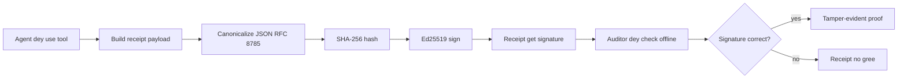
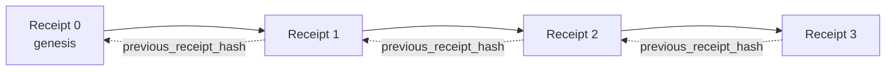

[Watch the lesson video: Securing AI Agents with Cryptographic Receipts](https://youtu.be/PLACEHOLDER_VIDEO_ID)

> _(Lesson video and thumbnail to be added by the Microsoft content team post-merge, matching the lesson 14 / 15 pattern.)_

# Securing AI Agents with Cryptographic Receipts

## Introduction

Dis lesson go cover:

- Why audit trails for AI agents matter for compliance, debugging, and trust.
- Wetin cryptographic receipt be and how e different from one unsigned log line.
- How to produce one signed receipt for agent tool call for plain Python.
- How to verify receipt offline and detect if person bend am.
- How to chain receipts so if person remove or change order for one, e go break chain.
- Wetin receipts fit prove and wetin e no fit prove.

## Learning Goals

After you finish this lesson, you go sabi how to:

- Identify failure ways wey dey make person need cryptographic proof for agent actions.
- Produce Ed25519 signed receipt on top correct JSON payload.
- Verify receipt by yourself using only signer's public key.
- Detect if dem don tamper by running verification again on changed receipt.
- Build hash chained receipts sequence and explain why chain matter.
- Know the boundary between wetin receipts prove (attribution, integrity, ordering) and wetin e no prove (correctness of action, policy soundness).

## The Problem: Your Agent's Audit Trail

Make you reason sey you don deploy AI agent for Contoso Travel. Di agent dey read customer requests, dey call flights API to find options, then e dey book seats for customer. Last quarter, di agent process 50,000 bookings.

Now auditor don show. Dem ask simple question: "Show me wetin your agent do."

You give dem your log files. Auditor look am then ask harder question: "How I go sabi sey nobody edit these logs?"

Na dis the audit-trail wahala be. Majority agent deployments these days dey rely on:

- **Application logs**: agent dey write am, anybody with file system access fit edit am.
- **Cloud logging services**: tamper-evident for platform level but only if auditor trust platform operator.
- **Database transaction logs**: good for database changes but no work for arbitrary tool calls.

None of these fit answer auditor question without auditor to trust somebody (you, your cloud provider, your database people). For internal things, trust fit dey okay. But for regulated work (finance, healthcare, EU AI Act), e no okay.

Cryptographic receipts solve dis one by making every agent action fit verify by itself. Auditor no need trust you. Dem only need your public key and receipt.

## Wetin be Cryptographic Receipt?

Receipt na JSON object wey record wetin agent do, and e get digital signature.


```mermaid
flowchart LR
    A[Agent dey use tool] --> B[Build receipt payload]
    B --> C[Canonicalize JSON RFC 8785]
    C --> D[SHA-256 hash]
    D --> E[Ed25519 sign]
    E --> F[Receipt get signature]
    F --> G[Auditor dey check offline]
    G --> H{Signature correct?}
    H -- yes --> I[Tamper-evident proof]
    H -- no --> J[Receipt no gree]
```

Minimal receipt go be like dis:

```json
{
  "type": "agent.tool_call.v1",
  "agent_id": "contoso-travel-bot",
  "tool_name": "lookup_flights",
  "tool_args_hash": "sha256:a3f9c1...",
  "result_hash": "sha256:7b2e1d...",
  "policy_id": "contoso-travel-policy-v3",
  "timestamp": "2026-04-25T14:30:00Z",
  "sequence": 47,
  "previous_receipt_hash": "sha256:9d4e6a...",
  "signature": {
    "alg": "EdDSA",
    "sig": "c5af83...",
    "public_key": "8f3b2c..."
  }
}
```

Three things dey make am work:

1. **The signature**. Receipt dey signed by agent’s gateway using Ed25519 private key. Anybody with public key fit verify signature offline. If person tamper with any field, signature no go valid again.

2. **Canonical encoding**. Before signing, receipt dey serialized with JSON Canonicalization Scheme (JCS, RFC 8785). E make sure sey two different implementations producing same receipt go produce exactly identical bytes. Without this, different JSON serializers fit give different signatures for same content.

3. **Hash chaining**. `previous_receipt_hash` field dey link every receipt to the one before am. If you remove or reorder one receipt, e go break all receipts after am. Tampering go show for chain level even if person bypass individual signatures.

These three properties together give three guarantees:

- **Attribution**: dis key na im sign dis content.
- **Integrity**: di content no change since signing.
- **Ordering**: dis receipt come after dat one for chain.

## How To Produce Receipt For Python

You no need special library to produce receipt. Cryptographic primitives plenty and di logic na just small Python lines.

Di hands-on exercises for `code_samples/18-signed-receipts.ipynb` go guide you step by step. Summary version be:

```python
import json
import hashlib
import base64
from nacl import signing
from jcs import canonicalize  # RFC 8785 canonical JSON

def b64url_nopad(data: bytes) -> str:
    return base64.urlsafe_b64encode(data).decode("ascii").rstrip("=")

def sha256_canonical(obj) -> str:
    """SHA-256 of a Python object's JCS-canonical JSON form."""
    return f"sha256:{hashlib.sha256(canonicalize(obj)).hexdigest()}"

# Make or load one signing key (for real life, keep am for key vault)
signing_key = signing.SigningKey.generate()
verify_key = signing_key.verify_key

# Build the receipt payload (no signature yet)
tool_args = {"origin": "SYD", "destination": "LAX"}
tool_result = [{"flight": "QF11", "price": 1850, "stops": 0}]

payload = {
    "type": "agent.tool_call.v1",
    "agent_id": "contoso-travel-bot",
    "tool_name": "lookup_flights",
    "tool_args_hash": sha256_canonical(tool_args),
    "result_hash": sha256_canonical(tool_result),
    "policy_id": "contoso-travel-policy-v3",
    "timestamp": "2026-04-25T14:30:00Z",
    "sequence": 0,
    "previous_receipt_hash": None,
}

# Make am canonical, hash am, sign am.
canonical_bytes = canonicalize(payload)
message_hash = hashlib.sha256(canonical_bytes).digest()
signature_bytes = signing_key.sign(message_hash).signature

# Attach one structured signature object.
receipt = {
    **payload,
    "signature": {
        "alg": "EdDSA",
        "sig": b64url_nopad(signature_bytes),
        "public_key": b64url_nopad(bytes(verify_key)),
    },
}
```

Na dat be full signing pipeline. Exercises for notebook go guide you for every step.

## How To Verify Receipt And Detect Tampering

Verification na reverse operation:

```python
import base64
import hashlib
from nacl import signing
from nacl.exceptions import BadSignatureError
from jcs import canonicalize

def b64url_decode(s: str) -> bytes:
    padding = "=" * ((4 - len(s) % 4) % 4)
    return base64.urlsafe_b64decode(s + padding)

def verify_receipt(receipt: dict) -> bool:
    # Di signature na one structured object: {"alg", "sig", "public_key"}.
    sig_obj = receipt.get("signature")
    if not sig_obj or sig_obj.get("alg") != "EdDSA":
        return False

    # Make back di payload wey dem really sign (everytin except di signature).
    payload = {k: v for k, v in receipt.items() if k != "signature"}

    canonical_bytes = canonicalize(payload)
    message_hash = hashlib.sha256(canonical_bytes).digest()

    try:
        verify_key = signing.VerifyKey(b64url_decode(sig_obj["public_key"]))
        verify_key.verify(message_hash, b64url_decode(sig_obj["sig"]))
        return True
    except BadSignatureError:
        return False
```

Dis function go take receipt, return `True` if signature valid, `False` if no. No network call, no service depend, no need trust any other person.

To see how dem detect tampering, notebook go show:

1. Produce valid receipt and confirm sey e verify.
2. Change one byte inside `tool_args_hash` field.
3. Verify again and see confirmation fail.

Dis na practical proof sey receipts dey tamper-evident: any small change go break signature.

## Chaining Receipts For Multi-Step Agents

One signed receipt dey protect one action. Chain receipts dey protect sequence.


```mermaid
flowchart LR
    R0[Receipt 0<br/>genesis] --> R1[Receipt 1]
    R1 --> R2[Receipt 2]
    R2 --> R3[Receipt 3]
    R1 -. previous_receipt_hash .-> R0
    R2 -. previous_receipt_hash .-> R1
    R3 -. previous_receipt_hash .-> R2
```

Each receipt record hash of receipt before am. If person wan remove receipt 2 without noise, e go need to either:

- Change receipt 3's `previous_receipt_hash` field (dis go break receipt 3's signature), OR
- Forge new signature on modified receipt 3 (dis need agent's private key).

If private key dey hardware key vault and you publish public key with each receipt, neither attack possible without showing.

Notebook go show:

1. Build chain of three receipts.
2. Verify sey each receipt's `previous_receipt_hash` match actual hash of prior receipt.
3. Tamper with one middle receipt and see chain break exactly for that point.

Dis na how you go provide audit trail wey external auditor fit verify without trust you.

## Wetin Receipts Prove (and Wetin Dem No Prove)

Dis na di most important part for dis lesson. Receipts get power but e get limit.

**Receipts fit prove three tins:**

1. **Attribution**: one particular key sign particular payload.
2. **Integrity**: payload no change since signing.
3. **Ordering**: dis receipt come after dat receipt for hash chain.

**Receipts no prove:**

1. **Correctness**: if agent action correct. Receipt fit sign wrong answer same way e sign correct one.
2. **Policy compliance**: if policy for `policy_id` really check or e go allow action if check. Receipt record wetin dem talk, no be wetin dem enforce.
3. **Identity beyond key**: receipt talk say "dis key sign dis content." E no talk say "dis human approve dis." To connect key to person need separate identity system (directory, public key registry, etc.).
4. **Truthfulness of inputs**: if agent get manipulated prompt and act on am, receipt go faithfully record that action. Receipts dey after input validation, no be replacement.

This boundary matter for two reasons:

- E tell you wetin receipts use for: to make agent behaviour auditable and tamper-evident, even outside organizations.
- E also tell you wetin extra layers you still need: input validation (Lesson 6), policy enforcement (briefly covered later), identity infrastructure (no be for this lesson).

Common mistake be to think say "we get receipts" mean "we dey controlled." E no be so. Receipts na foundation. Governance na system you build on top.

## Production References

Code for this lesson dey minimal make you fit read every line and understand wetin dey happen. For production, you get two options:

1. **Build direct on top cryptographic primitives.** Di 50 lines wey you see above enough for many case. PyNaCl (Ed25519) and `jcs` package (canonical JSON) na well-maintained, audited libraries.

2. **Use production receipt library.** Some open-source projects dey implement same pattern plus extra features (key rotation, batch verification, JWK Set distribution, policy engine integration):
   - Receipt format wey dis lesson use follow IETF Internet-Draft (`draft-farley-acta-signed-receipts`) wey dey standards process.
   - Microsoft Agent Governance Toolkit combine receipts with Cedar-based policy decisions; see Tutorial 33 for full example.
   - `protect-mcp` (npm) and `@veritasacta/verify` (npm) provide Node implementation for receipt signing and offline verification, to wrap MCP server with tamper-proof audit trail.
   - **[nobulex](https://github.com/arian-gogani/nobulex)** Python SDK (`pip install nobulex`) provide same Ed25519 + JCS signing pattern for Python with LangChain and CrewAI integration, include published test vectors and compliance mapping via [OWASP PR #2210](https://github.com/OWASP/CheatSheetSeries/pull/2210).

Whether you go build your own or use library be like whether you go write your own JWT library or use tested one: both good; library save time and reduce audit risk; from scratch make you understand every primitive. Dis lesson teach from scratch so you get solid base for both choices.

## Knowledge Check

Test your understanding before practice exercise.

**1. Receipt sign with agent's private Ed25519 key. Auditor get only public key. Auditor fit verify receipt offline?**

<details>
<summary>Answer</summary>

Yes. Ed25519 verification fit use only public key and signed bytes. No network or service call needed. Dis property make receipts useful for air-gapped, multi-org, or low-trust audit.
</details>

**2. Attacker change `policy_id` field inside receipt to claim e follow more permissive policy. Signature na for original payload. Wetin go happen for verification?**

<details>
<summary>Answer</summary>

Verification fail. Signature computed on canonical bytes of original payload; change any field change canonical bytes, change SHA-256 hash, signature no valid. Attacker need private key to produce fresh valid signature, wey dem no get.
</details>

**3. Why receipt get `tool_args_hash` and `result_hash` instead of raw args and result?**

<details>
<summary>Answer</summary>

Two reasons. First, receipt fit need archive or send for environment wey to show raw content (PII, business data) na problem. Hash keep receipt small and private; auditor fit verify hash with separate stored full content. Second, hashes get fixed size; receipt with hashes size no go change based on size of inputs or outputs.
</details>

**4. `previous_receipt_hash` link each receipt with prior one. If attacker silently delete one middle receipt, wetin go become invalid?**

<details>
<summary>Answer</summary>

Every receipt after deleted one go invalid. Their `previous_receipt_hash` no go match chain (cos receipt dem refer don disappear or chain point different predecessor). To hide deletion, attacker must re-sign every later receipt, need private key.
</details>

**5. Receipt verify clean. E prove agent's action correct, sound, or follow policy?**

<details>
<summary>Answer</summary>

No. Valid receipt prove three tins: attribution (which key sign content), integrity (content no change), ordering (receipt come after other). E no prove action correct, policy checked, or agent follow rule. Receipts make agent behaviour auditable, no be necessarily correct. Dis na most important boundary for lesson.
</details>

## Practice Exercise

Open `code_samples/18-signed-receipts.ipynb` and try all four sections:

1. **Section 1**: Sign your first receipt and verify am.
2. **Section 2**: Tamper with receipt and see verification fail.
3. **Section 3**: Build three receipt chain and verify integrity.
4. **Section 4**: Use pattern for agent built with Microsoft Agent Framework: wrap tool call with receipt signing, then verify receipt alone.


**Stretch challenge 1:** extend di receipt schema wit one extra field wey you choose (like, request ID for tracing), update di canonical signing logic make e include am, den confirm say di receipt still fit round-trip through verification. After dat, change di field afta you don sign am, den confirm say verification no go pass. Dis one go make you sabi how every byte for di canonical encoding dey affect di signature.

**Stretch challenge 2:** SHA-256-hash two of your receipts together (join dia canonical bytes for correct order) den put di resulting digest as new field for one third receipt before you sign am. Check say all three receipts still fit round-trip. Na so you dey build one-step inclusion proof: anybody wey get di third receipt fit prove say di first two dey when e sign am, without show wetin complete. Dis na wetin selective-disclosure receipts dey use normally (Merkle commitments, RFC 6962).

## Conclusion

Cryptographic receipts dey give AI agents audit trail wey be:

- **Independently verifiable**: anybody wey get di public key fit verify, no need service to depend on.
- **Tamper-evident**: any change go spoil di signature.
- **Portable**: receipt na small JSON file; e fit store, send, and verify anywhere.
- **Standards-aligned**: built on Ed25519 (RFC 8032), JCS (RFC 8785), and SHA-256, all of dem widespread primitives.

Dem no fit replace input validation, policy enforcement, or identity setup. Na base for dem layers be dat. If you dey use agents for regulated work, multi-organization workflow, or anywhere wey auditor in future no fit sabi trust you, receipts na how you go make audit trail honest.

Most important thing: receipts dey prove who talk wetin, wen. Dem no prove say wetin dem talk na true or correct. Make you hold dat distinction well well. Na di difference between honest provenance system and misleading one.

## Production Checklist

Wen you ready move comot for dis lesson to put receipt-signed agents for real environment:

- [ ] **Take di signing key comot from developer laptop.** Use Azure Key Vault, AWS KMS, or hardware security module. Private key wey dey sign your receipts no suppose live for source control or as plaintext for your machines.
- [ ] **Publish di verification public key.** Auditors need am make dem fit verify offline. Normal way na JWK Set wey dey for one known URL (RFC 7517), like `https://your-org.example.com/.well-known/agent-keys.json`.
- [ ] **Anchor di chain outside.** Every time, write di latest chain head hash for transparency log (Sigstore Rekor, RFC 3161 timestamp authority, or another internal system) so outside people fit confirm "dis chain dey for dis time."
- [ ] **Store receipts without change.** Use append-only blob storage (Azure Storage wit immutability policies, AWS S3 Object Lock) to stop insider from rewriting history inside storage.
- [ ] **Decide how long to keep am.** Plenty compliance regimes require make you keep am for many years. Plan for receipt growth (each receipt be about 500 bytes; if agent dey make 10K calls per day, e go produce about 1.8 GB per year).
- [ ] **Document wetin receipts no cover.** Receipts dey prove attribution, integrity, and ordering. Your runbook suppose clearly list wetin other controls (input validation, policy enforcement, rate limiting, identity infrastructure) dey do alongside receipts for your governance.

### You get More Questions about Securing AI Agents?

Join di [Microsoft Foundry Discord](https://aka.ms/ai-agents/discord) to meet other learners, attend office hours, and get your AI Agents questions answered.

## Beyond This Lesson

Dis lesson show how to sign single receipt and hash-chain sequences. Di same primitives still fit build other advanced patterns as your governance improve:

- **Selective disclosure.** If receipt fields get independent commitment (like RFC 6962 Merkle tree), you fit show certain fields to certain auditors and prove others never change without exposing them. E good when same receipt suppose satisfy both broad audit (wey want everything) and data rules like GDPR (wey want auditor see only wetin e need).
- **Receipt revocation.** If signing key spoil, you need way to mark all receipts signed by dat key as no longer trusted from some time. Standard na short-lived signing keys plus published revocation list, or transparency log with revocation entries.
- **Bilateral / split-signature receipts.** Some systems split signed payload into pre-execution (`authorization_*`) and post-execution (`result_*`) parts with independent signature, good when authorization decision and observed result na from different actors or time. Dis still fit combine on top of receipt format wey dis lesson teach.
- **Payload composition.** Receipt seal di bytes wey you put for `result_hash`. Real payload often get more than one tool call result: pre-decision reasoning (model prediction, options wey dem consider, evidence and how complete e be, risk posture, accountability chain, gate result) fit dey inside payload, sealed by one receipt. Dis one keep receipt format simple but payload schemas fit evolve for each domain.
- **Cross-implementation conformance.** Many independent implementation of same receipt format (Python, TypeScript, Rust, Go) fit cross-verify with shared test vectors. If you build your own, validating wit published vectors confirm say e fit work with others.
- **Post-quantum migration.** Ed25519 widespread today but no go resist quantum attack. Receipt format dey algorithm-flexible: `signature.alg` field fit carry `ML-DSA-65` (NIST post-quantum signature standard) when you wan migrate. Plan for period wey receipts go dual-sign.

## Additional Resources

- <a href="https://datatracker.ietf.org/doc/draft-farley-acta-signed-receipts/" target="_blank">IETF Internet-Draft: Signed Decision Receipts for Machine-to-Machine Access Control</a>
- <a href="https://learn.microsoft.com/azure/ai-studio/responsible-use-of-ai-overview" target="_blank">Responsible AI overview (Azure AI)</a>
- <a href="https://datatracker.ietf.org/doc/html/rfc8032" target="_blank">RFC 8032: Edwards-Curve Digital Signature Algorithm (EdDSA)</a>
- <a href="https://datatracker.ietf.org/doc/html/rfc8785" target="_blank">RFC 8785: JSON Canonicalization Scheme (JCS)</a>
- <a href="https://datatracker.ietf.org/doc/html/rfc6962" target="_blank">RFC 6962: Certificate Transparency</a> (Merkle-tree construction wey selective-disclosure receipts use)
- <a href="https://github.com/microsoft/agent-governance-toolkit/blob/main/docs/tutorials/33-offline-verifiable-receipts.md" target="_blank">Microsoft Agent Governance Toolkit, Tutorial 33: Offline-Verifiable Decision Receipts</a>
- <a href="https://github.com/ScopeBlind/agent-governance-testvectors" target="_blank">Cross-implementation conformance test vectors</a> for di receipt format wey lesson use (Apache-2.0)
- <a href="https://pynacl.readthedocs.io/" target="_blank">PyNaCl documentation</a> (Ed25519 for Python)

## Previous Lesson

[Building Computer Use Agents (CUA)](../15-browser-use/README.md)

---

<!-- CO-OP TRANSLATOR DISCLAIMER START -->
**Disclaimer**:
Dis document don translate wit AI translation service [Co-op Translator](https://github.com/Azure/co-op-translator). Even tho we dey try make am correct, abeg make you know say automated translation fit get errors or mistakes. Di original document for dia own language na im be di correct source. For important info, make person wey sabi human translation do am. We no go responsible for any misunderstanding or wrong understanding wey fit happen because of dis translation.
<!-- CO-OP TRANSLATOR DISCLAIMER END -->