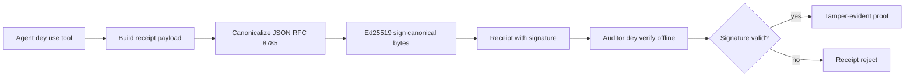
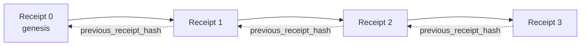

[Watch di lekson video: Securing AI Agents wit Cryptographic Receipts](https://youtu.be/PLACEHOLDER_VIDEO_ID)

> _(Lekson video an thumbnail go add by Microsoft content team after dem merge am, e go follow lekson 14 / 15 pattern.)_

# Securing AI Agents wit Cryptographic Receipts

## Introduction

Dis lekson go cover:

- Why audit trails for AI agents dey matter for compliance, debugging, an trust.
- Wetin cryptographic receipt be an how e different from unsigned log line.
- How to produce signed receipt for agent tool call for normal Python.
- How to verify receipt offline an find tampering.
- How to chain receipts so that if person remove or reorder one, e go break di chain.
- Wetin receipts prove an wetin dem no dey prove.

## Learning Goals

After you finish dis lekson, you go sabi how to:

- Identify the failure modes wey dey make people need cryptographic provenance for agent actions.
- Produce Ed25519-signed receipt over canonical JSON payload.
- Verify receipt on e own wit only signer's public key.
- Detect tampering by to run verification again for modified receipt.
- Build hash-chained sequence of receipts an explain why chain dey important.
- Recognize boundary between wetin receipt prove (attribution, integrity, ordering) an wetin e no prove (correctness of action, soundness of policy).

## The Problem: Your Agent's Audit Trail

Imagine say you don deploy AI agent for Contoso Travel. Di agent go read customer requests, call flights API to check options, an book seat for customer behalf. Last quarter, di agent handle 50,000 bookings.

Today auditor show. Dem ask simple question: "Show me wetin your agent do."

You give dem your log files. Auditor look dem an ask harder question: "How I sabi say log no bi edit?"

Dis na audit-trail problem. Most agent wey dem deploy today rely on:

- **Application logs**: wey agent write by itself, but anybody wey get file system access fit edit am.
- **Cloud logging services**: e dey tamper-evident for platform level but only if auditor trust platform operator.
- **Database transaction logs**: good for database changes but no good for arbitrary tool calls.

None of dem go fit answer auditor question without make auditor trust person (you, your cloud provider, your database vendor). For internal use, dis trust dey usually acceptable. But for regulated work (finance, healthcare, anything wey EU AI Act cover), e no dey acceptable.

Cryptographic receipts solve dis by making every agent action fit verify independently. Auditor no need to trust you. Dem only need your public key and the receipt.

## Wetin Cryptographic Receipt Be?

Receipt na JSON object wey record wetin agent do, sign wit digital signature.


```mermaid
flowchart LR
    A[Agent dey use tool] --> B[Build receipt payload]
    B --> C[Canonicalize JSON RFC 8785]
    C --> E[Ed25519 sign canonical bytes]
    E --> F[Receipt with signature]
    F --> G[Auditor dey verify offline]
    G --> H{Signature valid?}
    H -- yes --> I[Tamper-evident proof]
    H -- no --> J[Receipt reject]
```

Minimal receipt go look like dis:

```json
{
  "type": "agent.tool_call.v1",
  "agent_id": "contoso-travel-bot",
  "tool_name": "lookup_flights",
  "tool_args_hash": "sha256:a3f9c1...",
  "result_hash": "sha256:7b2e1d...",
  "policy_id": "contoso-travel-policy-v3",
  "timestamp": "2026-04-25T14:30:00Z",
  "sequence": 47,
  "previous_receipt_hash": "sha256:9d4e6a...",
  "signature": {
    "alg": "EdDSA",
    "sig": "c5af83...",
    "public_key": "8f3b2c..."
  }
}
```

Three properties dey do di work:

1. **The signature**. Di receipt na agent gateway sign wit Ed25519 private key. Anybody wey get correct public key fit verify signature offline. If tamper with any field, signature go invalid.

2. **Canonical encoding**. Before dem sign am, di receipt dey serialized using JSON Canonicalization Scheme (JCS, RFC 8785). Dis make sure say two implementation wey produce same logical receipt go produce byte-identical output. If no canonicalization, different JSON serializers go produce different signatures for same content.

3. **Hash chaining**. Di `previous_receipt_hash` field link each receipt to di one before am. If person remove or reorder receipt, e go break every receipt wey follow am. Tampering go dey visible for di chain level even if individual signatures dem bypass.

Together, dis properties give three guarantees:

- **Attribution**: dis key na im sign dis content.
- **Integrity**: di content no change since dem sign am.
- **Ordering**: dis receipt come after dat receipt for di chain.

## Producing Receipt for Python

You no need special library to produce receipt. Cryptographic primitives dey everywhere an di logic na just small Python lines.

Hands-on exercises for `code_samples/18-signed-receipts.ipynb` go show you whole flow. E summary version:

```python
import json
import hashlib
import base64
from nacl import signing
from jcs import canonicalize  # RFC 8785 canonical JSON

def b64url_nopad(data: bytes) -> str:
    return base64.urlsafe_b64encode(data).decode("ascii").rstrip("=")

def sha256_canonical(obj) -> str:
    """SHA-256 of a Python object's JCS-canonical JSON form."""
    return f"sha256:{hashlib.sha256(canonicalize(obj)).hexdigest()}"

# Make or load one signing key (for production, put am for key vault)
signing_key = signing.SigningKey.generate()
verify_key = signing_key.verify_key

# Build di receipt payload (no signature dey yet)
tool_args = {"origin": "SYD", "destination": "LAX"}
tool_result = [{"flight": "QF11", "price": 1850, "stops": 0}]

payload = {
    "type": "agent.tool_call.v1",
    "agent_id": "contoso-travel-bot",
    "tool_name": "lookup_flights",
    "tool_args_hash": sha256_canonical(tool_args),
    "result_hash": sha256_canonical(tool_result),
    "policy_id": "contoso-travel-policy-v3",
    "timestamp": "2026-04-25T14:30:00Z",
    "sequence": 0,
    "previous_receipt_hash": None,
}

# Canonicalize and sign di JCS bytes direct. PureEdDSA dey hash am inside.
canonical_bytes = canonicalize(payload)
signature_bytes = signing_key.sign(canonical_bytes).signature

# Attach one structured signature object.
receipt = {
    **payload,
    "signature": {
        "alg": "EdDSA",
        "sig": b64url_nopad(signature_bytes),
        "public_key": b64url_nopad(bytes(verify_key)),
    },
}
```

Dis na the whole signing pipeline. Exercises for notebook go show you every step.

## Verify Receipt an Detect Tampering

Verification na di opposite operation:

```python
import base64
import hashlib
from nacl import signing
from nacl.exceptions import BadSignatureError
from jcs import canonicalize

def b64url_decode(s: str) -> bytes:
    padding = "=" * ((4 - len(s) % 4) % 4)
    return base64.urlsafe_b64decode(s + padding)

def verify_receipt(receipt: dict) -> bool:
    # Di signature na one structured object: {"alg", "sig", "public_key"}.
    sig_obj = receipt.get("signature")
    if not sig_obj or sig_obj.get("alg") != "EdDSA":
        return False

    # Make back di payload wey dem really sign (everything but di signature).
    payload = {k: v for k, v in receipt.items() if k != "signature"}

    canonical_bytes = canonicalize(payload)

    try:
        verify_key = signing.VerifyKey(b64url_decode(sig_obj["public_key"]))
        verify_key.verify(canonical_bytes, b64url_decode(sig_obj["sig"]))
        return True
    except BadSignatureError:
        return False
```

Dis function go take receipt an return `True` if signature correct, `False` if no. No network call, no service wahala, no trust for third party needed.

To see tampering detection work, di notebook go:

1. Produce valid receipt an confirm say e verify.
2. Change one byte for `tool_args_hash` field.
3. Re-run verify an see e fail.

Dis na practical demonstration say receipts dey tamper-evident: any small change, e break signature.

## Chain Receipts for Multi-Step Agents

One single signed receipt dey protect one action. Chain of receipts protect sequence.


```mermaid
flowchart LR
    R0[Receipt 0<br/>genesis] --> R1[Receipt 1]
    R1 --> R2[Receipt 2]
    R2 --> R3[Receipt 3]
    R1 -. previous_receipt_hash .-> R0
    R2 -. previous_receipt_hash .-> R1
    R3 -. previous_receipt_hash .-> R2
```

Every receipt record hash of receipt before am. To remove receipt 2 without noise, attacker must either:

- Change receipt 3's `previous_receipt_hash` field (go break receipt 3 signature), OR
- Forge new signature on modified receipt 3 (need agent's private key).

If private key dey hardware key vault and you publish public key with each receipt, no attack fit succeed without detection.

Notebook go:

1. Build chain of three receipts.
2. Verify say every receipt's `previous_receipt_hash` match actual hash of previous receipt.
3. Tamper with one receipt for middle an see di chain break for dat exact point.

Dis na how you go produce audit trail wey external auditor fit verify without trust you.

## Wetin Receipts Prove (An Wetin Dem No Prove)

Dis na di most important part for dis lesson. Receipts powerful but power restrict.

**Receipts prove three tins:**

1. **Attribution**: one key sign one payload.
2. **Integrity**: payload no change since sign.
3. **Ordering**: dis receipt come after dat receipt for hash chain.

**Receipts no prove:**

1. **Correctness**: say agent action na correct action. Receipt fit sign wrong answer same way e sign correct answer.
2. **Policy compliance**: say policy wey dey `policy_id` dem really check am, or say e for permit action if dem check. Receipt record wetin dem claim, no be wetin dem enforce.
3. **Identity beyond the key**: receipt talk say "dis key sign dis content." E no talk say "dis human authorize dis." To link key to person or organization need separate identity system (directory, public key registry, etc).
4. **Truthfulness of inputs**: if agent get manipulated prompt an act on am, receipt record action well well. Receipts dey downstream of input validation, no be replacement for am.

Dis boundary important for two reasons:

- E tell you wetin receipts useful for: to make agent behavior auditable an tamper-evident, even across organizations.
- E tell you wetin extra layers still need: input validation (Lesson 6), policy enforcement (briefly talk below), an identity system (not part of dis lesson).

One common mistake be say "we get receipts" mean "we dey governed." Na lie. Receipts na foundation. Governance na system wey you build on top.

## Prove Say Human Approve Exact Action

Point 3 for above worth separate section: action receipt talk say "dis key sign dis content," no be "human authorize am." For high-risk actions (refunds, deletions, wire transfers), governance framework dey require exactly dis missing statement, and you fit produce am wit same primitives wey you don build for dis lesson.

Di next notebook `code_samples/human-authorization-receipts.ipynb` add second receipt kind, `human.approval.v1`, for same envelope shape as lesson receipt (typed payload sign by Ed25519 over canonical JCS bytes, wit `signature` object outside signed bytes). Named approver go sign **full canonical action an action digest** before execution; agent's action receipt get **same action digest** and `parent_approval_ref`, di `receipt_hash` of approval, same convention as `previous_receipt_hash` for chain you build above. One `verify_chain` go check both artifacts under **separate pinned key registries** (approver keys vs agent keys), so code path dey shared but authority no dey shared.

Di property wey dis buy, na say: *human approve dis exact action, an agent execute exactly dat approved action.* Notebook refusal examples na wetin make property real, no be just talk:

- di classic set: tampering, confused deputy, replay, forged keys for both sides, malformed input;
- **stale authority**: signature still verify but refuse cos policy version change, approver key rotate out pinned registry, or approval expire before execution;
- **digest substitution**: validly sign action receipt point to *real* approval wey bind *different* canonical action.

Each failure go refuse wit different reason, so auditor wey read refusal fit know whether authority stale or action change. Rule wey notebook teach: signed approval no mean authority by itself. Authority dey valid only if both receipts bind to same canonical action for execution time. Human-approval receipt na educational composition wey lesson define, no be receipt type from `draft-farley-acta-signed-receipts`.

## Production References

Python code for dis lesson minimal make you fit read every line an understand everything wey dey happen. For production, you get two choices:

1. **Build direct on cryptographic primitives.** Di 50 lines you see above sufficient for many use cases. PyNaCl (Ed25519) an `jcs` package (canonical JSON) na good libraries wey maintain well an audited.

2. **Use production receipt library.** Some open-source projects implement same pattern wit extra features (key rotation, batch verification, JWK Set distribution, policy engines integration):
   - Signing pipeline use JCS an signature-scope conventions inside independent IETF Internet-Draft ([`draft-farley-acta-signed-receipts`](https://datatracker.ietf.org/doc/draft-farley-acta-signed-receipts/), revision 02). Dis lesson flat educational receipt differ from draft `{payload, signature}` envelope an e no be conformant implementation. Draft publish shared conformance suite ([agent-governance-testvectors](https://github.com/ScopeBlind/agent-governance-testvectors)) for implementations wey target wire format.
   - Microsoft Agent Governance Toolkit compose receipts wit Cedar-based policy decisions; check Tutorial 33 for repository for end-to-end example.
   - `protect-mcp` (npm) and `@veritasacta/verify` (npm) packages provide Node-based implementation of receipt signing an offline verification, meant for wrapping any MCP server wit tamper-evident audit trail, including held-for-co-sign flow where paused action emit approval receipt bound to action digest (WebAuthn-backed for desktop flow), same approval-receipt pattern as human-authorization notebook above.
   - **[nobulex](https://github.com/arian-gogani/nobulex)** Python SDK (`pip install nobulex`) provide same Ed25519 + JCS signing pattern for Python wit LangChain an CrewAI integrations, include cross-validation test vectors an compliance mapping contributed thru [OWASP PR #2210](https://github.com/OWASP/CheatSheetSeries/pull/2210).

Decision to roll your own or use library na like decision to write your own JWT lib or use tested one: both fine; library save time an reduce audit area; from-scratch approach force you understand every primitive. Dis lesson teach from-scratch way so you get foundation for either choice.

## Knowledge Check

Test your understanding before you move go practice exercise.

**1. Receipt sign wit agent's private Ed25519 key. Auditor get only public key. Auditor fit verify receipt offline?**

<details>
<summary>Answer</summary>

Yes. Ed25519 verification need only public key an signed bytes. No network call, no service wahala. Dis na wetin make receipts useful for air-gapped, multi-organization, or low-trust audit environment.
</details>

**2. Attacker change `policy_id` field for receipt to claim say e dey governed by more permissive policy. Signature na for original payload. Wetin go happen during verification?**

<details>
<summary>Answer</summary>


Verification no work. Dem calculate di signature on top di exact bytes wey di original payload get; if person change any field, e go change di bytes dem, wey go make di signature no correct again. Di bad person gats get di private key to fit produce new correct signature, but dia no get am.
</details>

**3. Why receipt get `tool_args_hash` and `result_hash` instead of di raw arguments and result?**

<details>
<summary>Answer</summary>

Two reasons dey. First, dem fit need put di receipt for storage or send am for places wey no suppose leak di original content (like PII, business data). Hashing keep di receipt small and di content private; di auditor fit check say di hash match di copy wey dem for storage separately. Second, hashes get fixed size; so receipt wey get hashes get size limit whatever di size of di inputs and outputs be.
</details>

**4. Di `previous_receipt_hash` field join every receipt to di one before am. If bad person silently comot one receipt from middle of chain, wetin go spoil?**

<details>
<summary>Answer</summary>

Every receipt wey come after di one wey dem comot go spoil. Their `previous_receipt_hash` no go match di real chain again (because di receipt wey dem reference no dey again, or chain dey point to different predecessor now). To hide di comot, di bad person go gats re-sign all di later receipts, and dat one need di private key.
</details>

**5. Receipt verify well. E mean di agent action dey correct, make sense, or e follow di rules?**

<details>
<summary>Answer</summary>

No. Correct receipt dey prove three tins: attribution (dis key na im sign di content), integrity (content no change), and ordering (dis receipt come after dat one). E no mean say di action correct be dat, or say di policy inside `policy_id` really check, or say di agent follow every rule. Receipt just make agent behavior dey auditable, no be say dem correct. Dis na di most important lesson boundary.
</details>

## Practice Exercise

Open `code_samples/18-signed-receipts.ipynb` and finish all four sections:

1. **Section 1**: Sign your first receipt and verify am.
2. **Section 2**: Change di receipt small and notice say verification no work again.
3. **Section 3**: Make chain of three receipts and verify say di chain dey alright.
4. **Section 4**: Use di pattern with agent made for Microsoft Agent Framework: wrap tool call inside receipt-signing, then verify di receipt separately.

**Stretch challenge 1:** add one more field for di receipt schema wey you choose (like request ID for tracing), update di canonical signing logic to include am, and confirm say di receipt still dey verify well. Then change di field after sign and confirm say verification fail. Dis one go make you sabi how every byte for di canonical encoding dey affect di signature.

**Stretch challenge 2:** SHA-256-hash two of your receipts joined together (combine their canonical bytes in correct order) and add di result as new field for third receipt before you sign am. Check say all three receipts still verify well. You don make one-step inclusion proof: anybody wey get di third receipt fit prove say di first two receipts dey when e sign, without showing their content. Na di pattern wey selective-disclosure receipts dey use (Merkle commitments, RFC 6962).

## Conclusion

Cryptographic receipts dey give AI agents audit trail wey be:

- **Fit verify independently**: anybody wey get di public key fit verify, no need depend on any service.
- **Tamper-evident**: any change go spoil di signature.
- **Portable**: receipt na small JSON file; e fit keep, send, and verify anywhere.
- **Standards aligned**: e base on Ed25519 (RFC 8032), JCS (RFC 8785), and SHA-256, all wey everybody dey use.

Dem no be replacement for input validation, policy enforcement, or identity system. Dem be base for those layers. When you dey put agents for regulated work, multi-organization workflows, or anywhere wey future auditor no go easy trust you, receipts na how you fit make audit trail honest.

Di most important tori: receipts dey prove who talk wetin and when. Dem no dey prove say wetin dem talk true or correct. Make you hold dat difference tight. Na di difference between honest provenance system and one wey dey mislead.

## Production Checklist

When you ready to move from dis lesson go deploy receipt-signed agents for real environment:

- [ ] **Use signing key wey no dey developer laptop.** Use Azure Key Vault, AWS KMS, or hardware security module. Private key wey sign your receipts no suppose ever dey source control or plain for any app machine.
- [ ] **Publish di verification public key.** Auditors need am to verify offline. Standard na JWK Set at well-known URL (RFC 7517), e.g., `https://your-org.example.com/.well-known/agent-keys.json`.
- [ ] **Anchor di chain outside.** Write latest chain head hash for transparency log sometimes (Sigstore Rekor, RFC 3161 timestamp authority, or second internal system) so outsiders fit confirm "this chain dey this time."
- [ ] **Store receipts wey never fit change.** Use append-only blob storage (Azure Storage with immutability policies, AWS S3 Object Lock) to stop insiders from changing history for storage layer.
- [ ] **Decide retention.** Many compliance rules gats keep for many years. Plan for receipt size growth (each receipt na ~500 bytes; agent wey make 10K calls per day go produce ~1.8 GB per year).
- [ ] **Write down wetin receipts no cover.** Receipts prove attribution, integrity, and ordering. Your runbook suppose clear about wahala for other controls (input validation, policy enforcement, rate limiting, identity infrastructure) wey dey your governance alongside receipts.

### Get More Questions About Securing AI Agents?

Join di [Microsoft Foundry Discord](https://aka.ms/ai-agents/discord) to meet other learners, attend office hours, and ask your AI Agents questions.

## Beyond This Lesson

Dis lesson dey explain single-receipt signing and hash-chained sequences. Di same primitives fit combine to form more advanced patterns wey you go meet as your governance mature:

- **Selective disclosure.** If receipt fields don independent proof (RFC 6962-style Merkle tree), you fit show some fields to certain auditors and prove di rest no change without showing them. Good if one receipt have to satisfy big audit (wey want everything) and data-minimization laws like GDPR (wey want auditor see as small as possible).
- **Receipt revocation.** If private key spoil, you need way to mark all receipts signed with dat key as untrusted from one time. Standard ways: short-lived keys plus published revocation list, or transparency log wey get revocation entries.
- **Bilateral / split-signature receipts.** Some systems split di signed payload into pre-execution (`authorization_*`) and post-execution (`result_*`) parts with separate signatures, good when authorization decision and result come from different actors or times. E fit build on top of di receipt format wey dis lesson show.
- **Payload composition.** Receipt lock whatever bytes you put inside `result_hash`. Real-world payloads dey usually more complex than one tool call result: pre-decision reasoning (model prediction, options considered, evidence and if e complete, risk posture, accountability chain, gate outcome) fit dey inside payload, sealed by single receipt. This keep receipt format small but let payload schemas grow per domain.
- **Cross-implementation conformance.** Many independent implementations of same receipt format (Python, TypeScript, Rust, Go) verify same test vectors. If you make your own, checking published vectors proves wire compatibility.
- **Post-quantum migration.** Ed25519 popular today but no get quantum resistance. Receipt format fit change algorithm: di `signature.alg` fit be `ML-DSA-65` (NIST post-quantum signature standard) when you wan migrate. Plan transition time where receipts get two signatures.

## Additional Resources

- <a href="https://datatracker.ietf.org/doc/draft-farley-acta-signed-receipts/" target="_blank">IETF Internet-Draft: Signed Decision Receipts for Machine-to-Machine Access Control</a>
- <a href="https://learn.microsoft.com/azure/ai-studio/responsible-use-of-ai-overview" target="_blank">Responsible AI overview (Azure AI)</a>
- <a href="https://datatracker.ietf.org/doc/html/rfc8032" target="_blank">RFC 8032: Edwards-Curve Digital Signature Algorithm (EdDSA)</a>
- <a href="https://datatracker.ietf.org/doc/html/rfc8785" target="_blank">RFC 8785: JSON Canonicalization Scheme (JCS)</a>
- <a href="https://datatracker.ietf.org/doc/html/rfc6962" target="_blank">RFC 6962: Certificate Transparency</a> (Merkle-tree construction wey selective-disclosure receipts use)
- <a href="https://github.com/microsoft/agent-governance-toolkit/blob/main/docs/tutorials/33-offline-verifiable-receipts.md" target="_blank">Microsoft Agent Governance Toolkit, Tutorial 33: Offline-Verifiable Decision Receipts</a>
- <a href="https://github.com/ScopeBlind/agent-governance-testvectors" target="_blank">Cross-implementation conformance test vectors</a> for receipt format wey dis lesson use (Apache-2.0)
- <a href="https://pynacl.readthedocs.io/" target="_blank">PyNaCl documentation</a> (Ed25519 for Python)

## Previous Lesson

[Creating Local AI Agents](../17-creating-local-ai-agents/README.md)

---

<!-- CO-OP TRANSLATOR DISCLAIMER START -->
**Disclaimer**:
Dis document don translate wit AI translation service [Co-op Translator](https://github.com/Azure/co-op-translator). Even tho we dey try make am correct, abeg make you know say automated translation fit get errors or mistakes. Di original document for dia own language na im be di correct source. For important info, make person wey sabi human translation do am. We no go responsible for any misunderstanding or wrong understanding wey fit happen because of dis translation.
<!-- CO-OP TRANSLATOR DISCLAIMER END -->