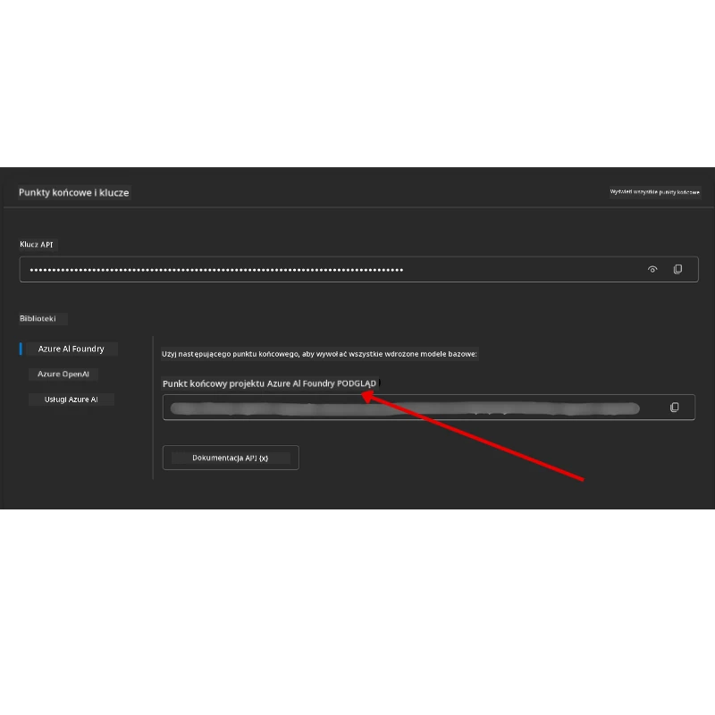

# Konfiguracja kursu

## Wprowadzenie

Ta lekcja pokaże, jak uruchamiać przykładowe kody z tego kursu.

## Dołącz do innych uczniów i uzyskaj pomoc

Przed rozpoczęciem klonowania repozytorium, dołącz do [kanału Discord AI Agents For Beginners](https://aka.ms/ai-agents/discord), aby uzyskać pomoc przy konfiguracji, zadać pytania dotyczące kursu lub połączyć się z innymi uczniami.

## Sklonuj lub forkuj to repozytorium

Aby rozpocząć, proszę sklonować lub forknąć repozytorium GitHub. Utworzysz w ten sposób własną wersję materiałów kursu, dzięki czemu będziesz mógł uruchamiać, testować i modyfikować kod!

Można to zrobić, klikając link <a href="https://github.com/microsoft/ai-agents-for-beginners/fork" target="_blank">aby forknąć repozytorium</a>.

Powinieneś teraz mieć własną, zforkowaną wersję tego kursu pod poniższym linkiem:


### Płytkie klonowanie (zalecane dla warsztatów / Codespaces)

  >Pełne repozytorium może być duże (~3 GB) gdy pobierasz całą historię i wszystkie pliki. Jeśli uczestniczysz tylko w warsztacie lub potrzebujesz tylko kilku folderów z lekcjami, płytkie klonowanie (lub klonowanie fragmentaryczne) pozwala uniknąć większości tego pobierania przez obcięcie historii i/lub pominięcie blobów.

#### Szybkie płytkie klonowanie — minimalna historia, wszystkie pliki

Zamień `<your-username>` w poniższych poleceniach na URL swojego forka (lub URL upstream, jeśli wolisz).

Aby sklonować tylko najnowszą historię commitów (małe pobranie):

```bash|powershell
git clone --depth 1 https://github.com/<your-username>/ai-agents-for-beginners.git
```

Aby sklonować konkretną gałąź:

```bash|powershell
git clone --depth 1 --branch <branch-name> https://github.com/<your-username>/ai-agents-for-beginners.git
```

#### Częściowe (fragmentaryczne) klonowanie — minimalne bloby + wybrane foldery

To używa częściowego klonowania oraz sparse-checkout (wymaga Git 2.25+ i zalecane nowoczesne Git z obsługą częściowego klonowania):

```bash|powershell
git clone --depth 1 --filter=blob:none --sparse https://github.com/<your-username>/ai-agents-for-beginners.git
```

Przejdź do folderu repozytorium:

```bash|powershell
cd ai-agents-for-beginners
```

Następnie określ, które foldery chcesz (przykład pokazuje dwa foldery):

```bash|powershell
git sparse-checkout set 00-course-setup 01-intro-to-ai-agents
```

Po sklonowaniu i zweryfikowaniu plików, jeśli potrzebujesz tylko plików i chcesz zwolnić miejsce (bez historii git), usuń metadane repozytorium (💀nieodwracalne — stracisz całą funkcjonalność Git: nie będzie commitów, pulli, pushów ani dostępu do historii).

```bash
# zsh/bash
rm -rf .git
```

```powershell
# PowerShell
Remove-Item -Recurse -Force .git
```

#### Używanie GitHub Codespaces (zalecane do uniknięcia dużych pobrań lokalnych)

- Utwórz nowy Codespace dla tego repozytorium za pomocą [interfejsu GitHub](https://github.com/codespaces).  

- W terminalu nowo utworzonego codespace'a, uruchom jedno z poleceń płytkiego lub fragmentarycznego klonowania, aby pobrać tylko potrzebne foldery z lekcjami do środowiska Codespace.
- Opcjonalnie: po klonowaniu w Codespaces usuń folder .git, aby odzyskać miejsce (patrz polecenia usuwania powyżej).
- Uwaga: Jeśli wolisz otworzyć repozytorium bezpośrednio w Codespaces (bez dodatkowego klonowania), pamiętaj, że Codespaces utworzy środowisko devcontainer i może nadal zainstalować więcej niż potrzebujesz. Sklonowanie płytkiej kopii wewnątrz świeżego Codespace'a daje większą kontrolę nad zużyciem dysku.

#### Wskazówki

- Zawsze zamieniaj URL klonowania na swój fork, jeśli chcesz edytować/commitować.
- Jeśli później potrzebujesz więcej historii lub plików, możesz je pobrać lub dostosować sparse-checkout tak, by uwzględnić dodatkowe foldery.

## Uruchamianie kodu

Ten kurs oferuje serię notatników Jupyter, które możesz uruchamiać, aby zdobyć praktyczne doświadczenie w tworzeniu Agentów AI.

Przykładowe kody używają **Microsoft Agent Framework (MAF)** z `AzureAIProjectAgentProvider`, który łączy się z **Azure AI Agent Service V2** (API odpowiedzi) przez **Microsoft Foundry**.

Wszystkie notatniki Python są oznaczone jako `*-python-agent-framework.ipynb`.

## Wymagania

- Python 3.12+
  - **UWAGA**: Jeśli nie masz zainstalowanego Pythona 3.12, zainstaluj go. Następnie utwórz środowisko wirtualne za pomocą python3.12, aby mieć pewność, że instalowane są właściwe wersje pakietów z pliku requirements.txt.
  
    >Przykład

    Utwórz katalog środowiska wirtualnego Python:

    ```bash|powershell
    python -m venv venv
    ```

    Następnie aktywuj środowisko wirtualne dla:

    ```bash
    # zsh/bash
    source venv/bin/activate
    ```
  
    ```dos
    # Command Prompt for Windows
    venv\Scripts\activate
    ```

- .NET 10+: Dla przykładowych kodów korzystających z .NET, upewnij się, że masz zainstalowany [.NET 10 SDK](https://dotnet.microsoft.com/download/dotnet/10.0) lub nowszy. Sprawdź wersję SDK .NET:

    ```bash|powershell
    dotnet --list-sdks
    ```

- **Azure CLI** — wymagany do uwierzytelniania. Zainstaluj z [aka.ms/installazurecli](https://aka.ms/installazurecli).
- **Subskrypcja Azure** — aby uzyskać dostęp do Microsoft Foundry oraz Azure AI Agent Service.
- **Projekt Microsoft Foundry** — projekt z wdrożonym modelem (np. `gpt-4o`). Zobacz [Krok 1](../../../00-course-setup) poniżej.

W głównym katalogu repozytorium dołączono plik `requirements.txt` zawierający wszystkie wymagane pakiety Pythona do uruchomienia przykładów kodu.

Możesz je zainstalować, uruchamiając w terminalu w katalogu głównym:

```bash|powershell
pip install -r requirements.txt
```

Zalecamy utworzenie wirtualnego środowiska Python, aby uniknąć konfliktów i problemów.

## Konfiguracja VSCode

Upewnij się, że używasz odpowiedniej wersji Pythona w VSCode.


## Konfiguracja Microsoft Foundry i Azure AI Agent Service

### Krok 1: Utwórz projekt Microsoft Foundry

Do uruchamiania notatników potrzebujesz **huba** i **projektu** Azure AI Foundry z wdrożonym modelem.

1. Wejdź na [ai.azure.com](https://ai.azure.com) i zaloguj się na swoje konto Azure.
2. Utwórz **hub** (lub użyj istniejącego). Zobacz: [Przegląd zasobów hub](https://learn.microsoft.com/azure/ai-foundry/concepts/ai-resources).
3. W hubie utwórz **projekt**.
4. Wdróż model (np. `gpt-4o`) z sekcji **Models + Endpoints** → **Deploy model**.

### Krok 2: Pobierz punkt końcowy projektu oraz nazwę wdrożenia modelu

W portalu Microsoft Foundry w swoim projekcie:

- **Project Endpoint** — Przejdź do strony **Overview** i skopiuj adres URL punktu końcowego.



- **Model Deployment Name** — Przejdź do **Models + Endpoints**, wybierz wdrożony model i zanotuj **Deployment name** (np. `gpt-4o`).

### Krok 3: Zaloguj się do Azure za pomocą `az login`

Wszystkie notatniki korzystają z **`AzureCliCredential`** do uwierzytelniania — nie musisz zarządzać kluczami API. Wymaga to zalogowania się przez Azure CLI.

1. **Zainstaluj Azure CLI**, jeśli jeszcze tego nie zrobiłeś: [aka.ms/installazurecli](https://aka.ms/installazurecli)

2. **Zaloguj się** uruchamiając:

    ```bash|powershell
    az login
    ```

    Lub jeśli jesteś w środowisku zdalnym/Codespace bez przeglądarki:

    ```bash|powershell
    az login --use-device-code
    ```

3. **Wybierz subskrypcję**, jeśli zostaniesz o to poproszony — wybierz tę, która zawiera twój projekt Foundry.

4. **Sprawdź**, czy jesteś zalogowany:

    ```bash|powershell
    az account show
    ```

> **Dlaczego `az login`?** Notatniki uwierzytelniają się przy pomocy `AzureCliCredential` z pakietu `azure-identity`. Oznacza to, że sesja Azure CLI dostarcza poświadczenia — bez kluczy API czy sekretów w pliku `.env`. To jest [dobra praktyka bezpieczeństwa](https://learn.microsoft.com/azure/developer/ai/keyless-connections).

### Krok 4: Utwórz plik `.env`

Skopiuj plik przykładowy:

```bash
# zsh/bash
cp .env.example .env
```

```powershell
# PowerShell
Copy-Item .env.example .env
```

Otwórz `.env` i uzupełnij te dwie wartości:

```env
AZURE_AI_PROJECT_ENDPOINT=https://<your-project>.services.ai.azure.com/api/projects/<your-project-id>
AZURE_AI_MODEL_DEPLOYMENT_NAME=gpt-4o
```

| Zmienna | Gdzie ją znaleźć |
|----------|-----------------|
| `AZURE_AI_PROJECT_ENDPOINT` | Portal Foundry → twój projekt → strona **Overview** |
| `AZURE_AI_MODEL_DEPLOYMENT_NAME` | Portal Foundry → **Models + Endpoints** → nazwa twojego wdrożonego modelu |

To wszystko dla większości lekcji! Notatniki automatycznie się uwierzytelniają przez sesję `az login`.

### Krok 5: Zainstaluj zależności Pythona

```bash|powershell
pip install -r requirements.txt
```

Zalecamy uruchomienie tego w środowisku wirtualnym, które utworzyłeś wcześniej.

## Dodatkowa konfiguracja dla lekcji 5 (Agentic RAG)

Lekcja 5 używa **Azure AI Search** do generowania wzbogaconego o wyszukiwanie. Jeśli planujesz uruchomić tę lekcję, dodaj do pliku `.env` te zmienne:

| Zmienna | Gdzie ją znaleźć |
|----------|-----------------|
| `AZURE_SEARCH_SERVICE_ENDPOINT` | Portal Azure → twój zasób **Azure AI Search** → **Overview** → URL |
| `AZURE_SEARCH_API_KEY` | Portal Azure → twój zasób **Azure AI Search** → **Settings** → **Keys** → klucz główny administratora |

## Dodatkowa konfiguracja dla lekcji 6 i lekcji 8 (Modele GitHub)

Niektóre notatniki z lekcji 6 i 8 używają **GitHub Models** zamiast Azure AI Foundry. Jeśli planujesz uruchomić te przykłady, dodaj do `.env` następujące zmienne:

| Zmienna | Gdzie ją znaleźć |
|----------|-----------------|
| `GITHUB_TOKEN` | GitHub → **Settings** → **Developer settings** → **Personal access tokens** |
| `GITHUB_ENDPOINT` | Użyj `https://models.inference.ai.azure.com` (wartość domyślna) |
| `GITHUB_MODEL_ID` | Nazwa modelu do użycia (np. `gpt-4o-mini`) |

## Dodatkowa konfiguracja dla lekcji 8 (Bing Grounding Workflow)

Notatnik z warunkowym workflow w lekcji 8 używa **Bing grounding** przez Azure AI Foundry. Jeśli planujesz uruchomić ten przykład, dodaj do `.env` tę zmienną:

| Zmienna | Gdzie ją znaleźć |
|----------|-----------------|
| `BING_CONNECTION_ID` | Portal Azure AI Foundry → twój projekt → **Management** → **Connected resources** → połączenie Bing → skopiuj ID połączenia |

## Rozwiązywanie problemów

### Błędy weryfikacji certyfikatów SSL na macOS

Jeśli używasz macOS i pojawia się błąd taki jak:

```plaintext
ssl.SSLCertVerificationError: [SSL: CERTIFICATE_VERIFY_FAILED] certificate verify failed: self-signed certificate in certificate chain
```

To znany problem Pythona na macOS, gdzie systemowe certyfikaty SSL nie są automatycznie zaufane. Wypróbuj te rozwiązania po kolei:

**Opcja 1: Uruchom skrypt instalujący certyfikaty Pythona (zalecane)**

```bash
# Zamień 3.XX na zainstalowaną wersję Pythona (np. 3.12 lub 3.13):
/Applications/Python\ 3.XX/Install\ Certificates.command
```

**Opcja 2: Użyj `connection_verify=False` w swoim notatniku (tylko dla notatników GitHub Models)**

W notatniku z lekcji 6 (`06-building-trustworthy-agents/code_samples/06-system-message-framework.ipynb`) jest już w komentarzu zawarte obejście. Odkomentuj `connection_verify=False` przy tworzeniu klienta:

```python
client = ChatCompletionsClient(
    endpoint=endpoint,
    credential=AzureKeyCredential(token),
    connection_verify=False,  # Wyłącz weryfikację SSL, jeśli napotkasz błędy certyfikatu
)
```

> **⚠️ Ostrzeżenie:** Wyłączanie weryfikacji SSL (`connection_verify=False`) obniża bezpieczeństwo przez pominięcie walidacji certyfikatu. Używaj tego tylko tymczasowo w środowiskach developerskich, nigdy na produkcji.

**Opcja 3: Zainstaluj i używaj `truststore`**

```bash
pip install truststore
```

Następnie dodaj poniższe na początku swojego notatnika lub skryptu, zanim wykonasz jakiekolwiek wywołania sieciowe:

```python
import truststore
truststore.inject_into_ssl()
```

## Utknąłeś?

Jeśli masz jakiekolwiek problemy z uruchomieniem tego setupu, dołącz do naszej społeczności na <a href="https://discord.gg/kzRShWzttr" target="_blank">Discord Azure AI Community</a> lub <a href="https://github.com/microsoft/ai-agents-for-beginners/issues?WT.mc_id=academic-105485-koreyst" target="_blank">zgłoś problem na GitHub</a>.

## Następna lekcja

Jesteś już gotowy do uruchamiania kodu z tego kursu. Powodzenia w dalszej nauce o świecie Agentów AI!

[Wprowadzenie do Agentów AI i przypadków użycia](../01-intro-to-ai-agents/README.md)

---

<!-- CO-OP TRANSLATOR DISCLAIMER START -->
**Zastrzeżenie**:
Niniejszy dokument został przetłumaczony za pomocą automatycznej usługi tłumaczeniowej AI [Co-op Translator](https://github.com/Azure/co-op-translator). Choć dokładamy starań, aby tłumaczenie było precyzyjne, prosimy pamiętać, że tłumaczenia automatyczne mogą zawierać błędy lub nieścisłości. Oryginalny dokument w języku źródłowym powinien być traktowany jako dokument nadrzędny. W przypadku informacji krytycznych zalecane jest skorzystanie z profesjonalnego tłumaczenia wykonanego przez człowieka. Nie ponosimy odpowiedzialności za jakiekolwiek nieporozumienia lub błędne interpretacje wynikające z wykorzystania tego tłumaczenia.
<!-- CO-OP TRANSLATOR DISCLAIMER END -->