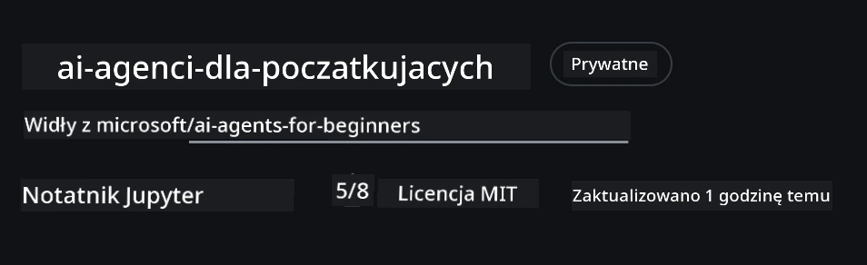
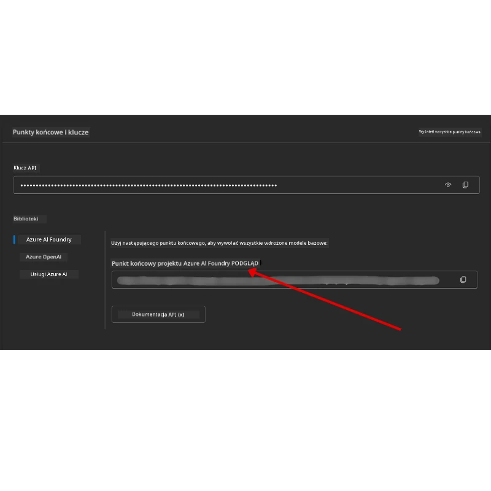

# Konfiguracja kursu

## Wprowadzenie

Ta lekcja wyjaśni, jak uruchomić przykładowy kod z tego kursu.

## Dołącz do innych uczących się i uzyskaj pomoc

Zanim zaczniesz klonować swój repozytorium, dołącz do [kanału Discord AI Agents For Beginners](https://aka.ms/ai-agents/discord), aby uzyskać pomoc przy konfiguracji, zadać pytania dotyczące kursu lub połączyć się z innymi uczącymi się.

## Sklonuj lub rozwidlenie tego repozytorium

Na początek, proszę sklonuj lub rozwidl swoje repozytorium z GitHub. To pozwoli Ci mieć własną wersję materiałów kursu, abyś mógł uruchamiać, testować i modyfikować kod!

Można to zrobić, klikając link do <a href="https://github.com/microsoft/ai-agents-for-beginners/fork" target="_blank">rozwidlenia repozytorium</a>

Powinieneś teraz mieć własną rozwidloną wersję tego kursu pod następującym linkiem:



### Płytkie klonowanie (zalecane dla warsztatów / Codespaces)

  > Pełne repozytorium może być duże (~3 GB), jeśli pobierzesz pełną historię i wszystkie pliki. Jeśli uczestniczysz tylko w warsztatach lub potrzebujesz tylko kilku folderów z lekcjami, płytkie klonowanie (lub klonowanie selektywne) pobiera znacznie mniej.

#### Szybkie płytkie klonowanie — minimalna historia, wszystkie pliki

Zamień `<your-username>` w poniższych poleceniach na adres URL Twojego forka (lub URL repozytorium nadrzędnego, jeśli wolisz).

Aby sklonować tylko najnowsze commity (mały rozmiar pobierania):

```bash
git clone --depth 1 https://github.com/<your-username>/ai-agents-for-beginners.git
```

Aby sklonować konkretną gałąź:

```bash
git clone --depth 1 --branch <branch-name> https://github.com/<your-username>/ai-agents-for-beginners.git
```

#### Częściowe (selektywne) klonowanie — minimalne dane + tylko wybrane foldery

Używa to częściowego klonowania i sparse-checkout (wymaga Git 2.25+ i zaleca się nowoczesny Git z obsługą częściowego klonowania):

```bash
git clone --depth 1 --filter=blob:none --sparse https://github.com/<your-username>/ai-agents-for-beginners.git
```

Przejdź do folderu repozytorium:

```bash
cd ai-agents-for-beginners
```

Następnie wybierz, które foldery chcesz (przykład poniżej pokazuje dwa foldery):

```bash
git sparse-checkout set 00-course-setup 01-intro-to-ai-agents
```

Po sklonowaniu i zweryfikowaniu plików, jeśli potrzebujesz tylko plików i chcesz zwolnić miejsce (bez historii git), usuń metadane repozytorium (💀nieodwracalne — stracisz całą funkcjonalność Git):

```bash
# zsh/bash
rm -rf .git
```

```powershell
# PowerShell
Remove-Item -Recurse -Force .git
```

#### Użycie GitHub Codespaces (zalecane, aby uniknąć dużych lokalnych pobrań)

- Utwórz nowy Codespace dla tego repozytorium przez [GitHub UI](https://github.com/codespaces).  

- W terminalu nowo utworzonego codespace, uruchom jedno z poleceń płytkiego/selektywnego klonowania powyżej, aby wprowadzić tylko potrzebne foldery z lekcjami do przestrzeni roboczej Codespace.
- Opcjonalnie: po klonowaniu w Codespaces usuń .git, aby odzyskać dodatkowe miejsce (zobacz powyższe polecenia usuwania).
- Uwaga: jeśli wolisz otworzyć repozytorium bezpośrednio w Codespaces (bez dodatkowego klonowania), pamiętaj, że Codespaces skonstruuje środowisko devcontainer i może przygotować więcej niż potrzebujesz.

#### Wskazówki

- Zawsze zamieniaj URL klonowania na swój fork, jeśli chcesz edytować / zatwierdzać zmiany.
- Jeśli później potrzebujesz więcej historii lub plików, możesz je pobrać lub dostosować sparse-checkout, aby uwzględnić dodatkowe foldery.

## Uruchamianie kodu

Kurs oferuje serię notatników Jupyter, które możesz uruchomić, by zdobyć praktyczne doświadczenie w budowaniu Agentów AI.

Przykłady kodu używają **Microsoft Agent Framework (MAF)** z klientem `FoundryChatClient`, który łączy się z **Microsoft Foundry Agent Service V2** (API Odpowiedzi) poprzez **Microsoft Foundry**.

Wszystkie notatniki w Pythonie noszą nazwę `*-python-agent-framework.ipynb`.

## Wymagania

- Python 3.12+
  - **UWAGA**: Jeśli nie masz zainstalowanego Pythona 3.12, zainstaluj go. Następnie utwórz środowisko wirtualne za pomocą python3.12, aby zapewnić instalację właściwych wersji z pliku requirements.txt.
  
    >Przykład

    Utwórz katalog środowiska wirtualnego Pythona:

    ```bash
    python -m venv venv
    ```

    Następnie aktywuj środowisko wirtualne dla:

    ```bash
    # zsh/bash
    source venv/bin/activate
    ```
  
    ```dos
    # Command Prompt for Windows
    venv\Scripts\activate
    ```

- .NET 10+: Dla przykładowych kodów używających .NET, zainstaluj [.NET 10 SDK](https://dotnet.microsoft.com/download/dotnet/10.0) lub nowszy. Następnie sprawdź zainstalowaną wersję SDK:

    ```bash
    dotnet --list-sdks
    ```

- **Azure CLI** — Wymagany do uwierzytelniania. Zainstaluj ze strony [aka.ms/installazurecli](https://aka.ms/installazurecli).
- **Subskrypcja Azure** — Do dostępu do Microsoft Foundry i Microsoft Foundry Agent Service.
- **Projekt Microsoft Foundry** — Projekt z wdrożonym modelem (np. `gpt-5-mini`). Zobacz [Krok 1](#krok-1-utwórz-projekt-microsoft-foundry) poniżej.

Dołączyliśmy plik `requirements.txt` w głównym katalogu tego repozytorium, zawierający wszystkie potrzebne pakiety Python do uruchomienia przykładowych kodów.

Możesz je zainstalować uruchamiając następujące polecenie w terminalu w głównym katalogu repozytorium:

```bash
pip install -r requirements.txt
```

Zalecamy stworzenie wirtualnego środowiska Pythona, aby uniknąć konfliktów i problemów.

## Konfiguracja VSCode

Upewnij się, że w VSCode używasz właściwej wersji Pythona.


## Konfiguracja Microsoft Foundry i Microsoft Foundry Agent Service

### Krok 1: Utwórz projekt Microsoft Foundry

Potrzebujesz **huba** i **projektu** Microsoft Foundry z wdrożonym modelem, aby uruchamiać notatniki.

1. Wejdź na [ai.azure.com](https://ai.azure.com) i zaloguj się kontem Azure.
2. Utwórz **hub** (lub użyj istniejącego). Zobacz: [Przegląd zasobów hub](https://learn.microsoft.com/azure/ai-foundry/concepts/ai-resources).
3. W hubie utwórz **projekt**.
4. Wdróż model (np. `gpt-5-mini`) z sekcji **Models + Endpoints** → **Deploy model**.

### Krok 2: Uzyskaj endpoint projektu i nazwę wdrożenia modelu

Z Twojego projektu w portalu Microsoft Foundry:

- **Project Endpoint** — Przejdź do strony **Overview** i skopiuj URL endpointu.



- **Model Deployment Name** — Przejdź do **Models + Endpoints**, wybierz wdrożony model i zanotuj nazwę **Deployment name** (np. `gpt-5-mini`).

### Krok 3: Zaloguj się do Azure komendą `az login`

Większość notatników uwierzytelnia się poprzez **Azure CLI login** — używając `AzureCliCredential` lub `DefaultAzureCredential` (oba korzystają z sesji `az login`) z pakietu `azure-identity` — więc nie wymagają kluczy API. Kilka lekcji i opcjonalnych integracji używa kluczy API; sprawdź wymogi każdej lekcji pod kątem dodatkowych zmiennych środowiskowych. Wymaga to zalogowania przez Azure CLI.

1. **Zainstaluj Azure CLI** jeśli jeszcze go nie masz: [aka.ms/installazurecli](https://aka.ms/installazurecli)

2. **Zaloguj się**, uruchamiając:

    ```bash
    az login
    ```

    Lub jeśli jesteś w środowisku zdalnym/Codespace bez przeglądarki:

    ```bash
    az login --use-device-code
    ```

3. **Wybierz subskrypcję**, jeśli pojawi się monit — wybierz tę, która zawiera projekt Foundry.

4. **Sprawdź**, czy jesteś zalogowany:

    ```bash
    az account show
    ```

> **Dlaczego `az login`?** Notatniki uwierzytelniają się używając `AzureCliCredential` (lub `DefaultAzureCredential`, który również korzysta z logowania Azure CLI) z pakietu `azure-identity`. Oznacza to, że sesja Azure CLI dostarcza poświadczenia — nie potrzeba kluczy API ani sekretów w pliku `.env`. To jest [zalecana praktyka bezpieczeństwa](https://learn.microsoft.com/azure/developer/ai/keyless-connections).

### Krok 4: Utwórz plik `.env`

Skopiuj plik przykładowy:

```bash
# zsh/bash
cp .env.example .env
```

```powershell
# PowerShell
Copy-Item .env.example .env
```

Otwórz `.env` i wypełnij te dwie wartości:

```env
AZURE_AI_PROJECT_ENDPOINT=https://<your-project>.services.ai.azure.com/api/projects/<your-project-id>
AZURE_AI_MODEL_DEPLOYMENT_NAME=gpt-5-mini
```

| Zmienna | Gdzie ją znaleźć |
|----------|-----------------|
| `AZURE_AI_PROJECT_ENDPOINT` | Portal Foundry → Twój projekt → strona **Overview** |
| `AZURE_AI_MODEL_DEPLOYMENT_NAME` | Portal Foundry → **Models + Endpoints** → nazwa wdrożonego modelu |

To wszystko dla większości lekcji! Notatniki będą uwierzytelniać się automatycznie przez Twoją sesję `az login`.

### Krok 5: Zainstaluj zależności Pythona

```bash
pip install -r requirements.txt
```

Zalecamy uruchomienie tego we wcześniej utworzonym środowisku wirtualnym.

## Opcjonalna konfiguracja: Azure AI Search (Lekcje 5 i 16)

Notatniki z Lekcji 5 (Agentic RAG) i Lekcji 16 działają od razu z **pamięciową bazą wiedzy** — nie wymagają dodatkowych zasobów Azure. Jeśli chcesz obsłużyć je za pomocą prawdziwego indeksu **Azure AI Search**, pamiętaj, że notatnik z Lekcji 16 obecnie korzysta z uwierzytelniania na bazie klucza: przełącza się z wyszukiwania w pamięci na Azure AI Search tylko, gdy ustawione są **oba** `AZURE_SEARCH_SERVICE_ENDPOINT` **i** `AZURE_SEARCH_API_KEY`, w przeciwnym razie pozostaje na wyszukiwaniu w pamięci — aby więc używać tego z prawdziwym indeksem, musisz też ustawić klucz administratora. Uwierzytelnianie bezkluczowe z Microsoft Entra ID (RBAC) jest zalecanym podejściem dla Twojego produkcyjnego kodu, zgodnym z przepływem `az login` używanym wszędzie w tym kursie.

Kroki RBAC poniżej dotyczą przykładów przewodnikowych i Twojego kodu. Nie włączają one uwierzytelniania bezkluczowego w notatniku z Lekcji 16; Lekcja 16 nadal wymaga obu: endpointu i klucza administratora, aby korzystać z Azure AI Search.

1. **Włącz dostęp oparty na rolach** w swojej usłudze wyszukiwania:

    ```bash
    az search service update --name <service-name> --resource-group <resource-group> --auth-options aadOrApiKey
    ```

2. **Przydziel sobie wymagane role** (tworzenie/ładowanie indeksów oraz zapytania):

    ```bash
    az role assignment create --assignee <your-user-or-principal-id> --role "Search Service Contributor" --scope $(az search service show -g <resource-group> -n <service-name> --query id -o tsv)
    az role assignment create --assignee <your-user-or-principal-id> --role "Search Index Data Contributor" --scope $(az search service show -g <resource-group> -n <service-name> --query id -o tsv)
    ```

3. **Dodaj endpoint** do pliku `.env`:

| Zmienna | Gdzie ją znaleźć |
|----------|-----------------|
| `AZURE_SEARCH_SERVICE_ENDPOINT` | Portal Azure → Twój zasób **Azure AI Search** → **Overview** → URL |
| `AZURE_SEARCH_API_KEY` | Wymagany (z endpointem) do włączenia Azure AI Search w notatniku z Lekcji 16, który używa uwierzytelniania na bazie klucza. Portal Azure → **Settings** → **Keys** → podstawowy klucz administratora |

> **Dlaczego bezkluczowo?** Klucze administratora dają pełne prawa zapisu do usługi wyszukiwania i mogą przeciekać przez pliki `.env`. Z RBAC twoja tożsamość `az login` jest używana zamiast nich — ten sam bezkluczowy wzorzec Entra ID, który używają notatniki kursu (poprzez `AzureCliCredential` / `DefaultAzureCredential`). Zobacz [Łączenie z Azure AI Search za pomocą ról](https://learn.microsoft.com/azure/search/search-security-rbac).

Zobacz [przewodnik konfiguracji Azure AI Search](./AzureSearch.md) dla pełnych przykładów tworzenia indeksów w Pythonie i .NET.

## Dodatkowa konfiguracja dla lekcji wywołujących Azure OpenAI bezpośrednio (Lekcje 6 i 8)

Niektóre notatniki w lekcjach 6 i 8 wywołują **Azure OpenAI** bezpośrednio (używając **Responses API**) zamiast korzystać z projektu Microsoft Foundry. Te przykłady wcześniej używały GitHub Models, które jest przestarzałe i nie wspiera Responses API. Dodaj następujące zmienne do pliku `.env`:

| Zmienna | Gdzie ją znaleźć |
|----------|-----------------|
| `AZURE_OPENAI_ENDPOINT` | Portal Azure → Twój zasób **Azure OpenAI** → **Keys and Endpoint** → Endpoint (np. `https://<your-resource>.openai.azure.com`) |
| `AZURE_OPENAI_DEPLOYMENT` | Nazwa wdrożonego modelu (np. `gpt-5-mini`) obsługującego Responses API |
| `AZURE_OPENAI_API_KEY` | Opcjonalnie — tylko jeśli używasz uwierzytelniania na bazie klucza zamiast `az login` / Entra ID |

> Responses API używa stabilnego endpointu `/openai/v1/`, więc nie jest wymagany parametr `api-version`. Zaloguj się przez `az login`, aby używać bezkluczowego uwierzytelniania Entra ID.

## Alternatywny dostawca: MiniMax (kompatybilny z OpenAI)

[MiniMax](https://platform.minimaxi.com/) oferuje modele z dużym kontekstem (do 204K tokenów) poprzez API kompatybilne z OpenAI. Ponieważ `OpenAIChatClient` Microsoft Agent Framework działa z dowolnym endpointem kompatybilnym z OpenAI, możesz użyć MiniMax jako zamiennika dla lekcji korzystających z `OpenAIChatClient`.

Dodaj następujące zmienne do pliku `.env`:

| Zmienna | Gdzie ją znaleźć |
|----------|-----------------|
| `MINIMAX_API_KEY` | [Platforma MiniMax](https://platform.minimaxi.com/) → Klucze API |
| `MINIMAX_BASE_URL` | Użyj `https://api.minimax.io/v1` (domyślna wartość) |
| `MINIMAX_MODEL_ID` | Nazwa modelu do użycia (np. `MiniMax-M3`) |

**Przykładowe modele**: `MiniMax-M3` (zalecany), `MiniMax-M2.7`, `MiniMax-M2.7-highspeed` (szybsze odpowiedzi). Nazwy modeli i ich dostępność mogą się zmieniać, a dostęp do danego modelu może zależeć od Twojego konta.

Przykłady kodu używające `OpenAIChatClient` (np. przepływ rezerwacji hotelu z Lekcji 14) automatycznie wykryją i użyją konfiguracji MiniMax, jeśli ustawiono `MINIMAX_API_KEY`.


## Alternatywny Dostawca: Foundry Local (Uruchamiaj Modele na Urządzeniu)

[Foundry Local](https://foundrylocal.ai) to lekki runtime, który pobiera, zarządza i udostępnia modele językowe **całkowicie na Twoim własnym komputerze** przez kompatybilne z OpenAI API — bez potrzeby chmury.

Ponieważ `OpenAIChatClient` z Microsoft Agent Framework działa z dowolnym kompatybilnym z OpenAI punktem końcowym, Foundry Local jest lokalną alternatywą typu „drop-in” dla Azure OpenAI.

**1. Zainstaluj Foundry Local**

```bash
# Windows
winget install Microsoft.FoundryLocal

# macOS
brew install foundrylocal
```

**2. Pobierz i uruchom model** (to również uruchomi lokalną usługę):

```bash
foundry model list          # zobacz dostępne modele
foundry model run phi-4-mini
```

**3. Zainstaluj Python SDK** używane do wykrywania lokalnego punktu końcowego:

```bash
pip install foundry-local-sdk
```

**4. Skieruj Microsoft Agent Framework na swój lokalny model:**

```python
from foundry_local import FoundryLocalManager
from agent_framework.openai import OpenAIChatClient

# Pobiera (jeśli potrzeba) i uruchamia model lokalnie, następnie wykrywa punkt końcowy/port.
manager = FoundryLocalManager("phi-4-mini")

chat_client = OpenAIChatClient(
    base_url=manager.endpoint,      # np. http://localhost:<port>/v1
    api_key=manager.api_key,        # zawsze "nie-wymagane" dla Foundry Local
    model_id=manager.get_model_info("phi-4-mini").id,
)

agent = chat_client.as_agent(
    name="LocalAgent",
    instructions="You are a helpful assistant running fully on-device.",
)
```

> **Uwaga:** Foundry Local udostępnia kompatybilny z OpenAI punkt końcowy **Chat Completions**. Używaj go do lokalnego rozwoju i scenariuszy offline. Pełny zestaw funkcji **Responses API** (np. rozmowy ze stanem, itp.) jest dostępny w Azure OpenAI lub projekcie Microsoft Foundry.

## Dodatkowa konfiguracja do lekcji 8 (Bing Grounding Workflow)

Notatnik z warunkowym przepływem pracy w lekcji 8 używa **Bing grounding** przez Microsoft Foundry. Jeśli zamierzasz uruchomić ten przykład, dodaj tę zmienną do swojego pliku `.env`:

| Zmienna | Gdzie ją znaleźć |
|----------|-----------------|
| `BING_CONNECTION_ID` | Portal Microsoft Foundry → twój projekt → **Zarządzanie** → **Połączone zasoby** → twoje połączenie Bing → skopiuj ID połączenia |

## Rozwiązywanie problemów

### Błędy weryfikacji certyfikatu SSL na macOS

Jeśli korzystasz z macOS i napotkasz błąd podobny do:

```plaintext
ssl.SSLCertVerificationError: [SSL: CERTIFICATE_VERIFY_FAILED] certificate verify failed: self-signed certificate in certificate chain
```

Jest to znany problem z Pythonem na macOS, gdzie systemowe certyfikaty SSL nie są automatycznie zaufane. Wypróbuj następujące rozwiązania w kolejności:

**Opcja 1: Uruchom skrypt Install Certificates Pythona (zalecane)**

```bash
# Zamień 3.XX na zainstalowaną wersję Pythona (np. 3.12 lub 3.13):
/Applications/Python\ 3.XX/Install\ Certificates.command
```

**Opcja 2: Użyj `connection_verify=False` w swoim notatniku (tylko dla notatników GitHub Models)**

W notatniku Lekcji 6 (`06-building-trustworthy-agents/code_samples/06-system-message-framework.ipynb`) znajduje się już zakomentowane obejście. Odkomentuj `connection_verify=False`, gdy pojawią się błędy certyfikatów:

```python
client = ChatCompletionsClient(
    endpoint=endpoint,
    credential=AzureKeyCredential(token),
    connection_verify=False,  # Wyłącz weryfikację SSL, jeśli napotkasz błędy certyfikatu
)
```

> **⚠️ Ostrzeżenie:** Wyłączenie weryfikacji SSL (`connection_verify=False`) zmniejsza bezpieczeństwo przez pominięcie weryfikacji certyfikatu. Używaj tego tylko jako tymczasowego obejścia w środowiskach deweloperskich. Nigdy nie stosuj tego w produkcji.

**Opcja 3: Zainstaluj i użyj `truststore`**

```bash
pip install truststore
```

Następnie dodaj poniższe na początku swojego notatnika lub skryptu, przed wykonaniem jakichkolwiek połączeń sieciowych:

```python
import truststore
truststore.inject_into_ssl()
```

## Utknąłeś gdzieś?

Jeśli masz jakiekolwiek problemy z uruchomieniem tej konfiguracji, dołącz do naszej <a href="https://discord.gg/kzRShWzttr" target="_blank">społeczności Azure AI na Discordzie</a> lub <a href="https://github.com/microsoft/ai-agents-for-beginners/issues?WT.mc_id=academic-105485-koreyst" target="_blank">utwórz zgłoszenie</a>.

## Następna lekcja

Teraz jesteś gotów, by uruchomić kod tego kursu. Powodzenia w zgłębianiu świata agentów AI! 

[Wprowadzenie do agentów AI i przypadków użycia agentów](../01-intro-to-ai-agents/README.md)

---

<!-- CO-OP TRANSLATOR DISCLAIMER START -->
**Zastrzeżenie**:
Niniejszy dokument został przetłumaczony za pomocą usługi tłumaczenia AI [Co-op Translator](https://github.com/Azure/co-op-translator). Choć dążymy do dokładności, prosimy pamiętać, że automatyczne tłumaczenia mogą zawierać błędy lub niedokładności. Oryginalny dokument w jego języku źródłowym należy uznawać za autorytatywne źródło. W przypadku informacji krytycznych zalecane jest skorzystanie z profesjonalnego tłumaczenia wykonanego przez człowieka. Nie ponosimy odpowiedzialności za jakiekolwiek nieporozumienia lub błędne interpretacje wynikające z użycia tego tłumaczenia.
<!-- CO-OP TRANSLATOR DISCLAIMER END -->