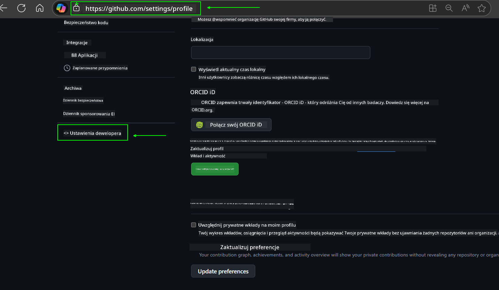
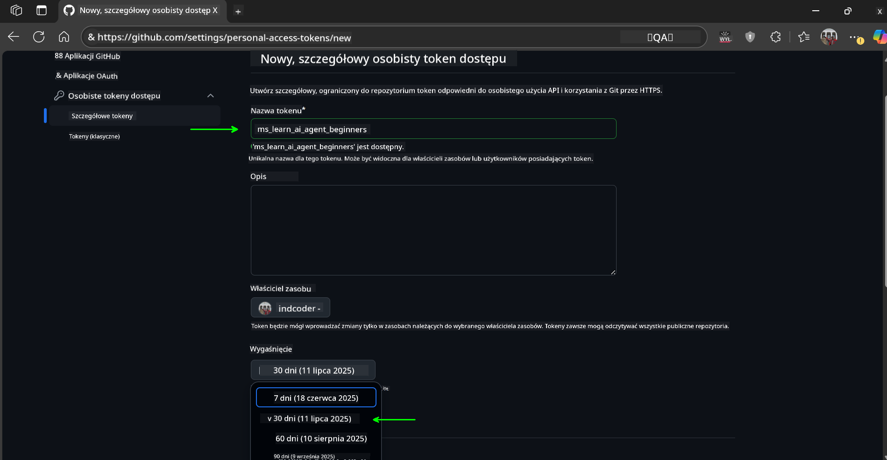
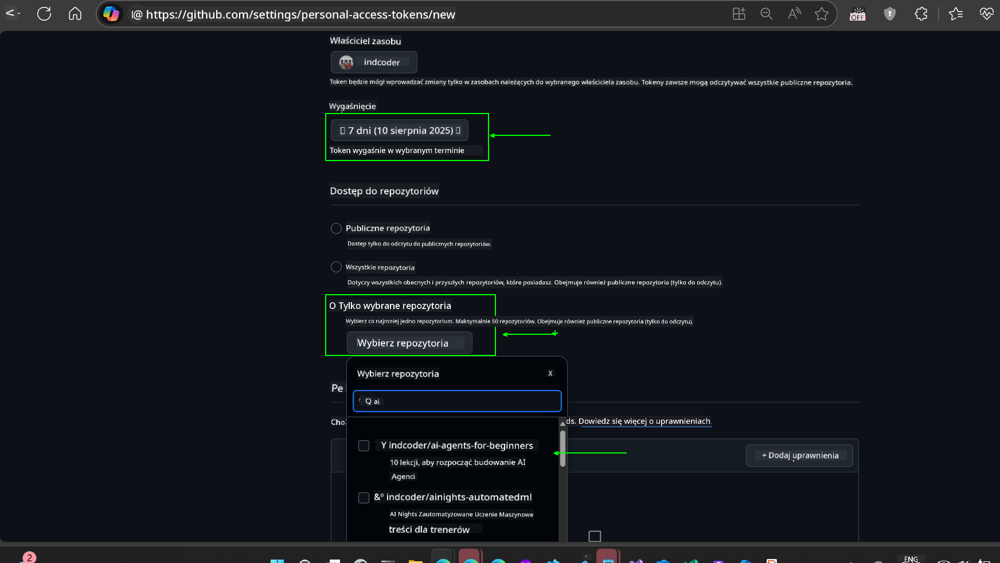
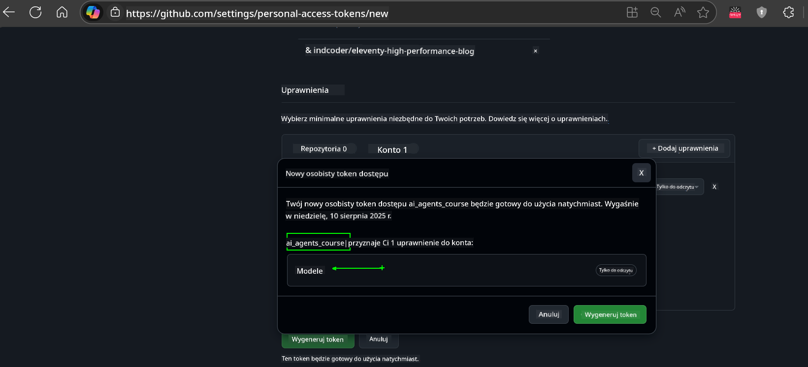
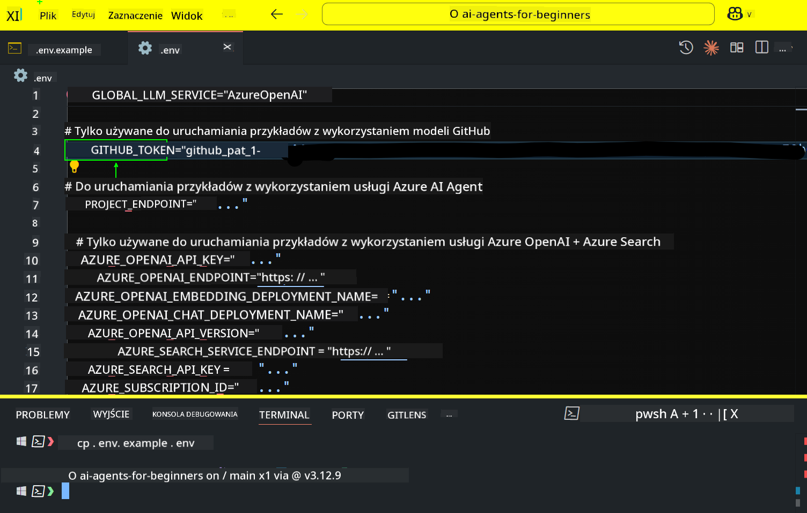
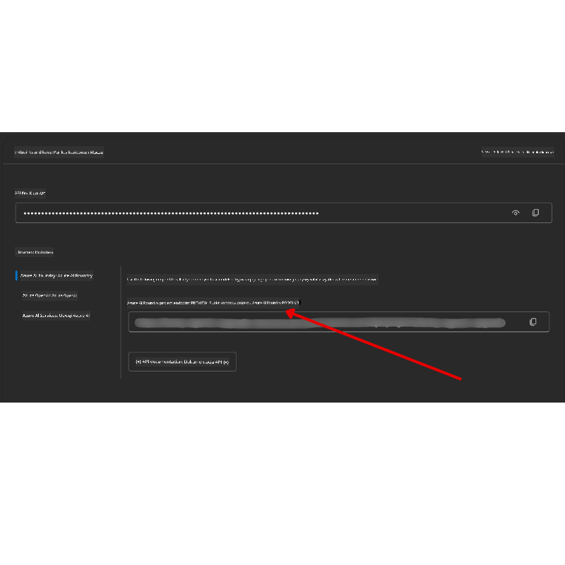

<!--
CO_OP_TRANSLATOR_METADATA:
{
  "original_hash": "96eb7f95375daa3e91778ca0295a55d9",
  "translation_date": "2025-10-15T11:46:03+00:00",
  "source_file": "00-course-setup/README.md",
  "language_code": "pl"
}
-->
# Konfiguracja kursu

## Wprowadzenie

W tej lekcji omówimy, jak uruchomić przykłady kodu z tego kursu.

## Dołącz do innych uczestników i uzyskaj pomoc

Zanim zaczniesz klonować swoje repozytorium, dołącz do [kanału Discord AI Agents For Beginners](https://aka.ms/ai-agents/discord), aby uzyskać pomoc w konfiguracji, odpowiedzi na pytania dotyczące kursu lub nawiązać kontakt z innymi uczestnikami.

## Sklonuj lub zrób fork tego repozytorium

Na początek prosimy o sklonowanie lub zrobienie forka repozytorium GitHub. Dzięki temu stworzysz własną wersję materiałów kursowych, aby móc uruchamiać, testować i modyfikować kod!

Możesz to zrobić, klikając link do <a href="https://github.com/microsoft/ai-agents-for-beginners/fork" target="_blank">forkowania repozytorium</a>.

Teraz powinieneś mieć swoją własną wersję tego kursu pod następującym linkiem:


### Płytkie klonowanie (zalecane na warsztaty / Codespaces)

  >Pełne repozytorium może być duże (~3 GB) przy pobieraniu całej historii i wszystkich plików. Jeśli uczestniczysz tylko w warsztatach lub potrzebujesz tylko kilku folderów z lekcjami, płytkie klonowanie (lub klonowanie częściowe) pozwala uniknąć większości tego pobierania, skracając historię i/lub pomijając pliki.

#### Szybkie płytkie klonowanie — minimalna historia, wszystkie pliki

Zastąp `<your-username>` w poniższych poleceniach URL swojego forka (lub URL upstream, jeśli wolisz).

Aby sklonować tylko najnowszą historię commitów (mały rozmiar pobierania):

```bash|powershell
git clone --depth 1 https://github.com/<your-username>/ai-agents-for-beginners.git
```

Aby sklonować konkretną gałąź:

```bash|powershell
git clone --depth 1 --branch <branch-name> https://github.com/<your-username>/ai-agents-for-beginners.git
```

#### Częściowe (sparse) klonowanie — minimalne pliki + tylko wybrane foldery

To klonowanie wykorzystuje częściowe klonowanie i sparse-checkout (wymaga Git 2.25+ i zalecane nowoczesne Git z obsługą częściowego klonowania):

```bash|powershell
git clone --depth 1 --filter=blob:none --sparse https://github.com/<your-username>/ai-agents-for-beginners.git
```

Przejdź do folderu repozytorium:

Dla bash:

```bash
cd ai-agents-for-beginners
```

Dla Powershell:

```powershell
Set-Location ai-agents-for-beginners
```

Następnie określ, które foldery chcesz (przykład poniżej pokazuje dwa foldery):

```bash|powershell
git sparse-checkout set 00-course-setup 01-intro-to-ai-agents
```

Po sklonowaniu i zweryfikowaniu plików, jeśli potrzebujesz tylko plików i chcesz zwolnić miejsce (bez historii git), usuń metadane repozytorium (💀nieodwracalne — stracisz wszystkie funkcje Git: brak commitów, pulli, pushów ani dostępu do historii).

Dla Linux/macOS:

```bash
rm -rf .git
```

Dla Windows:

```powershell
Remove-Item -Recurse -Force .git
```

#### Korzystanie z GitHub Codespaces (zalecane, aby uniknąć lokalnych dużych pobrań)

- Utwórz nowy Codespace dla tego repozytorium za pomocą [interfejsu GitHub](https://github.com/codespaces).  

- W terminalu nowo utworzonego Codespace uruchom jedno z poleceń płytkiego/częściowego klonowania, aby pobrać tylko foldery lekcji, które są Ci potrzebne, do przestrzeni roboczej Codespace.
- Opcjonalnie: po klonowaniu w Codespaces usuń .git, aby odzyskać dodatkowe miejsce (zobacz powyższe polecenia usuwania).
- Uwaga: Jeśli wolisz otworzyć repozytorium bezpośrednio w Codespaces (bez dodatkowego klonowania), pamiętaj, że Codespaces skonstruuje środowisko devcontainer i może nadal przygotować więcej niż potrzebujesz. Klonowanie płytkiej kopii w świeżym Codespace daje większą kontrolę nad wykorzystaniem dysku.

#### Wskazówki

- Zawsze zastępuj URL klonowania swoim forkiem, jeśli chcesz edytować/commitować.
- Jeśli później potrzebujesz więcej historii lub plików, możesz je pobrać lub dostosować sparse-checkout, aby uwzględnić dodatkowe foldery.

## Uruchamianie kodu

Ten kurs oferuje serię Notatników Jupyter, które możesz uruchomić, aby zdobyć praktyczne doświadczenie w budowaniu agentów AI.

Przykłady kodu wykorzystują:

**Wymaga konta GitHub - Bezpłatne**:

1) Framework Semantic Kernel Agent + GitHub Models Marketplace. Oznaczone jako (semantic-kernel.ipynb)
2) Framework AutoGen + GitHub Models Marketplace. Oznaczone jako (autogen.ipynb)

**Wymaga subskrypcji Azure**:
3) Azure AI Foundry + Azure AI Agent Service. Oznaczone jako (azureaiagent.ipynb)

Zachęcamy do wypróbowania wszystkich trzech typów przykładów, aby zobaczyć, który z nich najlepiej Ci odpowiada.

Opcja, którą wybierzesz, określi, które kroki konfiguracji musisz wykonać poniżej:

## Wymagania

- Python 3.12+
  - **UWAGA**: Jeśli nie masz zainstalowanego Python3.12, upewnij się, że go zainstalujesz. Następnie utwórz swój venv za pomocą python3.12, aby upewnić się, że odpowiednie wersje zostaną zainstalowane z pliku requirements.txt.
  
    >Przykład

    Utwórz katalog Python venv:

    ``` bash
    python3 -m venv venv
    ```

    Następnie aktywuj środowisko venv dla:

    macOS i Linux

    ```bash
    source venv/bin/activate
    ```
  
    Windows

    ```bash
    venv\Scripts\activate
    ```

- Konto GitHub - Dostęp do GitHub Models Marketplace
- Subskrypcja Azure - Dostęp do Azure AI Foundry
- Konto Azure AI Foundry - Dostęp do Azure AI Agent Service

Do repozytorium dołączono plik `requirements.txt`, który zawiera wszystkie wymagane pakiety Python do uruchomienia przykładów kodu.

Możesz je zainstalować, uruchamiając następujące polecenie w terminalu w katalogu głównym repozytorium:

```bash
pip install -r requirements.txt
```
Zalecamy utworzenie wirtualnego środowiska Python, aby uniknąć konfliktów i problemów.

## Konfiguracja VSCode
Upewnij się, że używasz odpowiedniej wersji Pythona w VSCode.


## Konfiguracja dla przykładów z użyciem GitHub Models 

### Krok 1: Pobierz swój GitHub Personal Access Token (PAT)

Ten kurs wykorzystuje GitHub Models Marketplace, zapewniając bezpłatny dostęp do dużych modeli językowych (LLM), które będziesz używać do budowania agentów AI.

Aby korzystać z GitHub Models, musisz utworzyć [GitHub Personal Access Token](https://docs.github.com/en/authentication/keeping-your-account-and-data-secure/managing-your-personal-access-tokens).

Możesz to zrobić, przechodząc do <a href="https://github.com/settings/personal-access-tokens" target="_blank">ustawień tokenów dostępu osobistego</a> w swoim koncie GitHub.

Proszę postępować zgodnie z [zasadą minimalnych uprawnień](https://docs.github.com/en/get-started/learning-to-code/storing-your-secrets-safely) podczas tworzenia tokena. Oznacza to, że powinieneś nadać tokenowi tylko te uprawnienia, które są potrzebne do uruchomienia przykładów kodu w tym kursie.

1. Wybierz opcję `Fine-grained tokens` po lewej stronie ekranu, przechodząc do **Developer settings**
   

    Następnie wybierz `Generate new token`.

    

2. Wprowadź opisową nazwę dla swojego tokena, która odzwierciedla jego cel, aby łatwo go później zidentyfikować.


    🔐 Zalecenie dotyczące czasu trwania tokena

    Zalecany czas trwania: 30 dni
    Dla większego bezpieczeństwa możesz wybrać krótszy okres — na przykład 7 dni 🛡️
    To świetny sposób na wyznaczenie osobistego celu i ukończenie kursu, gdy Twoje tempo nauki jest wysokie 🚀.

    

3. Ogranicz zakres tokena do swojego forka tego repozytorium.

    

4. Ogranicz uprawnienia tokena: W sekcji **Permissions**, kliknij zakładkę **Account**, a następnie przycisk "+ Add permissions". Pojawi się rozwijane menu. Wyszukaj **Models** i zaznacz odpowiednie pole.
    

5. Zweryfikuj wymagane uprawnienia przed wygenerowaniem tokena. 

6. Przed wygenerowaniem tokena upewnij się, że jesteś gotowy do przechowywania tokena w bezpiecznym miejscu, takim jak sejf menedżera haseł, ponieważ nie będzie on ponownie wyświetlany po jego utworzeniu. 

Skopiuj nowo utworzony token. Teraz dodasz go do swojego pliku `.env` dołączonego do tego kursu.


### Krok 2: Utwórz swój plik `.env`

Aby utworzyć plik `.env`, uruchom następujące polecenie w terminalu.

```bash
cp .env.example .env
```

To polecenie skopiuje plik przykładowy i utworzy `.env` w Twoim katalogu, gdzie wypełnisz wartości dla zmiennych środowiskowych.

Po skopiowaniu tokena otwórz plik `.env` w swoim ulubionym edytorze tekstu i wklej token w polu `GITHUB_TOKEN`.



Teraz powinieneś być w stanie uruchomić przykłady kodu z tego kursu.

## Konfiguracja dla przykładów z użyciem Azure AI Foundry i Azure AI Agent Service

### Krok 1: Pobierz punkt końcowy swojego projektu Azure


Postępuj zgodnie z krokami tworzenia huba i projektu w Azure AI Foundry, opisanymi tutaj: [Hub resources overview](https://learn.microsoft.com/en-us/azure/ai-foundry/concepts/ai-resources)


Po utworzeniu projektu będziesz musiał pobrać ciąg połączenia dla swojego projektu.

Można to zrobić, przechodząc do strony **Overview** swojego projektu w portalu Azure AI Foundry.



### Krok 2: Utwórz swój plik `.env`

Aby utworzyć plik `.env`, uruchom następujące polecenie w terminalu.

```bash
cp .env.example .env
```

To polecenie skopiuje plik przykładowy i utworzy `.env` w Twoim katalogu, gdzie wypełnisz wartości dla zmiennych środowiskowych.

Po skopiowaniu tokena otwórz plik `.env` w swoim ulubionym edytorze tekstu i wklej token w polu `PROJECT_ENDPOINT`.

### Krok 3: Zaloguj się do Azure

Jako najlepszą praktykę bezpieczeństwa użyjemy [uwierzytelniania bez klucza](https://learn.microsoft.com/azure/developer/ai/keyless-connections?tabs=csharp%2Cazure-cli?WT.mc_id=academic-105485-koreyst), aby uwierzytelnić się w Azure OpenAI za pomocą Microsoft Entra ID. 

Następnie otwórz terminal i uruchom `az login --use-device-code`, aby zalogować się na swoje konto Azure.

Po zalogowaniu wybierz swoją subskrypcję w terminalu.


## Dodatkowe zmienne środowiskowe - Azure Search i Azure OpenAI 

Dla lekcji Agentic RAG - Lekcja 5 - dostępne są przykłady wykorzystujące Azure Search i Azure OpenAI.

Jeśli chcesz uruchomić te przykłady, musisz dodać następujące zmienne środowiskowe do swojego pliku `.env`:

### Strona przeglądu (Projekt)

- `AZURE_SUBSCRIPTION_ID` - Sprawdź **Project details** na stronie **Overview** swojego projektu.

- `AZURE_AI_PROJECT_NAME` - Spójrz na górę strony **Overview** swojego projektu.

- `AZURE_OPENAI_SERVICE` - Znajdź to w zakładce **Included capabilities** dla **Azure OpenAI Service** na stronie **Overview**.

### Centrum zarządzania

- `AZURE_OPENAI_RESOURCE_GROUP` - Przejdź do **Project properties** na stronie **Overview** w **Management Center**.

- `GLOBAL_LLM_SERVICE` - W sekcji **Connected resources**, znajdź nazwę połączenia **Azure AI Services**. Jeśli nie jest wymieniona, sprawdź **Azure portal** w swojej grupie zasobów dla nazwy zasobu AI Services.

### Strona modeli + punktów końcowych

- `AZURE_OPENAI_EMBEDDING_DEPLOYMENT_NAME` - Wybierz swój model embedding (np. `text-embedding-ada-002`) i zanotuj **Deployment name** z szczegółów modelu.

- `AZURE_OPENAI_CHAT_DEPLOYMENT_NAME` - Wybierz swój model chat (np. `gpt-4o-mini`) i zanotuj **Deployment name** z szczegółów modelu.

### Portal Azure

- `AZURE_OPENAI_ENDPOINT` - Znajdź **Azure AI services**, kliknij na to, następnie przejdź do **Resource Management**, **Keys and Endpoint**, przewiń w dół do "Azure OpenAI endpoints" i skopiuj ten, który mówi "Language APIs".

- `AZURE_OPENAI_API_KEY` - Z tego samego ekranu skopiuj KLUCZ 1 lub KLUCZ 2.

- `AZURE_SEARCH_SERVICE_ENDPOINT` - Znajdź swój zasób **Azure AI Search**, kliknij na niego i zobacz **Overview**.

- `AZURE_SEARCH_API_KEY` - Następnie przejdź do **Settings**, a potem **Keys**, aby skopiować klucz administratora głównego lub pomocniczego.

### Zewnętrzna strona internetowa

- `AZURE_OPENAI_API_VERSION` - Odwiedź stronę [API version lifecycle](https://learn.microsoft.com/en-us/azure/ai-services/openai/api-version-deprecation#latest-ga-api-release) w sekcji **Latest GA API release**.

### Konfiguracja uwierzytelniania bez klucza

Zamiast twardo kodować swoje dane uwierzytelniające, użyjemy połączenia bez klucza z Azure OpenAI. Aby to zrobić, zaimportujemy `DefaultAzureCredential`, a następnie wywołamy funkcję `DefaultAzureCredential`, aby uzyskać dane uwierzytelniające.

```python
from azure.identity import DefaultAzureCredential, InteractiveBrowserCredential
```

## Utknąłeś gdzieś?
Jeśli masz jakiekolwiek problemy z uruchomieniem tego zestawu, dołącz do naszego <a href="https://discord.gg/kzRShWzttr" target="_blank">Discorda społeczności Azure AI</a> lub <a href="https://github.com/microsoft/ai-agents-for-beginners/issues?WT.mc_id=academic-105485-koreyst" target="_blank">zgłoś problem</a>.

## Następna lekcja

Jesteś teraz gotowy, aby uruchomić kod dla tego kursu. Miłego zgłębiania świata agentów AI!

[Wprowadzenie do agentów AI i przypadków ich użycia](../01-intro-to-ai-agents/README.md)

---

**Zastrzeżenie**:  
Ten dokument został przetłumaczony za pomocą usługi tłumaczenia AI [Co-op Translator](https://github.com/Azure/co-op-translator). Chociaż staramy się zapewnić dokładność, prosimy pamiętać, że automatyczne tłumaczenia mogą zawierać błędy lub nieścisłości. Oryginalny dokument w jego rodzimym języku powinien być uznawany za autorytatywne źródło. W przypadku informacji krytycznych zaleca się skorzystanie z profesjonalnego tłumaczenia przez człowieka. Nie ponosimy odpowiedzialności za jakiekolwiek nieporozumienia lub błędne interpretacje wynikające z użycia tego tłumaczenia.