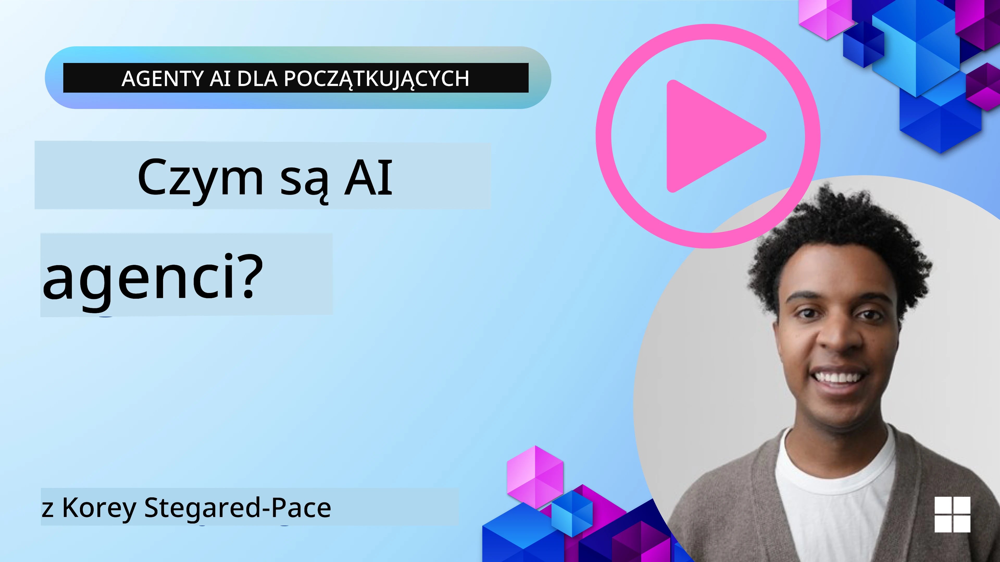
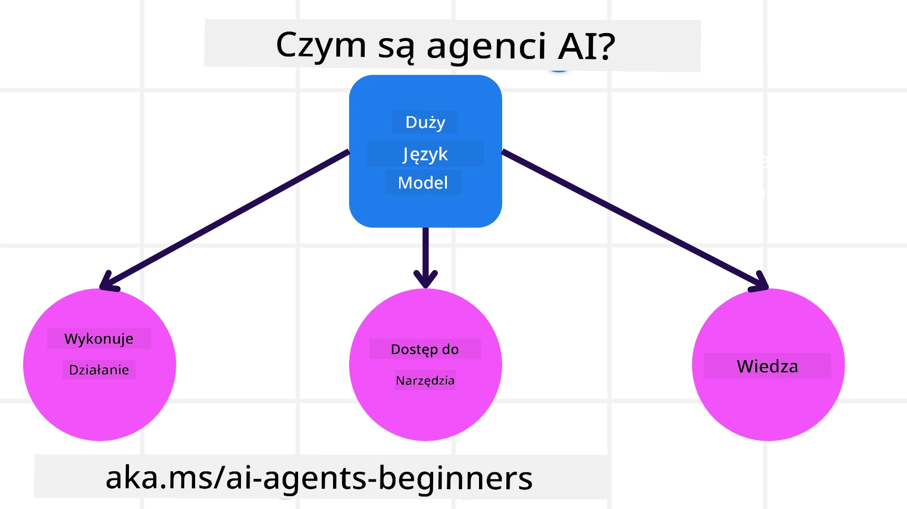
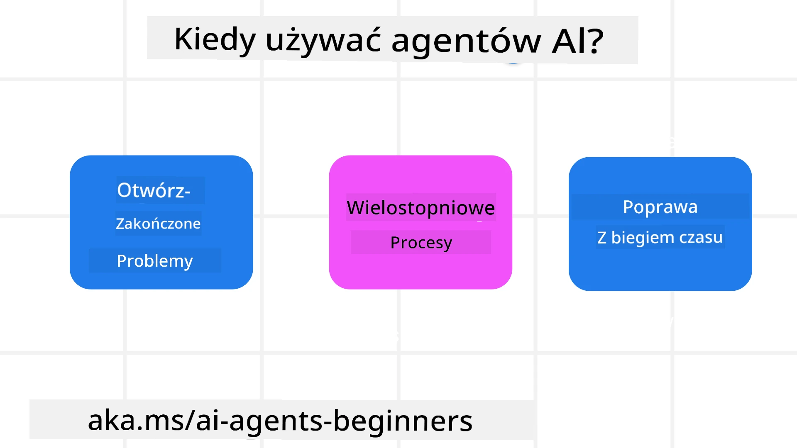

> _(Kliknij powyższy obraz, aby obejrzeć wideo z tej lekcji)_

# Wprowadzenie do Agentów SI i przypadki użycia agentów

Witamy na kursie „Agenci SI dla początkujących”! Kurs ten dostarcza podstawową wiedzę i przykładowe zastosowania do tworzenia Agentów SI.

Dołącz do <a href="https://discord.gg/kzRShWzttr" target="_blank">Społeczności Azure AI na Discord</a>, aby poznać innych uczestników i twórców Agentów SI oraz zadać wszelkie pytania dotyczące tego kursu.

Aby rozpocząć kurs, zaczniemy od lepszego zrozumienia, czym są Agenci SI i jak możemy ich używać w tworzonych przez nas aplikacjach i przepływach pracy.

## Wprowadzenie

Ta lekcja obejmuje:

- Czym są Agenci SI i jakie są różne typy agentów?
- Jakie przypadki użycia są najlepsze dla Agentów SI i jak mogą nam pomóc?
- Jakie są podstawowe elementy konstrukcyjne przy projektowaniu rozwiązań agentowych?

## Cele nauki
Po ukończeniu tej lekcji powinieneś być w stanie:

- Zrozumieć koncepcje Agentów SI i jak różnią się one od innych rozwiązań SI.
- Najefektywniej stosować Agenty SI.
- Produktywnie projektować rozwiązania agentowe zarówno dla użytkowników, jak i klientów.

## Definicja Agentów SI i typy agentów SI

### Czym są Agenci SI?

Agenci SI to **systemy**, które umożliwiają **modelom językowym dużej skali (LLM)** **wykonywanie działań** poprzez rozszerzenie ich możliwości przez udostępnienie modelom językowym **dostępu do narzędzi** i **wiedzy**.

Rozbijmy tę definicję na mniejsze części:

- **System** – ważne jest, aby myśleć o agentach nie jako o pojedynczym komponencie, ale jako o systemie wielu komponentów. Na podstawowym poziomie, komponenty Agenta SI to:
  - **Środowisko** – zdefiniowana przestrzeń, w której działa Agent SI. Na przykład, jeśli mamy agenta do rezerwacji podróży, środowiskiem może być system rezerwacji podróży, który Agent SI używa do realizacji zadań.
  - **Czujniki** – środowiska posiadają informacje i dostarczają informacji zwrotnej. Agenci SI korzystają z czujników, aby gromadzić i interpretować te informacje o aktualnym stanie środowiska. W przykładzie Agenta do rezerwacji podróży system rezerwacji może dostarczyć informacje takie jak dostępność hoteli czy ceny lotów.
  - **Wykonawcy (aktuatory)** – gdy Agent SI otrzyma aktualny stan środowiska, dla aktualnego zadania agent decyduje, jakie działanie wykonać, by zmienić środowisko. Dla agenta do rezerwacji podróży może to być zarezerwowanie dostępnego pokoju dla użytkownika.

**Modele językowe dużej skali** – koncepcja agentów istniała już przed powstaniem LLM. Zaletą budowania Agentów SI z LLM jest ich zdolność do interpretacji języka ludzkiego i danych. Ta zdolność umożliwia modelom językowym interpretację informacji środowiskowych i określenie planu zmiany środowiska.

**Wykonywanie działań** – poza systemami Agentów SI LLM są ograniczone do sytuacji, gdzie działaniem jest generowanie treści lub informacji na podstawie polecenia użytkownika. W systemach Agentów SI LLM mogą realizować zadania poprzez interpretację prośby użytkownika i korzystanie z narzędzi dostępnych w ich środowisku.

**Dostęp do narzędzi** – do jakich narzędzi LLM ma dostęp, określa: 1) środowisko, w którym działa oraz 2) twórca Agenta SI. W naszym przykładzie agenta podróży narzędzia agenta są ograniczone przez operacje dostępne w systemie rezerwacji lub twórca może ograniczyć dostęp agenta jedynie do lotów.

**Pamięć i wiedza** – pamięć może mieć charakter krótkoterminowy w kontekście rozmowy między użytkownikiem a agentem. W długim terminie, poza informacjami dostarczanymi przez środowisko, Agenci SI mogą także pobierać wiedzę z innych systemów, usług, narzędzi, a nawet innych agentów. W przykładzie agenta podróży ta wiedza może pochodzić z informacji o preferencjach użytkownika znajdujących się w bazie danych klientów.

### Różne typy agentów

Mając ogólną definicję Agentów SI, spójrzmy na konkretne typy agentów i jak byłyby one stosowane w agentach do rezerwacji podróży.

| **Typ Agenta**               | **Opis**                                                                                                                           | **Przykład**                                                                                                                                                                                                              |
| ---------------------------- | --------------------------------------------------------------------------------------------------------------------------------- | -------------------------------------------------------------------------------------------------------------------------------------------------------------------------------------------------------------------------- |
| **Proste Agenty Refleksyjne** | Wykonują natychmiastowe działania na podstawie zdefiniowanych reguł.                                                              | Agent podróży interpretuje kontekst e-maila i przekazuje skargi dotyczące podróży do działu obsługi klienta.                                                                                                               |
| **Modelowe Agenty Refleksyjne** | Wykonują działania na podstawie modelu świata oraz zmian w tym modelu.                                                            | Agent podróży priorytetyzuje trasy z istotnymi zmianami cen na podstawie dostępu do historycznych danych cenowych.                                                                                                         |
| **Agenty Ukierunkowane na Cele** | Tworzą plany osiągnięcia określonych celów przez interpretację celu i ustalenie działań prowadzących do jego realizacji.         | Agent podróży rezerwuje podróż, ustalając niezbędne ustalenia transportowe (samochód, transport publiczny, loty) z bieżącej lokalizacji do celu podróży.                                                                 |
| **Agenty Ukierunkowane na Użyteczność** | Uwzględniają preferencje i numerycznie oceniają kompromisy, aby określić jak osiągnąć cele.                                         | Agent podróży maksymalizuje użyteczność poprzez ocenę wygody względem kosztów przy rezerwacji podróży.                                                                                                                     |
| **Agenty Uczące się**         | Poprawiają się z czasem, reagując na opinie i odpowiednio dostosowując działania.                                                | Agent podróży ulepsza swoje działania, korzystając z opinii klientów po podróży, aby dokonać korekt przy przyszłych rezerwacjach.                                                                                          |
| **Agenty Hierarchiczne**      | Posiadają wiele agentów w systemie warstwowym, gdzie agenty wyższego poziomu dzielą zadania na podzadania dla agentów niższego poziomu. | Agent podróży odwołuje podróż, dzieląc zadanie na podzadania (np. anulowanie konkretnych rezerwacji) i zlecając ich wykonanie agentom niższego poziomu, którzy raportują z powrotem agentowi wyższego poziomu.                 |
| **Systemy Wieloagentowe (MAS)** | Agenty realizują zadania niezależnie, współpracując lub konkurując ze sobą.                                                        | Współpraca: Wielu agentów dokonuje rezerwacji konkretnych usług podróżnych, takich jak hotele, loty i rozrywka. Konkurencja: Wielu agentów zarządza i konkuruje o kalendarz rezerwacji hotelu w celu zakwaterowania klientów. |

## Kiedy używać Agentów SI

W poprzedniej sekcji używaliśmy przykładu agenta podróży, aby wyjaśnić, jak różne typy agentów mogą być stosowane w różnych scenariuszach rezerwacji podróży. Będziemy kontynuować korzystanie z tej aplikacji przez cały kurs.

Spójrzmy na typy przypadków użycia, do których najlepiej nadają się Agenci SI:

- **Problemy z otwartym zakończeniem** – pozwalanie LLM na określenie koniecznych kroków do realizacji zadania, ponieważ nie zawsze można ich na stałe zakodować w przepływie pracy.
- **Procesy wieloetapowe** – zadania wymagające pewnego poziomu złożoności, gdy Agent SI musi korzystać z narzędzi lub informacji podczas wielu kroków, a nie pobierać danych w jednej akcji.  
- **Poprawa z czasem** – zadania, w których agent może się doskonalić, otrzymując feedback ze swojego środowiska lub od użytkowników, aby zapewnić lepszą użyteczność.

Więcej zagadnień dotyczących stosowania Agentów SI omawiamy w lekcji Budowanie Zaufanych Agentów SI.

## Podstawy rozwiązań agentowych

### Tworzenie agentów

Pierwszym krokiem w projektowaniu systemu Agenta SI jest zdefiniowanie narzędzi, działań i zachowań. W tym kursie skupiamy się na korzystaniu z **Azure AI Agent Service** do definiowania naszych Agentów. Usługa ta oferuje funkcje takie jak:

- Wybór otwartych modeli, takich jak OpenAI, Mistral i Llama
- Wykorzystanie licencjonowanych danych od dostawców, np. Tripadvisor
- Korzystanie ze standardowych narzędzi OpenAPI 3.0

### Wzorce agentowe

Komunikacja z LLM odbywa się przez polecenia (prompt). Ze względu na półautonomiczną naturę Agentów SI nie zawsze jest możliwe lub konieczne ręczne ponowne wysyłanie promptów do LLM po zmianie w środowisku. Używamy **wzorców agentowych** (Agentic Patterns), które pozwalają na promptowanie LLM w wielu krokach w bardziej skalowalny sposób.

Ten kurs jest podzielony na niektóre z aktualnie popularnych wzorców agentowych.

### Frameworki agentowe

Frameworki agentowe pozwalają programistom implementować wzorce agentowe w kodzie. Frameworki te oferują szablony, wtyczki i narzędzia do lepszej współpracy Agentów SI. Zapewniają one lepszą obserwowalność i możliwość rozwiązywania problemów w systemach Agentów SI.

W tym kursie poznasz Microsoft Agent Framework (MAF) do budowania gotowych do produkcji agentów SI.

## Przykładowe kody

- Python: [Agent Framework](./code_samples/01-python-agent-framework.ipynb)
- .NET: [Agent Framework](./code_samples/01-dotnet-agent-framework.md)

## Masz więcej pytań dotyczących Agentów SI?

Dołącz do [Microsoft Foundry Discord](https://aka.ms/ai-agents/discord), aby spotkać innych uczestników, uczestniczyć w godzinach konsultacji i uzyskać odpowiedzi na swoje pytania o Agentach SI.

## Poprzednia lekcja

[Konfiguracja kursu](../00-course-setup/README.md)

## Następna lekcja

[Poznawanie frameworków agentowych](../02-explore-agentic-frameworks/README.md)

---

<!-- CO-OP TRANSLATOR DISCLAIMER START -->
**Zastrzeżenie**:
Ten dokument został przetłumaczony przy użyciu automatycznej usługi tłumaczeniowej AI [Co-op Translator](https://github.com/Azure/co-op-translator). Mimo że staramy się zapewnić dokładność, prosimy pamiętać, że tłumaczenia automatyczne mogą zawierać błędy lub niedokładności. Oryginalny dokument w języku źródłowym powinien być uznawany za obowiązujące źródło. W przypadku informacji krytycznych zaleca się skorzystanie z profesjonalnego tłumaczenia wykonanego przez człowieka. Nie ponosimy odpowiedzialności za jakiekolwiek nieporozumienia lub błędne interpretacje wynikające z korzystania z tego tłumaczenia.
<!-- CO-OP TRANSLATOR DISCLAIMER END -->