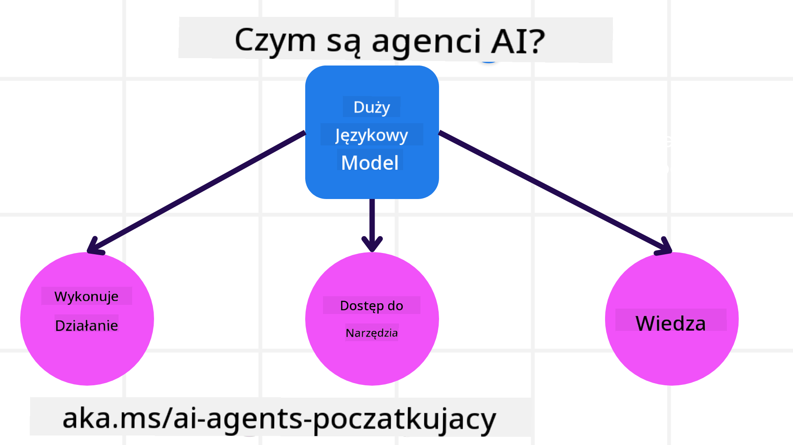
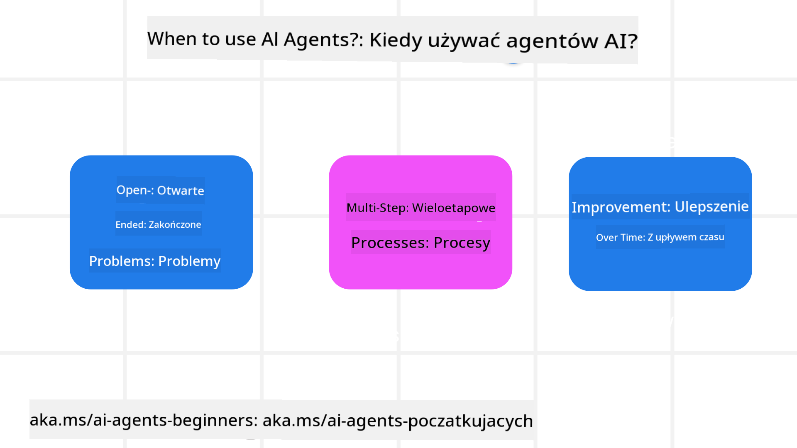

<!--
CO_OP_TRANSLATOR_METADATA:
{
  "original_hash": "1e40fe956ff79462a02a17080b125041",
  "translation_date": "2025-08-30T08:33:58+00:00",
  "source_file": "01-intro-to-ai-agents/README.md",
  "language_code": "pl"
}
-->

> _(Kliknij obrazek powyżej, aby obejrzeć wideo z tej lekcji)_

# Wprowadzenie do Agentów AI i ich Zastosowań

Witamy w kursie "Agenci AI dla Początkujących"! Ten kurs dostarcza podstawowej wiedzy oraz praktycznych przykładów budowania Agentów AI.

Dołącz do [Azure AI Foundry Discord](https://aka.ms/ai-agents/discord), aby spotkać innych uczestników i twórców Agentów AI oraz zadawać pytania dotyczące tego kursu.

Aby rozpocząć kurs, najpierw lepiej zrozumiemy, czym są Agenci AI i jak możemy ich używać w aplikacjach i procesach, które tworzymy.

## Wprowadzenie

Ta lekcja obejmuje:

- Czym są Agenci AI i jakie są ich różne typy?
- Jakie przypadki użycia najlepiej nadają się dla Agentów AI i jak mogą nam pomóc?
- Jakie są podstawowe elementy projektowania rozwiązań agentowych?

## Cele Nauki
Po ukończeniu tej lekcji będziesz w stanie:

- Zrozumieć koncepcje Agentów AI i jak różnią się od innych rozwiązań AI.
- Wykorzystywać Agenty AI w najbardziej efektywny sposób.
- Projektować rozwiązania agentowe produktywnie zarówno dla użytkowników, jak i klientów.

## Definicja Agentów AI i Typy Agentów AI

### Czym są Agenci AI?

Agenci AI to **systemy**, które umożliwiają **Modelom Językowym Wielkiej Skali (LLM)** **wykonywanie działań** poprzez rozszerzanie ich możliwości, dając im **dostęp do narzędzi** i **wiedzy**.

Rozbijmy tę definicję na mniejsze części:

- **System** - Ważne jest, aby myśleć o agentach nie jako o pojedynczym komponencie, ale jako o systemie składającym się z wielu elementów. Na podstawowym poziomie elementy Agenta AI to:
  - **Środowisko** - Zdefiniowana przestrzeń, w której działa Agent AI. Na przykład, jeśli mamy agenta rezerwacji podróży, środowiskiem może być system rezerwacji podróży, z którego agent korzysta, aby wykonywać zadania.
  - **Czujniki** - Środowiska zawierają informacje i dostarczają informacji zwrotnej. Agenci AI używają czujników do zbierania i interpretowania tych informacji o aktualnym stanie środowiska. W przykładzie agenta rezerwacji podróży system rezerwacji może dostarczać informacji, takich jak dostępność hoteli czy ceny lotów.
  - **Siłowniki** - Gdy Agent AI otrzyma aktualny stan środowiska, dla bieżącego zadania określa, jakie działanie podjąć, aby zmienić środowisko. W przypadku agenta rezerwacji podróży może to być zarezerwowanie dostępnego pokoju dla użytkownika.

**Modele Językowe Wielkiej Skali** - Koncepcja agentów istniała przed powstaniem LLM. Zaletą budowania Agentów AI z LLM jest ich zdolność do interpretowania języka ludzkiego i danych. Ta zdolność pozwala LLM interpretować informacje środowiskowe i definiować plan zmiany środowiska.

**Wykonywanie Działań** - Poza systemami Agentów AI, LLM są ograniczone do sytuacji, w których działaniem jest generowanie treści lub informacji na podstawie zapytania użytkownika. W systemach Agentów AI LLM mogą wykonywać zadania, interpretując prośbę użytkownika i korzystając z narzędzi dostępnych w ich środowisku.

**Dostęp do Narzędzi** - Jakie narzędzia są dostępne dla LLM, zależy od 1) środowiska, w którym działa, oraz 2) dewelopera Agenta AI. W naszym przykładzie agenta podróży narzędzia agenta są ograniczone przez operacje dostępne w systemie rezerwacji, a/lub deweloper może ograniczyć dostęp agenta do narzędzi, np. tylko do lotów.

**Pamięć + Wiedza** - Pamięć może być krótkoterminowa w kontekście rozmowy między użytkownikiem a agentem. Długoterminowo, poza informacjami dostarczanymi przez środowisko, Agenci AI mogą również pobierać wiedzę z innych systemów, usług, narzędzi, a nawet innych agentów. W przykładzie agenta podróży wiedza ta może obejmować informacje o preferencjach podróży użytkownika znajdujące się w bazie danych klientów.

### Różne typy agentów

Teraz, gdy mamy ogólną definicję Agentów AI, przyjrzyjmy się niektórym konkretnym typom agentów i jak można je zastosować w przypadku agenta rezerwacji podróży.

| **Typ Agenta**                | **Opis**                                                                                                                       | **Przykład**                                                                                                                                                                                                                   |
| ----------------------------- | -------------------------------------------------------------------------------------------------------------------------------- | ----------------------------------------------------------------------------------------------------------------------------------------------------------------------------------------------------------------------------- |
| **Proste Agenty Reaktywne**   | Wykonują natychmiastowe działania na podstawie zdefiniowanych reguł.                                                             | Agent podróży interpretuje kontekst e-maila i przekazuje skargi dotyczące podróży do obsługi klienta.                                                                                                                          |
| **Agenty Reaktywne z Modelem**| Wykonują działania na podstawie modelu świata i zmian w tym modelu.                                                              | Agent podróży priorytetowo traktuje trasy z istotnymi zmianami cen na podstawie dostępu do historycznych danych cenowych.                                                                                                       |
| **Agenty Celowe**             | Tworzą plany osiągnięcia określonych celów, interpretując cel i określając działania potrzebne do jego realizacji.                | Agent podróży rezerwuje podróż, określając niezbędne środki transportu (samochód, transport publiczny, loty) z obecnej lokalizacji do miejsca docelowego.                                                                        |
| **Agenty Użytecznościowe**    | Uwzględniają preferencje i oceniają kompromisy liczbowo, aby określić, jak osiągnąć cele.                                         | Agent podróży maksymalizuje użyteczność, ważąc wygodę w stosunku do kosztów podczas rezerwacji podróży.                                                                                                                         |
| **Agenty Uczące się**         | Ulepszają się z czasem, reagując na informacje zwrotne i odpowiednio dostosowując swoje działania.                                | Agent podróży ulepsza się, korzystając z opinii klientów z ankiet po podróży, aby wprowadzać zmiany w przyszłych rezerwacjach.                                                                                                  |
| **Agenty Hierarchiczne**      | Składają się z wielu agentów w systemie warstwowym, gdzie agenci wyższego poziomu dzielą zadania na podzadania dla agentów niższego poziomu. | Agent podróży anuluje podróż, dzieląc zadanie na podzadania (np. anulowanie konkretnych rezerwacji) i zlecając ich wykonanie agentom niższego poziomu, którzy raportują do agenta wyższego poziomu.                                |
| **Systemy Wieloagentowe (MAS)**| Agenci wykonują zadania niezależnie, współpracując lub konkurując.                                                               | Współpraca: Wielu agentów rezerwuje konkretne usługi podróżnicze, takie jak hotele, loty i rozrywka. Konkurencja: Wielu agentów zarządza wspólnym kalendarzem rezerwacji hotelowych, konkurując o rezerwacje klientów.             |

## Kiedy używać Agentów AI

W poprzedniej sekcji użyliśmy przykładu agenta podróży, aby wyjaśnić, jak różne typy agentów mogą być używane w różnych scenariuszach rezerwacji podróży. Będziemy kontynuować korzystanie z tej aplikacji w całym kursie.

Przyjrzyjmy się typom przypadków użycia, w których Agenci AI sprawdzają się najlepiej:

- **Problemy Otwarte** - pozwalając LLM określić potrzebne kroki do wykonania zadania, ponieważ nie zawsze można je zakodować w przepływie pracy.
- **Procesy Wieloetapowe** - zadania wymagające pewnego poziomu złożoności, w których Agent AI musi korzystać z narzędzi lub informacji przez wiele etapów, zamiast jednorazowego pobierania danych.
- **Ulepszanie z Czasem** - zadania, w których agent może się ulepszać, otrzymując informacje zwrotne od środowiska lub użytkowników, aby zapewnić lepszą użyteczność.

Więcej rozważań na temat używania Agentów AI omówimy w lekcji Budowanie Wiarygodnych Agentów AI.

## Podstawy Rozwiązań Agentowych

### Tworzenie Agentów

Pierwszym krokiem w projektowaniu systemu Agenta AI jest zdefiniowanie narzędzi, działań i zachowań. W tym kursie skupiamy się na korzystaniu z **Azure AI Agent Service** do definiowania naszych Agentów. Oferuje on funkcje takie jak:

- Wybór Otwartych Modeli, takich jak OpenAI, Mistral i Llama
- Wykorzystanie Licencjonowanych Danych od dostawców, takich jak Tripadvisor
- Wykorzystanie standaryzowanych narzędzi OpenAPI 3.0

### Wzorce Agentowe

Komunikacja z LLM odbywa się za pomocą promptów. Ze względu na półautonomiczny charakter Agentów AI, nie zawsze jest możliwe lub konieczne ręczne ponowne promptowanie LLM po zmianie w środowisku. Używamy **Wzorców Agentowych**, które pozwalają nam promptować LLM przez wiele etapów w bardziej skalowalny sposób.

Ten kurs jest podzielony na niektóre z obecnie popularnych wzorców agentowych.

### Frameworki Agentowe

Frameworki Agentowe pozwalają deweloperom implementować wzorce agentowe za pomocą kodu. Te frameworki oferują szablony, wtyczki i narzędzia do lepszej współpracy Agentów AI. Te korzyści zapewniają lepszą obserwowalność i rozwiązywanie problemów w systemach Agentów AI.

W tym kursie zbadamy oparty na badaniach framework AutoGen oraz gotowy do produkcji framework Agent z Semantic Kernel.

### Masz więcej pytań o Agentów AI?

Dołącz do [Azure AI Foundry Discord](https://aka.ms/ai-agents/discord), aby spotkać się z innymi uczestnikami, wziąć udział w godzinach konsultacyjnych i uzyskać odpowiedzi na pytania dotyczące Agentów AI.

## Poprzednia Lekcja

[Konfiguracja Kursu](../00-course-setup/README.md)

## Następna Lekcja

[Odkrywanie Frameworków Agentowych](../02-explore-agentic-frameworks/README.md)

---

**Zastrzeżenie**:  
Ten dokument został przetłumaczony za pomocą usługi tłumaczenia AI [Co-op Translator](https://github.com/Azure/co-op-translator). Chociaż staramy się zapewnić dokładność, prosimy pamiętać, że automatyczne tłumaczenia mogą zawierać błędy lub nieścisłości. Oryginalny dokument w jego rodzimym języku powinien być uznawany za autorytatywne źródło. W przypadku informacji krytycznych zaleca się skorzystanie z profesjonalnego tłumaczenia przez człowieka. Nie ponosimy odpowiedzialności za jakiekolwiek nieporozumienia lub błędne interpretacje wynikające z użycia tego tłumaczenia.