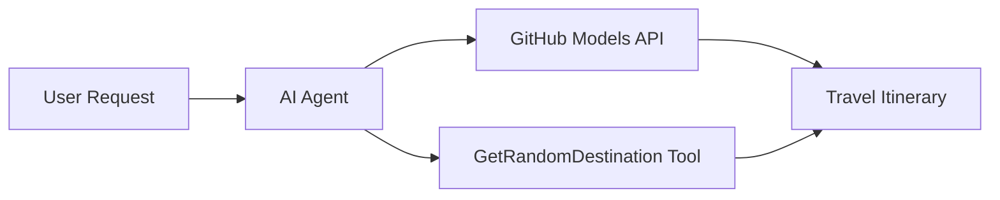

<!--
CO_OP_TRANSLATOR_METADATA:
{
  "original_hash": "e959fefef991a78e6eb72b5ce8ca58d4",
  "translation_date": "2025-11-11T11:13:39+00:00",
  "source_file": "01-intro-to-ai-agents/code_samples/01-dotnet-agent-framework.md",
  "language_code": "pl"
}
-->
# 🌍 Inteligentny Agent Podróżniczy z Microsoft Agent Framework (.NET)

## 📋 Przegląd Scenariusza

Ten notebook pokazuje, jak stworzyć inteligentnego agenta do planowania podróży, korzystając z Microsoft Agent Framework dla .NET. Agent może automatycznie generować spersonalizowane plany jednodniowych wycieczek do losowych miejsc na całym świecie.

### Kluczowe Funkcje:

- 🎲 **Losowy Wybór Miejsca**: Używa niestandardowego narzędzia do wyboru miejsc na wakacje
- 🗺️ **Inteligentne Planowanie Wycieczek**: Tworzy szczegółowe plany dzień po dniu
- 🔄 **Streaming w Czasie Rzeczywistym**: Obsługuje zarówno natychmiastowe, jak i strumieniowe odpowiedzi
- 🛠️ **Integracja Niestandardowych Narzędzi**: Pokazuje, jak rozszerzyć możliwości agenta

## 🔧 Architektura Techniczna

### Główne Technologie

- **Microsoft Agent Framework**: Najnowsza implementacja .NET do tworzenia agentów AI
- **Integracja z Modelami GitHub**: Korzysta z usługi inferencji modeli AI od GitHub
- **Kompatybilność z OpenAI API**: Wykorzystuje biblioteki klienta OpenAI z niestandardowymi punktami końcowymi
- **Bezpieczna Konfiguracja**: Zarządzanie kluczami API oparte na środowisku

### Kluczowe Komponenty

1. **AIAgent**: Główny orkiestrator agenta, który zarządza przepływem rozmowy
2. **Niestandardowe Narzędzia**: Funkcja `GetRandomDestination()` dostępna dla agenta
3. **Klient Czatu**: Interfejs rozmowy wspierany przez modele GitHub
4. **Obsługa Streamingu**: Możliwości generowania odpowiedzi w czasie rzeczywistym

### Wzorzec Integracji



## 🚀 Pierwsze Kroki

### Wymagania Wstępne

- [.NET 10 SDK](https://dotnet.microsoft.com/download/dotnet/10.0) lub nowszy
- [Token dostępu do API GitHub Models](https://docs.github.com/github-models/github-models-at-scale/using-your-own-api-keys-in-github-models)

### Wymagane Zmienne Środowiskowe

```bash
# zsh/bash
export GH_TOKEN=<your_github_token>
export GH_ENDPOINT=https://models.github.ai/inference
export GH_MODEL_ID=openai/gpt-5-mini
```

```powershell
# PowerShell
$env:GH_TOKEN = "<your_github_token>"
$env:GH_ENDPOINT = "https://models.github.ai/inference"
$env:GH_MODEL_ID = "openai/gpt-5-mini"
```

### Przykładowy Kod

Aby uruchomić przykład kodu,

```bash
# zsh/bash
chmod +x ./01-dotnet-agent-framework.cs
./01-dotnet-agent-framework.cs
```

Lub używając dotnet CLI:

```bash
dotnet run ./01-dotnet-agent-framework.cs
```

Zobacz [`01-dotnet-agent-framework.cs`](../../../../01-intro-to-ai-agents/code_samples/01-dotnet-agent-framework.cs) dla pełnego kodu.

```csharp
#!/usr/bin/dotnet run

#:package Microsoft.Extensions.AI@9.*
#:package Microsoft.Agents.AI.OpenAI@1.*-*

using System.ClientModel;
using System.ComponentModel;

using Microsoft.Agents.AI;
using Microsoft.Extensions.AI;

using OpenAI;

// Tool Function: Random Destination Generator
// This static method will be available to the agent as a callable tool
// The [Description] attribute helps the AI understand when to use this function
// This demonstrates how to create custom tools for AI agents
[Description("Provides a random vacation destination.")]
static string GetRandomDestination()
{
    // List of popular vacation destinations around the world
    // The agent will randomly select from these options
    var destinations = new List<string>
    {
        "Paris, France",
        "Tokyo, Japan",
        "New York City, USA",
        "Sydney, Australia",
        "Rome, Italy",
        "Barcelona, Spain",
        "Cape Town, South Africa",
        "Rio de Janeiro, Brazil",
        "Bangkok, Thailand",
        "Vancouver, Canada"
    };

    // Generate random index and return selected destination
    // Uses System.Random for simple random selection
    var random = new Random();
    int index = random.Next(destinations.Count);
    return destinations[index];
}

// Extract configuration from environment variables
// Retrieve the GitHub Models API endpoint, defaults to https://models.github.ai/inference if not specified
// Retrieve the model ID, defaults to openai/gpt-5-mini if not specified
// Retrieve the GitHub token for authentication, throws exception if not specified
var github_endpoint = Environment.GetEnvironmentVariable("GH_ENDPOINT") ?? "https://models.github.ai/inference";
var github_model_id = Environment.GetEnvironmentVariable("GH_MODEL_ID") ?? "openai/gpt-5-mini";
var github_token = Environment.GetEnvironmentVariable("GH_TOKEN") ?? throw new InvalidOperationException("GH_TOKEN is not set.");

// Configure OpenAI Client Options
// Create configuration options to point to GitHub Models endpoint
// This redirects OpenAI client calls to GitHub's model inference service
var openAIOptions = new OpenAIClientOptions()
{
    Endpoint = new Uri(github_endpoint)
};

// Initialize OpenAI Client with GitHub Models Configuration
// Create OpenAI client using GitHub token for authentication
// Configure it to use GitHub Models endpoint instead of OpenAI directly
var openAIClient = new OpenAIClient(new ApiKeyCredential(github_token), openAIOptions);

// Create AI Agent with Travel Planning Capabilities
// Initialize OpenAI client, get chat client for specified model, and create AI agent
// Configure agent with travel planning instructions and random destination tool
// The agent can now plan trips using the GetRandomDestination function
AIAgent agent = openAIClient
    .GetChatClient(github_model_id)
    .CreateAIAgent(
        instructions: "You are a helpful AI Agent that can help plan vacations for customers at random destinations",
        tools: [AIFunctionFactory.Create(GetRandomDestination)]
    );

// Execute Agent: Plan a Day Trip
// Run the agent with streaming enabled for real-time response display
// Shows the agent's thinking and response as it generates the content
// Provides better user experience with immediate feedback
await foreach (var update in agent.RunStreamingAsync("Plan me a day trip"))
{
    await Task.Delay(10);
    Console.Write(update);
}
```

---

<!-- CO-OP TRANSLATOR DISCLAIMER START -->
**Zastrzeżenie**:  
Ten dokument został przetłumaczony za pomocą usługi tłumaczenia AI [Co-op Translator](https://github.com/Azure/co-op-translator). Chociaż staramy się zapewnić dokładność, prosimy pamiętać, że automatyczne tłumaczenia mogą zawierać błędy lub nieścisłości. Oryginalny dokument w jego rodzimym języku powinien być uznawany za autorytatywne źródło. W przypadku informacji krytycznych zaleca się skorzystanie z profesjonalnego tłumaczenia przez człowieka. Nie ponosimy odpowiedzialności za jakiekolwiek nieporozumienia lub błędne interpretacje wynikające z użycia tego tłumaczenia.
<!-- CO-OP TRANSLATOR DISCLAIMER END -->