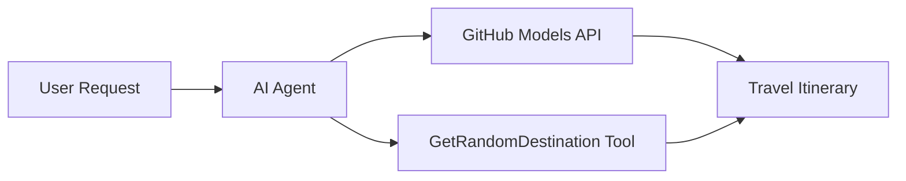

# 🌍 Inteligentny Agent Podróżniczy z Microsoft Agent Framework (.NET)

## 📋 Przegląd Scenariusza

Ten notebook pokazuje, jak stworzyć inteligentnego agenta do planowania podróży, korzystając z Microsoft Agent Framework dla .NET. Agent może automatycznie generować spersonalizowane plany jednodniowych wycieczek do losowych miejsc na świecie.

**Kluczowe Funkcje:**
- 🎲 **Losowy Wybór Miejsca**: Używa niestandardowego narzędzia do wyboru miejsc na wakacje
- 🗺️ **Inteligentne Planowanie Wycieczek**: Tworzy szczegółowe plany dzień po dniu
- 🔄 **Streaming w Czasie Rzeczywistym**: Obsługuje zarówno natychmiastowe, jak i strumieniowe odpowiedzi
- 🛠️ **Integracja Niestandardowych Narzędzi**: Pokazuje, jak rozszerzyć możliwości agenta

## 🔧 Architektura Techniczna

### Główne Technologie
- **Microsoft Agent Framework**: Najnowsza implementacja .NET do tworzenia agentów AI
- **Integracja z Modelami GitHub**: Korzysta z usługi inferencji modeli AI od GitHub
- **Kompatybilność z OpenAI API**: Wykorzystuje biblioteki klienta OpenAI z niestandardowymi punktami końcowymi
- **Bezpieczna Konfiguracja**: Zarządzanie kluczami API oparte na środowisku

### Kluczowe Komponenty
1. **AIAgent**: Główny orkiestrator agenta, który zarządza przepływem rozmowy
2. **Niestandardowe Narzędzia**: Funkcja `GetRandomDestination()` dostępna dla agenta
3. **Klient Czatu**: Interfejs rozmowy wspierany przez modele GitHub
4. **Obsługa Streamingu**: Możliwości generowania odpowiedzi w czasie rzeczywistym

### Wzorzec Integracji


## 🚀 Pierwsze Kroki

**Wymagania wstępne:**
- .NET 9.0 lub nowszy
- Token dostępu do API GitHub Models
- Zmiennie środowiskowe skonfigurowane w pliku `.env`

**Wymagane Zmiennie Środowiskowe:**
```env
GITHUB_TOKEN=your_github_token
GITHUB_ENDPOINT=https://models.inference.ai.azure.com
GITHUB_MODEL_ID=gpt-4o-mini
```

Uruchom poniższe komórki w kolejności, aby zobaczyć agenta podróżniczego w akcji!

---

## .NET Single File App: AI Travel Agent Example

See `01-dotnet-agent-framework.cs` for the complete runnable code sample.

Uruchom poniższy przykład kodu:

```bash
dotnet run 01-dotnet-agent-framework.cs
```

### Sample Code

```csharp
static string GetRandomDestination()
{
    var destinations = new List<string>
    {
        "Paris, France",
        "Tokyo, Japan",
        "New York City, USA",
        "Sydney, Australia",
        "Rome, Italy",
        "Barcelona, Spain",
        "Cape Town, South Africa",
        "Rio de Janeiro, Brazil",
        "Bangkok, Thailand",
        "Vancouver, Canada"
    };
    var random = new Random();
    int index = random.Next(destinations.Count);
    return destinations[index];
}

// Extract configuration from environment variables
var github_endpoint = Environment.GetEnvironmentVariable("GITHUB_ENDPOINT") ?? throw new InvalidOperationException("GITHUB_ENDPOINT is not set.");
var github_model_id = Environment.GetEnvironmentVariable("GITHUB_MODEL_ID") ?? "gpt-4o-mini";
var github_token = Environment.GetEnvironmentVariable("GITHUB_TOKEN") ?? throw new InvalidOperationException("GITHUB_TOKEN is not set.");

// Configure OpenAI Client Options
var openAIOptions = new OpenAIClientOptions()
{
    Endpoint = new Uri(github_endpoint)
};

// Initialize OpenAI Client with GitHub Models Configuration
var openAIClient = new OpenAIClient(new ApiKeyCredential(github_token), openAIOptions);

// Create AI Agent with Travel Planning Capabilities
AIAgent agent = openAIClient
    .GetChatClient(github_model_id)
    .CreateAIAgent(
        instructions: "You are a helpful AI Agent that can help plan vacations for customers at random destinations",
        tools: [AIFunctionFactory.Create(GetRandomDestination)]
    );

// Execute Agent: Plan a Day Trip (Non-Streaming)
Console.WriteLine(await agent.RunAsync("Plan me a day trip"));

// Execute Agent: Plan a Day Trip (Streaming Response)
await foreach (var update in agent.RunStreamingAsync("Plan me a day trip"))
{
    Console.Write(update);
}
```
