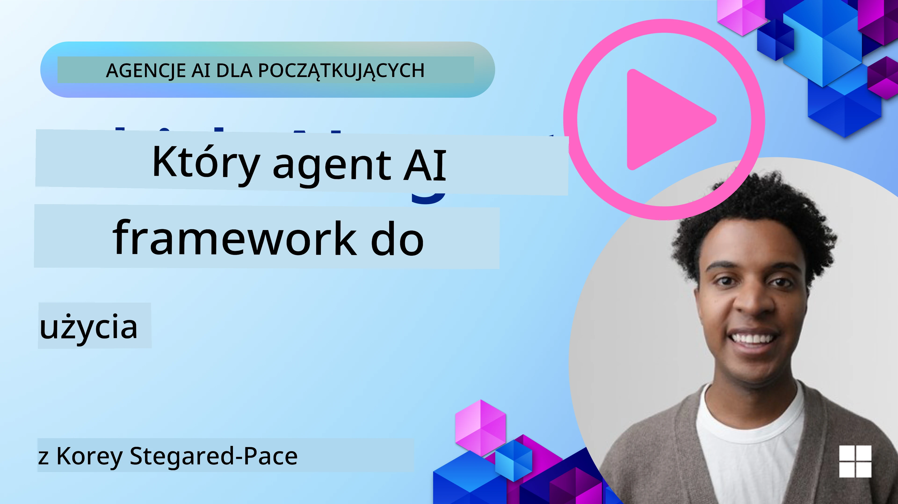

[](https://youtu.be/ODwF-EZo_O8?si=1xoy_B9RNQfrYdF7)

> _(Kliknij powyższy obraz, aby obejrzeć wideo z tej lekcji)_

# Eksploracja frameworków agentów AI

Frameworki agentów AI to platformy programistyczne zaprojektowane, aby uprościć tworzenie, wdrażanie i zarządzanie agentami AI. Frameworki te dostarczają deweloperom gotowe komponenty, abstrakcje i narzędzia, które usprawniają rozwój złożonych systemów AI.

Frameworki te pomagają deweloperom skupić się na unikalnych aspektach ich aplikacji, oferując standardowe podejścia do typowych wyzwań w rozwoju agentów AI. Zwiększają skalowalność, dostępność oraz efektywność przy budowie systemów AI.

## Wprowadzenie

W tej lekcji omówimy:

- Czym są frameworki agentów AI i co umożliwiają deweloperom?
- Jak zespoły mogą szybko prototypować, iterować i ulepszać zdolności swoich agentów?
- Jakie są różnice między frameworkami i narzędziami stworzonymi przez Microsoft (<a href="https://aka.ms/ai-agents-beginners/ai-agent-service" target="_blank">Azure AI Agent Service</a> i <a href="https://learn.microsoft.com/azure/ai-services/openai/how-to/responses" target="_blank">Microsoft Agent Framework</a>)?
- Czy mogę bezpośrednio zintegrować moje istniejące narzędzia ekosystemu Azure, czy potrzebuję rozwiązań samodzielnych?
- Czym jest usługa Azure AI Agents i jak mi pomaga?

## Cele nauki

Celem tej lekcji jest pomóc Ci zrozumieć:

- Rola frameworków agentów AI w rozwoju AI.
- Jak wykorzystywać frameworki agentów AI do budowy inteligentnych agentów.
- Kluczowe funkcje udostępniane przez frameworki agentów AI.
- Różnice między Microsoft Agent Framework a Azure AI Agent Service.

## Czym są frameworki agentów AI i co pozwalają osiągnąć deweloperom?

Tradycyjne frameworki AI mogą pomóc Ci zintegrować AI z aplikacjami i usprawnić je na następujące sposoby:

- **Personalizacja**: AI może analizować zachowanie i preferencje użytkowników, aby dostarczać spersonalizowane rekomendacje, treści i doświadczenia.  
Przykład: Serwisy streamingowe jak Netflix używają AI, aby sugerować filmy i seriale na podstawie historii oglądania, zwiększając zaangażowanie i satysfakcję użytkowników.  
- **Automatyzacja i efektywność**: AI może automatyzować powtarzalne zadania, usprawniać procesy i poprawiać efektywność operacyjną.  
Przykład: Aplikacje obsługi klienta wykorzystują chatbooty zasilane AI do obsługi typowych zapytań, skracając czas reakcji i uwalniając personel do bardziej skomplikowanych problemów.  
- **Ulepszone doświadczenie użytkownika**: AI może poprawić ogólne doświadczenie użytkownika, oferując inteligentne funkcje takie jak rozpoznawanie mowy, przetwarzanie języka naturalnego i podpowiadanie tekstu.  
Przykład: Wirtualni asystenci jak Siri czy Google Assistant używają AI, aby rozumieć i odpowiadać na polecenia głosowe, ułatwiając interakcję z urządzeniami.

### Brzmi świetnie, prawda? To po co potrzebujemy frameworków agentów AI?

Frameworki agentów AI to coś bardziej zaawansowanego niż zwykłe frameworki AI. Są projektowane tak, aby umożliwić tworzenie inteligentnych agentów, którzy mogą współdziałać z użytkownikami, innymi agentami i środowiskiem, aby osiągać konkretne cele. Agenci ci mogą wykazywać autonomiczne zachowanie, podejmować decyzje i adaptować się do zmieniających się warunków. Spójrzmy na kluczowe funkcje, jakie udostępniają frameworki agentów AI:

- **Współpraca i koordynacja agentów**: Umożliwia tworzenie wielu agentów AI pracujących wspólnie, komunikujących się i koordynujących działania w celu rozwiązywania złożonych zadań.
- **Automatyzacja i zarządzanie zadaniami**: Dostarcza mechanizmy do automatyzacji wieloetapowych procesów, delegowania zadań i dynamicznego zarządzania zadaniami między agentami.
- **Rozumienie kontekstu i adaptacja**: Wyposaża agentów w zdolność rozumienia kontekstu, adaptacji do zmieniającego się środowiska i podejmowania decyzji na podstawie informacji w czasie rzeczywistym.

Podsumowując, agenci pozwalają zrobić więcej, przenieść automatyzację na wyższy poziom, stworzyć inteligentniejsze systemy, które potrafią się adaptować i uczyć ze swojego otoczenia.

## Jak szybko prototypować, iterować i ulepszać zdolności agenta?

To dynamiczny obszar, ale istnieją pewne wspólne elementy większości frameworków agentów AI, które mogą Ci pomóc szybko prototypować i iterować, mianowicie komponenty modułowe, narzędzia współpracy i uczenie się w czasie rzeczywistym. Przyjrzyjmy się im:

- **Używaj komponentów modułowych**: SDK AI oferują gotowe komponenty takie jak konektory AI i pamięci, wywoływanie funkcji za pomocą języka naturalnego lub wtyczek kodu, szablony promptów i więcej. 
- **Wykorzystuj narzędzia współpracy**: Projektuj agentów z określonymi rolami i zadaniami, umożliwiając im testowanie i dopracowywanie współpracy.
- **Ucz się w czasie rzeczywistym**: Implementuj pętle sprzężenia zwrotnego, gdzie agenci uczą się z interakcji i dynamicznie dostosowują swoje zachowanie.

### Używaj komponentów modułowych

SDK, takie jak Microsoft Agent Framework, oferują gotowe komponenty, takie jak konektory AI, definicje narzędzi i zarządzanie agentami.

**Jak zespoły mogą ich używać**: Zespoły mogą szybko składać te komponenty, aby stworzyć funkcjonalny prototyp bez konieczności zaczynania od zera, umożliwiając szybkie eksperymentowanie i iterację.

**Jak to działa w praktyce**: Możesz użyć predefiniowanego parsera do wyodrębniania informacji z wejścia użytkownika, modułu pamięci do przechowywania i przywoływania danych oraz generatora promptów do interakcji z użytkownikami, wszystko bez konieczności tworzenia tych komponentów od zera.

**Przykład kodu**. Spójrzmy na przykład użycia Microsoft Agent Framework z `AzureAIProjectAgentProvider`, gdzie model odpowiada na wejście użytkownika z wywoływaniem narzędzi:

``` python
# Przykład Microsoft Agent Framework w Pythonie

import asyncio
import os
from typing import Annotated

from agent_framework.azure import AzureAIProjectAgentProvider
from azure.identity import AzureCliCredential


# Zdefiniuj przykładową funkcję narzędzia do rezerwacji podróży
def book_flight(date: str, location: str) -> str:
    """Book travel given location and date."""
    return f"Travel was booked to {location} on {date}"


async def main():
    provider = AzureAIProjectAgentProvider(credential=AzureCliCredential())
    agent = await provider.create_agent(
        name="travel_agent",
        instructions="Help the user book travel. Use the book_flight tool when ready.",
        tools=[book_flight],
    )

    response = await agent.run("I'd like to go to New York on January 1, 2025")
    print(response)
    # Przykładowe wyjście: Twój lot do Nowego Jorku na 1 stycznia 2025 został pomyślnie zarezerwowany. Szczęśliwej podróży! ✈️🗽


if __name__ == "__main__":
    asyncio.run(main())
```
  
W tym przykładzie widać, jak można wykorzystać gotowy parser do wyciągnięcia kluczowych informacji z wejścia użytkownika, takich jak miejsce wylotu, cel i data rezerwacji lotu. Takie modułowe podejście pozwala skupić się na logice wysokiego poziomu.

### Wykorzystuj narzędzia współpracy

Frameworki takie jak Microsoft Agent Framework ułatwiają tworzenie wielu agentów, którzy mogą współpracować.

**Jak zespoły mogą ich używać**: Zespoły mogą projektować agentów z określonymi rolami i zadaniami, pozwalając im testować i usprawniać współpracę oraz zwiększać wydajność systemu.

**Jak to działa w praktyce**: Możesz stworzyć zespół agentów, z których każdy posiada specjalizację, np. pobieranie danych, analiza czy podejmowanie decyzji. Agenci mogą się komunikować i dzielić informacjami, aby osiągnąć wspólny cel, np. odpowiedzieć na zapytanie użytkownika lub wykonać zadanie.

**Przykład kodu (Microsoft Agent Framework)**:  

```python
# Tworzenie wielu agentów współpracujących ze sobą przy użyciu Microsoft Agent Framework

import os
from agent_framework.azure import AzureAIProjectAgentProvider
from azure.identity import AzureCliCredential

provider = AzureAIProjectAgentProvider(credential=AzureCliCredential())

# Agent pobierania danych
agent_retrieve = await provider.create_agent(
    name="dataretrieval",
    instructions="Retrieve relevant data using available tools.",
    tools=[retrieve_tool],
)

# Agent analizy danych
agent_analyze = await provider.create_agent(
    name="dataanalysis",
    instructions="Analyze the retrieved data and provide insights.",
    tools=[analyze_tool],
)

# Uruchamianie agentów w kolejności dla zadania
retrieval_result = await agent_retrieve.run("Retrieve sales data for Q4")
analysis_result = await agent_analyze.run(f"Analyze this data: {retrieval_result}")
print(analysis_result)
```
  
Przykład pokazuje, jak utworzyć zadanie obejmujące współpracę wielu agentów przy analizie danych. Każdy agent wykonuje określoną funkcję, a zadanie realizowane jest przez koordynację ich pracy. Tworząc dedykowanych agentów z wyspecjalizowanymi rolami, można poprawić efektywność i wydajność realizacji zadań.

### Ucz się w czasie rzeczywistym

Zaawansowane frameworki oferują możliwości rozumienia kontekstu i adaptacji w czasie rzeczywistym.

**Jak zespoły mogą ich używać**: Mogą implementować pętle sprzężenia zwrotnego, w których agenci uczą się z interakcji i dynamicznie dostosowują swoje zachowanie, co prowadzi do ciągłej poprawy i udoskonalania funkcji.

**Jak to działa w praktyce**: Agenci analizują opinie użytkowników, dane środowiskowe i wyniki zadań, aktualizują bazę wiedzy, dostosowują algorytmy decyzyjne i poprawiają wydajność z czasem. Taki iteracyjny proces uczenia pozwala agentom dostosowywać się do zmieniających się warunków i preferencji użytkowników, zwiększając skuteczność systemu.

## Jakie są różnice między Microsoft Agent Framework a Azure AI Agent Service?

Istnieje wiele sposobów porównania tych podejść, jednak przyjrzyjmy się kluczowym różnicom pod względem konstrukcji, funkcji i docelowych scenariuszy użycia:

## Microsoft Agent Framework (MAF)

Microsoft Agent Framework to uproszczony SDK do budowy agentów AI korzystających z `AzureAIProjectAgentProvider`. Pozwala deweloperom tworzyć agentów, którzy wykorzystują modele Azure OpenAI z wbudowanym wywoływaniem narzędzi, zarządzaniem rozmową i bezpieczeństwem klasy enterprise dzięki tożsamości Azure.

**Scenariusze użycia**: Budowa gotowych do produkcji agentów AI z obsługą narzędzi, wieloetapowych procesów oraz integracją korporacyjną.

Oto ważne podstawowe koncepcje Microsoft Agent Framework:

- **Agenci**. Agent tworzony jest przez `AzureAIProjectAgentProvider` i konfigurowany za pomocą nazwy, instrukcji i narzędzi. Agent może:
  - **Przetwarzać wiadomości użytkownika** i generować odpowiedzi wykorzystując modele Azure OpenAI.
  - **Automatycznie wywoływać narzędzia** na podstawie kontekstu rozmowy.
  - **Utrzymywać stan rozmowy** w trakcie wielu interakcji.

  Poniżej fragment kodu pokazujący tworzenie agenta:

    ```python
    import os
    from agent_framework.azure import AzureAIProjectAgentProvider
    from azure.identity import AzureCliCredential

    provider = AzureAIProjectAgentProvider(credential=AzureCliCredential())
    agent = await provider.create_agent(
        name="my_agent",
        instructions="You are a helpful assistant.",
    )

    response = await agent.run("Hello, World!")
    print(response)
    ```
  
- **Narzędzia**. Framework umożliwia definiowanie narzędzi jako funkcji Pythona, które agent może wywoływać automatycznie. Narzędzia rejestruje się podczas tworzenia agenta:

    ```python
    def get_weather(location: str) -> str:
        """Get the current weather for a location."""
        return f"The weather in {location} is sunny, 72\u00b0F."

    agent = await provider.create_agent(
        name="weather_agent",
        instructions="Help users check the weather.",
        tools=[get_weather],
    )
    ```
  
- **Koordynacja wielu agentów**. Możesz tworzyć wielu agentów z różnymi specjalizacjami i koordynować ich pracę:

    ```python
    planner = await provider.create_agent(
        name="planner",
        instructions="Break down complex tasks into steps.",
    )

    executor = await provider.create_agent(
        name="executor",
        instructions="Execute the planned steps using available tools.",
        tools=[execute_tool],
    )

    plan = await planner.run("Plan a trip to Paris")
    result = await executor.run(f"Execute this plan: {plan}")
    ```
  
- **Integracja tożsamości Azure**. Framework używa `AzureCliCredential` (lub `DefaultAzureCredential`) do bezpiecznej, bezkluczowej autoryzacji, eliminując konieczność zarządzania kluczami API.

## Azure AI Agent Service

Azure AI Agent Service to nowsza usługa wprowadzona podczas Microsoft Ignite 2024. Pozwala na tworzenie i wdrażanie agentów AI z wykorzystaniem bardziej elastycznych modeli, takich jak bezpośrednie wywoływanie otwartoźródłowych LLM, np. Llama 3, Mistral i Cohere.

Usługa Azure AI Agent Service zapewnia silniejsze mechanizmy zabezpieczeń klasy enterprise oraz metody przechowywania danych, co sprawia, że nadaje się do zastosowań korporacyjnych.

Działa bezproblemowo z Microsoft Agent Framework przy budowie i wdrażaniu agentów.

Usługa jest obecnie w publicznej wersji zapoznawczej i wspiera Pythona oraz C# do tworzenia agentów.

Przykład użycia SDK Python usługi Azure AI Agent Service do stworzenia agenta z narzędziem zdefiniowanym przez użytkownika:

```python
import asyncio
from azure.identity import DefaultAzureCredential
from azure.ai.projects import AIProjectClient

# Zdefiniuj funkcje narzędziowe
def get_specials() -> str:
    """Provides a list of specials from the menu."""
    return """
    Special Soup: Clam Chowder
    Special Salad: Cobb Salad
    Special Drink: Chai Tea
    """

def get_item_price(menu_item: str) -> str:
    """Provides the price of the requested menu item."""
    return "$9.99"


async def main() -> None:
    credential = DefaultAzureCredential()
    project_client = AIProjectClient.from_connection_string(
        credential=credential,
        conn_str="your-connection-string",
    )

    agent = project_client.agents.create_agent(
        model="gpt-4o-mini",
        name="Host",
        instructions="Answer questions about the menu.",
        tools=[get_specials, get_item_price],
    )

    thread = project_client.agents.create_thread()

    user_inputs = [
        "Hello",
        "What is the special soup?",
        "How much does that cost?",
        "Thank you",
    ]

    for user_input in user_inputs:
        print(f"# User: '{user_input}'")
        message = project_client.agents.create_message(
            thread_id=thread.id,
            role="user",
            content=user_input,
        )
        run = project_client.agents.create_and_process_run(
            thread_id=thread.id, agent_id=agent.id
        )
        messages = project_client.agents.list_messages(thread_id=thread.id)
        print(f"# Agent: {messages.data[0].content[0].text.value}")


if __name__ == "__main__":
    asyncio.run(main())
```
  
### Podstawowe koncepcje

Azure AI Agent Service obejmuje następujące koncepcje:

- **Agent**. Usługa integruje się z Microsoft Foundry. W AI Foundry agent AI działa jako „inteligentna” mikrousługa służąca do odpowiadania na pytania (RAG), wykonywania działań lub pełnej automatyzacji przepływów pracy. Osiąga to przez połączenie mocy generatywnych modeli AI z narzędziami umożliwiającymi dostęp i interakcję z rzeczywistymi źródłami danych. Przykład agenta:

    ```python
    agent = project_client.agents.create_agent(
        model="gpt-4o-mini",
        name="my-agent",
        instructions="You are helpful agent",
        tools=code_interpreter.definitions,
        tool_resources=code_interpreter.resources,
    )
    ```
  
    W tym przykładzie agent utworzony jest z modelem `gpt-4o-mini`, nazwą `my-agent` oraz instrukcjami `You are helpful agent`. Agent wyposaża się w narzędzia i zasoby do wykonywania zadań interpretacji kodu.

- **Wątki i wiadomości**. Wątek to bardzo ważna koncepcja. Reprezentuje on rozmowę lub interakcję między agentem a użytkownikiem. Wątki mogą służyć do śledzenia postępów konwersacji, przechowywania kontekstu i zarządzania stanem interakcji. Przykład wątku:

    ```python
    thread = project_client.agents.create_thread()
    message = project_client.agents.create_message(
        thread_id=thread.id,
        role="user",
        content="Could you please create a bar chart for the operating profit using the following data and provide the file to me? Company A: $1.2 million, Company B: $2.5 million, Company C: $3.0 million, Company D: $1.8 million",
    )
    
    # Ask the agent to perform work on the thread
    run = project_client.agents.create_and_process_run(thread_id=thread.id, agent_id=agent.id)
    
    # Fetch and log all messages to see the agent's response
    messages = project_client.agents.list_messages(thread_id=thread.id)
    print(f"Messages: {messages}")
    ```
  
    W powyższym kodzie tworzony jest wątek, następnie wysyłana jest wiadomość do wątku. Wywołaniem `create_and_process_run` agent prosi się o wykonanie pracy na wątku. Na końcu wiadomości są pobierane i logowane, aby zobaczyć odpowiedź agenta. Wiadomości odzwierciedlają postępy rozmowy między użytkownikiem a agentem. Ważne jest również zrozumienie, że wiadomości mogą mieć różne typy, np. tekst, obraz lub plik, czyli praca agenta może skutkować np. obrazem lub tekstową odpowiedzią. Jako deweloper, możesz wykorzystać te informacje do dalszego przetwarzania odpowiedzi lub prezentacji jej użytkownikowi.

- **Integracja z Microsoft Agent Framework**. Azure AI Agent Service działa płynnie z Microsoft Agent Framework, co oznacza, że możesz tworzyć agentów za pomocą `AzureAIProjectAgentProvider` i wdrażać je za pomocą Agent Service do produkcji.

**Scenariusze użycia**: Azure AI Agent Service jest przeznaczona do zastosowań korporacyjnych wymagających bezpiecznego, skalowalnego i elastycznego wdrażania agentów AI.

## Jaka jest różnica między tymi podejściami?

Istnieje nakładanie się funkcji, jednak podstawowe różnice dotyczą konstrukcji, możliwości i scenariuszy użycia:

- **Microsoft Agent Framework (MAF)**: To gotowy do produkcji SDK do budowy agentów AI. Zapewnia uproszczone API do tworzenia agentów z wywoływaniem narzędzi, zarządzaniem rozmową oraz integracją tożsamości Azure.
- **Azure AI Agent Service**: To platforma i usługa wdrażania agentów w Azure Foundry. Oferuje wbudowaną łączność z usługami jak Azure OpenAI, Azure AI Search, Bing Search i wykonywaniem kodu.

Nadal nie jesteś pewien, który wybrać?

### Scenariusze Użycia

Sprawdźmy, czy pomożemy Ci przez omówienie typowych przypadków:

> P: Buduję produkcyjne aplikacje agentów AI i chcę szybko zacząć  
> O: Microsoft Agent Framework to świetny wybór. Oferuje proste, Pythonowe API za pomocą `AzureAIProjectAgentProvider`, które pozwala definiować agentów z narzędziami i instrukcjami w zaledwie kilku linijkach kodu.

> P: Potrzebuję wdrożenia klasy enterprise z integracjami Azure takimi jak Search i wykonywanie kodu  
> O: Azure AI Agent Service jest najlepszym wyborem. To usługa platformowa, która oferuje wbudowane możliwości dla wielu modeli, Azure AI Search, Bing Search oraz Azure Functions. Łatwo jest budować agentów w Foundry Portal i wdrażać je na dużą skalę.

> P: Wciąż jestem niepewny, daj mi tylko jedną opcję  
> O: Zacznij od Microsoft Agent Framework, aby budować agentów, a potem użyj Azure AI Agent Service, gdy będziesz potrzebować wdrożyć i skalować agentów w produkcji. To pozwala szybko iterować nad logiką agenta, mając jednocześnie jasną ścieżkę do wdrożenia enterprise.

Podsumujmy kluczowe różnice w tabeli:

| Framework | Fokus | Podstawowe koncepcje | Scenariusze użycia |
| --- | --- | --- | --- |
| Microsoft Agent Framework | Uproszczone SDK agenta z wywoływaniem narzędzi | Agenci, Narzędzia, Tożsamość Azure | Budowa agentów AI, użycie narzędzi, wieloetapowe procesy |
| Azure AI Agent Service | Elastyczne modele, bezpieczeństwo enterprise, generowanie kodu, wywoływanie narzędzi | Modułowość, Współpraca, Orkiestracja procesów | Bezpieczne, skalowalne i elastyczne wdrażanie agentów AI |

## Czy mogę bezpośrednio zintegrować moje istniejące narzędzia ekosystemu Azure, czy potrzebuję rozwiązań samodzielnych?
Odpowiedź brzmi tak, możesz zintegrować swoje istniejące narzędzia ekosystemu Azure bezpośrednio z usługą Azure AI Agent, zwłaszcza że została ona zaprojektowana do bezproblemowej współpracy z innymi usługami Azure. Możesz na przykład zintegrować Bing, Azure AI Search i Azure Functions. Istnieje także głęboka integracja z Microsoft Foundry.

Microsoft Agent Framework integruje się również z usługami Azure za pomocą `AzureAIProjectAgentProvider` i tożsamości Azure, umożliwiając wywoływanie usług Azure bezpośrednio z narzędzi agenta.

## Przykładowe kody

- Python: [Agent Framework](./code_samples/02-python-agent-framework.ipynb)
- .NET: [Agent Framework](./code_samples/02-dotnet-agent-framework.md)

## Masz więcej pytań dotyczących AI Agent Frameworks?

Dołącz do [Microsoft Foundry Discord](https://aka.ms/ai-agents/discord), aby spotkać się z innymi uczącymi się, uczestniczyć w godzinach konsultacji i uzyskać odpowiedzi na pytania dotyczące AI Agents.

## Źródła

- <a href="https://techcommunity.microsoft.com/blog/azure-ai-services-blog/introducing-azure-ai-agent-service/4298357" target="_blank">Azure Agent Service</a>
- <a href="https://learn.microsoft.com/azure/ai-services/openai/how-to/responses" target="_blank">Microsoft Agent Framework - Azure OpenAI Responses</a>
- <a href="https://learn.microsoft.com/azure/ai-services/agents/overview" target="_blank">Azure AI Agent service</a>

## Poprzednia lekcja

[Wprowadzenie do AI Agents i przypadków użycia agentów](../01-intro-to-ai-agents/README.md)

## Następna lekcja

[Zrozumienie wzorców projektowych agentów](../03-agentic-design-patterns/README.md)

---

<!-- CO-OP TRANSLATOR DISCLAIMER START -->
**Zastrzeżenie**:  
Niniejszy dokument został przetłumaczony za pomocą automatycznej usługi tłumaczeniowej AI [Co-op Translator](https://github.com/Azure/co-op-translator). Mimo że dokładamy starań, aby tłumaczenie było jak najbardziej precyzyjne, prosimy pamiętać, że tłumaczenia automatyczne mogą zawierać błędy lub nieścisłości. Oryginalny dokument w oryginalnym języku należy traktować jako źródło autorytatywne. W przypadku informacji krytycznych zalecane jest skorzystanie z profesjonalnego tłumaczenia wykonanego przez człowieka. Nie ponosimy odpowiedzialności za jakiekolwiek nieporozumienia lub błędne interpretacje wynikające z korzystania z tego tłumaczenia.
<!-- CO-OP TRANSLATOR DISCLAIMER END -->