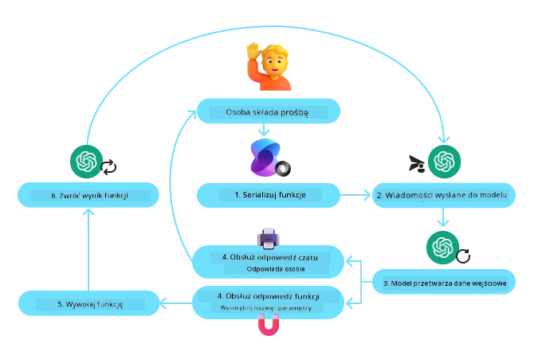
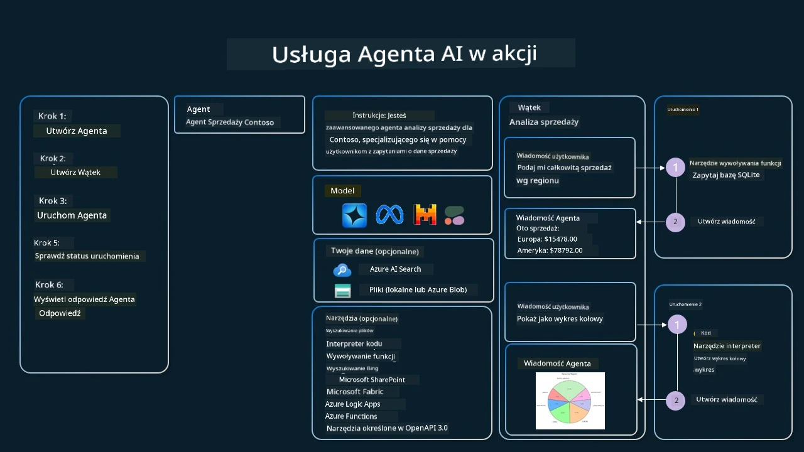

[](https://youtu.be/vieRiPRx-gI?si=cEZ8ApnT6Sus9rhn)

> _(Kliknij powyższy obraz, aby obejrzeć wideo tej lekcji)_

# Wzorzec projektowy użycia narzędzi

Narzędzia są interesujące, ponieważ pozwalają agentom AI mieć szerszy zakres możliwości. Zamiast agenta posiadającego ograniczony zestaw działań, poprzez dodanie narzędzia agent może teraz wykonać znacznie szerszy zakres operacji. W tym rozdziale przyjrzymy się Wzorcu projektowemu użycia narzędzi, który opisuje, jak agenty AI mogą korzystać ze specyficznych narzędzi, aby osiągać swoje cele.

## Wprowadzenie

W tej lekcji chcemy odpowiedzieć na następujące pytania:

- Czym jest wzorzec projektowy użycia narzędzi?
- Do jakich przypadków użycia można go zastosować?
- Jakie elementy/bloki konstrukcyjne są potrzebne do implementacji tego wzorca?
- Jakie są szczególne kwestie do rozważenia przy użyciu Wzorca projektowego użycia narzędzi w celu budowy wiarygodnych agentów AI?

## Cele nauki

Po ukończeniu tej lekcji będziesz w stanie:

- Zdefiniować Wzorzec projektowy użycia narzędzi i jego cel.
- Zidentyfikować przypadki użycia, w których wzorzec jest stosowny.
- Zrozumieć kluczowe elementy potrzebne do wdrożenia wzorca projektowego.
- Rozpoznać kwestie związane z zapewnieniem wiarygodności agentów AI wykorzystujących ten wzorzec.

## Czym jest Wzorzec projektowy użycia narzędzi?

Wzorzec projektowy użycia narzędzi koncentruje się na nadaniu LLMom możliwości interakcji z zewnętrznymi narzędziami w celu osiągania określonych celów. Narzędzia to kod, który może być wykonywany przez agenta w celu przeprowadzenia działań. Narzędzie może być prostą funkcją, taką jak kalkulator, lub wywołaniem API do usługi zewnętrznej, takiej jak sprawdzanie cen akcji czy prognoza pogody. W kontekście agentów AI narzędzia są zaprojektowane tak, aby były wykonywane przez agentów w odpowiedzi na **wywołania funkcji generowane przez model**.

## Do jakich przypadków użycia można go zastosować?

Agenty AI mogą wykorzystywać narzędzia do realizacji złożonych zadań, pobierania informacji lub podejmowania decyzji. Wzorzec użycia narzędzi jest często wykorzystywany w scenariuszach wymagających dynamicznej interakcji z systemami zewnętrznymi, takimi jak bazy danych, usługi sieciowe czy interpretery kodu. Ta zdolność jest przydatna w wielu różnych przypadkach użycia, w tym:

- **Dynamiczne pobieranie informacji:** Agenty mogą zapytywać zewnętrzne API lub bazy danych, aby pobierać aktualne dane (np. zapytanie bazy danych SQLite w celu analizy danych, pobieranie cen akcji lub informacji o pogodzie).
- **Wykonywanie i interpretacja kodu:** Agenty mogą uruchamiać kod lub skrypty, aby rozwiązywać problemy matematyczne, generować raporty lub przeprowadzać symulacje.
- **Automatyzacja przepływów pracy:** Automatyzacja powtarzalnych lub wieloetapowych przepływów pracy poprzez integrację narzędzi takich jak harmonogramy zadań, usługi e-mail lub potoki danych.
- **Obsługa klienta:** Agenty mogą wchodzić w interakcje z systemami CRM, platformami zgłoszeń lub bazami wiedzy, aby rozwiązywać zapytania użytkowników.
- **Tworzenie i edycja treści:** Agenty mogą wykorzystywać narzędzia takie jak korektory gramatyczne, streszczacze tekstu lub oceniające bezpieczeństwo treści, aby wspierać tworzenie materiałów.

## Jakie elementy/bloki konstrukcyjne są potrzebne do wdrożenia wzorca użycia narzędzi?

Te bloki konstrukcyjne pozwalają agentowi AI wykonywać szeroki zakres zadań. Przyjrzyjmy się kluczowym elementom potrzebnym do implementacji Wzorca projektowego użycia narzędzi:

- **Schematy funkcji/narzędzi**: Szczegółowe definicje dostępnych narzędzi, w tym nazwa funkcji, cel, wymagane parametry i oczekiwane wyniki. Te schematy umożliwiają LLM zrozumienie, jakie narzędzia są dostępne i jak skonstruować prawidłowe żądania.

- **Logika wykonywania funkcji**: Reguły dotyczące tego, jak i kiedy narzędzia są wywoływane w oparciu o intencję użytkownika i kontekst rozmowy. Może to obejmować moduły planujące, mechanizmy routingu lub przepływy warunkowe, które dynamicznie decydują o użyciu narzędzi.

- **System obsługi wiadomości**: Komponenty zarządzające przepływem konwersacji między wejściami użytkownika, odpowiedziami LLM, wywołaniami narzędzi i wynikami zwróconymi przez narzędzia.

- **Framework integracji narzędzi**: Infrastruktura łącząca agenta z różnymi narzędziami, niezależnie od tego, czy są to proste funkcje, czy złożone usługi zewnętrzne.

- **Obsługa błędów i walidacja**: Mechanizmy radzenia sobie z błędami w wykonaniu narzędzi, walidacją parametrów i zarządzaniem nieoczekiwanymi odpowiedziami.

- **Zarządzanie stanem**: Śledzenie kontekstu rozmowy, wcześniejszych interakcji z narzędziami oraz danych trwałych, aby zapewnić spójność w wieloetapowych interakcjach.

Następnie przyjrzyjmy się Wywoływaniu funkcji/narzędzi bardziej szczegółowo.
 
### Wywoływanie funkcji/narzędzi

Wywoływanie funkcji jest podstawowym sposobem, w jaki umożliwiamy Dużym Modelom Językowym (LLMs) interakcję z narzędziami. Często zobaczysz, że 'Function' i 'Tool' są używane zamiennie, ponieważ 'funkcje' (bloki wielokrotnego użytku kodu) są 'narzędziami', których agenty używają do realizacji zadań. Aby kod funkcji mógł zostać wywołany, LLM musi porównać żądanie użytkownika z opisem funkcji. W tym celu do LLM wysyłany jest schemat zawierający opisy wszystkich dostępnych funkcji. LLM następnie wybiera najbardziej odpowiednią funkcję do zadania i zwraca jej nazwę oraz argumenty. Wybrana funkcja zostaje wywołana, jej odpowiedź jest zwracana do LLM, które wykorzystuje te informacje do odpowiedzi na żądanie użytkownika.

Aby deweloperzy mogli zaimplementować wywoływanie funkcji dla agentów, będą potrzebować:

1. Modelu LLM, który obsługuje wywoływanie funkcji
2. Schematu zawierającego opisy funkcji
3. Kodu dla każdej opisanej funkcji

Użyjmy przykładu pobrania bieżącego czasu w mieście, aby to zilustrować:

1. **Zainicjuj LLM, który obsługuje wywoływanie funkcji:**

    Nie wszystkie modele obsługują wywoływanie funkcji, więc ważne jest, aby sprawdzić, czy używany model LLM to robi.     <a href="https://learn.microsoft.com/azure/ai-services/openai/how-to/function-calling" target="_blank">Azure OpenAI</a> obsługuje wywoływanie funkcji. Możemy zacząć od zainicjowania klienta Azure OpenAI. 

    ```python
    # Zainicjalizuj klienta Azure OpenAI
    client = AzureOpenAI(
        azure_endpoint = os.getenv("AZURE_AI_PROJECT_ENDPOINT"), 
        api_key=os.getenv("AZURE_OPENAI_API_KEY"),  
        api_version="2024-05-01-preview"
    )
    ```

1. **Utwórz schemat funkcji**:

    Następnie zdefiniujemy schemat JSON, który zawiera nazwę funkcji, opis tego, co funkcja robi, oraz nazwy i opisy parametrów funkcji.
    Następnie weźmiemy ten schemat i przekażemy go do wcześniej utworzonego klienta, wraz z żądaniem użytkownika o znalezienie czasu w San Francisco. Ważne jest, aby zauważyć, że **wywołanie narzędzia** jest tym, co zostaje zwrócone, **a nie** ostateczną odpowiedzią na pytanie. Jak wspomniano wcześniej, LLM zwraca nazwę funkcji, którą wybrał do zadania, oraz argumenty, które zostaną do niej przekazane.

    ```python
    # Opis funkcji do odczytania przez model
    tools = [
        {
            "type": "function",
            "function": {
                "name": "get_current_time",
                "description": "Get the current time in a given location",
                "parameters": {
                    "type": "object",
                    "properties": {
                        "location": {
                            "type": "string",
                            "description": "The city name, e.g. San Francisco",
                        },
                    },
                    "required": ["location"],
                },
            }
        }
    ]
    ```
   
    ```python
  
    # Początkowa wiadomość użytkownika
    messages = [{"role": "user", "content": "What's the current time in San Francisco"}] 
  
    # Pierwsze wywołanie API: Poproś model o użycie funkcji
      response = client.chat.completions.create(
          model=deployment_name,
          messages=messages,
          tools=tools,
          tool_choice="auto",
      )
  
      # Przetwórz odpowiedź modelu
      response_message = response.choices[0].message
      messages.append(response_message)
  
      print("Model's response:")  

      print(response_message)
  
    ```

    ```bash
    Model's response:
    ChatCompletionMessage(content=None, role='assistant', function_call=None, tool_calls=[ChatCompletionMessageToolCall(id='call_pOsKdUlqvdyttYB67MOj434b', function=Function(arguments='{"location":"San Francisco"}', name='get_current_time'), type='function')])
    ```
  
1. **Kod funkcji wymagany do wykonania zadania:**

    Teraz, gdy LLM wybrał, która funkcja musi zostać uruchomiona, kod realizujący zadanie musi zostać zaimplementowany i wykonany.
    Możemy zaimplementować kod pobierający bieżący czas w Pythonie. Będziemy również musieli napisać kod do wyciągnięcia nazwy i argumentów z response_message, aby uzyskać ostateczny wynik.

    ```python
      def get_current_time(location):
        """Get the current time for a given location"""
        print(f"get_current_time called with location: {location}")  
        location_lower = location.lower()
        
        for key, timezone in TIMEZONE_DATA.items():
            if key in location_lower:
                print(f"Timezone found for {key}")  
                current_time = datetime.now(ZoneInfo(timezone)).strftime("%I:%M %p")
                return json.dumps({
                    "location": location,
                    "current_time": current_time
                })
      
        print(f"No timezone data found for {location_lower}")  
        return json.dumps({"location": location, "current_time": "unknown"})
    ```

     ```python
     # Obsłuż wywołania funkcji
      if response_message.tool_calls:
          for tool_call in response_message.tool_calls:
              if tool_call.function.name == "get_current_time":
     
                  function_args = json.loads(tool_call.function.arguments)
     
                  time_response = get_current_time(
                      location=function_args.get("location")
                  )
     
                  messages.append({
                      "tool_call_id": tool_call.id,
                      "role": "tool",
                      "name": "get_current_time",
                      "content": time_response,
                  })
      else:
          print("No tool calls were made by the model.")  
  
      # Drugie wywołanie API: Pobierz ostateczną odpowiedź od modelu
      final_response = client.chat.completions.create(
          model=deployment_name,
          messages=messages,
      )
  
      return final_response.choices[0].message.content
     ```

     ```bash
      get_current_time called with location: San Francisco
      Timezone found for san francisco
      The current time in San Francisco is 09:24 AM.
     ```

Wywoływanie funkcji leży u podstaw większości, jeśli nie wszystkich, wzorców użycia narzędzi przez agentów; jednak implementacja tego od podstaw może być czasami wyzwaniem.
Jak dowiedzieliśmy się w [Lekcja 2](../../../02-explore-agentic-frameworks), frameworki agentowe dostarczają nam gotowe bloki konstrukcyjne do implementacji użycia narzędzi.
 
## Przykłady użycia narzędzi z frameworkami agentowymi

Oto kilka przykładów, jak można zaimplementować Wzorzec projektowy użycia narzędzi przy użyciu różnych frameworków agentowych:

### Microsoft Agent Framework

<a href="https://learn.microsoft.com/azure/ai-services/agents/overview" target="_blank">Microsoft Agent Framework</a> to open-source'owy framework AI do budowania agentów AI. Upraszcza proces używania wywołań funkcji, pozwalając definiować narzędzia jako funkcje Pythona z dekoratorem `@tool`. Framework obsługuje komunikację tam i z powrotem między modelem a twoim kodem. Zapewnia również dostęp do wstępnie zbudowanych narzędzi, takich jak File Search i Code Interpreter, poprzez `AzureAIProjectAgentProvider`.

Poniższy diagram ilustruje proces wywoływania funkcji przy użyciu Microsoft Agent Framework:



W Microsoft Agent Framework narzędzia są definiowane jako dekorowane funkcje. Możemy przekonwertować funkcję `get_current_time`, którą widzieliśmy wcześniej, na narzędzie, używając dekoratora `@tool`. Framework automatycznie zinternuje funkcję i jej parametry, tworząc schemat do wysłania do LLM.

```python
from agent_framework import tool
from agent_framework.azure import AzureAIProjectAgentProvider
from azure.identity import AzureCliCredential

@tool
def get_current_time(location: str) -> str:
    """Get the current time for a given location"""
    ...

# Utwórz klienta
provider = AzureAIProjectAgentProvider(credential=AzureCliCredential())

# Utwórz agenta i uruchom go za pomocą narzędzia
agent = await provider.create_agent(name="TimeAgent", instructions="Use available tools to answer questions.", tools=get_current_time)
response = await agent.run("What time is it?")
```
  
### Azure AI Agent Service

<a href="https://learn.microsoft.com/azure/ai-services/agents/overview" target="_blank">Azure AI Agent Service</a> to nowszy framework agentowy zaprojektowany, aby umożliwić deweloperom bezpieczne tworzenie, wdrażanie i skalowanie wysokiej jakości, rozszerzalnych agentów AI bez konieczności zarządzania podstawowymi zasobami obliczeniowymi i magazynowymi. Jest szczególnie użyteczny dla aplikacji korporacyjnych, ponieważ jest to w pełni zarządzana usługa z poziomem bezpieczeństwa klasy enterprise.

W porównaniu z programowaniem bezpośrednio przy użyciu API LLM, Azure AI Agent Service oferuje pewne zalety, w tym:

- Automatyczne wywoływanie narzędzi – nie ma potrzeby parsowania wywołania narzędzia, wywoływania narzędzia i obsługi odpowiedzi; wszystko to odbywa się teraz po stronie serwera
- Bezpiecznie zarządzane dane – zamiast zarządzać własnym stanem konwersacji, możesz polegać na wątkach, aby przechowywały wszystkie potrzebne informacje
- Narzędzia gotowe do użycia – narzędzia, za pomocą których możesz wchodzić w interakcje ze swoimi źródłami danych, takie jak Bing, Azure AI Search i Azure Functions.

Dostępne narzędzia w Azure AI Agent Service można podzielić na dwie kategorie:

1. Narzędzia wiedzy:
    - <a href="https://learn.microsoft.com/azure/ai-services/agents/how-to/tools/bing-grounding?tabs=python&pivots=overview" target="_blank">Grounding with Bing Search</a>
    - <a href="https://learn.microsoft.com/azure/ai-services/agents/how-to/tools/file-search?tabs=python&pivots=overview" target="_blank">File Search</a>
    - <a href="https://learn.microsoft.com/azure/ai-services/agents/how-to/tools/azure-ai-search?tabs=azurecli%2Cpython&pivots=overview-azure-ai-search" target="_blank">Azure AI Search</a>

2. Narzędzia akcyjne:
    - <a href="https://learn.microsoft.com/azure/ai-services/agents/how-to/tools/function-calling?tabs=python&pivots=overview" target="_blank">Function Calling</a>
    - <a href="https://learn.microsoft.com/azure/ai-services/agents/how-to/tools/code-interpreter?tabs=python&pivots=overview" target="_blank">Code Interpreter</a>
    - <a href="https://learn.microsoft.com/azure/ai-services/agents/how-to/tools/openapi-spec?tabs=python&pivots=overview" target="_blank">OpenAPI defined tools</a>
    - <a href="https://learn.microsoft.com/azure/ai-services/agents/how-to/tools/azure-functions?pivots=overview" target="_blank">Azure Functions</a>

Usługa Agent pozwala nam używać tych narzędzi razem jako `toolset`. Wykorzystuje również `threads`, które śledzą historię wiadomości z danej konwersacji.

Wyobraź sobie, że jesteś agentem sprzedaży w firmie o nazwie Contoso. Chcesz opracować agenta konwersacyjnego, który potrafi odpowiadać na pytania dotyczące twoich danych sprzedażowych.

Poniższy obraz ilustruje, jak można użyć Azure AI Agent Service do analizy danych sprzedażowych:



Aby użyć któregokolwiek z tych narzędzi z usługą, możemy utworzyć klienta i zdefiniować narzędzie lub zestaw narzędzi. Aby wdrożyć to praktycznie, możemy użyć poniższego kodu Pythona. LLM będzie mógł spojrzeć na `toolset` i zdecydować, czy użyć funkcji utworzonej przez użytkownika, `fetch_sales_data_using_sqlite_query`, czy wbudowanego Code Interpreter, w zależności od żądania użytkownika.

```python 
import os
from azure.ai.projects import AIProjectClient
from azure.identity import DefaultAzureCredential
from fetch_sales_data_functions import fetch_sales_data_using_sqlite_query # funkcja fetch_sales_data_using_sqlite_query, którą można znaleźć w pliku fetch_sales_data_functions.py.
from azure.ai.projects.models import ToolSet, FunctionTool, CodeInterpreterTool

project_client = AIProjectClient.from_connection_string(
    credential=DefaultAzureCredential(),
    conn_str=os.environ["PROJECT_CONNECTION_STRING"],
)

# Zainicjalizuj zestaw narzędzi
toolset = ToolSet()

# Zainicjalizuj agenta wywołującego funkcje z funkcją fetch_sales_data_using_sqlite_query i dodaj go do zestawu narzędzi
fetch_data_function = FunctionTool(fetch_sales_data_using_sqlite_query)
toolset.add(fetch_data_function)

# Zainicjalizuj narzędzie Code Interpreter i dodaj je do zestawu narzędzi.
code_interpreter = code_interpreter = CodeInterpreterTool()
toolset.add(code_interpreter)

agent = project_client.agents.create_agent(
    model="gpt-4o-mini", name="my-agent", instructions="You are helpful agent", 
    toolset=toolset
)
```

## Jakie są szczególne kwestie przy stosowaniu wzorca użycia narzędzi w celu budowy wiarygodnych agentów AI?

Częstym problemem w przypadku SQL generowanego dynamicznie przez LLM są kwestie związane z bezpieczeństwem, w szczególności ryzyko wstrzyknięcia SQL lub działań złośliwych, takich jak usunięcie lub manipulacja bazą danych. Choć te obawy są uzasadnione, można je skutecznie złagodzić poprzez odpowiednią konfigurację uprawnień dostępu do bazy danych. Dla większości baz danych oznacza to skonfigurowanie bazy jako tylko do odczytu. Dla usług bazodanowych, takich jak PostgreSQL czy Azure SQL, aplikacja powinna mieć przypisaną rolę tylko do odczytu (SELECT).

Uruchamianie aplikacji w bezpiecznym środowisku dodatkowo zwiększa ochronę. W scenariuszach korporacyjnych dane są zazwyczaj wyodrębniane i przekształcane z systemów operacyjnych do bazy danych tylko do odczytu lub hurtowni danych ze schematem przyjaznym dla użytkownika. Takie podejście zapewnia, że dane są bezpieczne, zoptymalizowane pod kątem wydajności i dostępności oraz że aplikacja ma ograniczony, tylko do odczytu, dostęp.

## Przykładowe kody

- Python: [Agent Framework](./code_samples/04-python-agent-framework.ipynb)
- .NET: [Agent Framework](./code_samples/04-dotnet-agent-framework.md)

## Masz więcej pytań dotyczących wzorców projektowych użycia narzędzi?

Dołącz do [Microsoft Foundry Discord](https://aka.ms/ai-agents/discord), aby spotkać się z innymi uczącymi się, wziąć udział w godzinach konsultacji i uzyskać odpowiedzi na pytania dotyczące twoich agentów AI.

## Dodatkowe zasoby

- <a href="https://microsoft.github.io/build-your-first-agent-with-azure-ai-agent-service-workshop/" target="_blank">Azure AI Agents Service Workshop</a>
- <a href="https://github.com/Azure-Samples/contoso-creative-writer/tree/main/docs/workshop" target="_blank">Contoso Creative Writer Multi-Agent Workshop</a>
- <a href="https://learn.microsoft.com/azure/ai-services/agents/overview" target="_blank">Microsoft Agent Framework Overview</a>

## Poprzednia lekcja

[Zrozumienie wzorców projektowych agentowych](../03-agentic-design-patterns/README.md)

## Następna lekcja
[Agentowy RAG](../05-agentic-rag/README.md)

---

<!-- CO-OP TRANSLATOR DISCLAIMER START -->
**Zastrzeżenie**:
Niniejszy dokument został przetłumaczony przy użyciu usługi tłumaczenia AI [Co-op Translator](https://github.com/Azure/co-op-translator). Mimo że dążymy do dokładności, należy pamiętać, że tłumaczenia automatyczne mogą zawierać błędy lub nieścisłości. Oryginalny dokument w języku źródłowym należy uważać za wersję autorytatywną. W przypadku informacji krytycznych zalecane jest skorzystanie z profesjonalnego tłumaczenia wykonanego przez człowieka. Nie ponosimy odpowiedzialności za żadne nieporozumienia lub błędne interpretacje wynikające z korzystania z tego tłumaczenia.
<!-- CO-OP TRANSLATOR DISCLAIMER END -->