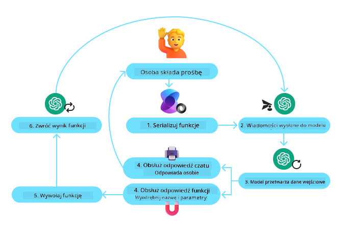
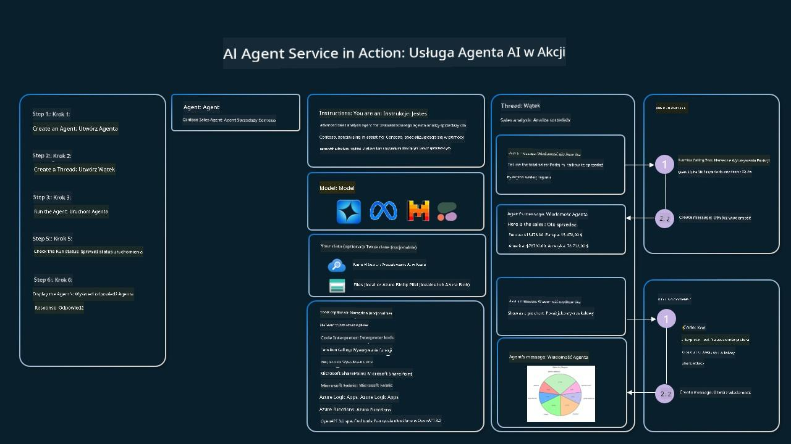

<!--
CO_OP_TRANSLATOR_METADATA:
{
  "original_hash": "e056335d729ba6e49571db7a6533825d",
  "translation_date": "2025-09-30T07:01:26+00:00",
  "source_file": "04-tool-use/README.md",
  "language_code": "pl"
}
-->
[](https://youtu.be/vieRiPRx-gI?si=cEZ8ApnT6Sus9rhn)

> _(Kliknij obrazek powyżej, aby obejrzeć wideo z tej lekcji)_

# Wzorzec projektowy użycia narzędzi

Narzędzia są interesujące, ponieważ pozwalają agentom AI na poszerzenie zakresu ich możliwości. Zamiast ograniczonego zestawu działań, które agent może wykonać, dodanie narzędzia umożliwia agentowi realizację szerokiego zakresu działań. W tym rozdziale przyjrzymy się wzorcowi projektowemu użycia narzędzi, który opisuje, jak agenci AI mogą korzystać z określonych narzędzi, aby osiągnąć swoje cele.

## Wprowadzenie

W tej lekcji chcemy odpowiedzieć na następujące pytania:

- Czym jest wzorzec projektowy użycia narzędzi?
- Jakie są przypadki użycia, do których można go zastosować?
- Jakie elementy/bloki konstrukcyjne są potrzebne do wdrożenia tego wzorca projektowego?
- Jakie są szczególne kwestie związane z użyciem wzorca projektowego użycia narzędzi w celu budowy wiarygodnych agentów AI?

## Cele nauki

Po ukończeniu tej lekcji będziesz w stanie:

- Zdefiniować wzorzec projektowy użycia narzędzi i jego cel.
- Zidentyfikować przypadki użycia, w których wzorzec projektowy użycia narzędzi jest odpowiedni.
- Zrozumieć kluczowe elementy potrzebne do wdrożenia tego wzorca projektowego.
- Rozpoznać kwestie związane z zapewnieniem wiarygodności agentów AI korzystających z tego wzorca projektowego.

## Czym jest wzorzec projektowy użycia narzędzi?

**Wzorzec projektowy użycia narzędzi** koncentruje się na umożliwieniu LLM (Large Language Models) interakcji z zewnętrznymi narzędziami w celu osiągnięcia określonych celów. Narzędzia to kod, który może być wykonywany przez agenta w celu realizacji działań. Narzędzie może być prostą funkcją, taką jak kalkulator, lub wywołaniem API do usługi zewnętrznej, np. wyszukiwania cen akcji czy prognozy pogody. W kontekście agentów AI narzędzia są zaprojektowane tak, aby były wykonywane przez agentów w odpowiedzi na **wywołania funkcji generowane przez model**.

## Jakie są przypadki użycia, do których można go zastosować?

Agenci AI mogą wykorzystywać narzędzia do realizacji złożonych zadań, pozyskiwania informacji lub podejmowania decyzji. Wzorzec projektowy użycia narzędzi jest często stosowany w scenariuszach wymagających dynamicznej interakcji z zewnętrznymi systemami, takimi jak bazy danych, usługi internetowe czy interpretery kodu. Ta zdolność jest przydatna w wielu różnych przypadkach użycia, w tym:

- **Dynamiczne pozyskiwanie informacji:** Agenci mogą zapytania do zewnętrznych API lub baz danych w celu uzyskania aktualnych danych (np. zapytania do bazy SQLite w celu analizy danych, pobieranie cen akcji lub informacji o pogodzie).
- **Wykonywanie i interpretacja kodu:** Agenci mogą wykonywać kod lub skrypty w celu rozwiązywania problemów matematycznych, generowania raportów lub przeprowadzania symulacji.
- **Automatyzacja procesów:** Automatyzowanie powtarzalnych lub wieloetapowych procesów poprzez integrację narzędzi takich jak harmonogramy zadań, usługi e-mail czy przepływy danych.
- **Obsługa klienta:** Agenci mogą interagować z systemami CRM, platformami zgłoszeń lub bazami wiedzy w celu rozwiązywania zapytań użytkowników.
- **Tworzenie i edycja treści:** Agenci mogą korzystać z narzędzi takich jak sprawdzanie gramatyki, podsumowywanie tekstu czy ocena bezpieczeństwa treści, aby wspierać zadania związane z tworzeniem treści.

## Jakie są elementy/bloki konstrukcyjne potrzebne do wdrożenia wzorca projektowego użycia narzędzi?

Te bloki konstrukcyjne pozwalają agentowi AI na realizację szerokiego zakresu zadań. Przyjrzyjmy się kluczowym elementom potrzebnym do wdrożenia wzorca projektowego użycia narzędzi:

- **Schematy funkcji/narzędzi:** Szczegółowe definicje dostępnych narzędzi, w tym nazwa funkcji, cel, wymagane parametry i oczekiwane wyniki. Te schematy umożliwiają LLM zrozumienie, jakie narzędzia są dostępne i jak skonstruować poprawne zapytania.
- **Logika wykonywania funkcji:** Określa, jak i kiedy narzędzia są wywoływane na podstawie intencji użytkownika i kontekstu rozmowy. Może to obejmować moduły planowania, mechanizmy routingu lub przepływy warunkowe, które dynamicznie określają użycie narzędzi.
- **System obsługi wiadomości:** Komponenty zarządzające przepływem rozmowy między wejściami użytkownika, odpowiedziami LLM, wywołaniami narzędzi i wynikami narzędzi.
- **Framework integracji narzędzi:** Infrastruktura łącząca agenta z różnymi narzędziami, niezależnie od tego, czy są to proste funkcje, czy złożone usługi zewnętrzne.
- **Obsługa błędów i walidacja:** Mechanizmy radzenia sobie z niepowodzeniami w wykonywaniu narzędzi, walidacja parametrów i zarządzanie nieoczekiwanymi odpowiedziami.
- **Zarządzanie stanem:** Śledzenie kontekstu rozmowy, wcześniejszych interakcji z narzędziami i danych trwałych w celu zapewnienia spójności w interakcjach wieloetapowych.

Następnie przyjrzymy się bardziej szczegółowo wywoływaniu funkcji/narzędzi.

### Wywoływanie funkcji/narzędzi

Wywoływanie funkcji jest głównym sposobem umożliwienia LLM interakcji z narzędziami. Często spotkasz się z użyciem terminów „Funkcja” i „Narzędzie” zamiennie, ponieważ „funkcje” (bloki kodu wielokrotnego użytku) są „narzędziami”, które agenci wykorzystują do realizacji zadań. Aby kod funkcji został wywołany, LLM musi porównać zapytanie użytkownika z opisem funkcji. W tym celu do LLM przesyłany jest schemat zawierający opisy wszystkich dostępnych funkcji. LLM wybiera najbardziej odpowiednią funkcję dla zadania i zwraca jej nazwę oraz argumenty. Wybrana funkcja jest wywoływana, jej odpowiedź przesyłana z powrotem do LLM, który wykorzystuje informacje do odpowiedzi na zapytanie użytkownika.

Aby deweloperzy mogli wdrożyć wywoływanie funkcji dla agentów, potrzebne są:

1. Model LLM obsługujący wywoływanie funkcji
2. Schemat zawierający opisy funkcji
3. Kod dla każdej opisanej funkcji

Przyjrzyjmy się przykładowi uzyskania aktualnego czasu w mieście:

1. **Inicjalizacja LLM obsługującego wywoływanie funkcji:**

    Nie wszystkie modele obsługują wywoływanie funkcji, więc ważne jest, aby sprawdzić, czy używany model LLM to robi. <a href="https://learn.microsoft.com/azure/ai-services/openai/how-to/function-calling" target="_blank">Azure OpenAI</a> obsługuje wywoływanie funkcji. Możemy zacząć od inicjalizacji klienta Azure OpenAI.

    ```python
    # Initialize the Azure OpenAI client
    client = AzureOpenAI(
        azure_endpoint = os.getenv("AZURE_OPENAI_ENDPOINT"), 
        api_key=os.getenv("AZURE_OPENAI_API_KEY"),  
        api_version="2024-05-01-preview"
    )
    ```

1. **Tworzenie schematu funkcji:**

    Następnie zdefiniujemy schemat JSON zawierający nazwę funkcji, opis jej działania oraz nazwy i opisy parametrów funkcji. Następnie przekażemy ten schemat do wcześniej utworzonego klienta, wraz z zapytaniem użytkownika o czas w San Francisco. Ważne jest, aby zauważyć, że zwracane jest **wywołanie narzędzia**, a **nie** ostateczna odpowiedź na pytanie. Jak wspomniano wcześniej, LLM zwraca nazwę funkcji wybranej dla zadania oraz argumenty, które zostaną do niej przekazane.

    ```python
    # Function description for the model to read
    tools = [
        {
            "type": "function",
            "function": {
                "name": "get_current_time",
                "description": "Get the current time in a given location",
                "parameters": {
                    "type": "object",
                    "properties": {
                        "location": {
                            "type": "string",
                            "description": "The city name, e.g. San Francisco",
                        },
                    },
                    "required": ["location"],
                },
            }
        }
    ]
    ```
   
    ```python
  
    # Initial user message
    messages = [{"role": "user", "content": "What's the current time in San Francisco"}] 
  
    # First API call: Ask the model to use the function
      response = client.chat.completions.create(
          model=deployment_name,
          messages=messages,
          tools=tools,
          tool_choice="auto",
      )
  
      # Process the model's response
      response_message = response.choices[0].message
      messages.append(response_message)
  
      print("Model's response:")  

      print(response_message)
  
    ```

    ```bash
    Model's response:
    ChatCompletionMessage(content=None, role='assistant', function_call=None, tool_calls=[ChatCompletionMessageToolCall(id='call_pOsKdUlqvdyttYB67MOj434b', function=Function(arguments='{"location":"San Francisco"}', name='get_current_time'), type='function')])
    ```
  
1. **Kod funkcji wymagany do realizacji zadania:**

    Teraz, gdy LLM wybrał funkcję, która musi zostać uruchomiona, kod realizujący zadanie musi zostać zaimplementowany i wykonany. Możemy zaimplementować kod uzyskujący aktualny czas w Pythonie. Musimy również napisać kod do wyodrębnienia nazwy i argumentów z response_message, aby uzyskać ostateczny wynik.

    ```python
      def get_current_time(location):
        """Get the current time for a given location"""
        print(f"get_current_time called with location: {location}")  
        location_lower = location.lower()
        
        for key, timezone in TIMEZONE_DATA.items():
            if key in location_lower:
                print(f"Timezone found for {key}")  
                current_time = datetime.now(ZoneInfo(timezone)).strftime("%I:%M %p")
                return json.dumps({
                    "location": location,
                    "current_time": current_time
                })
      
        print(f"No timezone data found for {location_lower}")  
        return json.dumps({"location": location, "current_time": "unknown"})
    ```

     ```python
     # Handle function calls
      if response_message.tool_calls:
          for tool_call in response_message.tool_calls:
              if tool_call.function.name == "get_current_time":
     
                  function_args = json.loads(tool_call.function.arguments)
     
                  time_response = get_current_time(
                      location=function_args.get("location")
                  )
     
                  messages.append({
                      "tool_call_id": tool_call.id,
                      "role": "tool",
                      "name": "get_current_time",
                      "content": time_response,
                  })
      else:
          print("No tool calls were made by the model.")  
  
      # Second API call: Get the final response from the model
      final_response = client.chat.completions.create(
          model=deployment_name,
          messages=messages,
      )
  
      return final_response.choices[0].message.content
     ```

     ```bash
      get_current_time called with location: San Francisco
      Timezone found for san francisco
      The current time in San Francisco is 09:24 AM.
     ```

Wywoływanie funkcji jest sercem większości, jeśli nie wszystkich projektów użycia narzędzi przez agentów, jednak wdrożenie go od podstaw może być czasami trudne. Jak nauczyliśmy się w [Lekcji 2](../../../02-explore-agentic-frameworks), frameworki agentowe dostarczają nam gotowych bloków konstrukcyjnych do wdrożenia użycia narzędzi.

## Przykłady użycia narzędzi z frameworkami agentowymi

Oto kilka przykładów, jak można wdrożyć wzorzec projektowy użycia narzędzi, korzystając z różnych frameworków agentowych:

### Semantic Kernel

<a href="https://learn.microsoft.com/azure/ai-services/agents/overview" target="_blank">Semantic Kernel</a> to otwarty framework AI dla deweloperów .NET, Python i Java pracujących z Large Language Models (LLMs). Upraszcza proces użycia wywoływania funkcji, automatycznie opisując funkcje i ich parametry dla modelu poprzez proces zwany <a href="https://learn.microsoft.com/semantic-kernel/concepts/ai-services/chat-completion/function-calling/?pivots=programming-language-python#1-serializing-the-functions" target="_blank">serializacją</a>. Obsługuje również komunikację między modelem a Twoim kodem. Kolejną zaletą korzystania z frameworku agentowego, takiego jak Semantic Kernel, jest możliwość dostępu do gotowych narzędzi, takich jak <a href="https://github.com/microsoft/semantic-kernel/blob/main/python/samples/getting_started_with_agents/openai_assistant/step4_assistant_tool_file_search.py" target="_blank">Wyszukiwanie plików</a> i <a href="https://github.com/microsoft/semantic-kernel/blob/main/python/samples/getting_started_with_agents/openai_assistant/step3_assistant_tool_code_interpreter.py" target="_blank">Interpreter kodu</a>.

Poniższy diagram ilustruje proces wywoływania funkcji z Semantic Kernel:



W Semantic Kernel funkcje/narzędzia nazywane są <a href="https://learn.microsoft.com/semantic-kernel/concepts/plugins/?pivots=programming-language-python" target="_blank">Pluginami</a>. Możemy przekształcić funkcję `get_current_time`, którą widzieliśmy wcześniej, w plugin, zamieniając ją na klasę z funkcją w środku. Możemy również zaimportować dekorator `kernel_function`, który przyjmuje opis funkcji. Gdy następnie utworzysz kernel z GetCurrentTimePlugin, kernel automatycznie zserializuje funkcję i jej parametry, tworząc schemat do przesłania do LLM w procesie.

```python
from semantic_kernel.functions import kernel_function

class GetCurrentTimePlugin:
    async def __init__(self, location):
        self.location = location

    @kernel_function(
        description="Get the current time for a given location"
    )
    def get_current_time(location: str = ""):
        ...

```

```python 
from semantic_kernel import Kernel

# Create the kernel
kernel = Kernel()

# Create the plugin
get_current_time_plugin = GetCurrentTimePlugin(location)

# Add the plugin to the kernel
kernel.add_plugin(get_current_time_plugin)
```
  
### Azure AI Agent Service

<a href="https://learn.microsoft.com/azure/ai-services/agents/overview" target="_blank">Azure AI Agent Service</a> to nowszy framework agentowy zaprojektowany, aby umożliwić deweloperom bezpieczne budowanie, wdrażanie i skalowanie wysokiej jakości, rozszerzalnych agentów AI bez konieczności zarządzania zasobami obliczeniowymi i magazynowymi. Jest szczególnie przydatny w aplikacjach korporacyjnych, ponieważ jest w pełni zarządzaną usługą z zabezpieczeniami klasy korporacyjnej.

W porównaniu do rozwijania bezpośrednio z API LLM, Azure AI Agent Service oferuje kilka zalet, w tym:

- Automatyczne wywoływanie narzędzi – brak potrzeby analizowania wywołania narzędzia, wywoływania narzędzia i obsługi odpowiedzi; wszystko to odbywa się teraz po stronie serwera
- Bezpiecznie zarządzane dane – zamiast zarządzać własnym stanem rozmowy, możesz polegać na wątkach, które przechowują wszystkie potrzebne informacje
- Gotowe narzędzia – Narzędzia, które możesz wykorzystać do interakcji z Twoimi źródłami danych, takie jak Bing, Azure AI Search i Azure Functions.

Narzędzia dostępne w Azure AI Agent Service można podzielić na dwie kategorie:

1. Narzędzia wiedzy:
    - <a href="https://learn.microsoft.com/azure/ai-services/agents/how-to/tools/bing-grounding?tabs=python&pivots=overview" target="_blank">Podstawy z Bing Search</a>
    - <a href="https://learn.microsoft.com/azure/ai-services/agents/how-to/tools/file-search?tabs=python&pivots=overview" target="_blank">Wyszukiwanie plików</a>
    - <a href="https://learn.microsoft.com/azure/ai-services/agents/how-to/tools/azure-ai-search?tabs=azurecli%2Cpython&pivots=overview-azure-ai-search" target="_blank">Azure AI Search</a>

2. Narzędzia akcji:
    - <a href="https://learn.microsoft.com/azure/ai-services/agents/how-to/tools/function-calling?tabs=python&pivots=overview" target="_blank">Wywoływanie funkcji</a>
    - <a href="https://learn.microsoft.com/azure/ai-services/agents/how-to/tools/code-interpreter?tabs=python&pivots=overview" target="_blank">Interpreter kodu</a>
    - <a href="https://learn.microsoft.com/azure/ai-services/agents/how-to/tools/openapi-spec?tabs=python&pivots=overview" target="_blank">Narzędzia zdefiniowane przez OpenAPI</a>
    - <a href="https://learn.microsoft.com/azure/ai-services/agents/how-to/tools/azure-functions?pivots=overview" target="_blank">Azure Functions</a>

Usługa Agent Service pozwala na użycie tych narzędzi razem jako `toolset`. Wykorzystuje również `threads`, które śledzą historię wiadomości z konkretnej rozmowy.

Wyobraź sobie, że jesteś agentem sprzedaży w firmie Contoso. Chcesz stworzyć agenta konwersacyjnego, który będzie odpowiadał na pytania dotyczące Twoich danych sprzedażowych.

Poniższy obrazek ilustruje, jak można wykorzystać Azure AI Agent Service do analizy danych sprzedażowych:



Aby użyć któregokolwiek z tych narzędzi z usługą, możemy utworzyć klienta i zdefiniować narzędzie lub zestaw narzędzi. Aby wdrożyć to praktycznie, możemy użyć poniższego kodu w Pythonie. LLM będzie w stanie spojrzeć na zestaw narzędzi i zdecydować, czy użyć funkcji stworzonej przez użytkownika, `fetch_sales_data_using_sqlite_query`, czy wbudowanego interpretera kodu, w zależności od zapytania użytkownika.

```python 
import os
from azure.ai.projects import AIProjectClient
from azure.identity import DefaultAzureCredential
from fetch_sales_data_functions import fetch_sales_data_using_sqlite_query # fetch_sales_data_using_sqlite_query function which can be found in a fetch_sales_data_functions.py file.
from azure.ai.projects.models import ToolSet, FunctionTool, CodeInterpreterTool

project_client = AIProjectClient.from_connection_string(
    credential=DefaultAzureCredential(),
    conn_str=os.environ["PROJECT_CONNECTION_STRING"],
)

# Initialize function calling agent with the fetch_sales_data_using_sqlite_query function and adding it to the toolset
fetch_data_function = FunctionTool(fetch_sales_data_using_sqlite_query)
toolset = ToolSet()
toolset.add(fetch_data_function)

# Initialize Code Interpreter tool and adding it to the toolset. 
code_interpreter = code_interpreter = CodeInterpreterTool()
toolset = ToolSet()
toolset.add(code_interpreter)

agent = project_client.agents.create_agent(
    model="gpt-4o-mini", name="my-agent", instructions="You are helpful agent", 
    toolset=toolset
)
```

## Jakie są szczególne kwestie związane z użyciem wzorca projektowego użycia narzędzi w celu budowy wiarygodnych agentów AI?

Częstym problemem związanym z SQL generowanym dynamicznie przez LLM jest bezpieczeństwo, szczególnie ryzyko wstrzyknięcia SQL lub złośliwych działań, takich jak usuwanie lub manipulowanie bazą danych. Chociaż te obawy są uzasadnione, można je skutecznie złagodzić poprzez odpowiednią konfigurację uprawnień dostępu do bazy danych. W przypadku większości baz danych obejmuje to skonfigurowanie bazy danych jako tylko do odczytu. W przypadku usług baz danych, takich jak PostgreSQL czy Azure SQL, aplikacji należy przypisać rolę tylko do odczytu (SELECT).
Uruchamianie aplikacji w bezpiecznym środowisku dodatkowo zwiększa ochronę. W scenariuszach korporacyjnych dane są zazwyczaj pobierane i przekształcane z systemów operacyjnych do bazy danych tylko do odczytu lub hurtowni danych z przyjaznym dla użytkownika schematem. Takie podejście zapewnia, że dane są bezpieczne, zoptymalizowane pod kątem wydajności i dostępności, a aplikacja ma ograniczony dostęp tylko do odczytu.

### Masz więcej pytań dotyczących wzorców projektowych narzędzi?

Dołącz do [Azure AI Foundry Discord](https://aka.ms/ai-agents/discord), aby spotkać się z innymi uczącymi się, uczestniczyć w godzinach konsultacji i uzyskać odpowiedzi na pytania dotyczące AI Agents.

## Dodatkowe zasoby

- <a href="https://microsoft.github.io/build-your-first-agent-with-azure-ai-agent-service-workshop/" target="_blank">Warsztat Azure AI Agents Service</a>
- <a href="https://github.com/Azure-Samples/contoso-creative-writer/tree/main/docs/workshop" target="_blank">Warsztat Contoso Creative Writer Multi-Agent</a>
- <a href="https://learn.microsoft.com/semantic-kernel/concepts/ai-services/chat-completion/function-calling/?pivots=programming-language-python#1-serializing-the-functions" target="_blank">Samouczek wywoływania funkcji Semantic Kernel</a>
- <a href="https://github.com/microsoft/semantic-kernel/blob/main/python/samples/getting_started_with_agents/openai_assistant/step3_assistant_tool_code_interpreter.py" target="_blank">Interpreter kodu Semantic Kernel</a>
- <a href="https://microsoft.github.io/autogen/dev/user-guide/core-user-guide/components/tools.html" target="_blank">Narzędzia Autogen</a>

## Poprzednia lekcja

[Zrozumienie wzorców projektowych agentów](../03-agentic-design-patterns/README.md)

## Następna lekcja

[Agentic RAG](../05-agentic-rag/README.md)

---

**Zastrzeżenie**:  
Ten dokument został przetłumaczony za pomocą usługi tłumaczenia AI [Co-op Translator](https://github.com/Azure/co-op-translator). Chociaż dokładamy wszelkich starań, aby tłumaczenie było precyzyjne, prosimy pamiętać, że automatyczne tłumaczenia mogą zawierać błędy lub nieścisłości. Oryginalny dokument w jego języku źródłowym powinien być uznawany za autorytatywne źródło. W przypadku informacji krytycznych zaleca się skorzystanie z profesjonalnego tłumaczenia przez człowieka. Nie ponosimy odpowiedzialności za jakiekolwiek nieporozumienia lub błędne interpretacje wynikające z użycia tego tłumaczenia.