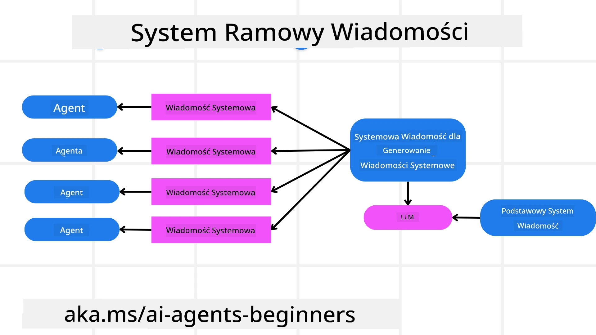
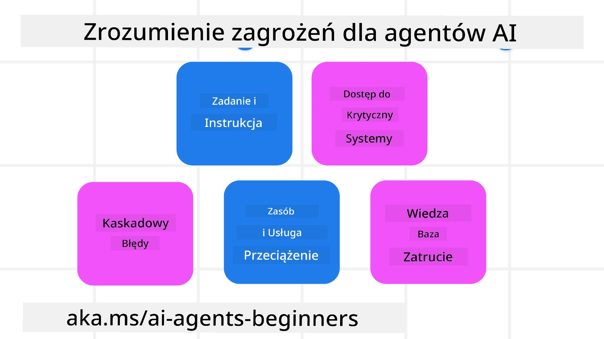
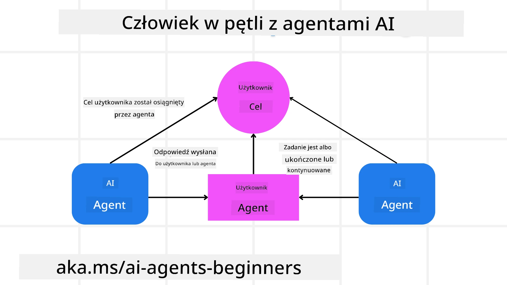

[](https://youtu.be/iZKkMEGBCUQ?si=Q-kEbcyHUMPoHp8L)

> _(Kliknij powyższy obraz, aby obejrzeć wideo z tej lekcji)_

# Budowanie godnych zaufania agentów AI

## Wprowadzenie

W tej lekcji omówimy:

- Jak budować i wdrażać bezpiecznych i skutecznych agentów AI
- Ważne aspekty bezpieczeństwa podczas tworzenia agentów AI.
- Jak zachować prywatność danych i użytkowników podczas tworzenia agentów AI.

## Cele nauczania

Po ukończeniu tej lekcji będziesz potrafić:

- Identyfikować i łagodzić ryzyka podczas tworzenia agentów AI.
- Wdrażać środki bezpieczeństwa, aby zapewnić właściwe zarządzanie danymi i dostępem.
- Tworzyć agentów AI, którzy zachowują prywatność danych i zapewniają wysoką jakość doświadczenia użytkownika.

## Bezpieczeństwo

Najpierw przyjrzyjmy się tworzeniu bezpiecznych aplikacji opartych na agentach. Bezpieczeństwo oznacza, że agent AI działa zgodnie z zamierzeniami. Jako twórcy aplikacji opartych na agentach mamy metody i narzędzia, aby zmaksymalizować bezpieczeństwo:

### Tworzenie ram wiadomości systemowych

Jeśli kiedykolwiek tworzyłeś aplikację AI wykorzystującą duże modele językowe (LLM), znasz znaczenie zaprojektowania solidnego polecenia systemowego lub wiadomości systemowej. Te polecenia ustanawiają meta zasady, instrukcje i wytyczne dotyczące tego, jak LLM będzie wchodzić w interakcję z użytkownikiem i danymi.

Dla agentów AI polecenie systemowe jest jeszcze ważniejsze, ponieważ agenci AI będą potrzebowali bardzo szczegółowych instrukcji, aby wykonać zaprojektowane dla nich zadania.

Aby tworzyć skalowalne polecenia systemowe, możemy użyć ram wiadomości systemowych do tworzenia jednego lub więcej agentów w naszej aplikacji:



#### Krok 1: Utwórz meta wiadomość systemową 

Meta prompt będzie używany przez LLM do generowania poleceń systemowych dla agentów, których tworzymy. Projektujemy go jako szablon, aby w efektywny sposób móc tworzyć wielu agentów w razie potrzeby.

Oto przykład meta wiadomości systemowej, którą przekazalibyśmy LLM:

```plaintext
You are an expert at creating AI agent assistants. 
You will be provided a company name, role, responsibilities and other
information that you will use to provide a system prompt for.
To create the system prompt, be descriptive as possible and provide a structure that a system using an LLM can better understand the role and responsibilities of the AI assistant. 
```

#### Krok 2: Utwórz podstawowy prompt

Następnym krokiem jest stworzenie podstawowego promptu opisującego agenta AI. Powinieneś uwzględnić rolę agenta, zadania, które agent będzie wykonywać, oraz wszelkie inne obowiązki agenta.

Oto przykład:

```plaintext
You are a travel agent for Contoso Travel that is great at booking flights for customers. To help customers you can perform the following tasks: lookup available flights, book flights, ask for preferences in seating and times for flights, cancel any previously booked flights and alert customers on any delays or cancellations of flights.  
```

#### Krok 3: Przekaż podstawową wiadomość systemową do LLM

Teraz możemy zoptymalizować tę wiadomość systemową, dostarczając meta wiadomość systemową jako wiadomość systemową oraz naszą podstawową wiadomość systemową.

To wygeneruje wiadomość systemową lepiej zaprojektowaną do kierowania naszymi agentami AI:

```markdown
**Company Name:** Contoso Travel  
**Role:** Travel Agent Assistant

**Objective:**  
You are an AI-powered travel agent assistant for Contoso Travel, specializing in booking flights and providing exceptional customer service. Your main goal is to assist customers in finding, booking, and managing their flights, all while ensuring that their preferences and needs are met efficiently.

**Key Responsibilities:**

1. **Flight Lookup:**
    
    - Assist customers in searching for available flights based on their specified destination, dates, and any other relevant preferences.
    - Provide a list of options, including flight times, airlines, layovers, and pricing.
2. **Flight Booking:**
    
    - Facilitate the booking of flights for customers, ensuring that all details are correctly entered into the system.
    - Confirm bookings and provide customers with their itinerary, including confirmation numbers and any other pertinent information.
3. **Customer Preference Inquiry:**
    
    - Actively ask customers for their preferences regarding seating (e.g., aisle, window, extra legroom) and preferred times for flights (e.g., morning, afternoon, evening).
    - Record these preferences for future reference and tailor suggestions accordingly.
4. **Flight Cancellation:**
    
    - Assist customers in canceling previously booked flights if needed, following company policies and procedures.
    - Notify customers of any necessary refunds or additional steps that may be required for cancellations.
5. **Flight Monitoring:**
    
    - Monitor the status of booked flights and alert customers in real-time about any delays, cancellations, or changes to their flight schedule.
    - Provide updates through preferred communication channels (e.g., email, SMS) as needed.

**Tone and Style:**

- Maintain a friendly, professional, and approachable demeanor in all interactions with customers.
- Ensure that all communication is clear, informative, and tailored to the customer's specific needs and inquiries.

**User Interaction Instructions:**

- Respond to customer queries promptly and accurately.
- Use a conversational style while ensuring professionalism.
- Prioritize customer satisfaction by being attentive, empathetic, and proactive in all assistance provided.

**Additional Notes:**

- Stay updated on any changes to airline policies, travel restrictions, and other relevant information that could impact flight bookings and customer experience.
- Use clear and concise language to explain options and processes, avoiding jargon where possible for better customer understanding.

This AI assistant is designed to streamline the flight booking process for customers of Contoso Travel, ensuring that all their travel needs are met efficiently and effectively.

```

#### Krok 4: Iteruj i ulepszaj

Wartość tego frameworku wiadomości systemowych polega na możliwości skalowania tworzenia wiadomości systemowych dla wielu agentów, a także na ulepszaniu wiadomości systemowych z upływem czasu. Rzadko zdarza się, aby wiadomość systemowa działała idealnie za pierwszym razem dla całego przypadku użycia. Możliwość wprowadzania drobnych poprawek i ulepszeń poprzez zmianę podstawowej wiadomości systemowej i uruchamianie jej przez system pozwoli porównywać i oceniać wyniki.

## Zrozumienie zagrożeń

Aby budować godnych zaufania agentów AI, ważne jest zrozumienie i łagodzenie ryzyk i zagrożeń związanych z Twoim agentem AI. Przyjrzyjmy się niektórym rodzajom zagrożeń dla agentów AI i temu, jak lepiej je planować i przygotowywać się na nie.



### Zadanie i instrukcja

**Description:** Atakujący próbują zmienić instrukcje lub cele agenta AI poprzez promptowanie lub manipulowanie wejściami.

**Mitigation**: Wykonuj kontrole walidacyjne i filtry wejściowe, aby wykrywać potencjalnie niebezpieczne polecenia zanim zostaną przetworzone przez agenta AI. Ponieważ te ataki zazwyczaj wymagają częstej interakcji z agentem, ograniczenie liczby tur w rozmowie jest kolejnym sposobem zapobiegania tego typu atakom.

### Dostęp do systemów krytycznych

**Description**: Jeśli agent AI ma dostęp do systemów i usług przechowujących wrażliwe dane, atakujący mogą przejąć komunikację między agentem a tymi usługami. Mogą to być bezpośrednie ataki lub pośrednie próby uzyskania informacji o tych systemach poprzez agenta.

**Mitigation**: Agenci AI powinni mieć dostęp do systemów jedynie w razie potrzeby, aby zapobiec tego typu atakom. Komunikacja między agentem a systemem powinna być również zabezpieczona. Wdrożenie mechanizmów uwierzytelniania i kontroli dostępu to kolejny sposób ochrony tych informacji.

### Przeciążanie zasobów i usług

**Description:** Agenci AI mogą korzystać z różnych narzędzi i usług do wykonywania zadań. Atakujący mogą wykorzystać tę zdolność do ataku na te usługi, wysyłając dużą liczbę żądań przez agenta AI, co może prowadzić do awarii systemu lub wysokich kosztów.

**Mitigation:** Wdrażaj polityki ograniczające liczbę żądań, jakie agent AI może wysłać do usługi. Ograniczenie liczby tur konwersacji i żądań do Twojego agenta AI to kolejny sposób zapobiegania tego typu atakom.

### Zanieczyszczenie bazy wiedzy

**Description:** Ten typ ataku nie celuje bezpośrednio w agenta AI, lecz w bazę wiedzy i inne usługi, z których agent AI będzie korzystać. Może to obejmować uszkadzanie danych lub informacji, których agent AI użyje do wykonania zadania, prowadząc do tendencyjnych lub niezamierzonych odpowiedzi dla użytkownika.

**Mitigation:** Regularnie weryfikuj dane, z których agent AI będzie korzystał w swoich przepływach pracy. Upewnij się, że dostęp do tych danych jest zabezpieczony i może być zmieniany tylko przez zaufane osoby, aby uniknąć tego typu ataku.

### Błędy kaskadowe

**Description:** Agenci AI uzyskują dostęp do różnych narzędzi i usług, aby wykonywać zadania. Błędy spowodowane przez atakujących mogą prowadzić do awarii innych systemów, z którymi połączony jest agent AI, powodując, że atak staje się bardziej rozległy i trudniejszy do zdiagnozowania.

**Mitigation**: Jedną z metod uniknięcia tego jest uruchamianie agenta AI w ograniczonym środowisku, na przykład wykonywanie zadań w kontenerze Dockera, aby zapobiec bezpośrednim atakom na system. Tworzenie mechanizmów zapasowych i logiki ponawiania prób, gdy niektóre systemy zwracają błąd, to kolejny sposób zapobiegania większym awariom systemu.

## Człowiek w pętli

Kolejnym skutecznym sposobem budowania godnych zaufania systemów agentowych jest wykorzystanie podejścia człowiek-w-pętli. Tworzy to przepływ, w którym użytkownicy mogą przekazywać informację zwrotną agentom podczas działania. Użytkownicy w zasadzie działają jak agenci w systemie wieloagentowym, zatwierdzając lub przerywając działający proces.



Oto fragment kodu używający Microsoft Agent Framework pokazujący, jak ten koncept jest implementowany:

```python
import os
from agent_framework.azure import AzureAIProjectAgentProvider
from azure.identity import AzureCliCredential

# Utwórz dostawcę z zatwierdzaniem przez człowieka
provider = AzureAIProjectAgentProvider(
    credential=AzureCliCredential(),
)

# Utwórz agenta z krokiem zatwierdzenia przez człowieka
response = provider.create_response(
    input="Write a 4-line poem about the ocean.",
    instructions="You are a helpful assistant. Ask for user approval before finalizing.",
)

# Użytkownik może przejrzeć i zatwierdzić odpowiedź
print(response.output_text)
user_input = input("Do you approve? (APPROVE/REJECT): ")
if user_input == "APPROVE":
    print("Response approved.")
else:
    print("Response rejected. Revising...")
```

## Podsumowanie

Budowanie godnych zaufania agentów AI wymaga starannego projektowania, solidnych środków bezpieczeństwa i ciągłej iteracji. Wdrażając strukturyzowane systemy meta-promptów, rozumiejąc potencjalne zagrożenia i stosując strategie łagodzenia, deweloperzy mogą tworzyć agentów AI, które są zarówno bezpieczne, jak i skuteczne. Dodatkowo, włączenie podejścia człowiek-w-pętli zapewnia, że agenci AI pozostają zgodni z potrzebami użytkowników przy jednoczesnym minimalizowaniu ryzyka. W miarę jak AI będzie się rozwijać, utrzymanie proaktywnego podejścia do bezpieczeństwa, prywatności i kwestii etycznych będzie kluczowe dla budowania zaufania i wiarygodności w systemach opartych na AI.

### Masz więcej pytań dotyczących tworzenia godnych zaufania agentów AI?

Dołącz do [Microsoft Foundry Discord](https://aka.ms/ai-agents/discord), aby spotkać się z innymi uczącymi się, uczestniczyć w konsultacjach i uzyskać odpowiedzi na pytania dotyczące agentów AI.

## Dodatkowe zasoby

- <a href="https://learn.microsoft.com/azure/ai-studio/responsible-use-of-ai-overview" target="_blank">Przegląd odpowiedzialnej sztucznej inteligencji</a>
- <a href="https://learn.microsoft.com/azure/ai-studio/concepts/evaluation-approach-gen-ai" target="_blank">Ocena modeli generatywnych AI i aplikacji AI</a>
- <a href="https://learn.microsoft.com/azure/ai-services/openai/concepts/system-message?context=%2Fazure%2Fai-studio%2Fcontext%2Fcontext&tabs=top-techniques" target="_blank">Wiadomości systemowe dotyczące bezpieczeństwa</a>
- <a href="https://blogs.microsoft.com/wp-content/uploads/prod/sites/5/2022/06/Microsoft-RAI-Impact-Assessment-Template.pdf?culture=en-us&country=us" target="_blank">Szablon oceny ryzyka</a>

## Poprzednia lekcja

[Agentic RAG](../05-agentic-rag/README.md)

## Następna lekcja

[Planning Design Pattern](../07-planning-design/README.md)

---

<!-- CO-OP TRANSLATOR DISCLAIMER START -->
Zastrzeżenie:
Niniejszy dokument został przetłumaczony przy użyciu usługi tłumaczeń opartych na sztucznej inteligencji Co-op Translator (https://github.com/Azure/co-op-translator). Mimo że dokładamy starań o poprawność, prosimy pamiętać, że tłumaczenia automatyczne mogą zawierać błędy lub nieścisłości. Oryginalny dokument w języku źródłowym należy uznać za dokument wiążący. W przypadku informacji krytycznych zalecane jest skorzystanie z usług profesjonalnego tłumacza. Nie ponosimy odpowiedzialności za jakiekolwiek nieporozumienia lub błędne interpretacje wynikające z użycia tego tłumaczenia.
<!-- CO-OP TRANSLATOR DISCLAIMER END -->