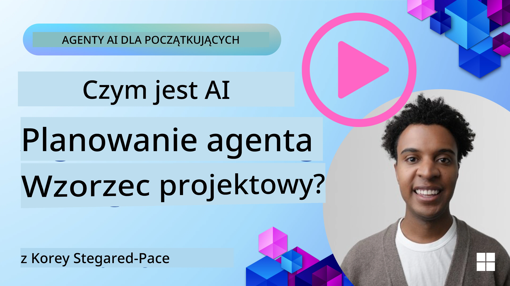
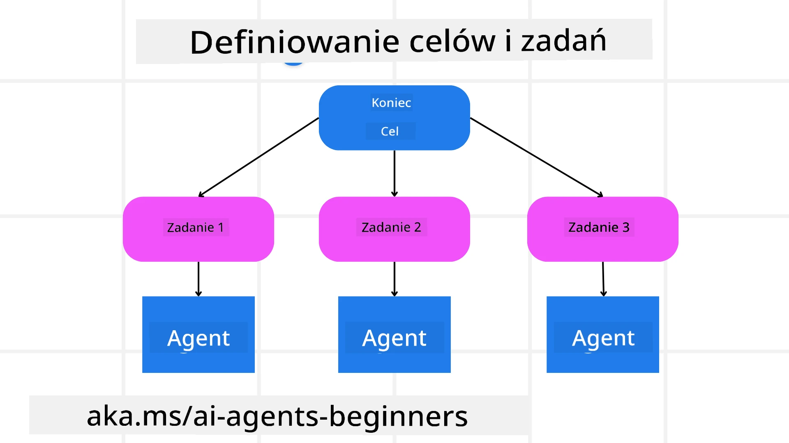

[](https://youtu.be/kPfJ2BrBCMY?si=9pYpPXp0sSbK91Dr)

> _(Kliknij obraz powyżej, aby obejrzeć wideo tej lekcji)_

# Projekt planowania

## Wprowadzenie

This lesson will cover

* Zdefiniowanie jasnego celu ogólnego i rozbicie złożonego zadania na wykonalne podzadania.
* Wykorzystanie ustrukturyzowanego wyjścia, aby uzyskać bardziej niezawodne i maszynowo czytelne odpowiedzi.
* Zastosowanie podejścia sterowanego zdarzeniami do obsługi dynamicznych zadań i nieoczekiwanych danych wejściowych.

## Cele nauki

Po ukończeniu tej lekcji będziesz rozumieć:

* Identyfikować i ustawiać ogólny cel dla agenta AI, zapewniając, że jasno wie, co trzeba osiągnąć.
* Rozkładać złożone zadanie na wykonalne podzadania i organizować je w logiczną kolejność.
* Wyposażyć agentów w odpowiednie narzędzia (np. narzędzia wyszukiwania lub analizy danych), zdecydować, kiedy i jak są używane, oraz radzić sobie z nieoczekiwanymi sytuacjami.
* Ocenić wyniki podzadań, mierzyć wydajność i iterować działania w celu poprawy końcowego rezultatu.

## Definiowanie ogólnego celu i rozbijanie zadania



Większość zadań w rzeczywistym świecie jest zbyt skomplikowana, aby rozwiązać je w jednym kroku. Agent AI potrzebuje zwięzłego celu, aby ukierunkować swoje planowanie i działania. Na przykład rozważ cel:

    "Wygeneruj 3-dniowy plan podróży."

Chociaż łatwo to sformułować, wymaga to dopracowania. Im jaśniejszy cel, tym lepiej agent (i ewentualni współpracujący ludzie) może skupić się na osiągnięciu właściwego rezultatu, na przykład stworzeniu kompleksowego planu podróży z opcjami lotów, rekomendacjami hoteli i propozycjami aktywności.

### Dekompozycja zadania

Large or intricate tasks become more manageable when split into smaller, goal-oriented subtasks.
For the travel itinerary example, you could decompose the goal into:

* Rezerwacja lotu
* Rezerwacja hotelu
* Wypożyczenie samochodu
* Personalizacja

Each subtask can then be tackled by dedicated agents or processes. One agent might specialize in searching for the best flight deals, another focuses on hotel bookings, and so on. A coordinating or “downstream” agent can then compile these results into one cohesive itinerary to the end user.

This modular approach also allows for incremental enhancements. For instance, you could add specialized agents for Food Recommendations or Local Activity Suggestions and refine the itinerary over time.

### Ustrukturyzowane wyjście

Large Language Models (LLMs) can generate structured output (e.g. JSON) that is easier for downstream agents or services to parse and process. This is especially useful in a multi-agent context, where we can action these tasks after the planning output is received.

The following Python snippet demonstrates a simple planning agent decomposing a goal into subtasks and generating a structured plan:

```python
from pydantic import BaseModel
from enum import Enum
from typing import List, Optional, Union
import json
import os
from typing import Optional
from pprint import pprint
from agent_framework.azure import AzureAIProjectAgentProvider
from azure.identity import AzureCliCredential

class AgentEnum(str, Enum):
    FlightBooking = "flight_booking"
    HotelBooking = "hotel_booking"
    CarRental = "car_rental"
    ActivitiesBooking = "activities_booking"
    DestinationInfo = "destination_info"
    DefaultAgent = "default_agent"
    GroupChatManager = "group_chat_manager"

# Model podzadania podróży
class TravelSubTask(BaseModel):
    task_details: str
    assigned_agent: AgentEnum  # chcemy przypisać zadanie agentowi

class TravelPlan(BaseModel):
    main_task: str
    subtasks: List[TravelSubTask]
    is_greeting: bool

provider = AzureAIProjectAgentProvider(credential=AzureCliCredential())

# Zdefiniuj wiadomość użytkownika
system_prompt = """You are a planner agent.
    Your job is to decide which agents to run based on the user's request.
    Provide your response in JSON format with the following structure:
{'main_task': 'Plan a family trip from Singapore to Melbourne.',
 'subtasks': [{'assigned_agent': 'flight_booking',
               'task_details': 'Book round-trip flights from Singapore to '
                               'Melbourne.'}
    Below are the available agents specialised in different tasks:
    - FlightBooking: For booking flights and providing flight information
    - HotelBooking: For booking hotels and providing hotel information
    - CarRental: For booking cars and providing car rental information
    - ActivitiesBooking: For booking activities and providing activity information
    - DestinationInfo: For providing information about destinations
    - DefaultAgent: For handling general requests"""

user_message = "Create a travel plan for a family of 2 kids from Singapore to Melbourne"

response = client.create_response(input=user_message, instructions=system_prompt)

response_content = response.output_text
pprint(json.loads(response_content))
```

### Planning Agent with Multi-Agent Orchestration

In this example, a Semantic Router Agent receives a user request (e.g., "Potrzebuję planu hotelowego na moją podróż.").

Następnie planista:

* Otrzymuje plan hotelowy: planista przyjmuje wiadomość użytkownika i, w oparciu o prompt systemowy (w tym informacje o dostępnych agentach), generuje ustrukturyzowany plan podróży.
* Wymienia agentów i ich narzędzia: rejestr agentów zawiera listę agentów (np. do lotów, hoteli, wynajmu samochodów i aktywności) wraz z funkcjami lub narzędziami, które oferują.
* Kieruje plan do odpowiednich agentów: w zależności od liczby podzadań planista albo wysyła wiadomość bezpośrednio do dedykowanego agenta (w scenariuszach jednozadaniowych), albo koordynuje to za pomocą menedżera czatu grupowego w przypadku współpracy wieloagentowej.
* Podsumowuje wynik: na końcu planista podsumowuje wygenerowany plan dla jasności.
The following Python code sample illustrates these steps:

```python

from pydantic import BaseModel

from enum import Enum
from typing import List, Optional, Union

class AgentEnum(str, Enum):
    FlightBooking = "flight_booking"
    HotelBooking = "hotel_booking"
    CarRental = "car_rental"
    ActivitiesBooking = "activities_booking"
    DestinationInfo = "destination_info"
    DefaultAgent = "default_agent"
    GroupChatManager = "group_chat_manager"

# Model podzadania podróży

class TravelSubTask(BaseModel):
    task_details: str
    assigned_agent: AgentEnum # chcemy przypisać zadanie agentowi

class TravelPlan(BaseModel):
    main_task: str
    subtasks: List[TravelSubTask]
    is_greeting: bool
import json
import os
from typing import Optional

from agent_framework.azure import AzureAIProjectAgentProvider
from azure.identity import AzureCliCredential

# Utwórz klienta

provider = AzureAIProjectAgentProvider(credential=AzureCliCredential())

from pprint import pprint

# Zdefiniuj wiadomość użytkownika

system_prompt = """You are a planner agent.
    Your job is to decide which agents to run based on the user's request.
    Below are the available agents specialized in different tasks:
    - FlightBooking: For booking flights and providing flight information
    - HotelBooking: For booking hotels and providing hotel information
    - CarRental: For booking cars and providing car rental information
    - ActivitiesBooking: For booking activities and providing activity information
    - DestinationInfo: For providing information about destinations
    - DefaultAgent: For handling general requests"""

user_message = "Create a travel plan for a family of 2 kids from Singapore to Melbourne"

response = client.create_response(input=user_message, instructions=system_prompt)

response_content = response.output_text

# Wydrukuj zawartość odpowiedzi po wczytaniu jej jako JSON

pprint(json.loads(response_content))
```

What follows is the output from the previous code and you can then use this structured output to route to `assigned_agent` and summarize the travel plan to the end user.

```json
{
    "is_greeting": "False",
    "main_task": "Plan a family trip from Singapore to Melbourne.",
    "subtasks": [
        {
            "assigned_agent": "flight_booking",
            "task_details": "Book round-trip flights from Singapore to Melbourne."
        },
        {
            "assigned_agent": "hotel_booking",
            "task_details": "Find family-friendly hotels in Melbourne."
        },
        {
            "assigned_agent": "car_rental",
            "task_details": "Arrange a car rental suitable for a family of four in Melbourne."
        },
        {
            "assigned_agent": "activities_booking",
            "task_details": "List family-friendly activities in Melbourne."
        },
        {
            "assigned_agent": "destination_info",
            "task_details": "Provide information about Melbourne as a travel destination."
        }
    ]
}
```

An example notebook with the previous code sample is available [tutaj](07-python-agent-framework.ipynb).

### Planowanie iteracyjne

Some tasks require a back-and-forth or re-planning, where the outcome of one subtask influences the next. For example, if the agent discovers an unexpected data format while booking flights, it might need to adapt its strategy before moving on to hotel bookings.

Additionally, user feedback (e.g. a human deciding they prefer an earlier flight) can trigger a partial re-plan. This dynamic, iterative approach ensures that the final solution aligns with real-world constraints and evolving user preferences.

np. przykładowy kod

```python
from agent_framework.azure import AzureAIProjectAgentProvider
from azure.identity import AzureCliCredential
#.. tak jak w poprzednim kodzie i przekaż historię użytkownika, aktualny plan

system_prompt = """You are a planner agent to optimize the
    Your job is to decide which agents to run based on the user's request.
    Below are the available agents specialized in different tasks:
    - FlightBooking: For booking flights and providing flight information
    - HotelBooking: For booking hotels and providing hotel information
    - CarRental: For booking cars and providing car rental information
    - ActivitiesBooking: For booking activities and providing activity information
    - DestinationInfo: For providing information about destinations
    - DefaultAgent: For handling general requests"""

user_message = "Create a travel plan for a family of 2 kids from Singapore to Melbourne"

response = client.create_response(
    input=user_message,
    instructions=system_prompt,
    context=f"Previous travel plan - {TravelPlan}",
)
# .. ponownie zaplanuj i wyślij zadania do odpowiednich agentów
```

Aby uzyskać bardziej kompleksowe planowanie, zapoznaj się z Magnetic One <a href="https://www.microsoft.com/research/articles/magentic-one-a-generalist-multi-agent-system-for-solving-complex-tasks" target="_blank">wpisem na blogu</a> dotyczącym rozwiązywania złożonych zadań.

## Podsumowanie

W tym artykule przyjrzeliśmy się przykładzie tworzenia planisty, który może dynamicznie wybierać dostępnych, zdefiniowanych agentów. Wyjście planisty dekomponuje zadania i przypisuje agentów, aby mogły być wykonane. Zakłada się, że agenci mają dostęp do funkcji/narzędzi niezbędnych do wykonania zadania. Oprócz agentów można uwzględnić inne wzorce, takie jak refleksja, summarizer, i round robin chat, aby jeszcze bardziej dostosować rozwiązanie.

## Dodatkowe zasoby

Magentic One — uniwersalny system wieloagentowy do rozwiązywania złożonych zadań, który osiągnął imponujące wyniki w kilku wymagających benchmarkach agentowych. Źródło: <a href="https://www.microsoft.com/research/articles/magentic-one-a-generalist-multi-agent-system-for-solving-complex-tasks" target="_blank">Magentic One</a>. W tej implementacji orkiestrator tworzy plany specyficzne dla zadania i deleguje te zadania dostępnym agentom. Oprócz planowania orkiestrator stosuje także mechanizm śledzenia do monitorowania postępów zadania i ponownego planowania w razie potrzeby.

### Masz więcej pytań dotyczących wzorca planowania?

Dołącz do [Microsoft Foundry Discord](https://aka.ms/ai-agents/discord), aby spotkać się z innymi uczącymi się, uczestniczyć w godzinach konsultacji i uzyskać odpowiedzi na pytania dotyczące agentów AI.

## Poprzednia lekcja

[Budowanie godnych zaufania agentów AI](../06-building-trustworthy-agents/README.md)

## Następna lekcja

[Wzorzec wieloagentowy](../08-multi-agent/README.md)

---

<!-- CO-OP TRANSLATOR DISCLAIMER START -->
Zastrzeżenie:
Niniejszy dokument został przetłumaczony przy użyciu usługi tłumaczeniowej AI Co-op Translator (https://github.com/Azure/co-op-translator). Chociaż dążymy do dokładności, prosimy pamiętać, że tłumaczenia automatyczne mogą zawierać błędy lub nieścisłości. Oryginalny dokument w jego języku źródłowym należy uznać za wersję autorytatywną. W przypadku istotnych informacji zalecane jest skorzystanie z profesjonalnego tłumaczenia wykonanego przez człowieka. Nie ponosimy odpowiedzialności za jakiekolwiek nieporozumienia lub błędne interpretacje wynikające z korzystania z tego tłumaczenia.
<!-- CO-OP TRANSLATOR DISCLAIMER END -->