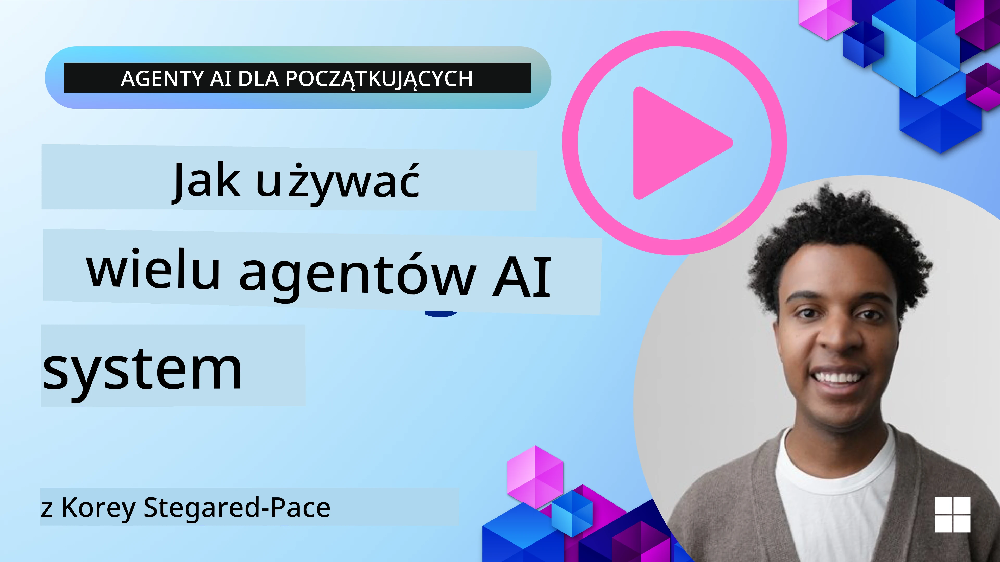
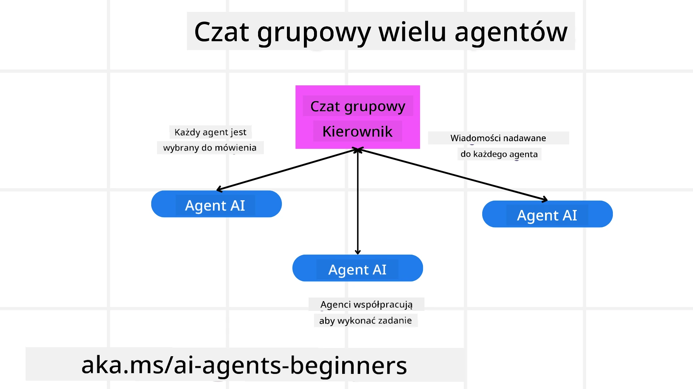
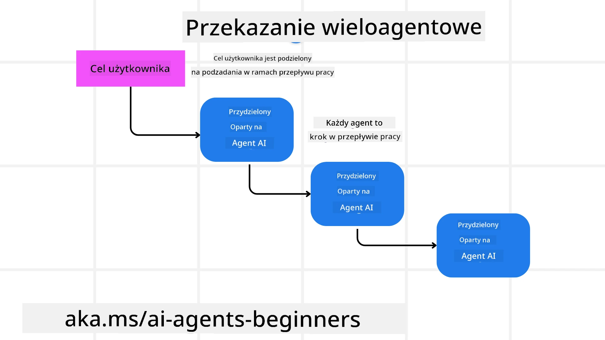
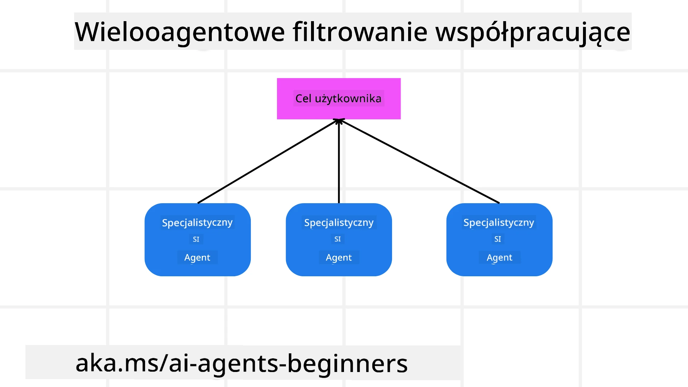

> _(Kliknij obraz powyżej, aby obejrzeć wideo tej lekcji)_

# Wzorce projektowe wieloagentowe

Jak tylko zaczniesz pracować nad projektem, który obejmuje wiele agentów, będziesz musiał rozważyć wzorzec projektowy wieloagentowy. Jednak może nie być od razu jasne, kiedy przejść do wieloagentów i jakie są korzyści.

## Wprowadzenie

W tej lekcji chcemy odpowiedzieć na następujące pytania:

- W jakich scenariuszach wieloagenci mają zastosowanie?
- Jakie są zalety używania wieloagentów zamiast jednego agenta wykonującego wiele zadań?
- Jakie są elementy składowe implementacji wzorca projektowego wieloagentowego?
- Jak uzyskać wgląd w to, jak wielokrotni agenci wchodzą ze sobą w interakcje?

## Cele nauki

Po tej lekcji powinieneś być w stanie:

- Zidentyfikować scenariusze, w których wieloagenci mają zastosowanie
- Rozpoznać zalety używania wieloagentów zamiast pojedynczego agenta.
- Zrozumieć elementy składowe implementacji wzorca projektowego wieloagentowego.

Jaki jest szerszy obraz?

*Wieloagenci to wzorzec projektowy, który pozwala wielu agentom współpracować, aby osiągnąć wspólny cel*.

Ten wzorzec jest szeroko stosowany w różnych dziedzinach, w tym w robotyce, systemach autonomicznych i przetwarzaniu rozproszonym.

## Scenariusze, w których wieloagenci mają zastosowanie

Jakie scenariusze są dobrym przypadkiem użycia dla wieloagentów? Odpowiedź jest taka, że istnieje wiele scenariuszy, w których zatrudnienie wielu agentów jest korzystne, szczególnie w następujących przypadkach:

- **Duże obciążenia pracy**: Duże obciążenia pracy można podzielić na mniejsze zadania i przypisać różnym agentom, co pozwala na przetwarzanie równoległe i szybsze zakończenie. Przykładem tego jest duże zadanie przetwarzania danych.
- **Złożone zadania**: Złożone zadania, podobnie jak duże obciążenia pracy, można podzielić na mniejsze podzadania i przypisać różnym agentom, z których każdy specjalizuje się w określonym aspekcie zadania. Dobrym przykładem są pojazdy autonomiczne, gdzie różni agenci zarządzają nawigacją, wykrywaniem przeszkód i komunikacją z innymi pojazdami.
- **Różnorodne kompetencje**: Różni agenci mogą mieć różnorodne kompetencje, co pozwala im lepiej radzić sobie z różnymi aspektami zadania niż pojedynczy agent. Dla tego przypadku dobrym przykładem jest opieka zdrowotna, gdzie agenci mogą zarządzać diagnostyką, planami leczenia i monitorowaniem pacjenta.

## Zalety używania wieloagentów zamiast pojedynczego agenta

System z jednym agentem może działać dobrze dla prostych zadań, ale dla bardziej złożonych zadań użycie wielu agentów może przynieść kilka korzyści:

- **Specjalizacja**: Każdy agent może być wyspecjalizowany w konkretnym zadaniu. Brak specjalizacji w pojedynczym agencie oznacza, że masz agenta, który potrafi robić wszystko, ale może być zdezorientowany, co zrobić w obliczu złożonego zadania. Może na przykład wykonywać zadanie, do którego nie jest najlepiej przystosowany.
- **Skalowalność**: Łatwiej jest skalować systemy, dodając więcej agentów, niż przeciążać pojedynczego agenta.
- **Odporność na błędy**: Jeśli jeden agent zawiedzie, inni mogą nadal funkcjonować, zapewniając niezawodność systemu.

Weźmy na przykład rezerwację wycieczki dla użytkownika. System z jednym agentem musiałby obsługiwać wszystkie aspekty procesu rezerwacji, od wyszukiwania lotów po rezerwację hoteli i samochodów. Aby osiągnąć to jednym agentem, agent musiałby mieć narzędzia do obsługi wszystkich tych zadań. Mogłoby to prowadzić do złożonego i monolitycznego systemu, który jest trudny w utrzymaniu i skalowaniu. System wieloagentowy natomiast mógłby mieć różnych agentów specjalizujących się w wyszukiwaniu lotów, rezerwacji hoteli i wynajmu samochodów. To uczyniłoby system bardziej modułowym, łatwiejszym w utrzymaniu i skalowalnym.

Porównaj to z biurem podróży prowadzonym jako mały rodzinny sklep kontra biurem podróży działającym jako sieć franczyzowa. Sklep rodzinny miałby jednego agenta obsługującego wszystkie aspekty procesu rezerwacji, podczas gdy sieć franczyzowa miałaby różnych agentów zajmujących się różnymi aspektami procesu rezerwacji.

## Elementy składowe implementacji wzorca projektowego wieloagentowego

Zanim zaimplementujesz wzorzec projektowy wieloagentowy, musisz zrozumieć elementy składowe, które tworzą ten wzorzec.

Uczyńmy to bardziej konkretne, ponownie patrząc na przykład rezerwacji wycieczki dla użytkownika. W tym przypadku elementy składowe obejmowałyby:

- **Komunikacja między agentami**: Agenci wyszukujący loty, rezerwujący hotele i samochody muszą się komunikować i udostępniać informacje o preferencjach i ograniczeniach użytkownika. Musisz zdecydować o protokołach i metodach tej komunikacji. Co to oznacza konkretnie, to że agent wyszukujący loty musi komunikować się z agentem rezerwującym hotele, aby upewnić się, że hotel jest zarezerwowany na te same daty co lot. Oznacza to, że agenci muszą udostępniać informacje o datach podróży użytkownika, co oznacza, że musisz zdecydować *którzy agenci udostępniają informacje i w jaki sposób je udostępniają*.
- **Mechanizmy koordynacji**: Agenci muszą koordynować swoje działania, aby zapewnić, że preferencje i ograniczenia użytkownika są spełnione. Preferencją użytkownika może być chęć pobytu w hotelu blisko lotniska, podczas gdy ograniczeniem może być to, że samochody do wynajęcia są dostępne tylko na lotnisku. Oznacza to, że agent rezerwujący hotele musi koordynować się z agentem rezerwującym samochody, aby zapewnić spełnienie preferencji i ograniczeń użytkownika. Oznacza to, że musisz zdecydować *w jaki sposób agenci koordynują swoje działania*.
- **Architektura agenta**: Agenci muszą mieć wewnętrzną strukturę, aby podejmować decyzje i uczyć się na podstawie interakcji z użytkownikiem. To oznacza, że agent wyszukujący loty musi mieć wewnętrzną strukturę do podejmowania decyzji o tym, które loty polecać użytkownikowi. Oznacza to, że musisz zdecydować *jak agenci podejmują decyzje i uczą się na podstawie interakcji z użytkownikiem*. Przykłady sposobów, w jakie agent się uczy i ulepsza, mogą obejmować stosowanie przez agenta wyszukującego loty modelu uczenia maszynowego do rekomendowania lotów użytkownikowi na podstawie jego wcześniejszych preferencji.
- **Wgląd w interakcje wieloagentowe**: Musisz mieć wgląd w to, jak wielokrotni agenci wchodzą ze sobą w interakcje. Oznacza to, że musisz mieć narzędzia i techniki do śledzenia działań i interakcji agentów. Może to przyjmować formę narzędzi do logowania i monitorowania, narzędzi wizualizacyjnych oraz mierników wydajności.
- **Wzorce wieloagentowe**: Istnieją różne wzorce implementacji systemów wieloagentowych, takie jak architektury scentralizowane, zdecentralizowane i hybrydowe. Musisz zdecydować, który wzorzec najlepiej pasuje do twojego przypadku użycia.
- **Człowiek w pętli**: W większości przypadków w systemie będzie obecny człowiek w pętli i musisz instruować agentów, kiedy mają prosić o interwencję człowieka. Może to przyjmować formę użytkownika proszącego o konkretny hotel lub lot, którego agenci nie polecili, lub proszenia o potwierdzenie przed rezerwacją lotu lub hotelu.

## Wgląd w interakcje wieloagentowe

Ważne jest, aby mieć wgląd w to, jak wielokrotni agenci wchodzą ze sobą w interakcje. Ten wgląd jest niezbędny do debugowania, optymalizacji i zapewnienia efektywności całego systemu. Aby to osiągnąć, musisz mieć narzędzia i techniki do śledzenia działań i interakcji agentów. Może to przyjmować formę narzędzi do logowania i monitorowania, narzędzi wizualizacyjnych oraz mierników wydajności.

Na przykład w przypadku rezerwacji wycieczki dla użytkownika, możesz mieć panel, który pokazuje status każdego agenta, preferencje i ograniczenia użytkownika oraz interakcje między agentami. Ten panel mógłby pokazywać daty podróży użytkownika, loty polecane przez agenta lotniczego, hotele polecane przez agenta hotelowego oraz samochody polecane przez agenta wynajmu samochodów. Dałoby to jasny obraz tego, jak agenci wchodzą ze sobą w interakcje i czy preferencje oraz ograniczenia użytkownika są spełniane.

Przyjrzyjmy się bliżej każdemu z tych aspektów.

- **Narzędzia do logowania i monitorowania**: Chcesz prowadzić logowanie dla każdej akcji wykonanej przez agenta. Wpis w logu może przechowywać informacje o agencie, który wykonał akcję, wykonanej akcji, czasie wykonania akcji oraz wyniku akcji. Informacje te mogą być następnie wykorzystane do debugowania, optymalizacji i innych celów.

- **Narzędzia wizualizacyjne**: Narzędzia wizualizacyjne mogą pomóc zobaczyć interakcje między agentami w bardziej intuicyjny sposób. Na przykład możesz mieć wykres pokazujący przepływ informacji między agentami. Może to pomóc zidentyfikować wąskie gardła, nieefektywności i inne problemy w systemie.

- **Mierniki wydajności**: Mierniki wydajności mogą pomóc śledzić skuteczność systemu wieloagentowego. Na przykład możesz śledzić czas potrzebny na wykonanie zadania, liczbę zadań zakończonych na jednostkę czasu oraz dokładność rekomendacji dokonywanych przez agentów. Informacje te mogą pomóc zidentyfikować obszary do poprawy i optymalizacji systemu.

## Wzorce wieloagentowe

Przyjrzyjmy się kilku konkretnym wzorcom, które możemy wykorzystać do tworzenia aplikacji wieloagentowych. Oto kilka interesujących wzorców wartych rozważenia:

### Czat grupowy

Ten wzorzec jest użyteczny, gdy chcesz stworzyć aplikację czatu grupowego, w której wielu agentów może się komunikować ze sobą. Typowe przypadki użycia tego wzorca obejmują współpracę zespołową, obsługę klienta i sieci społecznościowe.

W tym wzorcu każdy agent reprezentuje użytkownika w czacie grupowym, a wiadomości są wymieniane między agentami przy użyciu protokołu komunikacyjnego. Agenci mogą wysyłać wiadomości do czatu grupowego, odbierać wiadomości z czatu grupowego i odpowiadać na wiadomości innych agentów.

Wzorzec ten można zaimplementować przy użyciu architektury scentralizowanej, gdzie wszystkie wiadomości są kierowane przez centralny serwer, lub architektury zdecentralizowanej, gdzie wiadomości są wymieniane bezpośrednio.

### Przekazanie zadań

Ten wzorzec jest użyteczny, gdy chcesz stworzyć aplikację, w której wielu agentów może przekazywać sobie zadania.

Typowe przypadki użycia tego wzorca obejmują obsługę klienta, zarządzanie zadaniami i automatyzację przepływu pracy.

W tym wzorcu każdy agent reprezentuje zadanie lub krok w przepływie pracy, a agenci mogą przekazywać zadania innym agentom na podstawie zdefiniowanych reguł.

### Filtrowanie kolaboracyjne

Ten wzorzec jest użyteczny, gdy chcesz stworzyć aplikację, w której wielu agentów może współpracować, aby tworzyć rekomendacje dla użytkowników.

Dlaczego chciałbyś, aby wielu agentów współpracowało? Ponieważ każdy agent może mieć inną wiedzę i może wnosić różne wkłady do procesu rekomendacji.

Weźmy przykład, w którym użytkownik chce rekomendacji najlepszego zapisu akcji do kupienia na giełdzie.

- **Ekspert branżowy**:. Jeden agent mógłby być ekspertem w konkretnej branży.
- **Analiza techniczna**: Inny agent mógłby być ekspertem w analizie technicznej.
- **Analiza fundamentalna**: A kolejny agent mógłby być ekspertem w analizie fundamentalnej. Poprzez współpracę ci agenci mogą dostarczyć użytkownikowi bardziej kompleksową rekomendację.

## Scenariusz: Proces zwrotu

Rozważ scenariusz, w którym klient próbuje uzyskać zwrot za produkt — w tym procesie może być zaangażowanych całkiem sporo agentów, ale rozdzielmy je na agentów specyficznych dla tego procesu oraz agentów ogólnych, których można używać w innych procesach.

**Agenci specyficzni dla procesu zwrotu**:

Poniżej znajdują się niektórzy agenci, którzy mogliby być zaangażowani w proces zwrotu:

- **Agent klienta**: Ten agent reprezentuje klienta i jest odpowiedzialny za zainicjowanie procesu zwrotu.
- **Agent sprzedawcy**: Ten agent reprezentuje sprzedawcę i jest odpowiedzialny za przetwarzanie zwrotu.
- **Agent płatności**: Ten agent reprezentuje proces płatności i jest odpowiedzialny za zwrot płatności klientowi.
- **Agent rozwiązywania sporów**: Ten agent reprezentuje proces rozwiązywania i jest odpowiedzialny za rozwiązywanie wszelkich problemów, które pojawią się podczas procesu zwrotu.
- **Agent zgodności**: Ten agent reprezentuje proces zgodności i jest odpowiedzialny za zapewnienie, że proces zwrotu jest zgodny z przepisami i politykami.

**Agenci ogólni**:

Ci agenci mogą być używani przez inne części twojego biznesu.

- **Agent wysyłki**: Ten agent reprezentuje proces wysyłki i jest odpowiedzialny za odesłanie produktu do sprzedawcy. Ten agent może być używany zarówno w procesie zwrotu, jak i do ogólnej wysyłki produktu przy zakupie, na przykład.
- **Agent opinii**: Ten agent reprezentuje proces zbierania opinii i jest odpowiedzialny za zbieranie opinii od klienta. Opinie mogą być zbierane w dowolnym momencie, nie tylko podczas procesu zwrotu.
- **Agent eskalacji**: Ten agent reprezentuje proces eskalacji i jest odpowiedzialny za przekazywanie spraw na wyższy poziom wsparcia. Możesz użyć tego rodzaju agenta w każdym procesie, w którym trzeba eskalować problem.
- **Agent powiadomień**: Ten agent reprezentuje proces powiadomień i jest odpowiedzialny za wysyłanie powiadomień do klienta na różnych etapach procesu zwrotu.
- **Agent analityki**: Ten agent reprezentuje proces analityczny i jest odpowiedzialny za analizowanie danych związanych z procesem zwrotu.
- **Agent audytu**: Ten agent reprezentuje proces audytu i jest odpowiedzialny za audytowanie procesu zwrotu, aby upewnić się, że jest on prawidłowo przeprowadzany.
- **Agent raportowania**: Ten agent reprezentuje proces raportowania i jest odpowiedzialny za generowanie raportów dotyczących procesu zwrotu.
- **Agent wiedzy**: Ten agent reprezentuje proces zarządzania wiedzą i jest odpowiedzialny za utrzymywanie bazy wiedzy związanej z procesem zwrotu. Ten agent mógłby być biegły zarówno w zwrotach, jak i w innych częściach twojego biznesu.
- **Agent bezpieczeństwa**: Ten agent reprezentuje proces bezpieczeństwa i jest odpowiedzialny za zapewnienie bezpieczeństwa procesu zwrotu.
- **Agent jakości**: Ten agent reprezentuje proces kontroli jakości i jest odpowiedzialny za zapewnienie jakości procesu zwrotu.

Wcześniej wymieniono sporo agentów, zarówno specyficznych dla procesu zwrotu, jak i ogólnych agentów, których można użyć w innych częściach twojego biznesu. Mamy nadzieję, że daje to pojęcie, jak można zdecydować, których agentów użyć w swoim systemie wieloagentowym.

## Zadanie

Zaprojektuj system wieloagentowy dla procesu obsługi klienta. Zidentyfikuj agentów zaangażowanych w proces, ich role i obowiązki oraz sposób, w jaki wchodzą ze sobą w interakcje. Weź pod uwagę zarówno agentów specyficznych dla procesu obsługi klienta, jak i agentów ogólnych, których można używać w innych częściach twojego biznesu.
> Zastanów się zanim przeczytasz poniższe rozwiązanie — możesz potrzebować więcej agentów, niż myślisz.
>
> TIP: Pomyśl o różnych etapach procesu obsługi klienta, a także rozważ agentów potrzebnych dla każdego systemu.

## Solution

[Solution](./solution/solution.md)

## Knowledge checks

Question: When should you consider using multi-agents?

- [ ] A1: Gdy masz niewielkie obciążenie i proste zadanie.
- [ ] A2: Gdy masz duże obciążenie
- [ ] A3: Gdy masz proste zadanie.

[Solution quiz](./solution/solution-quiz.md)

## Summary

W tej lekcji omówiliśmy wzorzec projektowy wieloagentowy, w tym scenariusze, w których wieloagenci są odpowiedni, zalety używania wielu agentów w porównaniu z pojedynczym agentem, elementy niezbędne do wdrożenia wzorca wieloagentowego oraz sposoby uzyskania widoczności tego, jak wielu agentów wchodzi ze sobą w interakcje.

### Got More Questions about the Multi-Agent Design Pattern?

Dołącz do [Microsoft Foundry Discord](https://aka.ms/ai-agents/discord), aby spotkać innych uczestników kursu, wziąć udział w konsultacjach i uzyskać odpowiedzi na pytania dotyczące AI Agents.

## Additional resources

- <a href="https://learn.microsoft.com/azure/ai-services/agents/overview" target="_blank">Dokumentacja Microsoft Agent Framework</a>
- <a href="https://www.analyticsvidhya.com/blog/2024/10/agentic-design-patterns/" target="_blank">Agentowe wzorce projektowe</a>

## Previous Lesson

[Planning Design](../07-planning-design/README.md)

## Next Lesson

[Metacognition in AI Agents](../09-metacognition/README.md)

---

<!-- CO-OP TRANSLATOR DISCLAIMER START -->
Zastrzeżenie:
Ten dokument został przetłumaczony przy użyciu usługi tłumaczenia AI [Co-op Translator](https://github.com/Azure/co-op-translator). Dokładamy starań o jak największą poprawność, jednak prosimy pamiętać, że tłumaczenia automatyczne mogą zawierać błędy lub nieścisłości. Oryginalny dokument w języku źródłowym powinien być traktowany jako dokument wiążący. W przypadku informacji o krytycznym znaczeniu zaleca się skorzystanie z profesjonalnego tłumaczenia wykonanego przez człowieka. Nie ponosimy odpowiedzialności za jakiekolwiek nieporozumienia lub błędne interpretacje wynikające z korzystania z tego tłumaczenia.
<!-- CO-OP TRANSLATOR DISCLAIMER END -->