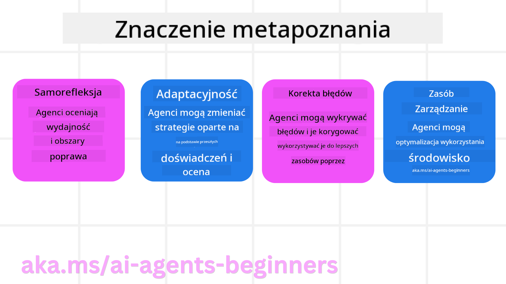
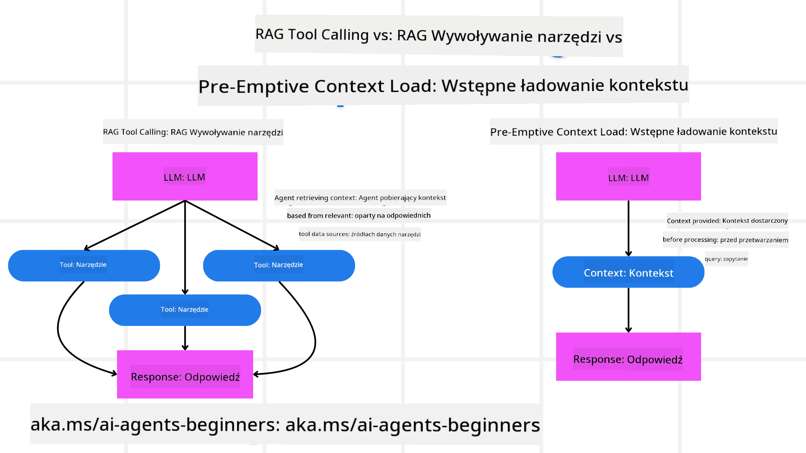

<!--
CO_OP_TRANSLATOR_METADATA:
{
  "original_hash": "5f0deef171fc3a68d5d3d770a8bfb03d",
  "translation_date": "2025-08-30T08:36:27+00:00",
  "source_file": "09-metacognition/README.md",
  "language_code": "pl"
}
-->
[](https://youtu.be/His9R6gw6Ec?si=3_RMb8VprNvdLRhX)

> _(Kliknij obrazek powyżej, aby obejrzeć wideo z tej lekcji)_
# Metapoznanie w agentach AI

## Wprowadzenie

Witamy w lekcji o metapoznaniu w agentach AI! Ten rozdział został zaprojektowany dla początkujących, którzy są ciekawi, jak agenci AI mogą myśleć o swoich własnych procesach myślowych. Po ukończeniu tej lekcji zrozumiesz kluczowe pojęcia i zdobędziesz praktyczne przykłady zastosowania metapoznania w projektowaniu agentów AI.

## Cele nauki

Po ukończeniu tej lekcji będziesz w stanie:

1. Zrozumieć konsekwencje pętli rozumowania w definicjach agentów.
2. Wykorzystywać techniki planowania i oceny, aby wspierać samokorygujących się agentów.
3. Tworzyć własnych agentów zdolnych do manipulowania kodem w celu realizacji zadań.

## Wprowadzenie do metapoznania

Metapoznanie odnosi się do wyższych procesów poznawczych, które obejmują myślenie o własnym myśleniu. W przypadku agentów AI oznacza to zdolność do oceny i dostosowywania swoich działań na podstawie samoświadomości i wcześniejszych doświadczeń. Metapoznanie, czyli "myślenie o myśleniu", jest ważnym pojęciem w rozwoju systemów agentowych AI. Obejmuje ono świadomość wewnętrznych procesów oraz zdolność do monitorowania, regulowania i adaptacji swojego zachowania. Podobnie jak my, gdy analizujemy sytuację lub rozwiązujemy problem. Taka samoświadomość może pomóc systemom AI podejmować lepsze decyzje, identyfikować błędy i poprawiać swoje działanie w czasie – co ponownie nawiązuje do testu Turinga i debaty o tym, czy AI przejmie kontrolę.

W kontekście systemów agentowych AI metapoznanie może pomóc w rozwiązaniu kilku wyzwań, takich jak:
- Przejrzystość: Zapewnienie, że systemy AI mogą wyjaśniać swoje rozumowanie i decyzje.
- Rozumowanie: Zwiększenie zdolności systemów AI do syntezy informacji i podejmowania trafnych decyzji.
- Adaptacja: Umożliwienie systemom AI dostosowywania się do nowych środowisk i zmieniających się warunków.
- Percepcja: Poprawa dokładności systemów AI w rozpoznawaniu i interpretacji danych z otoczenia.

### Czym jest metapoznanie?

Metapoznanie, czyli "myślenie o myśleniu", to wyższy proces poznawczy, który obejmuje samoświadomość i samoregulację własnych procesów poznawczych. W obszarze AI metapoznanie umożliwia agentom ocenę i adaptację swoich strategii i działań, co prowadzi do lepszego rozwiązywania problemów i podejmowania decyzji. Dzięki zrozumieniu metapoznania możesz projektować agentów AI, którzy są nie tylko bardziej inteligentni, ale także bardziej elastyczni i wydajni. W prawdziwym metapoznaniu AI wyraźnie rozważa swoje własne rozumowanie.

Przykład: „Priorytetowo traktowałem tańsze loty, ponieważ... Mogę przegapić loty bezpośrednie, więc sprawdzę to ponownie.”
Śledzenie, dlaczego wybrano określoną trasę.
- Zauważenie, że popełniono błędy, ponieważ zbyt mocno polegano na preferencjach użytkownika z poprzedniego razu, więc zmienia się strategia podejmowania decyzji, a nie tylko końcowa rekomendacja.
- Diagnozowanie wzorców, takich jak: „Kiedy użytkownik wspomina 'zbyt tłoczno', powinienem nie tylko usunąć pewne atrakcje, ale także zauważyć, że moja metoda wybierania 'najlepszych atrakcji' jest wadliwa, jeśli zawsze klasyfikuję według popularności.”

### Znaczenie metapoznania w agentach AI

Metapoznanie odgrywa kluczową rolę w projektowaniu agentów AI z kilku powodów:



- Samorefleksja: Agenci mogą oceniać swoje własne działanie i identyfikować obszary do poprawy.
- Adaptacyjność: Agenci mogą modyfikować swoje strategie na podstawie wcześniejszych doświadczeń i zmieniających się warunków.
- Korekcja błędów: Agenci mogą samodzielnie wykrywać i korygować błędy, co prowadzi do dokładniejszych wyników.
- Zarządzanie zasobami: Agenci mogą optymalizować wykorzystanie zasobów, takich jak czas i moc obliczeniowa, poprzez planowanie i ocenę swoich działań.

## Komponenty agenta AI

Zanim zagłębimy się w procesy metapoznawcze, ważne jest, aby zrozumieć podstawowe komponenty agenta AI. Typowy agent AI składa się z:

- Persona: Osobowość i cechy agenta, które definiują, jak wchodzi w interakcje z użytkownikami.
- Narzędzia: Zdolności i funkcje, które agent może wykonywać.
- Umiejętności: Wiedza i ekspertyza, którą agent posiada.

Te komponenty współpracują, tworząc "jednostkę ekspercką", która może wykonywać określone zadania.

**Przykład**:
Weźmy pod uwagę agenta podróży, który nie tylko planuje Twoje wakacje, ale także dostosowuje swoją ścieżkę na podstawie danych w czasie rzeczywistym i wcześniejszych doświadczeń klientów.

### Przykład: Metapoznanie w usłudze agenta podróży

Wyobraź sobie, że projektujesz usługę agenta podróży zasilaną przez AI. Ten agent, "Agent Podróży", pomaga użytkownikom w planowaniu wakacji. Aby wprowadzić metapoznanie, Agent Podróży musi oceniać i dostosowywać swoje działania na podstawie samoświadomości i wcześniejszych doświadczeń. Oto jak metapoznanie mogłoby odegrać rolę:

#### Aktualne zadanie

Aktualnym zadaniem jest pomoc użytkownikowi w zaplanowaniu podróży do Paryża.

#### Kroki do wykonania zadania

1. **Zbieranie preferencji użytkownika**: Zapytaj użytkownika o daty podróży, budżet, zainteresowania (np. muzea, kuchnia, zakupy) i wszelkie szczególne wymagania.
2. **Pobieranie informacji**: Wyszukaj opcje lotów, zakwaterowania, atrakcji i restauracji, które odpowiadają preferencjom użytkownika.
3. **Generowanie rekomendacji**: Zaproponuj spersonalizowany plan podróży z szczegółami lotów, rezerwacjami hotelowymi i sugerowanymi aktywnościami.
4. **Dostosowanie na podstawie opinii**: Poproś użytkownika o opinię na temat rekomendacji i wprowadź niezbędne zmiany.

#### Wymagane zasoby

- Dostęp do baz danych rezerwacji lotów i hoteli.
- Informacje o atrakcjach i restauracjach w Paryżu.
- Dane zwrotne od użytkowników z poprzednich interakcji.

#### Doświadczenie i samorefleksja

Agent Podróży wykorzystuje metapoznanie do oceny swojego działania i uczenia się na podstawie wcześniejszych doświadczeń. Na przykład:

1. **Analiza opinii użytkowników**: Agent Podróży przegląda opinie użytkowników, aby określić, które rekomendacje były dobrze przyjęte, a które nie. Dostosowuje swoje przyszłe sugestie odpowiednio.
2. **Adaptacyjność**: Jeśli użytkownik wcześniej wspomniał o niechęci do zatłoczonych miejsc, Agent Podróży unika rekomendowania popularnych atrakcji w godzinach szczytu w przyszłości.
3. **Korekcja błędów**: Jeśli Agent Podróży popełnił błąd w poprzedniej rezerwacji, np. sugerując hotel, który był w pełni zarezerwowany, uczy się dokładniej sprawdzać dostępność przed składaniem rekomendacji.

#### Praktyczny przykład dla deweloperów

Oto uproszczony przykład kodu, jak mogłoby wyglądać oprogramowanie Agenta Podróży z wbudowanym metapoznaniem:

```python
class Travel_Agent:
    def __init__(self):
        self.user_preferences = {}
        self.experience_data = []

    def gather_preferences(self, preferences):
        self.user_preferences = preferences

    def retrieve_information(self):
        # Search for flights, hotels, and attractions based on preferences
        flights = search_flights(self.user_preferences)
        hotels = search_hotels(self.user_preferences)
        attractions = search_attractions(self.user_preferences)
        return flights, hotels, attractions

    def generate_recommendations(self):
        flights, hotels, attractions = self.retrieve_information()
        itinerary = create_itinerary(flights, hotels, attractions)
        return itinerary

    def adjust_based_on_feedback(self, feedback):
        self.experience_data.append(feedback)
        # Analyze feedback and adjust future recommendations
        self.user_preferences = adjust_preferences(self.user_preferences, feedback)

# Example usage
travel_agent = Travel_Agent()
preferences = {
    "destination": "Paris",
    "dates": "2025-04-01 to 2025-04-10",
    "budget": "moderate",
    "interests": ["museums", "cuisine"]
}
travel_agent.gather_preferences(preferences)
itinerary = travel_agent.generate_recommendations()
print("Suggested Itinerary:", itinerary)
feedback = {"liked": ["Louvre Museum"], "disliked": ["Eiffel Tower (too crowded)"]}
travel_agent.adjust_based_on_feedback(feedback)
```

#### Dlaczego metapoznanie ma znaczenie

- **Samorefleksja**: Agenci mogą analizować swoje działanie i identyfikować obszary do poprawy.
- **Adaptacyjność**: Agenci mogą modyfikować strategie na podstawie opinii i zmieniających się warunków.
- **Korekcja błędów**: Agenci mogą samodzielnie wykrywać i korygować błędy.
- **Zarządzanie zasobami**: Agenci mogą optymalizować wykorzystanie zasobów, takich jak czas i moc obliczeniowa.

Dzięki wprowadzeniu metapoznania Agent Podróży może dostarczać bardziej spersonalizowane i dokładne rekomendacje podróży, poprawiając ogólne doświadczenie użytkownika.

---

## 2. Planowanie w agentach

Planowanie to kluczowy element zachowania agentów AI. Obejmuje ono określenie kroków potrzebnych do osiągnięcia celu, uwzględniając aktualny stan, zasoby i możliwe przeszkody.

### Elementy planowania

- **Aktualne zadanie**: Jasno zdefiniuj zadanie.
- **Kroki do wykonania zadania**: Podziel zadanie na zarządzalne kroki.
- **Wymagane zasoby**: Zidentyfikuj niezbędne zasoby.
- **Doświadczenie**: Wykorzystaj wcześniejsze doświadczenia do informowania planowania.

**Przykład**:
Oto kroki, które Agent Podróży musi podjąć, aby skutecznie pomóc użytkownikowi w planowaniu podróży:

### Kroki dla Agenta Podróży

1. **Zbieranie preferencji użytkownika**
   - Zapytaj użytkownika o szczegóły dotyczące dat podróży, budżetu, zainteresowań i wszelkich szczególnych wymagań.
   - Przykłady: „Kiedy planujesz podróż?” „Jaki jest Twój przedział budżetowy?” „Jakie aktywności lubisz podczas wakacji?”

2. **Pobieranie informacji**
   - Wyszukaj odpowiednie opcje podróży na podstawie preferencji użytkownika.
   - **Loty**: Znajdź dostępne loty w ramach budżetu użytkownika i preferowanych dat podróży.
   - **Zakwaterowanie**: Znajdź hotele lub wynajmy, które odpowiadają preferencjom użytkownika dotyczącym lokalizacji, ceny i udogodnień.
   - **Atrakcje i restauracje**: Zidentyfikuj popularne atrakcje, aktywności i opcje gastronomiczne zgodne z zainteresowaniami użytkownika.

3. **Generowanie rekomendacji**
   - Zbierz zebrane informacje w spersonalizowany plan podróży.
   - Podaj szczegóły, takie jak opcje lotów, rezerwacje hotelowe i sugerowane aktywności, dostosowując rekomendacje do preferencji użytkownika.

4. **Przedstawienie planu użytkownikowi**
   - Udostępnij zaproponowany plan podróży użytkownikowi do przeglądu.
   - Przykład: „Oto sugerowany plan podróży do Paryża. Zawiera szczegóły lotów, rezerwacje hotelowe oraz listę polecanych aktywności i restauracji. Daj znać, co o tym sądzisz!”

5. **Zbieranie opinii**
   - Poproś użytkownika o opinię na temat zaproponowanego planu podróży.
   - Przykłady: „Czy podobają Ci się opcje lotów?” „Czy hotel spełnia Twoje oczekiwania?” „Czy są jakieś aktywności, które chciałbyś dodać lub usunąć?”

6. **Dostosowanie na podstawie opinii**
   - Zmodyfikuj plan podróży na podstawie opinii użytkownika.
   - Wprowadź niezbędne zmiany w rekomendacjach dotyczących lotów, zakwaterowania i aktywności, aby lepiej dopasować je do preferencji użytkownika.

7. **Ostateczne potwierdzenie**
   - Przedstaw zaktualizowany plan podróży użytkownikowi do ostatecznego potwierdzenia.
   - Przykład: „Wprowadziłem zmiany na podstawie Twojej opinii. Oto zaktualizowany plan podróży. Czy wszystko wygląda dobrze?”

8. **Rezerwacja i potwierdzenie**
   - Po zatwierdzeniu planu przez użytkownika, przystąp do rezerwacji lotów, zakwaterowania i wszelkich zaplanowanych aktywności.
   - Wyślij użytkownikowi szczegóły potwierdzenia.

9. **Zapewnienie wsparcia**
   - Pozostań dostępny, aby pomóc użytkownikowi w przypadku jakichkolwiek zmian lub dodatkowych próśb przed i w trakcie podróży.
   - Przykład: „Jeśli będziesz potrzebować dalszej pomocy podczas podróży, skontaktuj się ze mną w dowolnym momencie!”

### Przykład interakcji

```python
class Travel_Agent:
    def __init__(self):
        self.user_preferences = {}
        self.experience_data = []

    def gather_preferences(self, preferences):
        self.user_preferences = preferences

    def retrieve_information(self):
        flights = search_flights(self.user_preferences)
        hotels = search_hotels(self.user_preferences)
        attractions = search_attractions(self.user_preferences)
        return flights, hotels, attractions

    def generate_recommendations(self):
        flights, hotels, attractions = self.retrieve_information()
        itinerary = create_itinerary(flights, hotels, attractions)
        return itinerary

    def adjust_based_on_feedback(self, feedback):
        self.experience_data.append(feedback)
        self.user_preferences = adjust_preferences(self.user_preferences, feedback)

# Example usage within a booing request
travel_agent = Travel_Agent()
preferences = {
    "destination": "Paris",
    "dates": "2025-04-01 to 2025-04-10",
    "budget": "moderate",
    "interests": ["museums", "cuisine"]
}
travel_agent.gather_preferences(preferences)
itinerary = travel_agent.generate_recommendations()
print("Suggested Itinerary:", itinerary)
feedback = {"liked": ["Louvre Museum"], "disliked": ["Eiffel Tower (too crowded)"]}
travel_agent.adjust_based_on_feedback(feedback)
```

## 3. Korekcyjny system RAG

Najpierw zrozummy różnicę między narzędziem RAG a prewencyjnym ładowaniem kontekstu.



### Retrieval-Augmented Generation (RAG)

RAG łączy system wyszukiwania z modelem generatywnym. Gdy zadane jest zapytanie, system wyszukiwania pobiera odpowiednie dokumenty lub dane z zewnętrznego źródła, a te informacje są wykorzystywane do wzbogacenia wejścia do modelu generatywnego. Pomaga to modelowi generować bardziej dokładne i kontekstowo odpowiednie odpowiedzi.

W systemie RAG agent pobiera odpowiednie informacje z bazy wiedzy i wykorzystuje je do generowania odpowiednich odpowiedzi lub działań.

### Podejście korekcyjne RAG

Podejście korekcyjne RAG koncentruje się na wykorzystaniu technik RAG do korygowania błędów i poprawy dokładności agentów AI. Obejmuje to:

1. **Technika podpowiedzi**: Używanie konkretnych podpowiedzi do kierowania agentem w pobieraniu odpowiednich informacji.
2. **Narzędzie**: Wdrażanie algorytmów i mechanizmów umożliwiających agentowi ocenę trafności pobranych informacji i generowanie dokładnych odpowiedzi.
3. **Ocena**: Ciągłe ocenianie działania agenta i wprowadzanie poprawek w celu poprawy jego dokładności i wydajności.

#### Przykład: Korekcyjny RAG w agencie wyszukiwania

Weźmy pod uwagę agenta wyszukiwania, który pobiera informacje z internetu, aby odpowiedzieć na zapytania użytkowników. Podejście korekcyjne RAG może obejmować:

1. **Technika podpowiedzi**: Formułowanie zapytań wyszukiwania na podstawie danych wejściowych użytkownika.
2. **Narzędzie**: Wykorzystanie przetwarzania języka naturalnego i algorytmów uczenia maszynowego do klasyfikowania i filtrowania wyników wyszukiwania.
3. **Ocena**: Analiza opinii użytkowników w celu identyfikacji i korekty nieścisłości w pobranych informacjach.

### Korekcyjny RAG w Agencie Podróży

Korekcyjny RAG (Retrieval-Augmented Generation) zwiększa zdolność AI do pobierania i generowania informacji przy jednoczesnym korygowaniu nieścisłości. Zobaczmy, jak Agent Podróży może wykorzystać podejście korekcyjne RAG, aby dostarczać bardziej dokładne i trafne rekomendacje podróży.

Obejmuje to:

- **Technika podpowiedzi:** Używanie konkretnych podpowiedzi do kierowania agentem w pobieraniu odpowiednich informacji.
- **Narzędzie:** Wdrażanie algorytmów i mechanizmów umożliwiających agentowi ocenę trafności pobranych informacji i generowanie dokładnych odpowiedzi.
- **Ocena:** Ciągłe ocenianie działania agenta i wprowadzanie poprawek w celu poprawy jego dokładności i wydajności.

#### Kroki wdrażania korekcyjnego RAG w Agencie Podróży

1. **Początkowa interakcja z użytkownikiem**
   - Agent Podróży zbiera początkowe preferencje użytkownika, takie jak miejsce docelowe, daty podróży, budżet i zainteresowania.
   - Przykład:

     ```python
     preferences = {
         "destination": "Paris",
         "dates": "2025-04-01 to 2025-04-10",
         "budget": "moderate",
         "interests": ["museums", "cuisine"]
     }
     ```

2. **Pobieranie informacji**
   - Agent Podróży pobiera informacje o lotach, zakwaterowaniu, atrakcjach i restauracjach na podstawie preferencji użytkownika.
   - Przykład:

     ```python
     flights = search_flights(preferences)
     hotels = search_hotels(preferences)
     attractions = search_attractions(preferences)
     ```

3. **Generowanie początkowych rekomendacji**
   -
```python
class Travel_Agent:
    def __init__(self):
        self.user_preferences = {}
        self.experience_data = []

    def gather_preferences(self, preferences):
        self.user_preferences = preferences

    def retrieve_information(self):
        flights = search_flights(self.user_preferences)
        hotels = search_hotels(self.user_preferences)
        attractions = search_attractions(self.user_preferences)
        return flights, hotels, attractions

    def generate_recommendations(self):
        flights, hotels, attractions = self.retrieve_information()
        itinerary = create_itinerary(flights, hotels, attractions)
        return itinerary

    def adjust_based_on_feedback(self, feedback):
        self.experience_data.append(feedback)
        self.user_preferences = adjust_preferences(self.user_preferences, feedback)
        new_itinerary = self.generate_recommendations()
        return new_itinerary

# Example usage
travel_agent = Travel_Agent()
preferences = {
    "destination": "Paris",
    "dates": "2025-04-01 to 2025-04-10",
    "budget": "moderate",
    "interests": ["museums", "cuisine"]
}
travel_agent.gather_preferences(preferences)
itinerary = travel_agent.generate_recommendations()
print("Suggested Itinerary:", itinerary)
feedback = {"liked": ["Louvre Museum"], "disliked": ["Eiffel Tower (too crowded)"]}
new_itinerary = travel_agent.adjust_based_on_feedback(feedback)
print("Updated Itinerary:", new_itinerary)
```

### Wstępne Ładowanie Kontekstu

Wstępne ładowanie kontekstu polega na załadowaniu odpowiednich informacji kontekstowych lub tła do modelu przed przetwarzaniem zapytania. Oznacza to, że model ma dostęp do tych informacji od samego początku, co może pomóc w generowaniu bardziej trafnych odpowiedzi bez konieczności pobierania dodatkowych danych w trakcie procesu.

Oto uproszczony przykład, jak wstępne ładowanie kontekstu może wyglądać w aplikacji dla biura podróży w Pythonie:

```python
class TravelAgent:
    def __init__(self):
        # Pre-load popular destinations and their information
        self.context = {
            "Paris": {"country": "France", "currency": "Euro", "language": "French", "attractions": ["Eiffel Tower", "Louvre Museum"]},
            "Tokyo": {"country": "Japan", "currency": "Yen", "language": "Japanese", "attractions": ["Tokyo Tower", "Shibuya Crossing"]},
            "New York": {"country": "USA", "currency": "Dollar", "language": "English", "attractions": ["Statue of Liberty", "Times Square"]},
            "Sydney": {"country": "Australia", "currency": "Dollar", "language": "English", "attractions": ["Sydney Opera House", "Bondi Beach"]}
        }

    def get_destination_info(self, destination):
        # Fetch destination information from pre-loaded context
        info = self.context.get(destination)
        if info:
            return f"{destination}:\nCountry: {info['country']}\nCurrency: {info['currency']}\nLanguage: {info['language']}\nAttractions: {', '.join(info['attractions'])}"
        else:
            return f"Sorry, we don't have information on {destination}."

# Example usage
travel_agent = TravelAgent()
print(travel_agent.get_destination_info("Paris"))
print(travel_agent.get_destination_info("Tokyo"))
```

#### Wyjaśnienie

1. **Inicjalizacja (metoda `__init__`)**: Klasa `TravelAgent` wstępnie ładuje słownik zawierający informacje o popularnych destynacjach, takich jak Paryż, Tokio, Nowy Jork i Sydney. Słownik ten zawiera szczegóły, takie jak kraj, waluta, język i główne atrakcje dla każdej destynacji.

2. **Pobieranie informacji (metoda `get_destination_info`)**: Gdy użytkownik pyta o konkretną destynację, metoda `get_destination_info` pobiera odpowiednie informacje z wstępnie załadowanego słownika kontekstowego.

Dzięki wstępnemu ładowaniu kontekstu aplikacja biura podróży może szybko odpowiadać na zapytania użytkowników bez konieczności pobierania tych informacji z zewnętrznego źródła w czasie rzeczywistym. To sprawia, że aplikacja jest bardziej wydajna i responsywna.

### Tworzenie Planu z Celem Przed Iteracją

Tworzenie planu z jasno określonym celem polega na rozpoczęciu od wyraźnie zdefiniowanego celu lub oczekiwanego rezultatu. Określenie tego celu na początku pozwala modelowi używać go jako zasady przewodniej w całym procesie iteracyjnym. Pomaga to zapewnić, że każda iteracja przybliża do osiągnięcia zamierzonego rezultatu, czyniąc proces bardziej efektywnym i skoncentrowanym.

Oto przykład, jak można stworzyć plan podróży z celem przed iteracją w aplikacji dla biura podróży w Pythonie:

### Scenariusz

Biuro podróży chce zaplanować spersonalizowane wakacje dla klienta. Celem jest stworzenie planu podróży, który maksymalizuje zadowolenie klienta na podstawie jego preferencji i budżetu.

### Kroki

1. Zdefiniowanie preferencji i budżetu klienta.
2. Stworzenie początkowego planu na podstawie tych preferencji.
3. Iteracja w celu udoskonalenia planu, optymalizując go pod kątem zadowolenia klienta.

#### Kod w Pythonie

```python
class TravelAgent:
    def __init__(self, destinations):
        self.destinations = destinations

    def bootstrap_plan(self, preferences, budget):
        plan = []
        total_cost = 0

        for destination in self.destinations:
            if total_cost + destination['cost'] <= budget and self.match_preferences(destination, preferences):
                plan.append(destination)
                total_cost += destination['cost']

        return plan

    def match_preferences(self, destination, preferences):
        for key, value in preferences.items():
            if destination.get(key) != value:
                return False
        return True

    def iterate_plan(self, plan, preferences, budget):
        for i in range(len(plan)):
            for destination in self.destinations:
                if destination not in plan and self.match_preferences(destination, preferences) and self.calculate_cost(plan, destination) <= budget:
                    plan[i] = destination
                    break
        return plan

    def calculate_cost(self, plan, new_destination):
        return sum(destination['cost'] for destination in plan) + new_destination['cost']

# Example usage
destinations = [
    {"name": "Paris", "cost": 1000, "activity": "sightseeing"},
    {"name": "Tokyo", "cost": 1200, "activity": "shopping"},
    {"name": "New York", "cost": 900, "activity": "sightseeing"},
    {"name": "Sydney", "cost": 1100, "activity": "beach"},
]

preferences = {"activity": "sightseeing"}
budget = 2000

travel_agent = TravelAgent(destinations)
initial_plan = travel_agent.bootstrap_plan(preferences, budget)
print("Initial Plan:", initial_plan)

refined_plan = travel_agent.iterate_plan(initial_plan, preferences, budget)
print("Refined Plan:", refined_plan)
```

#### Wyjaśnienie Kodu

1. **Inicjalizacja (metoda `__init__`)**: Klasa `TravelAgent` jest inicjalizowana z listą potencjalnych destynacji, z których każda ma atrybuty, takie jak nazwa, koszt i typ aktywności.

2. **Tworzenie Planu (metoda `bootstrap_plan`)**: Ta metoda tworzy początkowy plan podróży na podstawie preferencji klienta i budżetu. Iteruje przez listę destynacji i dodaje je do planu, jeśli pasują do preferencji klienta i mieszczą się w budżecie.

3. **Dopasowanie Preferencji (metoda `match_preferences`)**: Ta metoda sprawdza, czy destynacja odpowiada preferencjom klienta.

4. **Iteracja Planu (metoda `iterate_plan`)**: Ta metoda udoskonala początkowy plan, próbując zastąpić każdą destynację w planie lepszym wyborem, uwzględniając preferencje klienta i ograniczenia budżetowe.

5. **Obliczanie Kosztów (metoda `calculate_cost`)**: Ta metoda oblicza całkowity koszt obecnego planu, w tym potencjalnej nowej destynacji.

#### Przykład Użycia

- **Początkowy Plan**: Biuro podróży tworzy początkowy plan na podstawie preferencji klienta dotyczących zwiedzania i budżetu w wysokości 2000 USD.
- **Udoskonalony Plan**: Biuro podróży iteruje plan, optymalizując go pod kątem preferencji i budżetu klienta.

Tworząc plan z jasno określonym celem (np. maksymalizacja zadowolenia klienta) i iterując w celu jego udoskonalenia, biuro podróży może stworzyć spersonalizowany i zoptymalizowany plan podróży dla klienta. Takie podejście zapewnia, że plan podróży od początku odpowiada preferencjom i budżetowi klienta, a z każdą iteracją staje się coraz lepszy.

### Wykorzystanie LLM do Ponownego Rankingu i Oceny

Duże modele językowe (LLM) mogą być używane do ponownego rankingu i oceny poprzez analizę trafności i jakości pobranych dokumentów lub wygenerowanych odpowiedzi. Oto jak to działa:

**Pobieranie:** Pierwszy krok pobierania polega na uzyskaniu zestawu kandydatów (dokumentów lub odpowiedzi) na podstawie zapytania.

**Ponowny Ranking:** LLM ocenia tych kandydatów i ponownie ustawia ich kolejność na podstawie ich trafności i jakości. Ten krok zapewnia, że najbardziej trafne i wysokiej jakości informacje są prezentowane jako pierwsze.

**Ocena:** LLM przypisuje każdemu kandydatowi ocenę, która odzwierciedla jego trafność i jakość. Pomaga to w wyborze najlepszej odpowiedzi lub dokumentu dla użytkownika.

Wykorzystując LLM do ponownego rankingu i oceny, system może dostarczać bardziej precyzyjne i kontekstowo trafne informacje, poprawiając ogólne doświadczenie użytkownika.

Oto przykład, jak biuro podróży może użyć dużego modelu językowego (LLM) do ponownego rankingu i oceny destynacji podróży na podstawie preferencji użytkownika w Pythonie:

#### Scenariusz - Podróż na podstawie preferencji

Biuro podróży chce polecić najlepsze destynacje podróży klientowi na podstawie jego preferencji. LLM pomoże w ponownym rankingu i ocenie destynacji, aby zapewnić prezentację najbardziej trafnych opcji.

#### Kroki:

1. Zbierz preferencje użytkownika.
2. Pobierz listę potencjalnych destynacji podróży.
3. Użyj LLM do ponownego rankingu i oceny destynacji na podstawie preferencji użytkownika.

Oto jak można zaktualizować poprzedni przykład, aby użyć Azure OpenAI Services:

#### Wymagania

1. Musisz posiadać subskrypcję Azure.
2. Utwórz zasób Azure OpenAI i uzyskaj klucz API.

#### Przykład Kod w Pythonie

```python
import requests
import json

class TravelAgent:
    def __init__(self, destinations):
        self.destinations = destinations

    def get_recommendations(self, preferences, api_key, endpoint):
        # Generate a prompt for the Azure OpenAI
        prompt = self.generate_prompt(preferences)
        
        # Define headers and payload for the request
        headers = {
            'Content-Type': 'application/json',
            'Authorization': f'Bearer {api_key}'
        }
        payload = {
            "prompt": prompt,
            "max_tokens": 150,
            "temperature": 0.7
        }
        
        # Call the Azure OpenAI API to get the re-ranked and scored destinations
        response = requests.post(endpoint, headers=headers, json=payload)
        response_data = response.json()
        
        # Extract and return the recommendations
        recommendations = response_data['choices'][0]['text'].strip().split('\n')
        return recommendations

    def generate_prompt(self, preferences):
        prompt = "Here are the travel destinations ranked and scored based on the following user preferences:\n"
        for key, value in preferences.items():
            prompt += f"{key}: {value}\n"
        prompt += "\nDestinations:\n"
        for destination in self.destinations:
            prompt += f"- {destination['name']}: {destination['description']}\n"
        return prompt

# Example usage
destinations = [
    {"name": "Paris", "description": "City of lights, known for its art, fashion, and culture."},
    {"name": "Tokyo", "description": "Vibrant city, famous for its modernity and traditional temples."},
    {"name": "New York", "description": "The city that never sleeps, with iconic landmarks and diverse culture."},
    {"name": "Sydney", "description": "Beautiful harbour city, known for its opera house and stunning beaches."},
]

preferences = {"activity": "sightseeing", "culture": "diverse"}
api_key = 'your_azure_openai_api_key'
endpoint = 'https://your-endpoint.com/openai/deployments/your-deployment-name/completions?api-version=2022-12-01'

travel_agent = TravelAgent(destinations)
recommendations = travel_agent.get_recommendations(preferences, api_key, endpoint)
print("Recommended Destinations:")
for rec in recommendations:
    print(rec)
```

#### Wyjaśnienie Kodu - Preference Booker

1. **Inicjalizacja**: Klasa `TravelAgent` jest inicjalizowana z listą potencjalnych destynacji podróży, z których każda ma atrybuty, takie jak nazwa i opis.

2. **Uzyskiwanie Rekomendacji (metoda `get_recommendations`)**: Ta metoda generuje prompt dla usługi Azure OpenAI na podstawie preferencji użytkownika i wykonuje żądanie HTTP POST do API Azure OpenAI, aby uzyskać ponownie zrankowane i ocenione destynacje.

3. **Generowanie Promptu (metoda `generate_prompt`)**: Ta metoda konstruuje prompt dla Azure OpenAI, uwzględniając preferencje użytkownika i listę destynacji. Prompt kieruje model do ponownego rankingu i oceny destynacji na podstawie podanych preferencji.

4. **Wywołanie API**: Biblioteka `requests` jest używana do wykonania żądania HTTP POST do punktu końcowego API Azure OpenAI. Odpowiedź zawiera ponownie zrankowane i ocenione destynacje.

5. **Przykład Użycia**: Biuro podróży zbiera preferencje użytkownika (np. zainteresowanie zwiedzaniem i różnorodną kulturą) i używa usługi Azure OpenAI do uzyskania ponownie zrankowanych i ocenionych rekomendacji destynacji podróży.

Upewnij się, że zastąpisz `your_azure_openai_api_key` swoim rzeczywistym kluczem API Azure OpenAI oraz `https://your-endpoint.com/...` rzeczywistym URL-em punktu końcowego Twojego wdrożenia Azure OpenAI.

Wykorzystując LLM do ponownego rankingu i oceny, biuro podróży może dostarczać bardziej spersonalizowane i trafne rekomendacje podróży klientom, poprawiając ich ogólne doświadczenie.
#### Praktyczny przykład: Wyszukiwanie z intencją w Travel Agent

Weźmy Travel Agent jako przykład, aby zobaczyć, jak można zaimplementować wyszukiwanie z intencją.

1. **Zbieranie preferencji użytkownika**

   ```python
   class Travel_Agent:
       def __init__(self):
           self.user_preferences = {}

       def gather_preferences(self, preferences):
           self.user_preferences = preferences
   ```

2. **Rozumienie intencji użytkownika**

   ```python
   def identify_intent(query):
       if "book" in query or "purchase" in query:
           return "transactional"
       elif "website" in query or "official" in query:
           return "navigational"
       else:
           return "informational"
   ```

3. **Świadomość kontekstu**

   ```python
   def analyze_context(query, user_history):
       # Combine current query with user history to understand context
       context = {
           "current_query": query,
           "user_history": user_history
       }
       return context
   ```

4. **Wyszukiwanie i personalizacja wyników**

   ```python
   def search_with_intent(query, preferences, user_history):
       intent = identify_intent(query)
       context = analyze_context(query, user_history)
       if intent == "informational":
           search_results = search_information(query, preferences)
       elif intent == "navigational":
           search_results = search_navigation(query)
       elif intent == "transactional":
           search_results = search_transaction(query, preferences)
       personalized_results = personalize_results(search_results, user_history)
       return personalized_results

   def search_information(query, preferences):
       # Example search logic for informational intent
       results = search_web(f"best {preferences['interests']} in {preferences['destination']}")
       return results

   def search_navigation(query):
       # Example search logic for navigational intent
       results = search_web(query)
       return results

   def search_transaction(query, preferences):
       # Example search logic for transactional intent
       results = search_web(f"book {query} to {preferences['destination']}")
       return results

   def personalize_results(results, user_history):
       # Example personalization logic
       personalized = [result for result in results if result not in user_history]
       return personalized[:10]  # Return top 10 personalized results
   ```

5. **Przykład użycia**

   ```python
   travel_agent = Travel_Agent()
   preferences = {
       "destination": "Paris",
       "interests": ["museums", "cuisine"]
   }
   travel_agent.gather_preferences(preferences)
   user_history = ["Louvre Museum website", "Book flight to Paris"]
   query = "best museums in Paris"
   results = search_with_intent(query, preferences, user_history)
   print("Search Results:", results)
   ```

---

## 4. Generowanie kodu jako narzędzie

Agenci generujący kod wykorzystują modele AI do pisania i wykonywania kodu, rozwiązując złożone problemy i automatyzując zadania.

### Agenci generujący kod

Agenci generujący kod używają generatywnych modeli AI do pisania i wykonywania kodu. Mogą rozwiązywać złożone problemy, automatyzować zadania i dostarczać cennych informacji, generując i uruchamiając kod w różnych językach programowania.

#### Praktyczne zastosowania

1. **Automatyczne generowanie kodu**: Tworzenie fragmentów kodu dla konkretnych zadań, takich jak analiza danych, web scraping czy uczenie maszynowe.
2. **SQL jako RAG**: Wykorzystywanie zapytań SQL do pobierania i manipulowania danymi z baz danych.
3. **Rozwiązywanie problemów**: Tworzenie i wykonywanie kodu w celu rozwiązania konkretnych problemów, takich jak optymalizacja algorytmów czy analiza danych.

#### Przykład: Agent generujący kod do analizy danych

Wyobraź sobie, że projektujesz agenta generującego kod. Oto jak może działać:

1. **Zadanie**: Analiza zestawu danych w celu identyfikacji trendów i wzorców.
2. **Kroki**:
   - Załaduj zestaw danych do narzędzia analizy danych.
   - Generuj zapytania SQL w celu filtrowania i agregowania danych.
   - Wykonaj zapytania i pobierz wyniki.
   - Wykorzystaj wyniki do tworzenia wizualizacji i wniosków.
3. **Wymagane zasoby**: Dostęp do zestawu danych, narzędzia analizy danych i możliwości SQL.
4. **Doświadczenie**: Wykorzystaj wyniki wcześniejszych analiz, aby poprawić dokładność i trafność przyszłych analiz.

### Przykład: Agent generujący kod dla Travel Agent

W tym przykładzie zaprojektujemy agenta generującego kod, Travel Agent, który pomoże użytkownikom w planowaniu podróży, generując i wykonując kod. Agent może obsługiwać zadania takie jak pobieranie opcji podróży, filtrowanie wyników i tworzenie planu podróży za pomocą generatywnej AI.

#### Przegląd agenta generującego kod

1. **Zbieranie preferencji użytkownika**: Zbiera dane wejściowe użytkownika, takie jak miejsce docelowe, daty podróży, budżet i zainteresowania.
2. **Generowanie kodu do pobierania danych**: Tworzy fragmenty kodu w celu pobrania danych o lotach, hotelach i atrakcjach.
3. **Wykonywanie wygenerowanego kodu**: Uruchamia wygenerowany kod, aby pobrać informacje w czasie rzeczywistym.
4. **Tworzenie planu podróży**: Kompiluje pobrane dane w spersonalizowany plan podróży.
5. **Dostosowanie na podstawie opinii**: Otrzymuje opinie użytkownika i regeneruje kod, jeśli to konieczne, aby udoskonalić wyniki.

#### Implementacja krok po kroku

1. **Zbieranie preferencji użytkownika**

   ```python
   class Travel_Agent:
       def __init__(self):
           self.user_preferences = {}

       def gather_preferences(self, preferences):
           self.user_preferences = preferences
   ```

2. **Generowanie kodu do pobierania danych**

   ```python
   def generate_code_to_fetch_data(preferences):
       # Example: Generate code to search for flights based on user preferences
       code = f"""
       def search_flights():
           import requests
           response = requests.get('https://api.example.com/flights', params={preferences})
           return response.json()
       """
       return code

   def generate_code_to_fetch_hotels(preferences):
       # Example: Generate code to search for hotels
       code = f"""
       def search_hotels():
           import requests
           response = requests.get('https://api.example.com/hotels', params={preferences})
           return response.json()
       """
       return code
   ```

3. **Wykonywanie wygenerowanego kodu**

   ```python
   def execute_code(code):
       # Execute the generated code using exec
       exec(code)
       result = locals()
       return result

   travel_agent = Travel_Agent()
   preferences = {
       "destination": "Paris",
       "dates": "2025-04-01 to 2025-04-10",
       "budget": "moderate",
       "interests": ["museums", "cuisine"]
   }
   travel_agent.gather_preferences(preferences)
   
   flight_code = generate_code_to_fetch_data(preferences)
   hotel_code = generate_code_to_fetch_hotels(preferences)
   
   flights = execute_code(flight_code)
   hotels = execute_code(hotel_code)

   print("Flight Options:", flights)
   print("Hotel Options:", hotels)
   ```

4. **Tworzenie planu podróży**

   ```python
   def generate_itinerary(flights, hotels, attractions):
       itinerary = {
           "flights": flights,
           "hotels": hotels,
           "attractions": attractions
       }
       return itinerary

   attractions = search_attractions(preferences)
   itinerary = generate_itinerary(flights, hotels, attractions)
   print("Suggested Itinerary:", itinerary)
   ```

5. **Dostosowanie na podstawie opinii**

   ```python
   def adjust_based_on_feedback(feedback, preferences):
       # Adjust preferences based on user feedback
       if "liked" in feedback:
           preferences["favorites"] = feedback["liked"]
       if "disliked" in feedback:
           preferences["avoid"] = feedback["disliked"]
       return preferences

   feedback = {"liked": ["Louvre Museum"], "disliked": ["Eiffel Tower (too crowded)"]}
   updated_preferences = adjust_based_on_feedback(feedback, preferences)
   
   # Regenerate and execute code with updated preferences
   updated_flight_code = generate_code_to_fetch_data(updated_preferences)
   updated_hotel_code = generate_code_to_fetch_hotels(updated_preferences)
   
   updated_flights = execute_code(updated_flight_code)
   updated_hotels = execute_code(updated_hotel_code)
   
   updated_itinerary = generate_itinerary(updated_flights, updated_hotels, attractions)
   print("Updated Itinerary:", updated_itinerary)
   ```

### Wykorzystanie świadomości środowiska i rozumowania

Opieranie się na schemacie tabeli może rzeczywiście poprawić proces generowania zapytań, wykorzystując świadomość środowiska i rozumowanie.

Oto przykład, jak można to zrobić:

1. **Zrozumienie schematu**: System zrozumie schemat tabeli i wykorzysta te informacje do ugruntowania procesu generowania zapytań.
2. **Dostosowanie na podstawie opinii**: System dostosuje preferencje użytkownika na podstawie opinii i rozważy, które pola w schemacie należy zaktualizować.
3. **Generowanie i wykonywanie zapytań**: System wygeneruje i wykona zapytania w celu pobrania zaktualizowanych danych o lotach i hotelach na podstawie nowych preferencji.

Oto zaktualizowany przykład kodu w Pythonie, który uwzględnia te koncepcje:

```python
def adjust_based_on_feedback(feedback, preferences, schema):
    # Adjust preferences based on user feedback
    if "liked" in feedback:
        preferences["favorites"] = feedback["liked"]
    if "disliked" in feedback:
        preferences["avoid"] = feedback["disliked"]
    # Reasoning based on schema to adjust other related preferences
    for field in schema:
        if field in preferences:
            preferences[field] = adjust_based_on_environment(feedback, field, schema)
    return preferences

def adjust_based_on_environment(feedback, field, schema):
    # Custom logic to adjust preferences based on schema and feedback
    if field in feedback["liked"]:
        return schema[field]["positive_adjustment"]
    elif field in feedback["disliked"]:
        return schema[field]["negative_adjustment"]
    return schema[field]["default"]

def generate_code_to_fetch_data(preferences):
    # Generate code to fetch flight data based on updated preferences
    return f"fetch_flights(preferences={preferences})"

def generate_code_to_fetch_hotels(preferences):
    # Generate code to fetch hotel data based on updated preferences
    return f"fetch_hotels(preferences={preferences})"

def execute_code(code):
    # Simulate execution of code and return mock data
    return {"data": f"Executed: {code}"}

def generate_itinerary(flights, hotels, attractions):
    # Generate itinerary based on flights, hotels, and attractions
    return {"flights": flights, "hotels": hotels, "attractions": attractions}

# Example schema
schema = {
    "favorites": {"positive_adjustment": "increase", "negative_adjustment": "decrease", "default": "neutral"},
    "avoid": {"positive_adjustment": "decrease", "negative_adjustment": "increase", "default": "neutral"}
}

# Example usage
preferences = {"favorites": "sightseeing", "avoid": "crowded places"}
feedback = {"liked": ["Louvre Museum"], "disliked": ["Eiffel Tower (too crowded)"]}
updated_preferences = adjust_based_on_feedback(feedback, preferences, schema)

# Regenerate and execute code with updated preferences
updated_flight_code = generate_code_to_fetch_data(updated_preferences)
updated_hotel_code = generate_code_to_fetch_hotels(updated_preferences)

updated_flights = execute_code(updated_flight_code)
updated_hotels = execute_code(updated_hotel_code)

updated_itinerary = generate_itinerary(updated_flights, updated_hotels, feedback["liked"])
print("Updated Itinerary:", updated_itinerary)
```

#### Wyjaśnienie - Rezerwacja na podstawie opinii

1. **Świadomość schematu**: Słownik `schema` definiuje, jak preferencje powinny być dostosowane na podstawie opinii. Zawiera pola takie jak `favorites` i `avoid` z odpowiednimi dostosowaniami.
2. **Dostosowanie preferencji (metoda `adjust_based_on_feedback`)**: Ta metoda dostosowuje preferencje na podstawie opinii użytkownika i schematu.
3. **Dostosowania oparte na środowisku (metoda `adjust_based_on_environment`)**: Ta metoda personalizuje dostosowania na podstawie schematu i opinii.
4. **Generowanie i wykonywanie zapytań**: System generuje kod w celu pobrania zaktualizowanych danych o lotach i hotelach na podstawie dostosowanych preferencji i symuluje wykonanie tych zapytań.
5. **Tworzenie planu podróży**: System tworzy zaktualizowany plan podróży na podstawie nowych danych o lotach, hotelach i atrakcjach.

Dzięki uczynieniu systemu świadomym środowiska i rozumowaniu na podstawie schematu, może on generować bardziej dokładne i trafne zapytania, co prowadzi do lepszych rekomendacji podróży i bardziej spersonalizowanego doświadczenia użytkownika.

### Wykorzystanie SQL jako techniki Retrieval-Augmented Generation (RAG)

SQL (Structured Query Language) to potężne narzędzie do interakcji z bazami danych. Wykorzystując SQL jako część podejścia Retrieval-Augmented Generation (RAG), można pobierać odpowiednie dane z baz danych, aby informować i generować odpowiedzi lub działania w agentach AI. Przyjrzyjmy się, jak SQL może być używany jako technika RAG w kontekście Travel Agent.

#### Kluczowe koncepcje

1. **Interakcja z bazą danych**:
   - SQL jest używany do zapytań do baz danych, pobierania odpowiednich informacji i manipulowania danymi.
   - Przykład: Pobieranie szczegółów lotów, informacji o hotelach i atrakcjach z bazy danych podróży.

2. **Integracja z RAG**:
   - Zapytania SQL są generowane na podstawie danych wejściowych i preferencji użytkownika.
   - Pobierane dane są następnie wykorzystywane do generowania spersonalizowanych rekomendacji lub działań.

3. **Dynamiczne generowanie zapytań**:
   - Agent AI generuje dynamiczne zapytania SQL na podstawie kontekstu i potrzeb użytkownika.
   - Przykład: Dostosowywanie zapytań SQL w celu filtrowania wyników na podstawie budżetu, dat i zainteresowań.

#### Zastosowania

- **Automatyczne generowanie kodu**: Tworzenie fragmentów kodu dla konkretnych zadań.
- **SQL jako RAG**: Wykorzystywanie zapytań SQL do manipulowania danymi.
- **Rozwiązywanie problemów**: Tworzenie i wykonywanie kodu w celu rozwiązania problemów.

**Przykład**:
Agent analizy danych:

1. **Zadanie**: Analiza zestawu danych w celu znalezienia trendów.
2. **Kroki**:
   - Załaduj zestaw danych.
   - Generuj zapytania SQL w celu filtrowania danych.
   - Wykonaj zapytania i pobierz wyniki.
   - Generuj wizualizacje i wnioski.
3. **Zasoby**: Dostęp do zestawu danych, możliwości SQL.
4. **Doświadczenie**: Wykorzystaj wcześniejsze wyniki, aby poprawić przyszłe analizy.

#### Praktyczny przykład: Wykorzystanie SQL w Travel Agent

1. **Zbieranie preferencji użytkownika**

   ```python
   class Travel_Agent:
       def __init__(self):
           self.user_preferences = {}

       def gather_preferences(self, preferences):
           self.user_preferences = preferences
   ```

2. **Generowanie zapytań SQL**

   ```python
   def generate_sql_query(table, preferences):
       query = f"SELECT * FROM {table} WHERE "
       conditions = []
       for key, value in preferences.items():
           conditions.append(f"{key}='{value}'")
       query += " AND ".join(conditions)
       return query
   ```

3. **Wykonywanie zapytań SQL**

   ```python
   import sqlite3

   def execute_sql_query(query, database="travel.db"):
       connection = sqlite3.connect(database)
       cursor = connection.cursor()
       cursor.execute(query)
       results = cursor.fetchall()
       connection.close()
       return results
   ```

4. **Generowanie rekomendacji**

   ```python
   def generate_recommendations(preferences):
       flight_query = generate_sql_query("flights", preferences)
       hotel_query = generate_sql_query("hotels", preferences)
       attraction_query = generate_sql_query("attractions", preferences)
       
       flights = execute_sql_query(flight_query)
       hotels = execute_sql_query(hotel_query)
       attractions = execute_sql_query(attraction_query)
       
       itinerary = {
           "flights": flights,
           "hotels": hotels,
           "attractions": attractions
       }
       return itinerary

   travel_agent = Travel_Agent()
   preferences = {
       "destination": "Paris",
       "dates": "2025-04-01 to 2025-04-10",
       "budget": "moderate",
       "interests": ["museums", "cuisine"]
   }
   travel_agent.gather_preferences(preferences)
   itinerary = generate_recommendations(preferences)
   print("Suggested Itinerary:", itinerary)
   ```

#### Przykłady zapytań SQL

1. **Zapytanie o loty**

   ```sql
   SELECT * FROM flights WHERE destination='Paris' AND dates='2025-04-01 to 2025-04-10' AND budget='moderate';
   ```

2. **Zapytanie o hotele**

   ```sql
   SELECT * FROM hotels WHERE destination='Paris' AND budget='moderate';
   ```

3. **Zapytanie o atrakcje**

   ```sql
   SELECT * FROM attractions WHERE destination='Paris' AND interests='museums, cuisine';
   ```

Wykorzystując SQL jako część techniki Retrieval-Augmented Generation (RAG), agenci AI, tacy jak Travel Agent, mogą dynamicznie pobierać i wykorzystywać odpowiednie dane, aby dostarczać dokładne i spersonalizowane rekomendacje.

### Przykład metakognicji

Aby zademonstrować implementację metakognicji, stwórzmy prostego agenta, który *analizuje swój proces podejmowania decyzji* podczas rozwiązywania problemu. W tym przykładzie zbudujemy system, w którym agent próbuje zoptymalizować wybór hotelu, ale ocenia swoje własne rozumowanie i dostosowuje strategię, gdy popełnia błędy lub dokonuje suboptymalnych wyborów.

Zasymulujemy to za pomocą prostego przykładu, w którym agent wybiera hotele na podstawie kombinacji ceny i jakości, ale "analizuje" swoje decyzje i odpowiednio je dostosowuje.

#### Jak to ilustruje metakognicję:

1. **Początkowa decyzja**: Agent wybierze najtańszy hotel, nie uwzględniając wpływu jakości.
2. **Refleksja i ocena**: Po początkowym wyborze agent sprawdzi, czy hotel był "złym" wyborem na podstawie opinii użytkownika. Jeśli uzna, że jakość hotelu była zbyt niska, przeanalizuje swoje rozumowanie.
3. **Dostosowanie strategii**: Agent dostosuje swoją strategię na podstawie refleksji, przechodząc od "najtańszego" do "najwyższej jakości", poprawiając tym samym proces podejmowania decyzji w przyszłych iteracjach.

Oto przykład:

```python
class HotelRecommendationAgent:
    def __init__(self):
        self.previous_choices = []  # Stores the hotels chosen previously
        self.corrected_choices = []  # Stores the corrected choices
        self.recommendation_strategies = ['cheapest', 'highest_quality']  # Available strategies

    def recommend_hotel(self, hotels, strategy):
        """
        Recommend a hotel based on the chosen strategy.
        The strategy can either be 'cheapest' or 'highest_quality'.
        """
        if strategy == 'cheapest':
            recommended = min(hotels, key=lambda x: x['price'])
        elif strategy == 'highest_quality':
            recommended = max(hotels, key=lambda x: x['quality'])
        else:
            recommended = None
        self.previous_choices.append((strategy, recommended))
        return recommended

    def reflect_on_choice(self):
        """
        Reflect on the last choice made and decide if the agent should adjust its strategy.
        The agent considers if the previous choice led to a poor outcome.
        """
        if not self.previous_choices:
            return "No choices made yet."

        last_choice_strategy, last_choice = self.previous_choices[-1]
        # Let's assume we have some user feedback that tells us whether the last choice was good or not
        user_feedback = self.get_user_feedback(last_choice)

        if user_feedback == "bad":
            # Adjust strategy if the previous choice was unsatisfactory
            new_strategy = 'highest_quality' if last_choice_strategy == 'cheapest' else 'cheapest'
            self.corrected_choices.append((new_strategy, last_choice))
            return f"Reflecting on choice. Adjusting strategy to {new_strategy}."
        else:
            return "The choice was good. No need to adjust."

    def get_user_feedback(self, hotel):
        """
        Simulate user feedback based on hotel attributes.
        For simplicity, assume if the hotel is too cheap, the feedback is "bad".
        If the hotel has quality less than 7, feedback is "bad".
        """
        if hotel['price'] < 100 or hotel['quality'] < 7:
            return "bad"
        return "good"

# Simulate a list of hotels (price and quality)
hotels = [
    {'name': 'Budget Inn', 'price': 80, 'quality': 6},
    {'name': 'Comfort Suites', 'price': 120, 'quality': 8},
    {'name': 'Luxury Stay', 'price': 200, 'quality': 9}
]

# Create an agent
agent = HotelRecommendationAgent()

# Step 1: The agent recommends a hotel using the "cheapest" strategy
recommended_hotel = agent.recommend_hotel(hotels, 'cheapest')
print(f"Recommended hotel (cheapest): {recommended_hotel['name']}")

# Step 2: The agent reflects on the choice and adjusts strategy if necessary
reflection_result = agent.reflect_on_choice()
print(reflection_result)

# Step 3: The agent recommends again, this time using the adjusted strategy
adjusted_recommendation = agent.recommend_hotel(hotels, 'highest_quality')
print(f"Adjusted hotel recommendation (highest_quality): {adjusted_recommendation['name']}")
```

#### Zdolności metakognicyjne agenta

Kluczowe tutaj jest zdolność agenta do:
- Oceny swoich wcześniejszych wyborów i procesu podejmowania decyzji.
- Dostosowania strategii na podstawie tej refleksji, czyli metakognicji w działaniu.

To prosty przykład metakognicji, w którym system potrafi dostosować swój proces rozumowania na podstawie wewnętrznej opinii.

### Podsumowanie

Metakognicja to potężne narzędzie, które może znacząco zwiększyć możliwości agentów AI. Włączając procesy metakognicyjne, można projektować agentów bardziej inteligentnych, elastycznych i efektywnych. Skorzystaj z dodatkowych zasobów, aby dalej zgłębiać fascynujący świat metakognicji w agentach AI.

### Masz więcej pytań dotyczących wzorca projektowego metakognicji?

Dołącz do [Azure AI Foundry Discord](https://aka.ms/ai-agents/discord), aby spotkać się z innymi uczącymi się, uczestniczyć w godzinach konsultacji i uzyskać odpowiedzi na pytania dotyczące agentów AI.

## Poprzednia lekcja

[Wzorzec projektowy wieloagentowy](../08-multi-agent/README.md)

## Następna lekcja

[Agenci AI w produkcji](../10-ai-agents-production/README.md)

---

**Zastrzeżenie**:  
Ten dokument został przetłumaczony za pomocą usługi tłumaczeniowej AI [Co-op Translator](https://github.com/Azure/co-op-translator). Chociaż dokładamy wszelkich starań, aby tłumaczenie było precyzyjne, prosimy pamiętać, że automatyczne tłumaczenia mogą zawierać błędy lub nieścisłości. Oryginalny dokument w jego rodzimym języku powinien być uznawany za wiarygodne źródło. W przypadku informacji o kluczowym znaczeniu zaleca się skorzystanie z profesjonalnego tłumaczenia przez człowieka. Nie ponosimy odpowiedzialności za jakiekolwiek nieporozumienia lub błędne interpretacje wynikające z użycia tego tłumaczenia.