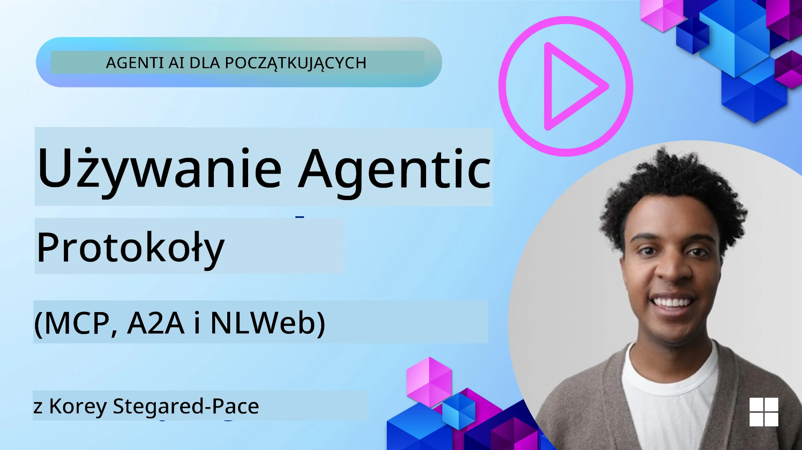
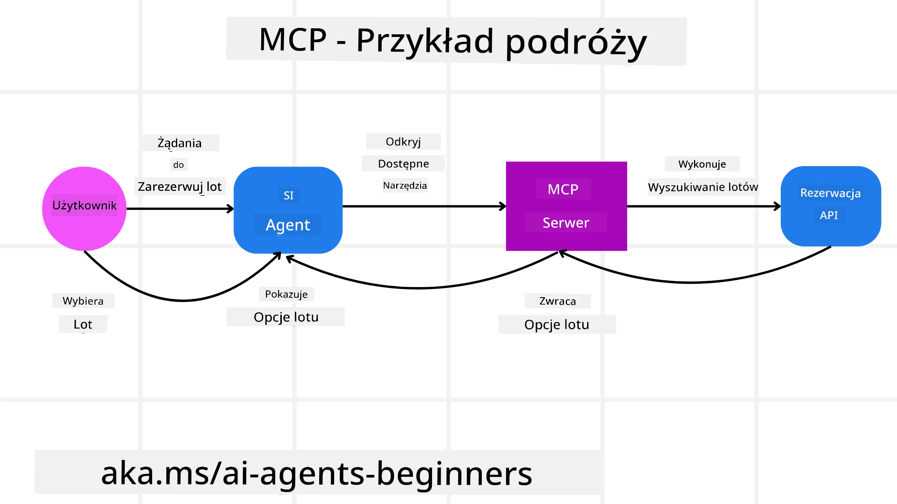
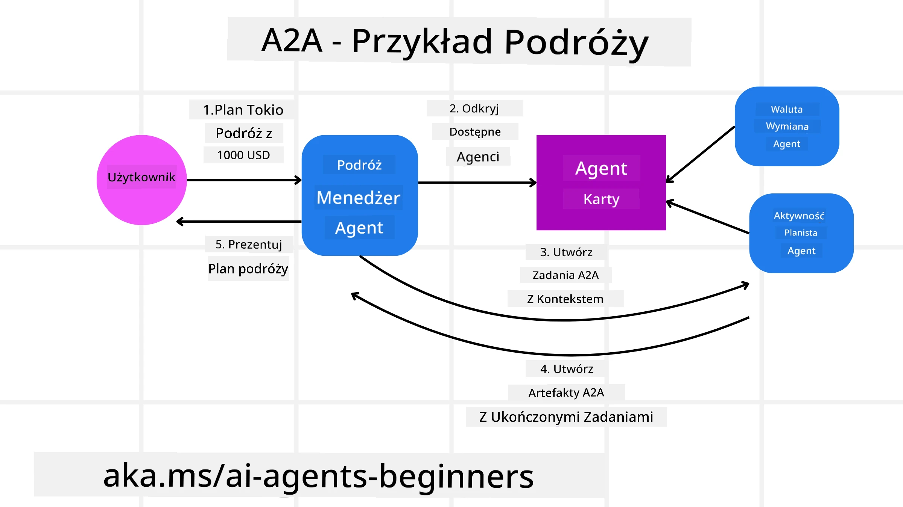
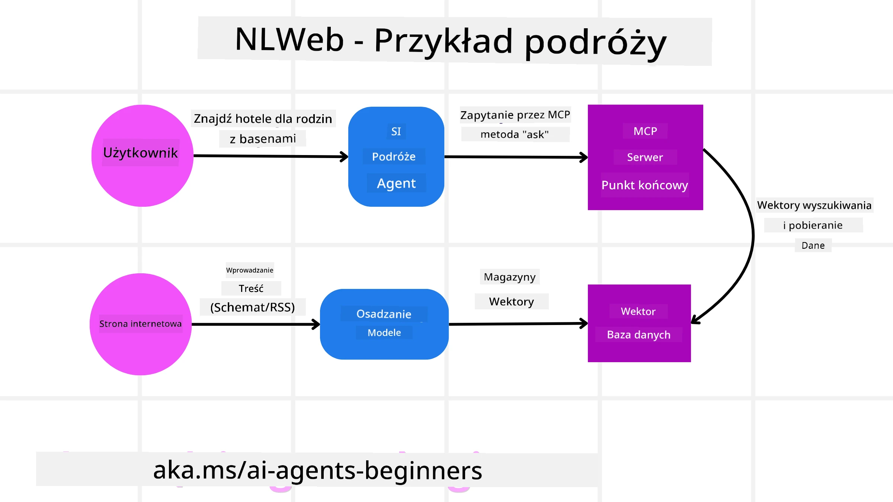

# Korzystanie z Agentycznych Protokółów (MCP, A2A i NLWeb)

> _(Kliknij powyższy obraz, aby obejrzeć wideo z tej lekcji)_

Wraz ze wzrostem wykorzystania agentów AI rośnie także potrzeba protokołów zapewniających standaryzację, bezpieczeństwo i wspierających otwartą innowację. W tej lekcji omówimy 3 protokoły, które mają na celu zaspokojenie tych potrzeb - Model Context Protocol (MCP), Agent to Agent (A2A) oraz Natural Language Web (NLWeb).

## Wprowadzenie

W tej lekcji omówimy:

• Jak **MCP** pozwala agentom AI uzyskiwać dostęp do zewnętrznych narzędzi i danych w celu realizacji zadań użytkownika.

• Jak **A2A** umożliwia komunikację i współpracę między różnymi agentami AI.

• Jak **NLWeb** wprowadza interfejsy w języku naturalnym na dowolnej stronie internetowej, umożliwiając agentom AI odkrywanie i interakcję z jej zawartością.

## Cele nauki

• **Zidentyfikować** podstawowy cel i korzyści MCP, A2A oraz NLWeb w kontekście agentów AI.

• **Wyjaśnić**, w jaki sposób każdy z protokołów ułatwia komunikację i interakcję między LLM, narzędziami i innymi agentami.

• **Rozpoznać** odrębne role, jakie każdy protokół pełni w budowaniu złożonych systemów agentycznych.

## Model Context Protocol

**Model Context Protocol (MCP)** to otwarty standard zapewniający ustandaryzowany sposób, w jaki aplikacje dostarczają kontekst i narzędzia do LLM. Umożliwia to „uniwersalny adapter” do różnych źródeł danych i narzędzi, z których agenci AI mogą korzystać w spójny sposób.

Przyjrzyjmy się komponentom MCP, korzyściom w porównaniu z bezpośrednim korzystaniem z API oraz przykładowi, jak agenci AI mogą korzystać z serwera MCP.

### Podstawowe komponenty MCP

MCP działa na **architekturze klient-serwer**, a podstawowe komponenty to:

• **Hosty** to aplikacje LLM (np. edytor kodu jak VSCode), które inicjują połączenia z serwerem MCP.

• **Klienci** to komponenty w aplikacji hosta utrzymujące połączenia jeden do jednego z serwerami.

• **Serwery** to lekkie programy, które udostępniają określone możliwości.

W skład protokołu wchodzą trzy podstawowe prymitywy, czyli możliwości serwera MCP:

• **Narzędzia**: Są to pojedyncze działania lub funkcje, które agent AI może wywołać, aby wykonać akcję. Na przykład, serwis pogodowy może udostępniać narzędzie „pobierz pogodę”, a serwer e-commerce narzędzie „kup produkt”. Serwery MCP udostępniają nazwy, opisy i schematy wejścia/wyjścia każdego narzędzia w swoim wykazie możliwości.

• **Zasoby**: To dane lub dokumenty tylko do odczytu, które serwer MCP może udostępnić, a klienci mogą je pobierać na żądanie. Przykładami są zawartości plików, rekordy bazy danych lub pliki dziennika. Zasoby mogą być tekstowe (np. kod lub JSON) lub binarne (np. obrazy lub PDF).

• **Podpowiedzi**: Są to predefiniowane szablony dostarczające sugerowane zapytania, pozwalające na bardziej złożone przepływy pracy.

### Korzyści MCP

MCP oferuje znaczne zalety dla agentów AI:

• **Dynamiczne wykrywanie narzędzi**: Agenci mogą dynamicznie otrzymywać listę dostępnych narzędzi z serwera wraz z opisami ich działania. To różni się od tradycyjnych API, które często wymagają statycznego kodowania integracji, a każda zmiana API wymaga aktualizacji kodu. MCP oferuje podejście „zintegrować raz”, co zwiększa elastyczność.

• **Interoperacyjność między LLM**: MCP działa na różnych LLM, dając elastyczność w zamianie modeli bazowych na lepsze pod względem wydajności.

• **Standaryzowane bezpieczeństwo**: MCP zawiera standardową metodę uwierzytelniania, co ułatwia skalowanie podczas dodawania dostępu do kolejnych serwerów MCP. Jest to prostsze niż zarządzanie różnymi kluczami i typami uwierzytelniania dla różnych tradycyjnych API.

### Przykład MCP

Wyobraźmy sobie, że użytkownik chce zarezerwować lot przy pomocy asystenta AI opartego na MCP.

1. **Połączenie**: Asystent AI (klient MCP) łączy się z serwerem MCP udostępnionym przez linię lotniczą.

2. **Wykrywanie narzędzi**: Klient pyta serwer MCP linii lotniczej: „Jakie narzędzia macie dostępne?” Serwer odpowiada narzędziami takimi jak „wyszukaj loty” i „zarezerwuj lot”.

3. **Wywołanie narzędzia**: Następnie użytkownik mówi asystentowi AI: „Proszę wyszukaj lot z Portland do Honolulu.” Asystent AI, używając swojego LLM, identyfikuje, że musi wywołać narzędzie „wyszukaj loty” i przekazuje odpowiednie parametry (miejsce startu, miejsce docelowe) do serwera MCP.

4. **Wykonanie i odpowiedź**: Serwer MCP, działając jako opakowanie, wykonuje faktyczne wywołanie wewnętrznego API rezerwacji linii lotniczej. Następnie otrzymuje informacje o lotach (np. dane JSON) i przesyła je z powrotem do asystenta AI.

5. **Dalsza interakcja**: Asystent AI przedstawia opcje lotów. Po wybraniu lotu asystent może wywołać narzędzie „zarezerwuj lot” na tym samym serwerze MCP, dokańczając rezerwację.

## Protokół Agent-to-Agent (A2A)

Podczas gdy MCP skupia się na łączeniu LLM z narzędziami, protokół **Agent-to-Agent (A2A)** idzie o krok dalej, umożliwiając komunikację i współpracę między różnymi agentami AI. A2A łączy agentów AI z różnych organizacji, środowisk i stosów technologicznych w celu realizacji wspólnego zadania.

Przyjrzymy się komponentom i korzyściom A2A oraz przykładzie jego zastosowania w naszym aplikacji podróżniczej.

### Podstawowe komponenty A2A

A2A skupia się na umożliwieniu komunikacji między agentami oraz ich współpracy przy realizacji podzadania na rzecz użytkownika. Każdy komponent protokołu przyczynia się do tego:

#### Karta Agenta

Podobnie jak serwer MCP udostępnia listę narzędzi, Karta Agenta zawiera:
- Nazwę Agenta.
- **Opis ogólnych zadań**, które realizuje.
- **Listę konkretnych umiejętności** z opisami, które pomagają innym agentom (lub nawet użytkownikom) zrozumieć, kiedy i dlaczego powinni wywołać tego agenta.
- **Aktualny URL Endpointu** agenta.
- **Wersję** i **możliwości** agenta, takie jak odpowiedzi strumieniowe czy powiadomienia push.

#### Wykonawca Agenta

Wykonawca Agenta odpowiada za **przekazywanie kontekstu rozmowy użytkownika do zdalnego agenta**, który potrzebuje tego, by zrozumieć zadanie do wykonania. W serwerze A2A agent używa własnego modelu językowego (LLM) do analizowania przychodzących żądań i realizacji zadań za pomocą swoich wewnętrznych narzędzi.

#### Artefakt

Gdy zdalny agent wykona żądane zadanie, jego efekt pracy tworzy artefakt. Artefakt **zawiera wynik pracy agenta**, **opis wykonanej czynności** oraz **kontekst tekstowy** przesyłany przez protokół. Po wysłaniu artefaktu połączenie ze zdalnym agentem jest zamykane do czasu ponownego wywołania.

#### Kolejka Zdarzeń

Ten komponent służy do **obsługi aktualizacji i przekazywania wiadomości**. Jest szczególnie ważny w produkcyjnym zastosowaniu systemów agentycznych, aby zapobiec zamknięciu połączenia między agentami przed ukończeniem zadania, zwłaszcza gdy realizacja może zająć więcej czasu.

### Korzyści A2A

• **Wzmocniona współpraca**: Umożliwia agentom z różnych dostawców i platform interakcję, dzielenie kontekstem i współpracę, ułatwiając automatyzację między tradycyjnie oddzielonymi systemami.

• **Elastyczny wybór modelu**: Każdy agent A2A może samodzielnie wybierać, który LLM wykorzysta do obsługi żądań, pozwalając na optymalizację lub dostosowanie modeli dla poszczególnych agentów, w przeciwieństwie do pojedynczego połączenia LLM w niektórych scenariuszach MCP.

• **Wbudowane uwierzytelnianie**: Uwierzytelnianie jest zintegrowane bezpośrednio z protokołem A2A, zapewniając solidne ramy bezpieczeństwa dla interakcji agentów.

### Przykład A2A

Rozbudujmy nasz scenariusz rezerwacji podróży, ale tym razem korzystając z A2A.

1. **Żądanie użytkownika do multi-agenta**: Użytkownik rozmawia z agentem-klientem A2A o nazwie „Agent Podróży”, np. mówiąc „Proszę zarezerwuj całą podróż do Honolulu na przyszły tydzień, włącznie z lotami, hotelem i wynajmem samochodu”.

2. **Orkiestracja przez Agenta Podróży**: Agent Podróży otrzymuje to złożone żądanie. Używa swojego LLM do analizy zadania i decyduje, że musi komunikować się z innymi wyspecjalizowanymi agentami.

3. **Komunikacja między agentami**: Agent Podróży używa protokołu A2A, aby połączyć się z agentami wyspecjalizowanymi, np. „Agentem Linii Lotniczych”, „Agentem Hotelowym” i „Agentem Wynajmu Samochodów”, którzy są tworzeni przez różne firmy.

4. **Delegowanie zadań**: Agent Podróży przesyła konkretne zadania do tych specjalistycznych agentów (np. „Znajdź loty do Honolulu”, „Zarezerwuj hotel”, „Wynajmij samochód”). Każdy z nich działa na własnym LLM i korzysta ze swoich narzędzi (mogą to być serwery MCP), wykonując swój fragment rezerwacji.

5. **Zbiorcza odpowiedź**: Po wykonaniu zadań przez poszczególnych agentów Agent Podróży kompiluje wyniki (szczegóły lotów, potwierdzenie hotelu, rezerwację samochodu) i wysyła kompleksową odpowiedź w stylu czatu do użytkownika.

## Natural Language Web (NLWeb)

Strony internetowe od dawna stanowią główny sposób dostępu użytkowników do informacji i danych w Internecie.

Przyjrzyjmy się różnym komponentom NLWeb, korzyściom NLWeb oraz przykładowi działania poprzez naszą aplikację podróżniczą.

### Komponenty NLWeb

- **Aplikacja NLWeb (Kod usługi rdzeniowej)**: System przetwarzający pytania w języku naturalnym. Łączy różne części platformy, aby tworzyć odpowiedzi. Można go traktować jako **silnik napędzający funkcje języka naturalnego** na stronie internetowej.

- **Protokół NLWeb**: To **podstawowy zestaw reguł dla interakcji w języku naturalnym** ze stroną internetową. Odpowiedzi zwracane są w formacie JSON (często używając Schema.org). Celem jest stworzenie prostych podstaw dla „sieci AI”, tak jak HTML umożliwił dzielenie się dokumentami online.

- **Serwer MCP (punkt końcowy Model Context Protocol)**: Każda konfiguracja NLWeb działa także jako **serwer MCP**. Oznacza to, że może **udostępniać narzędzia (takie jak metoda „ask”) i dane** innym systemom AI. W praktyce pozwala to, by zawartość i funkcje strony były dostępne dla agentów AI, umożliwiając stronie stanie się częścią szerokiego „ekosystemu agentów”.

- **Modele osadzania (Embedding Models)**: Modele te służą do **przekształcania zawartości strony w reprezentacje numeryczne zwane wektorami** (embeddingami). Wektory te oddają znaczenie w sposób, który komputery mogą porównywać i przeszukiwać. Są przechowywane w specjalnej bazie danych, a użytkownicy mogą wybrać model embeddingu, którego chcą używać.

- **Baza wektorowa (mechanizm wyszukiwania)**: Ta baza danych **przechowuje embeddingi zawartości strony**. Gdy ktoś zada pytanie, NLWeb przeszukuje bazę wektorową, by szybko znaleźć najbardziej istotne informacje. Zwraca listę możliwych odpowiedzi, uszeregowanych według podobieństwa. NLWeb współpracuje z różnymi systemami przechowywania wektorów, takimi jak Qdrant, Snowflake, Milvus, Azure AI Search i Elasticsearch.

### NLWeb na przykładzie

Weźmy ponownie naszą stronę do rezerwacji podróży, tym razem opartą na NLWeb.

1. **Ingestia danych**: Istniejące katalogi produktów na stronie podróżniczej (np. listy lotów, opisy hoteli, pakiety wycieczek) są formatowane za pomocą Schema.org lub ładowane przez kanały RSS. Narzędzia NLWeb pobierają te strukturyzowane dane, tworzą embeddingi i przechowują je w lokalnej lub zdalnej bazie wektorowej.

2. **Zapytanie w języku naturalnym (od człowieka)**: Użytkownik odwiedza stronę i zamiast przeglądać menu wpisuje w interfejs czatu: „Znajdź mi hotel przyjazny rodzinom w Honolulu z basenem na przyszły tydzień”.

3. **Przetwarzanie w NLWeb**: Aplikacja NLWeb odbiera to zapytanie. Wysyła je do LLM w celu zrozumienia i jednocześnie przeszukuje bazę wektorów dla odpowiednich ofert hotelowych.

4. **Dokładne wyniki**: LLM pomaga interpretować wyniki z bazy danych, identyfikuje najlepsze dopasowania na podstawie kryteriów „przyjazny rodzinom”, „basen”, „Honolulu”, a następnie formatuje odpowiedź w języku naturalnym. Co ważne, odpowiedź odnosi się do faktycznych hoteli z katalogu strony, unikając wymyślonych informacji.

5. **Interakcja agenta AI**: Ponieważ NLWeb działa jako serwer MCP, zewnętrzny agent podróżniczy AI może się również połączyć z instancją NLWeb tej strony. Agent AI może następnie użyć metody `ask` MCP, by bezpośrednio zapytać stronę: `ask("Czy są jakieś restauracje przyjazne weganom w okolicy Honolulu polecane przez hotel?")`. Instancja NLWeb przetworzy to, wykorzystując swoją bazę danych o restauracjach (jeśli jest załadowana) i zwróci ustrukturyzowaną odpowiedź JSON.

### Masz więcej pytań o MCP/A2A/NLWeb?

Dołącz do [Microsoft Foundry Discord](https://aka.ms/ai-agents/discord), aby spotkać innych uczących się, uczestniczyć w godzinach konsultacji i uzyskać odpowiedzi na pytania o agentach AI.

## Zasoby

- [MCP dla początkujących](https://aka.ms/mcp-for-beginners)  
- [Dokumentacja MCP](https://learn.microsoft.com/python/api/overview/azure/ai-projects-readme)
- [Repozytorium NLWeb](https://github.com/nlweb-ai/NLWeb)
- [Microsoft Agent Framework](https://aka.ms/ai-agents-beginners/agent-framewrok)

---

<!-- CO-OP TRANSLATOR DISCLAIMER START -->
**Zastrzeżenie**:  
Niniejszy dokument został przetłumaczony przy użyciu usługi tłumaczenia AI [Co-op Translator](https://github.com/Azure/co-op-translator). Chociaż dokładamy starań, aby zapewnić poprawność, prosimy pamiętać, że automatyczne tłumaczenia mogą zawierać błędy lub nieścisłości. Oryginalny dokument w języku źródłowym powinien być uznawany za wiarygodne źródło. W przypadku istotnych informacji zalecane jest skorzystanie z profesjonalnego tłumaczenia wykonanego przez człowieka. Nie ponosimy odpowiedzialności za jakiekolwiek nieporozumienia lub błędne interpretacje wynikające z użycia tego tłumaczenia.
<!-- CO-OP TRANSLATOR DISCLAIMER END -->