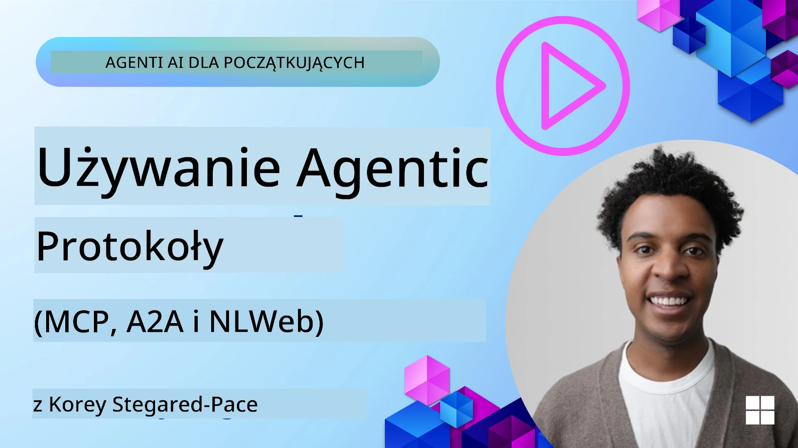
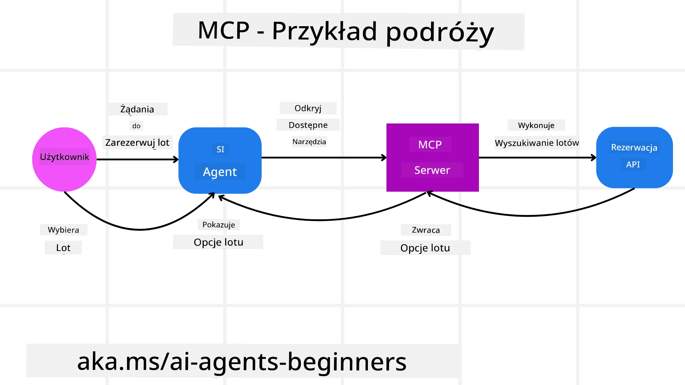
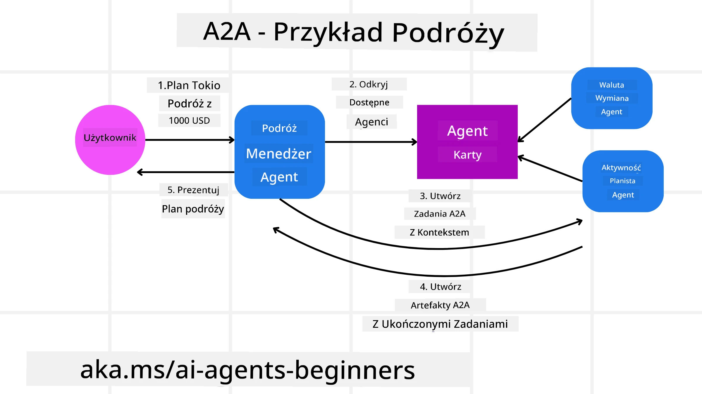
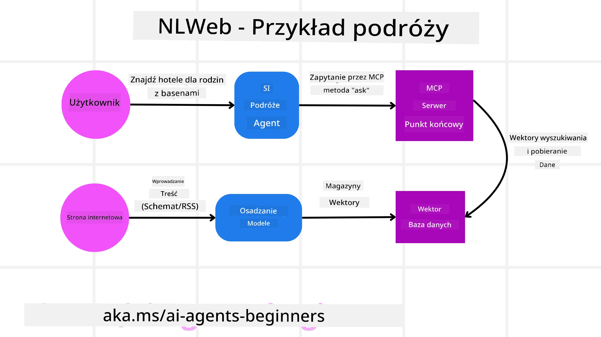

# Używanie protokołów agentowych (MCP, A2A i NLWeb)

> _(Kliknij powyższy obraz, aby obejrzeć wideo z tej lekcji)_

Wraz ze wzrostem wykorzystania agentów AI, rośnie też potrzeba istnienia protokołów zapewniających standaryzację, bezpieczeństwo oraz wspierających otwartą innowację. W tej lekcji omówimy 3 protokoły, które próbują sprostać tym potrzebom - Model Context Protocol (MCP), Agent to Agent (A2A) oraz Natural Language Web (NLWeb).

## Wprowadzenie

W tej lekcji omówimy:

• Jak **MCP** umożliwia agentom AI dostęp do zewnętrznych narzędzi i danych, aby realizować zadania użytkownika.

• Jak **A2A** pozwala na komunikację i współpracę między różnymi agentami AI.

• Jak **NLWeb** wprowadza interfejsy w języku naturalnym do dowolnej witryny, umożliwiając agentom AI odkrywanie i interakcję z jej treścią.

## Cele nauki

• **Identyfikacja** głównego celu i korzyści wynikających z MCP, A2A oraz NLWeb w kontekście agentów AI.

• **Wyjaśnienie** jak każdy protokół ułatwia komunikację i interakcję między LLM, narzędziami i innymi agentami.

• **Rozpoznanie** odmiennych ról, jakie każdy protokół odgrywa w budowaniu złożonych systemów agentowych.

## Model Context Protocol

**Model Context Protocol (MCP)** to otwarty standard, który zapewnia ustandaryzowany sposób dostarczania kontekstu i narzędzi do LLM przez aplikacje. Umożliwia to „uniwersalny adapter” do różnych źródeł danych i narzędzi, do których agenci AI mogą się łączyć w spójny sposób.

Przyjrzyjmy się komponentom MCP, korzyściom w porównaniu do bezpośredniego użycia API oraz przykładowi, jak agenci AI mogą korzystać z serwera MCP.

### Podstawowe komponenty MCP

MCP działa w oparciu o **architekturę klient-serwer**, a główne komponenty to:

• **Hosty** to aplikacje LLM (na przykład edytor kodu jak VSCode), które inicjują połączenia z serwerem MCP.

• **Klienci** to komponenty wewnątrz aplikacji hosta, które utrzymują połączenia jeden do jednego z serwerami.

• **Serwery** to lekkie programy udostępniające określone funkcje.

Protokoł zawiera trzy podstawowe prymitywy będące funkcjami serwera MCP:

• **Narzędzia (Tools)**: To oddzielne akcje lub funkcje, które agent AI może wywołać, by wykonać działanie. Na przykład, serwis pogodowy może udostępniać narzędzie „pobierz pogodę”, a serwer e-commerce narzędzie „kup produkt”. Serwery MCP reklamują nazwę narzędzia, jego opis oraz schemat wejścia/wyjścia w swojej liście funkcji.

• **Zasoby (Resources)**: To dane lub dokumenty tylko do odczytu, które serwer MCP może udostępniać, a klienci mogą je pobierać na żądanie. Przykłady to zawartość plików, rekordy bazy danych lub pliki dzienników. Zasoby mogą być tekstowe (np. kod lub JSON) lub binarne (np. obrazy czy dokumenty PDF).

• **Podpowiedzi (Prompts)**: To predefiniowane szablony, które dostarczają sugerowanych podpowiedzi, umożliwiając bardziej złożone przepływy pracy.

### Korzyści MCP

MCP oferuje znaczące zalety dla agentów AI:

• **Dynamiczne odkrywanie narzędzi**: Agenci mogą dynamicznie otrzymać listę dostępnych narzędzi z serwera wraz z opisami ich funkcji. To kontrastuje z tradycyjnymi API, które często wymagają statycznego kodowania integracji, co oznacza, że każda zmiana API wymaga aktualizacji kodu. MCP oferuje podejście „zintegrować raz”, co prowadzi do większej elastyczności.

• **Interoperacyjność między LLM**: MCP działa między różnymi modelami LLM, dając elastyczność zmiany głównego modelu na inny w celu oceny lepszej wydajności.

• **Ujednolicone bezpieczeństwo**: MCP zawiera standardową metodę uwierzytelniania, poprawiając skalowalność przy dodawaniu dostępu do kolejnych serwerów MCP. To prostsze niż zarządzanie różnymi kluczami i typami uwierzytelniania dla różnych tradycyjnych API.

### Przykład MCP

Wyobraźmy sobie, że użytkownik chce zarezerwować lot używając asystenta AI opartego na MCP.

1. **Połączenie**: Asystent AI (klient MCP) łączy się z serwerem MCP udostępnionym przez linię lotniczą.

2. **Odkrywanie narzędzi**: Klient pyta serwer MCP linii lotniczej „Jakie macie dostępne narzędzia?” Serwer odpowiada narzędziami takimi jak „wyszukaj loty” i „zarezerwuj loty”.

3. **Wywołanie narzędzia**: Następnie użytkownik mówi asystentowi AI „Proszę wyszukaj lot z Portland do Honolulu.” Asystent AI, korzystając ze swojego LLM, identyfikuje potrzebę wywołania narzędzia „wyszukaj loty” i przekazuje odpowiednie parametry (miejsce startu, miejsce docelowe) do serwera MCP.

4. **Wykonanie i odpowiedź**: Serwer MCP, działający jako opakowanie, wykonuje faktyczne wywołanie wewnętrznego API rezerwacji linii lotniczej. Następnie otrzymuje informacje o lotach (np. dane JSON) i przesyła je z powrotem do asystenta AI.

5. **Dalsza interakcja**: Asystent AI przedstawia opcje lotów. Gdy użytkownik wybierze lot, asystent może wywołać na tym samym serwerze MCP narzędzie „zarezerwuj lot”, kończąc rezerwację.

## Protokół Agent-to-Agent (A2A)

Podczas gdy MCP koncentruje się na łączeniu LLM z narzędziami, protokół **Agent-to-Agent (A2A)** idzie o krok dalej, umożliwiając komunikację i współpracę między różnymi agentami AI. A2A łączy agentów AI z różnych organizacji, środowisk i stosów technologicznych, realizując wspólne zadanie.

Przyjrzymy się komponentom i korzyściom A2A oraz przykładzie zastosowania w naszej aplikacji do podróży.

### Podstawowe komponenty A2A

A2A skupia się na umożliwieniu komunikacji między agentami i współpracę przy wykonaniu podzadania użytkownika. Każdy element protokołu przyczynia się do tego:

#### Karta Agenta (Agent Card)

Podobnie jak serwer MCP udostępnia listę narzędzi, Karta Agenta zawiera:
- Nazwę Agenta.
- **opis ogólnych zadań**, które agent realizuje.
- **listę konkretnych umiejętności** z opisami, które pomagają innym agentom (a nawet użytkownikom) zrozumieć, kiedy i dlaczego chcieliby wywołać tego agenta.
- **obecny URL endpointu** agenta.
- **wersję** i **możliwości** agenta, takie jak strumieniowanie odpowiedzi i powiadomienia push.

#### Wykonawca Agenta (Agent Executor)

Wykonawca Agenta jest odpowiedzialny za **przekazanie kontekstu rozmowy użytkownika do zdalnego agenta**, który potrzebuje tego, aby zrozumieć zadanie do wykonania. W serwerze A2A agent używa własnego dużego modelu językowego (LLM) do analizowania przychodzących żądań i realizacji zadań za pomocą własnych narzędzi.

#### Artefakt

Gdy zdalny agent zakończy zadanie, jego produkt pracy tworzy artefakt. Artefakt **zawiera wynik pracy agenta**, **opis tego, co zostało wykonane** oraz **kontekst tekstowy przesyłany przez protokół**. Po przesłaniu artefaktu połączenie ze zdalnym agentem jest zamknięte do czasu, gdy będzie znów potrzebne.

#### Kolejka zdarzeń (Event Queue)

Ten komponent służy do **obsługi aktualizacji i przekazywania wiadomości**. Ma szczególne znaczenie w produkcyjnym środowisku systemów agentowych, by zapobiec zamknięciu połączenia między agentami przed ukończeniem zadania, zwłaszcza gdy czas realizacji zadania jest długi.

### Korzyści A2A

• **Ulepszona współpraca**: Umożliwia agentom z różnych dostawców i platform interakcję, dzielenie się kontekstem i współpracę, wspierając płynną automatyzację w tradycyjnie rozłączonych systemach.

• **Elastyczność wyboru modelu**: Każdy agent A2A sam decyduje, którego LLM użyje do realizacji swoich żądań, umożliwiając optymalizację lub dostrajanie modeli dla każdego agenta, w przeciwieństwie do pojedynczego połączenia LLM w niektórych scenariuszach MCP.

• **Wbudowane uwierzytelnianie**: Uwierzytelnianie jest zintegrowane bezpośrednio z protokołem A2A, zapewniając solidne ramy bezpieczeństwa dla interakcji agentów.

### Przykład A2A

Rozwińmy nasz scenariusz rezerwacji podróży, tym razem używając A2A.

1. **Żądanie użytkownika do multi-agenta**: Użytkownik rozmawia z agentem/klientem A2A „Agent Podróży”, być może mówiąc: „Proszę zarezerwuj całą podróż do Honolulu na przyszły tydzień, włączając loty, hotel i samochód do wynajęcia”.

2. **Orkiestracja przez Agenta Podróży**: Agent Podróży otrzymuje to złożone żądanie. Używa swojego LLM, aby rozważyć zadanie i ustalić, że potrzebuje skomunikować się z innymi agentami specjalistycznymi.

3. **Komunikacja między agentami**: Agent Podróży używa protokołu A2A, łącząc się z agentami podrzędnymi, takimi jak „Agent Linii Lotniczej”, „Agent Hotelu” i „Agent Wynajmu Samochodów”, którzy są tworzeni przez różne firmy.

4. **Delegowanie wykonania zadań**: Agent Podróży przesyła konkretne zadania tym specjalistycznym agentom (np. „Znajdź loty do Honolulu”, „Zarezerwuj hotel”, „Wynajmij samochód”). Każdy z tych agentów działa na własnym LLM i korzysta z własnych narzędzi (które mogą być również serwerami MCP), wykonując swoją część rezerwacji.

5. **Zgromadzona odpowiedź**: Gdy wszyscy agenci podrzędni zakończą zadania, Agent Podróży kompiluje wyniki (szczegóły lotu, potwierdzenie hotelu, rezerwację samochodu) i przesyła obszerne odpowiedzi w stylu czatu do użytkownika.

## Natural Language Web (NLWeb)

Strony internetowe od dawna są podstawowym sposobem dostępu użytkowników do informacji i danych w internecie.

Przyjrzyjmy się różnym komponentom NLWeb, korzyściom NLWeb oraz przykładzie działania naszego NLWeb na przykładzie aplikacji podróżniczej.

### Elementy składowe NLWeb

- **Aplikacja NLWeb (kod usługi podstawowej)**: System przetwarzający pytania w języku naturalnym. Łączy różne części platformy, aby tworzyć odpowiedzi. Można ją uznać za **silnik napędzający funkcje języka naturalnego na stronie**.

- **Protokół NLWeb**: To **podstawowy zestaw reguł interakcji w języku naturalnym** ze stroną internetową. Zwraca odpowiedzi w formacie JSON (często używając Schema.org). Ma na celu stworzenie prostych podstaw dla „Internetu AI”, tak jak HTML umożliwił udostępnianie dokumentów online.

- **Serwer MCP (endpoint Model Context Protocol)**: Każda konfiguracja NLWeb działa także jako **serwer MCP**. Oznacza to, że może **udostępniać narzędzia (jak metoda „ask”) oraz dane** innym systemom AI. W praktyce powoduje to, że zawartość i funkcje strony są dostępne dla agentów AI, pozwalając stronie stać się częścią szerszego „ekosystemu agentów”.

- **Modele embeddingowe**: Modele te służą do **konwersji zawartości strony na reprezentacje numeryczne zwane wektorami** (embeddingami). Wektory te uchwytują znaczenie w sposób umożliwiający komputerom porównywanie i wyszukiwanie. Są przechowywane w specjalnej bazie danych, użytkownicy mogą wybierać, którego modelu embeddingowego chcą użyć.

- **Baza wektorowa (mechanizm wyszukiwania)**: Ta baza **przechowuje embeddingi zawartości strony**. Gdy ktoś zada pytanie, NLWeb przeszukuje bazę wektorów, aby szybko znaleźć najbardziej odpowiednie informacje. Dostarcza szybką listę możliwych odpowiedzi, uszeregowanych według podobieństwa. NLWeb współpracuje z różnymi systemami przechowywania wektorów, takimi jak Qdrant, Snowflake, Milvus, Azure AI Search czy Elasticsearch.

### Przykład działania NLWeb

Weźmy ponownie naszą stronę do rezerwacji podróży, tym razem napędzaną przez NLWeb.

1. **Zasilanie danymi**: Istniejące katalogi produktów strony podróżniczej (np. listy lotów, opisy hoteli, pakiety wycieczek) są formatowane przy użyciu Schema.org lub ładowane przez kanały RSS. Narzędzia NLWeb pobierają te strukturalne dane, tworzą embeddingi i przechowują je w lokalnej lub zdalnej bazie wektorowej.

2. **Zapytanie w języku naturalnym (człowiek)**: Użytkownik odwiedza stronę i zamiast nawigować po menu, wpisuje w interfejsie czatu: „Znajdź dla mnie hotel przyjazny rodzinom w Honolulu z basenem na przyszły tydzień”.

3. **Przetwarzanie NLWeb**: Aplikacja NLWeb odbiera to zapytanie. Wysyła je do LLM w celu zrozumienia oraz jednocześnie przeszukuje swoją bazę wektorową pod kątem odpowiednich ofert hotelowych.

4. **Dokładne wyniki**: LLM pomaga interpretować wyniki wyszukiwania w bazie danych, identyfikować najlepsze dopasowania na podstawie kryteriów „przyjazny rodzinom”, „basen” i „Honolulu”, następnie formatuje odpowiedź w języku naturalnym. Co ważne, odpowiedź odnosi się do faktycznych hoteli z katalogu strony, unikając wymyślonych informacji.

5. **Interakcja z agentem AI**: Ponieważ NLWeb działa jako serwer MCP, zewnętrzny agent AI ds. podróży może również połączyć się z instancją NLWeb tej strony. Agent AI może wtedy użyć metody `ask` MCP, aby zapytać stronę bezpośrednio: `ask("Czy w okolicy Honolulu są polecane przez hotel restauracje wegańskie?")`. Instancja NLWeb przetworzy to, wykorzystując swoją bazę informacji o restauracjach (jeśli została załadowana) i zwróci ustrukturyzowaną odpowiedź w formacie JSON.

### Masz więcej pytań o MCP/A2A/NLWeb?

Dołącz do [Microsoft Foundry Discord](https://discord.com/invite/ATgtXmAS5D), aby spotkać innych uczących się, uczestniczyć w godzinach konsultacji i uzyskać odpowiedzi na swoje pytania o agentach AI.

## Zasoby

- [MCP dla początkujących](https://aka.ms/mcp-for-beginners)  
- [Dokumentacja MCP](https://learn.microsoft.com/python/api/overview/azure/ai-projects-readme)
- [Repozytorium NLWeb](https://github.com/nlweb-ai/NLWeb)
- [Microsoft Agent Framework](https://learn.microsoft.com/en-us/agent-framework/overview/?wt.mc_id=youtube_26688_organicsocial_reactor&pivots=programming-language-python)

## Poprzednia lekcja

[Agenci AI w produkcji](../10-ai-agents-production/README.md)

## Następna lekcja

[Inżynieria kontekstu dla agentów AI](../12-context-engineering/README.md)

---

<!-- CO-OP TRANSLATOR DISCLAIMER START -->
**Zastrzeżenie**:
Niniejszy dokument został przetłumaczony za pomocą usługi tłumaczenia AI [Co-op Translator](https://github.com/Azure/co-op-translator). Choć dążymy do dokładności, prosimy pamiętać, że automatyczne tłumaczenia mogą zawierać błędy lub niedokładności. Oryginalny dokument w jego języku źródłowym należy uznawać za autorytatywne źródło. W przypadku informacji krytycznych zalecane jest skorzystanie z profesjonalnego tłumaczenia wykonanego przez człowieka. Nie ponosimy odpowiedzialności za jakiekolwiek nieporozumienia lub błędne interpretacje wynikające z użycia tego tłumaczenia.
<!-- CO-OP TRANSLATOR DISCLAIMER END -->