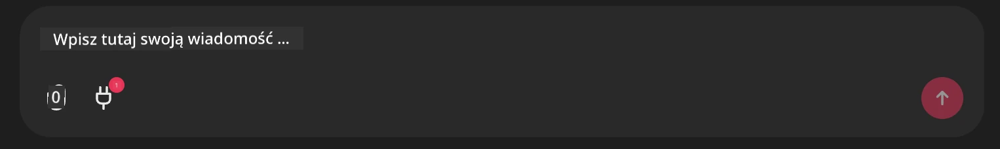

# Przykład serwera Github MCP

## Opis

To była prezentacja stworzona na AI Agents Hackathon organizowany przez Microsoft Reactor.

Narzędzie służy do rekomendowania projektów hackathonowych na podstawie repozytoriów użytkownika na Github.
Odbywa się to przez:

1. **Github Agent** - Korzystając z serwera Github MCP, pobiera repozytoria i informacje o tych repozytoriach.
2. **Hackathon Agent** - Bierze dane od Github Agenta i wymyśla kreatywne pomysły na projekty hackathonowe oparte na projektach, językach używanych przez użytkownika oraz ścieżkach projektów dla AI Agents hackathon.
3. **Events Agent** - Na podstawie sugestii Hackathon Agenta, Events Agent rekomenduje odpowiednie wydarzenia z serii AI Agent Hackathon.

## Uruchamianie kodu 

### Zmienne środowiskowe

Ta prezentacja używa Microsoft Agent Framework, Azure OpenAI Service, serwera Github MCP oraz Azure AI Search.

Upewnij się, że masz odpowiednio ustawione zmienne środowiskowe do korzystania z tych narzędzi:

```python
AZURE_AI_PROJECT_ENDPOINT=""
AZURE_AI_MODEL_DEPLOYMENT_NAME=""
AZURE_SEARCH_SERVICE_ENDPOINT=""
AZURE_SEARCH_API_KEY=""
``` 


## Uruchamianie serwera Chainlit

Aby połączyć się z serwerem MCP, ta prezentacja używa Chainlit jako interfejsu czatu.

Aby uruchomić serwer, użyj następującego polecenia w terminalu:

```bash
chainlit run app.py -w
```


To powinno uruchomić twój serwer Chainlit na `localhost:8000` oraz załadować indeks wyszukiwania Azure AI Search zawierający zawartość `event-descriptions.md`.

## Łączenie z serwerem MCP

Aby połączyć się z serwerem Github MCP, wybierz ikonę "wtyczki" pod polem czatu "Type your message here..":



Następnie możesz kliknąć "Connect an MCP", aby dodać polecenie łączenia się z serwerem Github MCP:

```bash
npx -y @modelcontextprotocol/server-github --env GITHUB_PERSONAL_ACCESS_TOKEN=[YOUR PERSONAL ACCESS TOKEN]
```


Zamień "[YOUR PERSONAL ACCESS TOKEN]" na swój rzeczywisty Token Dostępu Osobistego.

Po połączeniu, obok ikony wtyczki powinien pojawić się (1), co potwierdza połączenie. Jeśli nie, spróbuj ponownie uruchomić serwer chainlit poleceniem `chainlit run app.py -w`.

## Korzystanie z prezentacji

Aby rozpocząć działanie agenta rekomendującego projekty hackathonowe, możesz wpisać wiadomość taką jak:

"Recommend hackathon projects for the Github user koreyspace"

Router Agent przeanalizuje twoje zapytanie i zdecyduje, która kombinacja agentów (GitHub, Hackathon i Events) najlepiej obsłuży twoje żądanie. Agenci współpracują, aby dostarczyć kompleksowe rekomendacje oparte na analizie repozytoriów Github, tworzeniu pomysłów na projekty oraz odpowiednich wydarzeniach technologicznych.

---

<!-- CO-OP TRANSLATOR DISCLAIMER START -->
**Zastrzeżenie**:  
Dokument ten został przetłumaczony przy użyciu usługi tłumaczenia AI [Co-op Translator](https://github.com/Azure/co-op-translator). Mimo że dążymy do dokładności, proszę mieć na uwadze, że automatyczne tłumaczenia mogą zawierać błędy lub nieścisłości. Oryginalny dokument w jego języku pierwotnym należy uważać za źródło wiarygodne. W przypadku informacji krytycznych zalecane jest skorzystanie z profesjonalnego tłumaczenia wykonanego przez człowieka. Nie ponosimy odpowiedzialności za jakiekolwiek nieporozumienia lub błędne interpretacje wynikające z użycia tego tłumaczenia.
<!-- CO-OP TRANSLATOR DISCLAIMER END -->