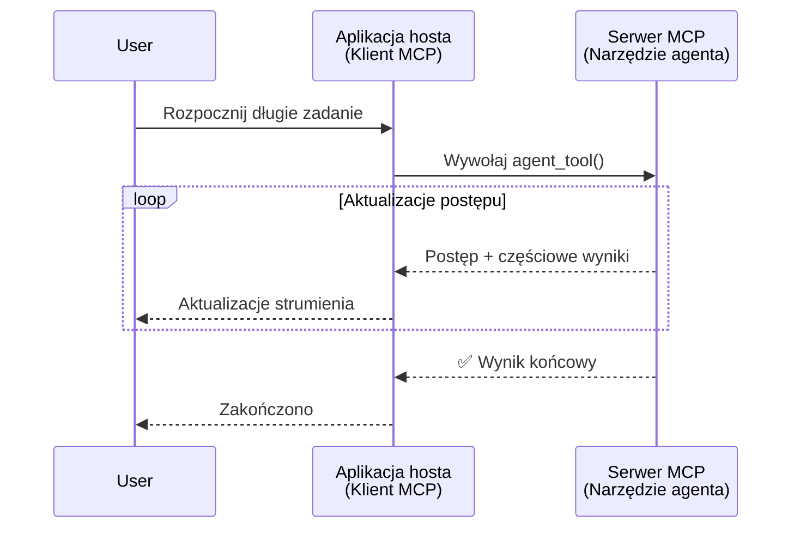
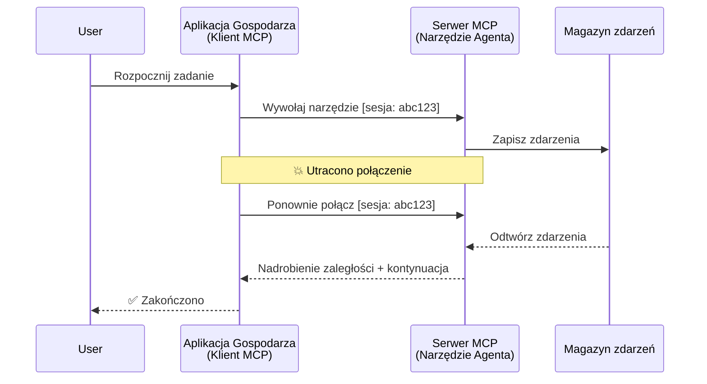
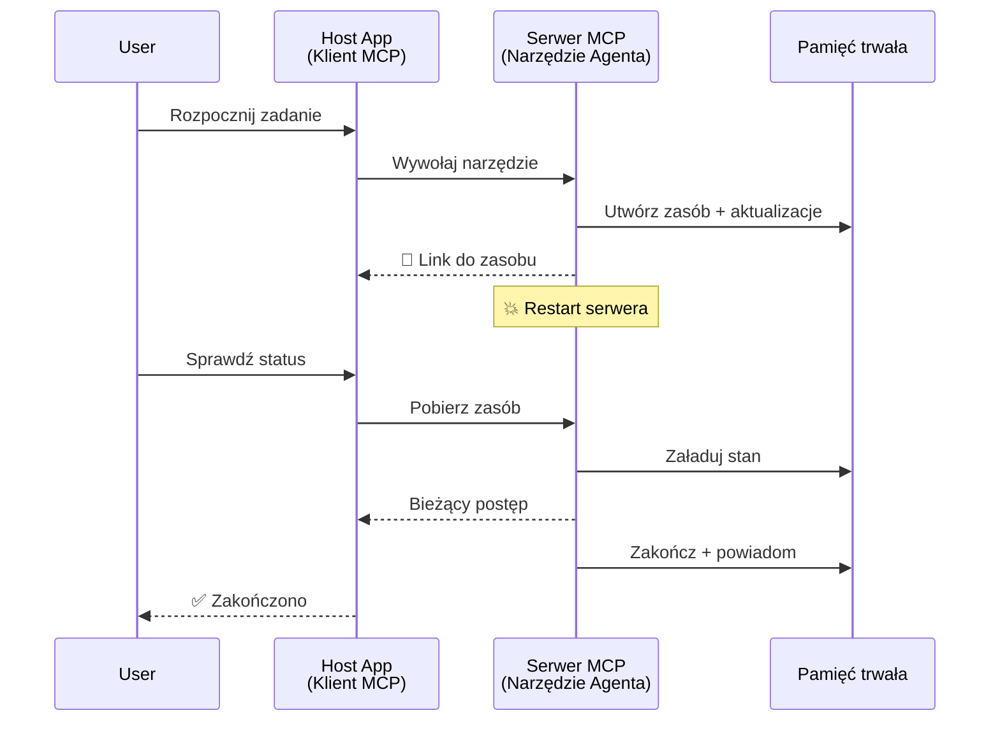
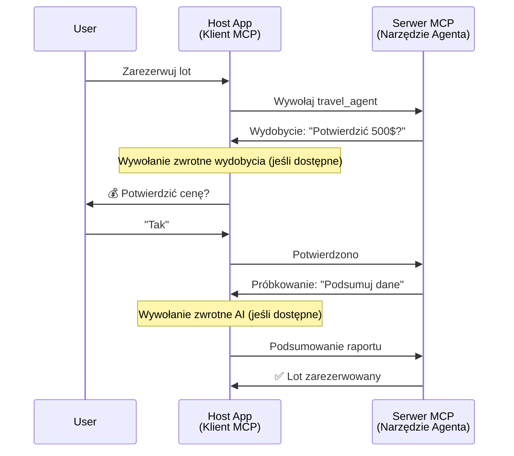
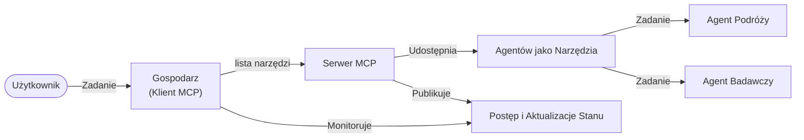

# Budowanie systemów komunikacji agent-agent z MCP

> TL;DR - Czy można zbudować komunikację Agent2Agent na MCP? Tak!

MCP znacznie rozwinął się poza swój pierwotny cel „dostarczania kontekstu dla LLM”. Dzięki niedawnym ulepszeniom, takim jak [wznowione strumienie](https://modelcontextprotocol.io/docs/concepts/transports#resumability-and-redelivery), [elicytacja](https://modelcontextprotocol.io/specification/2025-06-18/client/elicitation), [sampling](https://modelcontextprotocol.io/specification/2025-06-18/client/sampling) oraz powiadomienia ([postęp](https://modelcontextprotocol.io/specification/2025-06-18/basic/utilities/progress) i [zasoby](https://modelcontextprotocol.io/specification/2025-06-18/schema#resourceupdatednotification)), MCP zapewnia teraz solidne fundamenty do budowy złożonych systemów komunikacji agent-agent.

## Błędne przekonanie o agencie/narzędziu

W miarę jak coraz więcej deweloperów bada narzędzia o agentowych zachowaniach (działające przez długi czas, mogące wymagać dodatkowych danych w trakcie działania itp.), powszechne jest nieporozumienie, że MCP jest nieodpowiedni, głównie dlatego, że wczesne przykłady narzędzi MCP skupiały się na prostych wzorcach żądanie-odpowiedź.

To postrzeganie jest przestarzałe. Specyfikacja MCP została znacznie rozbudowana w ciągu ostatnich kilku miesięcy o możliwości, które wypełniają lukę w budowaniu długotrwałych agentowych zachowań:

- **Strumieniowanie i wyniki częściowe**: aktualizacje postępu w czasie rzeczywistym podczas wykonania
- **Wznowienie**: klienci mogą ponownie się połączyć i kontynuować po rozłączeniu
- **Trwałość**: wyniki przetrwają restart serwera (np. za pomocą linków do zasobów)
- **Multi-turn**: interaktywne dane wejściowe w trakcie działania za pomocą elicytacji i samplingu

Te funkcje można łączyć, aby umożliwić złożone aplikacje agentowe i wieloagentowe, wszystkie wdrożone na protokole MCP.

Dla odniesienia, będziemy odnosić się do agenta jako „narzędzia” dostępnego na serwerze MCP. Oznacza to istnienie aplikacji hosta implementującej klienta MCP, który ustanawia sesję z serwerem MCP i może wywoływać agenta.

## Co sprawia, że narzędzie MCP jest „agentowe”?

Zanim przejdziemy do implementacji, ustalmy, jakie możliwości infrastruktury są potrzebne do obsługi długotrwałych agentów.

> Zdefiniujemy agenta jako byt, który może działać autonomicznie przez dłuższy czas, zdolny do realizacji złożonych zadań wymagających wielu interakcji lub dostosowań opartych na informacji zwrotnej w czasie rzeczywistym.

### 1. Strumieniowanie i wyniki częściowe

Tradycyjne wzorce żądanie-odpowiedź nie sprawdzają się przy długotrwałych zadaniach. Agenci muszą dostarczać:

- Aktualizacje postępu w czasie rzeczywistym
- Wyniki pośrednie

**Wsparcie MCP**: Powiadomienia o aktualizacji zasobów umożliwiają strumieniowanie wyników częściowych, choć wymaga to starannego projektu, aby uniknąć konfliktów z modelem 1:1 żądanie/odpowiedź JSON-RPC.

| Funkcja                    | Przypadek użycia                                                                                                                                                    | Wsparcie MCP                                                                              |
| -------------------------- | ----------------------------------------------------------------------------------------------------------------------------------------------------------------- | ------------------------------------------------------------------------------------------ |
| Aktualizacje postępu na żywo | Użytkownik zamawia zadanie migracji bazy kodu. Agent strumieniuje postęp: „10% - Analiza zależności... 25% - Konwersja plików TypeScript... 50% - Aktualizacja importów...” | ✅ Powiadomienia o postępie                                                                 |
| Wyniki częściowe            | Zadanie „Wygeneruj książkę” strumieniuje wyniki pośrednie, np. 1) Konspekt fabuły, 2) Lista rozdziałów, 3) Każdy rozdział po ukończeniu. Host może w każdym momencie sprawdzić, anulować lub przekierować. | ✅ Powiadomienia mogą być „rozszerzone” o wyniki częściowe, zobacz propozycje w PR 383, 776    |

<div align="center" style="font-style: italic; font-size: 0.95em; margin-bottom: 0.5em;">
<strong>Rysunek 1:</strong> Ten diagram ilustruje, jak agent MCP strumieniuje aktualizacje postępu i wyniki częściowe do aplikacji hosta podczas długotrwałego zadania, umożliwiając użytkownikowi monitorowanie wykonania na żywo.
</div>



### 2. Wznowienie

Agenci muszą radzić sobie łagodnie z przerwami sieciowymi:

- Połączenie po rozłączeniu (klient)
- Kontynuacja od miejsca przerwania (ponowne dostarczenie wiadomości)

**Wsparcie MCP**: Transport StreamableHTTP MCP obecnie obsługuje wznowienie sesji i ponowne dostarczenie wiadomości za pomocą ID sesji i ostatnich ID zdarzeń. Ważną uwagą jest, że serwer musi implementować EventStore, który umożliwia odtwarzanie zdarzeń przy ponownym połączeniu klienta.  
Zauważ, że jest propozycja społecznościowa (PR #975) badająca transportowo-neutralne wznowione strumienie.

| Funkcja       | Przypadek użycia                                                                                                                                          | Wsparcie MCP                                                                |
| ------------- | --------------------------------------------------------------------------------------------------------------------------------------------------------- | -------------------------------------------------------------------------- |
| Wznowienie    | Klient rozłącza się podczas długotrwałego zadania. Po ponownym połączeniu sesja jest wznawiana, odtwarzane są pominięte zdarzenia, kontynuując bez utraty postępu. | ✅ Transport StreamableHTTP z ID sesji, odtwarzaniem zdarzeń i EventStore   |

<div align="center" style="font-style: italic; font-size: 0.95em; margin-bottom: 0.5em;">
<strong>Rysunek 2:</strong> Ten diagram pokazuje, jak transport StreamableHTTP MCP i magazyn zdarzeń umożliwiają bezproblemowe wznowienie sesji: jeśli klient się rozłączy, może się ponownie połączyć i odtworzyć pominięte zdarzenia, kontynuując zadanie bez utraty postępu.
</div>



### 3. Trwałość

Długotrwale działający agenci potrzebują trwałego stanu:

- Wyniki przetrwają restarty serwera
- Status można uzyskać poza kanałem głównym
- Śledzenie postępu między sesjami

**Wsparcie MCP**: MCP obsługuje teraz typ zwracany linku do zasobu dla wywołań narzędzi. Obecnie popularnym wzorcem jest zaprojektowanie narzędzia, które tworzy zasób i natychmiast zwraca link do zasobu. Narzędzie może kontynuować zadanie w tle i aktualizować zasób. Klient z kolei może wybierać, czy sondować stan zasobu, aby uzyskać wyniki częściowe lub pełne (w oparciu o aktualizacje zasobów dostarczane przez serwer) lub subskrybować zasób dla powiadomień o aktualizacjach.

Jednym z ograniczeń jest to, że sondowanie zasobów lub subskrybowanie aktualizacji może konsumować zasoby, co ma skutki skali. Jest otwarta propozycja społecznościowa (w tym #992) badająca możliwość uwzględnienia webhooków lub wyzwalaczy, które serwer mógłby wywołać, aby powiadomić klienta/aplikację hosta o aktualizacjach.

| Funkcja    | Przypadek użycia                                                                                                                                        | Wsparcie MCP                                                        |
| ---------- | ------------------------------------------------------------------------------------------------------------------------------------------------------- | ------------------------------------------------------------------ |
| Trwałość   | Serwer ulega awarii podczas zadania migracji danych. Wyniki i postęp przetrwają restart, klient może sprawdzić status i kontynuować z trwałego zasobu.  | ✅ Linki do zasobów z trwałą pamięcią i powiadomieniami o statusie  |

Obecnie powszechnym wzorcem jest projektowanie narzędzia, które tworzy zasób i natychmiast zwraca link do zasobu. Narzędzie w tle realizuje zadanie, wysyła powiadomienia o zasobie służące jako aktualizacje postępu lub zawierające wyniki częściowe oraz aktualizuje zawartość zasobu według potrzeb.

<div align="center" style="font-style: italic; font-size: 0.95em; margin-bottom: 0.5em;">
<strong>Rysunek 3:</strong> Ten diagram pokazuje, jak agenci MCP wykorzystują trwałe zasoby i powiadomienia o statusie, aby zapewnić przetrwanie długotrwałych zadań podczas restartów serwera, umożliwiając klientom sprawdzanie postępu i pobieranie wyników nawet po awariach.
</div>



### 4. Interakcje wieloetapowe

Agenci często potrzebują dodatkowego wprowadzenia w trakcie działania:

- Wyjaśnienia lub zatwierdzenia od człowieka
- Pomoc AI przy złożonych decyzjach
- Dynamiczne dostosowywanie parametrów

**Wsparcie MCP**: Pełne wsparcie za pomocą sampling (dla wejścia AI) i elicytacji (dla wejścia ludzkiego).

| Funkcja                    | Przypadek użycia                                                                                                                                | Wsparcie MCP                                         |
| -------------------------- | ----------------------------------------------------------------------------------------------------------------------------------------------- | ----------------------------------------------------- |
| Interakcje wieloetapowe    | Agent rezerwacji podróży prosi użytkownika o potwierdzenie ceny, następnie pyta AI o podsumowanie danych podróży przed finalizacją rezerwacji.   | ✅ Elicitation dla wejścia ludzkiego, sampling dla AI |

<div align="center" style="font-style: italic; font-size: 0.95em; margin-bottom: 0.5em;">
<strong>Rysunek 4:</strong> Ten diagram przedstawia, jak agenci MCP mogą interaktywnie elicytować dane od ludzi lub prosić AI o pomoc w trakcie działania, wspierając złożone, wieloetapowe procesy, takie jak potwierdzenia i podejmowanie dynamicznych decyzji.
</div>



## Implementacja długotrwałych agentów na MCP - przegląd kodu

W ramach tego artykułu udostępniamy [repozytorium kodu](https://github.com/victordibia/ai-tutorials/tree/main/MCP%20Agents), zawierające kompletną implementację długotrwałych agentów wykorzystujących MCP Python SDK z transportem StreamableHTTP dla wznowienia sesji i ponownego dostarczenia wiadomości. Implementacja demonstruje, jak możliwości MCP można łączyć, aby umożliwić zaawansowane zachowania agentowe.

Konkretnie wdrażamy serwer z dwoma głównymi narzędziami agentowymi:

- **Agent podróży** - symuluje usługę rezerwacji podróży z potwierdzeniem ceny przez elicytację
- **Agent badawczy** - wykonuje zadania badawcze z podsumowaniami wspieranymi przez AI przez sampling

Obaj agenci demonstrują aktualizacje postępu w czasie rzeczywistym, interaktywne potwierdzenia oraz pełne możliwości wznowienia sesji.

### Kluczowe koncepcje implementacji

Poniższe sekcje pokazują implementację agentów po stronie serwera oraz obsługę strony klienta:

#### Strumieniowanie i aktualizacje postępu - status zadania na żywo

Strumieniowanie umożliwia agentom dostarczanie aktualizacji postępu w czasie rzeczywistym podczas długotrwałych zadań, informując użytkowników o statusie i wynikach pośrednich zadania.

**Implementacja serwera (agent wysyła powiadomienia o postępie):**

```python
# Z serwera/server.py - Agent podróży wysyłający aktualizacje postępu
for i, step in enumerate(steps):
    await ctx.session.send_progress_notification(
        progress_token=ctx.request_id,
        progress=i * 25,
        total=100,
        message=step,
        related_request_id=str(ctx.request_id)
    )
    await anyio.sleep(2)  # Symuluj pracę

# Alternatywnie: Loguj wiadomości dla szczegółowych aktualizacji krok po kroku
await ctx.session.send_log_message(
    level="info",
    data=f"Processing step {current_step}/{steps} ({progress_percent}%)",
    logger="long_running_agent",
    related_request_id=ctx.request_id,
)
```

**Implementacja klienta (host odbiera aktualizacje postępu):**

```python
# Z client/client.py - Klient obsługujący powiadomienia w czasie rzeczywistym
async def message_handler(message) -> None:
    if isinstance(message, types.ServerNotification):
        if isinstance(message.root, types.LoggingMessageNotification):
            console.print(f"📡 [dim]{message.root.params.data}[/dim]")
        elif isinstance(message.root, types.ProgressNotification):
            progress = message.root.params
            console.print(f"🔄 [yellow]{progress.message} ({progress.progress}/{progress.total})[/yellow]")

# Rejestruj obsługę wiadomości podczas tworzenia sesji
async with ClientSession(
    read_stream, write_stream,
    message_handler=message_handler
) as session:
```

#### Elicitation - żądanie danych od użytkownika

Elicitation umożliwia agentom żądanie wprowadzenia danych od użytkownika w trakcie działania. Jest to niezbędne dla potwierdzeń, wyjaśnień lub zatwierdzeń podczas długotrwałych zadań.

**Implementacja serwera (agent żąda potwierdzenia):**

```python
# Z serwera/server.py - Agent podróży prosi o potwierdzenie ceny
elicit_result = await ctx.session.elicit(
    message=f"Please confirm the estimated price of $1200 for your trip to {destination}",
    requestedSchema=PriceConfirmationSchema.model_json_schema(),
    related_request_id=ctx.request_id,
)

if elicit_result and elicit_result.action == "accept":
    # Kontynuuj rezerwację
    logger.info(f"User confirmed price: {elicit_result.content}")
elif elicit_result and elicit_result.action == "decline":
    # Anuluj rezerwację
    booking_cancelled = True
```

**Implementacja klienta (host dostarcza callback elicytacji):**

```python
# Z pliku client/client.py - Obsługa klienta dla żądań elicytacji
async def elicitation_callback(context, params):
    console.print(f"💬 Server is asking for confirmation:")
    console.print(f"   {params.message}")

    response = console.input("Do you accept? (y/n): ").strip().lower()

    if response in ['y', 'yes']:
        return types.ElicitResult(
            action="accept",
            content={"confirm": True, "notes": "Confirmed by user"}
        )
    else:
        return types.ElicitResult(
            action="decline",
            content={"confirm": False, "notes": "Declined by user"}
        )

# Zarejestruj wywołanie zwrotne podczas tworzenia sesji
async with ClientSession(
    read_stream, write_stream,
    elicitation_callback=elicitation_callback
) as session:
```

#### Sampling - żądanie pomocy AI

Sampling pozwala agentom na żądanie wsparcia LLM podczas wykonywania zadań złożonych decyzji lub generowania treści. Umożliwia to hybrydowe przepływy pracy człowiek-AI.

**Implementacja serwera (agent żąda pomocy AI):**

```python
# Z pliku server/server.py - Agent badawczy żądający podsumowania AI
sampling_result = await ctx.session.create_message(
    messages=[
        SamplingMessage(
            role="user",
            content=TextContent(type="text", text=f"Please summarize the key findings for research on: {topic}")
        )
    ],
    max_tokens=100,
    related_request_id=ctx.request_id,
)

if sampling_result and sampling_result.content:
    if sampling_result.content.type == "text":
        sampling_summary = sampling_result.content.text
        logger.info(f"Received sampling summary: {sampling_summary}")
```

**Implementacja klienta (host dostarcza callback samplingu):**

```python
# Z klienta/client.py - Obsługa żądań próbkowania po stronie klienta
async def sampling_callback(context, params):
    message_text = params.messages[0].content.text if params.messages else 'No message'
    console.print(f"🧠 Server requested sampling: {message_text}")

    # W rzeczywistej aplikacji mogłoby to wywoływać API LLM
    # Dla celów demonstracyjnych zapewniamy przykładową odpowiedź
    mock_response = "Based on current research, MCP has evolved significantly..."

    return types.CreateMessageResult(
        role="assistant",
        content=types.TextContent(type="text", text=mock_response),
        model="interactive-client",
        stopReason="endTurn"
    )

# Zarejestruj callback podczas tworzenia sesji
async with ClientSession(
    read_stream, write_stream,
    sampling_callback=sampling_callback,
    elicitation_callback=elicitation_callback
) as session:
```

#### Wznowienie - ciągłość sesji pomimo rozłączeń

Wznowienie zapewnia, że długotrwałe zadania agenta przetrwają rozłączenia klienta i kontynuują płynnie po ponownym połączeniu. Implementowane jest to przez magazyny zdarzeń i tokeny wznowienia.

**Implementacja magazynu zdarzeń (serwer przechowuje stan sesji):**

```python
# Z pliku server/event_store.py - Prosty pamięciowy magazyn zdarzeń
class SimpleEventStore(EventStore):
    def __init__(self):
        self._events: list[tuple[StreamId, EventId, JSONRPCMessage]] = []
        self._event_id_counter = 0

    async def store_event(self, stream_id: StreamId, message: JSONRPCMessage) -> EventId:
        """Store an event and return its ID."""
        self._event_id_counter += 1
        event_id = str(self._event_id_counter)
        self._events.append((stream_id, event_id, message))
        return event_id

    async def replay_events_after(self, last_event_id: EventId, send_callback: EventCallback) -> StreamId | None:
        """Replay events after the specified ID for resumption."""
        start_index = None
        stream_id = None
        for index, (event_stream_id, event_id, _) in enumerate(self._events):
            if event_id == last_event_id:
                start_index = index + 1
                stream_id = event_stream_id
                break

        if start_index is None:
            return None

        # Odtwarzaj tylko późniejsze zdarzenia z oryginalnego strumienia sesji.
        for event_stream_id, event_id, message in self._events[start_index:]:
            if event_stream_id != stream_id:
                continue
            await send_callback(EventMessage(message, event_id))

        return stream_id

# Z pliku server/server.py - Przekazywanie magazynu zdarzeń do menedżera sesji
def create_server_app(event_store: Optional[EventStore] = None) -> Starlette:
    server = ResumableServer()

    # Utwórz menedżera sesji z magazynem zdarzeń do wznawiania
    session_manager = StreamableHTTPSessionManager(
        app=server,
        event_store=event_store,  # Magazyn zdarzeń umożliwia wznawianie sesji
        json_response=False,
        security_settings=security_settings,
    )

    return Starlette(routes=[Mount("/mcp", app=session_manager.handle_request)])

# Użycie: Inicjalizacja z magazynem zdarzeń
event_store = SimpleEventStore()
app = create_server_app(event_store)
```

**Metadane klienta z tokenem wznowienia (klient łączy się ponownie używając zapisanego stanu):**

```python
# Z client/client.py - Wznowienie klienta z metadanymi
if existing_tokens and existing_tokens.get("resumption_token"):
    # Użyj istniejącego tokena wznowienia, aby kontynuować tam, gdzie przerwaliśmy
    metadata = ClientMessageMetadata(
        resumption_token=existing_tokens["resumption_token"],
    )
else:
    # Utwórz callback do zapisywania tokena wznowienia po jego otrzymaniu
    def enhanced_callback(token: str):
        protocol_version = getattr(session, 'protocol_version', None)
        token_manager.save_tokens(session_id, token, protocol_version, command, args)

    metadata = ClientMessageMetadata(
        on_resumption_token_update=enhanced_callback,
    )

# Wyślij żądanie z metadanymi wznowienia
result = await session.send_request(
    types.ClientRequest(
        types.CallToolRequest(
            method="tools/call",
            params=types.CallToolRequestParams(name=command, arguments=args)
        )
    ),
    types.CallToolResult,
    metadata=metadata,
)
```

Aplikacja hosta przechowuje lokalnie ID sesji i tokeny wznowienia, co pozwala na ponowne połączenie z istniejącymi sesjami bez utraty postępu ani stanu.

### Organizacja kodu

<div align="center" style="font-style: italic; font-size: 0.95em; margin-bottom: 0.5em;">
<strong>Rysunek 5:</strong> Architektura systemu agentów opartych na MCP
</div>



**Kluczowe pliki:**

- **`server/server.py`** - Wznowialny serwer MCP z agentami podróży i badań demonstrującymi elicytację, sampling i aktualizacje postępu
- **`client/client.py`** - Interaktywna aplikacja hosta z obsługą wznowienia, obsługą callback i zarządzaniem tokenami
- **`server/event_store.py`** - Implementacja magazynu zdarzeń umożliwiająca wznowienie sesji i ponowne dostarczenie wiadomości

## Rozszerzenie do komunikacji wieloagentowej na MCP

Powyższą implementację można rozszerzyć do systemów wieloagentowych poprzez rozbudowę inteligencji i zakresu aplikacji hosta:

- **Inteligentna dekompozycja zadań**: Host analizuje złożone żądania użytkownika i dzieli je na podzadania dla różnych specjalizowanych agentów
- **Koordynacja wieloserwerowa**: Host utrzymuje połączenia z wieloma serwerami MCP, z których każdy udostępnia różne zdolności agentów
- **Zarządzanie stanem zadań**: Host śledzi postęp wielu współbieżnych zadań agentów, obsługując zależności i sekwencjonowanie
- **Odporność i ponawianie prób**: Host zarządza awariami, implementuje logikę ponowień i przekierowuje zadania, gdy agenci stają się niedostępni
- **Synteza wyników**: Host łączy wyniki od wielu agentów w spójne wyniki końcowe

Host ewoluuje z prostego klienta do inteligentnego koordynatora, zarządzając rozproszonymi zdolnościami agentów przy zachowaniu fundamentu protokołu MCP.

## Podsumowanie

Rozszerzone możliwości MCP - powiadomienia o zasobach, elicytacja/sampling, wznowione strumienie i trwałe zasoby - umożliwiają złożone interakcje agent-agent z zachowaniem prostoty protokołu.

## Pierwsze kroki

Gotowy, by zbudować własny system agent2agent? Postępuj według tych kroków:

### 1. Uruchom demo

```bash
# Uruchom serwer z magazynem zdarzeń do wznowienia
python -m server.server --port 8006

# W innym terminalu uruchom interaktywnego klienta
python -m client.client --url http://127.0.0.1:8006/mcp
```

**Dostępne polecenia w trybie interaktywnym:**

- `travel_agent` - Rezerwuj podróż z potwierdzeniem ceny przez elicytację
- `research_agent` - Badaj tematy z podsumowaniami wspieranymi AI przez sampling
- `list` - Pokaż wszystkie dostępne narzędzia
- `clean-tokens` - Wyczyść tokeny wznowienia
- `help` - Pokaż szczegółową pomoc dotyczącą poleceń
- `quit` - Zakończ klienta

### 2. Przetestuj możliwości wznowienia

- Uruchom długotrwałego agenta (np. `travel_agent`)
- Przerwij klienta podczas działania (Ctrl+C)
- Uruchom ponownie klienta - wznowi automatycznie od miejsca przerwania

### 3. Eksploruj i rozbudowuj

- **Zbadaj przykłady**: Sprawdź [mcp-agents](https://github.com/victordibia/ai-tutorials/tree/main/MCP%20Agents)
- **Dołącz do społeczności**: Weź udział w dyskusjach MCP na GitHubie
- **Eksperymentuj**: Zacznij od prostego długotrwałego zadania i stopniowo dodawaj strumieniowanie, wznowienie i koordynację wieloagentową

To pokazuje, jak MCP umożliwia inteligentne zachowania agentów przy zachowaniu prostoty opartej na narzędziach.

Ogólnie specyfikacja protokołu MCP rozwija się dynamicznie; czytelnik jest zachęcany do zapoznania się ze stroną dokumentacji oficjalnej dla najnowszych aktualizacji - https://modelcontextprotocol.io/introduction

---

<!-- CO-OP TRANSLATOR DISCLAIMER START -->
**Zastrzeżenie**:
Niniejszy dokument został przetłumaczony za pomocą usługi tłumaczenia AI [Co-op Translator](https://github.com/Azure/co-op-translator). Choć dążymy do dokładności, prosimy pamiętać, że automatyczne tłumaczenia mogą zawierać błędy lub niedokładności. Oryginalny dokument w jego języku źródłowym należy uznawać za autorytatywne źródło. W przypadku informacji krytycznych zalecane jest skorzystanie z profesjonalnego tłumaczenia wykonanego przez człowieka. Nie ponosimy odpowiedzialności za jakiekolwiek nieporozumienia lub błędne interpretacje wynikające z użycia tego tłumaczenia.
<!-- CO-OP TRANSLATOR DISCLAIMER END -->